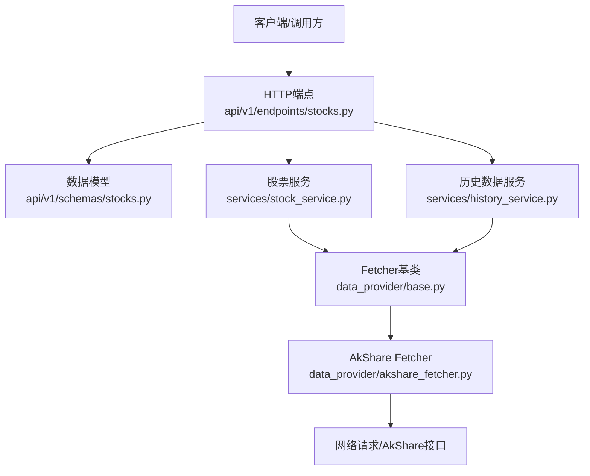
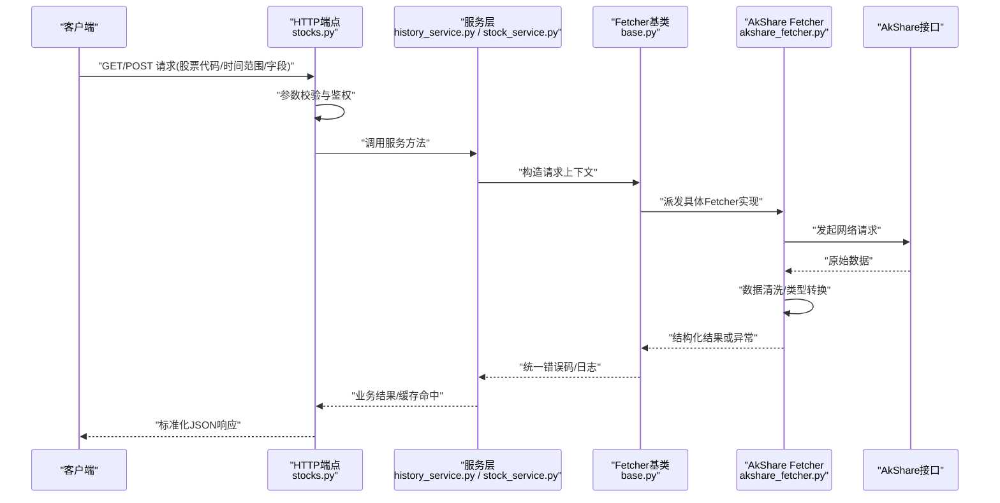
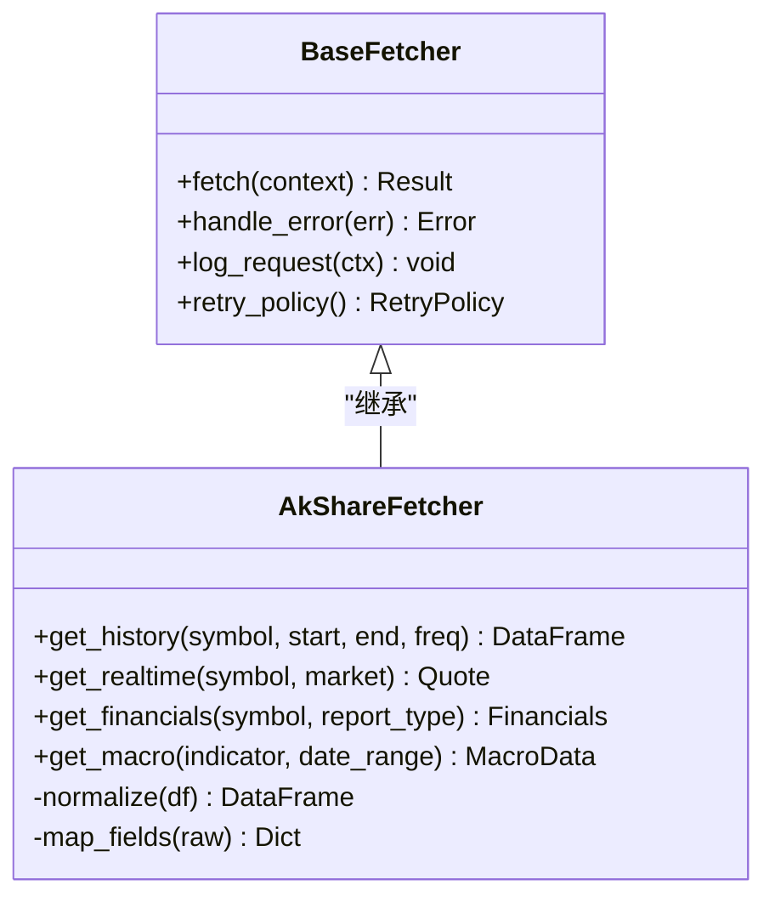
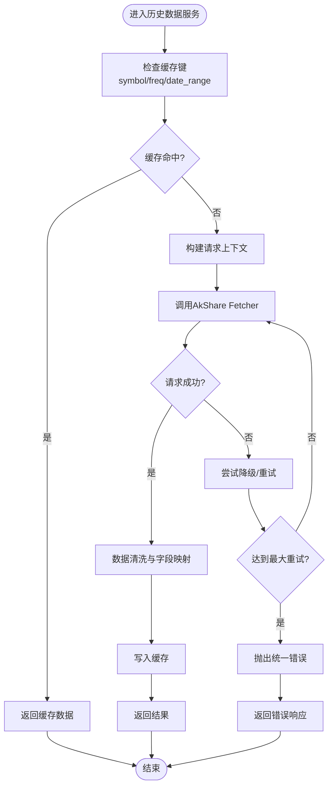
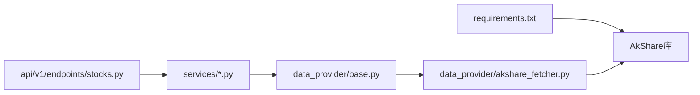

# AkShare数据源

<cite>
**本文档引用的文件**   
- [data_provider/akshare_fetcher.py](file://data_provider/akshare_fetcher.py)
- [data_provider/base.py](file://data_provider/base.py)
- [api/v1/endpoints/stocks.py](file://api/v1/endpoints/stocks.py)
- [api/v1/schemas/stocks.py](file://api/v1/schemas/stocks.py)
- [services/history_service.py](file://services/history_service.py)
- [services/stock_service.py](file://services/stock_service.py)
- [tests/test_akshare_history_timeout.py](file://tests/test_akshare_history_timeout.py)
- [tests/test_akshare_realtime_logging.py](file://tests/test_akshare_realtime_logging.py)
- [requirements.txt](file://requirements.txt)
</cite>

## 目录
1. [简介](#简介)
2. [项目结构](#项目结构)
3. [核心组件](#核心组件)
4. [架构总览](#架构总览)
5. [详细组件分析](#详细组件分析)
6. [依赖关系分析](#依赖关系分析)
7. [性能与优化](#性能与优化)
8. [故障排查指南](#故障排查指南)
9. [结论](#结论)
10. [附录：接口使用示例与最佳实践](#附录接口使用示例与最佳实践)

## 简介
本文件面向需要在系统中接入AkShare作为开源财经数据源的开发者，提供从配置、接入到调用的完整说明。AkShare无需API密钥即可获取A股、港股、美股等多市场数据，包括股票信息、历史行情、财务报表与宏观经济数据等。本项目通过统一的Fetchers抽象层对AkShare进行封装，向上暴露一致的API与服务接口，便于在Web API、后台任务与策略分析中复用。

## 项目结构
围绕AkShare的数据接入主要涉及以下模块：
- data_provider/akshare_fetcher.py：AkShare数据拉取实现，统一对外暴露历史行情、实时行情、财务指标等能力
- data_provider/base.py：数据Fetcher基类，定义统一接口与错误处理约定
- api/v1/endpoints/stocks.py：HTTP端点，将上层请求路由至服务层
- api/v1/schemas/stocks.py：请求/响应数据结构定义
- services/history_service.py：历史数据服务编排（含缓存、重试、并发控制）
- services/stock_service.py：股票基础信息与多市场适配服务
- tests/*：针对AkShare的超时、日志、异常路径测试用例
- requirements.txt：第三方依赖声明（包含AkShare）

图表来源 
- [api/v1/endpoints/stocks.py](file://api/v1/endpoints/stocks.py)
- [api/v1/schemas/stocks.py](file://api/v1/schemas/stocks.py)
- [services/stock_service.py](file://services/stock_service.py)
- [services/history_service.py](file://services/history_service.py)
- [data_provider/base.py](file://data_provider/base.py)
- [data_provider/akshare_fetcher.py](file://data_provider/akshare_fetcher.py)

章节来源
- [data_provider/akshare_fetcher.py](file://data_provider/akshare_fetcher.py)
- [data_provider/base.py](file://data_provider/base.py)
- [api/v1/endpoints/stocks.py](file://api/v1/endpoints/stocks.py)
- [api/v1/schemas/stocks.py](file://api/v1/schemas/stocks.py)
- [services/history_service.py](file://services/history_service.py)
- [services/stock_service.py](file://services/stock_service.py)

## 核心组件
- AkShare Fetcher：封装对AkShare各接口的调用，负责参数校验、网络请求、结果解析与异常转换
- Fetcher基类：定义统一的数据获取接口、错误码、重试策略与日志规范
- 服务层：HistoryService与StockService组合多个Fetcher，提供缓存、并发、限流与降级能力
- HTTP端点：接收外部请求，校验输入，调用服务层并返回标准化响应

章节来源
- [data_provider/akshare_fetcher.py](file://data_provider/akshare_fetcher.py)
- [data_provider/base.py](file://data_provider/base.py)
- [services/history_service.py](file://services/history_service.py)
- [services/stock_service.py](file://services/stock_service.py)
- [api/v1/endpoints/stocks.py](file://api/v1/endpoints/stocks.py)
- [api/v1/schemas/stocks.py](file://api/v1/schemas/stocks.py)

## 架构总览
下图展示从HTTP请求到AkShare数据源的端到端流程，包括数据解析、格式转换与异常处理的关键节点。

图表来源 
- [api/v1/endpoints/stocks.py](file://api/v1/endpoints/stocks.py)
- [services/history_service.py](file://services/history_service.py)
- [services/stock_service.py](file://services/stock_service.py)
- [data_provider/base.py](file://data_provider/base.py)
- [data_provider/akshare_fetcher.py](file://data_provider/akshare_fetcher.py)

## 详细组件分析

### AkShare Fetcher 组件
- 职责：对接AkShare的历史行情、实时行情、财务指标、宏观数据等接口；完成字段映射、单位换算、缺失值处理
- 关键能力：
  - 多市场支持：A股、港股、美股代码前缀与后缀处理
  - 数据覆盖：日/周/月K线、分钟级行情、财报三表、宏观指标
  - 更新频率：遵循AkSource源站更新节奏（通常T+1或盘中实时更新，视接口而定）
  - 无API密钥：直接公开接口访问，适合快速验证与轻量场景
- 限制与风险：
  - 稳定性受上游网站反爬与限流影响
  - 字段命名与返回结构可能随版本变化
  - 高频并发需配合限流与退避策略

图表来源 
- [data_provider/base.py](file://data_provider/base.py)
- [data_provider/akshare_fetcher.py](file://data_provider/akshare_fetcher.py)

章节来源
- [data_provider/akshare_fetcher.py](file://data_provider/akshare_fetcher.py)
- [data_provider/base.py](file://data_provider/base.py)

### 历史数据服务（HistoryService）
- 职责：编排历史数据获取，提供缓存、重试、并发与降级
- 关键点：
  - 缓存策略：按symbol+freq+date_range维度缓存，避免重复请求
  - 并发控制：限制并发数，防止触发上游限流
  - 降级策略：当AkShare不可用时回退到其他数据源或返回部分可用数据
  - 异常处理：区分网络异常、数据不完整、字段缺失等场景

图表来源 
- [services/history_service.py](file://services/history_service.py)
- [data_provider/akshare_fetcher.py](file://data_provider/akshare_fetcher.py)

章节来源
- [services/history_service.py](file://services/history_service.py)
- [data_provider/akshare_fetcher.py](file://data_provider/akshare_fetcher.py)

### 股票信息服务（StockService）
- 职责：获取股票基本信息、板块归属、指数映射、跨市场符号规范化
- 关键点：
  - 符号规范化：统一A/H/U前缀与交易所后缀
  - 多源融合：优先AkShare，失败时回退其他Fetcher
  - 元数据缓存：股票名称、行业分类等低频数据缓存

章节来源
- [services/stock_service.py](file://services/stock_service.py)
- [data_provider/akshare_fetcher.py](file://data_provider/akshare_fetcher.py)

### HTTP端点与数据模型
- 端点：stocks.py提供REST接口，接收symbol、market、start/end、freq等参数
- 模型：schemas/stocks.py定义请求体与响应体的Pydantic模型，确保强类型校验与文档生成

章节来源
- [api/v1/endpoints/stocks.py](file://api/v1/endpoints/stocks.py)
- [api/v1/schemas/stocks.py](file://api/v1/schemas/stocks.py)

## 依赖关系分析
- 运行时依赖：AkShare库由requirements.txt引入，Fetcher通过该库访问公开数据接口
- 内部依赖：端点依赖服务层，服务层依赖Fetcher基类与具体实现
- 外部依赖：网络请求、可能的缓存存储（内存/Redis）、日志系统

图表来源 
- [requirements.txt](file://requirements.txt)
- [api/v1/endpoints/stocks.py](file://api/v1/endpoints/stocks.py)
- [services/history_service.py](file://services/history_service.py)
- [services/stock_service.py](file://services/stock_service.py)
- [data_provider/base.py](file://data_provider/base.py)
- [data_provider/akshare_fetcher.py](file://data_provider/akshare_fetcher.py)

章节来源
- [requirements.txt](file://requirements.txt)
- [api/v1/endpoints/stocks.py](file://api/v1/endpoints/stocks.py)
- [services/history_service.py](file://services/history_service.py)
- [services/stock_service.py](file://services/stock_service.py)
- [data_provider/base.py](file://data_provider/base.py)
- [data_provider/akshare_fetcher.py](file://data_provider/akshare_fetcher.py)

## 性能与优化
- 网络请求优化
  - 合理设置超时与重试次数，避免长时间阻塞
  - 使用连接池与Keep-Alive减少握手开销
  - 批量请求合并，降低上游限流触发概率
- 数据缓存策略
  - 按查询维度建立缓存键（symbol、freq、日期范围）
  - 设置合理的TTL，平衡新鲜度与命中率
  - 热点数据预取与懒加载结合
- 并发访问控制
  - 限制并发数，避免打满上游带宽
  - 令牌桶/漏桶限流，平滑突发流量
  - 异步IO提升吞吐，但注意CPU密集型处理的隔离

[本节为通用指导，不直接分析具体文件]

## 故障排查指南
- 常见问题
  - 超时：AkShare接口响应慢或网络抖动导致请求超时
  - 限流：频繁请求触发上游IP封禁或速率限制
  - 数据不一致：字段名变更、缺失列、数据类型变化
  - 跨市场符号错误：A/H/U前缀或交易所后缀不规范
- 定位手段
  - 查看Fetcher日志与错误码
  - 检查缓存键是否命中
  - 对比上游接口返回结构与预期差异
  - 使用最小化请求复现问题
- 修复建议
  - 增加重试与退避策略
  - 调整并发与限流参数
  - 增强字段映射与容错逻辑
  - 完善符号规范化与校验

章节来源
- [tests/test_akshare_history_timeout.py](file://tests/test_akshare_history_timeout.py)
- [tests/test_akshare_realtime_logging.py](file://tests/test_akshare_realtime_logging.py)
- [data_provider/akshare_fetcher.py](file://data_provider/akshare_fetcher.py)
- [data_provider/base.py](file://data_provider/base.py)

## 结论
通过统一的Fetcher抽象与服务层编排，本项目将AkShare无缝集成到数据管道中，既保留了其“免密钥”的优势，又通过缓存、并发与降级机制提升了稳定性与性能。建议在生产环境加强监控与告警，持续跟踪上游接口变化，确保数据质量与可用性。

[本节为总结性内容，不直接分析具体文件]

## 附录：接口使用示例与最佳实践
- 配置与安装
  - 安装依赖：确保requirements.txt中的AkShare已安装
  - 环境变量：如需代理或自定义超时，可在运行环境中配置
- 调用步骤
  - 选择市场与标的：明确A/H/U前缀与交易所后缀
  - 构造请求参数：symbol、market、start/end、freq、fields
  - 调用HTTP端点：GET/POST对应历史行情或实时行情
  - 解析响应：根据schemas/stocks.py定义的字段进行消费
- 数据解析与转换
  - 统一时间戳与时区
  - 缺失值填充与异常值过滤
  - 数值单位换算（如价格小数位、成交量单位）
- 异常处理
  - 捕获网络异常与数据异常
  - 记录错误上下文（symbol、参数、时间）
  - 触发降级或告警
- 性能优化清单
  - 启用缓存并设置合理TTL
  - 限制并发与请求频率
  - 使用异步IO与连接池
  - 热点数据预取与增量更新

[本节为通用指导，不直接分析具体文件]