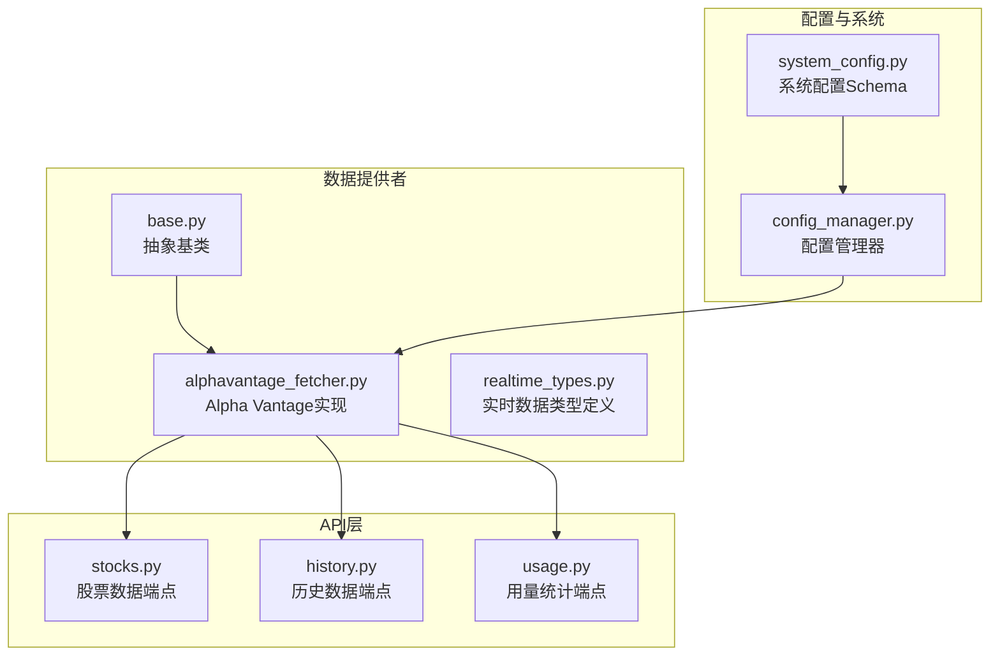
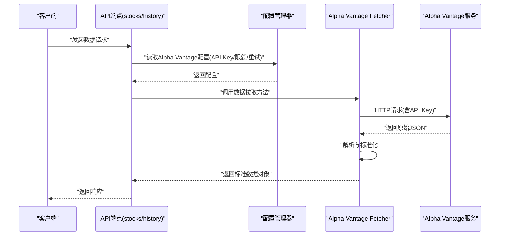
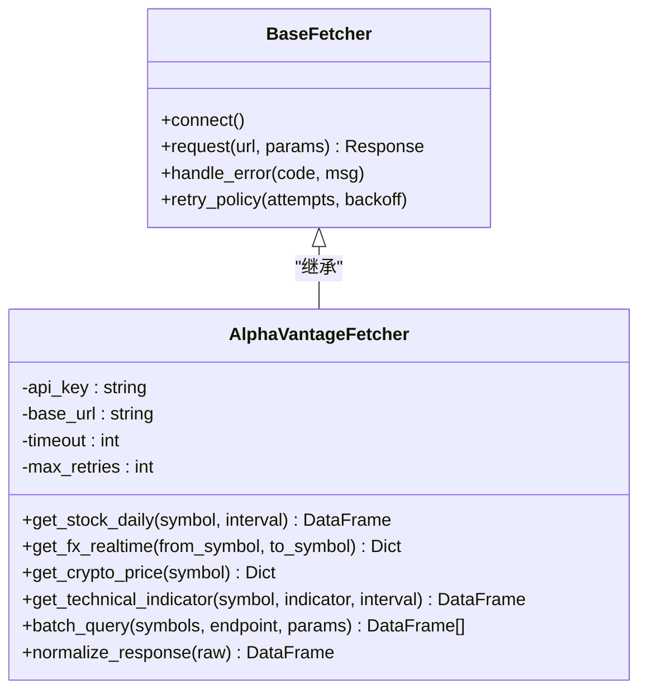
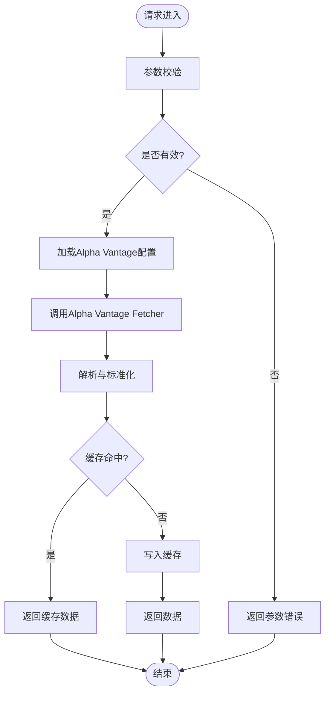
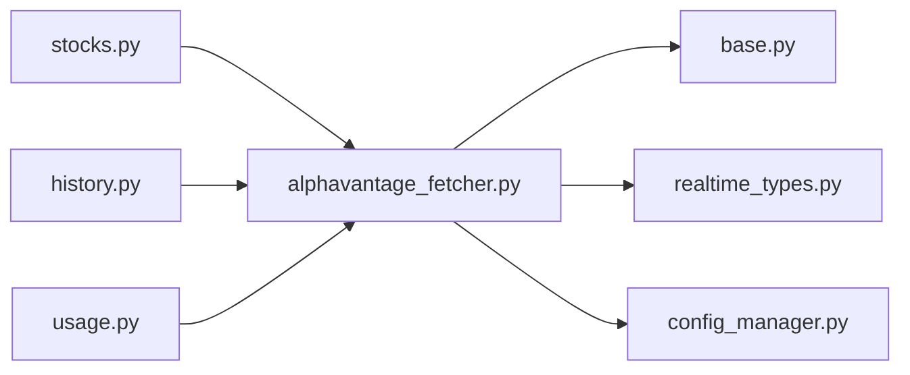

# Alpha Vantage数据源

<cite>
**本文档引用的文件**   
- [alphavantage_fetcher.py](file://data_provider/alphavantage_fetcher.py)
- [test_alphavantage_fetcher.py](file://tests/test_alphavantage_fetcher.py)
- [base.py](file://data_provider/base.py)
- [realtime_types.py](file://data_provider/realtime_types.py)
- [config_manager.py](file://src/core/config_manager.py)
- [system_config.py](file://api/v1/schemas/system_config.py)
- [stocks.py](file://api/v1/endpoints/stocks.py)
- [history.py](file://api/v1/endpoints/history.py)
- [usage.py](file://api/v1/endpoints/usage.py)
</cite>

## 目录
1. [简介](#简介)
2. [项目结构](#项目结构)
3. [核心组件](#核心组件)
4. [架构总览](#架构总览)
5. [详细组件分析](#详细组件分析)
6. [依赖关系分析](#依赖关系分析)
7. [性能考虑](#性能考虑)
8. [故障排查指南](#故障排查指南)
9. [结论](#结论)
10. [附录](#附录)

## 简介
本文件面向需要在系统中接入Alpha Vantage作为全球市场数据源的开发者与运维人员，提供从注册、配置到调用的完整说明。内容涵盖：
- API Key注册与系统配置方法
- 免费额度限制与付费套餐升级建议
- 全球股票市场、外汇汇率、加密货币价格、技术指标等数据的获取方式
- 时间序列数据、批量查询、数据标准化的调用方法与示例路径
- 错误处理机制、重试策略与缓存优化实践

## 项目结构
Alpha Vantage数据源在项目中以“数据提供者”模块的形式实现，位于 data_provider 目录下，并通过统一的基类接口对外暴露能力。相关API端点与配置管理分别位于 api/v1 与 src/core 目录中。

**图表来源** 
- [base.py](file://data_provider/base.py)
- [alphavantage_fetcher.py](file://data_provider/alphavantage_fetcher.py)
- [realtime_types.py](file://data_provider/realtime_types.py)
- [stocks.py](file://api/v1/endpoints/stocks.py)
- [history.py](file://api/v1/endpoints/history.py)
- [usage.py](file://api/v1/endpoints/usage.py)
- [config_manager.py](file://src/core/config_manager.py)
- [system_config.py](file://api/v1/schemas/system_config.py)

**章节来源**
- [alphavantage_fetcher.py](file://data_provider/alphavantage_fetcher.py)
- [base.py](file://data_provider/base.py)
- [realtime_types.py](file://data_provider/realtime_types.py)
- [stocks.py](file://api/v1/endpoints/stocks.py)
- [history.py](file://api/v1/endpoints/history.py)
- [usage.py](file://api/v1/endpoints/usage.py)
- [config_manager.py](file://src/core/config_manager.py)
- [system_config.py](file://api/v1/schemas/system_config.py)

## 核心组件
- 抽象基类（base.py）：定义数据提供者的统一接口，包括连接、认证、请求封装、错误处理与重试策略的约定。
- Alpha Vantage实现（alphavantage_fetcher.py）：基于Alpha Vantage官方API规范，实现股票、外汇、加密货币、技术指标等数据拉取逻辑，包含参数校验、响应解析、标准化输出。
- 实时数据类型（realtime_types.py）：定义跨数据源的统一数据结构，确保不同来源的数据在系统内保持一致的格式。
- 配置管理（config_manager.py, system_config.py）：集中管理Alpha Vantage的API Key、超时、并发、重试次数、缓存开关等运行时配置。
- API端点（stocks.py, history.py, usage.py）：对外暴露HTTP接口，将上层业务请求路由至Alpha Vantage数据提供者，并返回标准化结果。

**章节来源**
- [base.py](file://data_provider/base.py)
- [alphavantage_fetcher.py](file://data_provider/alphavantage_fetcher.py)
- [realtime_types.py](file://data_provider/realtime_types.py)
- [config_manager.py](file://src/core/config_manager.py)
- [system_config.py](file://api/v1/schemas/system_config.py)
- [stocks.py](file://api/v1/endpoints/stocks.py)
- [history.py](file://api/v1/endpoints/history.py)
- [usage.py](file://api/v1/endpoints/usage.py)

## 架构总览
Alpha Vantage数据源通过API层与配置管理协同工作，形成“请求→配置→数据提供者→标准化输出”的清晰链路。

**图表来源** 
- [stocks.py](file://api/v1/endpoints/stocks.py)
- [history.py](file://api/v1/endpoints/history.py)
- [config_manager.py](file://src/core/config_manager.py)
- [alphavantage_fetcher.py](file://data_provider/alphavantage_fetcher.py)

## 详细组件分析

### Alpha Vantage Fetcher 组件
该组件负责与Alpha Vantage服务交互，支持多种数据类型：
- 全球股票市场：日线、分钟线、周线、月线；前复权/后复权；指数映射
- 外汇汇率：实时汇率、历史汇率、交叉汇率
- 加密货币：主流币种价格、交易对、历史行情
- 技术指标：MA、MACD、RSI、布林带等，支持多周期与多指标组合

关键职责：
- 参数校验与签名生成（API Key注入）
- HTTP请求封装与异常捕获
- 响应解析与字段映射
- 数据标准化（统一列名、单位、时区）
- 批量查询与分页处理
- 错误码映射与友好提示

**图表来源** 
- [base.py](file://data_provider/base.py)
- [alphavantage_fetcher.py](file://data_provider/alphavantage_fetcher.py)

**章节来源**
- [alphavantage_fetcher.py](file://data_provider/alphavantage_fetcher.py)
- [base.py](file://data_provider/base.py)

### API端点集成
- 股票端点（stocks.py）：接收股票代码、时间范围、复权方式等参数，调用Alpha Vantage获取日K或分钟K数据，返回标准化表格。
- 历史端点（history.py）：支持长周期历史数据拉取，内置分页与增量更新逻辑。
- 用量端点（usage.py）：统计Alpha Vantage API调用次数、剩余配额、错误率等，便于监控与告警。

**图表来源** 
- [stocks.py](file://api/v1/endpoints/stocks.py)
- [history.py](file://api/v1/endpoints/history.py)
- [usage.py](file://api/v1/endpoints/usage.py)
- [alphavantage_fetcher.py](file://data_provider/alphavantage_fetcher.py)

**章节来源**
- [stocks.py](file://api/v1/endpoints/stocks.py)
- [history.py](file://api/v1/endpoints/history.py)
- [usage.py](file://api/v1/endpoints/usage.py)

### 配置与系统设置
- API Key注册：在Alpha Vantage官网注册账号并获取API Key，建议在环境变量或配置文件中进行安全存储。
- 系统配置项：
  - alpha_vantage_api_key：必填，用于身份认证
  - alpha_vantage_timeout：HTTP请求超时（秒）
  - alpha_vantage_max_retries：失败重试次数
  - alpha_vantage_cache_enabled：是否启用本地缓存
  - alpha_vantage_rate_limit：每分钟最大请求数（免费账户通常为5次/分钟）
- 配置生效：通过配置管理器动态加载，无需重启服务。

**章节来源**
- [config_manager.py](file://src/core/config_manager.py)
- [system_config.py](file://api/v1/schemas/system_config.py)

## 依赖关系分析
Alpha Vantage数据源依赖于以下内部模块：
- base.py：抽象基类，定义通用行为
- realtime_types.py：统一数据结构，确保跨源一致性
- config_manager.py：运行时配置注入
- API端点：stocks.py、history.py、usage.py

外部依赖：
- Alpha Vantage官方API（HTTP REST）
- 可选：HTTP客户端库（如requests/httpx）、缓存后端（如Redis/本地文件）

**图表来源** 
- [alphavantage_fetcher.py](file://data_provider/alphavantage_fetcher.py)
- [base.py](file://data_provider/base.py)
- [realtime_types.py](file://data_provider/realtime_types.py)
- [config_manager.py](file://src/core/config_manager.py)
- [stocks.py](file://api/v1/endpoints/stocks.py)
- [history.py](file://api/v1/endpoints/history.py)
- [usage.py](file://api/v1/endpoints/usage.py)

**章节来源**
- [alphavantage_fetcher.py](file://data_provider/alphavantage_fetcher.py)
- [base.py](file://data_provider/base.py)
- [realtime_types.py](file://data_provider/realtime_types.py)
- [config_manager.py](file://src/core/config_manager.py)
- [stocks.py](file://api/v1/endpoints/stocks.py)
- [history.py](file://api/v1/endpoints/history.py)
- [usage.py](file://api/v1/endpoints/usage.py)

## 性能考虑
- 缓存策略：对热点数据（如主要指数、热门币种）启用本地缓存，减少重复请求。
- 批量查询：合并多个标的的请求，降低网络开销与限流压力。
- 异步并发：在高并发场景下使用异步IO提升吞吐。
- 分页与增量：历史数据采用分页拉取，仅更新变化部分。
- 超时与重试：合理设置超时时间与退避策略，避免雪崩效应。

[本节为通用指导，不直接分析具体文件]

## 故障排查指南
常见问题与解决方案：
- API Key无效：检查配置是否正确注入，确认Alpha Vantage账户状态正常。
- 请求超时：增加超时时间或检查网络连通性。
- 限流错误：降低请求频率，启用队列与退避重试。
- 数据缺失：检查标的代码映射，确认交易所支持情况。
- 解析错误：查看原始响应日志，核对字段映射规则。

调试建议：
- 启用详细日志，记录请求URL、参数、响应体与错误堆栈。
- 使用测试用例验证关键路径，参考测试文件中的模拟与断言。

**章节来源**
- [test_alphavantage_fetcher.py](file://tests/test_alphavantage_fetcher.py)

## 结论
Alpha Vantage数据源在本项目中实现了稳定、可扩展的全球市场数据接入能力。通过统一的抽象接口、完善的配置管理与错误处理机制，能够高效支撑股票、外汇、加密货币与技术指标的多样化需求。建议在生产环境中结合缓存、批量与异步策略，最大化利用免费额度并平滑过渡至付费套餐。

[本节为总结性内容，不直接分析具体文件]

## 附录

### 配置步骤
1. 在Alpha Vantage官网注册账号并获取API Key。
2. 在系统配置中设置alpha_vantage_api_key及其他运行参数。
3. 通过API端点验证连接是否正常。

### 调用示例路径
- 股票日线数据：参考stocks.py中的日K拉取逻辑
- 外汇实时汇率：参考alphavantage_fetcher.py中的fx接口
- 加密货币价格：参考alphavantage_fetcher.py中的crypto接口
- 技术指标计算：参考alphavantage_fetcher.py中的indicator接口
- 批量查询：参考alphavantage_fetcher.py中的batch_query方法

### 错误码与重试
- 常见HTTP错误码：401（未授权）、429（限流）、500（服务端错误）
- 重试策略：指数退避，最大重试次数可配置
- 降级方案：切换备用数据源或返回缓存数据

**章节来源**
- [alphavantage_fetcher.py](file://data_provider/alphavantage_fetcher.py)
- [stocks.py](file://api/v1/endpoints/stocks.py)
- [history.py](file://api/v1/endpoints/history.py)
- [usage.py](file://api/v1/endpoints/usage.py)
- [test_alphavantage_fetcher.py](file://tests/test_alphavantage_fetcher.py)