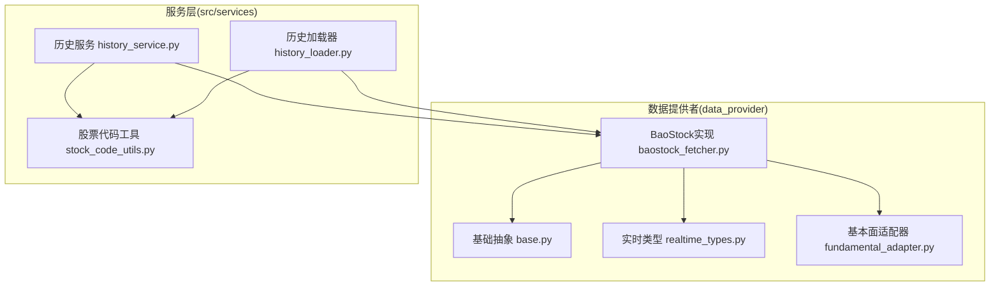
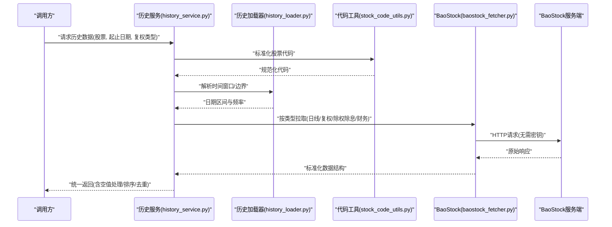
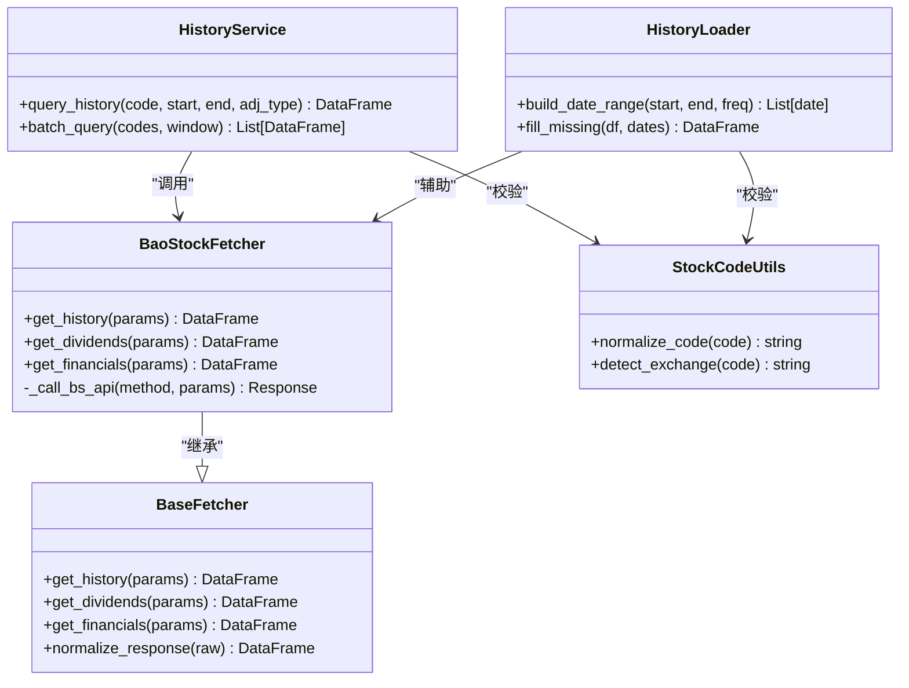

# BaoStock数据源

<cite>
**本文引用的文件**   
- [baostock_fetcher.py](file://data_provider/baostock_fetcher.py)
- [base.py](file://data_provider/base.py)
- [history_service.py](file://src/services/history_service.py)
- [history_loader.py](file://src/services/history_loader.py)
- [stock_code_utils.py](file://src/services/stock_code_utils.py)
- [realtime_types.py](file://data_provider/realtime_types.py)
- [fundamental_adapter.py](file://data_provider/fundamental_adapter.py)
- [test_a_share_fetcher_code_conversion.py](file://tests/test_a_share_fetcher_code_conversion.py)
</cite>

## 目录
1. [简介](#简介)
2. [项目结构](#项目结构)
3. [核心组件](#核心组件)
4. [架构总览](#架构总览)
5. [详细组件分析](#详细组件分析)
6. [依赖关系分析](#依赖关系分析)
7. [性能与稳定性建议](#性能与稳定性建议)
8. [故障排查指南](#故障排查指南)
9. [结论](#结论)
10. [附录：使用示例与最佳实践](#附录使用示例与最佳实践)

## 简介
本文件面向需要在系统中接入A股历史数据的开发者，聚焦BaoStock作为A股历史数据源的配置、接入与使用。BaoStock无需注册和API密钥，适合快速集成与本地开发测试。文档涵盖：
- 数据覆盖范围与质量说明（以仓库实现为准）
- A股历史行情、除权除息、财务数据的获取方式
- 代码示例路径（不直接粘贴代码，提供源码位置）
- 连接池管理、请求限流、错误重试等最佳实践
- 与系统数据模型的映射关系

## 项目结构
BaoStock数据源位于 data_provider 模块中，通过统一的Fetcher基类与上层服务进行解耦。历史数据加载由 services 层统一编排，支持多种数据源切换与适配。

图表来源 
- [base.py](file://data_provider/base.py)
- [baostock_fetcher.py](file://data_provider/baostock_fetcher.py)
- [realtime_types.py](file://data_provider/realtime_types.py)
- [fundamental_adapter.py](file://data_provider/fundamental_adapter.py)
- [history_service.py](file://src/services/history_service.py)
- [history_loader.py](file://src/services/history_loader.py)
- [stock_code_utils.py](file://src/services/stock_code_utils.py)

章节来源
- [baostock_fetcher.py](file://data_provider/baostock_fetcher.py)
- [base.py](file://data_provider/base.py)
- [history_service.py](file://src/services/history_service.py)
- [history_loader.py](file://src/services/history_loader.py)
- [stock_code_utils.py](file://src/services/stock_code_utils.py)
- [realtime_types.py](file://data_provider/realtime_types.py)
- [fundamental_adapter.py](file://data_provider/fundamental_adapter.py)

## 核心组件
- 基础抽象（Base Fetcher）
  - 定义统一的数据获取接口、参数校验、异常封装与返回格式规范，便于多数据源替换。
- BaoStock Fetcher
  - 实现A股历史K线、复权因子、除权除息、财务报表等接口的调用与结果标准化。
- 历史服务（History Service）
  - 对外暴露统一的历史数据查询API，负责参数组装、缓存策略、并发控制与错误处理。
- 历史加载器（History Loader）
  - 负责时间窗口解析、日期边界处理、缺失日填充与序列对齐。
- 股票代码工具（Stock Code Utils）
  - 负责A股代码前缀转换（如沪市/深市）、交易所识别与规范化。
- 实时类型与基本面适配器
  - 为不同数据源返回的字段做统一类型与命名映射，保证下游一致性。

章节来源
- [base.py](file://data_provider/base.py)
- [baostock_fetcher.py](file://data_provider/baostock_fetcher.py)
- [history_service.py](file://src/services/history_service.py)
- [history_loader.py](file://src/services/history_loader.py)
- [stock_code_utils.py](file://src/services/stock_code_utils.py)
- [realtime_types.py](file://data_provider/realtime_types.py)
- [fundamental_adapter.py](file://data_provider/fundamental_adapter.py)

## 架构总览
下图展示从业务调用到BaoStock数据源的完整流程，包括参数校验、代码转换、数据拉取、清洗与返回。

图表来源 
- [history_service.py](file://src/services/history_service.py)
- [history_loader.py](file://src/services/history_loader.py)
- [stock_code_utils.py](file://src/services/stock_code_utils.py)
- [baostock_fetcher.py](file://data_provider/baostock_fetcher.py)

## 详细组件分析

### BaoStock Fetcher 实现要点
- 功能覆盖
  - 历史K线（日线/周线/月线）
  - 复权因子（用于价格复权计算）
  - 除权除息事件（分红派息、配股配息）
  - 财务报表（利润表、资产负债表、现金流量表）
- 数据标准化
  - 将BaoStock返回的字段名与数据类型转换为系统内部统一模型
  - 对缺失值、异常值进行清理与标记
- 错误处理
  - 网络超时、限流、无数据等场景的统一异常封装与重试提示

章节来源
- [baostock_fetcher.py](file://data_provider/baostock_fetcher.py)
- [realtime_types.py](file://data_provider/realtime_types.py)
- [fundamental_adapter.py](file://data_provider/fundamental_adapter.py)

### 历史服务与加载器协作
- 历史服务
  - 接收外部请求，校验参数，选择数据源（BaoStock优先或回退）
  - 协调缓存、并发与限流策略
- 历史加载器
  - 解析用户输入的时间窗口，生成连续交易日序列
  - 处理停牌、节假日导致的缺失日填充策略

章节来源
- [history_service.py](file://src/services/history_service.py)
- [history_loader.py](file://src/services/history_loader.py)

### 股票代码转换与校验
- 支持A股代码前缀自动识别与转换（沪市/深市）
- 统一大小写与长度校验，避免非法代码进入下游

章节来源
- [stock_code_utils.py](file://src/services/stock_code_utils.py)
- [test_a_share_fetcher_code_conversion.py](file://tests/test_a_share_fetcher_code_conversion.py)

### 数据模型映射
- 统一字段命名（如日期、开盘、收盘、最高、最低、成交量、成交额）
- 复权因子与除权除息事件与价格序列的对齐
- 财务报表三表字段映射至标准财务指标

章节来源
- [realtime_types.py](file://data_provider/realtime_types.py)
- [fundamental_adapter.py](file://data_provider/fundamental_adapter.py)

## 依赖关系分析
BaoStock Fetcher依赖基础抽象与类型定义，被历史服务与加载器调用；股票代码工具贯穿整个流程，确保输入合法性。

图表来源 
- [base.py](file://data_provider/base.py)
- [baostock_fetcher.py](file://data_provider/baostock_fetcher.py)
- [history_service.py](file://src/services/history_service.py)
- [history_loader.py](file://src/services/history_loader.py)
- [stock_code_utils.py](file://src/services/stock_code_utils.py)

章节来源
- [base.py](file://data_provider/base.py)
- [baostock_fetcher.py](file://data_provider/baostock_fetcher.py)
- [history_service.py](file://src/services/history_service.py)
- [history_loader.py](file://src/services/history_loader.py)
- [stock_code_utils.py](file://src/services/stock_code_utils.py)

## 性能与稳定性建议
- 连接池管理
  - 复用HTTP客户端实例，减少握手开销；在高频批量拉取时启用连接池与Keep-Alive。
- 请求限流
  - 对BaoStock接口设置合理QPS限制，避免触发服务端限流；必要时增加指数退避重试。
- 错误重试
  - 针对网络抖动与临时限流，采用可配置的重试次数与退避策略；区分可重试与不可重试异常。
- 数据清洗
  - 对缺失值进行插值或标记；对异常大值进行截断；统一时间戳与时区。
- 缓存策略
  - 对热点股票与固定时间窗口的数据进行短期缓存，降低重复请求。
- 并发控制
  - 批量拉取时使用线程池或协程池，限制并发度以避免压垮上游。

[本节为通用指导，不直接分析具体文件]

## 故障排查指南
- 常见问题
  - 代码前缀错误导致无法识别交易所：检查代码规范化逻辑。
  - 时间窗口包含非交易日或停牌日：确认日期序列构建与缺失填充策略。
  - 数据为空或字段缺失：检查BaoStock接口返回结构与字段映射。
  - 限流或超时：调整QPS与重试策略，观察日志中的错误码。
- 定位方法
  - 查看历史服务与加载器的日志输出，确认参数与中间结果。
  - 使用单元测试用例验证代码转换与边界条件。

章节来源
- [test_a_share_fetcher_code_conversion.py](file://tests/test_a_share_fetcher_code_conversion.py)

## 结论
BaoStock作为无需注册与API密钥的A股数据源，适合快速集成与本地测试。通过统一的Fetch抽象与服务层编排，系统能够稳定地获取历史行情、除权除息与财务数据，并在数据清洗、时间序列处理与错误处理方面具备良好扩展性。建议在生产环境结合连接池、限流与重试策略，提升整体稳定性与性能。

[本节为总结性内容，不直接分析具体文件]

## 附录：使用示例与最佳实践
- 获取A股历史行情
  - 参考路径：[历史服务调用入口](file://src/services/history_service.py)
  - 参考路径：[BaoStock历史数据拉取实现](file://data_provider/baostock_fetcher.py)
- 获取除权除息信息
  - 参考路径：[除权除息接口调用](file://data_provider/baostock_fetcher.py)
  - 参考路径：[字段映射与标准化](file://data_provider/fundamental_adapter.py)
- 获取财务数据
  - 参考路径：[财务报表接口调用](file://data_provider/baostock_fetcher.py)
  - 参考路径：[财务字段映射](file://data_provider/fundamental_adapter.py)
- 数据清洗与时间序列处理
  - 参考路径：[日期窗口构建与缺失填充](file://src/services/history_loader.py)
  - 参考路径：[统一类型与命名](file://data_provider/realtime_types.py)
- 代码转换与校验
  - 参考路径：[A股代码规范化](file://src/services/stock_code_utils.py)
  - 参考路径：[单元测试验证](file://tests/test_a_share_fetcher_code_conversion.py)

章节来源
- [history_service.py](file://src/services/history_service.py)
- [baostock_fetcher.py](file://data_provider/baostock_fetcher.py)
- [fundamental_adapter.py](file://data_provider/fundamental_adapter.py)
- [history_loader.py](file://src/services/history_loader.py)
- [realtime_types.py](file://data_provider/realtime_types.py)
- [stock_code_utils.py](file://src/services/stock_code_utils.py)
- [test_a_share_fetcher_code_conversion.py](file://tests/test_a_share_fetcher_code_conversion.py)