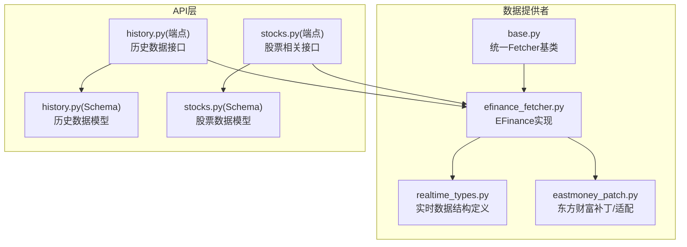
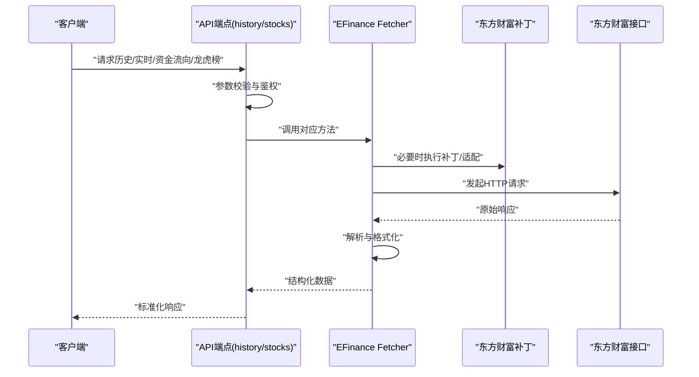
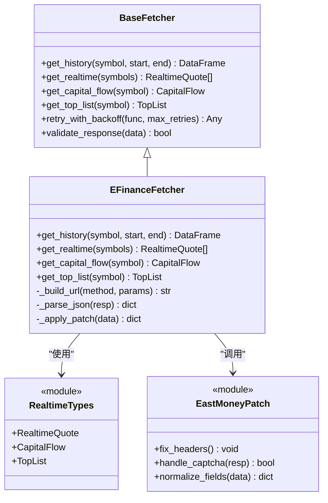
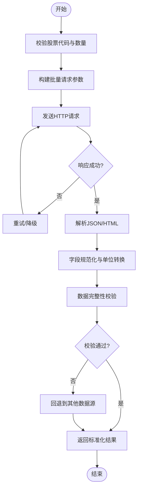
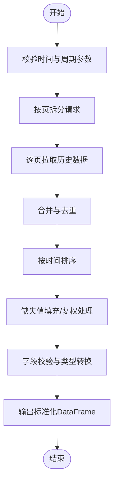
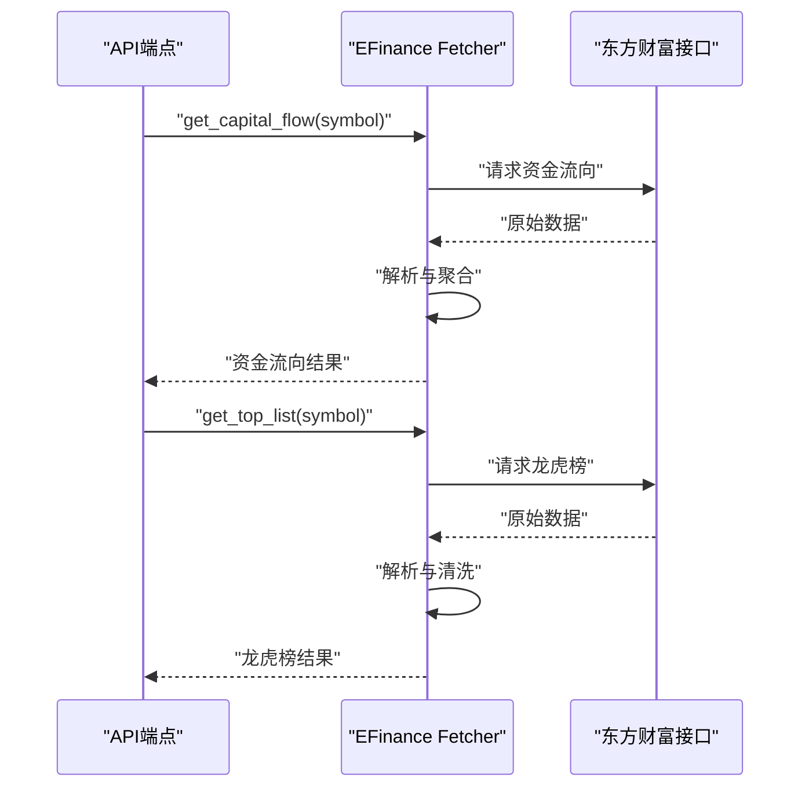
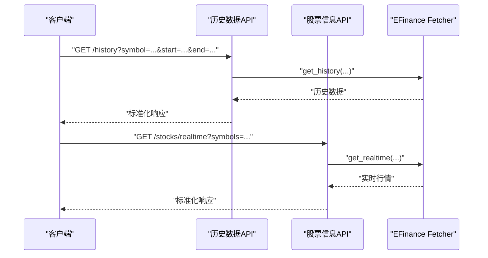
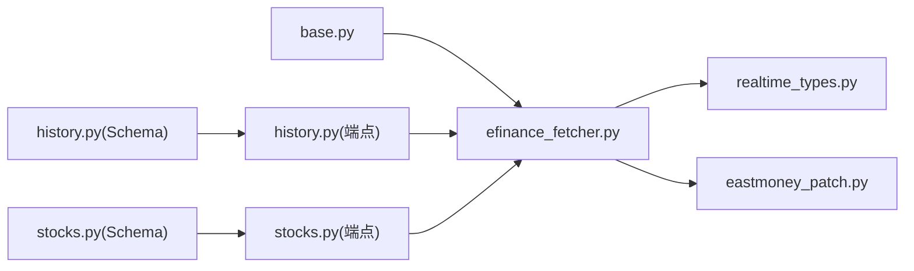

# Efinance数据源

<cite>
**本文引用的文件**   
- [efinance_fetcher.py](file://data_provider/efinance_fetcher.py)
- [base.py](file://data_provider/base.py)
- [realtime_types.py](file://data_provider/realtime_types.py)
- [eastmoney_patch.py](file://src/patches/eastmoney_patch.py)
- [test_efinance_main_indices.py](file://tests/test_efinance_main_indices.py)
- [history.py](file://api/v1/endpoints/history.py)
- [stocks.py](file://api/v1/endpoints/stocks.py)
- [history.py](file://api/v1/schemas/history.py)
- [stocks.py](file://api/v1/schemas/stocks.py)
</cite>

## 目录
1. [简介](#简介)
2. [项目结构](#项目结构)
3. [核心组件](#核心组件)
4. [架构总览](#架构总览)
5. [详细组件分析](#详细组件分析)
6. [依赖关系分析](#依赖关系分析)
7. [性能与稳定性](#性能与稳定性)
8. [故障排查指南](#故障排查指南)
9. [结论](#结论)
10. [附录：使用示例与最佳实践](#附录使用示例与最佳实践)

## 简介
本文件面向需要在系统中接入东方财富（Efinance）数据源的开发者，提供从配置、接入到使用的完整说明。内容涵盖：
- 基于东方财富网站数据的抓取方式与特点
- A股实时行情、历史数据、资金流向、龙虎榜等关键信息的获取方法
- 请求间隔控制、反爬虫策略应对、数据校验等关键技术点
- 与其他数据源的互补使用建议与回退策略

## 项目结构
Efinance数据源位于数据提供者模块中，通过统一的Fetcher接口对外暴露能力，并在API层暴露REST接口供上层调用。

图表来源
- [base.py](file://data_provider/base.py)
- [efinance_fetcher.py](file://data_provider/efinance_fetcher.py)
- [realtime_types.py](file://data_provider/realtime_types.py)
- [eastmoney_patch.py](file://src/patches/eastmoney_patch.py)
- [history.py](file://api/v1/endpoints/history.py)
- [stocks.py](file://api/v1/endpoints/stocks.py)
- [history.py](file://api/v1/schemas/history.py)
- [stocks.py](file://api/v1/schemas/stocks.py)

章节来源
- [efinance_fetcher.py](file://data_provider/efinance_fetcher.py)
- [base.py](file://data_provider/base.py)
- [realtime_types.py](file://data_provider/realtime_types.py)
- [eastmoney_patch.py](file://src/patches/eastmoney_patch.py)
- [history.py](file://api/v1/endpoints/history.py)
- [stocks.py](file://api/v1/endpoints/stocks.py)
- [history.py](file://api/v1/schemas/history.py)
- [stocks.py](file://api/v1/schemas/stocks.py)

## 核心组件
- 统一Fetcher基类：定义数据获取的统一接口、错误处理、重试与限流等通用逻辑。
- EFinance Fetcher：实现东方财富数据源的抓取逻辑，包括A股实时行情、历史K线、资金流向、龙虎榜等。
- 实时数据类型：定义实时行情的数据结构与字段规范，便于序列化与校验。
- 东方财富补丁：针对东方财富接口变化或反爬策略的适配与修复。

章节来源
- [base.py](file://data_provider/base.py)
- [efinance_fetcher.py](file://data_provider/efinance_fetcher.py)
- [realtime_types.py](file://data_provider/realtime_types.py)
- [eastmoney_patch.py](file://src/patches/eastmoney_patch.py)

## 架构总览
EFinance数据源在系统中的调用链路如下：
- 上层API端点接收请求，参数校验后调用对应的Fetcher。
- EFinance Fetcher根据业务类型选择具体抓取方法，构造请求并发送。
- 返回数据经解析与格式化后，按Schema进行校验并返回给调用方。

图表来源
- [history.py](file://api/v1/endpoints/history.py)
- [stocks.py](file://api/v1/endpoints/stocks.py)
- [efinance_fetcher.py](file://data_provider/efinance_fetcher.py)
- [eastmoney_patch.py](file://src/patches/eastmoney_patch.py)

## 详细组件分析

### EFinance Fetcher 组件
- 职责：封装东方财富数据源的请求、解析、格式化和错误处理；支持A股实时行情、历史K线、资金流向、龙虎榜等。
- 关键点：
  - 请求构造：根据标的代码、时间范围、指标类型生成URL与参数。
  - 数据解析：将JSON或HTML响应转换为内部数据结构。
  - 数据校验：依据实时数据类型Schema进行字段完整性检查。
  - 错误处理：网络异常、超时、反爬拦截、数据缺失等场景的处理与重试。
  - 限流与间隔：控制请求频率，避免触发反爬策略。

图表来源
- [base.py](file://data_provider/base.py)
- [efinance_fetcher.py](file://data_provider/efinance_fetcher.py)
- [realtime_types.py](file://data_provider/realtime_types.py)
- [eastmoney_patch.py](file://src/patches/eastmoney_patch.py)

章节来源
- [efinance_fetcher.py](file://data_provider/efinance_fetcher.py)
- [realtime_types.py](file://data_provider/realtime_types.py)
- [eastmoney_patch.py](file://src/patches/eastmoney_patch.py)

### 实时行情获取流程
- 输入：股票代码列表（支持A股）。
- 处理：批量构造请求，并发拉取，合并结果，去重与排序。
- 输出：标准化的实时报价数组，包含价格、涨跌幅、成交量等字段。

图表来源
- [efinance_fetcher.py](file://data_provider/efinance_fetcher.py)
- [realtime_types.py](file://data_provider/realtime_types.py)

章节来源
- [efinance_fetcher.py](file://data_provider/efinance_fetcher.py)
- [realtime_types.py](file://data_provider/realtime_types.py)

### 历史数据获取流程
- 输入：股票代码、起止日期、复权方式、周期（日/周/月等）。
- 处理：分页拉取、合并、排序、缺失值填充。
- 输出：标准OHLCV表格（开、高、低、收、量），含时间索引。

图表来源
- [efinance_fetcher.py](file://data_provider/efinance_fetcher.py)

章节来源
- [efinance_fetcher.py](file://data_provider/efinance_fetcher.py)

### 资金流向与龙虎榜
- 资金流向：按个股或板块统计主力/散户资金净流入流出，支持多周期。
- 龙虎榜：获取上榜原因、买卖席位、成交金额等。

图表来源
- [efinance_fetcher.py](file://data_provider/efinance_fetcher.py)

章节来源
- [efinance_fetcher.py](file://data_provider/efinance_fetcher.py)

### 与API层的集成
- 历史数据接口：接收查询参数，调用EFinance Fetcher的历史数据方法，返回标准化结果。
- 股票信息接口：支持实时行情、基础信息、资金流向、龙虎榜等。

图表来源
- [history.py](file://api/v1/endpoints/history.py)
- [stocks.py](file://api/v1/endpoints/stocks.py)
- [history.py](file://api/v1/schemas/history.py)
- [stocks.py](file://api/v1/schemas/stocks.py)

章节来源
- [history.py](file://api/v1/endpoints/history.py)
- [stocks.py](file://api/v1/endpoints/stocks.py)
- [history.py](file://api/v1/schemas/history.py)
- [stocks.py](file://api/v1/schemas/stocks.py)

## 依赖关系分析
- EFinance Fetcher依赖统一基类提供的通用能力（重试、限流、校验）。
- 实时数据类型模块为返回值提供强类型约束。
- 东方财富补丁模块用于应对接口变更与反爬策略。
- API层通过端点与Schema对数据进行校验与序列化。

图表来源
- [base.py](file://data_provider/base.py)
- [efinance_fetcher.py](file://data_provider/efinance_fetcher.py)
- [realtime_types.py](file://data_provider/realtime_types.py)
- [eastmoney_patch.py](file://src/patches/eastmoney_patch.py)
- [history.py](file://api/v1/endpoints/history.py)
- [stocks.py](file://api/v1/endpoints/stocks.py)
- [history.py](file://api/v1/schemas/history.py)
- [stocks.py](file://api/v1/schemas/stocks.py)

章节来源
- [efinance_fetcher.py](file://data_provider/efinance_fetcher.py)
- [base.py](file://data_provider/base.py)
- [realtime_types.py](file://data_provider/realtime_types.py)
- [eastmoney_patch.py](file://src/patches/eastmoney_patch.py)
- [history.py](file://api/v1/endpoints/history.py)
- [stocks.py](file://api/v1/endpoints/stocks.py)
- [history.py](file://api/v1/schemas/history.py)
- [stocks.py](file://api/v1/schemas/stocks.py)

## 性能与稳定性
- 请求间隔控制：采用指数退避与随机抖动，避免触发反爬限制。
- 并发与限流：批量请求时限制并发数，防止服务端拒绝服务。
- 缓存策略：对热点数据（如指数、热门个股）进行短期缓存，降低重复请求。
- 降级与回退：当EFinance不可用时，自动切换至其他数据源（如Tushare、AkShare）。
- 数据校验：严格校验关键字段，缺失或异常值进行标记与填充。

[本节为通用指导，不直接分析具体文件]

## 故障排查指南
- 常见错误：
  - 网络超时：检查网络连通性与代理设置，增加超时阈值。
  - 反爬拦截：调整User-Agent、Cookie、请求间隔，启用验证码处理。
  - 数据缺失：检查标的代码是否正确，确认交易日历与复权方式。
  - 字段不一致：更新补丁模块以适配东方财富接口变更。
- 诊断步骤：
  - 查看日志中的错误码与堆栈。
  - 使用测试用例验证接口可用性（如主要指数测试）。
  - 对比不同数据源的结果一致性。

章节来源
- [test_efinance_main_indices.py](file://tests/test_efinance_main_indices.py)
- [eastmoney_patch.py](file://src/patches/eastmoney_patch.py)

## 结论
EFinance数据源为本系统提供了丰富的A股数据能力，包括实时行情、历史K线、资金流向与龙虎榜等。通过统一的Fetcher接口、严格的类型校验与稳健的错误处理机制，确保了数据的可用性与稳定性。在实际使用中，建议结合其他数据源形成互补与回退策略，以提升整体系统的鲁棒性。

[本节为总结性内容，不直接分析具体文件]

## 附录：使用示例与最佳实践
- 配置与初始化：
  - 在应用启动时初始化EFinance Fetcher实例，设置必要的请求头与代理。
  - 配置重试次数、超时时间与请求间隔。
- 获取A股实时行情：
  - 调用实时行情方法，传入股票代码列表，获取标准化报价数据。
- 获取历史数据：
  - 指定股票代码、起止日期与周期，获取OHLCV数据并进行复权处理。
- 获取资金流向与龙虎榜：
  - 分别调用对应方法，获取并按需聚合展示。
- 反爬虫策略应对：
  - 动态调整请求头与间隔，必要时引入验证码识别。
- 数据验证与格式化：
  - 使用Schema进行字段校验，缺失值填充与类型转换。
- 与其他数据源的互补使用：
  - 优先使用EFinance，失败时自动切换至备用数据源，确保数据连续性。

[本节为通用指导，不直接分析具体文件]