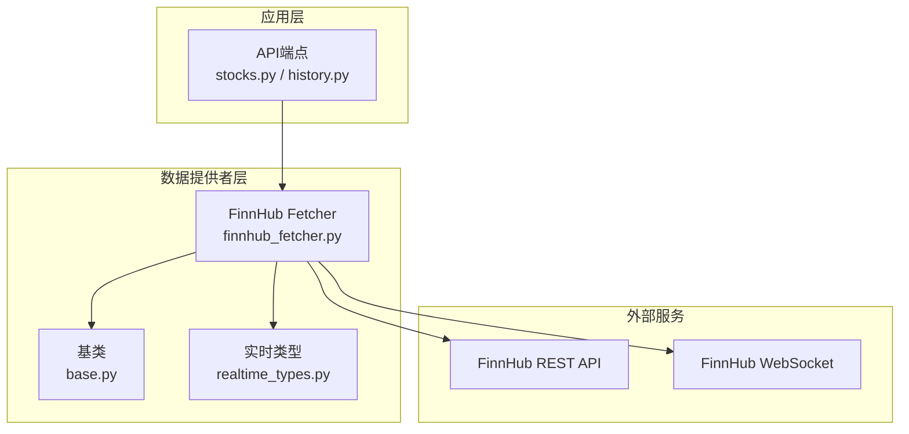
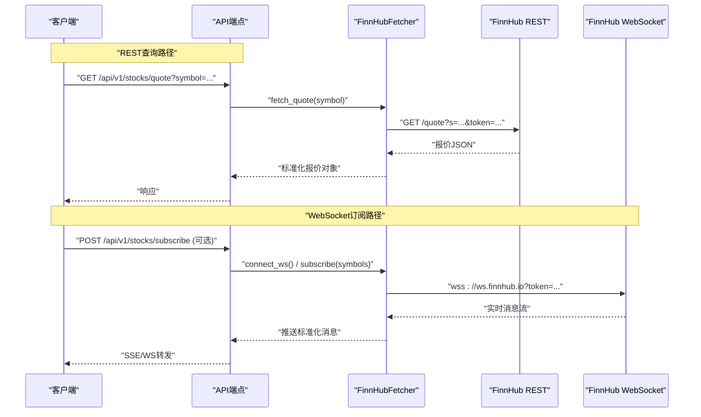
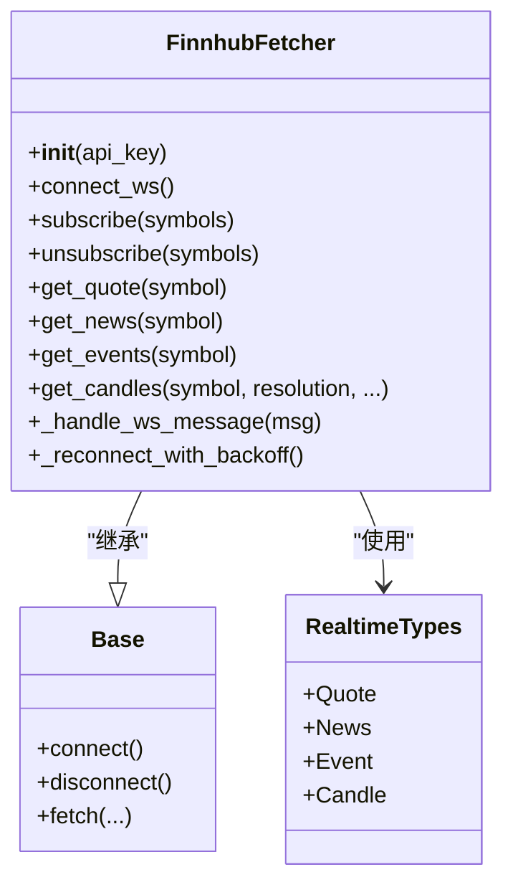
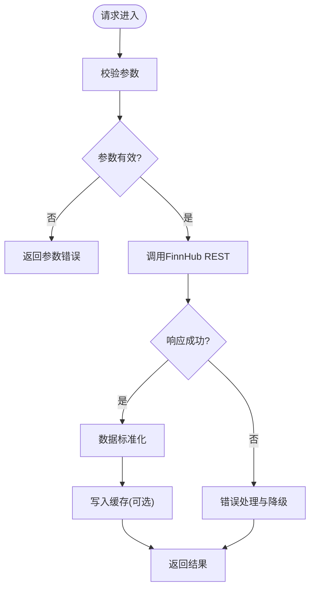
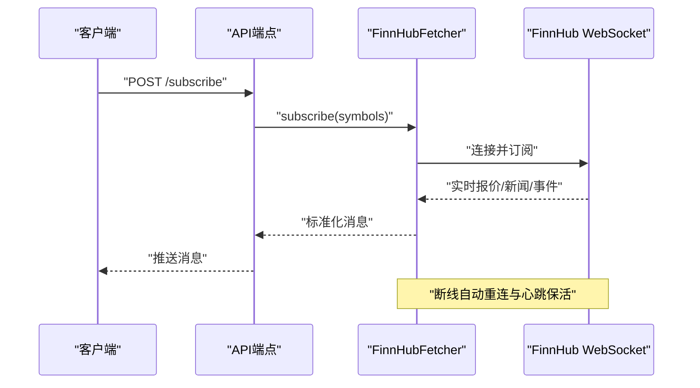
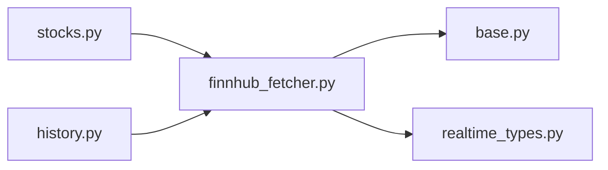

# FinnHub数据源

<cite>
**本文引用的文件**   
- [finnhub_fetcher.py](file://data_provider/finnhub_fetcher.py)
- [test_finnhub_fetcher.py](file://tests/test_finnhub_fetcher.py)
- [realtime_types.py](file://data_provider/realtime_types.py)
- [base.py](file://data_provider/base.py)
- [config.py](file://src/config.py)
- [stocks.py](file://api/v1/endpoints/stocks.py)
- [history.py](file://api/v1/endpoints/history.py)
- [usage.py](file://api/v1/endpoints/usage.py)
</cite>

## 目录
1. [简介](#简介)
2. [项目结构](#项目结构)
3. [核心组件](#核心组件)
4. [架构总览](#架构总览)
5. [详细组件分析](#详细组件分析)
6. [依赖关系分析](#依赖关系分析)
7. [性能考虑](#性能考虑)
8. [故障排查指南](#故障排查指南)
9. [结论](#结论)
10. [附录](#附录)

## 简介
本文件面向需要在系统中接入FinnHub作为美股实时与历史数据源的开发者，提供从API Key注册、免费额度限制说明、WebSocket连接配置到REST API与WebSocket使用示例的完整指南。内容涵盖：
- 美股实时报价订阅与消息处理
- 新闻数据获取
- 公司事件（财报、分红等）
- 技术图表数据（K线、分钟线等）
- 错误处理、重连机制与数据缓存策略

## 项目结构
FinnHub数据源位于数据提供者模块中，通过统一的Fetch接口对外暴露能力，并在API层以REST端点形式提供服务。关键位置如下：
- 数据提供者实现：data_provider/finnhub_fetcher.py
- 统一基类与类型定义：data_provider/base.py、data_provider/realtime_types.py
- API端点：api/v1/endpoints/stocks.py、api/v1/endpoints/history.py
- 配置管理：src/config.py
- 测试用例：tests/test_finnhub_fetcher.py

**图示来源** 
- [finnhub_fetcher.py](file://data_provider/finnhub_fetcher.py)
- [base.py](file://data_provider/base.py)
- [realtime_types.py](file://data_provider/realtime_types.py)
- [stocks.py](file://api/v1/endpoints/stocks.py)
- [history.py](file://api/v1/endpoints/history.py)

**章节来源**
- [finnhub_fetcher.py](file://data_provider/finnhub_fetcher.py)
- [base.py](file://data_provider/base.py)
- [realtime_types.py](file://data_provider/realtime_types.py)
- [stocks.py](file://api/v1/endpoints/stocks.py)
- [history.py](file://api/v1/endpoints/history.py)

## 核心组件
- FinnhubFetcher：封装FinnHub的REST与WebSocket调用，提供统一的数据获取接口，包括实时报价、新闻、公司事件、K线等。
- 基类Base：定义数据提供者的通用接口与生命周期管理。
- 实时类型RealtimeTypes：定义实时数据的结构化模型，便于上层消费。
- API端点：将Fetcher能力暴露为HTTP接口，供前端或下游系统调用。

**章节来源**
- [finnhub_fetcher.py](file://data_provider/finnhub_fetcher.py)
- [base.py](file://data_provider/base.py)
- [realtime_types.py](file://data_provider/realtime_types.py)
- [stocks.py](file://api/v1/endpoints/stocks.py)
- [history.py](file://api/v1/endpoints/history.py)

## 架构总览
下图展示了从API请求到FinnHub数据源的端到端流程，包括REST查询与WebSocket订阅两条路径。

**图示来源** 
- [stocks.py](file://api/v1/endpoints/stocks.py)
- [history.py](file://api/v1/endpoints/history.py)
- [finnhub_fetcher.py](file://data_provider/finnhub_fetcher.py)

## 详细组件分析

### FinnhubFetcher组件
- 职责
  - 封装FinnHub REST API调用：股票报价、新闻、公司事件、K线等。
  - 管理WebSocket连接：建立连接、订阅频道、消息分发、断线重连。
  - 数据标准化：将FinnHub原始响应转换为内部统一数据结构。
- 关键方法
  - REST：获取报价、新闻、公司事件、K线数据。
  - WebSocket：连接、订阅、取消订阅、心跳保活、错误处理与自动重连。
- 错误处理
  - HTTP状态码与业务错误码映射，统一异常抛出。
  - 网络异常重试与退避策略。
  - 限流与配额超限时的降级策略。
- 缓存策略
  - 对热点数据（如报价、新闻列表）进行短时缓存，降低请求频率。
  - 缓存失效策略基于时间戳与版本号。

**图示来源** 
- [finnhub_fetcher.py](file://data_provider/finnhub_fetcher.py)
- [base.py](file://data_provider/base.py)
- [realtime_types.py](file://data_provider/realtime_types.py)

**章节来源**
- [finnhub_fetcher.py](file://data_provider/finnhub_fetcher.py)
- [base.py](file://data_provider/base.py)
- [realtime_types.py](file://data_provider/realtime_types.py)

### REST API使用示例
- 获取美股实时报价
  - 端点：/api/v1/stocks/quote
  - 参数：symbol（股票代码）、token（可选，若未内置）
  - 返回：标准化报价对象（价格、成交量、涨跌幅等）
- 获取新闻数据
  - 端点：/api/v1/stocks/news
  - 参数：symbol、from/to日期、category
  - 返回：新闻列表（标题、摘要、发布时间、链接）
- 获取公司事件
  - 端点：/api/v1/stocks/events
  - 参数：symbol、event_type（财报、分红、拆股等）
  - 返回：事件列表（事件类型、日期、描述）
- 获取技术图表数据（K线）
  - 端点：/api/v1/stocks/candles
  - 参数：symbol、resolution（1/5/15/30/60/D/W/M）、from/to
  - 返回：K线数组（开盘、最高、最低、收盘、成交量）

**图示来源** 
- [stocks.py](file://api/v1/endpoints/stocks.py)
- [history.py](file://api/v1/endpoints/history.py)
- [finnhub_fetcher.py](file://data_provider/finnhub_fetcher.py)

**章节来源**
- [stocks.py](file://api/v1/endpoints/stocks.py)
- [history.py](file://api/v1/endpoints/history.py)
- [finnhub_fetcher.py](file://data_provider/finnhub_fetcher.py)

### WebSocket使用示例
- 连接配置
  - 服务端：在启动时初始化FinnHubFetcher并建立WebSocket连接。
  - 客户端：通过API端点触发订阅，接收SSE或WS推送。
- 订阅流程
  - 调用订阅接口传入股票代码列表。
  - 服务端维护订阅表，向FinnHub发送订阅消息。
  - 收到实时消息后，标准化并推送给客户端。
- 消息处理
  - 解析FinnHub消息体，映射为内部数据结构。
  - 过滤无效或重复消息，确保数据一致性。
- 连接管理
  - 心跳检测与自动重连。
  - 断线后的指数退避策略。
  - 资源清理与优雅关闭。

**图示来源** 
- [stocks.py](file://api/v1/endpoints/stocks.py)
- [finnhub_fetcher.py](file://data_provider/finnhub_fetcher.py)

**章节来源**
- [stocks.py](file://api/v1/endpoints/stocks.py)
- [finnhub_fetcher.py](file://data_provider/finnhub_fetcher.py)

### 配置与环境变量
- API Key注册
  - 在FinnHub官网注册账号并生成API Key。
  - 将API Key配置到环境变量或配置文件。
- 免费额度限制
  - 免费版通常有每分钟请求次数限制与WebSocket并发限制。
  - 建议在Fetcher层实现速率限制与排队机制。
- 配置项
  - api_key：FinnHub API Key
  - ws_url：WebSocket地址（默认wss://ws.finnhub.io）
  - retry_count：重试次数
  - backoff_base：退避基数
  - cache_ttl：缓存过期时间

**章节来源**
- [config.py](file://src/config.py)
- [finnhub_fetcher.py](file://data_provider/finnhub_fetcher.py)

### 错误处理与重连机制
- 错误分类
  - 网络错误：超时、连接失败
  - 业务错误：限流、配额不足、非法参数
  - 数据错误：格式不合法、字段缺失
- 处理策略
  - 重试与退避：指数退避避免雪崩
  - 降级：切换备用数据源或返回缓存
  - 告警：记录错误日志与监控指标
- 重连机制
  - 心跳检测：定期发送ping
  - 自动重连：断线后按策略重连
  - 资源清理：释放旧连接与订阅

**章节来源**
- [finnhub_fetcher.py](file://data_provider/finnhub_fetcher.py)
- [test_finnhub_fetcher.py](file://tests/test_finnhub_fetcher.py)

### 数据缓存策略
- 缓存目标
  - 热点数据：报价、新闻列表、K线片段
- 缓存键设计
  - symbol + time_window + resolution
- 失效策略
  - TTL过期
  - 版本号更新
  - 主动失效（如市场休市）
- 存储后端
  - 内存缓存（Redis/本地字典）
  - 持久化（可选）

**章节来源**
- [finnhub_fetcher.py](file://data_provider/finnhub_fetcher.py)
- [realtime_types.py](file://data_provider/realtime_types.py)

## 依赖关系分析
FinnHubFetcher依赖基类与类型定义，并通过API端点对外提供服务。

**图示来源** 
- [stocks.py](file://api/v1/endpoints/stocks.py)
- [history.py](file://api/v1/endpoints/history.py)
- [finnhub_fetcher.py](file://data_provider/finnhub_fetcher.py)
- [base.py](file://data_provider/base.py)
- [realtime_types.py](file://data_provider/realtime_types.py)

**章节来源**
- [stocks.py](file://api/v1/endpoints/stocks.py)
- [history.py](file://api/v1/endpoints/history.py)
- [finnhub_fetcher.py](file://data_provider/finnhub_fetcher.py)
- [base.py](file://data_provider/base.py)
- [realtime_types.py](file://data_provider/realtime_types.py)

## 性能考虑
- 连接复用：WebSocket长连接减少握手开销
- 批量订阅：合并多个symbol的订阅请求
- 异步处理：非阻塞I/O提升吞吐
- 缓存命中：提高热点数据命中率
- 限流保护：避免触发FinnHub配额限制

## 故障排查指南
- 常见问题
  - API Key无效：检查配置与权限
  - 连接失败：网络连通性与防火墙设置
  - 限流错误：调整请求频率或升级套餐
  - 数据缺失：检查symbol映射与数据源支持
- 调试步骤
  - 启用详细日志
  - 模拟请求验证
  - 检查缓存与队列状态
  - 查看监控指标与告警

**章节来源**
- [test_finnhub_fetcher.py](file://tests/test_finnhub_fetcher.py)
- [finnhub_fetcher.py](file://data_provider/finnhub_fetcher.py)

## 结论
FinnHub数据源为本项目提供了可靠的美股实时与历史数据能力。通过统一的Fetcher抽象与API端点，开发者可以快速集成REST与WebSocket功能。建议在生产环境中实施完善的错误处理、重连机制与缓存策略，以确保系统的稳定性与性能。

## 附录
- 参考文档
  - FinnHub官方文档：https://finnhub.io/docs/api
  - 本项目README与部署指南
- 相关端点
  - 股票报价：/api/v1/stocks/quote
  - 新闻数据：/api/v1/stocks/news
  - 公司事件：/api/v1/stocks/events
  - K线数据：/api/v1/stocks/candles
  - 订阅接口：/api/v1/stocks/subscribe

**章节来源**
- [usage.py](file://api/v1/endpoints/usage.py)
- [stocks.py](file://api/v1/endpoints/stocks.py)
- [history.py](file://api/v1/endpoints/history.py)