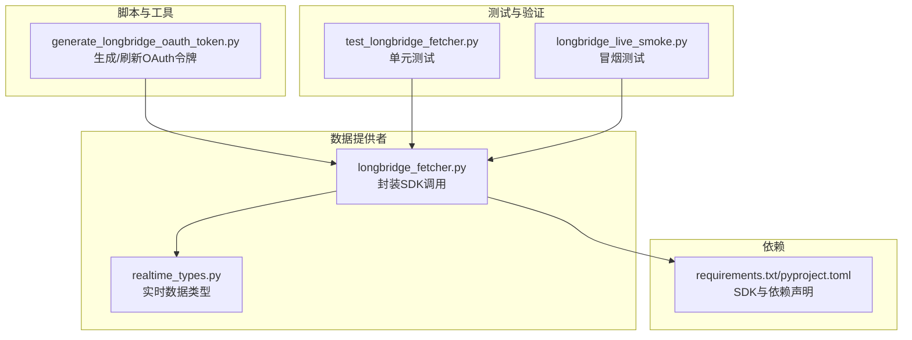
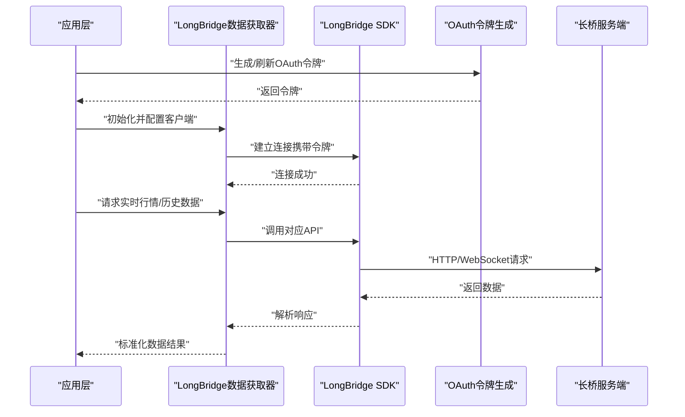
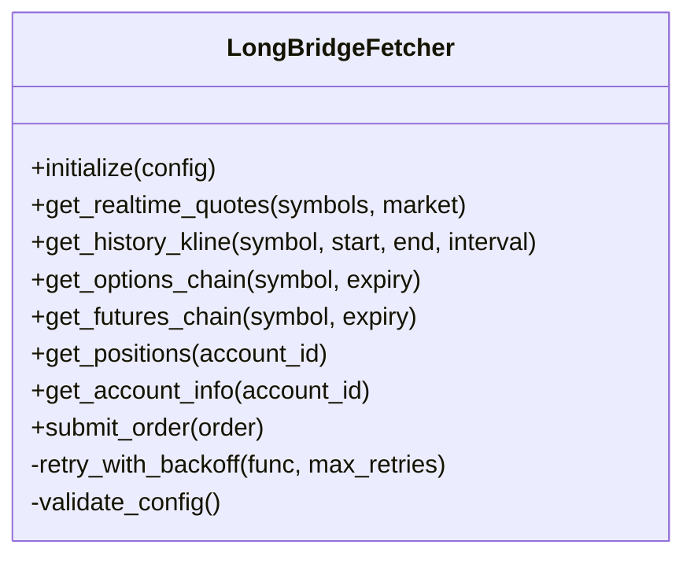
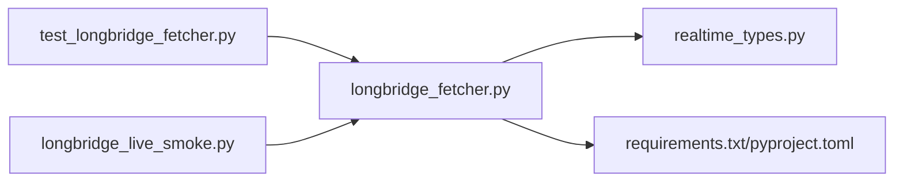

# LongBridge数据源

<cite>
**本文引用的文件**   
- [longbridge_fetcher.py](file://data_provider/longbridge_fetcher.py)
- [realtime_types.py](file://data_provider/realtime_types.py)
- [generate_longbridge_oauth_token.py](file://scripts/generate_longbridge_oauth_token.py)
- [test_longbridge_fetcher.py](file://tests/test_longbridge_fetcher.py)
- [longbridge_live_smoke.py](file://tests/longbridge_live_smoke.py)
- [requirements.txt](file://requirements.txt)
- [pyproject.toml](file://pyproject.toml)
</cite>

## 目录
1. [简介](#简介)
2. [项目结构](#项目结构)
3. [核心组件](#核心组件)
4. [架构总览](#架构总览)
5. [详细组件分析](#详细组件分析)
6. [依赖分析](#依赖分析)
7. [性能考虑](#性能考虑)
8. [故障排查指南](#故障排查指南)
9. [结论](#结论)
10. [附录](#附录)

## 简介
本文件面向需要在系统中接入长桥证券（LongBridge）数据源的开发者，提供从安装、认证到多市场实时行情与历史数据获取的完整指南。内容涵盖：
- SDK安装与环境准备
- 账户认证与API密钥配置
- 多市场实时行情、历史K线、期权期货等数据的获取方法
- 同步与异步数据获取示例路径
- 订单执行、持仓查询、资金管理等交易能力的使用要点
- 连接池管理、错误重试、数据一致性保证等关键技术点

## 项目结构
与LongBridge数据源相关的代码主要位于 data_provider 模块中，并通过脚本与测试用例进行辅助验证与集成。关键文件如下：
- data_provider/longbridge_fetcher.py：封装对LongBridge SDK的调用，统一对外暴露数据获取接口
- data_provider/realtime_types.py：定义实时行情数据结构与类型
- scripts/generate_longbridge_oauth_token.py：生成或刷新OAuth令牌，用于认证流程
- tests/test_longbridge_fetcher.py：单元测试，覆盖基本功能与边界条件
- tests/longbridge_live_smoke.py：轻量级冒烟测试，验证端到端连通性
- requirements.txt / pyproject.toml：声明第三方依赖（含LongBridge SDK）

图表来源 
- [longbridge_fetcher.py](file://data_provider/longbridge_fetcher.py)
- [realtime_types.py](file://data_provider/realtime_types.py)
- [generate_longbridge_oauth_token.py](file://scripts/generate_longbridge_oauth_token.py)
- [test_longbridge_fetcher.py](file://tests/test_longbridge_fetcher.py)
- [longbridge_live_smoke.py](file://tests/longbridge_live_smoke.py)
- [requirements.txt](file://requirements.txt)
- [pyproject.toml](file://pyproject.toml)

章节来源
- [longbridge_fetcher.py](file://data_provider/longbridge_fetcher.py)
- [realtime_types.py](file://data_provider/realtime_types.py)
- [generate_longbridge_oauth_token.py](file://scripts/generate_longbridge_oauth_token.py)
- [test_longbridge_fetcher.py](file://tests/test_longbridge_fetcher.py)
- [longbridge_live_smoke.py](file://tests/longbridge_live_smoke.py)
- [requirements.txt](file://requirements.txt)
- [pyproject.toml](file://pyproject.toml)

## 核心组件
- LongBridge数据获取器（longbridge_fetcher.py）
  - 负责初始化SDK客户端、管理会话、封装同步/异步调用
  - 提供统一的数据访问接口，屏蔽底层SDK差异
  - 内置错误处理与重试策略，保障稳定性
- 实时数据类型（realtime_types.py）
  - 定义统一的行情数据结构，便于上层消费
  - 支持多市场字段映射与规范化
- OAuth令牌生成（generate_longbridge_oauth_token.py）
  - 通过长桥OAuth流程获取或刷新令牌
  - 将令牌持久化至环境变量或配置文件，供SDK使用

章节来源
- [longbridge_fetcher.py](file://data_provider/longbridge_fetcher.py)
- [realtime_types.py](file://data_provider/realtime_types.py)
- [generate_longbridge_oauth_token.py](file://scripts/generate_longbridge_oauth_token.py)

## 架构总览
下图展示了LongBridge数据源在系统中的位置与交互关系：应用层通过数据获取器访问SDK，SDK与长桥服务端通信；认证由OAuth脚本完成；测试与冒烟脚本用于验证连通性与正确性。

图表来源 
- [longbridge_fetcher.py](file://data_provider/longbridge_fetcher.py)
- [generate_longbridge_oauth_token.py](file://scripts/generate_longbridge_oauth_token.py)

## 详细组件分析

### LongBridge数据获取器（longbridge_fetcher.py）
- 职责
  - 初始化SDK客户端，加载认证信息（令牌、环境配置）
  - 封装同步与异步的数据获取方法（实时行情、历史K线、期权期货等）
  - 统一错误处理与重试机制，提升鲁棒性
  - 输出标准化的数据结构，便于上层消费
- 关键设计
  - 连接池管理：复用SDK连接，减少握手开销
  - 重试策略：针对网络抖动与限流进行指数退避重试
  - 数据一致性：对批量请求采用事务性或幂等设计，避免部分成功导致的不一致
- 使用建议
  - 在应用启动时初始化一次，全局复用实例
  - 合理设置超时与重试次数，避免阻塞主流程
  - 对高频实时数据建议使用异步接口

图表来源 
- [longbridge_fetcher.py](file://data_provider/longbridge_fetcher.py)

章节来源
- [longbridge_fetcher.py](file://data_provider/longbridge_fetcher.py)

### 实时数据类型（realtime_types.py）
- 职责
  - 定义统一的实时行情数据结构（如报价、买卖盘、成交明细等）
  - 提供字段映射与校验逻辑，确保跨市场数据一致性
- 关键点
  - 支持多市场字段对齐（如美股、港股、A股等）
  - 提供空值与异常值的默认处理，增强健壮性

章节来源
- [realtime_types.py](file://data_provider/realtime_types.py)

### OAuth令牌生成（generate_longbridge_oauth_token.py）
- 职责
  - 实现长桥OAuth授权码流程，获取访问令牌
  - 支持令牌刷新与过期自动续期
- 使用场景
  - 首次部署或令牌过期时运行
  - 在CI/CD流水线中自动化刷新令牌

章节来源
- [generate_longbridge_oauth_token.py](file://scripts/generate_longbridge_oauth_token.py)

### 测试与冒烟（test_longbridge_fetcher.py, longbridge_live_smoke.py）
- 单元测试
  - 覆盖基础数据获取、错误处理、重试逻辑
  - 模拟SDK响应，验证数据标准化
- 冒烟测试
  - 真实环境连通性验证
  - 快速确认SDK与认证配置正确

章节来源
- [test_longbridge_fetcher.py](file://tests/test_longbridge_fetcher.py)
- [longbridge_live_smoke.py](file://tests/longbridge_live_smoke.py)

## 依赖分析
- 外部依赖
  - LongBridge SDK：通过 requirements.txt 或 pyproject.toml 声明
  - 其他库：如HTTP客户端、序列化库等
- 内部依赖
  - 数据获取器依赖实时数据类型定义
  - 测试用例依赖数据获取器接口

图表来源 
- [longbridge_fetcher.py](file://data_provider/longbridge_fetcher.py)
- [realtime_types.py](file://data_provider/realtime_types.py)
- [requirements.txt](file://requirements.txt)
- [pyproject.toml](file://pyproject.toml)
- [test_longbridge_fetcher.py](file://tests/test_longbridge_fetcher.py)
- [longbridge_live_smoke.py](file://tests/longbridge_live_smoke.py)

章节来源
- [requirements.txt](file://requirements.txt)
- [pyproject.toml](file://pyproject.toml)

## 性能考虑
- 连接池
  - 复用SDK连接，减少握手与鉴权开销
  - 根据并发需求调整连接池大小
- 异步I/O
  - 对高频实时数据使用异步接口，避免阻塞
  - 结合事件循环提升吞吐
- 缓存策略
  - 对历史数据与静态配置进行本地缓存
  - 合理设置TTL与失效策略
- 重试与限流
  - 指数退避重试，避免雪崩
  - 遵循SDK限流规则，平滑请求

## 故障排查指南
- 认证失败
  - 检查OAuth令牌是否有效且未过期
  - 确认环境变量或配置文件中的密钥正确
- 网络连接问题
  - 检查防火墙与代理设置
  - 验证DNS解析与网络连通性
- 数据不一致
  - 检查批量请求的事务性
  - 核对字段映射与标准化逻辑
- 性能瓶颈
  - 监控连接池使用情况
  - 分析异步任务队列长度

章节来源
- [test_longbridge_fetcher.py](file://tests/test_longbridge_fetcher.py)
- [longbridge_live_smoke.py](file://tests/longbridge_live_smoke.py)

## 结论
LongBridge数据源在本项目中通过统一的封装层提供了稳定、高效的多市场数据访问能力。结合OAuth认证、连接池管理、重试策略与异步I/O，能够满足实时行情与历史数据的高频需求。建议在部署时充分测试认证与连通性，并根据业务负载优化连接池与缓存策略。

## 附录
- 安装与配置步骤
  - 安装依赖：通过 requirements.txt 或 pyproject.toml 安装SDK
  - 生成OAuth令牌：运行 generate_longbridge_oauth_token.py
  - 配置环境变量：设置API密钥与令牌路径
- 常用API参考
  - 实时行情：get_realtime_quotes
  - 历史K线：get_history_kline
  - 期权期货：get_options_chain / get_futures_chain
  - 交易相关：submit_order / get_positions / get_account_info
- 示例代码路径
  - 同步获取示例：见 test_longbridge_fetcher.py
  - 异步获取示例：见 longbridge_live_smoke.py