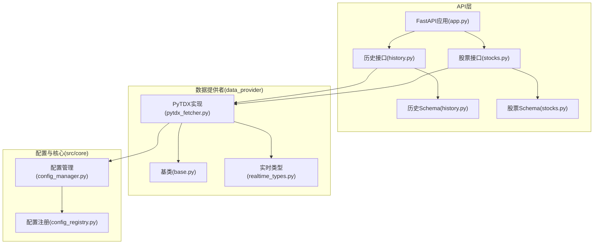
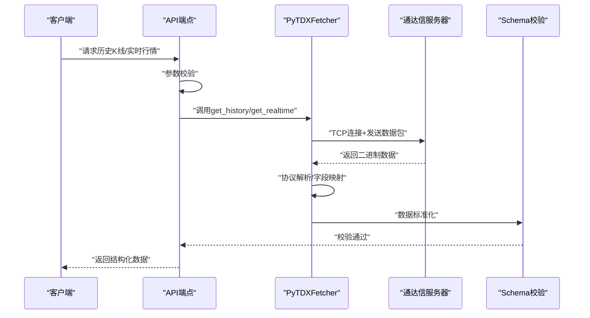
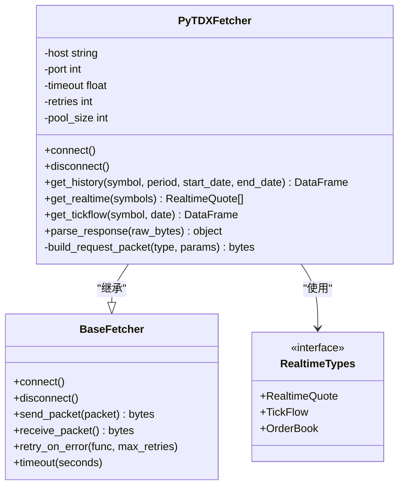
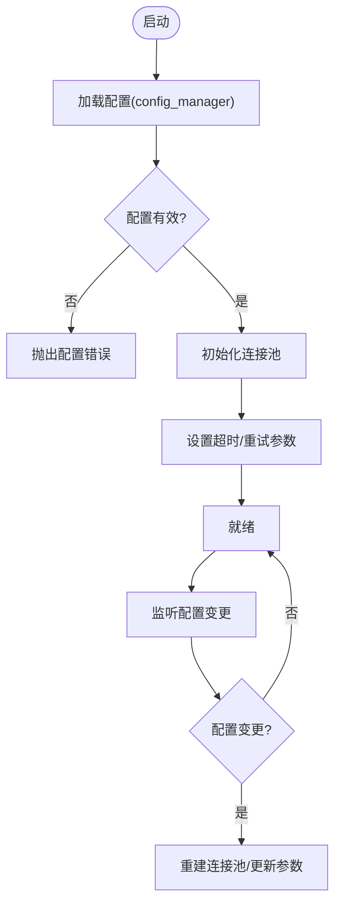
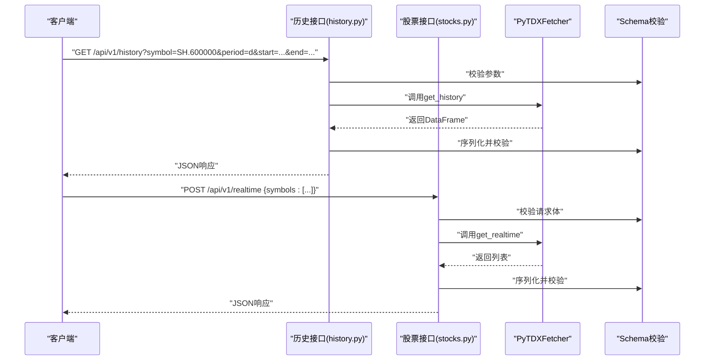
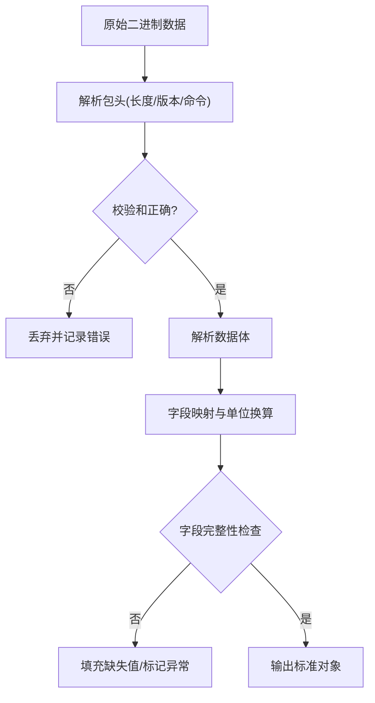
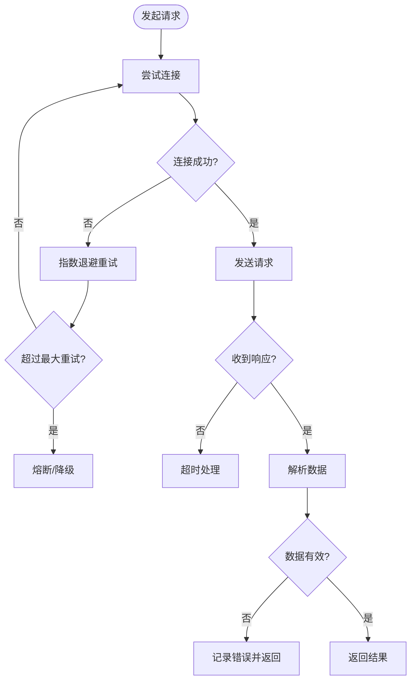
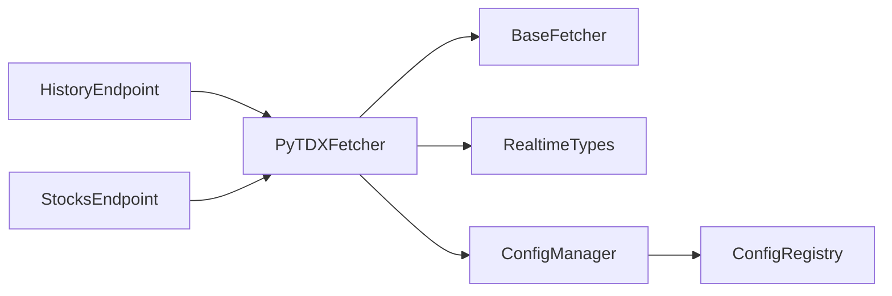

# PyTDX数据源

<cite>
**本文引用的文件**   
- [pytdx_fetcher.py](file://data_provider/pytdx_fetcher.py)
- [base.py](file://data_provider/base.py)
- [realtime_types.py](file://data_provider/realtime_types.py)
- [history.py](file://api/v1/schemas/history.py)
- [stocks.py](file://api/v1/schemas/stocks.py)
- [history.py](file://api/v1/endpoints/history.py)
- [stocks.py](file://api/v1/endpoints/stocks.py)
- [app.py](file://api/app.py)
- [config_manager.py](file://src/core/config_manager.py)
- [config_registry.py](file://src/core/config_registry.py)
- [test_a_share_fetcher_code_conversion.py](file://tests/test_a_share_fetcher_code_conversion.py)
</cite>

## 目录
1. [简介](#简介)
2. [项目结构](#项目结构)
3. [核心组件](#核心组件)
4. [架构总览](#架构总览)
5. [详细组件分析](#详细组件分析)
6. [依赖关系分析](#依赖关系分析)
7. [性能考虑](#性能考虑)
8. [故障排查指南](#故障排查指南)
9. [结论](#结论)
10. [附录](#附录)

## 简介
本文件面向使用PyTDX作为通达信数据源的开发者与运维人员，系统说明配置方法、接入步骤与关键实现要点。内容涵盖：
- 通达信服务器地址与连接参数配置
- A股实时行情、历史K线、分时数据、盘口信息的获取方式
- TCP连接建立、数据包发送接收、数据解析流程
- 连接稳定性保障、数据完整性校验、异常处理等关键技术

## 项目结构
本项目将数据源抽象为统一的“Fetcher”接口，PyTDX作为其中一个具体实现，位于 data_provider 模块中。API层通过路由与Schema定义对外暴露能力，服务层负责编排调用与错误处理。

图表来源
- [app.py](file://api/app.py)
- [history.py](file://api/v1/endpoints/history.py)
- [stocks.py](file://api/v1/endpoints/stocks.py)
- [history.py](file://api/v1/schemas/history.py)
- [stocks.py](file://api/v1/schemas/stocks.py)
- [base.py](file://data_provider/base.py)
- [pytdx_fetcher.py](file://data_provider/pytdx_fetcher.py)
- [realtime_types.py](file://data_provider/realtime_types.py)
- [config_manager.py](file://src/core/config_manager.py)
- [config_registry.py](file://src/core/config_registry.py)

章节来源
- [app.py](file://api/app.py)
- [history.py](file://api/v1/endpoints/history.py)
- [stocks.py](file://api/v1/endpoints/stocks.py)
- [history.py](file://api/v1/schemas/history.py)
- [stocks.py](file://api/v1/schemas/stocks.py)
- [base.py](file://data_provider/base.py)
- [pytdx_fetcher.py](file://data_provider/pytdx_fetcher.py)
- [realtime_types.py](file://data_provider/realtime_types.py)
- [config_manager.py](file://src/core/config_manager.py)
- [config_registry.py](file://src/core/config_registry.py)

## 核心组件
- PyTDX数据提供者（pytdx_fetcher.py）：封装与通达信服务器的TCP交互、协议打包/解包、重试与超时控制、数据标准化输出。
- Fetcher基类（base.py）：定义统一的数据获取接口与通用能力（如日志、重试、超时）。
- 实时数据类型（realtime_types.py）：定义实时行情、分时、盘口等数据结构，确保跨数据源一致性。
- 配置管理（config_manager.py, config_registry.py）：集中管理通达信服务器地址、端口、鉴权参数、连接池大小、超时时间等。
- API端点与Schema（history.py, stocks.py）：对外暴露历史K线与实时行情的HTTP接口，并约束请求/响应格式。

章节来源
- [pytdx_fetcher.py](file://data_provider/pytdx_fetcher.py)
- [base.py](file://data_provider/base.py)
- [realtime_types.py](file://data_provider/realtime_types.py)
- [config_manager.py](file://src/core/config_manager.py)
- [config_registry.py](file://src/core/config_registry.py)
- [history.py](file://api/v1/schemas/history.py)
- [stocks.py](file://api/v1/schemas/stocks.py)

## 架构总览
PyTDX数据源在系统中的位置与调用链如下：
- 客户端通过API端点发起请求（历史K线或实时行情）
- 端点解析入参并调用对应的Fetcher
- PyTDXFetcher根据配置建立TCP连接，构造并发送数据包
- 服务端返回二进制数据，PyTDXFetcher进行协议解析与字段映射
- 结果按Schema规范化后返回给客户端

图表来源
- [history.py](file://api/v1/endpoints/history.py)
- [stocks.py](file://api/v1/endpoints/stocks.py)
- [pytdx_fetcher.py](file://data_provider/pytdx_fetcher.py)
- [history.py](file://api/v1/schemas/history.py)
- [stocks.py](file://api/v1/schemas/stocks.py)

## 详细组件分析

### PyTDXFetcher（通达信数据提供者）
职责与关键点：
- 连接管理：维护TCP连接、重连策略、连接池、心跳保活
- 协议封装：按通达信协议构造请求包（包含市场、代码、周期、起止时间等）
- 数据解析：将二进制响应解析为结构化对象，并进行字段映射与单位换算
- 稳定性：超时、重试、熔断、降级到备用数据源
- 可观测性：记录关键指标（延迟、失败率、重试次数）

图表来源
- [base.py](file://data_provider/base.py)
- [pytdx_fetcher.py](file://data_provider/pytdx_fetcher.py)
- [realtime_types.py](file://data_provider/realtime_types.py)

章节来源
- [pytdx_fetcher.py](file://data_provider/pytdx_fetcher.py)
- [base.py](file://data_provider/base.py)
- [realtime_types.py](file://data_provider/realtime_types.py)

### 配置管理（通达信服务器地址与连接参数）
- 服务器地址与端口：支持多节点配置与主备切换
- 连接参数：超时、重试次数、连接池大小、心跳间隔
- 鉴权与安全：可选的鉴权令牌、TLS加密开关
- 动态更新：运行时热更新配置，无需重启服务

图表来源
- [config_manager.py](file://src/core/config_manager.py)
- [config_registry.py](file://src/core/config_registry.py)

章节来源
- [config_manager.py](file://src/core/config_manager.py)
- [config_registry.py](file://src/core/config_registry.py)

### API端点与Schema（历史K线与实时行情）
- 历史K线接口：支持日/周/月/分钟级K线，起止时间窗口限制，分页与排序
- 实时行情接口：支持批量股票代码查询，返回最新价、涨跌幅、成交量等
- 盘口信息：买卖五档/十档、逐笔成交、委托队列
- 数据校验：基于Pydantic Schema对输入输出进行严格校验

图表来源
- [history.py](file://api/v1/endpoints/history.py)
- [stocks.py](file://api/v1/endpoints/stocks.py)
- [history.py](file://api/v1/schemas/history.py)
- [stocks.py](file://api/v1/schemas/stocks.py)
- [pytdx_fetcher.py](file://data_provider/pytdx_fetcher.py)

章节来源
- [history.py](file://api/v1/endpoints/history.py)
- [stocks.py](file://api/v1/endpoints/stocks.py)
- [history.py](file://api/v1/schemas/history.py)
- [stocks.py](file://api/v1/schemas/stocks.py)

### 数据解析与完整性校验
- 协议解析：根据包头长度与校验和验证数据完整性
- 字段映射：将底层字段映射为标准字段名（如开盘、收盘、最高、最低、成交量）
- 缺失值处理：填充默认值或标记NaN，保证下游可用性
- 幂等性：相同请求多次执行结果一致，避免重复数据

图表来源
- [pytdx_fetcher.py](file://data_provider/pytdx_fetcher.py)
- [realtime_types.py](file://data_provider/realtime_types.py)

章节来源
- [pytdx_fetcher.py](file://data_provider/pytdx_fetcher.py)
- [realtime_types.py](file://data_provider/realtime_types.py)

### 连接稳定性与异常处理
- 连接重试：指数退避重试，最大重试次数上限
- 超时控制：读/写超时、握手超时、心跳超时
- 熔断降级：连续失败触发熔断，切换到备用数据源或缓存
- 异常分类：网络异常、协议异常、业务异常分别处理与上报

图表来源
- [pytdx_fetcher.py](file://data_provider/pytdx_fetcher.py)
- [base.py](file://data_provider/base.py)

章节来源
- [pytdx_fetcher.py](file://data_provider/pytdx_fetcher.py)
- [base.py](file://data_provider/base.py)

### A股代码转换与兼容性
- 代码格式：支持沪市（SH.）、深市（SZ.）前缀与纯数字代码互转
- 测试覆盖：提供A股代码转换测试用例，确保兼容性与正确性

章节来源
- [test_a_share_fetcher_code_conversion.py](file://tests/test_a_share_fetcher_code_conversion.py)

## 依赖关系分析
- 外部依赖：通达信服务器（TCP）、网络库（socket/asyncio）、序列化库（struct/pickle）
- 内部依赖：Fetcher基类、配置管理、Schema校验、日志与监控
- 耦合度：PyTDXFetcher与BaseFetcher低耦合，便于替换其他数据源；与配置管理松耦合，支持热更新

图表来源
- [pytdx_fetcher.py](file://data_provider/pytdx_fetcher.py)
- [base.py](file://data_provider/base.py)
- [realtime_types.py](file://data_provider/realtime_types.py)
- [config_manager.py](file://src/core/config_manager.py)
- [config_registry.py](file://src/core/config_registry.py)
- [history.py](file://api/v1/endpoints/history.py)
- [stocks.py](file://api/v1/endpoints/stocks.py)

章节来源
- [pytdx_fetcher.py](file://data_provider/pytdx_fetcher.py)
- [base.py](file://data_provider/base.py)
- [realtime_types.py](file://data_provider/realtime_types.py)
- [config_manager.py](file://src/core/config_manager.py)
- [config_registry.py](file://src/core/config_registry.py)
- [history.py](file://api/v1/endpoints/history.py)
- [stocks.py](file://api/v1/endpoints/stocks.py)

## 性能考虑
- 连接复用：使用连接池减少TCP握手开销
- 批量请求：合并多个股票查询为单次请求，降低网络往返
- 异步IO：非阻塞I/O提升并发处理能力
- 缓存策略：热点数据本地缓存，减少重复请求
- 限流与背压：防止突发流量打垮上游服务

## 故障排查指南
- 连接失败：检查服务器地址、端口、防火墙规则、网络连通性
- 数据不完整：核对协议版本、校验和、字段映射表
- 超时频繁：调整超时参数、优化网络路径、增加重试次数
- 内存泄漏：检查连接未释放、大对象未清理
- 日志定位：启用详细日志，关注错误码与堆栈信息

章节来源
- [pytdx_fetcher.py](file://data_provider/pytdx_fetcher.py)
- [base.py](file://data_provider/base.py)

## 结论
PyTDX数据源在本项目中实现了与通达信服务器的稳定对接，提供了完整的A股实时行情、历史K线、分时数据与盘口信息获取能力。通过统一的Fetcher接口、严格的Schema校验、完善的配置管理与异常处理机制，确保了数据的高质量与服务的高可用。建议在生产环境中启用连接池、缓存、熔断与监控，以进一步提升系统稳定性与性能。

## 附录
- 配置示例：参考配置管理模块中的默认值与环境变量映射
- 接口文档：查看API端点与Schema定义，了解请求/响应格式
- 测试用例：参考A股代码转换测试，验证代码兼容性