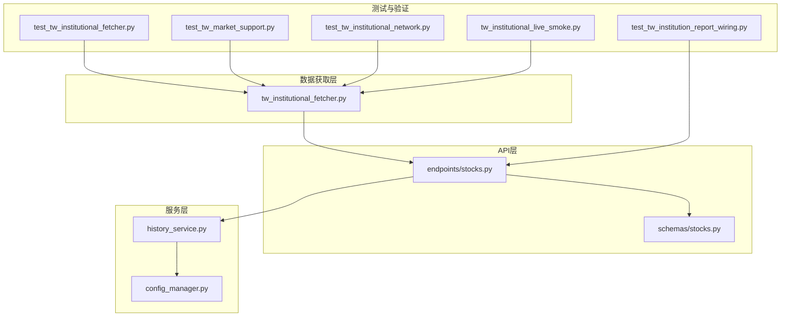
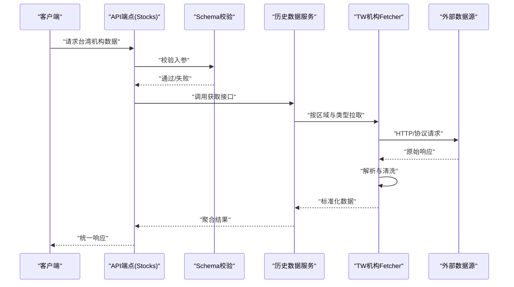
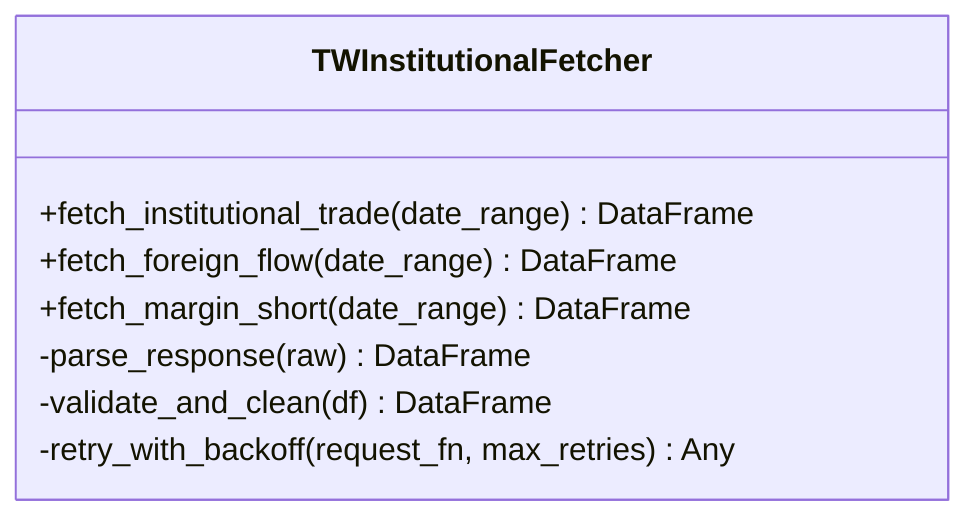
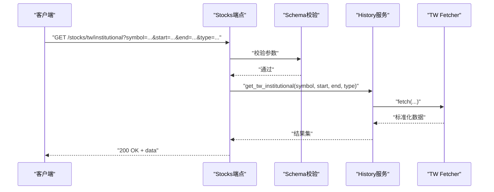
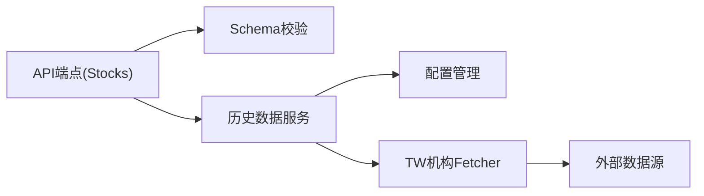

# TW Institutional数据源

<cite>
**本文引用的文件**   
- [tw_institutional_fetcher.py](file://data_provider/tw_institutional_fetcher.py)
- [test_tw_institutional_fetcher.py](file://tests/test_tw_institutional_fetcher.py)
- [test_tw_institution_report_wiring.py](file://tests/test_tw_institution_report_wiring.py)
- [test_tw_market_support.py](file://tests/test_tw_market_support.py)
- [test_tw_institutional_network.py](file://tests/test_tw_institutional_network.py)
- [test_tw_institutional_live_smoke.py](file://tests/tw_institutional_live_smoke.py)
- [api/v1/endpoints/stocks.py](file://api/v1/endpoints/stocks.py)
- [api/v1/schemas/stocks.py](file://api/v1/schemas/stocks.py)
- [src/services/history_service.py](file://src/services/history_service.py)
- [src/core/config_manager.py](file://src/core/config_manager.py)
</cite>

## 目录
1. [简介](#简介)
2. [项目结构](#项目结构)
3. [核心组件](#核心组件)
4. [架构总览](#架构总览)
5. [详细组件分析](#详细组件分析)
6. [依赖关系分析](#依赖关系分析)
7. [性能与稳定性](#性能与稳定性)
8. [故障排查指南](#故障排查指南)
9. [结论](#结论)
10. [附录：接入与合规要点](#附录接入与合规要点)

## 简介
本文件面向“台湾机构数据源（TW Institutional）”的使用与集成，覆盖配置方法、接入步骤、台湾地区特殊的数据获取方式与合规要求，以及台湾股市机构买卖数据、外资动向、融资融券信息的获取、解析与分析处理。文档同时给出数据质量控制、异常检测与报告生成的关键实现思路，并提供代码级路径以便快速定位实现细节。

## 项目结构
与TW Institutional相关的关键位置如下：
- 数据获取层：data_provider/tw_institutional_fetcher.py
- 测试与验证：tests/test_tw_*.py、tests/tw_institutional_live_smoke.py
- API暴露：api/v1/endpoints/stocks.py、api/v1/schemas/stocks.py
- 历史数据服务：src/services/history_service.py
- 配置管理：src/core/config_manager.py

图表来源
- [tw_institutional_fetcher.py](file://data_provider/tw_institutional_fetcher.py)
- [api/v1/endpoints/stocks.py](file://api/v1/endpoints/stocks.py)
- [api/v1/schemas/stocks.py](file://api/v1/schemas/stocks.py)
- [src/services/history_service.py](file://src/services/history_service.py)
- [src/core/config_manager.py](file://src/core/config_manager.py)
- [tests/test_tw_institutional_fetcher.py](file://tests/test_tw_institutional_fetcher.py)
- [tests/test_tw_institution_report_wiring.py](file://tests/test_tw_institution_report_wiring.py)
- [tests/test_tw_market_support.py](file://tests/test_tw_market_support.py)
- [tests/test_tw_institutional_network.py](file://tests/test_tw_institutional_network.py)
- [tests/tw_institutional_live_smoke.py](file://tests/tw_institutional_live_smoke.py)

章节来源
- [tw_institutional_fetcher.py](file://data_provider/tw_institutional_fetcher.py)
- [api/v1/endpoints/stocks.py](file://api/v1/endpoints/stocks.py)
- [api/v1/schemas/stocks.py](file://api/v1/schemas/stocks.py)
- [src/services/history_service.py](file://src/services/history_service.py)
- [src/core/config_manager.py](file://src/core/config_manager.py)
- [tests/test_tw_institutional_fetcher.py](file://tests/test_tw_institutional_fetcher.py)
- [tests/test_tw_institution_report_wiring.py](file://tests/test_tw_institution_report_wiring.py)
- [tests/test_tw_market_support.py](file://tests/test_tw_market_support.py)
- [tests/test_tw_institutional_network.py](file://tests/test_tw_institutional_network.py)
- [tests/tw_institutional_live_smoke.py](file://tests/tw_institutional_live_smoke.py)

## 核心组件
- 台湾机构数据抓取器（Fetcher）：封装对台湾市场机构数据的请求、解析、清洗与标准化输出，支持机构买卖、外资动向、融资融券等字段。
- API端点（Stocks）：对外暴露查询接口，统一入参校验、错误码与响应结构。
- 历史数据服务（History Service）：负责调用Fetcher、缓存策略、重试与降级逻辑，并向上层提供一致的历史数据访问能力。
- 配置管理（Config Manager）：集中管理区域开关、代理、超时、限流、鉴权等环境参数。

章节来源
- [tw_institutional_fetcher.py](file://data_provider/tw_institutional_fetcher.py)
- [api/v1/endpoints/stocks.py](file://api/v1/endpoints/stocks.py)
- [api/v1/schemas/stocks.py](file://api/v1/schemas/stocks.py)
- [src/services/history_service.py](file://src/services/history_service.py)
- [src/core/config_manager.py](file://src/core/config_manager.py)

## 架构总览
下图展示从API到数据源的端到端流程，包括请求路由、参数校验、Fetcher调用、数据标准化与返回。

图表来源
- [api/v1/endpoints/stocks.py](file://api/v1/endpoints/stocks.py)
- [api/v1/schemas/stocks.py](file://api/v1/schemas/stocks.py)
- [src/services/history_service.py](file://src/services/history_service.py)
- [tw_institutional_fetcher.py](file://data_provider/tw_institutional_fetcher.py)

## 详细组件分析

### 台湾机构数据抓取器（Fetcher）
- 职责
  - 根据区域标识（台湾）与数据类型（机构买卖、外资动向、融资融券）发起请求。
  - 解析HTML/JSON响应，进行字段映射、单位换算、缺失值填充与异常值过滤。
  - 输出统一的DataFrame或结构化记录，便于上层消费。
- 关键行为
  - 网络层：支持代理、超时、重试、限流；对常见错误进行分类与上报。
  - 解析层：针对台湾站点结构差异做适配，保证字段一致性。
  - 质量层：空值率、重复值、时间戳连续性检查；异常阈值告警。
- 典型用法
  - 在历史数据服务中按日期窗口批量拉取，合并去重后返回。

章节来源
- [tw_institutional_fetcher.py](file://data_provider/tw_institutional_fetcher.py)
- [tests/test_tw_institutional_fetcher.py](file://tests/test_tw_institutional_fetcher.py)
- [tests/test_tw_institutional_network.py](file://tests/test_tw_institutional_network.py)

#### 类图（概念映射）

图表来源
- [tw_institutional_fetcher.py](file://data_provider/tw_institutional_fetcher.py)

### API端点（Stocks）
- 职责
  - 暴露REST接口，接收股票代码、时间范围、数据类型等参数。
  - 使用Schema进行严格校验，返回统一结构与错误码。
- 关键行为
  - 参数校验：必填项、格式、取值范围。
  - 错误处理：网络异常、解析失败、无数据等场景的明确返回。
  - 权限与限流：结合系统配置控制访问频率与鉴权。

章节来源
- [api/v1/endpoints/stocks.py](file://api/v1/endpoints/stocks.py)
- [api/v1/schemas/stocks.py](file://api/v1/schemas/stocks.py)

#### 序列图（API调用链）

图表来源
- [api/v1/endpoints/stocks.py](file://api/v1/endpoints/stocks.py)
- [api/v1/schemas/stocks.py](file://api/v1/schemas/stocks.py)
- [src/services/history_service.py](file://src/services/history_service.py)
- [tw_institutional_fetcher.py](file://data_provider/tw_institutional_fetcher.py)

### 历史数据服务（History Service）
- 职责
  - 封装Fetcher调用，提供缓存、重试、降级与聚合能力。
  - 将不同数据源的结果统一为一致的模型，供API与业务消费。
- 关键行为
  - 缓存策略：按symbol+date_range+type维度缓存，减少重复请求。
  - 降级策略：当Fetcher失败时返回部分可用数据或空集，并附带错误上下文。
  - 监控指标：成功率、延迟、错误分类统计。

章节来源
- [src/services/history_service.py](file://src/services/history_service.py)

### 配置管理（Config Manager）
- 职责
  - 集中管理区域开关（如启用台湾）、网络参数（代理、超时、并发）、限流与鉴权。
- 关键行为
  - 环境变量优先，配置文件次之，默认值兜底。
  - 动态重载与热更新（按需）。

章节来源
- [src/core/config_manager.py](file://src/core/config_manager.py)

## 依赖关系分析
- 模块耦合
  - API端点依赖Schema与History服务，History服务依赖Fetcher与Config。
  - 测试用例覆盖Fetcher网络、解析、报告对接与市场支持。
- 外部依赖
  - 外部数据源（台湾站点或第三方API），需考虑反爬、限流与合规。
- 潜在循环
  - 当前分层清晰，未见循环依赖迹象。

图表来源
- [api/v1/endpoints/stocks.py](file://api/v1/endpoints/stocks.py)
- [api/v1/schemas/stocks.py](file://api/v1/schemas/stocks.py)
- [src/services/history_service.py](file://src/services/history_service.py)
- [src/core/config_manager.py](file://src/core/config_manager.py)
- [tw_institutional_fetcher.py](file://data_provider/tw_institutional_fetcher.py)

章节来源
- [api/v1/endpoints/stocks.py](file://api/v1/endpoints/stocks.py)
- [api/v1/schemas/stocks.py](file://api/v1/schemas/stocks.py)
- [src/services/history_service.py](file://src/services/history_service.py)
- [src/core/config_manager.py](file://src/core/config_manager.py)
- [tw_institutional_fetcher.py](file://data_provider/tw_institutional_fetcher.py)

## 性能与稳定性
- 性能优化建议
  - 批量拉取：按日期窗口合并请求，减少往返次数。
  - 缓存命中：合理设置TTL与失效策略，避免热点键抖动。
  - 并发控制：限制并发数与速率，避免触发目标站点的限流。
- 稳定性保障
  - 重试退避：指数退避与最大重试次数。
  - 熔断降级：连续失败时快速失败，保护上游。
  - 监控告警：记录错误分类、耗时分位与成功率。

[本节为通用指导，不直接分析具体文件]

## 故障排查指南
- 常见问题
  - 网络超时/连接失败：检查代理、DNS、防火墙与目标站点可达性。
  - 解析失败：核对站点结构变更、字段映射与编码问题。
  - 数据缺失：确认交易日历、节假日与数据发布延迟。
  - 限流/封禁：降低频率、增加退避、轮换代理或申请白名单。
- 诊断手段
  - 开启调试日志，捕获请求/响应摘要。
  - 运行网络连通性与基础解析用例。
  - 查看历史服务的缓存命中率与错误统计。

章节来源
- [tests/test_tw_institutional_network.py](file://tests/test_tw_institutional_network.py)
- [tests/test_tw_institutional_fetcher.py](file://tests/test_tw_institutional_fetcher.py)
- [tests/tw_institutional_live_smoke.py](file://tests/tw_institutional_live_smoke.py)

## 结论
TW Institutional数据源通过清晰的Fetch-API-Service分层，提供了稳定、可观测、可扩展的台湾机构数据接入能力。配合完善的测试与配置管理，可满足机构买卖、外资动向、融资融券等高频分析需求。建议在上线前完成网络连通性、解析正确性与性能压测，确保生产环境的可靠性与合规性。

[本节为总结，不直接分析具体文件]

## 附录：接入与合规要点
- 接入步骤
  - 配置区域开关与网络参数（代理、超时、并发、限流）。
  - 初始化Fetcher并验证基础接口可用性。
  - 通过API端点或History服务调用，验证数据完整性与时效性。
- 台湾地区特殊说明
  - 数据发布节奏与交易日差异：注意非交易日与公告延迟。
  - 站点反爬与访问策略：遵守robots与条款，避免高频抓取。
- 合规要求
  - 数据来源声明与引用规范。
  - 用户隐私与敏感信息脱敏。
  - 跨境数据传输与本地化存储要求（依适用法规）。
- 数据质量控制
  - 空值率、重复值、时间戳连续性、异常值阈值。
  - 抽样复核与回归校验。
- 异常检测
  - 波动突变、量价背离、字段分布漂移。
  - 规则引擎与简单统计模型结合。
- 报告生成
  - 模板化输出（Markdown/CSV/JSON），包含元数据与版本信息。
  - 自动化流水线：拉取→清洗→质检→报告→归档。

章节来源
- [tests/test_tw_institution_report_wiring.py](file://tests/test_tw_institution_report_wiring.py)
- [tests/test_tw_market_support.py](file://tests/test_tw_market_support.py)
- [src/core/config_manager.py](file://src/core/config_manager.py)
- [api/v1/endpoints/stocks.py](file://api/v1/endpoints/stocks.py)
- [api/v1/schemas/stocks.py](file://api/v1/schemas/stocks.py)
- [src/services/history_service.py](file://src/services/history_service.py)
- [tw_institutional_fetcher.py](file://data_provider/tw_institutional_fetcher.py)