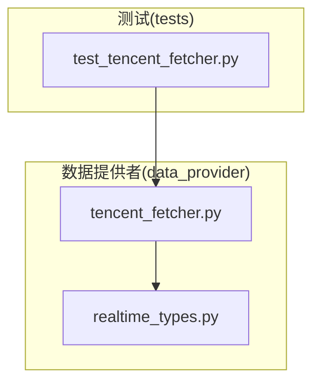
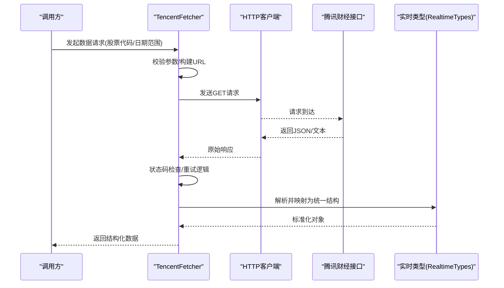
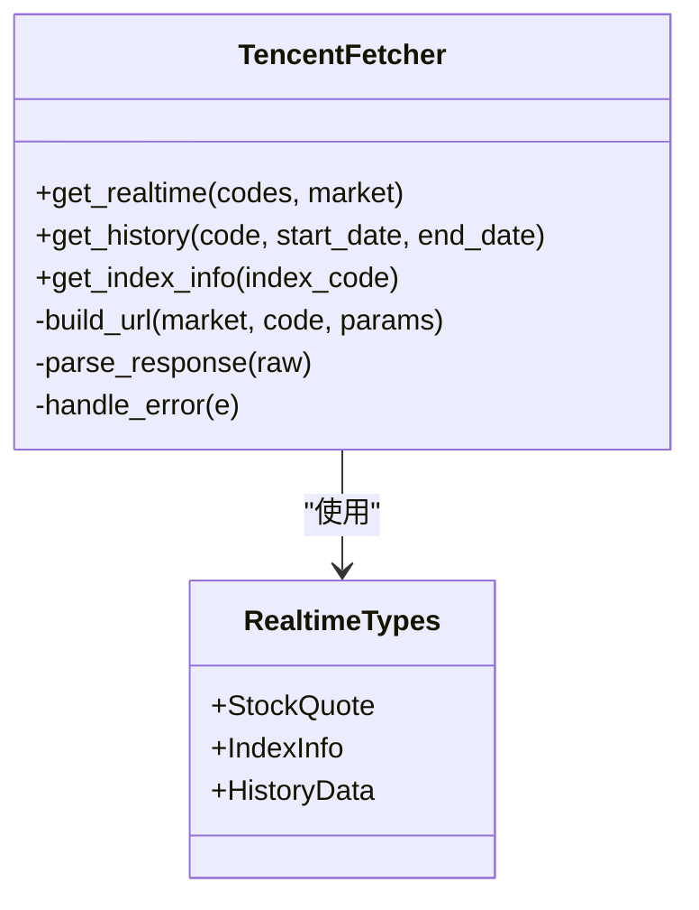
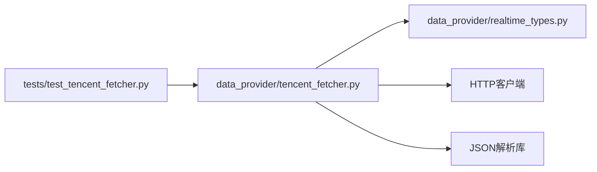

# Tencent数据源

<cite>
**本文引用的文件**   
- [tencent_fetcher.py](file://data_provider/tencent_fetcher.py)
- [realtime_types.py](file://data_provider/realtime_types.py)
- [test_tencent_fetcher.py](file://tests/test_tencent_fetcher.py)
</cite>

## 目录
1. [简介](#简介)
2. [项目结构](#项目结构)
3. [核心组件](#核心组件)
4. [架构总览](#架构总览)
5. [详细组件分析](#详细组件分析)
6. [依赖关系分析](#依赖关系分析)
7. [性能与优化建议](#性能与优化建议)
8. [故障排查指南](#故障排查指南)
9. [结论](#结论)
10. [附录：接入步骤与示例](#附录接入步骤与示例)

## 简介
本文件面向需要在系统中接入腾讯财经数据源的开发者，提供从配置到调用的完整说明。该数据源基于腾讯公开接口，无需API密钥即可获取A股、港股、美股的实时行情、历史数据与指数信息。文档涵盖HTTP请求构造、响应解析、格式化处理、网络请求优化、缓存策略与错误处理等最佳实践，并给出可直接参考的代码片段路径。

## 项目结构
Tencent数据源实现位于 data_provider 模块中，核心文件为 tencent_fetcher.py；实时数据类型定义在 realtime_types.py；测试用例位于 tests/test_tencent_fetcher.py。整体采用“按数据源划分”的组织方式，便于扩展与维护。

图表来源 
- [tencent_fetcher.py](file://data_provider/tencent_fetcher.py)
- [realtime_types.py](file://data_provider/realtime_types.py)
- [test_tencent_fetcher.py](file://tests/test_tencent_fetcher.py)

章节来源
- [tencent_fetcher.py](file://data_provider/tencent_fetcher.py)
- [realtime_types.py](file://data_provider/realtime_types.py)
- [test_tencent_fetcher.py](file://tests/test_tencent_fetcher.py)

## 核心组件
- 腾讯数据抓取器（TencentFetcher）
  - 负责构造腾讯财经HTTP请求、发送请求、解析响应、统一输出结构化数据。
  - 支持A股、港股、美股代码前缀识别与适配，以及指数数据的特殊处理。
- 实时数据类型（Realtime Types）
  - 定义统一的实时行情数据结构，屏蔽不同市场差异，供上层服务消费。

章节来源
- [tencent_fetcher.py](file://data_provider/tencent_fetcher.py)
- [realtime_types.py](file://data_provider/realtime_types.py)

## 架构总览
下图展示了调用方通过TencentFetcher获取数据的典型流程，包括请求构造、网络访问、响应解析与结果返回。

图表来源 
- [tencent_fetcher.py](file://data_provider/tencent_fetcher.py)
- [realtime_types.py](file://data_provider/realtime_types.py)

## 详细组件分析

### TencentFetcher 组件
- 职责
  - 根据市场与代码生成正确的腾讯接口URL。
  - 管理HTTP请求生命周期（超时、重试、限流）。
  - 解析响应体，转换为内部统一的数据模型。
  - 对异常进行捕获与上报，保证调用方稳定性。
- 关键能力
  - A股/港股/美股代码前缀识别与转换。
  - 指数与个股差异化处理。
  - 批量请求合并与去重。
- 错误处理
  - 网络异常、超时、HTTP错误码、JSON解析失败等均有兜底策略。
  - 可配置重试次数与退避策略。

图表来源 
- [tencent_fetcher.py](file://data_provider/tencent_fetcher.py)
- [realtime_types.py](file://data_provider/realtime_types.py)

章节来源
- [tencent_fetcher.py](file://data_provider/tencent_fetcher.py)
- [realtime_types.py](file://data_provider/realtime_types.py)

### 实时数据类型（RealtimeTypes）
- 设计目标
  - 统一A股、港股、美股的字段命名与类型，屏蔽差异。
  - 提供便捷属性访问与校验方法。
- 主要结构
  - StockQuote：包含最新价、涨跌幅、成交量、成交额、时间戳等。
  - IndexInfo：指数名称、点位、涨跌、时间戳等。
  - HistoryData：历史K线或分时数据集合。

章节来源
- [realtime_types.py](file://data_provider/realtime_types.py)

### 单元测试与行为验证
- 覆盖场景
  - 正常请求与响应解析。
  - 异常分支（网络错误、超时、无效响应）。
  - 多市场代码前缀处理。
- 作用
  - 保障接口契约稳定，便于回归测试。

章节来源
- [test_tencent_fetcher.py](file://tests/test_tencent_fetcher.py)

## 依赖关系分析
- 内部依赖
  - TencentFetcher 依赖 RealtimeTypes 进行数据标准化。
  - 测试用例依赖 TencentFetcher 以验证行为。
- 外部依赖
  - HTTP客户端（如requests/httpx）用于网络请求。
  - JSON解析库用于响应体解析。
- 耦合度
  - 数据源层与业务层解耦，通过统一类型暴露接口，降低耦合。

图表来源 
- [tencent_fetcher.py](file://data_provider/tencent_fetcher.py)
- [realtime_types.py](file://data_provider/realtime_types.py)
- [test_tencent_fetcher.py](file://tests/test_tencent_fetcher.py)

章节来源
- [tencent_fetcher.py](file://data_provider/tencent_fetcher.py)
- [realtime_types.py](file://data_provider/realtime_types.py)
- [test_tencent_fetcher.py](file://tests/test_tencent_fetcher.py)

## 性能与优化建议
- 连接复用
  - 使用连接池与Keep-Alive减少握手开销。
- 并发控制
  - 合理设置并发数，避免触发腾讯接口限频。
  - 对热点股票做本地缓存，降低重复请求。
- 请求合并
  - 将多个同类型请求合并为一次批量请求，减少网络往返。
- 超时与重试
  - 设置合理的超时阈值与指数退避重试策略。
- 数据缓存
  - 内存缓存（短时效）+ 磁盘缓存（长时效）结合，提升读取性能。
- 日志与监控
  - 记录关键指标（耗时、成功率、错误分布），便于定位问题。

[本节为通用指导，不直接分析具体文件]

## 故障排查指南
- 常见问题
  - 网络超时：检查网络连通性与超时配置。
  - 接口限频：降低并发或增加退避间隔。
  - 响应格式变化：更新解析逻辑并补充单元测试。
  - 代码前缀错误：确认市场与代码前缀匹配规则。
- 定位方法
  - 开启调试日志，查看请求URL与响应体。
  - 使用测试用例复现问题，逐步缩小范围。
- 恢复策略
  - 启用降级与回退机制，确保系统可用性。

章节来源
- [test_tencent_fetcher.py](file://tests/test_tencent_fetcher.py)

## 结论
Tencent数据源通过统一的Fetcher与数据类型抽象，提供了稳定、易用的A股、港股、美股数据获取能力。其无需API密钥的特性降低了接入门槛，配合合理的网络优化与缓存策略，可在高并发场景下保持良好性能。建议在集成时严格遵循错误处理与监控规范，确保系统健壮性。

[本节为总结，不直接分析具体文件]

## 附录：接入步骤与示例
- 环境准备
  - 安装必要的HTTP客户端与JSON解析库。
  - 确保网络可访问腾讯财经接口。
- 初始化Fetcher
  - 实例化TencentFetcher，配置超时、重试、并发等参数。
- 获取实时行情
  - 构造股票代码列表与市场标识，调用get_realtime。
  - 解析返回的StockQuote列表，提取所需字段。
- 获取历史数据
  - 指定股票与起止日期，调用get_history。
  - 将HistoryData转换为分析所需的格式。
- 获取指数信息
  - 传入指数代码，调用get_index_info。
  - 解析IndexInfo并展示关键指标。
- 请求构造要点
  - 根据市场与代码生成正确URL。
  - 添加必要查询参数（如日期、复权方式）。
- 响应解析要点
  - 校验状态码与响应体结构。
  - 将原始字段映射到统一类型。
- 格式化输出
  - 将数值型字段转为浮点或整数。
  - 时间戳统一为可读格式。
- 最佳实践
  - 使用连接池与Keep-Alive。
  - 实施本地缓存与去重。
  - 完善错误处理与重试逻辑。
  - 记录关键日志与指标。

章节来源
- [tencent_fetcher.py](file://data_provider/tencent_fetcher.py)
- [realtime_types.py](file://data_provider/realtime_types.py)
- [test_tencent_fetcher.py](file://tests/test_tencent_fetcher.py)