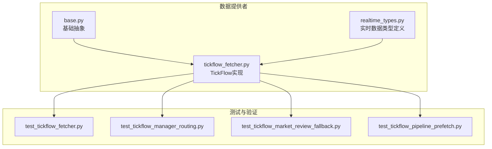
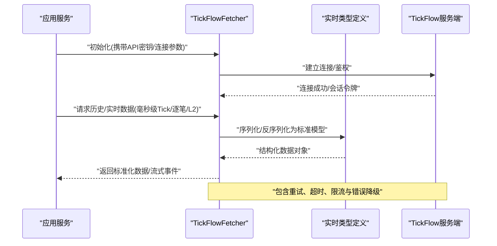
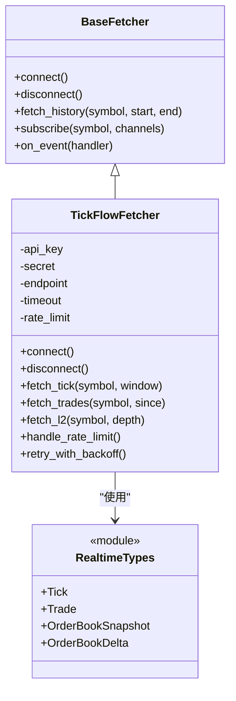
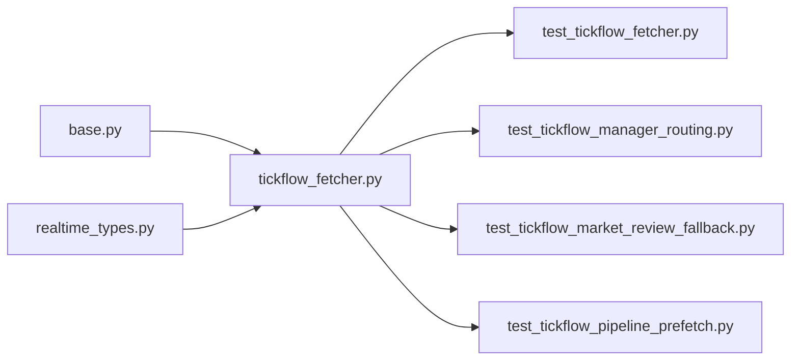

# TickFlow数据源

<cite>
**本文引用的文件**   
- [tickflow_fetcher.py](file://data_provider/tickflow_fetcher.py)
- [test_tickflow_fetcher.py](file://tests/test_tickflow_fetcher.py)
- [test_tickflow_manager_routing.py](file://tests/test_tickflow_manager_routing.py)
- [test_tickflow_market_review_fallback.py](file://tests/test_tickflow_market_review_fallback.py)
- [test_tickflow_pipeline_prefetch.py](file://tests/test_tickflow_pipeline_prefetch.py)
- [realtime_types.py](file://data_provider/realtime_types.py)
- [base.py](file://data_provider/base.py)
</cite>

## 目录
1. [简介](#简介)
2. [项目结构](#项目结构)
3. [核心组件](#核心组件)
4. [架构总览](#架构总览)
5. [详细组件分析](#详细组件分析)
6. [依赖关系分析](#依赖关系分析)
7. [性能与高并发要点](#性能与高并发要点)
8. [故障排查指南](#故障排查指南)
9. [结论](#结论)
10. [附录：配置与接入清单](#附录配置与接入清单)

## 简介
本文件面向高频量化与实时行情场景，提供TickFlow数据源的完整接入与使用指南。内容涵盖：
- API密钥与连接参数配置
- 速率限制与容错策略
- 毫秒级高频行情、逐笔成交、Level-2盘口数据的获取方法
- 实时流处理与压缩存储实践
- 高性能数据处理、内存管理与并发控制建议

## 项目结构
TickFlow数据源位于数据提供者模块中，通过统一的Fetch接口对外暴露能力，并在测试用例中覆盖路由、回退、预取等关键路径。

图表来源
- [base.py](file://data_provider/base.py)
- [realtime_types.py](file://data_provider/realtime_types.py)
- [tickflow_fetcher.py](file://data_provider/tickflow_fetcher.py)
- [test_tickflow_fetcher.py](file://tests/test_tickflow_fetcher.py)
- [test_tickflow_manager_routing.py](file://tests/test_tickflow_manager_routing.py)
- [test_tickflow_market_review_fallback.py](file://tests/test_tickflow_market_review_fallback.py)
- [test_tickflow_pipeline_prefetch.py](file://tests/test_tickflow_pipeline_prefetch.py)

章节来源
- [tickflow_fetcher.py](file://data_provider/tickflow_fetcher.py)
- [realtime_types.py](file://data_provider/realtime_types.py)
- [base.py](file://data_provider/base.py)

## 核心组件
- TickFlowFetcher：封装与TickFlow的交互，包括鉴权、请求构造、响应解析、错误重试与限流处理。
- 实时类型定义：统一描述Tick、逐笔、Level-2等数据结构，便于上层消费。
- 基类抽象：规范数据获取器的接口契约（如连接、认证、拉取、订阅、关闭等）。

章节来源
- [tickflow_fetcher.py](file://data_provider/tickflow_fetcher.py)
- [realtime_types.py](file://data_provider/realtime_types.py)
- [base.py](file://data_provider/base.py)

## 架构总览
TickFlow作为外部高频数据提供方，通过HTTP/WebSocket或SDK方式接入。系统内部以Fetch器模式隔离差异，上层服务仅依赖统一接口。

图表来源
- [tickflow_fetcher.py](file://data_provider/tickflow_fetcher.py)
- [realtime_types.py](file://data_provider/realtime_types.py)

## 详细组件分析

### TickFlowFetcher 组件
- 职责
  - 管理连接生命周期（创建、保活、重连）
  - 鉴权与Token管理（API Key/Secret、签名、过期刷新）
  - 数据拉取与订阅（历史快照、实时流、增量推送）
  - 协议适配与数据标准化（字段映射、单位换算、时区处理）
  - 错误处理与降级（网络异常、限流、服务不可用）
- 关键行为
  - 连接参数：主机、端口、协议、TLS、超时、并发数
  - 速率限制：全局QPS、按标的限速、指数退避重试
  - 数据模型：Tick、逐笔、Level-2订单簿快照与增量
  - 流式处理：背压控制、批处理、去抖与合并
  - 存储优化：列式存储、压缩、分区与索引

图表来源
- [base.py](file://data_provider/base.py)
- [tickflow_fetcher.py](file://data_provider/tickflow_fetcher.py)
- [realtime_types.py](file://data_provider/realtime_types.py)

章节来源
- [tickflow_fetcher.py](file://data_provider/tickflow_fetcher.py)
- [base.py](file://data_provider/base.py)
- [realtime_types.py](file://data_provider/realtime_types.py)

### 实时数据类型定义
- 设计目标
  - 统一字段命名与时区
  - 支持增量与快照两种模式
  - 明确时间戳精度（毫秒/微秒）
- 典型结构
  - Tick：时间戳、代码、最新价、成交量、涨跌停状态
  - Trade：逐笔时间戳、价格、数量、方向、成交编号
  - OrderBookSnapshot：买卖五档/十档快照
  - OrderBookDelta：盘口增量变化（挂单增减、撤单）

章节来源
- [realtime_types.py](file://data_provider/realtime_types.py)

### 测试覆盖与关键路径
- 单元测试
  - 基本功能：连接、鉴权、拉取、解析
  - 边界条件：空结果、字段缺失、时间戳异常
- 路由与降级
  - 多端点路由选择与失败切换
  - 市场复盘时的回退策略
- 预取与缓存
  - 批量预取策略与命中率优化
  - 内存占用与GC友好性

章节来源
- [test_tickflow_fetcher.py](file://tests/test_tickflow_fetcher.py)
- [test_tickflow_manager_routing.py](file://tests/test_tickflow_manager_routing.py)
- [test_tickflow_market_review_fallback.py](file://tests/test_tickflow_market_review_fallback.py)
- [test_tickflow_pipeline_prefetch.py](file://tests/test_tickflow_pipeline_prefetch.py)

## 依赖关系分析
- 内部依赖
  - base.py：定义Fetch器抽象接口
  - realtime_types.py：统一数据结构
- 外部依赖
  - HTTP客户端/WS客户端（由Fetcher内部封装）
  - 加密库（签名与Token生成）
  - 序列化库（JSON/Protobuf等）
- 耦合与内聚
  - Fetcher与类型解耦，通过标准模型交换数据
  - 测试用例聚焦于路由、回退、预取等横向关注点

图表来源
- [base.py](file://data_provider/base.py)
- [realtime_types.py](file://data_provider/realtime_types.py)
- [tickflow_fetcher.py](file://data_provider/tickflow_fetcher.py)
- [test_tickflow_fetcher.py](file://tests/test_tickflow_fetcher.py)
- [test_tickflow_manager_routing.py](file://tests/test_tickflow_manager_routing.py)
- [test_tickflow_market_review_fallback.py](file://tests/test_tickflow_market_review_fallback.py)
- [test_tickflow_pipeline_prefetch.py](file://tests/test_tickflow_pipeline_prefetch.py)

章节来源
- [base.py](file://data_provider/base.py)
- [realtime_types.py](file://data_provider/realtime_types.py)
- [tickflow_fetcher.py](file://data_provider/tickflow_fetcher.py)

## 性能与高并发要点
- 连接与并发
  - 连接池复用、长连接保活
  - 异步IO与协程并发，避免阻塞
  - 合理设置最大并发与队列长度
- 限流与退避
  - 全局与按标的维度限速
  - 指数退避+抖动，避免雪崩
  - 熔断与快速失败
- 数据流处理
  - 批处理与窗口聚合
  - 去抖与合并，减少重复计算
  - 背压控制，防止内存膨胀
- 存储与压缩
  - 列式存储（Parquet/Arrow）
  - 压缩算法（ZSTD/LZ4）
  - 分区策略（时间/标的）与索引
- 内存管理
  - 对象池与零拷贝
  - 定期GC与内存水位监控
  - 大数组分块处理

[本节为通用指导，不直接分析具体文件]

## 故障排查指南
- 常见问题
  - 鉴权失败：检查API Key/Secret、签名算法、时区与时间戳
  - 连接超时：调整超时阈值、检查网络与代理
  - 限流触发：降低请求频率、启用退避与排队
  - 数据缺失：校验标的映射、字段名与单位
- 定位手段
  - 开启调试日志与请求追踪
  - 使用测试用例复现问题（连接、解析、路由、回退）
  - 监控指标：延迟、吞吐、错误率、内存占用

章节来源
- [test_tickflow_fetcher.py](file://tests/test_tickflow_fetcher.py)
- [test_tickflow_manager_routing.py](file://tests/test_tickflow_manager_routing.py)
- [test_tickflow_market_review_fallback.py](file://tests/test_tickflow_market_review_fallback.py)
- [test_tickflow_pipeline_prefetch.py](file://tests/test_tickflow_pipeline_prefetch.py)

## 结论
TickFlow数据源通过标准化的Fetch器与类型定义，为高频行情与实时流处理提供了稳定、可扩展的基础能力。结合合理的连接管理、限流与存储策略，可在高并发场景下保持低延迟与高吞吐。

[本节为总结性内容，不直接分析具体文件]

## 附录：配置与接入清单
- 必要配置
  - API密钥与密钥对（Key/Secret）
  - 服务端地址与端口（HTTP/WS）、TLS开关
  - 超时、重试次数、退避策略
  - 并发上限与队列大小
- 接入步骤
  - 初始化Fetcher并传入鉴权信息
  - 建立连接并验证可用性
  - 订阅所需频道（Tick/逐笔/L2）
  - 实现事件处理器与落盘逻辑
- 最佳实践
  - 使用连接池与长连接
  - 批处理与窗口聚合
  - 压缩与分区存储
  - 监控与告警

[本节为操作清单，不直接分析具体文件]