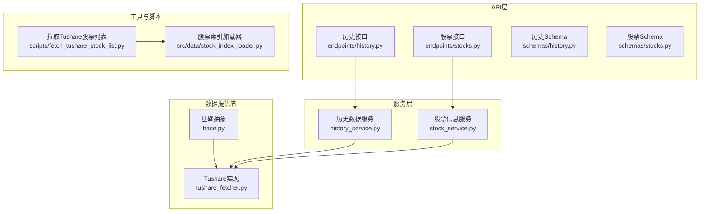
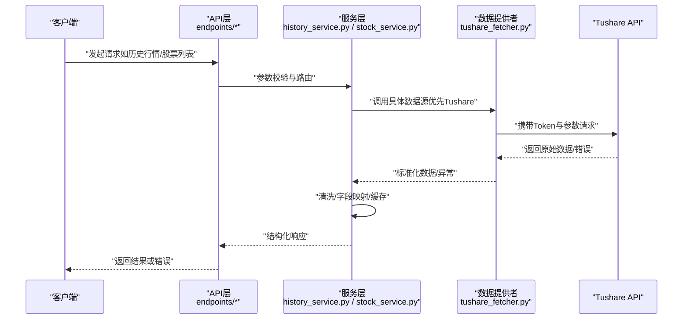
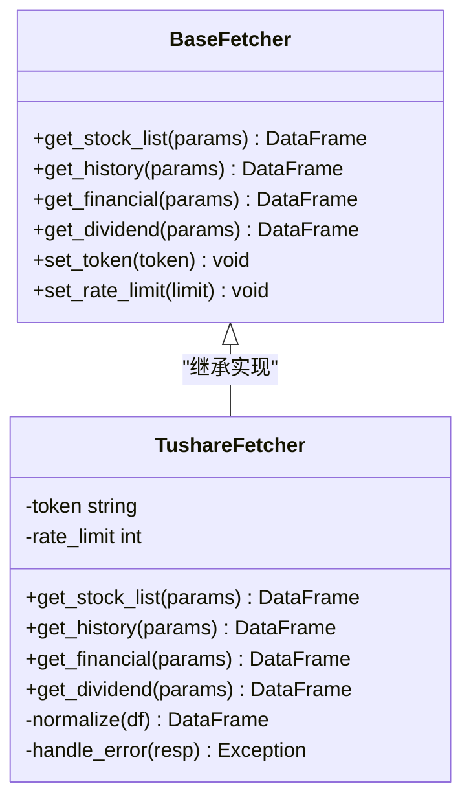
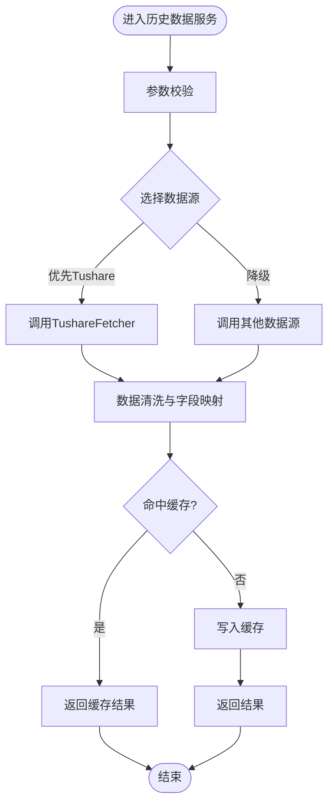
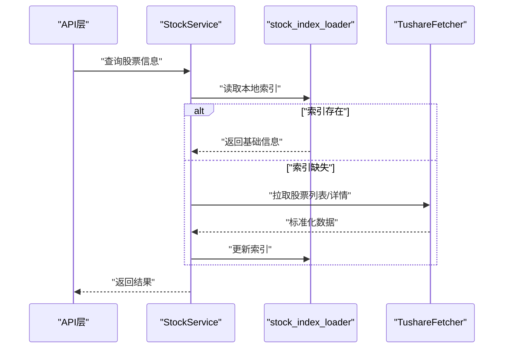
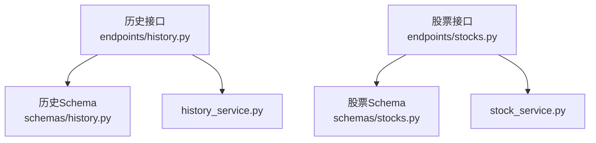
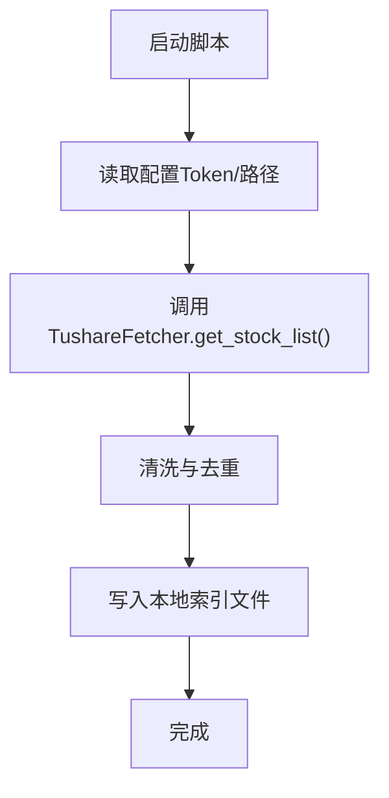
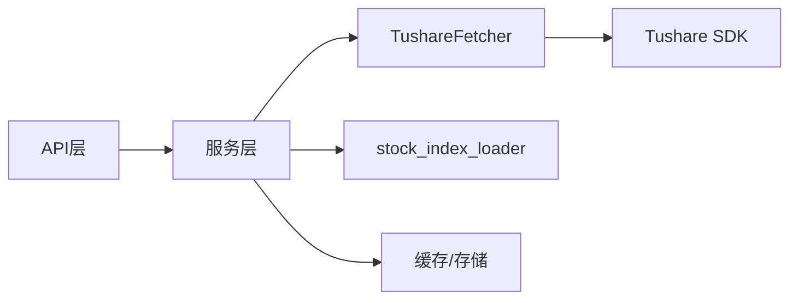

# Tushare数据源

<cite>
**本文档引用的文件**   
- [tushare_fetcher.py](file://data_provider/tushare_fetcher.py)
- [fetch_tushare_stock_list.py](file://scripts/fetch_tushare_stock_list.py)
- [test_tushare_fetcher_get_stock_list.py](file://tests/test_tushare_fetcher_get_stock_list.py)
- [test_tushare_fetcher_http_client.py](file://tests/test_tushare_fetcher_http_client.py)
- [test_tushare_fetcher_followups.py](file://tests/test_tushare_fetcher_followups.py)
- [base.py](file://data_provider/base.py)
- [config_manager.py](file://src/core/config_manager.py)
- [stock_index_loader.py](file://src/data/stock_index_loader.py)
- [history_service.py](file://src/services/history_service.py)
- [stock_service.py](file://src/services/stock_service.py)
- [history.py](file://api/v1/endpoints/history.py)
- [stocks.py](file://api/v1/endpoints/stocks.py)
- [history.py](file://api/v1/schemas/history.py)
- [stocks.py](file://api/v1/schemas/stocks.py)
</cite>

## 目录
1. [简介](#简介)
2. [项目结构](#项目结构)
3. [核心组件](#核心组件)
4. [架构总览](#架构总览)
5. [详细组件分析](#详细组件分析)
6. [依赖关系分析](#依赖关系分析)
7. [性能与限流](#性能与限流)
8. [故障排查指南](#故障排查指南)
9. [结论](#结论)
10. [附录：配置与接入清单](#附录配置与接入清单)

## 简介
本文件面向需要在系统中接入Tushare作为A股专业数据源的开发者，提供从Token注册、API权限申请、请求频率限制说明，到获取股票列表、历史行情、财务数据、分红送配等数据的完整接入指南。文档同时给出在系统中的集成方式、数据清洗与字段映射建议、错误处理策略，以及Tushare特有数据类型处理的注意事项。

## 项目结构
系统通过统一的数据提供者抽象层（Base Fetcher）对接多个数据源，Tushare是其中之一。Tushare相关代码主要位于 data_provider 模块，配套脚本用于初始化或刷新本地股票索引，服务层与API层负责对外暴露能力并编排调用流程。

图表来源
- [base.py](file://data_provider/base.py)
- [tushare_fetcher.py](file://data_provider/tushare_fetcher.py)
- [history_service.py](file://src/services/history_service.py)
- [stock_service.py](file://src/services/stock_service.py)
- [history.py](file://api/v1/endpoints/history.py)
- [stocks.py](file://api/v1/endpoints/stocks.py)
- [history.py](file://api/v1/schemas/history.py)
- [stocks.py](file://api/v1/schemas/stocks.py)
- [fetch_tushare_stock_list.py](file://scripts/fetch_tushare_stock_list.py)
- [stock_index_loader.py](file://src/data/stock_index_loader.py)

章节来源
- [tushare_fetcher.py](file://data_provider/tushare_fetcher.py)
- [base.py](file://data_provider/base.py)
- [history_service.py](file://src/services/history_service.py)
- [stock_service.py](file://src/services/stock_service.py)
- [history.py](file://api/v1/endpoints/history.py)
- [stocks.py](file://api/v1/endpoints/stocks.py)
- [history.py](file://api/v1/schemas/history.py)
- [stocks.py](file://api/v1/schemas/stocks.py)
- [fetch_tushare_stock_list.py](file://scripts/fetch_tushare_stock_list.py)
- [stock_index_loader.py](file://src/data/stock_index_loader.py)

## 核心组件
- 数据提供者抽象层（Base Fetcher）
  - 定义统一的获取方法签名、错误码、重试与超时策略、日志与追踪接口。
- Tushare数据提供者（TushareFetcher）
  - 封装Tushare SDK调用、Token管理、参数校验、分页与限流控制、结果标准化。
- 服务层（HistoryService / StockService）
  - 聚合多数据源，选择最优路径，进行数据清洗、字段映射、缓存与降级。
- API层（Endpoints + Schemas）
  - 对外暴露REST接口，定义输入输出契约，统一错误响应格式。
- 脚本与索引（fetch_tushare_stock_list.py / stock_index_loader.py）
  - 批量拉取并维护本地股票索引，提升查询效率与稳定性。

章节来源
- [base.py](file://data_provider/base.py)
- [tushare_fetcher.py](file://data_provider/tushare_fetcher.py)
- [history_service.py](file://src/services/history_service.py)
- [stock_service.py](file://src/services/stock_service.py)
- [history.py](file://api/v1/endpoints/history.py)
- [stocks.py](file://api/v1/endpoints/stocks.py)
- [history.py](file://api/v1/schemas/history.py)
- [stocks.py](file://api/v1/schemas/stocks.py)
- [fetch_tushare_stock_list.py](file://scripts/fetch_tushare_stock_list.py)
- [stock_index_loader.py](file://src/data/stock_index_loader.py)

## 架构总览
下图展示从API请求到Tushare数据返回的端到端流程，包括鉴权、路由、数据获取、清洗与返回。

图表来源
- [history.py](file://api/v1/endpoints/history.py)
- [stocks.py](file://api/v1/endpoints/stocks.py)
- [history_service.py](file://src/services/history_service.py)
- [stock_service.py](file://src/services/stock_service.py)
- [tushare_fetcher.py](file://data_provider/tushare_fetcher.py)

## 详细组件分析

### TushareFetcher 组件分析
- 职责
  - 管理Tushare Token与认证
  - 封装常用接口：股票列表、历史行情、财务指标、分红送配等
  - 处理分页、限流、重试、超时与错误码
  - 将Tushare原始数据结构转换为系统内部标准格式
- 关键设计点
  - 与Base Fetcher保持一致的方法签名，便于服务层切换数据源
  - 内置类型转换与空值处理，避免下游出现NaN/None导致的计算异常
  - 对高频接口实施指数退避与并发控制
- 典型调用链
  - 获取股票列表：TushareFetcher.get_stock_list() → 标准化为[{"code","name"}]
  - 获取历史行情：TushareFetcher.get_history() → 按日期排序、复权处理、缺失填充
  - 获取财务数据：TushareFetcher.get_financial() → 字段映射、单位换算、季度对齐
  - 获取分红送配：TushareFetcher.get_dividend() → 事件时间线整理、除权除息标记

图表来源
- [base.py](file://data_provider/base.py)
- [tushare_fetcher.py](file://data_provider/tushare_fetcher.py)

章节来源
- [tushare_fetcher.py](file://data_provider/tushare_fetcher.py)
- [base.py](file://data_provider/base.py)

### 历史数据服务（HistoryService）
- 职责
  - 聚合多数据源（Tushare、AkShare、YFinance等），根据可用性与质量选择最佳路径
  - 统一清洗、字段映射、复权处理、缺失值填充
  - 缓存热点数据，降低重复请求压力
- 关键流程
  - 接收API请求 → 参数校验 → 选择数据源 → 调用TushareFetcher → 清洗与映射 → 返回

图表来源
- [history_service.py](file://src/services/history_service.py)
- [tushare_fetcher.py](file://data_provider/tushare_fetcher.py)

章节来源
- [history_service.py](file://src/services/history_service.py)
- [tushare_fetcher.py](file://data_provider/tushare_fetcher.py)

### 股票信息服务（StockService）
- 职责
  - 提供股票基本信息、板块归属、交易状态等查询
  - 与本地索引（stock_index_loader）协同，减少远程调用
- 关键流程
  - 接收API请求 → 查本地索引 → 若缺失则调用TushareFetcher补充 → 更新索引

图表来源
- [stock_service.py](file://src/services/stock_service.py)
- [stock_index_loader.py](file://src/data/stock_index_loader.py)
- [tushare_fetcher.py](file://data_provider/tushare_fetcher.py)

章节来源
- [stock_service.py](file://src/services/stock_service.py)
- [stock_index_loader.py](file://src/data/stock_index_loader.py)
- [tushare_fetcher.py](file://data_provider/tushare_fetcher.py)

### API层（Endpoints & Schemas）
- endpoints/history.py、endpoints/stocks.py：定义REST接口，处理鉴权、参数校验、错误包装
- schemas/history.py、schemas/stocks.py：定义输入输出结构，确保前后端契约一致

图表来源
- [history.py](file://api/v1/endpoints/history.py)
- [stocks.py](file://api/v1/endpoints/stocks.py)
- [history.py](file://api/v1/schemas/history.py)
- [stocks.py](file://api/v1/schemas/stocks.py)
- [history_service.py](file://src/services/history_service.py)
- [stock_service.py](file://src/services/stock_service.py)

章节来源
- [history.py](file://api/v1/endpoints/history.py)
- [stocks.py](file://api/v1/endpoints/stocks.py)
- [history.py](file://api/v1/schemas/history.py)
- [stocks.py](file://api/v1/schemas/stocks.py)

### 脚本与索引（fetch_tushare_stock_list.py / stock_index_loader.py）
- fetch_tushare_stock_list.py：批量拉取Tushare股票列表，生成CSV/JSON供索引使用
- stock_index_loader.py：加载本地索引，支持增量更新与失效清理

图表来源
- [fetch_tushare_stock_list.py](file://scripts/fetch_tushare_stock_list.py)
- [stock_index_loader.py](file://src/data/stock_index_loader.py)
- [tushare_fetcher.py](file://data_provider/tushare_fetcher.py)

章节来源
- [fetch_tushare_stock_list.py](file://scripts/fetch_tushare_stock_list.py)
- [stock_index_loader.py](file://src/data/stock_index_loader.py)
- [tushare_fetcher.py](file://data_provider/tushare_fetcher.py)

## 依赖关系分析
- TushareFetcher依赖Tushare SDK与网络库，需正确配置Token与访问域名
- HistoryService/StockService依赖TushareFetcher及本地缓存/索引
- API层依赖服务层与Schema定义，保证契约一致性
- 脚本依赖TushareFetcher与文件系统，用于初始化索引

图表来源
- [history.py](file://api/v1/endpoints/history.py)
- [stocks.py](file://api/v1/endpoints/stocks.py)
- [history_service.py](file://src/services/history_service.py)
- [stock_service.py](file://src/services/stock_service.py)
- [tushare_fetcher.py](file://data_provider/tushare_fetcher.py)
- [stock_index_loader.py](file://src/data/stock_index_loader.py)

章节来源
- [history.py](file://api/v1/endpoints/history.py)
- [stocks.py](file://api/v1/endpoints/stocks.py)
- [history_service.py](file://src/services/history_service.py)
- [stock_service.py](file://src/services/stock_service.py)
- [tushare_fetcher.py](file://data_provider/tushare_fetcher.py)
- [stock_index_loader.py](file://src/data/stock_index_loader.py)

## 性能与限流
- 请求频率限制
  - Tushare对未付费与付费用户有不同的QPS限制；建议在TushareFetcher中设置rate_limit并启用指数退避
  - 对高频接口（如分钟级行情、实时报价）应增加冷却时间与并发上限
- 缓存策略
  - 历史日频数据可缓存较长时间（如日线级别按日缓存）
  - 实时数据缓存时间较短（秒级），避免过期导致不一致
- 分页与批处理
  - 股票列表与财务数据通常分页返回，应在TushareFetcher中合并分页结果，减少往返次数
- 连接池与超时
  - 合理设置HTTP连接池大小与超时时间，避免阻塞与资源泄漏

章节来源
- [tushare_fetcher.py](file://data_provider/tushare_fetcher.py)
- [history_service.py](file://src/services/history_service.py)

## 故障排查指南
- Token无效或权限不足
  - 检查环境变量或配置文件中的Token是否正确
  - 确认已申请所需接口的权限（如历史行情、财务数据、分红送配）
- 请求被限流
  - 观察返回的错误码，适当降低请求频率或升级Tushare套餐
  - 在TushareFetcher中启用重试与退避策略
- 数据缺失或异常
  - 检查日期范围是否包含停牌日或节假日
  - 对缺失数据进行插值或标记，避免下游计算出错
- 索引不同步
  - 定期运行fetch_tushare_stock_list.py更新本地索引
  - 在StockService中增加索引失效检测与自动刷新逻辑

章节来源
- [test_tushare_fetcher_http_client.py](file://tests/test_tushare_fetcher_http_client.py)
- [test_tushare_fetcher_get_stock_list.py](file://tests/test_tushare_fetcher_get_stock_list.py)
- [test_tushare_fetcher_followups.py](file://tests/test_tushare_fetcher_followups.py)
- [fetch_tushare_stock_list.py](file://scripts/fetch_tushare_stock_list.py)

## 结论
通过统一的Base Fetcher抽象与TushareFetcher实现，系统能够稳定地接入Tushare提供的A股数据。服务层负责数据清洗、字段映射与缓存，API层提供清晰的契约。配合脚本与索引机制，可有效提升查询性能与系统韧性。建议在生产环境中严格配置Token与限流策略，并建立完善的监控与告警机制。

## 附录：配置与接入清单
- Token注册与配置
  - 在Tushare官网注册账号并获取Token
  - 将Token配置到环境变量或配置文件，供TushareFetcher读取
- API权限申请
  - 在Tushare控制台申请所需接口权限（历史行情、财务数据、分红送配等）
  - 确认权限生效后再进行测试调用
- 请求频率限制
  - 根据套餐等级设置合理的rate_limit
  - 在TushareFetcher中启用指数退避与重试
- 数据获取步骤
  - 使用fetch_tushare_stock_list.py拉取并更新本地股票索引
  - 通过HistoryService/StockService调用TushareFetcher获取历史行情与财务数据
  - 对返回数据进行清洗、字段映射与格式化后入库或返回前端
- 数据清洗与字段映射
  - 统一日期格式（YYYY-MM-DD）、数值精度与单位
  - 处理缺失值、异常值与停牌日
- 错误处理
  - 捕获网络异常、权限错误、限流错误
  - 记录详细日志并上报监控平台
- 系统集成
  - 在HistoryService/StockService中优先选择TushareFetcher，失败时降级到其他数据源
  - 使用stock_index_loader维护本地索引，减少远程调用

章节来源
- [tushare_fetcher.py](file://data_provider/tushare_fetcher.py)
- [history_service.py](file://src/services/history_service.py)
- [stock_service.py](file://src/services/stock_service.py)
- [fetch_tushare_stock_list.py](file://scripts/fetch_tushare_stock_list.py)
- [stock_index_loader.py](file://src/data/stock_index_loader.py)