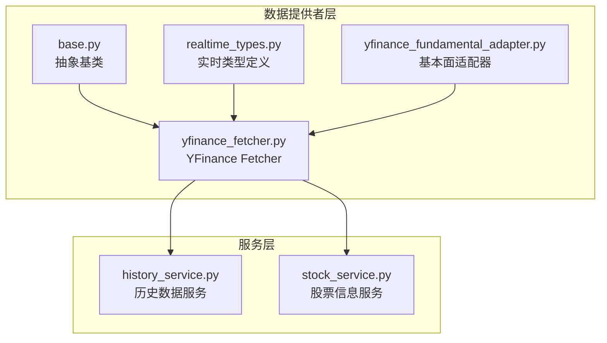
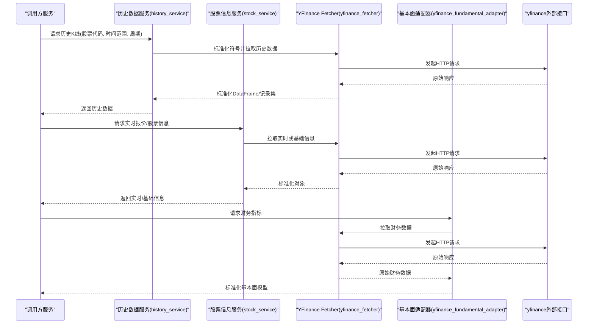
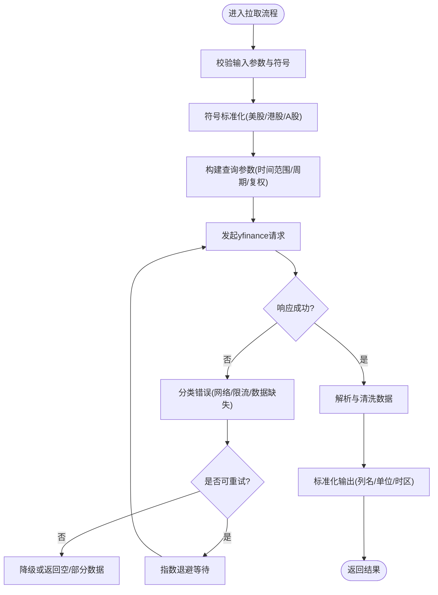
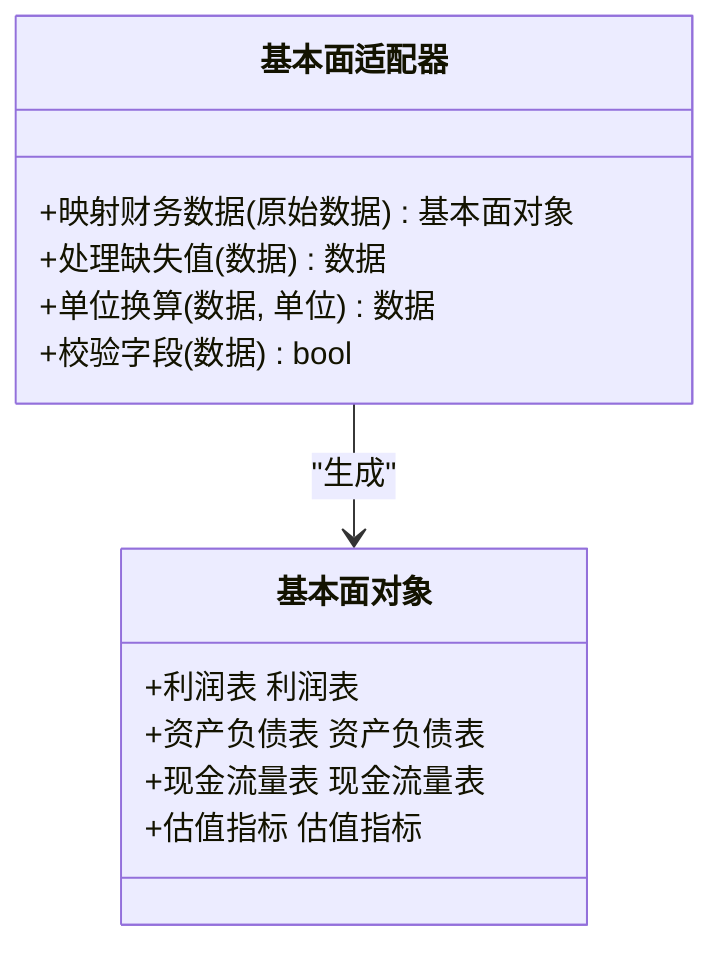
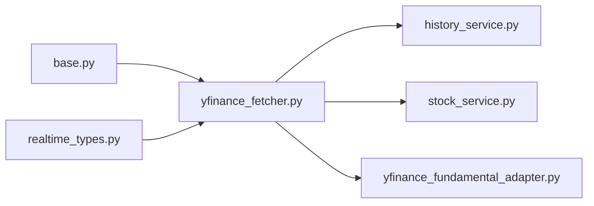

# YFinance数据源

<cite>
**本文档引用的文件**   
- [yfinance_fetcher.py](file://data_provider/yfinance_fetcher.py)
- [yfinance_fundamental_adapter.py](file://data_provider/yfinance_fundamental_adapter.py)
- [base.py](file://data_provider/base.py)
- [realtime_types.py](file://data_provider/realtime_types.py)
- [history_service.py](file://src/services/history_service.py)
- [stock_service.py](file://src/services/stock_service.py)
- [test_yfinance_hk_bare_code.py](file://tests/test_yfinance_hk_bare_code.py)
- [test_yfinance_us_indices.py](file://tests/test_yfinance_us_indices.py)
- [test_yfinance_normalize.py](file://tests/test_yfinance_normalize.py)
- [test_yfinance_fundamental_adapter.py](file://tests/test_yfinance_fundamental_adapter.py)
</cite>

## 目录
1. [简介](#简介)
2. [项目结构](#项目结构)
3. [核心组件](#核心组件)
4. [架构总览](#架构总览)
5. [详细组件分析](#详细组件分析)
6. [依赖关系分析](#依赖关系分析)
7. [性能与缓存策略](#性能与缓存策略)
8. [故障排查指南](#故障排查指南)
9. [结论](#结论)
10. [附录：使用示例与最佳实践](#附录使用示例与最佳实践)

## 简介
本文件面向需要在项目中集成YFinance作为美股、港股、A股主要数据源的开发者，提供从配置到调用的完整说明。内容涵盖：
- API密钥与环境配置（如需要）
- 请求频率限制与重试机制
- 获取股票基本信息、历史K线、实时报价、财务指标等
- 时间范围设置、数据格式转换、异常处理
- 与基本面数据适配器的集成方法
- 数据缓存策略与性能优化技巧

## 项目结构
YFinance相关代码位于 data_provider 目录下，包含通用基类、具体Fetcher实现、实时数据类型定义以及基本面适配器；上层服务通过 history_service 和 stock_service 统一调用。

图表来源
- [base.py](file://data_provider/base.py)
- [yfinance_fetcher.py](file://data_provider/yfinance_fetcher.py)
- [realtime_types.py](file://data_provider/realtime_types.py)
- [yfinance_fundamental_adapter.py](file://data_provider/yfinance_fundamental_adapter.py)
- [history_service.py](file://src/services/history_service.py)
- [stock_service.py](file://src/services/stock_service.py)

章节来源
- [yfinance_fetcher.py](file://data_provider/yfinance_fetcher.py)
- [yfinance_fundamental_adapter.py](file://data_provider/yfinance_fundamental_adapter.py)
- [base.py](file://data_provider/base.py)
- [realtime_types.py](file://data_provider/realtime_types.py)
- [history_service.py](file://src/services/history_service.py)
- [stock_service.py](file://src/services/stock_service.py)

## 核心组件
- 抽象基类（base.py）：定义数据提供者的统一接口，包括历史K线、实时报价、股票信息等方法的签名与返回类型约定。
- YFinance Fetcher（yfinance_fetcher.py）：基于yfinance库的具体实现，负责将不同市场（美股、港股、A股）的符号规范化、参数校验、请求封装与结果标准化。
- 实时类型（realtime_types.py）：定义实时报价数据结构，确保跨来源一致性。
- 基本面适配器（yfinance_fundamental_adapter.py）：将yfinance提供的财务数据映射为系统内部的基本面模型，供分析与报告模块消费。

章节来源
- [base.py](file://data_provider/base.py)
- [yfinance_fetcher.py](file://data_provider/yfinance_fetcher.py)
- [realtime_types.py](file://data_provider/realtime_types.py)
- [yfinance_fundamental_adapter.py](file://data_provider/yfinance_fundamental_adapter.py)

## 架构总览
YFinance数据源通过统一的Fetcher接口暴露能力，上层服务按需调用历史与实时数据，基本面数据由适配器转换后进入分析管线。

图表来源
- [history_service.py](file://src/services/history_service.py)
- [stock_service.py](file://src/services/stock_service.py)
- [yfinance_fetcher.py](file://data_provider/yfinance_fetcher.py)
- [yfinance_fundamental_adapter.py](file://data_provider/yfinance_fundamental_adapter.py)

## 详细组件分析

### YFinance Fetcher（yfinance_fetcher.py）
- 职责
  - 统一符号规范：支持美股、港股、A股的常见后缀与裸码（例如港股无后缀），自动补全或识别交易所。
  - 历史K线：按日/周/月等周期拉取指定时间范围的OHLCV数据，并进行缺失值与异常值处理。
  - 实时报价：获取最新价、涨跌幅、成交量等关键指标，兼容不同市场的字段差异。
  - 股票信息：公司名、行业、市值、上市日期等基础元数据。
  - 错误与限流：捕获网络异常、超时、限流错误，进行指数退避重试与降级。
- 关键流程
  - 输入校验与符号标准化
  - 构建yfinance查询参数（起止时间、周期、复权方式）
  - 发起请求与响应解析
  - 数据清洗与标准化（列名对齐、单位换算、时区处理）
  - 异常分类与重试策略

图表来源
- [yfinance_fetcher.py](file://data_provider/yfinance_fetcher.py)

章节来源
- [yfinance_fetcher.py](file://data_provider/yfinance_fetcher.py)

### 基本面适配器（yfinance_fundamental_adapter.py）
- 职责
  - 将yfinance返回的财务报表（利润表、资产负债表、现金流量表）与估值指标映射为内部模型。
  - 处理字段命名差异、单位不一致（百万/十亿）、缺失值填充与异常值过滤。
  - 提供统一的接口供分析服务消费，保证跨数据源的一致性。
- 关键流程
  - 接收原始财务数据
  - 字段映射与类型转换
  - 缺失值与异常值处理
  - 输出标准化基本面对象

图表来源
- [yfinance_fundamental_adapter.py](file://data_provider/yfinance_fundamental_adapter.py)

章节来源
- [yfinance_fundamental_adapter.py](file://data_provider/yfinance_fundamental_adapter.py)

### 实时类型（realtime_types.py）
- 职责
  - 定义实时报价的数据结构，包括价格、涨跌、成交量、换手率、市盈率等字段。
  - 统一不同数据源的字段名称与单位，便于上层服务一致消费。
- 关键点
  - 字段可选性与默认值
  - 数值精度与时区标注
  - 扩展性：预留未来新增字段的空间

章节来源
- [realtime_types.py](file://data_provider/realtime_types.py)

### 历史数据服务（history_service.py）
- 职责
  - 协调多个数据源（含YFinance）获取历史K线，提供缓存、重试与聚合能力。
  - 根据时间窗口与周期选择合适的数据源与策略。
- 关键点
  - 时间窗口解析与边界处理
  - 多源并行与失败回退
  - 本地缓存键设计与过期策略

章节来源
- [history_service.py](file://src/services/history_service.py)

### 股票信息服务（stock_service.py）
- 职责
  - 提供股票基础信息与实时报价的统一入口，屏蔽底层数据源差异。
  - 管理缓存与并发访问，避免重复请求。
- 关键点
  - 符号解析与路由
  - 缓存命中与失效
  - 错误上报与监控

章节来源
- [stock_service.py](file://src/services/stock_service.py)

## 依赖关系分析
- 内部依赖
  - yfinance_fetcher依赖base定义的抽象接口与realtime_types定义的数据结构。
  - yfinance_fundamental_adapter依赖yfinance_fetcher输出的原始财务数据。
  - history_service与stock_service依赖yfinance_fetcher与适配器以完成业务逻辑。
- 外部依赖
  - yfinance库用于美股、港股、A股数据的抓取。
  - 可能的第三方缓存或限流中间件（由上层服务注入）。

图表来源
- [base.py](file://data_provider/base.py)
- [yfinance_fetcher.py](file://data_provider/yfinance_fetcher.py)
- [realtime_types.py](file://data_provider/realtime_types.py)
- [yfinance_fundamental_adapter.py](file://data_provider/yfinance_fundamental_adapter.py)
- [history_service.py](file://src/services/history_service.py)
- [stock_service.py](file://src/services/stock_service.py)

章节来源
- [base.py](file://data_provider/base.py)
- [yfinance_fetcher.py](file://data_provider/yfinance_fetcher.py)
- [realtime_types.py](file://data_provider/realtime_types.py)
- [yfinance_fundamental_adapter.py](file://data_provider/yfinance_fundamental_adapter.py)
- [history_service.py](file://src/services/history_service.py)
- [stock_service.py](file://src/services/stock_service.py)

## 性能与缓存策略
- 缓存设计
  - 历史K线：按“股票代码+周期+时间范围”生成缓存键，设置合理的TTL（如盘中高频更新、盘后低频刷新）。
  - 实时报价：短TTL（秒级）缓存，结合版本号或时间戳失效。
  - 基本面数据：长TTL（小时/天级），在财报季或重大事件后主动失效。
- 并发与限流
  - 对yfinance的请求进行速率控制，避免触发对方限流。
  - 使用指数退避重试，区分网络错误与业务错误。
- 数据预处理
  - 批量拉取与合并，减少HTTP往返。
  - 缺失值插值与异常值剔除，提升下游分析稳定性。
- 监控与告警
  - 记录请求耗时、失败率、缓存命中率。
  - 针对频繁失败的标的或时段进行告警与降级。

[本节为通用指导，不直接分析具体文件]

## 故障排查指南
- 常见问题
  - 符号不规范导致无法解析（尤其是港股裸码与A股后缀）
  - 时间范围过大或过小导致数据缺失或请求超时
  - 网络波动与限流导致的间歇性失败
  - 财务数据字段缺失或单位不一致
- 排查步骤
  - 检查符号标准化逻辑与交易所映射
  - 验证时间范围与周期组合是否符合yfinance约束
  - 查看重试与退避日志，确认是否达到最大重试次数
  - 对比原始响应与标准化后的字段，定位转换问题
- 建议
  - 增加单元测试覆盖边界场景（如港股裸码、美股指数、A股停牌）
  - 引入Mock与沙箱环境，模拟限流与超时
  - 完善错误分类与上报，便于快速定位

章节来源
- [test_yfinance_hk_bare_code.py](file://tests/test_yfinance_hk_bare_code.py)
- [test_yfinance_us_indices.py](file://tests/test_yfinance_us_indices.py)
- [test_yfinance_normalize.py](file://tests/test_yfinance_normalize.py)
- [test_yfinance_fundamental_adapter.py](file://tests/test_yfinance_fundamental_adapter.py)

## 结论
YFinance数据源在本项目中通过统一的Fetcher与适配器实现了跨市场、跨数据类型的一致接入。配合历史与股票信息服务，能够稳定地提供K线、实时报价与基本面数据。通过合理的缓存、限流与重试策略，可在高并发与不稳定网络环境下保持良好性能与可用性。

[本节为总结，不直接分析具体文件]

## 附录：使用示例与最佳实践
- 配置要点
  - 如需API密钥（某些第三方增强功能），请在环境变量或配置中心中设置对应键值。
  - 设置全局请求超时与重试上限，避免长时间阻塞。
- 历史K线调用
  - 设置时间范围（开始/结束）与周期（日/周/月），注意时区与交易日历。
  - 处理缺失值与复权方式（前复权/后复权），确保后续分析一致性。
- 实时报价调用
  - 短TTL缓存，结合版本号失效；对失败请求进行快速回退。
  - 关注涨跌停、停牌等特殊状态的处理。
- 基本面数据调用
  - 使用适配器进行字段映射与单位换算，统一输出模型。
  - 财报发布后及时刷新缓存，避免使用过期数据。
- 异常处理
  - 区分网络错误、限流错误与数据缺失，分别采取重试、降级或提示用户。
  - 记录详细上下文（股票代码、时间范围、周期、错误码），便于追踪。
- 性能优化
  - 批量拉取与合并请求，减少HTTP开销。
  - 合理设置缓存TTL与失效策略，平衡新鲜度与性能。
  - 监控关键指标（延迟、成功率、缓存命中率），持续优化。

章节来源
- [yfinance_fetcher.py](file://data_provider/yfinance_fetcher.py)
- [yfinance_fundamental_adapter.py](file://data_provider/yfinance_fundamental_adapter.py)
- [history_service.py](file://src/services/history_service.py)
- [stock_service.py](file://src/services/stock_service.py)