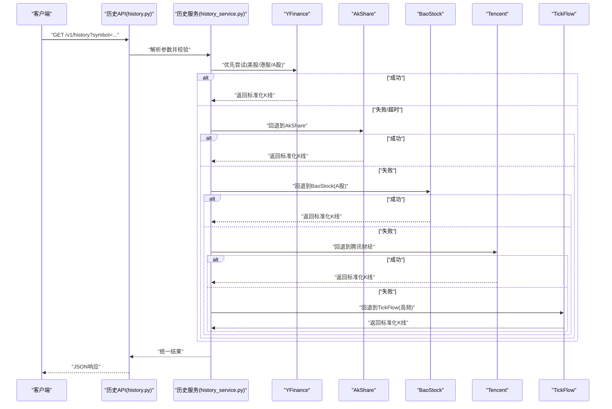
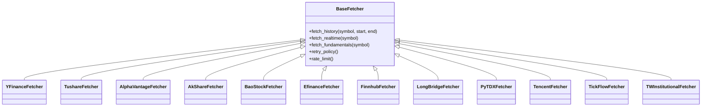

# 现有数据源使用

<cite>
**本文引用的文件**   
- [data_provider/base.py](file://data_provider/base.py)
- [data_provider/yfinance_fetcher.py](file://data_provider/yfinance_fetcher.py)
- [data_provider/tushare_fetcher.py](file://data_provider/tushare_fetcher.py)
- [data_provider/alphavantage_fetcher.py](file://data_provider/alphavantage_fetcher.py)
- [data_provider/akshare_fetcher.py](file://data_provider/akshare_fetcher.py)
- [data_provider/baostock_fetcher.py](file://data_provider/baostock_fetcher.py)
- [data_provider/efinance_fetcher.py](file://data_provider/efinance_fetcher.py)
- [data_provider/finnhub_fetcher.py](file://data_provider/finnhub_fetcher.py)
- [data_provider/longbridge_fetcher.py](file://data_provider/longbridge_fetcher.py)
- [data_provider/pytdx_fetcher.py](file://data_provider/pytdx_fetcher.py)
- [data_provider/tencent_fetcher.py](file://data_provider/tencent_fetcher.py)
- [data_provider/tickflow_fetcher.py](file://data_provider/tickflow_fetcher.py)
- [data_provider/tw_institutional_fetcher.py](file://data_provider/tw_institutional_fetcher.py)
- [data_provider/fundamental_adapter.py](file://data_provider/fundamental_adapter.py)
- [data_provider/yfinance_fundamental_adapter.py](file://data_provider/yfinance_fundamental_adapter.py)
- [data_provider/realtime_types.py](file://data_provider/realtime_types.py)
- [data_provider/us_index_mapping.py](file://data_provider/us_index_mapping.py)
- [src/services/history_service.py](file://src/services/history_service.py)
- [src/services/stock_service.py](file://src/services/stock_service.py)
- [api/v1/endpoints/history.py](file://api/v1/endpoints/history.py)
- [api/v1/endpoints/stocks.py](file://api/v1/endpoints/stocks.py)
- [scripts/generate_longbridge_oauth_token.py](file://scripts/generate_longbridge_oauth_token.py)
</cite>

## 目录
1. [简介](#简介)
2. [项目结构](#项目结构)
3. [核心组件](#核心组件)
4. [架构总览](#架构总览)
5. [详细组件分析](#详细组件分析)
6. [依赖关系分析](#依赖关系分析)
7. [性能与限制](#性能与限制)
8. [故障排查指南](#故障排查指南)
9. [结论](#结论)
10. [附录：各数据源配置与接入步骤](#附录各数据源配置与接入步骤)

## 简介
本文件面向使用者与集成者，系统化梳理本项目已实现的数据源能力与接入方式。覆盖YFinance（美股、港股、A股）、Tushare（A股专业数据）、Alpha Vantage（全球市场）、AkShare（开源财经数据）、BaoStock（A股历史数据）、Efinance（东方财富数据）、FinnHub（美股实时数据）、LongBridge（长桥证券）、PyTDX（通达信数据）、Tencent（腾讯财经）、TickFlow（高频数据）、TW Institutional（台湾机构数据）等。文档包含各数据源的API密钥配置、请求频率限制、数据覆盖范围与更新频率说明，并提供调用示例路径与选择策略、故障转移机制的使用指南。

## 项目结构
数据获取相关代码集中在 data_provider 目录，每个数据源一个 fetcher 模块；基础抽象与通用类型定义在 base.py 与 realtime_types.py；财务数据适配层在 fundamental_adapter.py 与 yfinance_fundamental_adapter.py；指数映射在 us_index_mapping.py。上层服务通过 src/services 中的 history_service.py、stock_service.py 统一调度数据源；对外API在 api/v1/endpoints 暴露历史行情与股票信息接口。

```mermaid
graph TB
subgraph "数据提供者(data_provider)"
base["base.py"]
yf["yfinance_fetcher.py"]
ts["tushare_fetcher.py"]
av["alphavantage_fetcher.py"]
ak["akshare_fetcher.py"]
bs["baostock_fetcher.py"]
ef["efinance_fetcher.py"]
fh["finnhub_fetcher.py"]
lb["longbridge_fetcher.py"]
tdx["pytdx_fetcher.py"]
tenc["tencent_fetcher.py"]
tf["tickflow_fetcher.py"]
tw["tw_institutional_fetcher.py"]
fa["fundamental_adapter.py"]
yfa["yfinance_fundamental_adapter.py"]
rt["realtime_types.py"]
um["us_index_mapping.py"]
end
subgraph "服务层(src/services)"
hs["history_service.py"]
ss["stock_service.py"]
end
subgraph "API层(api/v1/endpoints)"
he["history.py"]
se["stocks.py"]
end
base --> yf
base --> ts
base --> av
base --> ak
base --> bs
base --> ef
base --> fh
base --> lb
base --> tdx
base --> tenc
base --> tf
base --> tw
rt --> yf
rt --> fh
rt --> tenc
rt --> tf
um --> yf
fa --> yf
yfa --> yf
hs --> yf
hs --> ts
hs --> av
hs --> ak
hs --> bs
hs --> ef
hs --> tenc
hs --> tf
hs --> tw
ss --> yf
ss --> fh
ss --> tenc
ss --> ef
he --> hs
se --> ss
```

图表来源
- [data_provider/base.py](file://data_provider/base.py)
- [data_provider/yfinance_fetcher.py](file://data_provider/yfinance_fetcher.py)
- [data_provider/tushare_fetcher.py](file://data_provider/tushare_fetcher.py)
- [data_provider/alphavantage_fetcher.py](file://data_provider/alphavantage_fetcher.py)
- [data_provider/akshare_fetcher.py](file://data_provider/akshare_fetcher.py)
- [data_provider/baostock_fetcher.py](file://data_provider/baostock_fetcher.py)
- [data_provider/efinance_fetcher.py](file://data_provider/efinance_fetcher.py)
- [data_provider/finnhub_fetcher.py](file://data_provider/finnhub_fetcher.py)
- [data_provider/longbridge_fetcher.py](file://data_provider/longbridge_fetcher.py)
- [data_provider/pytdx_fetcher.py](file://data_provider/pytdx_fetcher.py)
- [data_provider/tencent_fetcher.py](file://data_provider/tencent_fetcher.py)
- [data_provider/tickflow_fetcher.py](file://data_provider/tickflow_fetcher.py)
- [data_provider/tw_institutional_fetcher.py](file://data_provider/tw_institutional_fetcher.py)
- [data_provider/fundamental_adapter.py](file://data_provider/fundamental_adapter.py)
- [data_provider/yfinance_fundamental_adapter.py](file://data_provider/yfinance_fundamental_adapter.py)
- [data_provider/realtime_types.py](file://data_provider/realtime_types.py)
- [data_provider/us_index_mapping.py](file://data_provider/us_index_mapping.py)
- [src/services/history_service.py](file://src/services/history_service.py)
- [src/services/stock_service.py](file://src/services/stock_service.py)
- [api/v1/endpoints/history.py](file://api/v1/endpoints/history.py)
- [api/v1/endpoints/stocks.py](file://api/v1/endpoints/stocks.py)

章节来源
- [data_provider/base.py](file://data_provider/base.py)
- [src/services/history_service.py](file://src/services/history_service.py)
- [src/services/stock_service.py](file://src/services/stock_service.py)
- [api/v1/endpoints/history.py](file://api/v1/endpoints/history.py)
- [api/v1/endpoints/stocks.py](file://api/v1/endpoints/stocks.py)

## 核心组件
- 数据源基类与协议：定义统一的拉取接口、错误处理与重试策略，确保不同提供商行为一致。
- 具体Fetcher实现：每个数据源一个模块，封装认证、限流、数据转换与异常处理。
- 实时数据类型：统一实时报价、盘口、逐笔等数据结构，便于上层消费。
- 财务数据适配器：将不同提供商的财报/指标归一化为标准字段。
- 服务层：history_service.py 负责历史K线、基本面等多源聚合与回退；stock_service.py 负责股票信息与实时报价路由。
- API端点：history.py、stocks.py 暴露REST接口供前端或外部系统调用。

章节来源
- [data_provider/base.py](file://data_provider/base.py)
- [data_provider/realtime_types.py](file://data_provider/realtime_types.py)
- [data_provider/fundamental_adapter.py](file://data_provider/fundamental_adapter.py)
- [data_provider/yfinance_fundamental_adapter.py](file://data_provider/yfinance_fundamental_adapter.py)
- [src/services/history_service.py](file://src/services/history_service.py)
- [src/services/stock_service.py](file://src/services/stock_service.py)
- [api/v1/endpoints/history.py](file://api/v1/endpoints/history.py)
- [api/v1/endpoints/stocks.py](file://api/v1/endpoints/stocks.py)

## 架构总览
整体采用“多源并行+智能回退”的架构：服务层根据标的与市场特征选择最优数据源，失败时自动切换备用源，保证高可用与低延迟。

图表来源
- [api/v1/endpoints/history.py](file://api/v1/endpoints/history.py)
- [src/services/history_service.py](file://src/services/history_service.py)
- [data_provider/yfinance_fetcher.py](file://data_provider/yfinance_fetcher.py)
- [data_provider/akshare_fetcher.py](file://data_provider/akshare_fetcher.py)
- [data_provider/baostock_fetcher.py](file://data_provider/baostock_fetcher.py)
- [data_provider/tencent_fetcher.py](file://data_provider/tencent_fetcher.py)
- [data_provider/tickflow_fetcher.py](file://data_provider/tickflow_fetcher.py)

## 详细组件分析

### 数据源基类与统一协议
- 职责：定义统一的拉取方法签名、错误码、重试与限流策略、日志与追踪。
- 关键点：所有Fetcher需实现相同接口，便于服务层无感切换；提供标准化输出格式。

章节来源
- [data_provider/base.py](file://data_provider/base.py)

### YFinance（美股、港股、A股）
- 能力：历史K线、实时报价、财务数据（经适配器归一化）、指数映射。
- 配置：通常无需API Key；可通过环境变量控制代理、超时与并发。
- 限制：第三方速率限制与可用性波动较大，建议配合缓存与回退。
- 覆盖：美股为主，港股与A股支持度因标的而异。
- 更新频率：盘中/盘后取决于交易所与提供方。
- 使用示例路径：[data_provider/yfinance_fetcher.py](file://data_provider/yfinance_fetcher.py)、[data_provider/yfinance_fundamental_adapter.py](file://data_provider/yfinance_fundamental_adapter.py)、[data_provider/us_index_mapping.py](file://data_provider/us_index_mapping.py)

章节来源
- [data_provider/yfinance_fetcher.py](file://data_provider/yfinance_fetcher.py)
- [data_provider/yfinance_fundamental_adapter.py](file://data_provider/yfinance_fundamental_adapter.py)
- [data_provider/us_index_mapping.py](file://data_provider/us_index_mapping.py)

### Tushare（A股专业数据）
- 能力：A股历史K线、财务指标、资金流向、公告等。
- 配置：需要Tushare Token（环境变量配置）。
- 限制：按积分与频率限制；需合理分片与缓存。
- 覆盖：A股全量数据较完善。
- 更新频率：日频为主，部分分钟级数据受权限影响。
- 使用示例路径：[data_provider/tushare_fetcher.py](file://data_provider/tushare_fetcher.py)

章节来源
- [data_provider/tushare_fetcher.py](file://data_provider/tushare_fetcher.py)

### Alpha Vantage（全球市场）
- 能力：全球主要市场历史与实时数据、技术指标、外汇与加密货币。
- 配置：需要API Key（环境变量配置）。
- 限制：免费额度有限，付费额度更高；有每日请求上限。
- 覆盖：美股、欧股、亚太指数与外汇等。
- 更新频率：盘中/收盘，视产品而定。
- 使用示例路径：[data_provider/alphavantage_fetcher.py](file://data_provider/alphavantage_fetcher.py)

章节来源
- [data_provider/alphavantage_fetcher.py](file://data_provider/alphavantage_fetcher.py)

### AkShare（开源财经数据）
- 能力：A股/港股/美股历史与实时、宏观数据、期货期权等。
- 配置：无需Key；注意网络与反爬策略。
- 限制：稳定性与速率受上游站点影响，建议加重试与降级。
- 覆盖：国内数据丰富，国际数据相对有限。
- 更新频率：多为日频，部分实时接口受限于上游。
- 使用示例路径：[data_provider/akshare_fetcher.py](file://data_provider/akshare_fetcher.py)

章节来源
- [data_provider/akshare_fetcher.py](file://data_provider/akshare_fetcher.py)

### BaoStock（A股历史数据）
- 能力：A股日线/分钟线、复权、除权除息等。
- 配置：无需Key；本地数据库模式可选。
- 限制：适合批量历史拉取，实时性较弱。
- 覆盖：A股历史数据完整。
- 更新频率：日频为主。
- 使用示例路径：[data_provider/baostock_fetcher.py](file://data_provider/baostock_fetcher.py)

章节来源
- [data_provider/baostock_fetcher.py](file://data_provider/baostock_fetcher.py)

### Efinance（东方财富数据）
- 能力：A股/港股实时报价、分时、资金流、板块等。
- 配置：无需Key；注意反爬与频率。
- 限制：高频请求可能被限流或封禁。
- 覆盖：A股与港股较强。
- 更新频率：盘中实时。
- 使用示例路径：[data_provider/efinance_fetcher.py](file://data_provider/efinance_fetcher.py)

章节来源
- [data_provider/efinance_fetcher.py](file://data_provider/efinance_fetcher.py)

### Finnhub（美股实时数据）
- 能力：美股实时报价、新闻、公司概览、交易日历等。
- 配置：需要API Key（环境变量配置）。
- 限制：免费额度较低，付费提升限额。
- 覆盖：美股为主。
- 更新频率：盘中实时。
- 使用示例路径：[data_provider/finnhub_fetcher.py](file://data_provider/finnhub_fetcher.py)

章节来源
- [data_provider/finnhub_fetcher.py](file://data_provider/finnhub_fetcher.py)

### LongBridge（长桥证券）
- 能力：多市场实时与历史、订单与账户（若启用交易功能）。
- 配置：需要App Key、App Secret、Access Token；OAuth流程由脚本辅助生成。
- 限制：按套餐与频率限制；需妥善保管凭证。
- 覆盖：港美股及更多市场。
- 更新频率：盘中实时。
- 使用示例路径：[data_provider/longbridge_fetcher.py](file://data_provider/longbridge_fetcher.py)、[scripts/generate_longbridge_oauth_token.py](file://scripts/generate_longbridge_oauth_token.py)

章节来源
- [data_provider/longbridge_fetcher.py](file://data_provider/longbridge_fetcher.py)
- [scripts/generate_longbridge_oauth_token.py](file://scripts/generate_longbridge_oauth_token.py)

### PyTDX（通达信数据）
- 能力：A股分钟/日线、盘口、资金流等。
- 配置：无需Key；需安装通达信客户端或使用其数据接口。
- 限制：依赖本地环境，稳定性受客户端状态影响。
- 覆盖：A股为主。
- 更新频率：盘中实时（依赖客户端连接）。
- 使用示例路径：[data_provider/pytdx_fetcher.py](file://data_provider/pytdx_fetcher.py)

章节来源
- [data_provider/pytdx_fetcher.py](file://data_provider/pytdx_fetcher.py)

### Tencent（腾讯财经）
- 能力：A股/港股实时报价、分时、指数等。
- 配置：无需Key；注意频率与反爬。
- 限制：高频请求可能触发限制。
- 覆盖：A股/港股实时较好。
- 更新频率：盘中实时。
- 使用示例路径：[data_provider/tencent_fetcher.py](file://data_provider/tencent_fetcher.py)

章节来源
- [data_provider/tencent_fetcher.py](file://data_provider/tencent_fetcher.py)

### TickFlow（高频数据）
- 能力：高频逐笔、盘口快照、深度数据等。
- 配置：需要API Key（环境变量配置）。
- 限制：费用较高，频率严格；适合量化场景。
- 覆盖：以A股高频为主，其他市场视订阅。
- 更新频率：毫秒/秒级。
- 使用示例路径：[data_provider/tickflow_fetcher.py](file://data_provider/tickflow_fetcher.py)

章节来源
- [data_provider/tickflow_fetcher.py](file://data_provider/tickflow_fetcher.py)

### TW Institutional（台湾机构数据）
- 能力：台湾市场机构持仓、研报摘要等。
- 配置：可能需要特定访问令牌或订阅。
- 限制：数据更新频率较低，访问受限。
- 覆盖：台湾市场机构维度。
- 更新频率：日频或更低。
- 使用示例路径：[data_provider/tw_institutional_fetcher.py](file://data_provider/tw_institutional_fetcher.py)

章节来源
- [data_provider/tw_institutional_fetcher.py](file://data_provider/tw_institutional_fetcher.py)

### 实时数据类型与统一模型
- 作用：统一不同提供商的实时数据结构，便于上层消费与展示。
- 关键内容：报价、买卖盘、成交量、时间戳、市场状态等。
- 使用示例路径：[data_provider/realtime_types.py](file://data_provider/realtime_types.py)

章节来源
- [data_provider/realtime_types.py](file://data_provider/realtime_types.py)

### 财务数据适配器
- 作用：将不同提供商的财务指标与报表字段归一化，提供一致的查询接口。
- 关键内容：利润表、资产负债表、现金流、估值指标等。
- 使用示例路径：[data_provider/fundamental_adapter.py](file://data_provider/fundamental_adapter.py)、[data_provider/yfinance_fundamental_adapter.py](file://data_provider/yfinance_fundamental_adapter.py)

章节来源
- [data_provider/fundamental_adapter.py](file://data_provider/fundamental_adapter.py)
- [data_provider/yfinance_fundamental_adapter.py](file://data_provider/yfinance_fundamental_adapter.py)

## 依赖关系分析
- 服务层对Fetcher的依赖是松耦合的：通过基类接口调用，避免硬编码具体实现。
- 实时数据类型被多个Fetcher共享，减少重复定义。
- 财务适配器仅依赖YFinance或其他财务源，解耦具体字段差异。
- API端点仅依赖服务层，不直接感知底层数据源。

图表来源
- [data_provider/base.py](file://data_provider/base.py)
- [data_provider/yfinance_fetcher.py](file://data_provider/yfinance_fetcher.py)
- [data_provider/tushare_fetcher.py](file://data_provider/tushare_fetcher.py)
- [data_provider/alphavantage_fetcher.py](file://data_provider/alphavantage_fetcher.py)
- [data_provider/akshare_fetcher.py](file://data_provider/akshare_fetcher.py)
- [data_provider/baostock_fetcher.py](file://data_provider/baostock_fetcher.py)
- [data_provider/efinance_fetcher.py](file://data_provider/efinance_fetcher.py)
- [data_provider/finnhub_fetcher.py](file://data_provider/finnhub_fetcher.py)
- [data_provider/longbridge_fetcher.py](file://data_provider/longbridge_fetcher.py)
- [data_provider/pytdx_fetcher.py](file://data_provider/pytdx_fetcher.py)
- [data_provider/tencent_fetcher.py](file://data_provider/tencent_fetcher.py)
- [data_provider/tickflow_fetcher.py](file://data_provider/tickflow_fetcher.py)
- [data_provider/tw_institutional_fetcher.py](file://data_provider/tw_institutional_fetcher.py)

章节来源
- [data_provider/base.py](file://data_provider/base.py)

## 性能与限制
- 请求频率限制：各提供商均有不同限制，建议在服务层实现令牌桶/滑动窗口限流与指数退避重试。
- 数据覆盖与更新频率：不同市场与数据类型的更新周期差异大，应结合业务需求选择合适源。
- 缓存策略：对热点标的与历史数据做本地缓存，降低重复请求与延迟。
- 并发与批处理：批量拉取时使用分片与并发控制，避免触发上游限流。
- 监控与告警：记录成功率、延迟与错误码，设置阈值告警。

[本节为通用指导，不直接分析具体文件]

## 故障排查指南
- 常见错误：认证失败、频率限制、网络超时、数据缺失、字段不一致。
- 排查步骤：
  - 检查环境变量与密钥是否正确加载。
  - 查看日志中的错误码与堆栈，定位具体Fetcher。
  - 验证网络连通性与代理设置。
  - 确认标的代码格式是否符合该提供商要求。
  - 临时切换到备用数据源验证是否为单点问题。
- 恢复策略：自动重试、降级到备用源、缓存命中、熔断保护。

章节来源
- [data_provider/base.py](file://data_provider/base.py)
- [src/services/history_service.py](file://src/services/history_service.py)
- [src/services/stock_service.py](file://src/services/stock_service.py)

## 结论
本项目通过统一抽象与多源并行回退机制，实现了跨市场、跨类型的高可用数据获取。使用者可根据标的、市场与时效需求选择合适的数据源，并在服务层获得一致的接口体验。建议在生产环境中启用缓存、限流、监控与告警，以提升稳定性与可观测性。

[本节为总结，不直接分析具体文件]

## 附录：各数据源配置与接入步骤

### 通用环境变量与密钥
- 多数Fetcher通过环境变量注入密钥与连接参数，如 API_KEY、TOKEN、APP_KEY、APP_SECRET 等。
- 建议集中管理密钥，避免硬编码；在部署时通过安全渠道注入。

章节来源
- [data_provider/alphavantage_fetcher.py](file://data_provider/alphavantage_fetcher.py)
- [data_provider/finnhub_fetcher.py](file://data_provider/finnhub_fetcher.py)
- [data_provider/longbridge_fetcher.py](file://data_provider/longbridge_fetcher.py)
- [data_provider/tickflow_fetcher.py](file://data_provider/tickflow_fetcher.py)

### YFinance
- 配置：无需Key；可设置代理、超时、并发等。
- 接入步骤：
  - 安装依赖与初始化客户端。
  - 调用历史K线与实时报价接口。
  - 使用财务适配器获取标准化财务数据。
- 示例路径：[data_provider/yfinance_fetcher.py](file://data_provider/yfinance_fetcher.py)、[data_provider/yfinance_fundamental_adapter.py](file://data_provider/yfinance_fundamental_adapter.py)

章节来源
- [data_provider/yfinance_fetcher.py](file://data_provider/yfinance_fetcher.py)
- [data_provider/yfinance_fundamental_adapter.py](file://data_provider/yfinance_fundamental_adapter.py)

### Tushare
- 配置：设置Tushare Token。
- 接入步骤：
  - 初始化客户端并鉴权。
  - 拉取A股历史K线与财务指标。
  - 控制频率与分页，避免超限。
- 示例路径：[data_provider/tushare_fetcher.py](file://data_provider/tushare_fetcher.py)

章节来源
- [data_provider/tushare_fetcher.py](file://data_provider/tushare_fetcher.py)

### Alpha Vantage
- 配置：设置API Key。
- 接入步骤：
  - 初始化客户端并鉴权。
  - 拉取全球市场历史与实时数据。
  - 关注配额与计费。
- 示例路径：[data_provider/alphavantage_fetcher.py](file://data_provider/alphavantage_fetcher.py)

章节来源
- [data_provider/alphavantage_fetcher.py](file://data_provider/alphavantage_fetcher.py)

### AkShare
- 配置：无需Key。
- 接入步骤：
  - 初始化客户端。
  - 拉取A股/港股/美股历史与实时数据。
  - 增加重试与降级逻辑。
- 示例路径：[data_provider/akshare_fetcher.py](file://data_provider/akshare_fetcher.py)

章节来源
- [data_provider/akshare_fetcher.py](file://data_provider/akshare_fetcher.py)

### BaoStock
- 配置：无需Key；可选本地数据库。
- 接入步骤：
  - 初始化客户端或数据库连接。
  - 拉取A股历史K线与复权数据。
  - 适用于批量历史数据。
- 示例路径：[data_provider/baostock_fetcher.py](file://data_provider/baostock_fetcher.py)

章节来源
- [data_provider/baostock_fetcher.py](file://data_provider/baostock_fetcher.py)

### Efinance
- 配置：无需Key。
- 接入步骤：
  - 初始化客户端。
  - 拉取A股/港股实时报价与资金流。
  - 控制频率避免被封禁。
- 示例路径：[data_provider/efinance_fetcher.py](file://data_provider/efinance_fetcher.py)

章节来源
- [data_provider/efinance_fetcher.py](file://data_provider/efinance_fetcher.py)

### Finnhub
- 配置：设置API Key。
- 接入步骤：
  - 初始化客户端并鉴权。
  - 拉取美股实时报价与新闻。
  - 关注配额与升级。
- 示例路径：[data_provider/finnhub_fetcher.py](file://data_provider/finnhub_fetcher.py)

章节来源
- [data_provider/finnhub_fetcher.py](file://data_provider/finnhub_fetcher.py)

### LongBridge
- 配置：设置App Key、App Secret、Access Token；可使用脚本生成OAuth Token。
- 接入步骤：
  - 初始化客户端并完成OAuth流程。
  - 拉取多市场实时与历史数据。
  - 谨慎管理凭证与配额。
- 示例路径：[data_provider/longbridge_fetcher.py](file://data_provider/longbridge_fetcher.py)、[scripts/generate_longbridge_oauth_token.py](file://scripts/generate_longbridge_oauth_token.py)

章节来源
- [data_provider/longbridge_fetcher.py](file://data_provider/longbridge_fetcher.py)
- [scripts/generate_longbridge_oauth_token.py](file://scripts/generate_longbridge_oauth_token.py)

### PyTDX
- 配置：无需Key；需本地通达信环境。
- 接入步骤：
  - 启动通达信客户端或数据服务。
  - 连接并拉取A股实时与历史数据。
  - 监控客户端状态与重连。
- 示例路径：[data_provider/pytdx_fetcher.py](file://data_provider/pytdx_fetcher.py)

章节来源
- [data_provider/pytdx_fetcher.py](file://data_provider/pytdx_fetcher.py)

### Tencent
- 配置：无需Key。
- 接入步骤：
  - 初始化客户端。
  - 拉取A股/港股实时报价与指数。
  - 控制频率避免限制。
- 示例路径：[data_provider/tencent_fetcher.py](file://data_provider/tencent_fetcher.py)

章节来源
- [data_provider/tencent_fetcher.py](file://data_provider/tencent_fetcher.py)

### TickFlow
- 配置：设置API Key。
- 接入步骤：
  - 初始化客户端并鉴权。
  - 拉取高频逐笔与盘口数据。
  - 严格控制频率与成本。
- 示例路径：[data_provider/tickflow_fetcher.py](file://data_provider/tickflow_fetcher.py)

章节来源
- [data_provider/tickflow_fetcher.py](file://data_provider/tickflow_fetcher.py)

### TW Institutional
- 配置：可能需要特定访问令牌或订阅。
- 接入步骤：
  - 初始化客户端并鉴权。
  - 拉取台湾市场机构数据。
  - 关注更新频率与访问限制。
- 示例路径：[data_provider/tw_institutional_fetcher.py](file://data_provider/tw_institutional_fetcher.py)

章节来源
- [data_provider/tw_institutional_fetcher.py](file://data_provider/tw_institutional_fetcher.py)

### 数据源选择策略与故障转移
- 选择策略：
  - 按市场与标的优先级选择主源（如美股用YFinance/Finnhub，A股用AkShare/BaoStock/Tencent）。
  - 按时效需求选择实时源（盘中实时用Finnhub/Tencent/Efinance/PyTDX/TickFlow）。
  - 按数据类型选择（历史K线用BaoStock/YFinance/AkShare，财务数据用YFinance/Tushare）。
- 故障转移：
  - 服务层按预设顺序尝试主源，失败后依次回退至备用源。
  - 记录每次尝试的结果与耗时，用于优化策略与监控。
- 示例路径：[src/services/history_service.py](file://src/services/history_service.py)、[src/services/stock_service.py](file://src/services/stock_service.py)

章节来源
- [src/services/history_service.py](file://src/services/history_service.py)
- [src/services/stock_service.py](file://src/services/stock_service.py)

### 调用示例路径（不展示代码内容）
- 获取股票基本信息：参考 [api/v1/endpoints/stocks.py](file://api/v1/endpoints/stocks.py) 与 [src/services/stock_service.py](file://src/services/stock_service.py)。
- 获取历史K线：参考 [api/v1/endpoints/history.py](file://api/v1/endpoints/history.py) 与 [src/services/history_service.py](file://src/services/history_service.py)。
- 获取实时报价：参考 [data_provider/finnhub_fetcher.py](file://data_provider/finnhub_fetcher.py)、[data_provider/tencent_fetcher.py](file://data_provider/tencent_fetcher.py)、[data_provider/efinance_fetcher.py](file://data_provider/efinance_fetcher.py)。
- 获取财务数据：参考 [data_provider/fundamental_adapter.py](file://data_provider/fundamental_adapter.py)、[data_provider/yfinance_fundamental_adapter.py](file://data_provider/yfinance_fundamental_adapter.py)。

章节来源
- [api/v1/endpoints/stocks.py](file://api/v1/endpoints/stocks.py)
- [api/v1/endpoints/history.py](file://api/v1/endpoints/history.py)
- [src/services/stock_service.py](file://src/services/stock_service.py)
- [src/services/history_service.py](file://src/services/history_service.py)
- [data_provider/finnhub_fetcher.py](file://data_provider/finnhub_fetcher.py)
- [data_provider/tencent_fetcher.py](file://data_provider/tencent_fetcher.py)
- [data_provider/efinance_fetcher.py](file://data_provider/efinance_fetcher.py)
- [data_provider/fundamental_adapter.py](file://data_provider/fundamental_adapter.py)
- [data_provider/yfinance_fundamental_adapter.py](file://data_provider/yfinance_fundamental_adapter.py)