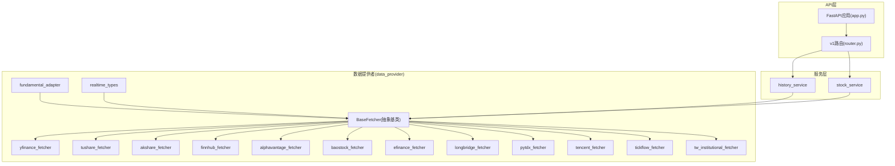
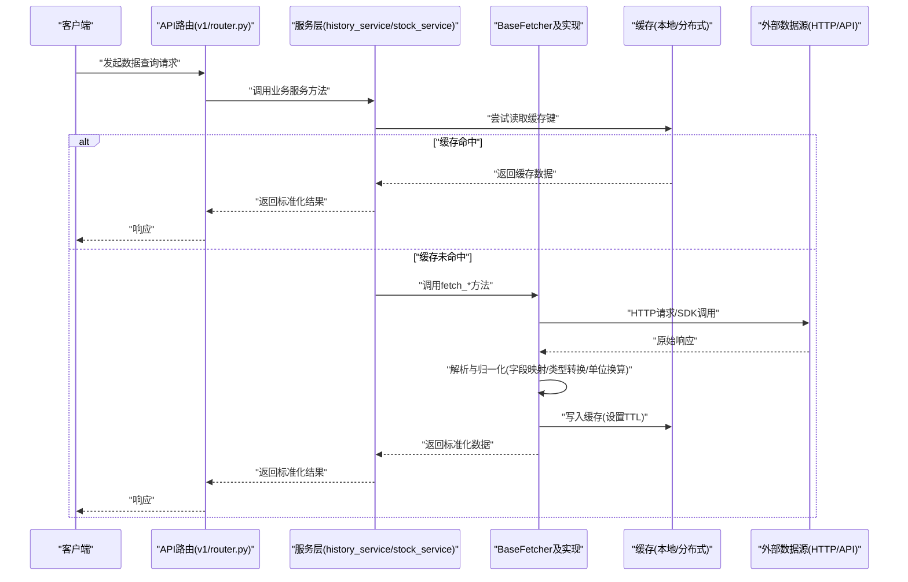
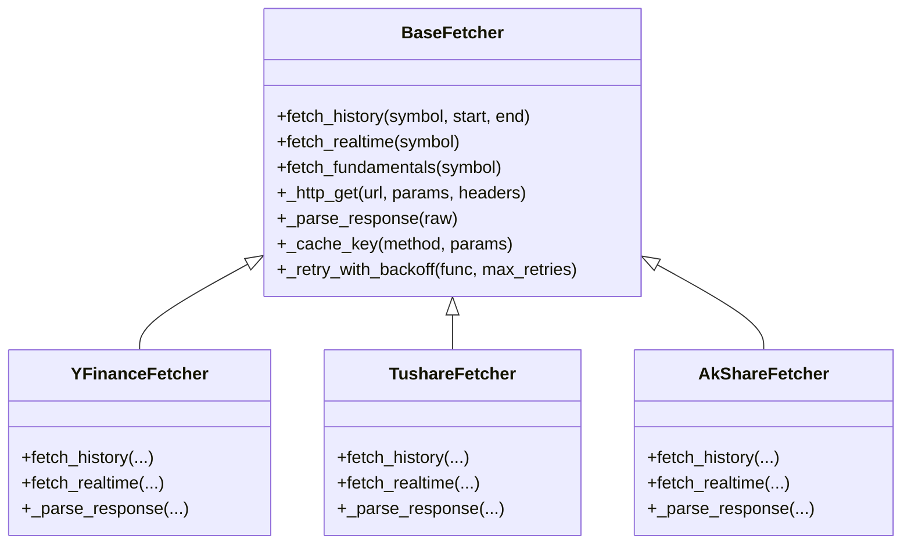

# 自定义数据源开发

<cite>
**本文引用的文件**   
- [base.py](file://data_provider/base.py)
- [yfinance_fetcher.py](file://data_provider/yfinance_fetcher.py)
- [tushare_fetcher.py](file://data_provider/tushare_fetcher.py)
- [akshare_fetcher.py](file://data_provider/akshare_fetcher.py)
- [finnhub_fetcher.py](file://data_provider/finnhub_fetcher.py)
- [alphavantage_fetcher.py](file://data_provider/alphavantage_fetcher.py)
- [baostock_fetcher.py](file://data_provider/baostock_fetcher.py)
- [efinance_fetcher.py](file://data_provider/efinance_fetcher.py)
- [longbridge_fetcher.py](file://data_provider/longbridge_fetcher.py)
- [pytdx_fetcher.py](file://data_provider/pytdx_fetcher.py)
- [tencent_fetcher.py](file://data_provider/tencent_fetcher.py)
- [tickflow_fetcher.py](file://data_provider/tickflow_fetcher.py)
- [tw_institutional_fetcher.py](file://data_provider/tw_institutional_fetcher.py)
- [fundamental_adapter.py](file://data_provider/fundamental_adapter.py)
- [realtime_types.py](file://data_provider/realtime_types.py)
- [api/app.py](file://api/app.py)
- [api/v1/router.py](file://api/v1/router.py)
- [src/services/history_service.py](file://src/services/history_service.py)
- [src/services/stock_service.py](file://src/services/stock_service.py)
- [tests/test_yfinance_normalize.py](file://tests/test_yfinance_normalize.py)
- [tests/test_tushare_fetcher_http_client.py](file://tests/test_tushare_fetcher_http_client.py)
- [tests/test_alphavantage_fetcher.py](file://tests/test_alphavantage_fetcher.py)
</cite>

## 目录
1. [简介](#简介)
2. [项目结构](#项目结构)
3. [核心组件](#核心组件)
4. [架构总览](#架构总览)
5. [详细组件分析](#详细组件分析)
6. [依赖关系分析](#依赖关系分析)
7. [性能考虑](#性能考虑)
8. [故障排查指南](#故障排查指南)
9. [结论](#结论)
10. [附录](#附录)

## 简介
本指南面向希望为系统新增自定义数据源的开发者，围绕继承 BaseFetcher 抽象类实现新的数据提供商展开。内容涵盖：
- 必须实现的接口与可选优化方法
- HTTP 请求、响应解析、错误处理与重试机制规范
- 数据格式转换（字段映射、类型转换、单位换算）要求
- 缓存策略（本地缓存、分布式缓存、失效机制）
- 完整示例流程（从 API 调用到数据返回）
- 测试、调试与性能优化建议
- 注册新数据源到系统并重新加载服务

## 项目结构
数据源相关代码集中在 data_provider 目录，采用“抽象基类 + 多实现”的插件化设计；API 层通过路由与服务层统一暴露能力；历史与实时数据由服务层协调 Fetcher 获取；测试覆盖常见场景与边界条件。

图表来源
- [base.py:1-200](file://data_provider/base.py#L1-L200)
- [yfinance_fetcher.py:1-200](file://data_provider/yfinance_fetcher.py#L1-L200)
- [tushare_fetcher.py:1-200](file://data_provider/tushare_fetcher.py#L1-L200)
- [akshare_fetcher.py:1-200](file://data_provider/akshare_fetcher.py#L1-L200)
- [finnhub_fetcher.py:1-200](file://data_provider/finnhub_fetcher.py#L1-L200)
- [alphavantage_fetcher.py:1-200](file://data_provider/alphavantage_fetcher.py#L1-L200)
- [baostock_fetcher.py:1-200](file://data_provider/baostock_fetcher.py#L1-L200)
- [efinance_fetcher.py:1-200](file://data_provider/efinance_fetcher.py#L1-L200)
- [longbridge_fetcher.py:1-200](file://data_provider/longbridge_fetcher.py#L1-L200)
- [pytdx_fetcher.py:1-200](file://data_provider/pytdx_fetcher.py#L1-L200)
- [tencent_fetcher.py:1-200](file://data_provider/tencent_fetcher.py#L1-L200)
- [tickflow_fetcher.py:1-200](file://data_provider/tickflow_fetcher.py#L1-L200)
- [tw_institutional_fetcher.py:1-200](file://data_provider/tw_institutional_fetcher.py#L1-L200)
- [fundamental_adapter.py:1-200](file://data_provider/fundamental_adapter.py#L1-L200)
- [realtime_types.py:1-200](file://data_provider/realtime_types.py#L1-L200)
- [api/app.py:1-200](file://api/app.py#L1-L200)
- [api/v1/router.py:1-200](file://api/v1/router.py#L1-L200)
- [src/services/history_service.py:1-200](file://src/services/history_service.py#L1-L200)
- [src/services/stock_service.py:1-200](file://src/services/stock_service.py#L1-L200)

章节来源
- [base.py:1-200](file://data_provider/base.py#L1-L200)
- [api/app.py:1-200](file://api/app.py#L1-L200)
- [api/v1/router.py:1-200](file://api/v1/router.py#L1-L200)
- [src/services/history_service.py:1-200](file://src/services/history_service.py#L1-L200)
- [src/services/stock_service.py:1-200](file://src/services/stock_service.py#L1-L200)

## 核心组件
- BaseFetcher 抽象基类：定义统一的获取接口、通用 HTTP 客户端封装、重试与超时控制、日志与指标埋点、缓存键生成与命中逻辑等。
- 具体 Fetcher 实现：如 yfinance_fetcher、tushare_fetcher、akshare_fetcher、finnhub_fetcher、alphavantage_fetcher、baostock_fetcher、efinance_fetcher、longbridge_fetcher、pytdx_fetcher、tencent_fetcher、tickflow_fetcher、tw_institutional_fetcher 等，各自实现特定数据源的协议与数据归一化。
- fundamental_adapter：将不同数据源的财务/基本面数据统一转换为标准结构。
- realtime_types：定义实时行情数据结构与校验规则。

章节来源
- [base.py:1-200](file://data_provider/base.py#L1-L200)
- [yfinance_fetcher.py:1-200](file://data_provider/yfinance_fetcher.py#L1-L200)
- [tushare_fetcher.py:1-200](file://data_provider/tushare_fetcher.py#L1-L200)
- [akshare_fetcher.py:1-200](file://data_provider/akshare_fetcher.py#L1-L200)
- [finnhub_fetcher.py:1-200](file://data_provider/finnhub_fetcher.py#L1-L200)
- [alphavantage_fetcher.py:1-200](file://data_provider/alphavantage_fetcher.py#L1-L200)
- [baostock_fetcher.py:1-200](file://data_provider/baostock_fetcher.py#L1-L200)
- [efinance_fetcher.py:1-200](file://data_provider/efinance_fetcher.py#L1-L200)
- [longbridge_fetcher.py:1-200](file://data_provider/longbridge_fetcher.py#L1-L200)
- [pytdx_fetcher.py:1-200](file://data_provider/pytdx_fetcher.py#L1-L200)
- [tencent_fetcher.py:1-200](file://data_provider/tencent_fetcher.py#L1-L200)
- [tickflow_fetcher.py:1-200](file://data_provider/tickflow_fetcher.py#L1-L200)
- [tw_institutional_fetcher.py:1-200](file://data_provider/tw_institutional_fetcher.py#L1-L200)
- [fundamental_adapter.py:1-200](file://data_provider/fundamental_adapter.py#L1-L200)
- [realtime_types.py:1-200](file://data_provider/realtime_types.py#L1-L200)

## 架构总览
下图展示从 API 请求到数据源获取、归一化与返回的整体流程。

图表来源
- [api/v1/router.py:1-200](file://api/v1/router.py#L1-L200)
- [src/services/history_service.py:1-200](file://src/services/history_service.py#L1-L200)
- [src/services/stock_service.py:1-200](file://src/services/stock_service.py#L1-L200)
- [base.py:1-200](file://data_provider/base.py#L1-L200)

## 详细组件分析

### BaseFetcher 抽象基类
- 职责
  - 定义统一的数据获取接口（如历史K线、实时行情、财务数据等）
  - 提供通用 HTTP 客户端封装（连接池、超时、重试、退避）
  - 提供缓存键生成、缓存读写、失效策略
  - 提供日志、指标埋点与异常分类
- 必须实现的方法
  - 数据获取方法：根据具体数据源实现历史、实时或基本面数据的获取
  - 响应解析方法：将原始响应转换为内部标准结构
  - 认证与鉴权：按数据源要求注入 Token、签名或密钥
- 可选优化方法
  - 批量请求合并、分页拉取、增量更新
  - 本地缓存预热、预取与并发控制
  - 降级与回退策略（多源切换）
- 最佳实践
  - 严格输入校验与参数规范化
  - 明确错误码与异常映射，便于上层统一处理
  - 合理设置超时与重试次数，避免雪崩
  - 使用结构化日志记录关键路径与耗时

章节来源
- [base.py:1-200](file://data_provider/base.py#L1-L200)

### 具体 Fetcher 实现要点
- yfinance_fetcher
  - 特点：基于第三方库，适合美股/港股/指数等多市场
  - 重点：字段映射、时间戳对齐、复权处理、缺失值填充
  - 参考测试：[tests/test_yfinance_normalize.py](file://tests/test_yfinance_normalize.py)
- tushare_fetcher
  - 特点：A股数据权威源，需Token鉴权
  - 重点：接口限流、分页、错误码处理、重试退避
  - 参考测试：[tests/test_tushare_fetcher_http_client.py](file://tests/test_tushare_fetcher_http_client.py)
- akshare_fetcher
  - 特点：开源聚合数据源，稳定性受上游影响
  - 重点：异常捕获、降级回退、数据清洗
- finnhub_fetcher
  - 特点：美股实时与新闻，需API Key
  - 重点：速率限制、缓存热点股票、错误重试
  - 参考测试：[tests/test_finnhub_fetcher.py](file://tests/test_finnhub_fetcher.py)
- alphavantage_fetcher
  - 特点：全球指数与股票，免费额度有限
  - 重点：配额管理、缓存命中率提升
  - 参考测试：[tests/test_alphavantage_fetcher.py](file://tests/test_alphavantage_fetcher.py)
- baostock_fetcher
  - 特点：A股历史数据，无鉴权但限频
  - 重点：连接复用、批量拉取、断线重连
- efinance_fetcher
  - 特点：东方财富数据，适合A股
  - 重点：反爬策略、代理池、失败重试
- longbridge_fetcher
  - 特点：港美股实时，SDK集成
  - 重点：连接状态管理、心跳保活、错误恢复
- pytdx_fetcher
  - 特点：通达信行情，低延迟
  - 重点：多节点轮询、超时切换、数据一致性
- tencent_fetcher
  - 特点：腾讯财经接口，简单稳定
  - 重点：字段兼容、容错解析
- tickflow_fetcher
  - 特点：Tick级数据，高吞吐
  - 重点：流式处理、内存控制、背压
- tw_institutional_fetcher
  - 特点：台湾机构持仓数据
  - 重点：数据清洗、单位换算、字段映射

章节来源
- [yfinance_fetcher.py:1-200](file://data_provider/yfinance_fetcher.py#L1-L200)
- [tushare_fetcher.py:1-200](file://data_provider/tushare_fetcher.py#L1-L200)
- [akshare_fetcher.py:1-200](file://data_provider/akshare_fetcher.py#L1-L200)
- [finnhub_fetcher.py:1-200](file://data_provider/finnhub_fetcher.py#L1-L200)
- [alphavantage_fetcher.py:1-200](file://data_provider/alphavantage_fetcher.py#L1-L200)
- [baostock_fetcher.py:1-200](file://data_provider/baostock_fetcher.py#L1-L200)
- [efinance_fetcher.py:1-200](file://data_provider/efinance_fetcher.py#L1-L200)
- [longbridge_fetcher.py:1-200](file://data_provider/longbridge_fetcher.py#L1-L200)
- [pytdx_fetcher.py:1-200](file://data_provider/pytdx_fetcher.py#L1-L200)
- [tencent_fetcher.py:1-200](file://data_provider/tencent_fetcher.py#L1-L200)
- [tickflow_fetcher.py:1-200](file://data_provider/tickflow_fetcher.py#L1-L200)
- [tw_institutional_fetcher.py:1-200](file://data_provider/tw_institutional_fetcher.py#L1-L200)
- [tests/test_yfinance_normalize.py:1-200](file://tests/test_yfinance_normalize.py#L1-L200)
- [tests/test_tushare_fetcher_http_client.py:1-200](file://tests/test_tushare_fetcher_http_client.py#L1-L200)
- [tests/test_alphavantage_fetcher.py:1-200](file://tests/test_alphavantage_fetcher.py#L1-L200)

### fundamental_adapter 与 realtime_types
- fundamental_adapter
  - 职责：将不同数据源的财务/基本面数据统一为标准结构
  - 关键点：字段映射表、单位换算（元/万元/亿元）、缺失值处理、时间对齐
- realtime_types
  - 职责：定义实时行情数据结构与校验规则
  - 关键点：字段类型约束、必填校验、范围检查

章节来源
- [fundamental_adapter.py:1-200](file://data_provider/fundamental_adapter.py#L1-L200)
- [realtime_types.py:1-200](file://data_provider/realtime_types.py#L1-L200)

### API 与服务层集成
- API 路由
  - 接收请求、参数校验、调用服务层
- 服务层
  - 协调缓存与 Fetcher，编排数据获取流程
  - 统一错误处理与响应格式化

章节来源
- [api/app.py:1-200](file://api/app.py#L1-L200)
- [api/v1/router.py:1-200](file://api/v1/router.py#L1-L200)
- [src/services/history_service.py:1-200](file://src/services/history_service.py#L1-L200)
- [src/services/stock_service.py:1-200](file://src/services/stock_service.py#L1-L200)

## 依赖关系分析
- 耦合度
  - BaseFetcher 与各具体 Fetcher 松耦合，通过统一接口解耦
  - 服务层仅依赖抽象接口，不感知具体实现
- 外部依赖
  - 各 Fetcher 依赖第三方库或外部 API（如 yfinance、tushare、akshare、finnhub、alphavantage 等）
- 潜在循环依赖
  - 当前设计无循环依赖，Fetchers 之间相互独立
- 接口契约
  - 所有 Fetcher 必须遵循 BaseFetcher 定义的输入输出结构与错误语义

图表来源
- [base.py:1-200](file://data_provider/base.py#L1-L200)
- [yfinance_fetcher.py:1-200](file://data_provider/yfinance_fetcher.py#L1-L200)
- [tushare_fetcher.py:1-200](file://data_provider/tushare_fetcher.py#L1-L200)
- [akshare_fetcher.py:1-200](file://data_provider/akshare_fetcher.py#L1-L200)

章节来源
- [base.py:1-200](file://data_provider/base.py#L1-L200)
- [yfinance_fetcher.py:1-200](file://data_provider/yfinance_fetcher.py#L1-L200)
- [tushare_fetcher.py:1-200](file://data_provider/tushare_fetcher.py#L1-L200)
- [akshare_fetcher.py:1-200](file://data_provider/akshare_fetcher.py#L1-L200)

## 性能考虑
- 缓存策略
  - 本地缓存：基于内存字典或轻量存储，设置合理的 TTL 与最大容量
  - 分布式缓存：Redis/Memcached，注意序列化与跨进程共享
  - 缓存失效：按时间窗口、版本号或事件驱动失效
- 请求优化
  - 连接池与复用，减少握手开销
  - 批量请求合并，降低网络往返
  - 分页与增量拉取，避免全量重复
- 并发与限流
  - 控制并发数，避免打爆上游
  - 指数退避重试，避免雪崩
- 数据预处理
  - 在 Fetcher 内完成字段映射与类型转换，减少上层计算
  - 缺失值与异常值处理，保证下游一致性

[本节为通用指导，无需引用具体文件]

## 故障排查指南
- 常见问题
  - 网络超时与连接失败：检查超时配置、重试次数与退避策略
  - 鉴权失败：确认 Token/Key 是否有效与权限正确
  - 数据不一致：核对字段映射与单位换算逻辑
  - 缓存污染：检查缓存键生成与失效策略
- 调试技巧
  - 开启详细日志，记录请求URL、参数、响应体与耗时
  - 使用 Mock 替代外部依赖，隔离问题
  - 逐步缩小范围，定位是网络、解析还是业务逻辑问题
- 测试建议
  - 单元测试：覆盖正常路径、异常路径与边界条件
  - 集成测试：对接真实或沙箱环境，验证端到端流程
  - 回归测试：确保字段映射与单位换算不变性

章节来源
- [tests/test_yfinance_normalize.py:1-200](file://tests/test_yfinance_normalize.py#L1-L200)
- [tests/test_tushare_fetcher_http_client.py:1-200](file://tests/test_tushare_fetcher_http_client.py#L1-L200)
- [tests/test_alphavantage_fetcher.py:1-200](file://tests/test_alphavantage_fetcher.py#L1-L200)

## 结论
通过继承 BaseFetcher 抽象基类，开发者可以以统一的方式扩展新的数据源。关键在于：
- 严格实现数据获取与解析接口
- 完善错误处理与重试机制
- 做好数据归一化与单位换算
- 合理使用缓存与并发控制
- 编写充分测试与调试用例
- 按规范注册新数据源并热重载服务

[本节为总结，无需引用具体文件]

## 附录

### 自定义数据源开发步骤
1. 新建 Fetcher 类，继承 BaseFetcher
2. 实现必须的数据获取方法与解析方法
3. 处理鉴权、限流、重试与异常
4. 实现字段映射、类型转换与单位换算
5. 集成缓存策略（本地/分布式）
6. 编写单元测试与集成测试
7. 注册新数据源到系统配置
8. 重启或热重载服务

章节来源
- [base.py:1-200](file://data_provider/base.py#L1-L200)
- [api/app.py:1-200](file://api/app.py#L1-L200)
- [api/v1/router.py:1-200](file://api/v1/router.py#L1-L200)
- [src/services/history_service.py:1-200](file://src/services/history_service.py#L1-L200)
- [src/services/stock_service.py:1-200](file://src/services/stock_service.py#L1-L200)

### 数据获取方法实现规范
- HTTP 请求处理
  - 使用统一客户端，设置超时与重试
  - 记录请求与响应日志
- 响应解析
  - 严格校验字段存在性与类型
  - 处理缺失值与异常值
- 错误处理
  - 区分网络错误、业务错误与数据错误
  - 抛出明确的异常类型
- 重试机制
  - 指数退避，限制最大重试次数
  - 对幂等请求进行安全重试

章节来源
- [base.py:1-200](file://data_provider/base.py#L1-L200)
- [yfinance_fetcher.py:1-200](file://data_provider/yfinance_fetcher.py#L1-L200)
- [tushare_fetcher.py:1-200](file://data_provider/tushare_fetcher.py#L1-L200)

### 数据格式转换实现要求
- 字段映射
  - 建立清晰的映射表，支持别名与版本差异
- 类型转换
  - 统一数值类型（浮点/整数），处理空值
- 单位换算
  - 统一货币、成交量、市值等单位
  - 标注数据来源与换算规则

章节来源
- [fundamental_adapter.py:1-200](file://data_provider/fundamental_adapter.py#L1-L200)
- [realtime_types.py:1-200](file://data_provider/realtime_types.py#L1-L200)

### 缓存策略实现
- 本地缓存
  - 内存字典或轻量存储，设置 TTL 与最大容量
- 分布式缓存
  - Redis/Memcached，注意序列化与集群一致性
- 缓存失效
  - 时间窗口、版本号或事件驱动失效

章节来源
- [base.py:1-200](file://data_provider/base.py#L1-L200)

### 完整开发示例流程
- 从 API 调用到数据返回
  - 客户端发起请求
  - API 路由调用服务层
  - 服务层检查缓存，未命中则调用 Fetcher
  - Fetcher 获取外部数据，解析并归一化
  - 写入缓存并返回结果

章节来源
- [api/v1/router.py:1-200](file://api/v1/router.py#L1-L200)
- [src/services/history_service.py:1-200](file://src/services/history_service.py#L1-L200)
- [src/services/stock_service.py:1-200](file://src/services/stock_service.py#L1-L200)
- [base.py:1-200](file://data_provider/base.py#L1-L200)

### 测试方法与调试技巧
- 单元测试
  - 覆盖正常与异常路径
  - Mock 外部依赖
- 集成测试
  - 对接沙箱或测试环境
- 调试技巧
  - 详细日志与链路追踪
  - 逐步定位问题

章节来源
- [tests/test_yfinance_normalize.py:1-200](file://tests/test_yfinance_normalize.py#L1-L200)
- [tests/test_tushare_fetcher_http_client.py:1-200](file://tests/test_tushare_fetcher_http_client.py#L1-L200)
- [tests/test_alphavantage_fetcher.py:1-200](file://tests/test_alphavantage_fetcher.py#L1-L200)

### 性能优化建议
- 连接池与复用
- 批量请求合并
- 分页与增量拉取
- 缓存命中率提升
- 并发控制与限流

[本节为通用指导，无需引用具体文件]

### 注册新数据源到系统
- 修改配置文件，添加新数据源配置
- 在服务启动时加载新数据源
- 重启或热重载服务

章节来源
- [api/app.py:1-200](file://api/app.py#L1-L200)
- [api/v1/router.py:1-200](file://api/v1/router.py#L1-L200)