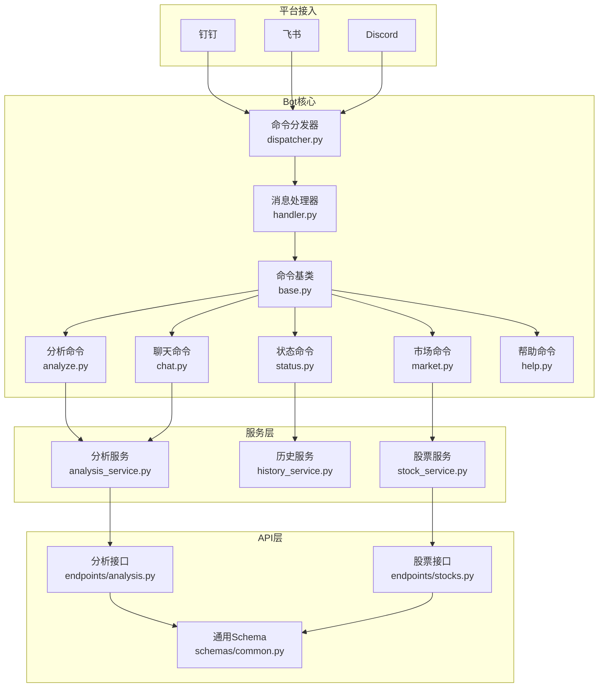
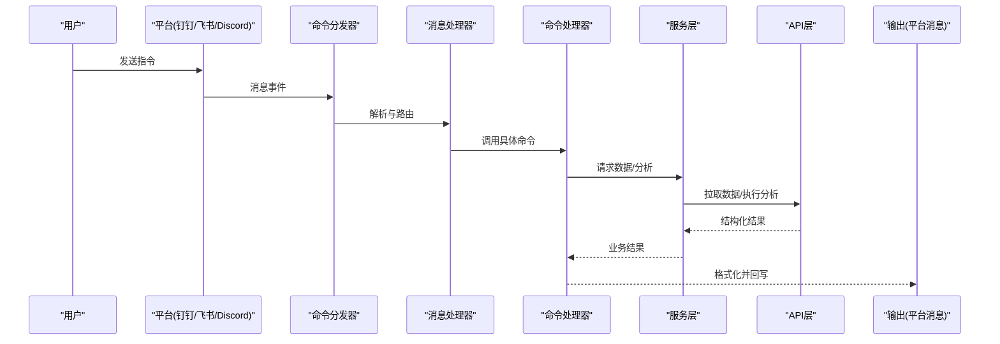
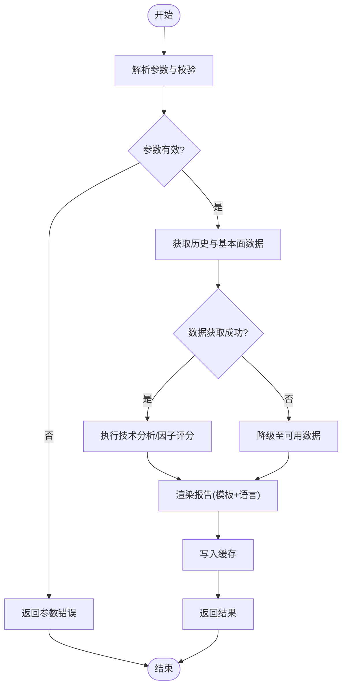
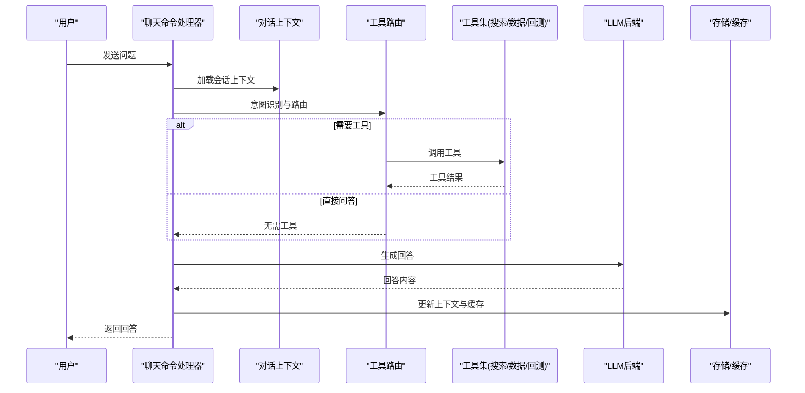
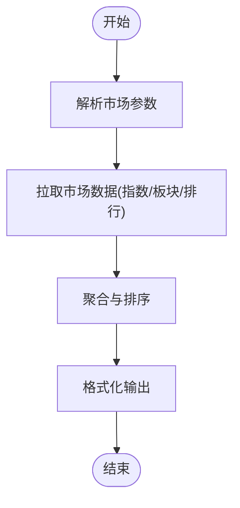
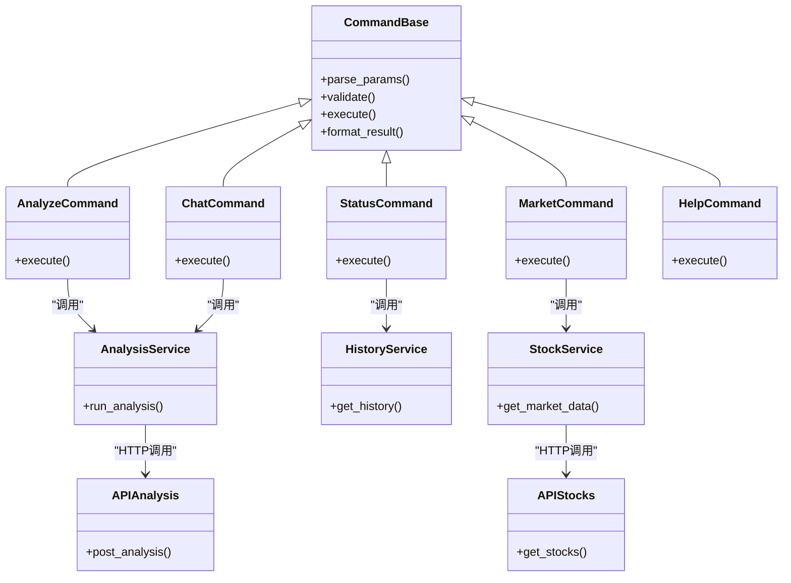

# 内置命令详解

<cite>
**本文档引用的文件**   
- [bot/commands/__init__.py](file://bot/commands/__init__.py)
- [bot/commands/base.py](file://bot/commands/base.py)
- [bot/commands/analyze.py](file://bot/commands/analyze.py)
- [bot/commands/chat.py](file://bot/commands/chat.py)
- [bot/commands/market.py](file://bot/commands/market.py)
- [bot/commands/status.py](file://bot/commands/status.py)
- [bot/commands/help.py](file://bot/commands/help.py)
- [bot/dispatcher.py](file://bot/dispatcher.py)
- [bot/handler.py](file://bot/handler.py)
- [bot/models.py](file://bot/models.py)
- [src/services/analysis_service.py](file://src/services/analysis_service.py)
- [src/services/history_service.py](file://src/services/history_service.py)
- [src/services/stock_service.py](file://src/services/stock_service.py)
- [api/v1/endpoints/analysis.py](file://api/v1/endpoints/analysis.py)
- [api/v1/endpoints/stocks.py](file://api/v1/endpoints/stocks.py)
- [api/v1/schemas/common.py](file://api/v1/schemas/common.py)
</cite>

## 目录
1. [简介](#简介)
2. [项目结构](#项目结构)
3. [核心组件](#核心组件)
4. [架构总览](#架构总览)
5. [详细组件分析](#详细组件分析)
6. [依赖关系分析](#依赖关系分析)
7. [性能考量](#性能考量)
8. [故障排查指南](#故障排查指南)
9. [结论](#结论)
10. [附录](#附录)

## 简介
本文件面向Daily Stock Analysis的“内置命令系统”，系统性梳理并说明以下命令：分析(analyze)、聊天(chat)、市场查询(market)、状态检查(status)、帮助(help)。文档涵盖每个命令的参数与语法、返回格式、执行流程与数据处理逻辑（数据获取、分析与结果展示）、命令间的依赖与协作机制，并提供使用示例、错误处理与异常恢复策略以及性能优化建议与最佳实践。

## 项目结构
内置命令位于 bot/commands 目录下，由 bot/dispatcher.py 和 bot/handler.py 统一分发与处理；业务服务层在 src/services 中实现；对外API在 api/v1 暴露。命令通过平台适配层（钉钉、飞书、Discord等）接收消息后进入命令分发器，再路由到具体命令处理器，调用服务层完成数据获取与分析，最终将结果回写到平台。

图表来源
- [bot/dispatcher.py](file://bot/dispatcher.py)
- [bot/handler.py](file://bot/handler.py)
- [bot/commands/base.py](file://bot/commands/base.py)
- [bot/commands/analyze.py](file://bot/commands/analyze.py)
- [bot/commands/chat.py](file://bot/commands/chat.py)
- [bot/commands/market.py](file://bot/commands/market.py)
- [bot/commands/status.py](file://bot/commands/status.py)
- [bot/commands/help.py](file://bot/commands/help.py)
- [src/services/analysis_service.py](file://src/services/analysis_service.py)
- [src/services/history_service.py](file://src/services/history_service.py)
- [src/services/stock_service.py](file://src/services/stock_service.py)
- [api/v1/endpoints/analysis.py](file://api/v1/endpoints/analysis.py)
- [api/v1/endpoints/stocks.py](file://api/v1/endpoints/stocks.py)
- [api/v1/schemas/common.py](file://api/v1/schemas/common.py)

章节来源
- [bot/commands/__init__.py](file://bot/commands/__init__.py)
- [bot/dispatcher.py](file://bot/dispatcher.py)
- [bot/handler.py](file://bot/handler.py)

## 核心组件
- 命令基类与注册机制：所有命令继承自统一的命令基类，提供参数解析、校验、上下文注入与结果封装能力；命令注册表集中管理命令名与处理器映射。
- 命令分发器：根据消息前缀或触发方式识别命令类型，分发给对应处理器；支持异步执行与超时控制。
- 消息处理器：负责平台消息标准化、权限校验、限流与重试、日志记录与错误上报。
- 服务层：分析服务、历史服务、股票服务等，屏蔽底层数据源差异，提供统一的数据访问与分析能力。
- API层：对外暴露REST接口，供Web端或其他系统集成；统一响应结构与错误码。

章节来源
- [bot/commands/base.py](file://bot/commands/base.py)
- [bot/dispatcher.py](file://bot/dispatcher.py)
- [bot/handler.py](file://bot/handler.py)
- [src/services/analysis_service.py](file://src/services/analysis_service.py)
- [src/services/history_service.py](file://src/services/history_service.py)
- [src/services/stock_service.py](file://src/services/stock_service.py)
- [api/v1/endpoints/analysis.py](file://api/v1/endpoints/analysis.py)
- [api/v1/endpoints/stocks.py](file://api/v1/endpoints/stocks.py)
- [api/v1/schemas/common.py](file://api/v1/schemas/common.py)

## 架构总览
命令执行的整体流程如下：平台消息进入 → 命令分发器识别 → 消息处理器预处理 → 具体命令处理器执行业务逻辑 → 调用服务层获取数据与分析 → 通过API层或本地缓存生成结果 → 格式化输出并回写平台。

图表来源
- [bot/dispatcher.py](file://bot/dispatcher.py)
- [bot/handler.py](file://bot/handler.py)
- [src/services/analysis_service.py](file://src/services/analysis_service.py)
- [api/v1/endpoints/analysis.py](file://api/v1/endpoints/analysis.py)

## 详细组件分析

### 分析命令 analyze
- 功能概述：对指定股票进行多维度分析，包括技术面、基本面、资金面与市场情绪等，输出结构化分析报告。
- 参数选项：
  - 股票代码/名称：必填，支持模糊匹配与多代码批量。
  - 时间窗口：可选，默认最近N日，可自定义起止日期。
  - 指标开关：可选，如均线、RSI、MACD、成交量等。
  - 报告语言：可选，中文/英文。
  - 深度模式：可选，基础/增强/专家级。
- 使用语法：按平台约定以“/analyze”或“!analyze”开头，后接参数键值对或位置参数。
- 返回格式：包含摘要、关键指标、趋势判断、风险提示与建议操作的结构化文本或Markdown。
- 执行流程：
  1) 参数解析与校验（代码归一化、范围检查）。
  2) 数据获取（历史行情、财务数据、新闻与情绪）。
  3) 分析计算（技术指标、因子评分、风险模型）。
  4) 结果渲染（模板填充、语言切换）。
  5) 输出与缓存（短期缓存命中加速后续查询）。
- 依赖关系：依赖分析服务、历史服务、股票服务与API层；可能调用LLM进行自然语言总结。
- 错误处理：网络超时、数据缺失、参数非法等均有明确错误码与降级策略（如仅用可用数据生成部分报告）。

图表来源
- [bot/commands/analyze.py](file://bot/commands/analyze.py)
- [src/services/analysis_service.py](file://src/services/analysis_service.py)
- [src/services/history_service.py](file://src/services/history_service.py)
- [src/services/stock_service.py](file://src/services/stock_service.py)
- [api/v1/endpoints/analysis.py](file://api/v1/endpoints/analysis.py)

章节来源
- [bot/commands/analyze.py](file://bot/commands/analyze.py)
- [src/services/analysis_service.py](file://src/services/analysis_service.py)
- [api/v1/endpoints/analysis.py](file://api/v1/endpoints/analysis.py)

### 聊天命令 chat
- 功能概述：与智能体进行对话，支持上下文记忆、工具调用与多轮问答，用于投资咨询、策略讨论与知识问答。
- 参数选项：
  - 问题文本：必填。
  - 会话ID：可选，用于延续上下文。
  - 工具开关：可选，启用/禁用特定工具（搜索、数据查询、回测等）。
  - 安全级别：可选，低/中/高，影响过滤与合规策略。
- 使用语法：以“/chat”或“!chat”开头，后接问题与可选参数。
- 返回格式：自然语言回答，可能附带图表链接、数据快照或引用来源。
- 执行流程：
  1) 构建对话上下文（历史消息、用户偏好）。
  2) 意图识别与工具路由（是否需要数据/搜索/回测）。
  3) 调用相关服务与工具。
  4) LLM生成回答并附加引用。
  5) 更新会话状态与缓存。
- 依赖关系：依赖分析服务、搜索服务、LLM后端与存储；支持工具链扩展。
- 错误处理：LLM不可用时的降级（返回缓存答案或提示），工具失败时跳过并标注。

图表来源
- [bot/commands/chat.py](file://bot/commands/chat.py)
- [src/services/analysis_service.py](file://src/services/analysis_service.py)

章节来源
- [bot/commands/chat.py](file://bot/commands/chat.py)

### 市场查询 market
- 功能概述：查询大盘指数、板块热度、涨跌排行、资金流向等市场概览信息。
- 参数选项：
  - 市场类型：A股/港股/美股/全球指数。
  - 维度：指数/板块/个股排行。
  - 时间粒度：当日/近一周/近一月。
  - 排序字段：涨跌幅/成交量/换手率等。
- 使用语法：以“/market”或“!market”开头，后接筛选条件。
- 返回格式：表格或列表形式的市场快照，含关键统计与趋势提示。
- 执行流程：
  1) 解析市场类型与维度。
  2) 调用股票服务与API获取实时/历史数据。
  3) 聚合与排序计算。
  4) 格式化输出。
- 依赖关系：依赖股票服务、历史服务与API层；可能结合缓存提升性能。
- 错误处理：数据源不可用时返回最近可用快照并标注延迟。

图表来源
- [bot/commands/market.py](file://bot/commands/market.py)
- [src/services/stock_service.py](file://src/services/stock_service.py)
- [api/v1/endpoints/stocks.py](file://api/v1/endpoints/stocks.py)

章节来源
- [bot/commands/market.py](file://bot/commands/market.py)
- [src/services/stock_service.py](file://src/services/stock_service.py)
- [api/v1/endpoints/stocks.py](file://api/v1/endpoints/stocks.py)

### 状态检查 status
- 功能概述：查看系统运行状态、服务健康、任务队列、缓存命中率、数据源连通性等。
- 参数选项：
  - 模块选择：全部/分析/历史/股票/API等。
  - 详细级别：基础/详细。
- 使用语法：以“/status”或“!status”开头，后接可选参数。
- 返回格式：JSON或结构化文本，包含各模块状态、延迟、错误计数与告警。
- 执行流程：
  1) 收集各服务心跳与指标。
  2) 读取配置与运行时信息。
  3) 汇总并格式化输出。
- 依赖关系：依赖各服务健康检查接口与配置中心。
- 错误处理：单个模块异常不影响整体状态输出，标注异常详情。

章节来源
- [bot/commands/status.py](file://bot/commands/status.py)

### 帮助命令 help
- 功能概述：列出所有可用命令、参数说明、示例与常见问题解答。
- 参数选项：
  - 命令名：可选，聚焦某个命令的详细帮助。
  - 语言：可选，中文/英文。
- 使用语法：以“/help”或“!help”开头，后接可选参数。
- 返回格式：Markdown或富文本帮助文档，支持分页与跳转。
- 执行流程：
  1) 加载命令元数据与帮助模板。
  2) 根据参数过滤与翻译。
  3) 输出帮助内容。
- 依赖关系：依赖命令注册表与i18n资源。
- 错误处理：资源缺失时回退到默认语言与基础帮助。

章节来源
- [bot/commands/help.py](file://bot/commands/help.py)

## 依赖关系分析
命令之间的耦合度较低，主要通过服务层与API层解耦。命令基类提供统一接口，分发器与处理器负责路由与编排。服务层内部存在一定依赖：分析服务依赖历史与股票服务；聊天命令依赖分析服务与LLM后端。API层为外部集成提供稳定契约。

图表来源
- [bot/commands/base.py](file://bot/commands/base.py)
- [bot/commands/analyze.py](file://bot/commands/analyze.py)
- [bot/commands/chat.py](file://bot/commands/chat.py)
- [bot/commands/market.py](file://bot/commands/market.py)
- [bot/commands/status.py](file://bot/commands/status.py)
- [bot/commands/help.py](file://bot/commands/help.py)
- [src/services/analysis_service.py](file://src/services/analysis_service.py)
- [src/services/history_service.py](file://src/services/history_service.py)
- [src/services/stock_service.py](file://src/services/stock_service.py)
- [api/v1/endpoints/analysis.py](file://api/v1/endpoints/analysis.py)
- [api/v1/endpoints/stocks.py](file://api/v1/endpoints/stocks.py)

章节来源
- [bot/commands/base.py](file://bot/commands/base.py)
- [src/services/analysis_service.py](file://src/services/analysis_service.py)
- [src/services/history_service.py](file://src/services/history_service.py)
- [src/services/stock_service.py](file://src/services/stock_service.py)
- [api/v1/endpoints/analysis.py](file://api/v1/endpoints/analysis.py)
- [api/v1/endpoints/stocks.py](file://api/v1/endpoints/stocks.py)

## 性能考量
- 缓存策略：对高频查询（如市场快照、热门排行）启用短期缓存，减少重复请求与计算开销。
- 异步执行：命令执行采用异步任务队列，避免阻塞主线程；支持超时与取消。
- 数据源优选：优先使用本地缓存或就近数据源，失败时自动回退到其他源。
- 批处理与分页：批量查询与分页返回，降低单次负载。
- 连接池与并发：数据库与HTTP连接复用，合理设置并发上限与超时。
- 结果压缩：大结果集采用压缩传输与增量更新。

[本节为通用指导，不直接分析具体文件]

## 故障排查指南
- 常见错误：
  - 参数非法：检查代码格式、时间范围与指标开关。
  - 数据源不可用：查看服务健康状态与网络连通性，启用降级模式。
  - LLM不可用：切换到缓存回答或基础模板。
  - 超时与重试：调整超时阈值与重试次数，关注队列积压。
- 诊断步骤：
  1) 使用 /status 查看各模块状态与错误计数。
  2) 检查命令日志与API响应码。
  3) 验证数据源配置与认证信息。
  4) 逐步缩小问题范围（单只股票/单条消息）。
- 恢复策略：
  - 自动重试与熔断。
  - 降级到可用数据源与简化报告。
  - 通知管理员与用户。

章节来源
- [bot/handler.py](file://bot/handler.py)
- [api/v1/endpoints/analysis.py](file://api/v1/endpoints/analysis.py)
- [api/v1/endpoints/stocks.py](file://api/v1/endpoints/stocks.py)

## 结论
Daily Stock Analysis的内置命令系统通过清晰的层次结构与模块化设计，实现了从平台消息到数据分析的全链路自动化。命令间松耦合、服务层抽象与API契约保障了可扩展性与稳定性。遵循本文档的使用规范与最佳实践，可有效提升效率与可靠性。

[本节为总结，不直接分析具体文件]

## 附录
- 使用示例：
  - 分析某只股票：“/analyze 600519 时间窗口=30d 指标=均线,RSI,MACD 语言=中文”
  - 聊天咨询：“/chat 问题=如何评估新能源板块的资金流入？ 工具=搜索,数据 安全级别=中”
  - 市场查询：“/market 市场=A股 维度=板块 时间=当日 排序=涨跌幅”
  - 状态检查：“/status 模块=全部 详细=详细”
  - 帮助查询：“/help 命令=analyze 语言=中文”
- 最佳实践：
  - 合理使用缓存与批处理，避免频繁小请求。
  - 明确参数边界，提前校验以减少无效计算。
  - 监控关键指标（延迟、错误率、缓存命中率）。
  - 定期更新数据源配置与认证信息。

[本节为补充信息，不直接分析具体文件]