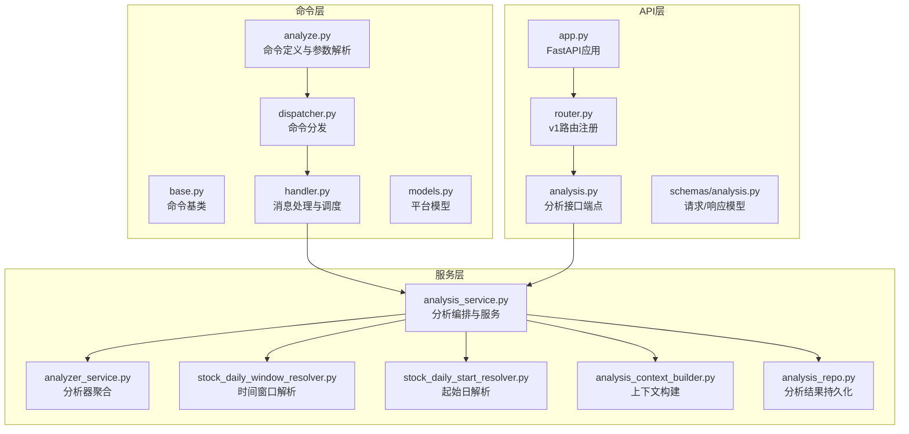
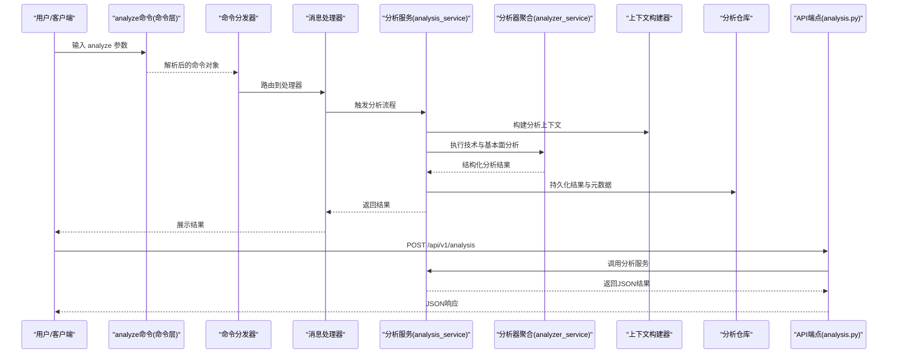
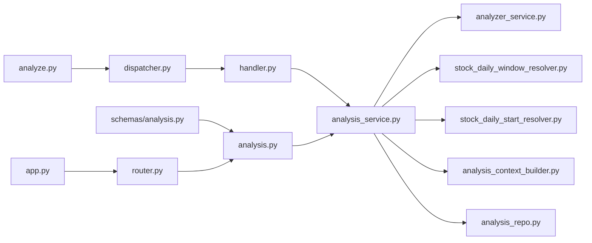
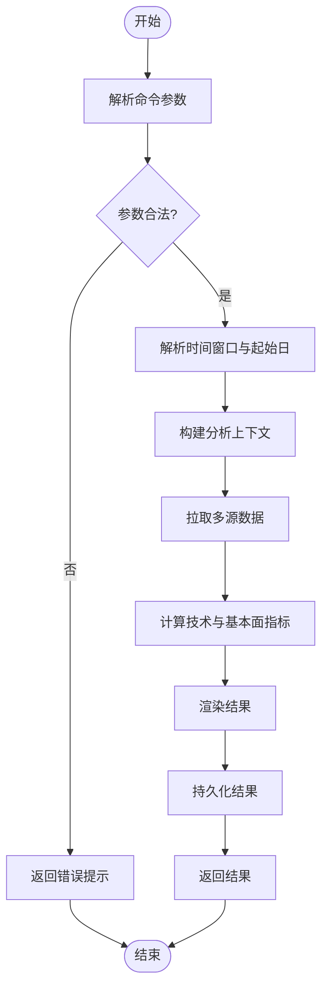

# 分析命令(analyze)

<cite>
**本文引用的文件**   
- [analyze.py](file://bot/commands/analyze.py)
- [base.py](file://bot/commands/base.py)
- [dispatcher.py](file://bot/dispatcher.py)
- [handler.py](file://bot/handler.py)
- [models.py](file://bot/models.py)
- [analysis_service.py](file://src/services/analysis_service.py)
- [analyzer_service.py](file://src/services/analyzer_service.py)
- [stock_daily_window_resolver.py](file://src/services/stock_daily_window_resolver.py)
- [stock_daily_start_resolver.py](file://src/services/stock_daily_start_resolver.py)
- [analysis_context_builder.py](file://src/services/analysis_context_builder.py)
- [analysis_repo.py](file://src/repositories/analysis_repo.py)
- [analysis.py](file://api/v1/endpoints/analysis.py)
- [schemas/analysis.py](file://api/v1/schemas/analysis.py)
- [app.py](file://api/app.py)
- [router.py](file://api/v1/router.py)
- [main.py](file://main.py)
- [server.py](file://server.py)
</cite>

## 目录
1. [简介](#简介)
2. [项目结构](#项目结构)
3. [核心组件](#核心组件)
4. [架构总览](#架构总览)
5. [详细组件分析](#详细组件分析)
6. [依赖关系分析](#依赖关系分析)
7. [性能考虑](#性能考虑)
8. [故障排查指南](#故障排查指南)
9. [结论](#结论)
10. [附录](#附录)

## 简介
本文件面向Daily Stock Analysis项目的“analyze”命令，提供从命令行到后端服务、再到数据获取与分析计算的端到端文档。内容涵盖：
- 功能概览：股票分析、技术分析、基本面分析等能力
- 参数说明：股票代码、分析类型、时间范围、输出格式等
- 执行流程：解析命令、路由分发、上下文构建、数据拉取、指标计算与报告生成
- 使用示例：覆盖不同市场与场景的命令用法
- 错误处理与异常恢复：超时、限流、数据缺失、网络异常等
- 性能优化与最佳实践：缓存、并发、窗口选择、结果分页等

## 项目结构
“analyze”命令位于机器人命令层（bot/commands），通过命令分发器（bot/dispatcher）与处理器（bot/handler）接入；业务逻辑由服务层（src/services）实现，API层（api/v1）提供HTTP接口供前端或外部系统调用。

**图表来源** 
- [analyze.py:1-200](file://bot/commands/analyze.py#L1-L200)
- [base.py:1-150](file://bot/commands/base.py#L1-L150)
- [dispatcher.py:1-200](file://bot/dispatcher.py#L1-L200)
- [handler.py:1-200](file://bot/handler.py#L1-L200)
- [models.py:1-150](file://bot/models.py#L1-L150)
- [analysis_service.py:1-300](file://src/services/analysis_service.py#L1-L300)
- [analyzer_service.py:1-250](file://src/services/analyzer_service.py#L1-L250)
- [stock_daily_window_resolver.py:1-200](file://src/services/stock_daily_window_resolver.py#L1-L200)
- [stock_daily_start_resolver.py:1-200](file://src/services/stock_daily_start_resolver.py#L1-L200)
- [analysis_context_builder.py:1-250](file://src/services/analysis_context_builder.py#L1-L250)
- [analysis_repo.py:1-200](file://src/repositories/analysis_repo.py#L1-L200)
- [analysis.py:1-250](file://api/v1/endpoints/analysis.py#L1-L250)
- [schemas/analysis.py:1-200](file://api/v1/schemas/analysis.py#L1-L200)
- [app.py:1-150](file://api/app.py#L1-L150)
- [router.py:1-150](file://api/v1/router.py#L1-L150)

**章节来源**
- [analyze.py:1-200](file://bot/commands/analyze.py#L1-L200)
- [dispatcher.py:1-200](file://bot/dispatcher.py#L1-L200)
- [handler.py:1-200](file://bot/handler.py#L1-L200)
- [analysis_service.py:1-300](file://src/services/analysis_service.py#L1-L300)
- [analysis.py:1-250](file://api/v1/endpoints/analysis.py#L1-L250)
- [app.py:1-150](file://api/app.py#L1-L150)
- [router.py:1-150](file://api/v1/router.py#L1-L150)

## 核心组件
- 命令定义与参数解析：analyze.py负责解析用户输入的参数（如股票代码、分析类型、时间范围、输出格式等），并封装为内部请求对象。
- 命令分发与处理：dispatcher.py将命令路由到具体处理器；handler.py负责平台消息适配与异步任务调度。
- 分析服务：analysis_service.py是分析流程的编排中心，协调时间窗口解析、上下文构建、数据获取、指标计算与报告渲染。
- 分析器聚合：analyzer_service.py整合技术分析与基本面分析能力，统一返回结构化结果。
- 时间窗口与起始日解析：stock_daily_window_resolver.py与stock_daily_start_resolver.py负责将自然语言或相对日期转换为交易日历上的有效区间。
- 上下文构建：analysis_context_builder.py组装市场背景、个股信息、历史数据、新闻与情绪等上下文，用于后续分析。
- 结果持久化：analysis_repo.py负责保存分析结果与元数据，便于历史查询与对比。
- API端点：analysis.py暴露REST接口，schemas/analysis.py定义请求/响应模型，app.py与router.py完成应用启动与路由注册。

**章节来源**
- [analyze.py:1-200](file://bot/commands/analyze.py#L1-L200)
- [dispatcher.py:1-200](file://bot/dispatcher.py#L1-L200)
- [handler.py:1-200](file://bot/handler.py#L1-L200)
- [analysis_service.py:1-300](file://src/services/analysis_service.py#L1-L300)
- [analyzer_service.py:1-250](file://src/services/analyzer_service.py#L1-L250)
- [stock_daily_window_resolver.py:1-200](file://src/services/stock_daily_window_resolver.py#L1-L200)
- [stock_daily_start_resolver.py:1-200](file://src/services/stock_daily_start_resolver.py#L1-L200)
- [analysis_context_builder.py:1-250](file://src/services/analysis_context_builder.py#L1-L250)
- [analysis_repo.py:1-200](file://src/repositories/analysis_repo.py#L1-L200)
- [analysis.py:1-250](file://api/v1/endpoints/analysis.py#L1-L250)
- [schemas/analysis.py:1-200](file://api/v1/schemas/analysis.py#L1-L200)
- [app.py:1-150](file://api/app.py#L1-L150)
- [router.py:1-150](file://api/v1/router.py#L1-L150)

## 架构总览
analyze命令的执行路径分为两条：
- 命令行/机器人入口：通过bot层解析命令，调用analysis_service进行编排，最终返回文本或结构化结果。
- HTTP API入口：通过api/v1/analysis端点接收请求，同样调用analysis_service，返回JSON响应。

**图表来源** 
- [analyze.py:1-200](file://bot/commands/analyze.py#L1-L200)
- [dispatcher.py:1-200](file://bot/dispatcher.py#L1-L200)
- [handler.py:1-200](file://bot/handler.py#L1-L200)
- [analysis_service.py:1-300](file://src/services/analysis_service.py#L1-L300)
- [analyzer_service.py:1-250](file://src/services/analyzer_service.py#L1-L250)
- [analysis_context_builder.py:1-250](file://src/services/analysis_context_builder.py#L1-L250)
- [analysis_repo.py:1-200](file://src/repositories/analysis_repo.py#L1-L200)
- [analysis.py:1-250](file://api/v1/endpoints/analysis.py#L1-L250)

## 详细组件分析

### 命令层：analyze命令与参数解析
- 职责：解析用户输入的“analyze”命令，提取股票代码、分析类型（技术/基本面/综合）、时间范围、输出格式等参数，校验合法性并构造内部请求对象。
- 关键行为：
  - 参数校验：股票代码格式、市场前缀识别、时间范围有效性
  - 默认值填充：未指定时间范围时使用默认窗口（如最近N个交易日）
  - 错误提示：对非法参数给出明确错误信息与帮助提示
- 典型参数：
  - 股票代码：支持A股、港股、美股、指数等前缀或代码规则
  - 分析类型：技术面、基本面、综合
  - 时间范围：相对（如“近30天”“近3个月”）或绝对（起止日期）
  - 输出格式：文本、Markdown、JSON（API）
  - 其他选项：是否包含新闻、情绪、资金流向等扩展上下文

**章节来源**
- [analyze.py:1-200](file://bot/commands/analyze.py#L1-L200)
- [base.py:1-150](file://bot/commands/base.py#L1-L150)

### 分发与处理：dispatcher与handler
- dispatcher.py：根据命令名称将请求路由到对应命令处理器，支持多平台消息适配。
- handler.py：负责平台消息的解析、权限检查、异步任务调度与结果回传。
- 关键点：
  - 异步执行：长耗时分析任务以异步方式运行，避免阻塞主线程
  - 状态反馈：支持进度事件与中间结果推送（SSE或回调）
  - 错误传播：将底层异常包装为友好的平台消息

**章节来源**
- [dispatcher.py:1-200](file://bot/dispatcher.py#L1-L200)
- [handler.py:1-200](file://bot/handler.py#L1-L200)
- [models.py:1-150](file://bot/models.py#L1-L150)

### 服务层：analysis_service与analyzer_service
- analysis_service.py：分析流程编排中心
  - 时间窗口解析：调用stock_daily_window_resolver与stock_daily_start_resolver确定交易日区间
  - 上下文构建：调用analysis_context_builder组装市场背景、个股信息、历史数据、新闻与情绪
  - 数据获取：通过data_provider拉取行情、财务、新闻等多源数据
  - 指标计算：调用analyzer_service执行技术指标与基本面指标计算
  - 结果渲染：生成文本/Markdown/JSON结果，并持久化到analysis_repo
- analyzer_service.py：分析器聚合
  - 技术面：均线、MACD、RSI、布林带、成交量形态等
  - 基本面：估值、盈利、成长、现金流、行业对比等
  - 综合：多维度评分与策略信号汇总

**章节来源**
- [analysis_service.py:1-300](file://src/services/analysis_service.py#L1-L300)
- [analyzer_service.py:1-250](file://src/services/analyzer_service.py#L1-L250)

### 时间窗口与起始日解析
- stock_daily_window_resolver.py：将相对时间描述（如“近30天”）转换为交易日窗口，考虑节假日与停牌
- stock_daily_start_resolver.py：解析起始日，支持绝对日期与相对偏移，自动对齐至交易日

**章节来源**
- [stock_daily_window_resolver.py:1-200](file://src/services/stock_daily_window_resolver.py#L1-L200)
- [stock_daily_start_resolver.py:1-200](file://src/services/stock_daily_start_resolver.py#L1-L200)

### 上下文构建：analysis_context_builder
- 职责：聚合多源数据形成分析上下文，包括：
  - 基础信息：公司资料、行业分类、上市信息
  - 历史行情：日线、分钟线、复权价格、成交量
  - 基本面：财报、估值指标、分红送转
  - 新闻与情绪：新闻舆情、社交媒体情绪、机构持仓变动
  - 市场背景：大盘指数、板块热度、宏观事件
- 输出：结构化上下文对象，供分析器消费

**章节来源**
- [analysis_context_builder.py:1-250](file://src/services/analysis_context_builder.py#L1-L250)

### 结果持久化：analysis_repo
- 职责：保存分析结果与元数据，支持按股票代码、时间范围、分析类型检索
- 能力：增量更新、去重、版本管理、导出与归档

**章节来源**
- [analysis_repo.py:1-200](file://src/repositories/analysis_repo.py#L1-L200)

### API层：analysis端点与模型
- analysis.py：定义REST接口，接收请求参数，调用analysis_service，返回JSON结果
- schemas/analysis.py：定义请求与响应模型，确保前后端契约一致
- app.py与router.py：应用初始化与路由注册

**章节来源**
- [analysis.py:1-250](file://api/v1/endpoints/analysis.py#L1-L250)
- [schemas/analysis.py:1-200](file://api/v1/schemas/analysis.py#L1-L200)
- [app.py:1-150](file://api/app.py#L1-L150)
- [router.py:1-150](file://api/v1/router.py#L1-L150)

## 依赖关系分析
- 命令层依赖服务层：analyze命令通过dispatcher与handler调用analysis_service
- 服务层依赖解析与构建模块：time window/start resolver与context builder
- 服务层依赖数据提供者：行情、财务、新闻等多源数据
- API层与服务层解耦：通过schemas保证契约，便于前端与外部系统集成

**图表来源** 
- [analyze.py:1-200](file://bot/commands/analyze.py#L1-L200)
- [dispatcher.py:1-200](file://bot/dispatcher.py#L1-L200)
- [handler.py:1-200](file://bot/handler.py#L1-L200)
- [analysis_service.py:1-300](file://src/services/analysis_service.py#L1-L300)
- [analyzer_service.py:1-250](file://src/services/analyzer_service.py#L1-L250)
- [stock_daily_window_resolver.py:1-200](file://src/services/stock_daily_window_resolver.py#L1-L200)
- [stock_daily_start_resolver.py:1-200](file://src/services/stock_daily_start_resolver.py#L1-L200)
- [analysis_context_builder.py:1-250](file://src/services/analysis_context_builder.py#L1-L250)
- [analysis_repo.py:1-200](file://src/repositories/analysis_repo.py#L1-L200)
- [analysis.py:1-250](file://api/v1/endpoints/analysis.py#L1-L250)
- [schemas/analysis.py:1-200](file://api/v1/schemas/analysis.py#L1-L200)
- [app.py:1-150](file://api/app.py#L1-L150)
- [router.py:1-150](file://api/v1/router.py#L1-L150)

**章节来源**
- [analyze.py:1-200](file://bot/commands/analyze.py#L1-L200)
- [analysis_service.py:1-300](file://src/services/analysis_service.py#L1-L300)
- [analysis.py:1-250](file://api/v1/endpoints/analysis.py#L1-L250)

## 性能考虑
- 数据获取优化
  - 使用数据源缓存与预取机制，减少重复请求
  - 并行拉取多源数据（行情、财务、新闻），注意限流与重试
- 分析计算优化
  - 指标计算采用向量化与懒加载，避免全量计算
  - 对大窗口数据进行分块处理，降低内存占用
- 上下文构建优化
  - 按需加载上下文字段，避免不必要的数据拼装
  - 使用增量更新与差异合并，提升刷新效率
- 结果渲染与持久化
  - 支持流式输出与分页，提升用户体验
  - 结果压缩与归档，减少存储压力
- 并发与资源控制
  - 限制并发任务数，防止资源耗尽
  - 设置合理的超时与熔断策略，保障系统稳定性

[本节为通用性能建议，不直接分析具体文件]

## 故障排查指南
- 常见错误
  - 股票代码无效：检查前缀与代码格式，确认市场支持
  - 时间范围非法：确保起止日期有效且不超过数据可用范围
  - 数据源不可用：检查网络、密钥配置与限流策略
  - 分析超时：调整窗口大小或增加超时阈值
- 异常恢复机制
  - 重试与降级：对失败的数据源进行重试，必要时使用备用源
  - 部分成功：即使部分数据缺失，仍返回可用部分的分析结果
  - 错误日志：记录详细堆栈与上下文，便于定位问题
- 调试建议
  - 启用详细日志与追踪ID，串联请求链路
  - 使用健康检查接口验证数据源与依赖服务状态
  - 对关键步骤添加断点与中间结果输出

**章节来源**
- [analysis_service.py:1-300](file://src/services/analysis_service.py#L1-L300)
- [analysis.py:1-250](file://api/v1/endpoints/analysis.py#L1-L250)

## 结论
“analyze”命令提供了完整的股票分析能力，覆盖技术面、基本面与综合维度。通过清晰的命令层、健壮的服务层与灵活的API层，系统实现了高内聚、低耦合的架构设计。结合性能优化与完善的错误处理机制，能够在复杂市场环境下稳定运行，为用户提供高质量的分析结果。

[本节为总结性内容，不直接分析具体文件]

## 附录

### 参数说明
- 股票代码：支持A股（如SH600519）、港股（如HK00700）、美股（如AAPL）、指数（如HSI）等
- 分析类型：技术面、基本面、综合
- 时间范围：相对（近30天、近3个月、近1年）或绝对（YYYY-MM-DD至YYYY-MM-DD）
- 输出格式：文本、Markdown、JSON（API）
- 扩展选项：是否包含新闻、情绪、资金流向、板块热度等

**章节来源**
- [analyze.py:1-200](file://bot/commands/analyze.py#L1-L200)
- [schemas/analysis.py:1-200](file://api/v1/schemas/analysis.py#L1-L200)

### 使用示例
- 技术面分析（A股）
  - 命令：analyze SH600519 技术面 近30天
  - 说明：对贵州茅台近30个交易日的技术面进行分析，输出趋势、支撑阻力与买卖信号
- 基本面分析（美股）
  - 命令：analyze AAPL 基本面 近1年
  - 说明：对苹果公司近一年的基本面进行分析，包括营收、利润、估值与成长性
- 综合分析（港股）
  - 命令：analyze HK00700 综合 近3个月
  - 说明：对腾讯控股近三个月的综合分析，结合技术面与基本面给出投资建议
- API调用（JSON）
  - 请求：POST /api/v1/analysis，body包含股票代码、分析类型、时间范围与输出格式
  - 响应：结构化JSON，包含指标、结论与建议

**章节来源**
- [analyze.py:1-200](file://bot/commands/analyze.py#L1-L200)
- [analysis.py:1-250](file://api/v1/endpoints/analysis.py#L1-L250)

### 执行流程图

**图表来源** 
- [analysis_service.py:1-300](file://src/services/analysis_service.py#L1-L300)
- [stock_daily_window_resolver.py:1-200](file://src/services/stock_daily_window_resolver.py#L1-L200)
- [stock_daily_start_resolver.py:1-200](file://src/services/stock_daily_start_resolver.py#L1-L200)
- [analysis_context_builder.py:1-250](file://src/services/analysis_context_builder.py#L1-L250)
- [analysis_repo.py:1-200](file://src/repositories/analysis_repo.py#L1-L200)