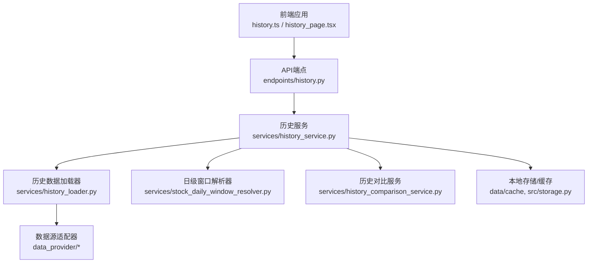
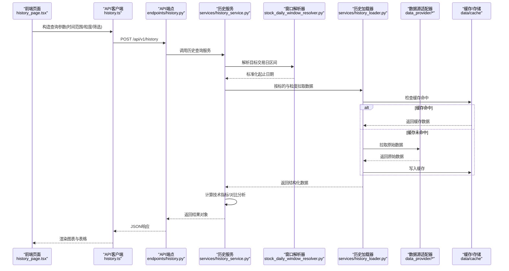
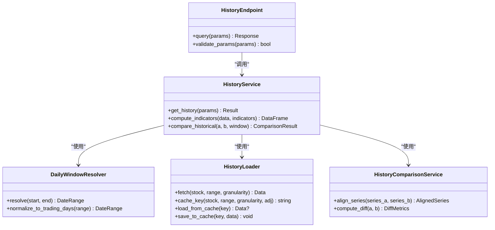
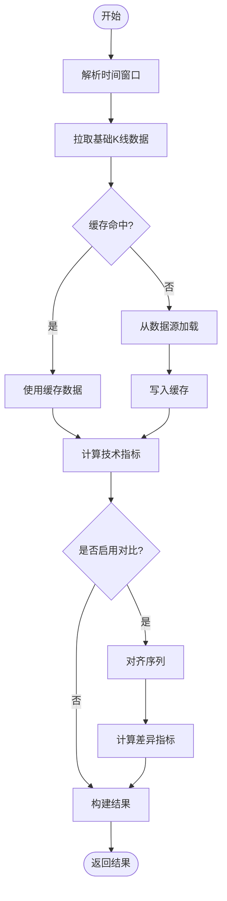
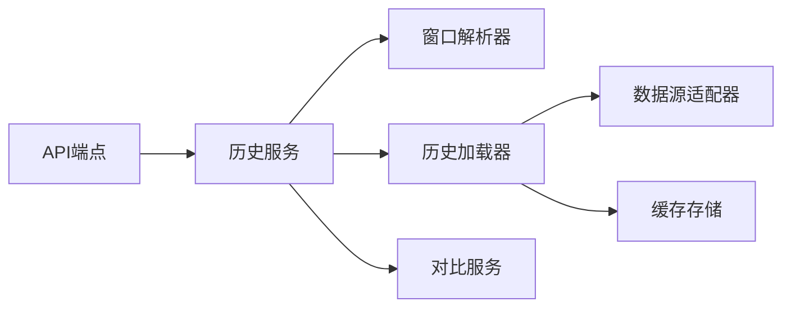

# 历史查询命令(history)

<cite>
**本文引用的文件**   
- [history.py](file://api/v1/endpoints/history.py)
- [history_schema.py](file://api/v1/schemas/history.py)
- [history_service.py](file://src/services/history_service.py)
- [history_loader.py](file://src/services/history_loader.py)
- [history_comparison_service.py](file://src/services/history_comparison_service.py)
- [stock_daily_window_resolver.py](file://src/services/stock_daily_window_resolver.py)
- [history.ts](file://apps/dsa-web/src/api/history.ts)
- [history_page.tsx](file://apps/dsa-web/src/pages/history_page.tsx)
- [history_components_index.tsx](file://apps/dsa-web/src/components/history/index.tsx)
- [test_analysis_history.py](file://tests/test_analysis_history.py)
- [test_history_loader.py](file://tests/test_history_loader.py)
</cite>

## 目录
1. [简介](#简介)
2. [项目结构](#项目结构)
3. [核心组件](#核心组件)
4. [架构总览](#架构总览)
5. [详细组件分析](#详细组件分析)
6. [依赖关系分析](#依赖关系分析)
7. [性能考量](#性能考量)
8. [故障排查指南](#故障排查指南)
9. [结论](#结论)
10. [附录](#附录)

## 简介
本文件面向Daily Stock Analysis中的“历史查询命令(history)”功能，系统性说明如何通过API与前端界面进行历史价格查询、技术指标回溯与交易记录查看。文档涵盖：
- 参数配置：时间范围、数据粒度、筛选条件等
- 数据存储结构与查询优化机制
- 返回格式与分析结果类型
- 典型使用示例：趋势分析、回测验证等
- 数据精度与完整性保证
- 大数据量查询的性能优化建议

## 项目结构
历史查询能力由后端API端点、服务层、数据加载器以及前端API客户端与页面共同组成。关键路径如下：
- API端点：定义HTTP接口与入参校验
- 服务层：封装业务逻辑（窗口解析、指标计算、对比分析）
- 数据加载器：对接多数据源并实现缓存与分页
- 前端：提供查询表单、图表展示与交互

**图示来源** 
- [history.py](file://api/v1/endpoints/history.py)
- [history_service.py](file://src/services/history_service.py)
- [history_loader.py](file://src/services/history_loader.py)
- [stock_daily_window_resolver.py](file://src/services/stock_daily_window_resolver.py)
- [history_comparison_service.py](file://src/services/history_comparison_service.py)

**章节来源**
- [history.py](file://api/v1/endpoints/history.py)
- [history_schema.py](file://api/v1/schemas/history.py)
- [history_service.py](file://src/services/history_service.py)
- [history_loader.py](file://src/services/history_loader.py)
- [history_comparison_service.py](file://src/services/history_comparison_service.py)
- [stock_daily_window_resolver.py](file://src/services/stock_daily_window_resolver.py)
- [history.ts](file://apps/dsa-web/src/api/history.ts)
- [history_page.tsx](file://apps/dsa-web/src/pages/history_page.tsx)

## 核心组件
- API端点：暴露REST接口，负责参数校验、权限控制与响应序列化
- 历史服务：聚合窗口解析、指标计算、对比分析与结果组装
- 历史加载器：统一拉取历史K线、成交量、资金流等数据，支持缓存与分页
- 窗口解析器：将用户输入的时间范围转换为精确的交易日区间
- 对比服务：对多标的或多时间段数据进行对齐与对比
- 前端客户端与页面：构建查询表单、发起请求、渲染图表与导出结果

**章节来源**
- [history.py](file://api/v1/endpoints/history.py)
- [history_schema.py](file://api/v1/schemas/history.py)
- [history_service.py](file://src/services/history_service.py)
- [history_loader.py](file://src/services/history_loader.py)
- [stock_daily_window_resolver.py](file://src/services/stock_daily_window_resolver.py)
- [history_comparison_service.py](file://src/services/history_comparison_service.py)
- [history.ts](file://apps/dsa-web/src/api/history.ts)
- [history_page.tsx](file://apps/dsa-web/src/pages/history_page.tsx)

## 架构总览
以下序列图展示了从前端发起历史查询到返回结果的完整调用链。

**图示来源** 
- [history.py](file://api/v1/endpoints/history.py)
- [history_service.py](file://src/services/history_service.py)
- [stock_daily_window_resolver.py](file://src/services/stock_daily_window_resolver.py)
- [history_loader.py](file://src/services/history_loader.py)
- [history.ts](file://apps/dsa-web/src/api/history.ts)
- [history_page.tsx](file://apps/dsa-web/src/pages/history_page.tsx)

## 详细组件分析

### API端点与参数规范
- 职责：接收前端请求，校验入参，调用服务层，返回标准JSON
- 主要参数：
  - 标的代码或名称
  - 时间范围：起始与结束日期（自动解析为交易日）
  - 数据粒度：日线、周线、月线等
  - 字段选择：开盘/收盘/最高/最低/成交量/成交额等
  - 技术指标：MA、MACD、RSI、布林带等可选开关
  - 筛选条件：涨跌停过滤、停牌剔除、复权方式等
  - 分页与排序：页码、每页条数、排序字段
- 返回结构：
  - 元信息：标的、时间范围、粒度、复权方式
  - 数据列表：逐条K线与指标列
  - 统计摘要：均值、波动率、最大回撤等
  - 对比结果（如启用）：多标的/多时段对齐后的差异指标

**章节来源**
- [history.py](file://api/v1/endpoints/history.py)
- [history_schema.py](file://api/v1/schemas/history.py)

### 历史服务（业务编排）
- 职责：协调窗口解析、数据加载、指标计算、对比分析，组装最终结果
- 关键点：
  - 窗口解析：将自然语言或相对时间转换为精确交易日区间
  - 指标计算：在内存中高效计算常用技术指标
  - 对比分析：对齐不同标的/时段的序列，输出差异与相关性
  - 错误处理：数据缺失、网络异常、指标溢出等异常分支

**章节来源**
- [history_service.py](file://src/services/history_service.py)
- [stock_daily_window_resolver.py](file://src/services/stock_daily_window_resolver.py)
- [history_comparison_service.py](file://src/services/history_comparison_service.py)

### 历史加载器（数据接入与缓存）
- 职责：统一从多数据源拉取历史数据，管理缓存与分页
- 关键点：
  - 数据源路由：根据市场与标的选择最优数据源
  - 缓存策略：键值包含标的、时间范围、粒度、复权方式
  - 增量更新：仅拉取新增交易日数据
  - 容错重试：失败自动切换备用数据源

**章节来源**
- [history_loader.py](file://src/services/history_loader.py)

### 前端API客户端与页面
- 职责：构建查询表单、发起请求、渲染图表与导出
- 关键点：
  - 参数校验与默认值填充
  - 分页与懒加载
  - 图表库集成（折线、柱状、叠加指标）
  - 导出CSV/Excel

**章节来源**
- [history.ts](file://apps/dsa-web/src/api/history.ts)
- [history_page.tsx](file://apps/dsa-web/src/pages/history_page.tsx)
- [history_components_index.tsx](file://apps/dsa-web/src/components/history/index.tsx)

### 类关系图（代码级别）

**图示来源** 
- [history.py](file://api/v1/endpoints/history.py)
- [history_service.py](file://src/services/history_service.py)
- [stock_daily_window_resolver.py](file://src/services/stock_daily_window_resolver.py)
- [history_loader.py](file://src/services/history_loader.py)
- [history_comparison_service.py](file://src/services/history_comparison_service.py)

### 时序图（指标计算流程）

**图示来源** 
- [history_service.py](file://src/services/history_service.py)
- [history_loader.py](file://src/services/history_loader.py)
- [history_comparison_service.py](file://src/services/history_comparison_service.py)

## 依赖关系分析
- 模块耦合：
  - API端点依赖服务层，服务层依赖窗口解析器、加载器与对比服务
  - 加载器依赖数据源适配器与缓存存储
- 外部依赖：
  - 数据源适配器（A股、港股、美股、指数等）
  - 缓存存储（本地文件或内存缓存）
- 潜在循环依赖：通过服务层解耦，避免直接循环引用

**图示来源** 
- [history.py](file://api/v1/endpoints/history.py)
- [history_service.py](file://src/services/history_service.py)
- [history_loader.py](file://src/services/history_loader.py)
- [history_comparison_service.py](file://src/services/history_comparison_service.py)

**章节来源**
- [history.py](file://api/v1/endpoints/history.py)
- [history_service.py](file://src/services/history_service.py)
- [history_loader.py](file://src/services/history_loader.py)
- [history_comparison_service.py](file://src/services/history_comparison_service.py)

## 性能考量
- 缓存策略：
  - 基于标的+时间范围+粒度+复权方式的键生成，减少重复拉取
  - 增量更新仅拉取新增交易日，降低带宽与CPU开销
- 分页与懒加载：
  - 前端按需加载下一页，避免一次性渲染大量数据
- 指标计算优化：
  - 向量化计算，避免逐行循环
  - 按需计算指标，关闭不需要的指标以减少计算量
- 数据源路由：
  - 优先选择低延迟、高可用的数据源，失败自动切换
- 并发与限流：
  - 限制并发请求数量，防止数据源限流导致失败
- 内存管理：
  - 大结果集采用流式处理与分块计算，避免内存峰值过高

[本节为通用性能指导，无需特定文件来源]

## 故障排查指南
- 常见问题：
  - 时间范围无效：确保起止日期为有效交易日，系统会自动校正至最近交易日
  - 数据缺失：检查数据源可用性，必要时切换备用数据源
  - 指标计算异常：确认数据复权方式一致，检查NaN与无穷值
  - 对比结果异常：确认序列长度与时间戳对齐
- 调试建议：
  - 开启详细日志，定位数据源拉取与缓存命中情况
  - 使用测试用例验证边界场景（节假日、停牌、极端行情）
- 相关测试：
  - 历史查询端到端测试
  - 历史加载器缓存与容错测试

**章节来源**
- [test_analysis_history.py](file://tests/test_analysis_history.py)
- [test_history_loader.py](file://tests/test_history_loader.py)

## 结论
历史查询命令(history)提供了强大的历史数据分析能力，覆盖价格查询、技术指标回溯与交易记录查看。通过清晰的分层架构、高效的缓存与数据源路由、以及完善的前端交互，能够满足从日常监控到深度回测的多类场景需求。建议在大数据量查询时合理设置粒度与字段，充分利用缓存与分页机制以获得最佳性能。

[本节为总结性内容，无需特定文件来源]

## 附录
- 使用示例（概念性描述）：
  - 趋势分析：选择近一年日线数据，开启MA与布林带，观察价格与通道关系
  - 回测验证：选取策略信号与历史K线，计算收益曲线与最大回撤
  - 对比分析：比较同一行业多只股票在同一时间窗口的涨跌幅与波动率
- 数据精度与完整性：
  - 复权方式：前复权/后复权/不复权，需与策略一致
  - 缺失值处理：插值或剔除，需在结果中明确标注
  - 交易日校准：自动跳过非交易日，确保序列连续性

[本节为补充信息，无需特定文件来源]