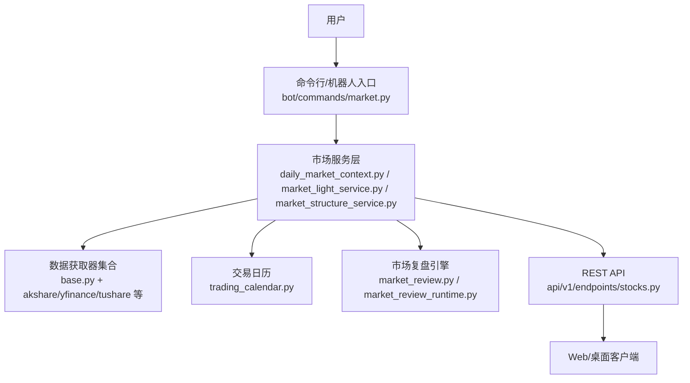
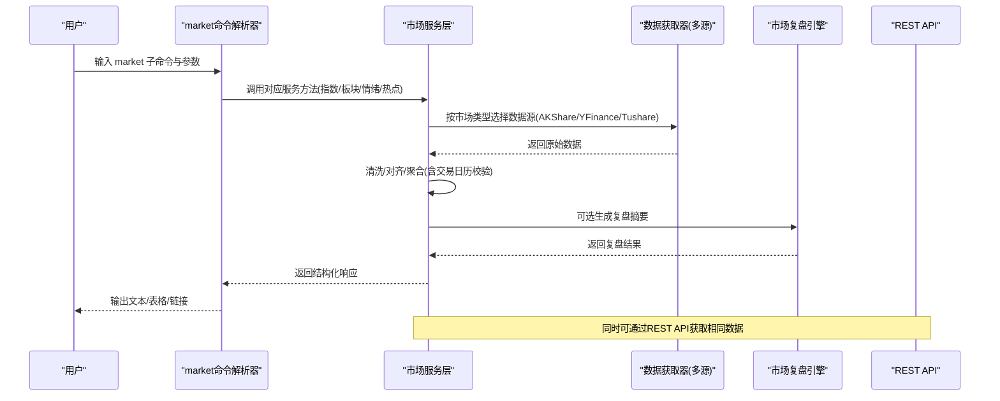
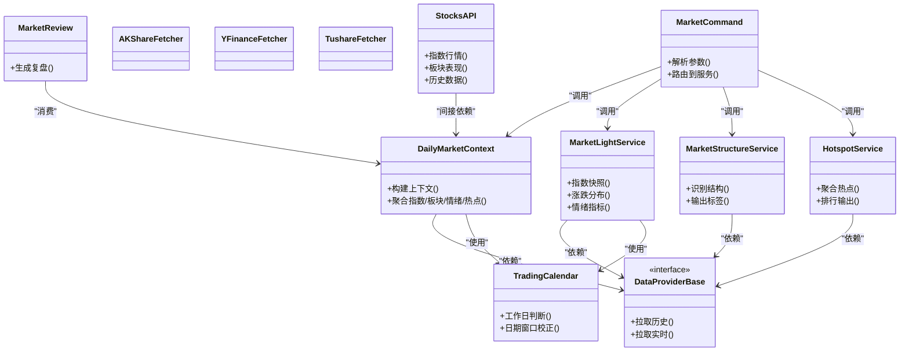

# 市场查询命令(market)

<cite>
**本文引用的文件**   
- [bot/commands/market.py](file://bot/commands/market.py)
- [src/services/daily_market_context.py](file://src/services/daily_market_context.py)
- [src/services/market_light_service.py](file://src/services/market_light_service.py)
- [src/services/market_structure_service.py](file://src/services/market_structure_service.py)
- [src/services/market_hotspot_service.py](file://src/services/market_hotspot_service.py)
- [data_provider/base.py](file://data_provider/base.py)
- [data_provider/akshare_fetcher.py](file://data_provider/akshare_fetcher.py)
- [data_provider/yfinance_fetcher.py](file://data_provider/yfinance_fetcher.py)
- [data_provider/tushare_fetcher.py](file://data_provider/tushare_fetcher.py)
- [data_provider/us_index_mapping.py](file://data_provider/us_index_mapping.py)
- [src/core/market_review.py](file://src/core/market_review.py)
- [src/core/market_review_runtime.py](file://src/core/market_review_runtime.py)
- [src/core/trading_calendar.py](file://src/core/trading_calendar.py)
- [api/v1/endpoints/stocks.py](file://api/v1/endpoints/stocks.py)
- [api/v1/schemas/stocks.py](file://api/v1/schemas/stocks.py)
- [src/services/history_loader.py](file://src/services/history_loader.py)
- [src/services/history_service.py](file://src/services/history_service.py)
</cite>

## 目录
1. [简介](#简介)
2. [项目结构](#项目结构)
3. [核心组件](#核心组件)
4. [架构总览](#架构总览)
5. [详细组件分析](#详细组件分析)
6. [依赖关系分析](#依赖关系分析)
7. [性能考虑](#性能考虑)
8. [故障排查指南](#故障排查指南)
9. [结论](#结论)
10. [附录](#附录)

## 简介
本文件为 Daily Stock Analysis 中的“market”市场查询命令的权威文档。该命令面向用户通过命令行或机器人交互，快速查询指数行情、板块表现、市场情绪与热点等市场数据，并支持 A 股、港股、美股等多市场覆盖。文档涵盖：
- 命令参数选项（市场类型、时间周期、筛选条件等）
- 数据来源与处理逻辑
- 返回格式与展示方式
- 多市场查询示例
- 数据更新频率与缓存机制
- 查询性能优化建议

## 项目结构
market 命令位于 bot 层，负责解析用户指令并调度服务层能力；服务层聚合多个数据获取器（Fetcher），并通过统一的接口返回结构化数据；API 层提供 REST 接口供 Web/桌面端调用。

图表来源
- [bot/commands/market.py](file://bot/commands/market.py)
- [src/services/daily_market_context.py](file://src/services/daily_market_context.py)
- [src/services/market_light_service.py](file://src/services/market_light_service.py)
- [src/services/market_structure_service.py](file://src/services/market_structure_service.py)
- [data_provider/base.py](file://data_provider/base.py)
- [data_provider/akshare_fetcher.py](file://data_provider/akshare_fetcher.py)
- [data_provider/yfinance_fetcher.py](file://data_provider/yfinance_fetcher.py)
- [data_provider/tushare_fetcher.py](file://data_provider/tushare_fetcher.py)
- [src/core/trading_calendar.py](file://src/core/trading_calendar.py)
- [src/core/market_review.py](file://src/core/market_review.py)
- [src/core/market_review_runtime.py](file://src/core/market_review_runtime.py)
- [api/v1/endpoints/stocks.py](file://api/v1/endpoints/stocks.py)

章节来源
- [bot/commands/market.py](file://bot/commands/market.py)
- [src/services/daily_market_context.py](file://src/services/daily_market_context.py)
- [src/services/market_light_service.py](file://src/services/market_light_service.py)
- [src/services/market_structure_service.py](file://src/services/market_structure_service.py)
- [data_provider/base.py](file://data_provider/base.py)
- [data_provider/akshare_fetcher.py](file://data_provider/akshare_fetcher.py)
- [data_provider/yfinance_fetcher.py](file://data_provider/yfinance_fetcher.py)
- [data_provider/tushare_fetcher.py](file://data_provider/tushare_fetcher.py)
- [src/core/trading_calendar.py](file://src/core/trading_calendar.py)
- [src/core/market_review.py](file://src/core/market_review.py)
- [src/core/market_review_runtime.py](file://src/core/market_review_runtime.py)
- [api/v1/endpoints/stocks.py](file://api/v1/endpoints/stocks.py)

## 核心组件
- 命令解析与路由：解析 market 子命令与参数，选择对应服务方法执行。
- 市场上下文服务：统一封装每日市场上下文构建，包括指数、板块、情绪、热点等。
- 轻量市场服务：提供指数行情快照、涨跌分布、资金流向等轻量指标。
- 市场结构服务：识别趋势、震荡、突破等结构状态，辅助判断市场阶段。
- 热点服务：聚合热门概念/行业/个股热度信息。
- 数据获取器抽象与实现：定义统一接口，适配不同数据源（A 股、港股、美股）。
- 交易日历：用于日期窗口计算与节假日过滤。
- 市场复盘引擎：生成市场复盘摘要与可视化素材。
- REST API：对外暴露标准化接口，便于前端集成。

章节来源
- [bot/commands/market.py](file://bot/commands/market.py)
- [src/services/daily_market_context.py](file://src/services/daily_market_context.py)
- [src/services/market_light_service.py](file://src/services/market_light_service.py)
- [src/services/market_structure_service.py](file://src/services/market_structure_service.py)
- [src/services/market_hotspot_service.py](file://src/services/market_hotspot_service.py)
- [data_provider/base.py](file://data_provider/base.py)
- [data_provider/akshare_fetcher.py](file://data_provider/akshare_fetcher.py)
- [data_provider/yfinance_fetcher.py](file://data_provider/yfinance_fetcher.py)
- [data_provider/tushare_fetcher.py](file://data_provider/tushare_fetcher.py)
- [src/core/trading_calendar.py](file://src/core/trading_calendar.py)
- [src/core/market_review.py](file://src/core/market_review.py)
- [src/core/market_review_runtime.py](file://src/core/market_review_runtime.py)
- [api/v1/endpoints/stocks.py](file://api/v1/endpoints/stocks.py)

## 架构总览
下图展示了从命令到数据源的端到端流程，以及关键服务之间的协作关系。

图表来源
- [bot/commands/market.py](file://bot/commands/market.py)
- [src/services/daily_market_context.py](file://src/services/daily_market_context.py)
- [data_provider/base.py](file://data_provider/base.py)
- [data_provider/akshare_fetcher.py](file://data_provider/akshare_fetcher.py)
- [data_provider/yfinance_fetcher.py](file://data_provider/yfinance_fetcher.py)
- [data_provider/tushare_fetcher.py](file://data_provider/tushare_fetcher.py)
- [src/core/market_review.py](file://src/core/market_review.py)
- [api/v1/endpoints/stocks.py](file://api/v1/endpoints/stocks.py)

## 详细组件分析

### 命令解析与参数说明
- 市场类型：A 股、港股、美股、全球指数等，由命令参数指定。
- 时间周期：当日、近 N 日、自定义起止日期，内部通过交易日历进行边界校正。
- 筛选条件：指数代码/名称、板块/行业、涨跌幅阈值、成交量阈值、资金净流入等。
- 输出格式：文本摘要、表格、图表链接（如适用）。

章节来源
- [bot/commands/market.py](file://bot/commands/market.py)
- [src/core/trading_calendar.py](file://src/core/trading_calendar.py)

### 市场上下文服务（每日市场概览）
- 职责：聚合指数、板块、情绪、热点等维度，形成每日市场上下文。
- 输入：市场类型、时间窗口、筛选条件。
- 处理：调用各数据获取器，进行数据清洗、对齐、去重与聚合。
- 输出：结构化上下文对象，供命令渲染或 API 返回。

章节来源
- [src/services/daily_market_context.py](file://src/services/daily_market_context.py)

### 轻量市场服务（指数行情与情绪）
- 功能：指数实时/收盘快照、涨跌家数、涨跌分布、主要情绪指标。
- 数据源：根据市场类型自动选择最优数据源（如 A 股优先 AKShare，美股优先 YFinance）。
- 缓存：对高频指标采用短期缓存以减少重复请求。

章节来源
- [src/services/market_light_service.py](file://src/services/market_light_service.py)
- [data_provider/akshare_fetcher.py](file://data_provider/akshare_fetcher.py)
- [data_provider/yfinance_fetcher.py](file://data_provider/yfinance_fetcher.py)

### 市场结构服务（趋势/震荡/突破）
- 功能：基于价格序列与成交量特征，识别市场结构状态。
- 算法：移动平均、波动率、支撑阻力位、量价配合等。
- 输出：结构标签与置信度，辅助决策。

章节来源
- [src/services/market_structure_service.py](file://src/services/market_structure_service.py)

### 热点服务（板块/概念/个股热度）
- 功能：聚合新闻、搜索热度、资金流向，生成热点排行。
- 数据源：多源融合，包含搜索与行情数据。
- 输出：热点列表及关联标的。

章节来源
- [src/services/market_hotspot_service.py](file://src/services/market_hotspot_service.py)

### 数据获取器抽象与实现
- 抽象基类：定义统一接口（拉取历史、实时、板块、指数等）。
- 具体实现：
  - A 股：AKShare、Tushare、BaoStock 等
  - 港股/美股：YFinance、Longbridge、Finnhub 等
  - 指数映射：美股指数代码映射表
- 容错：失败回退、超时重试、日志记录。

章节来源
- [data_provider/base.py](file://data_provider/base.py)
- [data_provider/akshare_fetcher.py](file://data_provider/akshare_fetcher.py)
- [data_provider/yfinance_fetcher.py](file://data_provider/yfinance_fetcher.py)
- [data_provider/tushare_fetcher.py](file://data_provider/tushare_fetcher.py)
- [data_provider/us_index_mapping.py](file://data_provider/us_index_mapping.py)

### 市场复盘引擎
- 功能：将市场上下文转化为可读的市场复盘报告，支持模板渲染。
- 触发：定时任务或手动触发。
- 输出：Markdown/图片链接，便于分享与归档。

章节来源
- [src/core/market_review.py](file://src/core/market_review.py)
- [src/core/market_review_runtime.py](file://src/core/market_review_runtime.py)

### REST API 接口（stocks）
- 作用：对外暴露市场数据查询接口，供 Web/桌面端使用。
- 能力：指数行情、板块表现、历史数据、情绪指标等。
- 规范：Pydantic 模型校验，错误码与消息统一。

章节来源
- [api/v1/endpoints/stocks.py](file://api/v1/endpoints/stocks.py)
- [api/v1/schemas/stocks.py](file://api/v1/schemas/stocks.py)

### 历史数据加载与服务
- 历史加载器：统一读取本地缓存或远程数据源的历史数据。
- 历史服务：提供窗口化查询、归一化、缺失值处理等。

章节来源
- [src/services/history_loader.py](file://src/services/history_loader.py)
- [src/services/history_service.py](file://src/services/history_service.py)

## 依赖关系分析
- 命令层依赖服务层，服务层依赖数据获取器与交易日历。
- 市场复盘引擎依赖服务层输出的上下文对象。
- REST API 与服务层解耦，通过标准接口访问相同能力。

图表来源
- [bot/commands/market.py](file://bot/commands/market.py)
- [src/services/daily_market_context.py](file://src/services/daily_market_context.py)
- [src/services/market_light_service.py](file://src/services/market_light_service.py)
- [src/services/market_structure_service.py](file://src/services/market_structure_service.py)
- [src/services/market_hotspot_service.py](file://src/services/market_hotspot_service.py)
- [data_provider/base.py](file://data_provider/base.py)
- [data_provider/akshare_fetcher.py](file://data_provider/akshare_fetcher.py)
- [data_provider/yfinance_fetcher.py](file://data_provider/yfinance_fetcher.py)
- [data_provider/tushare_fetcher.py](file://data_provider/tushare_fetcher.py)
- [src/core/trading_calendar.py](file://src/core/trading_calendar.py)
- [src/core/market_review.py](file://src/core/market_review.py)
- [api/v1/endpoints/stocks.py](file://api/v1/endpoints/stocks.py)

## 性能考虑
- 数据源选择策略：按市场类型与可用性动态选择最快数据源，失败时自动回退。
- 短期缓存：对指数快照、情绪指标等高频数据设置短 TTL，减少重复请求。
- 批量拉取：板块与热点数据尽量批量获取，降低网络开销。
- 交易日历预计算：提前计算交易日窗口，避免运行时重复判断。
- 异步与并发：在允许的情况下并行拉取多源数据，缩短整体延迟。
- 分页与限流：对大数据集采用分页与速率限制，避免阻塞。
- 结果裁剪：按需返回字段，减少序列化与传输成本。

[本节为通用指导，不直接分析具体文件]

## 故障排查指南
- 数据源不可用：检查网络连通性与数据源鉴权配置，查看日志中的错误码与重试次数。
- 日期异常：确认交易日历配置与节假日设置，确保起止日期有效。
- 数据不一致：对比多源数据，定位差异来源；必要时启用调试日志。
- 缓存失效：清理缓存后重试，观察是否恢复。
- API 错误：检查请求参数是否符合 Pydantic 模型约束，关注错误消息定位问题。

章节来源
- [data_provider/base.py](file://data_provider/base.py)
- [src/core/trading_calendar.py](file://src/core/trading_calendar.py)
- [api/v1/schemas/stocks.py](file://api/v1/schemas/stocks.py)

## 结论
market 命令通过清晰的命令解析、服务层聚合与多数据源适配，提供了跨市场的指数、板块、情绪与热点查询能力。结合交易日历、复盘引擎与 REST API，既满足命令行与机器人场景，也支持 Web/桌面端集成。通过合理的缓存与并发策略，可在保证数据新鲜度的同时提升查询性能。

[本节为总结性内容，不直接分析具体文件]

## 附录

### 常用查询示例（覆盖 A 股、港股、美股）
- A 股指数行情：指定市场类型为 A 股，查询上证指数、深证成指、创业板指当日涨跌与成交额。
- 港股板块表现：选择港股市场，按行业板块统计涨跌幅前/后排名与资金流入。
- 美股指数概览：选择美股市场，查询标普 500、纳斯达克、道琼斯指数收盘与波动情况。
- 市场情绪：综合涨跌家数、涨停跌停数量、北向资金流向，评估当日情绪强弱。
- 热点追踪：按概念/行业/个股热度排序，结合新闻与搜索热度给出热点清单。

[本节为概念性示例，不直接分析具体文件]

### 数据更新频率与缓存机制
- 指数行情：盘中实时更新，收盘后固化；短缓存 TTL 分钟级。
- 板块与热点：盘后汇总为主，盘中增量更新；缓存 TTL 小时级。
- 历史数据：按日频更新，支持窗口化查询；本地缓存持久化。
- 复盘报告：定时任务生成，支持手动触发；输出 Markdown/图片。

[本节为概念性说明，不直接分析具体文件]

### 返回格式与展示方式
- 文本摘要：自然语言描述市场概况与关键指标。
- 表格：结构化列出指数/板块/个股的关键数据。
- 图表链接：指向生成的图表资源（如适用）。
- API JSON：符合 Pydantic 模型的标准化响应。

[本节为概念性说明，不直接分析具体文件]