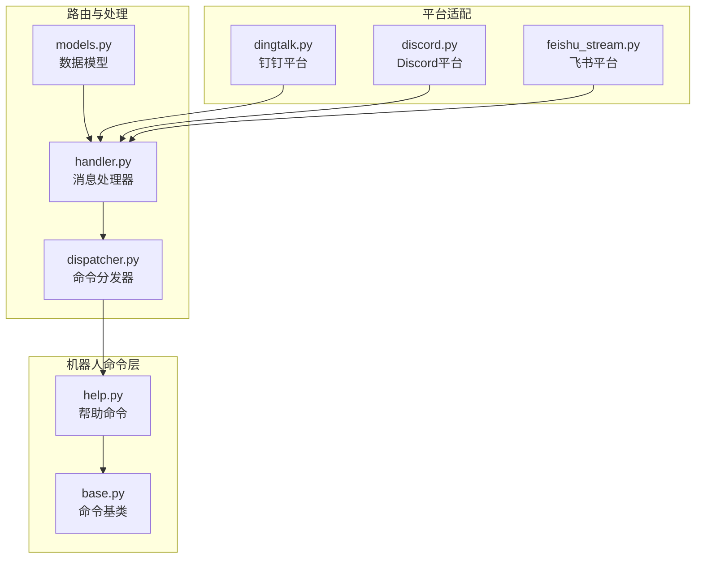
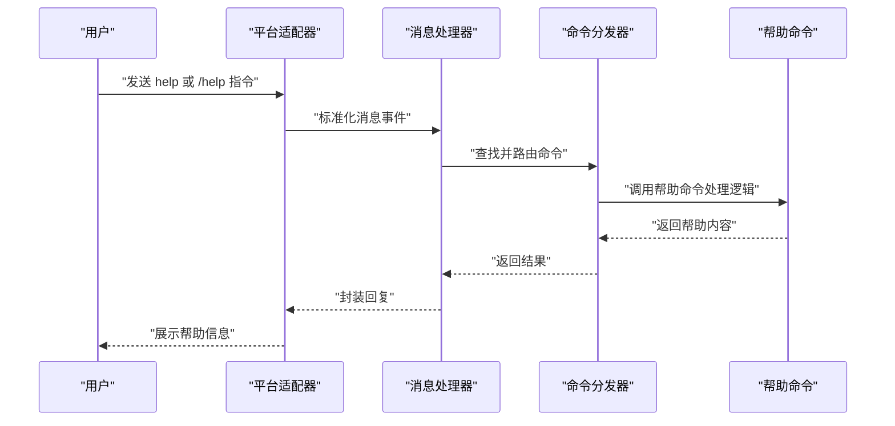
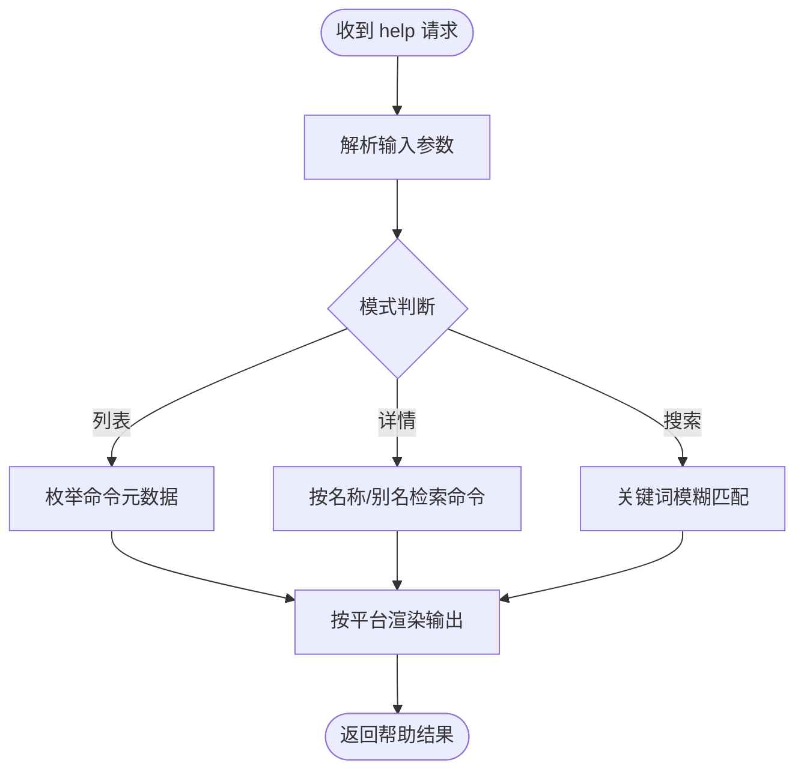
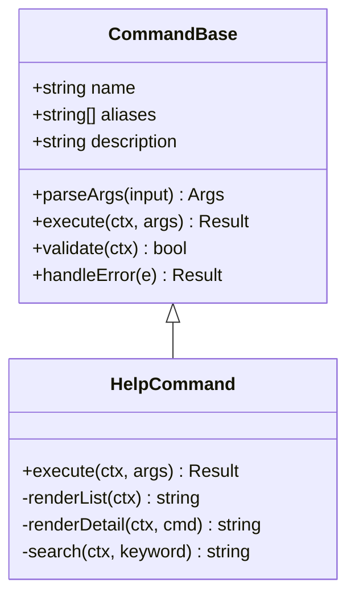
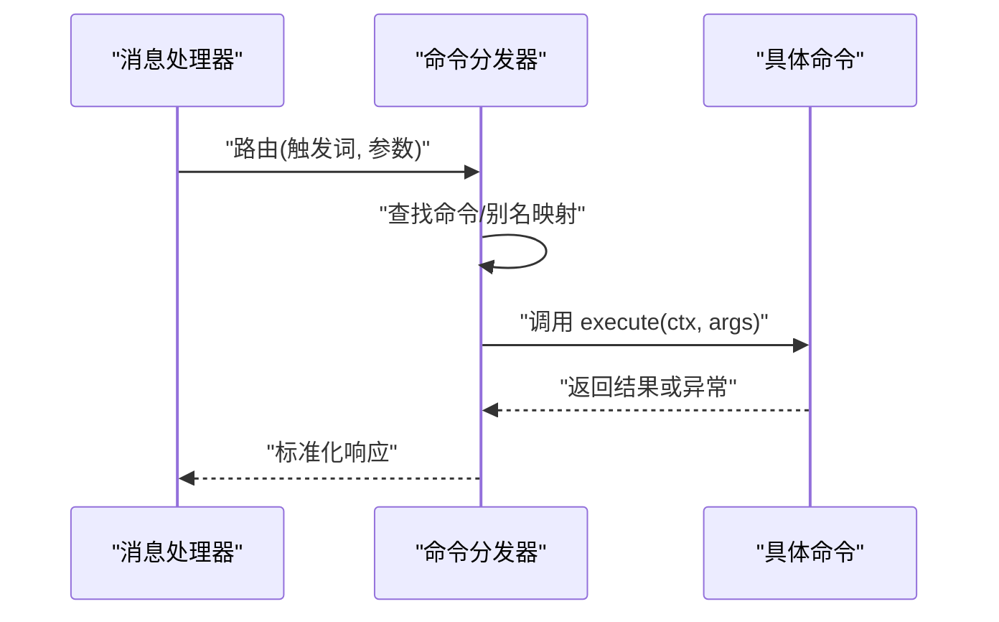
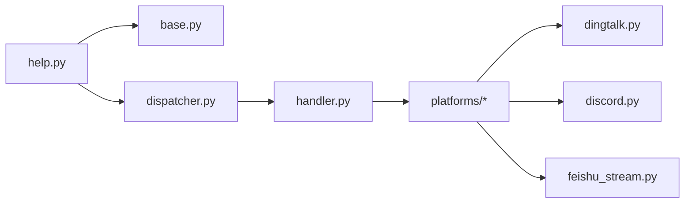

# 帮助命令(help)

<cite>
**本文档引用的文件**   
- [help.py](file://bot/commands/help.py)
- [base.py](file://bot/commands/base.py)
- [dispatcher.py](file://bot/dispatcher.py)
- [handler.py](file://bot/handler.py)
- [models.py](file://bot/models.py)
- [dingtalk.py](file://bot/platforms/dingtalk.py)
- [discord.py](file://bot/platforms/discord.py)
- [feishu_stream.py](file://bot/platforms/feishu_stream.py)
- [README.md](file://README.md)
- [bot-command.md](file://docs/bot-command.md)
- [settings-help.md](file://docs/settings-help.md)
</cite>

## 目录
1. [简介](#简介)
2. [项目结构](#项目结构)
3. [核心组件](#核心组件)
4. [架构总览](#架构总览)
5. [详细组件分析](#详细组件分析)
6. [依赖关系分析](#依赖关系分析)
7. [性能考虑](#性能考虑)
8. [故障排除指南](#故障排除指南)
9. [结论](#结论)
10. [附录](#附录)

## 简介
本章节面向Daily Stock Analysis的机器人帮助命令（help），旨在提供一份全面、易懂的使用与维护文档。内容涵盖：
- 帮助命令的用户指导与文档查询功能
- 使用方法：查看命令列表、获取特定命令帮助、搜索功能等
- 帮助信息的组织结构与内容管理
- 多语言支持与本地化机制
- 用户友好的帮助界面与导航方式
- 帮助内容的更新与维护机制
- 常见问题解答与故障排除

## 项目结构
帮助命令位于机器人命令模块中，通过统一的命令分发器注册并响应平台消息。关键路径如下：
- 命令实现：bot/commands/help.py
- 命令基类：bot/commands/base.py
- 命令分发：bot/dispatcher.py
- 消息处理入口：bot/handler.py
- 平台适配：bot/platforms/*（钉钉、飞书、Discord）
- 模型定义：bot/models.py
- 文档与说明：docs/bot-command.md、docs/settings-help.md、README.md

**图表来源** 
- [help.py](file://bot/commands/help.py)
- [base.py](file://bot/commands/base.py)
- [dispatcher.py](file://bot/dispatcher.py)
- [handler.py](file://bot/handler.py)
- [models.py](file://bot/models.py)
- [dingtalk.py](file://bot/platforms/dingtalk.py)
- [discord.py](file://bot/platforms/discord.py)
- [feishu_stream.py](file://bot/platforms/feishu_stream.py)

**章节来源**
- [help.py](file://bot/commands/help.py)
- [base.py](file://bot/commands/base.py)
- [dispatcher.py](file://bot/dispatcher.py)
- [handler.py](file://bot/handler.py)
- [models.py](file://bot/models.py)
- [dingtalk.py](file://bot/platforms/dingtalk.py)
- [discord.py](file://bot/platforms/discord.py)
- [feishu_stream.py](file://bot/platforms/feishu_stream.py)

## 核心组件
- 帮助命令（help.py）
  - 负责解析用户输入、匹配命令或关键词、返回结构化帮助信息
  - 支持列出所有可用命令、按名称检索命令详情、模糊搜索
  - 根据当前平台上下文渲染输出格式（文本、卡片、富文本等）
- 命令基类（base.py）
  - 定义命令元数据（名称、别名、描述、权限、参数）
  - 提供统一的执行接口与错误处理模板
- 命令分发器（dispatcher.py）
  - 维护命令注册表，按触发词路由到具体命令实现
  - 处理参数解析、权限校验、限流与重试
- 消息处理器（handler.py）
  - 接收平台消息，标准化为内部事件，调用分发器
  - 统一日志记录、异常捕获与回复封装
- 平台适配（dingtalk.py、discord.py、feishu_stream.py）
  - 将平台消息转换为标准事件，并将帮助结果转译为平台UI格式
- 数据模型（models.py）
  - 定义命令、消息、会话、上下文等数据结构

**章节来源**
- [help.py](file://bot/commands/help.py)
- [base.py](file://bot/commands/base.py)
- [dispatcher.py](file://bot/dispatcher.py)
- [handler.py](file://bot/handler.py)
- [models.py](file://bot/models.py)
- [dingtalk.py](file://bot/platforms/dingtalk.py)
- [discord.py](file://bot/platforms/discord.py)
- [feishu_stream.py](file://bot/platforms/feishu_stream.py)

## 架构总览
帮助命令的整体交互流程如下：用户在平台发送“help”或相关指令，消息经平台适配器进入消息处理器，再由命令分发器路由至帮助命令；帮助命令根据输入生成帮助内容，并通过平台适配器回显给用户。

**图表来源** 
- [handler.py](file://bot/handler.py)
- [dispatcher.py](file://bot/dispatcher.py)
- [help.py](file://bot/commands/help.py)
- [dingtalk.py](file://bot/platforms/dingtalk.py)
- [discord.py](file://bot/platforms/discord.py)
- [feishu_stream.py](file://bot/platforms/feishu_stream.py)

## 详细组件分析

### 帮助命令（help.py）
- 功能要点
  - 命令列表：无参或仅带“list”时，返回所有已注册命令的名称、简短描述与用法提示
  - 特定命令帮助：传入命令名或别名，返回该命令的详细参数、示例与注意事项
  - 搜索功能：支持关键词模糊匹配，返回命中命令及片段摘要
  - 多语言支持：根据会话或系统配置选择语言包，缺失时回退到默认语言
  - 平台适配：根据不同平台渲染富文本、卡片或纯文本
- 数据结构
  - 命令元数据：名称、别名、描述、参数定义、权限、语言键
  - 帮助结果：标题、段落、示例、链接、操作按钮（平台相关）
- 错误处理
  - 未找到命令：返回可用命令列表与搜索建议
  - 参数错误：提示正确用法与示例
  - 平台限制：降级为纯文本输出

**图表来源** 
- [help.py](file://bot/commands/help.py)

**章节来源**
- [help.py](file://bot/commands/help.py)

### 命令基类（base.py）
- 职责
  - 定义命令的统一接口：名称、别名、描述、参数解析、执行回调
  - 提供错误处理模板与日志记录
  - 支持权限校验与限流策略
- 设计模式
  - 工厂/注册：命令在启动时注册到分发器
  - 模板方法：子类实现具体执行逻辑，基类处理通用流程

**图表来源** 
- [base.py](file://bot/commands/base.py)
- [help.py](file://bot/commands/help.py)

**章节来源**
- [base.py](file://bot/commands/base.py)

### 命令分发器（dispatcher.py）
- 职责
  - 维护命令注册表，按触发词路由到具体命令
  - 处理参数解析、权限校验、限流与重试
  - 统一异常捕获与错误响应
- 关键点
  - 命令优先级与别名映射
  - 动态加载与热更新（可选）
  - 平台上下文注入（会话、用户、渠道）

**图表来源** 
- [dispatcher.py](file://bot/dispatcher.py)
- [handler.py](file://bot/handler.py)

**章节来源**
- [dispatcher.py](file://bot/dispatcher.py)
- [handler.py](file://bot/handler.py)

### 消息处理器（handler.py）
- 职责
  - 接收平台消息，标准化为内部事件
  - 调用命令分发器并封装回复
  - 统一日志、异常捕获与重试
- 关键点
  - 平台差异抽象（消息体、用户标识、会话ID）
  - 安全校验（签名、频率限制）
  - 异步处理与超时控制

**章节来源**
- [handler.py](file://bot/handler.py)

### 平台适配（dingtalk.py、discord.py、feishu_stream.py）
- 职责
  - 将平台消息转换为标准事件
  - 将帮助结果渲染为平台UI格式（卡片、富文本、按钮）
- 关键点
  - 平台API限制与降级策略
  - 富文本标签与链接处理
  - 用户交互事件（点击按钮触发子命令）

**章节来源**
- [dingtalk.py](file://bot/platforms/dingtalk.py)
- [discord.py](file://bot/platforms/discord.py)
- [feishu_stream.py](file://bot/platforms/feishu_stream.py)

### 数据模型（models.py）
- 职责
  - 定义命令、消息、会话、上下文等数据结构
- 关键点
  - 强类型约束与序列化
  - 跨平台字段映射
  - 扩展性与版本兼容

**章节来源**
- [models.py](file://bot/models.py)

## 依赖关系分析
帮助命令依赖命令基类、分发器、消息处理器与平台适配器。命令通过分发器注册，消息处理器统一接入平台，平台适配器负责UI渲染。

**图表来源** 
- [help.py](file://bot/commands/help.py)
- [base.py](file://bot/commands/base.py)
- [dispatcher.py](file://bot/dispatcher.py)
- [handler.py](file://bot/handler.py)
- [dingtalk.py](file://bot/platforms/dingtalk.py)
- [discord.py](file://bot/platforms/discord.py)
- [feishu_stream.py](file://bot/platforms/feishu_stream.py)

**章节来源**
- [help.py](file://bot/commands/help.py)
- [base.py](file://bot/commands/base.py)
- [dispatcher.py](file://bot/dispatcher.py)
- [handler.py](file://bot/handler.py)
- [dingtalk.py](file://bot/platforms/dingtalk.py)
- [discord.py](file://bot/platforms/discord.py)
- [feishu_stream.py](file://bot/platforms/feishu_stream.py)

## 性能考虑
- 命令注册与查找
  - 使用哈希映射存储命令别名，O(1)查找
  - 避免在高频路径中进行字符串拼接与正则匹配
- 帮助内容生成
  - 缓存常用帮助结果（如命令列表），设置合理过期时间
  - 按需懒加载详细描述，减少初始内存占用
- 平台渲染
  - 批量构建富文本节点，减少网络往返
  - 对大段文本进行分页或折叠显示
- 并发与限流
  - 对help请求进行速率限制，防止滥用
  - 异步处理长耗时操作（如搜索索引构建）

[本节为通用性能建议，不直接分析具体文件]

## 故障排除指南
- 常见问题
  - 无法识别“help”命令：检查命令注册与触发词映射是否正确
  - 帮助内容不完整：确认语言包是否齐全，检查回退逻辑
  - 平台渲染异常：验证平台API限制与富文本标签合法性
  - 搜索无结果：检查关键词匹配规则与索引更新状态
- 排查步骤
  - 启用调试日志，观察消息流转与命令路由
  - 使用最小化输入测试（如仅“help”）定位问题范围
  - 检查平台适配器返回的原始消息与响应
  - 验证命令元数据与权限配置
- 恢复措施
  - 重启服务以重新加载命令注册表
  - 清理缓存并重建帮助索引
  - 回滚最近变更的命令定义或语言包

**章节来源**
- [help.py](file://bot/commands/help.py)
- [dispatcher.py](file://bot/dispatcher.py)
- [handler.py](file://bot/handler.py)
- [dingtalk.py](file://bot/platforms/dingtalk.py)
- [discord.py](file://bot/platforms/discord.py)
- [feishu_stream.py](file://bot/platforms/feishu_stream.py)

## 结论
帮助命令是用户与机器人交互的重要入口，其设计应兼顾易用性、可扩展性与可维护性。通过清晰的命令元数据、统一的分发机制与平台适配，能够帮助用户快速理解并使用各项功能。同时，完善的多语言支持与内容管理机制，有助于提升用户体验与运营效率。

[本节为总结性内容，不直接分析具体文件]

## 附录
- 使用方法
  - 查看命令列表：发送“help”或“/help”
  - 获取特定命令帮助：发送“help <命令名>”或“/help <命令名>”
  - 搜索功能：发送“help search <关键词>”
- 帮助内容组织
  - 命令元数据驱动，包含名称、别名、描述、参数、示例
  - 语言键映射，支持多语言切换与回退
- 更新与维护
  - 新增命令需在基类中定义并在分发器注册
  - 更新语言包时需同步翻译键值与回退策略
  - 定期审查帮助内容与示例的有效性
- 参考文档
  - README.md：项目概览与使用说明
  - bot-command.md：机器人命令规范与示例
  - settings-help.md：设置项帮助与本地化说明

**章节来源**
- [README.md](file://README.md)
- [bot-command.md](file://docs/bot-command.md)
- [settings-help.md](file://docs/settings-help.md)