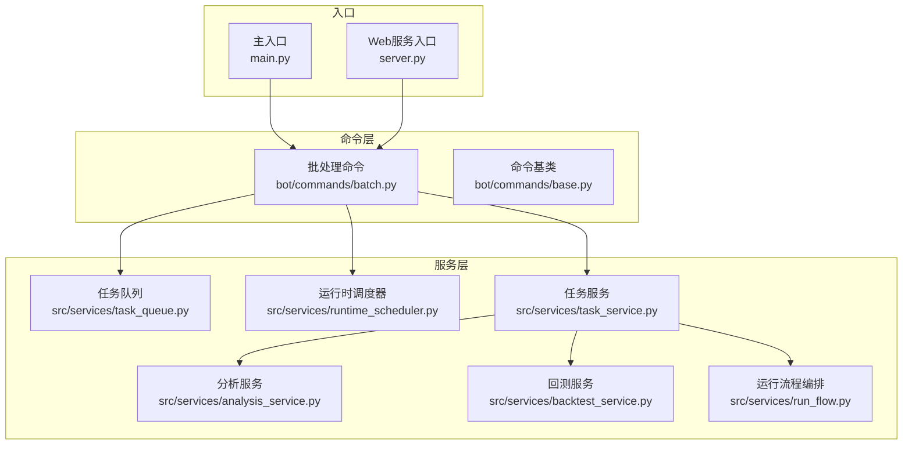
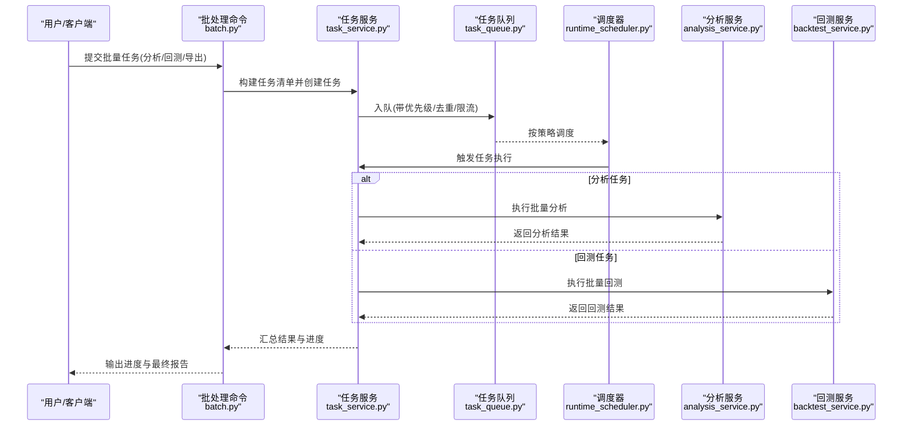
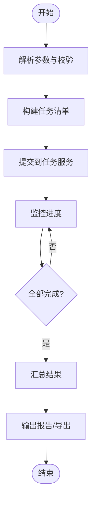
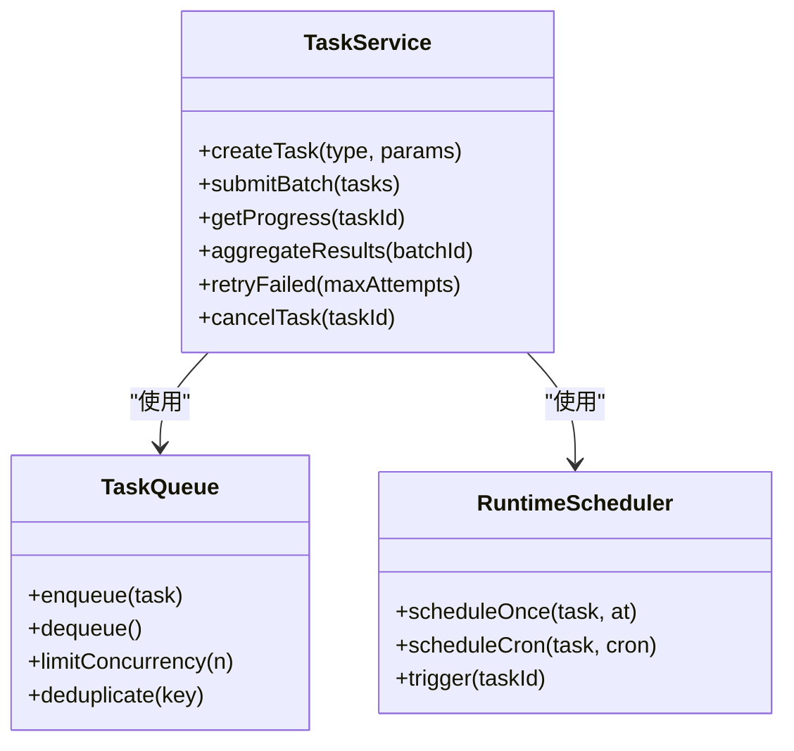
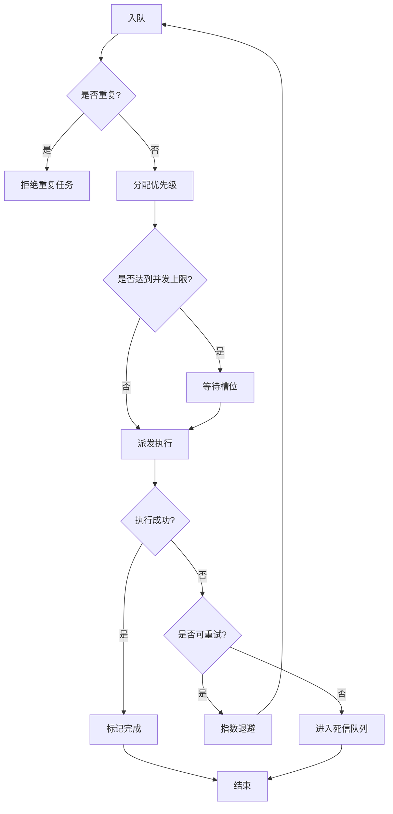
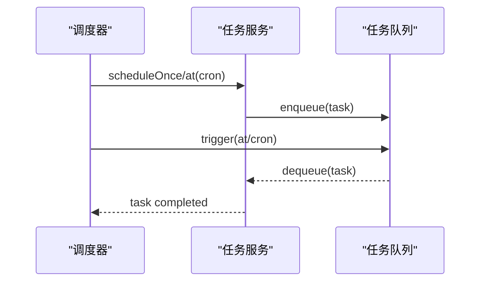
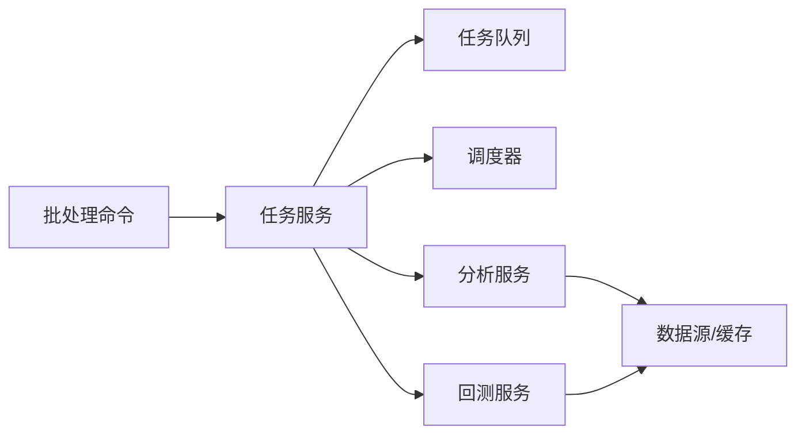

# 批量处理命令(batch)

<cite>
**本文引用的文件**   
- [batch.py](file://bot/commands/batch.py)
- [base.py](file://bot/commands/base.py)
- [task_service.py](file://src/services/task_service.py)
- [task_queue.py](file://src/services/task_queue.py)
- [runtime_scheduler.py](file://src/services/runtime_scheduler.py)
- [backtest_service.py](file://src/services/backtest_service.py)
- [analysis_service.py](file://src/services/analysis_service.py)
- [run_flow.py](file://src/services/run_flow.py)
- [main.py](file://main.py)
- [server.py](file://server.py)
</cite>

## 目录
1. [简介](#简介)
2. [项目结构](#项目结构)
3. [核心组件](#核心组件)
4. [架构总览](#架构总览)
5. [详细组件分析](#详细组件分析)
6. [依赖关系分析](#依赖关系分析)
7. [性能考虑](#性能考虑)
8. [故障排查指南](#故障排查指南)
9. [结论](#结论)
10. [附录](#附录)

## 简介
本文件面向Daily Stock Analysis项目的“批量处理命令(batch)”功能，系统性说明其在大额数据处理与批量操作方面的能力，包括：
- 批量分析、批量回测、批量导出等典型场景
- 任务配置方法与参数设置
- 任务调度与并发处理机制
- 进度监控与结果汇总
- 错误处理与重试策略
- 性能优化与资源管理建议
- 大规模数据处理示例与最佳实践

## 项目结构
批量处理命令位于机器人命令层（bot/commands），通过统一的命令基类注册并对外暴露。核心业务逻辑由服务层（services）提供，包括任务队列、调度器、分析服务、回测服务等。入口脚本负责启动应用与命令路由。

图表来源 
- [batch.py:1-200](file://bot/commands/batch.py#L1-L200)
- [base.py:1-120](file://bot/commands/base.py#L1-L120)
- [task_service.py:1-200](file://src/services/task_service.py#L1-L200)
- [task_queue.py:1-200](file://src/services/task_queue.py#L1-L200)
- [runtime_scheduler.py:1-200](file://src/services/runtime_scheduler.py#L1-L200)
- [analysis_service.py:1-200](file://src/services/analysis_service.py#L1-L200)
- [backtest_service.py:1-200](file://src/services/backtest_service.py#L1-L200)
- [run_flow.py:1-200](file://src/services/run_flow.py#L1-L200)
- [main.py:1-200](file://main.py#L1-L200)
- [server.py:1-200](file://server.py#L1-L200)

章节来源
- [batch.py:1-200](file://bot/commands/batch.py#L1-L200)
- [base.py:1-120](file://bot/commands/base.py#L1-L120)
- [task_service.py:1-200](file://src/services/task_service.py#L1-L200)
- [task_queue.py:1-200](file://src/services/task_queue.py#L1-L200)
- [runtime_scheduler.py:1-200](file://src/services/runtime_scheduler.py#L1-L200)
- [analysis_service.py:1-200](file://src/services/analysis_service.py#L1-L200)
- [backtest_service.py:1-200](file://src/services/backtest_service.py#L1-L200)
- [run_flow.py:1-200](file://src/services/run_flow.py#L1-L200)
- [main.py:1-200](file://main.py#L1-L200)
- [server.py:1-200](file://server.py#L1-L200)

## 核心组件
- 批处理命令（batch）：解析用户输入、构建批量任务清单、调用任务服务执行、输出进度与结果摘要。
- 任务服务（task_service）：统一的任务生命周期管理（创建、派发、跟踪、聚合结果）。
- 任务队列（task_queue）：支持优先级、去重、限流、持久化与重试的队列实现。
- 运行时调度器（runtime_scheduler）：基于时间或事件触发任务的调度，支持周期性与一次性任务。
- 分析服务（analysis_service）：单只或多只股票的批量分析流水线。
- 回测服务（backtest_service）：批量策略回测与指标计算。
- 运行流程编排（run_flow）：将多个步骤串联为可复用的工作流，便于批量执行。

章节来源
- [batch.py:1-200](file://bot/commands/batch.py#L1-L200)
- [task_service.py:1-200](file://src/services/task_service.py#L1-L200)
- [task_queue.py:1-200](file://src/services/task_queue.py#L1-L200)
- [runtime_scheduler.py:1-200](file://src/services/runtime_scheduler.py#L1-L200)
- [analysis_service.py:1-200](file://src/services/analysis_service.py#L1-L200)
- [backtest_service.py:1-200](file://src/services/backtest_service.py#L1-L200)
- [run_flow.py:1-200](file://src/services/run_flow.py#L1-L200)

## 架构总览
批量处理命令通过命令层接收请求，交由任务服务进行编排；任务服务根据任务类型分发至分析服务或回测服务，并通过任务队列与调度器进行并发控制与定时触发。最终结果经汇总后返回给调用方或写入存储。

图表来源 
- [batch.py:1-200](file://bot/commands/batch.py#L1-L200)
- [task_service.py:1-200](file://src/services/task_service.py#L1-L200)
- [task_queue.py:1-200](file://src/services/task_queue.py#L1-L200)
- [runtime_scheduler.py:1-200](file://src/services/runtime_scheduler.py#L1-L200)
- [analysis_service.py:1-200](file://src/services/analysis_service.py#L1-L200)
- [backtest_service.py:1-200](file://src/services/backtest_service.py#L1-L200)

## 详细组件分析

### 批处理命令（batch）
- 功能要点
  - 解析批量参数：股票列表、时间窗口、策略集合、输出格式、并发度、重试次数等。
  - 生成任务清单：对每个标的与策略组合生成独立任务项，支持去重与优先级。
  - 调用任务服务：提交任务、订阅进度、等待完成、汇总结果。
  - 进度与结果：实时反馈执行状态，完成后输出统计摘要与下载链接。
- 关键交互
  - 与任务服务交互以创建与查询任务。
  - 与任务队列交互以控制并发与限流。
  - 与调度器交互以安排周期性批量任务。

图表来源 
- [batch.py:1-200](file://bot/commands/batch.py#L1-L200)
- [task_service.py:1-200](file://src/services/task_service.py#L1-L200)

章节来源
- [batch.py:1-200](file://bot/commands/batch.py#L1-L200)

### 任务服务（task_service）
- 职责
  - 任务生命周期管理：创建、派发、跟踪、取消、重试、归档。
  - 结果聚合：按批次聚合成功/失败统计、耗时、错误分类。
  - 与队列和调度器协作：确保任务有序执行与资源保护。
- 数据模型
  - 任务项：包含类型、参数、优先级、重试策略、超时、回调等。
  - 批次：包含任务集合、状态、进度、结果引用。
- 错误处理
  - 捕获异常并分类记录，支持指数退避重试与死信队列。

图表来源 
- [task_service.py:1-200](file://src/services/task_service.py#L1-L200)
- [task_queue.py:1-200](file://src/services/task_queue.py#L1-L200)
- [runtime_scheduler.py:1-200](file://src/services/runtime_scheduler.py#L1-L200)

章节来源
- [task_service.py:1-200](file://src/services/task_service.py#L1-L200)

### 任务队列（task_queue）
- 特性
  - 优先级队列：高优先级任务优先执行。
  - 去重键：避免重复提交相同任务。
  - 限流：限制并发度，防止资源耗尽。
  - 持久化：任务落盘，崩溃恢复。
  - 重试：支持固定间隔与指数退避。
- 数据结构
  - 任务项：ID、类型、参数、优先级、重试计数、状态。
  - 队列状态：待执行、执行中、已完成、失败、死信。

图表来源 
- [task_queue.py:1-200](file://src/services/task_queue.py#L1-L200)

章节来源
- [task_queue.py:1-200](file://src/services/task_queue.py#L1-L200)

### 运行时调度器（runtime_scheduler）
- 能力
  - 一次性调度：指定时间点触发任务。
  - 周期性调度：基于cron表达式定期执行。
  - 事件驱动：外部事件触发任务。
- 集成点
  - 与任务服务对接，触发具体任务执行。
  - 与队列协作，控制执行节奏。

图表来源 
- [runtime_scheduler.py:1-200](file://src/services/runtime_scheduler.py#L1-L200)
- [task_service.py:1-200](file://src/services/task_service.py#L1-L200)
- [task_queue.py:1-200](file://src/services/task_queue.py#L1-L200)

章节来源
- [runtime_scheduler.py:1-200](file://src/services/runtime_scheduler.py#L1-L200)

### 分析服务（analysis_service）
- 功能
  - 单只/多只股票的分析流水线：数据获取、指标计算、信号生成、报告渲染。
  - 批量模式：支持并行执行与结果聚合。
  - 上下文复用：共享市场上下文与缓存，减少重复计算。
- 性能
  - 缓存命中优化、增量更新、I/O合并。

章节来源
- [analysis_service.py:1-200](file://src/services/analysis_service.py#L1-L200)

### 回测服务（backtest_service）
- 功能
  - 批量策略回测：多策略、多标的、多时间窗口的回测。
  - 指标计算：收益、回撤、夏普比率、胜率等。
  - 结果导出：CSV/JSON/Markdown等多格式。
- 扩展性
  - 策略插件化，易于新增策略与评估指标。

章节来源
- [backtest_service.py:1-200](file://src/services/backtest_service.py#L1-L200)

### 运行流程编排（run_flow）
- 功能
  - 将多个步骤（如数据获取、分析、回测、导出）编排为工作流。
  - 支持条件分支、循环、错误恢复。
  - 便于批量执行复杂任务链。

章节来源
- [run_flow.py:1-200](file://src/services/run_flow.py#L1-L200)

## 依赖关系分析
- 命令层依赖服务层：批处理命令依赖任务服务、队列与调度器。
- 服务层内部解耦：任务服务不直接耦合具体业务，通过接口调用分析与回测服务。
- 外部依赖：数据存储、消息队列、缓存、日志系统等。

图表来源 
- [batch.py:1-200](file://bot/commands/batch.py#L1-L200)
- [task_service.py:1-200](file://src/services/task_service.py#L1-L200)
- [task_queue.py:1-200](file://src/services/task_queue.py#L1-L200)
- [runtime_scheduler.py:1-200](file://src/services/runtime_scheduler.py#L1-L200)
- [analysis_service.py:1-200](file://src/services/analysis_service.py#L1-L200)
- [backtest_service.py:1-200](file://src/services/backtest_service.py#L1-L200)

章节来源
- [batch.py:1-200](file://bot/commands/batch.py#L1-L200)
- [task_service.py:1-200](file://src/services/task_service.py#L1-L200)
- [task_queue.py:1-200](file://src/services/task_queue.py#L1-L200)
- [runtime_scheduler.py:1-200](file://src/services/runtime_scheduler.py#L1-L200)
- [analysis_service.py:1-200](file://src/services/analysis_service.py#L1-L200)
- [backtest_service.py:1-200](file://src/services/backtest_service.py#L1-L200)

## 性能考虑
- 并发控制
  - 合理设置队列并发度，避免CPU/内存/IO瓶颈。
  - 针对I/O密集型任务（数据拉取）提高并发，计算密集型任务降低并发。
- 缓存与复用
  - 共享市场上下文与中间结果，减少重复计算。
  - 使用本地缓存与分布式缓存结合。
- 批大小与分片
  - 大任务拆分为小批次，提升吞吐与容错性。
- 资源隔离
  - 不同任务类型使用独立进程/线程池，避免相互影响。
- 监控与告警
  - 记录关键指标（队列长度、延迟、错误率），设置阈值告警。

[本节为通用指导，无需特定文件来源]

## 故障排查指南
- 常见问题
  - 任务堆积：检查队列并发度与消费者数量。
  - 频繁失败：查看错误分类与重试策略，调整超时与退避参数。
  - 结果缺失：确认任务归档与结果持久化路径。
- 诊断步骤
  - 查看任务状态与日志，定位失败节点。
  - 检查依赖服务健康状态（数据库、缓存、外部API）。
  - 逐步缩小问题范围，验证最小可复现用例。
- 恢复策略
  - 重启消费者或扩容实例。
  - 清理死信队列并重试关键任务。

章节来源
- [task_service.py:1-200](file://src/services/task_service.py#L1-L200)
- [task_queue.py:1-200](file://src/services/task_queue.py#L1-L200)

## 结论
批量处理命令为Daily Stock Analysis提供了强大的大数据处理能力，涵盖分析、回测与导出等核心场景。通过任务服务、队列与调度器的协同，实现了高吞吐、可扩展且可靠的批量执行框架。配合合理的参数配置与性能优化策略，可在大规模数据处理场景中稳定运行。

[本节为总结性内容，无需特定文件来源]

## 附录
- 常用参数建议
  - 并发度：根据机器资源与任务类型动态调整。
  - 重试次数：默认3次，指数退避间隔逐步增加。
  - 超时设置：I/O任务适当放宽，计算任务严格限制。
- 示例场景
  - 批量分析：选择指数成分股，近30日窗口，输出Markdown报告。
  - 批量回测：多策略对比，滚动窗口回测，导出CSV指标。
  - 批量导出：历史分析结果归档，按日期与标的维度组织。

[本节为补充信息，无需特定文件来源]