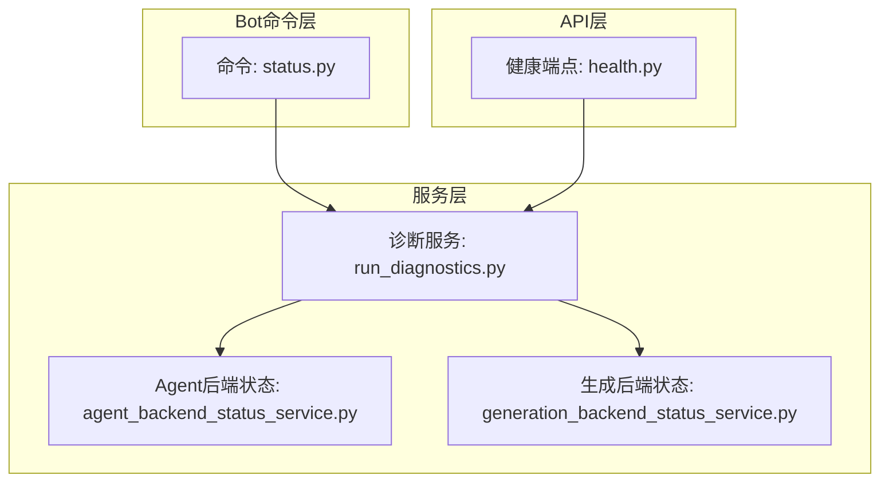
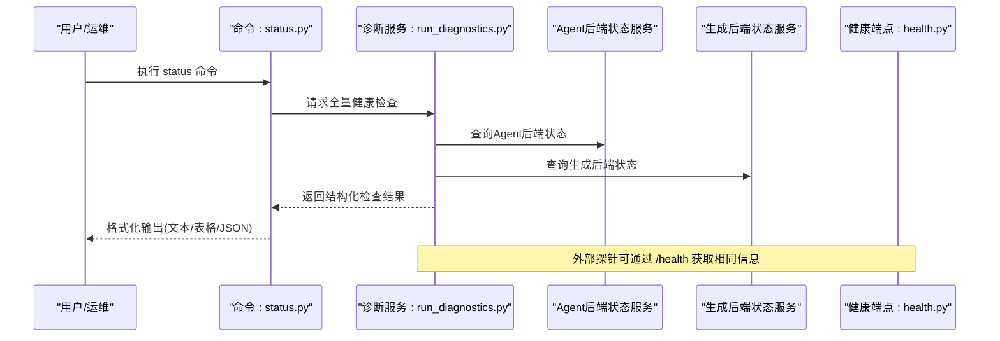
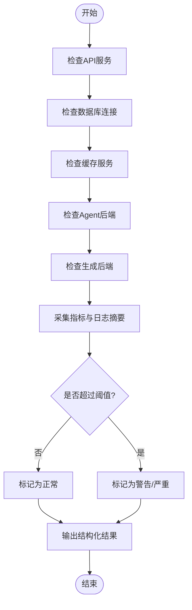
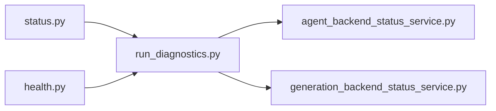

# 状态检查命令(status)

<cite>
**本文引用的文件**   
- [status.py](file://bot/commands/status.py)
- [run_diagnostics.py](file://src/services/run_diagnostics.py)
- [health.py](file://api/v1/endpoints/health.py)
- [agent_backend_status_service.py](file://src/services/agent_backend_status_service.py)
- [generation_backend_status_service.py](file://src/services/generation_backend_status_service.py)
- [test_bot_status_command.py](file://tests/test_bot_status_command.py)
- [test_api_health.py](file://tests/test_api_health.py)
</cite>

## 目录
1. [简介](#简介)
2. [项目结构](#项目结构)
3. [核心组件](#核心组件)
4. [架构总览](#架构总览)
5. [详细组件分析](#详细组件分析)
6. [依赖关系分析](#依赖关系分析)
7. [性能考量](#性能考量)
8. [故障排查指南](#故障排查指南)
9. [结论](#结论)
10. [附录](#附录)

## 简介
本文件围绕 Daily Stock Analysis 项目的“状态检查命令(status)”进行系统化说明，覆盖系统监控与健康检查能力。重点包括：
- 可检查的系统状态：API服务、数据库连接、缓存服务、Agent后端、生成后端等
- 状态检测的实现原理与关键指标
- 状态信息的展示格式与告警机制
- 运维实用示例与诊断方法
- 异常状态的识别与处理建议
- 系统性能监控与优化指导

## 项目结构
与 status 命令相关的代码主要分布在以下位置：
- bot/commands/status.py：命令行入口与输出格式化
- src/services/run_diagnostics.py：诊断逻辑聚合（健康检查、指标采集）
- api/v1/endpoints/health.py：HTTP健康端点（供外部探针或集成调用）
- src/services/agent_backend_status_service.py：Agent后端状态服务
- src/services/generation_backend_status_service.py：生成后端状态服务
- tests/test_bot_status_command.py、tests/test_api_health.py：相关测试用例

**图表来源** 
- [status.py](file://bot/commands/status.py)
- [run_diagnostics.py](file://src/services/run_diagnostics.py)
- [health.py](file://api/v1/endpoints/health.py)
- [agent_backend_status_service.py](file://src/services/agent_backend_status_service.py)
- [generation_backend_status_service.py](file://src/services/generation_backend_status_service.py)

**章节来源**
- [status.py](file://bot/commands/status.py)
- [run_diagnostics.py](file://src/services/run_diagnostics.py)
- [health.py](file://api/v1/endpoints/health.py)
- [agent_backend_status_service.py](file://src/services/agent_backend_status_service.py)
- [generation_backend_status_service.py](file://src/services/generation_backend_status_service.py)

## 核心组件
- 命令入口（status.py）
  - 负责解析用户输入、触发诊断流程、汇总并格式化输出
  - 支持对多类子系统执行健康探测，如API、数据库、缓存、Agent/生成后端
- 诊断服务（run_diagnostics.py）
  - 统一编排各项健康检查项，收集结果与指标
  - 提供结构化数据用于前端或CLI展示
- 健康端点（health.py）
  - 对外暴露HTTP健康检查接口，便于容器编排、负载均衡器、监控系统探测
- Agent后端状态服务（agent_backend_status_service.py）
  - 探测Agent后端可用性、延迟、错误率等
- 生成后端状态服务（generation_backend_status_service.py）
  - 探测LLM生成后端可用性、配额、限流、错误码等

**章节来源**
- [status.py](file://bot/commands/status.py)
- [run_diagnostics.py](file://src/services/run_diagnostics.py)
- [health.py](file://api/v1/endpoints/health.py)
- [agent_backend_status_service.py](file://src/services/agent_backend_status_service.py)
- [generation_backend_status_service.py](file://src/services/generation_backend_status_service.py)

## 架构总览
下图展示了从命令到各子系统的健康检查调用链路与数据流向。

**图表来源** 
- [status.py](file://bot/commands/status.py)
- [run_diagnostics.py](file://src/services/run_diagnostics.py)
- [agent_backend_status_service.py](file://src/services/agent_backend_status_service.py)
- [generation_backend_status_service.py](file://src/services/generation_backend_status_service.py)
- [health.py](file://api/v1/endpoints/health.py)

## 详细组件分析

### 命令入口：status.py
- 功能要点
  - 接收参数（可选过滤检查项、输出格式）
  - 调用诊断服务获取状态集合
  - 将结果渲染为人类可读的文本或机器可读的JSON
- 关键行为
  - 对失败项进行高亮或标记告警级别
  - 支持快速模式（仅关键项）与完整模式（全部项）
- 展示格式
  - 文本：分块显示（API、数据库、缓存、Agent/生成后端）
  - JSON：键值对+时间戳+版本信息，便于自动化处理

**章节来源**
- [status.py](file://bot/commands/status.py)

### 诊断服务：run_diagnostics.py
- 功能要点
  - 聚合多项健康检查：API可达性、数据库连通性、缓存读写、Agent/生成后端状态
  - 采集指标：延迟、成功率、错误码分布、资源使用（CPU/内存/磁盘）
  - 输出标准化结构体，包含状态、指标、备注与建议
- 关键实现
  - 并行探测以提升响应速度
  - 超时与重试策略，避免级联失败
  - 阈值判断与告警等级划分（正常/警告/严重）

**图表来源** 
- [run_diagnostics.py](file://src/services/run_diagnostics.py)

**章节来源**
- [run_diagnostics.py](file://src/services/run_diagnostics.py)

### 健康端点：health.py
- 功能要点
  - 提供HTTP GET /health 接口
  - 返回系统整体健康状态与各子组件状态
  - 适合被Kubernetes liveness/readiness探针或Prometheus抓取
- 关键行为
  - 快速路径：仅返回总体状态
  - 详细路径：返回各组件明细与指标
- 集成方式
  - 与负载均衡器、监控平台对接
  - 支持鉴权与访问控制（按配置）

**章节来源**
- [health.py](file://api/v1/endpoints/health.py)

### Agent后端状态服务：agent_backend_status_service.py
- 功能要点
  - 探测Agent后端存活、延迟、错误率
  - 统计队列长度、任务积压、失败重试次数
- 关键指标
  - 平均/分位延迟、P95/P99
  - 错误率（4xx/5xx）、熔断状态
  - 资源使用（CPU/内存/GPU）

**章节来源**
- [agent_backend_status_service.py](file://src/services/agent_backend_status_service.py)

### 生成后端状态服务：generation_backend_status_service.py
- 功能要点
  - 探测LLM生成后端可用性、配额、限流
  - 统计请求成功率、失败原因分类
- 关键指标
  - 令牌消耗、速率限制、超时率
  - 模型路由选择与回退情况

**章节来源**
- [generation_backend_status_service.py](file://src/services/generation_backend_status_service.py)

## 依赖关系分析
- 命令层依赖诊断服务，诊断服务再依赖各后端状态服务
- 健康端点复用诊断服务逻辑，保证一致性
- 测试用例覆盖命令与端点的契约，确保稳定性

**图表来源** 
- [status.py](file://bot/commands/status.py)
- [run_diagnostics.py](file://src/services/run_diagnostics.py)
- [agent_backend_status_service.py](file://src/services/agent_backend_status_service.py)
- [generation_backend_status_service.py](file://src/services/generation_backend_status_service.py)
- [health.py](file://api/v1/endpoints/health.py)

**章节来源**
- [status.py](file://bot/commands/status.py)
- [run_diagnostics.py](file://src/services/run_diagnostics.py)
- [health.py](file://api/v1/endpoints/health.py)
- [agent_backend_status_service.py](file://src/services/agent_backend_status_service.py)
- [generation_backend_status_service.py](file://src/services/generation_backend_status_service.py)

## 性能考量
- 并发与超时
  - 健康检查应并行执行，设置合理超时，避免阻塞主流程
- 采样与节流
  - 高频监控场景下采用采样与节流，降低负载
- 指标粒度
  - 区分关键路径与非关键路径指标，优先保障核心链路
- 缓存与预热
  - 对频繁读取的配置与元数据进行缓存，减少冷启动开销
- 资源隔离
  - 健康检查与业务逻辑隔离，防止相互影响

[本节为通用指导，不直接分析具体文件]

## 故障排查指南
- 常见问题定位
  - API不可达：检查网络、防火墙、反向代理、证书
  - 数据库连接失败：核对连接串、权限、端口、SSL
  - 缓存读写异常：检查缓存服务地址、认证、容量
  - Agent/生成后端异常：查看限流、配额、模型路由、错误码
- 诊断步骤
  - 先通过 /health 快速确认整体状态
  - 使用 status 命令逐项检查，关注失败项与告警级别
  - 结合日志与指标定位根因（延迟突增、错误率上升、资源耗尽）
- 恢复建议
  - 重启异常服务、扩容、切换备用源、调整阈值
  - 启用降级与熔断策略，保护核心链路

**章节来源**
- [test_bot_status_command.py](file://tests/test_bot_status_command.py)
- [test_api_health.py](file://tests/test_api_health.py)

## 结论
status 命令提供了统一的系统健康检查入口，结合诊断服务与后端状态服务，能够全面覆盖API、数据库、缓存、Agent/生成后端等关键组件。通过标准化的输出与告警机制，运维人员可以快速定位问题并采取恢复措施。配合 /health 端点与监控系统，可实现持续的健康观测与自动化治理。

[本节为总结性内容，不直接分析具体文件]

## 附录
- 常用操作示例
  - 执行完整健康检查：运行 status 命令（默认模式）
  - 快速模式：仅检查关键项（适用于日常巡检）
  - 导出JSON：用于自动化脚本与监控平台集成
- 告警阈值建议
  - 延迟：P95 < 500ms（根据业务调整）
  - 错误率：< 1%
  - 资源使用：CPU < 80%，内存 < 85%
- 集成建议
  - 与Prometheus/Grafana集成，建立仪表盘
  - 与CI/CD流水线集成，发布前健康检查门禁

[本节为补充信息，不直接分析具体文件]