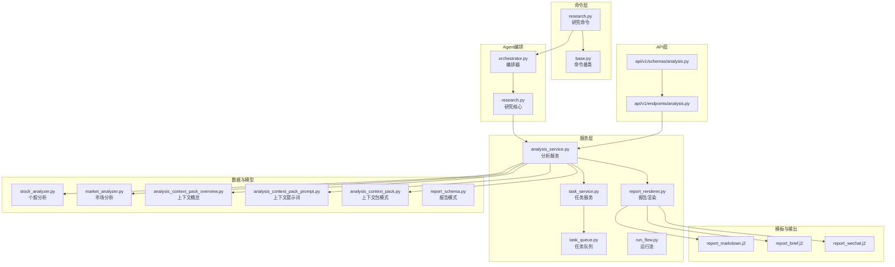
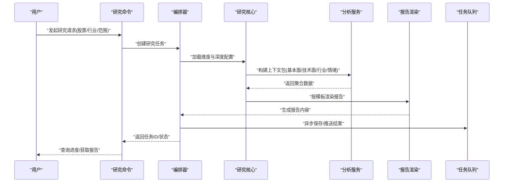
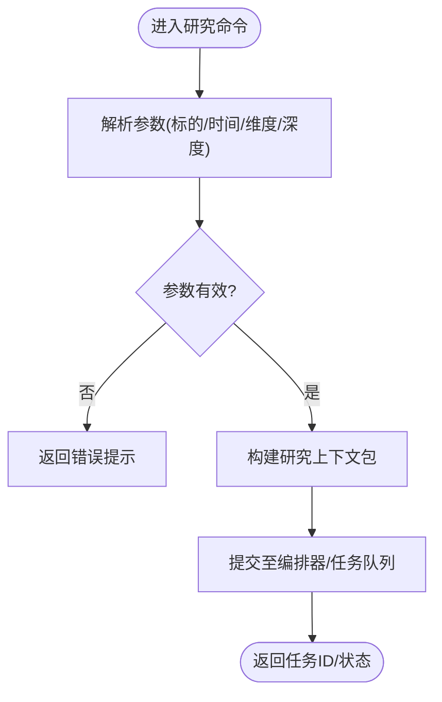
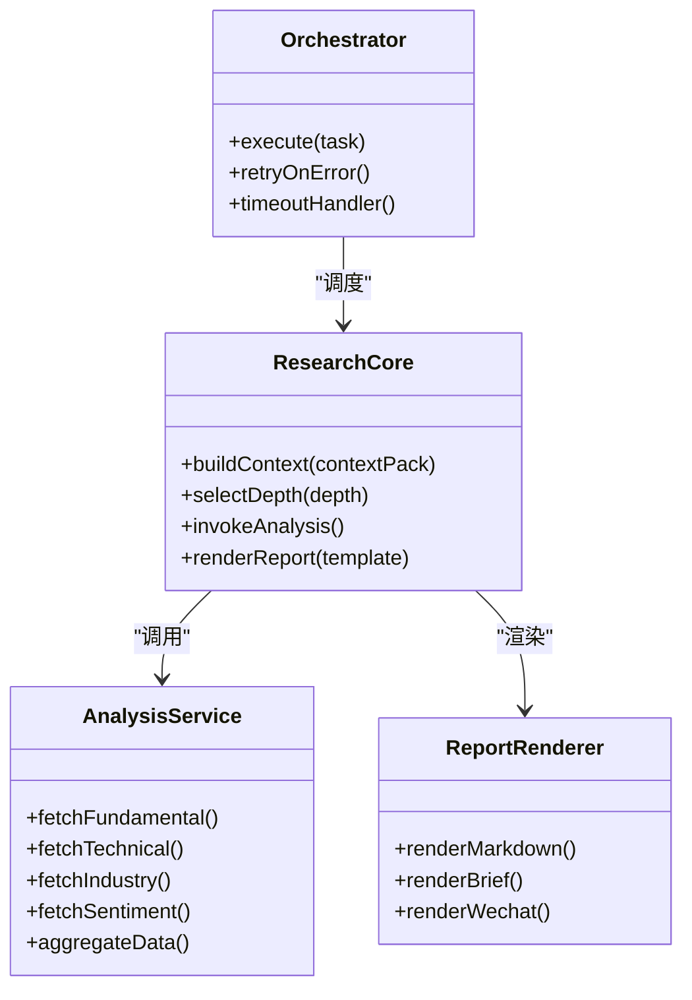
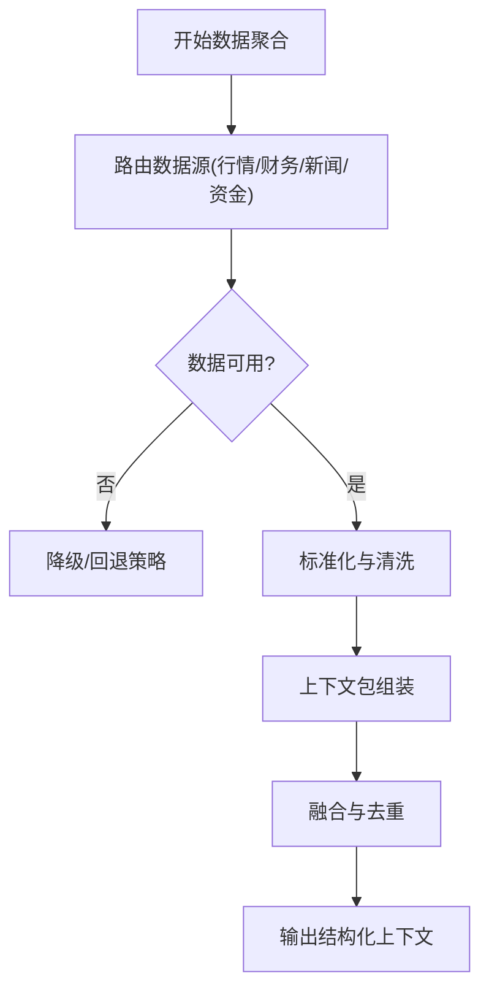
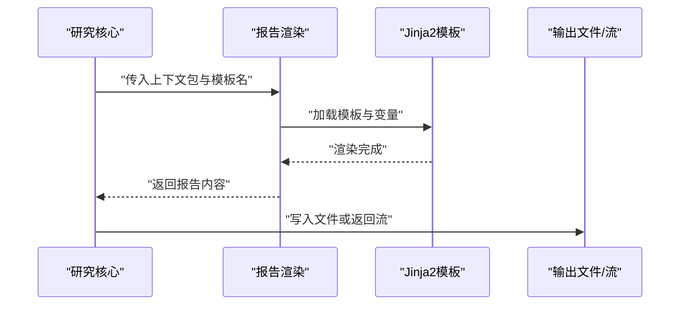
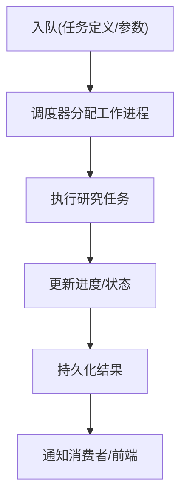
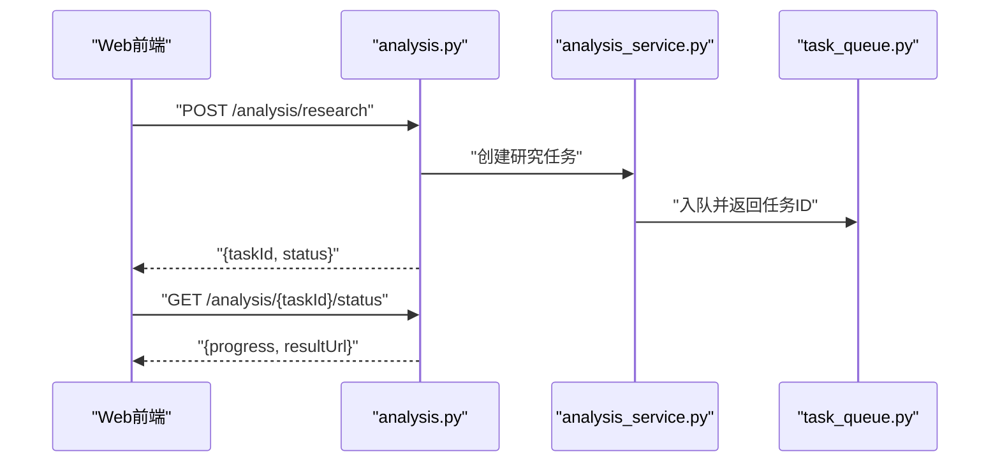
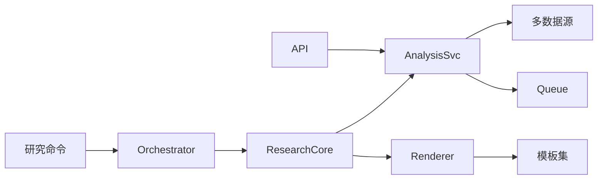

# 研究命令(research)

<cite>
**本文引用的文件**   
- [research.py](file://bot/commands/research.py)
- [base.py](file://bot/commands/base.py)
- [orchestrator.py](file://src/agent/orchestrator.py)
- [research.py](file://src/agent/research.py)
- [analysis_service.py](file://src/services/analysis_service.py)
- [report_renderer.py](file://src/services/report_renderer.py)
- [templates/report_markdown.j2](file://templates/report_markdown.j2)
- [templates/report_brief.j2](file://templates/report_brief.j2)
- [templates/report_wechat.j2](file://templates/report_wechat.j2)
- [stock_analyzer.py](file://src/stock_analyzer.py)
- [market_analyzer.py](file://src/market_analyzer.py)
- [analysis_context_pack_overview.py](file://src/analysis_context_pack_overview.py)
- [analysis_context_pack_prompt.py](file://src/analysis_context_pack_prompt.py)
- [analysis_context_pack.py](file://src/schemas/analysis_context_pack.py)
- [report_schema.py](file://src/schemas/report_schema.py)
- [task_service.py](file://src/services/task_service.py)
- [task_queue.py](file://src/services/task_queue.py)
- [run_flow.py](file://src/services/run_flow.py)
- [api/v1/endpoints/analysis.py](file://api/v1/endpoints/analysis.py)
- [api/v1/schemas/analysis.py](file://api/v1/schemas/analysis.py)
- [main.py](file://main.py)
- [server.py](file://server.py)
</cite>

## 目录
1. [简介](#简介)
2. [项目结构](#项目结构)
3. [核心组件](#核心组件)
4. [架构总览](#架构总览)
5. [详细组件分析](#详细组件分析)
6. [依赖关系分析](#依赖关系分析)
7. [性能考量](#性能考量)
8. [故障排查指南](#故障排查指南)
9. [结论](#结论)
10. [附录](#附录)

## 简介
本文件面向Daily Stock Analysis项目的“研究命令(research)”，系统性阐述其深度研究与分析能力，包括公司基本面研究、行业与板块联动分析、研报生成与导出等。文档覆盖以下要点：
- 研究维度配置与分析深度设置
- 多源数据整合与融合机制
- 研究报告的格式与内容结构
- 典型使用示例（不同行业与公司）
- 可视化展示与导出能力
- 研究质量评估与改进建议

## 项目结构
研究命令位于机器人命令层，通过统一入口解析用户指令并调度Agent编排器执行研究流程；底层由服务层提供分析、渲染与任务队列支持，API层暴露REST接口供Web端调用。

**图表来源** 
- [research.py](file://bot/commands/research.py)
- [base.py](file://bot/commands/base.py)
- [orchestrator.py](file://src/agent/orchestrator.py)
- [research.py](file://src/agent/research.py)
- [analysis_service.py](file://src/services/analysis_service.py)
- [report_renderer.py](file://src/services/report_renderer.py)
- [templates/report_markdown.j2](file://templates/report_markdown.j2)
- [templates/report_brief.j2](file://templates/report_brief.j2)
- [templates/report_wechat.j2](file://templates/report_wechat.j2)
- [stock_analyzer.py](file://src/stock_analyzer.py)
- [market_analyzer.py](file://src/market_analyzer.py)
- [analysis_context_pack_overview.py](file://src/analysis_context_pack_overview.py)
- [analysis_context_pack_prompt.py](file://src/analysis_context_pack_prompt.py)
- [analysis_context_pack.py](file://src/schemas/analysis_context_pack.py)
- [report_schema.py](file://src/schemas/report_schema.py)
- [task_service.py](file://src/services/task_service.py)
- [task_queue.py](file://src/services/task_queue.py)
- [run_flow.py](file://src/services/run_flow.py)
- [api/v1/endpoints/analysis.py](file://api/v1/endpoints/analysis.py)
- [api/v1/schemas/analysis.py](file://api/v1/schemas/analysis.py)

**章节来源**
- [research.py](file://bot/commands/research.py)
- [base.py](file://bot/commands/base.py)
- [orchestrator.py](file://src/agent/orchestrator.py)
- [research.py](file://src/agent/research.py)
- [analysis_service.py](file://src/services/analysis_service.py)
- [report_renderer.py](file://src/services/report_renderer.py)
- [templates/report_markdown.j2](file://templates/report_markdown.j2)
- [templates/report_brief.j2](file://templates/report_brief.j2)
- [templates/report_wechat.j2](file://templates/report_wechat.j2)
- [stock_analyzer.py](file://src/stock_analyzer.py)
- [market_analyzer.py](file://src/market_analyzer.py)
- [analysis_context_pack_overview.py](file://src/analysis_context_pack_overview.py)
- [analysis_context_pack_prompt.py](file://src/analysis_context_pack_prompt.py)
- [analysis_context_pack.py](file://src/schemas/analysis_context_pack.py)
- [report_schema.py](file://src/schemas/report_schema.py)
- [task_service.py](file://src/services/task_service.py)
- [task_queue.py](file://src/services/task_queue.py)
- [run_flow.py](file://src/services/run_flow.py)
- [api/v1/endpoints/analysis.py](file://api/v1/endpoints/analysis.py)
- [api/v1/schemas/analysis.py](file://api/v1/schemas/analysis.py)

## 核心组件
- 研究命令入口：负责解析参数、校验输入、构造研究上下文，并触发编排器执行。
- Agent编排器：协调多个子任务（数据获取、指标计算、LLM推理、报告渲染），管理并发与错误恢复。
- 研究核心：封装研究维度（基本面、技术面、行业/板块、情绪与新闻）、分析深度（轻量/标准/深度）与策略选择。
- 分析服务：聚合多源数据（行情、财务、新闻、资金流向等），构建上下文包，驱动分析与渲染。
- 报告渲染：基于Jinja2模板生成Markdown/简报/微信适配等不同格式的报告。
- 任务服务与队列：将耗时研究任务异步化，支持进度查询与结果持久化。
- API层：对外暴露REST接口，便于Web前端或第三方系统调用。

**章节来源**
- [research.py](file://bot/commands/research.py)
- [base.py](file://bot/commands/base.py)
- [orchestrator.py](file://src/agent/orchestrator.py)
- [research.py](file://src/agent/research.py)
- [analysis_service.py](file://src/services/analysis_service.py)
- [report_renderer.py](file://src/services/report_renderer.py)
- [task_service.py](file://src/services/task_service.py)
- [task_queue.py](file://src/services/task_queue.py)
- [api/v1/endpoints/analysis.py](file://api/v1/endpoints/analysis.py)
- [api/v1/schemas/analysis.py](file://api/v1/schemas/analysis.py)

## 架构总览
研究命令端到端流程如下：用户通过Bot或API发起研究请求，命令层解析并校验后交由编排器；编排器根据研究维度与深度配置，调度数据获取、指标计算、LLM推理与报告渲染；最终输出结构化报告并可异步返回。

**图表来源** 
- [research.py](file://bot/commands/research.py)
- [orchestrator.py](file://src/agent/orchestrator.py)
- [research.py](file://src/agent/research.py)
- [analysis_service.py](file://src/services/analysis_service.py)
- [report_renderer.py](file://src/services/report_renderer.py)
- [task_service.py](file://src/services/task_service.py)
- [task_queue.py](file://src/services/task_queue.py)

## 详细组件分析

### 研究命令与参数解析
- 功能要点
  - 接收股票代码/名称、时间窗口、研究维度（基本面、技术面、行业/板块、情绪/新闻）、分析深度（轻量/标准/深度）。
  - 校验输入合法性，缺失关键信息时给出明确提示。
  - 将参数转换为研究上下文包，提交至编排器。
- 关键路径
  - 命令入口与基类继承关系
  - 参数到上下文的映射规则
  - 错误处理与回退逻辑

**图表来源** 
- [research.py](file://bot/commands/research.py)
- [base.py](file://bot/commands/base.py)
- [analysis_context_pack.py](file://src/schemas/analysis_context_pack.py)

**章节来源**
- [research.py](file://bot/commands/research.py)
- [base.py](file://bot/commands/base.py)
- [analysis_context_pack.py](file://src/schemas/analysis_context_pack.py)

### 编排器与研究核心
- 功能要点
  - 编排器负责任务生命周期管理、并发控制、失败重试与超时处理。
  - 研究核心依据上下文包决定数据拉取范围、指标计算项、LLM推理策略与报告模板。
- 关键路径
  - 任务调度与资源隔离
  - 多维度数据聚合与融合
  - 报告模板选择与变量注入

**图表来源** 
- [orchestrator.py](file://src/agent/orchestrator.py)
- [research.py](file://src/agent/research.py)
- [analysis_service.py](file://src/services/analysis_service.py)
- [report_renderer.py](file://src/services/report_renderer.py)

**章节来源**
- [orchestrator.py](file://src/agent/orchestrator.py)
- [research.py](file://src/agent/research.py)
- [analysis_service.py](file://src/services/analysis_service.py)
- [report_renderer.py](file://src/services/report_renderer.py)

### 分析服务与数据融合
- 功能要点
  - 从多数据源拉取基本面（财报、估值）、技术面（量价、指标）、行业/板块（关联度、热点）、情绪与新闻（舆情、事件）。
  - 构建统一的上下文包，进行数据清洗、对齐与融合。
  - 为LLM推理提供结构化输入，确保可解释性与一致性。
- 关键路径
  - 数据源路由与容错
  - 上下文包结构与字段约束
  - 融合策略与冲突处理

**图表来源** 
- [analysis_service.py](file://src/services/analysis_service.py)
- [analysis_context_pack_overview.py](file://src/analysis_context_pack_overview.py)
- [analysis_context_pack_prompt.py](file://src/analysis_context_pack_prompt.py)
- [analysis_context_pack.py](file://src/schemas/analysis_context_pack.py)

**章节来源**
- [analysis_service.py](file://src/services/analysis_service.py)
- [analysis_context_pack_overview.py](file://src/analysis_context_pack_overview.py)
- [analysis_context_pack_prompt.py](file://src/analysis_context_pack_prompt.py)
- [analysis_context_pack.py](file://src/schemas/analysis_context_pack.py)

### 报告渲染与模板
- 功能要点
  - 支持Markdown、简报、微信适配等多种模板。
  - 模板变量来自上下文包与LLM推理结果，保证内容一致性与可读性。
  - 支持语言切换与本地化。
- 关键路径
  - 模板选择与变量注入
  - 渲染管线与缓存策略
  - 输出格式校验与导出

**图表来源** 
- [report_renderer.py](file://src/services/report_renderer.py)
- [templates/report_markdown.j2](file://templates/report_markdown.j2)
- [templates/report_brief.j2](file://templates/report_brief.j2)
- [templates/report_wechat.j2](file://templates/report_wechat.j2)

**章节来源**
- [report_renderer.py](file://src/services/report_renderer.py)
- [templates/report_markdown.j2](file://templates/report_markdown.j2)
- [templates/report_brief.j2](file://templates/report_brief.j2)
- [templates/report_wechat.j2](file://templates/report_wechat.j2)

### 任务服务与队列
- 功能要点
  - 将研究任务入队，支持优先级、重试、超时与取消。
  - 提供进度查询与结果持久化，便于Web端实时展示。
- 关键路径
  - 任务序列化与反序列化
  - 队列消费与并发限制
  - 状态机与事件通知

**图表来源** 
- [task_service.py](file://src/services/task_service.py)
- [task_queue.py](file://src/services/task_queue.py)
- [run_flow.py](file://src/services/run_flow.py)

**章节来源**
- [task_service.py](file://src/services/task_service.py)
- [task_queue.py](file://src/services/task_queue.py)
- [run_flow.py](file://src/services/run_flow.py)

### API层与Web集成
- 功能要点
  - 暴露REST接口用于创建研究任务、查询进度与下载报告。
  - 请求/响应遵循Pydantic Schema校验，保障契约稳定。
- 关键路径
  - 路由与中间件
  - 参数校验与错误码
  - 文件下载与流式返回

**图表来源** 
- [api/v1/endpoints/analysis.py](file://api/v1/endpoints/analysis.py)
- [api/v1/schemas/analysis.py](file://api/v1/schemas/analysis.py)
- [analysis_service.py](file://src/services/analysis_service.py)
- [task_queue.py](file://src/services/task_queue.py)

**章节来源**
- [api/v1/endpoints/analysis.py](file://api/v1/endpoints/analysis.py)
- [api/v1/schemas/analysis.py](file://api/v1/schemas/analysis.py)
- [analysis_service.py](file://src/services/analysis_service.py)
- [task_queue.py](file://src/services/task_queue.py)

## 依赖关系分析
- 组件耦合
  - 研究命令与编排器松耦合，通过上下文包传递参数。
  - 分析服务对数据源抽象良好，具备多实现与回退能力。
  - 报告渲染与模板解耦，便于扩展新格式。
- 外部依赖
  - LLM后端（通过适配器接入）
  - 数据源（行情、财务、新闻、资金流向等）
  - 消息队列（任务持久化与并发）
- 潜在循环依赖
  - 通过分层与接口隔离避免循环引用。

**图表来源** 
- [research.py](file://bot/commands/research.py)
- [orchestrator.py](file://src/agent/orchestrator.py)
- [research.py](file://src/agent/research.py)
- [analysis_service.py](file://src/services/analysis_service.py)
- [report_renderer.py](file://src/services/report_renderer.py)
- [task_queue.py](file://src/services/task_queue.py)
- [api/v1/endpoints/analysis.py](file://api/v1/endpoints/analysis.py)

**章节来源**
- [research.py](file://bot/commands/research.py)
- [orchestrator.py](file://src/agent/orchestrator.py)
- [research.py](file://src/agent/research.py)
- [analysis_service.py](file://src/services/analysis_service.py)
- [report_renderer.py](file://src/services/report_renderer.py)
- [task_queue.py](file://src/services/task_queue.py)
- [api/v1/endpoints/analysis.py](file://api/v1/endpoints/analysis.py)

## 性能考量
- 并发与限流
  - 任务队列支持并发消费，需合理设置工作进程数以避免资源争用。
  - 数据源调用应加入速率限制与重试退避。
- 缓存策略
  - 对高频数据（指数、热门板块、基础财务快照）启用缓存，降低重复请求。
- 渲染优化
  - 模板渲染结果可缓存，减少重复计算。
- 内存与I/O
  - 大对象（历史K线、财报全文）采用分页与流式处理，避免内存峰值过高。

[本节为通用指导，不直接分析具体文件]

## 故障排查指南
- 常见问题
  - 参数校验失败：检查股票代码/时间窗口/维度是否完整。
  - 数据源不可用：确认网络连通与凭证配置，查看回退策略是否生效。
  - 任务超时：调整队列超时与重试次数，检查LLM后端可用性。
  - 渲染异常：核对模板变量与上下文包字段是否匹配。
- 定位方法
  - 查看任务状态与日志，关注错误堆栈与降级路径。
  - 使用API查询任务进度与结果URL，验证输出完整性。
  - 对比上下文包结构，确保字段类型与约束正确。

**章节来源**
- [task_service.py](file://src/services/task_service.py)
- [task_queue.py](file://src/services/task_queue.py)
- [analysis_service.py](file://src/services/analysis_service.py)
- [report_renderer.py](file://src/services/report_renderer.py)

## 结论
研究命令以模块化与可扩展为核心设计，通过上下文包统一数据表达，结合多源融合与模板化渲染，形成完整的“数据→分析→报告”闭环。建议在以下方面持续优化：
- 增强数据源多样性与稳定性（增加更多财务与新闻源）
- 完善质量评估指标（数据新鲜度、覆盖率、一致性）
- 提升渲染灵活性与多语言支持
- 强化任务监控与可观测性（指标、追踪、告警）

[本节为总结性内容，不直接分析具体文件]

## 附录
- 使用示例（概念性说明）
  - 公司基本面研究：指定标的与时间窗口，选择“基本面+技术面”维度，深度设为“标准”，生成包含财务摘要、估值区间与技术形态的综合报告。
  - 行业分析：输入行业关键词或板块代码，开启“行业/板块+情绪/新闻”维度，深度设为“深度”，输出行业景气度、资金流向与热点事件解读。
  - 研报生成：在API中提交研究任务，轮询状态后下载Markdown或简报格式报告，便于归档与分享。
- 可视化与导出
  - 报告支持Markdown、简报与微信适配模板，可在Web端预览与下载。
  - 可通过API获取结果URL或直接流式返回，便于集成到内部系统。

[本节为概念性说明，不直接分析具体文件]