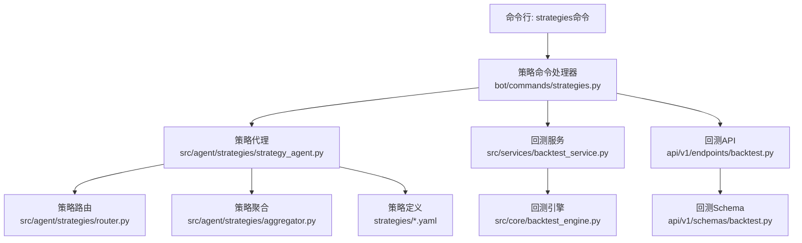
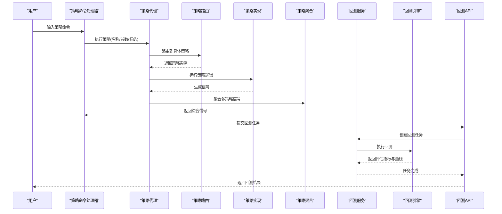
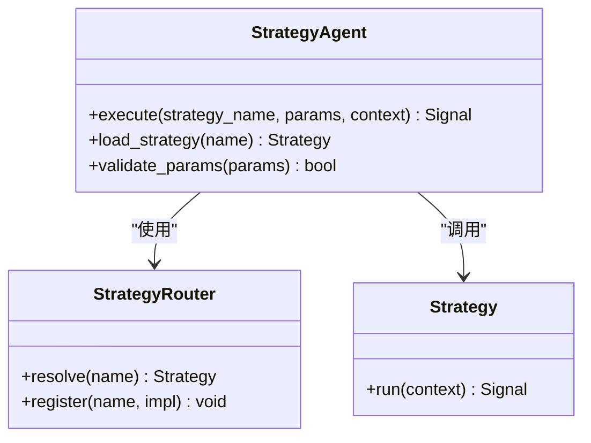
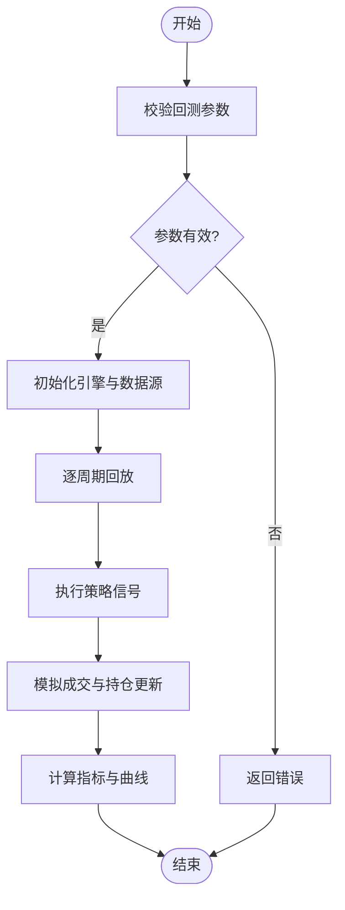
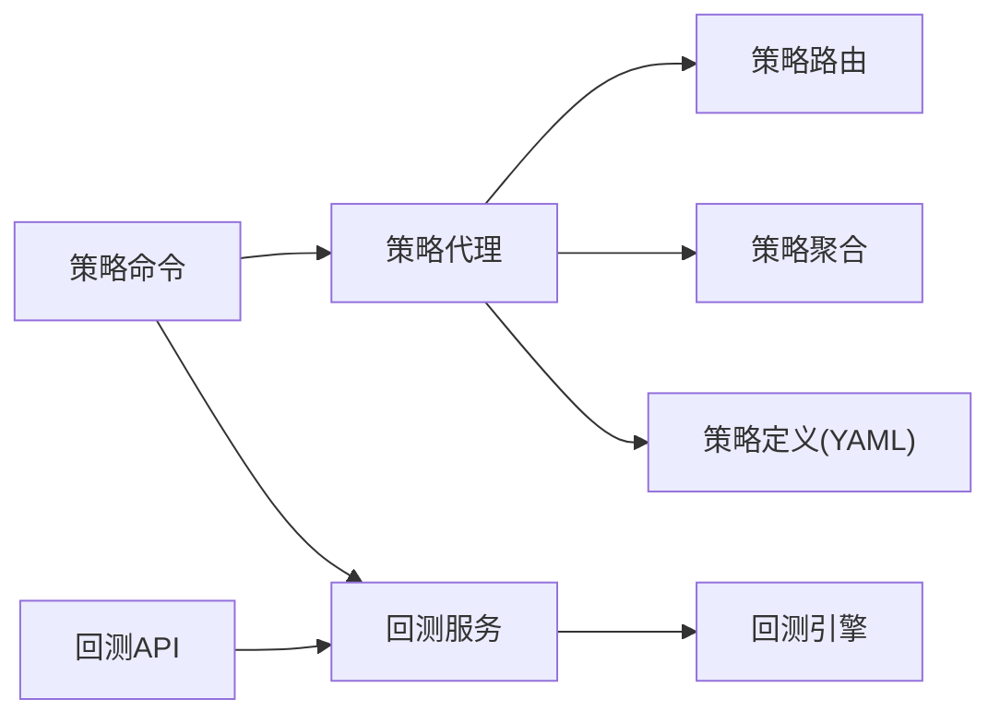

# 策略命令(strategies)

<cite>
**本文引用的文件**   
- [bot/commands/strategies.py](file://bot/commands/strategies.py)
- [src/agent/strategies/strategy_agent.py](file://src/agent/strategies/strategy_agent.py)
- [src/agent/strategies/aggregator.py](file://src/agent/strategies/aggregator.py)
- [src/agent/strategies/router.py](file://src/agent/strategies/router.py)
- [src/core/backtest_engine.py](file://src/core/backtest_engine.py)
- [src/services/backtest_service.py](file://src/services/backtest_service.py)
- [api/v1/endpoints/backtest.py](file://api/v1/endpoints/backtest.py)
- [api/v1/schemas/backtest.py](file://api/v1/schemas/backtest.py)
- [strategies/bottom_volume.yaml](file://strategies/bottom_volume.yaml)
- [strategies/ma_golden_cross.yaml](file://strategies/ma_golden_cross.yaml)
- [strategies/volume_breakout.yaml](file://strategies/volume_breakout.yaml)
- [strategies/README.md](file://strategies/README.md)
</cite>

## 目录
1. [简介](#简介)
2. [项目结构](#项目结构)
3. [核心组件](#核心组件)
4. [架构总览](#架构总览)
5. [详细组件分析](#详细组件分析)
6. [依赖关系分析](#依赖关系分析)
7. [性能考量](#性能考量)
8. [故障排查指南](#故障排查指南)
9. [结论](#结论)
10. [附录](#附录)

## 简介
本文件面向Daily Stock Analysis中的“策略命令(strategies)”子系统，系统性阐述策略管理与回测能力。内容涵盖：
- 策略库浏览与选择
- 策略执行与信号生成机制
- 回测引擎与评估指标
- 配置参数与执行选项
- 常见策略类型与适用场景
- 使用示例（趋势跟踪、均值回归等）
- 自定义策略开发指导

该子系统通过命令行入口暴露策略能力，并在后端由策略代理、聚合器与路由器协同工作，结合回测服务与API层提供完整的策略生命周期管理能力。

## 项目结构
围绕“策略命令”的关键代码分布在以下模块：
- 命令入口：bot/commands/strategies.py
- 策略代理与编排：src/agent/strategies/*
- 回测引擎与服务：src/core/backtest_engine.py、src/services/backtest_service.py
- API接口与数据模型：api/v1/endpoints/backtest.py、api/v1/schemas/backtest.py
- 策略定义与说明：strategies/*.yaml、strategies/README.md

**图表来源**
- [bot/commands/strategies.py](file://bot/commands/strategies.py)
- [src/agent/strategies/strategy_agent.py](file://src/agent/strategies/strategy_agent.py)
- [src/agent/strategies/router.py](file://src/agent/strategies/router.py)
- [src/agent/strategies/aggregator.py](file://src/agent/strategies/aggregator.py)
- [src/services/backtest_service.py](file://src/services/backtest_service.py)
- [src/core/backtest_engine.py](file://src/core/backtest_engine.py)
- [api/v1/endpoints/backtest.py](file://api/v1/endpoints/backtest.py)
- [api/v1/schemas/backtest.py](file://api/v1/schemas/backtest.py)
- [strategies/bottom_volume.yaml](file://strategies/bottom_volume.yaml)
- [strategies/ma_golden_cross.yaml](file://strategies/ma_golden_cross.yaml)
- [strategies/volume_breakout.yaml](file://strategies/volume_breakout.yaml)

**章节来源**
- [bot/commands/strategies.py](file://bot/commands/strategies.py)
- [src/agent/strategies/strategy_agent.py](file://src/agent/strategies/strategy_agent.py)
- [src/agent/strategies/aggregator.py](file://src/agent/strategies/aggregator.py)
- [src/agent/strategies/router.py](file://src/agent/strategies/router.py)
- [src/core/backtest_engine.py](file://src/core/backtest_engine.py)
- [src/services/backtest_service.py](file://src/services/backtest_service.py)
- [api/v1/endpoints/backtest.py](file://api/v1/endpoints/backtest.py)
- [api/v1/schemas/backtest.py](file://api/v1/schemas/backtest.py)
- [strategies/README.md](file://strategies/README.md)

## 核心组件
- 策略命令处理器：负责解析用户指令、调用策略代理与回测服务，返回结果或错误信息。
- 策略代理：加载并执行具体策略，封装信号生成逻辑，支持多策略组合与上下文传递。
- 策略路由：根据策略名称、市场阶段或条件将请求分发到对应策略实现。
- 策略聚合：合并多个策略的输出信号，进行权重或投票决策。
- 回测服务：对外暴露回测任务创建、查询与结果获取能力。
- 回测引擎：基于历史数据执行策略回放，计算收益曲线与评估指标。
- API层：提供REST接口用于前端或外部系统触发回测与查询结果。
- 策略定义：以YAML描述策略参数、指标阈值与规则，便于非代码化配置。

**章节来源**
- [bot/commands/strategies.py](file://bot/commands/strategies.py)
- [src/agent/strategies/strategy_agent.py](file://src/agent/strategies/strategy_agent.py)
- [src/agent/strategies/router.py](file://src/agent/strategies/router.py)
- [src/agent/strategies/aggregator.py](file://src/agent/strategies/aggregator.py)
- [src/services/backtest_service.py](file://src/services/backtest_service.py)
- [src/core/backtest_engine.py](file://src/core/backtest_engine.py)
- [api/v1/endpoints/backtest.py](file://api/v1/endpoints/backtest.py)
- [api/v1/schemas/backtest.py](file://api/v1/schemas/backtest.py)
- [strategies/README.md](file://strategies/README.md)

## 架构总览
策略命令的端到端流程如下：
- 用户在CLI输入策略相关命令
- 命令处理器校验参数并调用策略代理或回测服务
- 策略代理通过路由选择具体策略，执行信号生成
- 多策略时由聚合器合并输出
- 回测服务接收任务，调度回测引擎执行
- API层提供查询与结果返回

**图表来源**
- [bot/commands/strategies.py](file://bot/commands/strategies.py)
- [src/agent/strategies/strategy_agent.py](file://src/agent/strategies/strategy_agent.py)
- [src/agent/strategies/router.py](file://src/agent/strategies/router.py)
- [src/agent/strategies/aggregator.py](file://src/agent/strategies/aggregator.py)
- [src/services/backtest_service.py](file://src/services/backtest_service.py)
- [src/core/backtest_engine.py](file://src/core/backtest_engine.py)
- [api/v1/endpoints/backtest.py](file://api/v1/endpoints/backtest.py)

## 详细组件分析

### 策略命令处理器
- 职责：解析命令参数（策略名、标的、时间窗口、参数）、调用策略代理或回测服务、格式化输出。
- 关键行为：
  - 策略列表与详情展示
  - 单策略执行与信号输出
  - 多策略组合与聚合结果
  - 回测任务提交与状态查询

**章节来源**
- [bot/commands/strategies.py](file://bot/commands/strategies.py)

### 策略代理与路由
- 策略代理：统一封装策略加载、执行、上下文管理；支持参数校验与日志记录。
- 策略路由：依据策略标识或条件映射到具体实现；可扩展新策略注册表。
- 典型流程：
  - 解析策略名与参数
  - 查找策略实现
  - 注入市场与标的上下文
  - 执行策略并收集信号

**图表来源**
- [src/agent/strategies/strategy_agent.py](file://src/agent/strategies/strategy_agent.py)
- [src/agent/strategies/router.py](file://src/agent/strategies/router.py)

**章节来源**
- [src/agent/strategies/strategy_agent.py](file://src/agent/strategies/strategy_agent.py)
- [src/agent/strategies/router.py](file://src/agent/strategies/router.py)

### 策略聚合器
- 职责：合并多个策略的信号，支持加权投票、优先级或冲突消解。
- 输入：各策略输出的原始信号与置信度
- 输出：综合信号与解释性摘要

**章节来源**
- [src/agent/strategies/aggregator.py](file://src/agent/strategies/aggregator.py)

### 回测服务与引擎
- 回测服务：提供任务创建、状态查询、结果下载；管理并发与队列。
- 回测引擎：读取历史数据，按日/分钟级回放策略，计算净值、回撤、夏普比率等指标。
- 关键流程：
  - 校验回测参数（标的、起止时间、资金、手续费）
  - 初始化引擎与数据源
  - 逐周期执行策略并记录交易
  - 汇总评估指标与曲线数据

**图表来源**
- [src/services/backtest_service.py](file://src/services/backtest_service.py)
- [src/core/backtest_engine.py](file://src/core/backtest_engine.py)

**章节来源**
- [src/services/backtest_service.py](file://src/services/backtest_service.py)
- [src/core/backtest_engine.py](file://src/core/backtest_engine.py)

### API层与数据模型
- 回测API：提供REST接口用于提交回测任务、查询状态与获取结果。
- 数据模型：定义回测请求与响应结构，包括标的、时间范围、策略参数、评估指标等。

**章节来源**
- [api/v1/endpoints/backtest.py](file://api/v1/endpoints/backtest.py)
- [api/v1/schemas/backtest.py](file://api/v1/schemas/backtest.py)

### 策略定义与示例
- YAML策略定义：声明策略名称、参数、指标阈值、入场/出场规则等。
- 内置策略示例：
  - 底部放量突破（bottom_volume.yaml）
  - 均线金叉（ma_golden_cross.yaml）
  - 放量突破（volume_breakout.yaml）
- 策略说明文档：strategies/README.md包含使用说明与最佳实践。

**章节来源**
- [strategies/bottom_volume.yaml](file://strategies/bottom_volume.yaml)
- [strategies/ma_golden_cross.yaml](file://strategies/ma_golden_cross.yaml)
- [strategies/volume_breakout.yaml](file://strategies/volume_breakout.yaml)
- [strategies/README.md](file://strategies/README.md)

## 依赖关系分析
- 命令层依赖策略代理与回测服务
- 策略代理依赖路由与具体策略实现
- 回测服务依赖回测引擎与数据源
- API层依赖回测服务与数据模型

**图表来源**
- [bot/commands/strategies.py](file://bot/commands/strategies.py)
- [src/agent/strategies/strategy_agent.py](file://src/agent/strategies/strategy_agent.py)
- [src/agent/strategies/router.py](file://src/agent/strategies/router.py)
- [src/agent/strategies/aggregator.py](file://src/agent/strategies/aggregator.py)
- [src/services/backtest_service.py](file://src/services/backtest_service.py)
- [src/core/backtest_engine.py](file://src/core/backtest_engine.py)
- [api/v1/endpoints/backtest.py](file://api/v1/endpoints/backtest.py)
- [strategies/bottom_volume.yaml](file://strategies/bottom_volume.yaml)

**章节来源**
- [bot/commands/strategies.py](file://bot/commands/strategies.py)
- [src/agent/strategies/strategy_agent.py](file://src/agent/strategies/strategy_agent.py)
- [src/agent/strategies/router.py](file://src/agent/strategies/router.py)
- [src/agent/strategies/aggregator.py](file://src/agent/strategies/aggregator.py)
- [src/services/backtest_service.py](file://src/services/backtest_service.py)
- [src/core/backtest_engine.py](file://src/core/backtest_engine.py)
- [api/v1/endpoints/backtest.py](file://api/v1/endpoints/backtest.py)
- [strategies/bottom_volume.yaml](file://strategies/bottom_volume.yaml)

## 性能考量
- 数据加载优化：批量拉取历史数据，缓存常用指标以减少重复计算。
- 并行回测：对多标的或多策略的回测任务进行并发处理，注意资源隔离与限流。
- 内存管理：大周期数据分块处理，避免一次性加载导致内存峰值过高。
- 指标计算：增量更新技术指标，减少全量重算开销。
- I/O瓶颈：异步I/O与连接池优化，降低网络与磁盘等待时间。

[本节为通用性能建议，不直接分析具体文件]

## 故障排查指南
- 策略未找到：检查策略名称是否正确、是否已注册到路由表。
- 参数校验失败：核对YAML参数类型与取值范围，确保必填字段完整。
- 回测任务失败：查看任务状态与错误日志，确认数据源可用性与时间范围有效性。
- 信号异常：检查市场阶段过滤与止损止盈逻辑，验证阈值设置是否合理。
- 聚合冲突：调整权重或优先级策略，增加一致性校验。

**章节来源**
- [src/agent/strategies/router.py](file://src/agent/strategies/router.py)
- [src/services/backtest_service.py](file://src/services/backtest_service.py)
- [src/core/backtest_engine.py](file://src/core/backtest_engine.py)

## 结论
“策略命令”子系统提供了从策略浏览、执行到回测评估的完整能力。通过策略代理、路由与聚合器的协作，以及回测服务与引擎的配合，用户可高效地进行策略开发与验证。建议结合内置策略示例与YAML配置快速上手，并通过API集成自动化流程。

[本节为总结性内容，不直接分析具体文件]

## 附录

### 策略配置参数与执行选项
- 基础参数：标的代码、时间窗口、初始资金、手续费、滑点
- 策略参数：指标周期、阈值、仓位控制、止损止盈
- 执行选项：回测频率（日/分钟）、复权方式、交易限制（涨跌停）

**章节来源**
- [strategies/README.md](file://strategies/README.md)
- [api/v1/schemas/backtest.py](file://api/v1/schemas/backtest.py)

### 策略类型与适用场景
- 趋势跟踪：适用于单边行情，如均线金叉、放量突破
- 均值回归：适用于震荡市，如RSI超买超卖、布林带回归
- 事件驱动：财报、公告、资金流向等事件触发

**章节来源**
- [strategies/bottom_volume.yaml](file://strategies/bottom_volume.yaml)
- [strategies/ma_golden_cross.yaml](file://strategies/ma_golden_cross.yaml)
- [strategies/volume_breakout.yaml](file://strategies/volume_breakout.yaml)

### 使用示例
- 趋势跟踪示例：使用均线金叉策略，设置短期与长期均线周期，观察买入信号与持有期收益
- 均值回归示例：使用RSI与布林带组合，设定超买超卖阈值，捕捉价格回归机会
- 多策略组合：同时运行趋势与均值回归策略，通过聚合器加权输出综合信号

**章节来源**
- [strategies/README.md](file://strategies/README.md)

### 自定义策略开发指导
- 步骤：
  1. 在strategies目录下新增YAML配置文件，定义策略名称、参数与规则
  2. 在策略路由中注册新策略实现
  3. 编写策略逻辑，输出标准化信号格式
  4. 通过命令或API执行与回测验证
- 注意事项：
  - 保持信号格式一致，便于聚合器处理
  - 参数校验严格，避免运行时异常
  - 日志完善，便于问题定位

**章节来源**
- [src/agent/strategies/router.py](file://src/agent/strategies/router.py)
- [strategies/README.md](file://strategies/README.md)