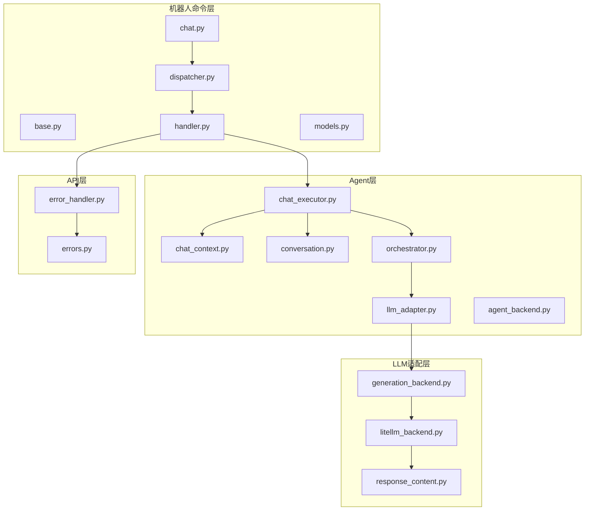
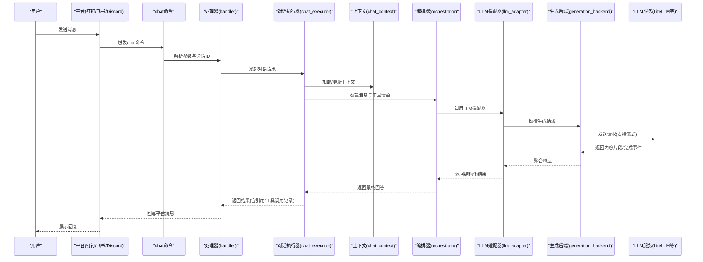
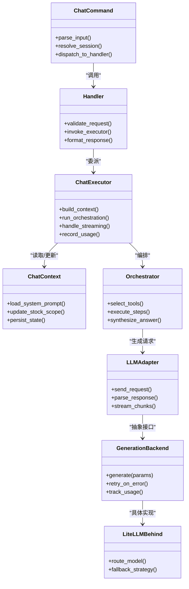

# 聊天命令(chat)

<cite>
**本文引用的文件**   
- [chat.py](file://bot/commands/chat.py)
- [dispatcher.py](file://bot/dispatcher.py)
- [handler.py](file://bot/handler.py)
- [base.py](file://bot/commands/base.py)
- [models.py](file://bot/models.py)
- [agent_backend.py](file://src/agent/agent_backend.py)
- [conversation.py](file://src/agent/conversation.py)
- [chat_context.py](file://src/agent/chat_context.py)
- [chat_executor.py](file://src/agent/chat_executor.py)
- [orchestrator.py](file://src/agent/orchestrator.py)
- [llm_adapter.py](file://src/agent/llm_adapter.py)
- [litellm_backend.py](file://src/llm/litellm_backend.py)
- [generation_backend.py](file://src/llm/generation_backend.py)
- [response_content.py](file://src/llm/response_content.py)
- [errors.py](file://api/v1/errors.py)
- [error_handler.py](file://api/middlewares/error_handler.py)
- [test_agent_chat_api.py](file://tests/test_agent_chat_api.py)
- [test_chat_context.py](file://tests/test_chat_context.py)
</cite>

## 目录
1. [简介](#简介)
2. [项目结构](#项目结构)
3. [核心组件](#核心组件)
4. [架构总览](#架构总览)
5. [详细组件分析](#详细组件分析)
6. [依赖关系分析](#依赖关系分析)
7. [性能考量](#性能考量)
8. [故障排查指南](#故障排查指南)
9. [结论](#结论)
10. [附录：对话示例与最佳实践](#附录：对话示例与最佳实践)

## 简介
本文件面向Daily Stock Analysis项目的“聊天命令(chat)”功能，系统性说明其对话交互能力、AI助手机制、上下文管理、多轮对话支持、与后端AI服务的通信协议与数据格式、以及常见应用场景与错误处理策略。读者无需深入代码即可理解如何正确使用该命令进行投资咨询与市场问答，并可在需要时定位到具体实现文件以进一步扩展或排障。

## 项目结构
聊天命令位于机器人命令层（bot/commands），由调度器统一分发；对话执行与记忆在agent层完成；LLM调用通过统一的生成后端抽象，底层可路由至LiteLLM等适配器。API层提供HTTP接口用于Web端或外部系统调用。

图表来源 
- [chat.py](file://bot/commands/chat.py)
- [dispatcher.py](file://bot/dispatcher.py)
- [handler.py](file://bot/handler.py)
- [base.py](file://bot/commands/base.py)
- [models.py](file://bot/models.py)
- [chat_executor.py](file://src/agent/chat_executor.py)
- [chat_context.py](file://src/agent/chat_context.py)
- [conversation.py](file://src/agent/conversation.py)
- [orchestrator.py](file://src/agent/orchestrator.py)
- [llm_adapter.py](file://src/agent/llm_adapter.py)
- [generation_backend.py](file://src/llm/generation_backend.py)
- [litellm_backend.py](file://src/llm/litellm_backend.py)
- [response_content.py](file://src/llm/response_content.py)
- [error_handler.py](file://api/middlewares/error_handler.py)
- [errors.py](file://api/v1/errors.py)

章节来源
- [chat.py](file://bot/commands/chat.py)
- [dispatcher.py](file://bot/dispatcher.py)
- [handler.py](file://bot/handler.py)
- [base.py](file://bot/commands/base.py)
- [models.py](file://bot/models.py)
- [chat_executor.py](file://src/agent/chat_executor.py)
- [chat_context.py](file://src/agent/chat_context.py)
- [conversation.py](file://src/agent/conversation.py)
- [orchestrator.py](file://src/agent/orchestrator.py)
- [llm_adapter.py](file://src/agent/llm_adapter.py)
- [generation_backend.py](file://src/llm/generation_backend.py)
- [litellm_backend.py](file://src/llm/litellm_backend.py)
- [response_content.py](file://src/llm/response_content.py)
- [error_handler.py](file://api/middlewares/error_handler.py)
- [errors.py](file://api/v1/errors.py)

## 核心组件
- 命令入口与解析：chat命令负责接收用户输入、参数校验、会话ID识别与上下文初始化。
- 对话执行器：编排消息构建、工具调用、流式响应、重试与超时控制。
- 上下文与记忆：维护会话历史、系统提示、股票范围、时间窗口、平台元数据等。
- Agent编排：根据问题类型选择技能/工具，协调多个子代理或策略。
- LLM适配：统一封装不同后端的生成请求与响应解析，支持流式输出与用量统计。
- API与错误处理：对外暴露REST接口，集中捕获异常并返回标准化错误。

章节来源
- [chat.py](file://bot/commands/chat.py)
- [chat_executor.py](file://src/agent/chat_executor.py)
- [chat_context.py](file://src/agent/chat_context.py)
- [conversation.py](file://src/agent/conversation.py)
- [orchestrator.py](file://src/agent/orchestrator.py)
- [llm_adapter.py](file://src/agent/llm_adapter.py)
- [generation_backend.py](file://src/llm/generation_backend.py)
- [litellm_backend.py](file://src/llm/litellm_backend.py)
- [response_content.py](file://src/llm/response_content.py)
- [error_handler.py](file://api/middlewares/error_handler.py)
- [errors.py](file://api/v1/errors.py)

## 架构总览
聊天命令的整体流程如下：用户通过平台（如钉钉、飞书、Discord）发送消息，命令层解析并路由到处理器，处理器调用对话执行器；执行器构建上下文与消息，交由Agent编排器组织工具与推理步骤；最终通过LLM适配器调用生成后端获取回答，并以流式或非流式方式返回给前端或平台。

图表来源 
- [chat.py](file://bot/commands/chat.py)
- [handler.py](file://bot/handler.py)
- [chat_executor.py](file://src/agent/chat_executor.py)
- [chat_context.py](file://src/agent/chat_context.py)
- [orchestrator.py](file://src/agent/orchestrator.py)
- [llm_adapter.py](file://src/agent/llm_adapter.py)
- [generation_backend.py](file://src/llm/generation_backend.py)
- [litellm_backend.py](file://src/llm/litellm_backend.py)

## 详细组件分析

### 命令层：chat命令与调度
- chat命令负责：
  - 解析用户输入与可选参数（如股票代码、时间范围、语言偏好）。
  - 识别或创建会话ID，确保多轮对话的连续性。
  - 将请求转发给处理器，并携带平台元数据（频道、用户、时间戳）。
- 调度器与处理器：
  - dispatcher统一注册命令与路由。
  - handler负责鉴权、限流、日志、错误包装与响应格式化。

章节来源
- [chat.py](file://bot/commands/chat.py)
- [dispatcher.py](file://bot/dispatcher.py)
- [handler.py](file://bot/handler.py)
- [base.py](file://bot/commands/base.py)
- [models.py](file://bot/models.py)

### 对话执行器：chat_executor
- 职责：
  - 组装系统提示与用户消息，注入上下文（股票范围、市场阶段、语言）。
  - 管理工具调用与结果回填，支持多步推理。
  - 控制流式输出、超时、重试与降级策略。
  - 记录使用量与追踪信息，便于审计与优化。
- 关键行为：
  - 若检测到工具调用，先执行工具再继续生成。
  - 对长上下文进行裁剪或摘要，避免超出模型限制。
  - 失败时自动切换备用模型或简化提示。

章节来源
- [chat_executor.py](file://src/agent/chat_executor.py)
- [chat_context.py](file://src/agent/chat_context.py)
- [conversation.py](file://src/agent/conversation.py)

### 上下文与记忆：chat_context与conversation
- chat_context：
  - 维护会话级状态：系统提示、用户偏好、股票范围、时间窗口、平台信息。
  - 提供增量更新方法，避免重复加载。
- conversation：
  - 管理消息历史，支持滑动窗口与重要性评分。
  - 提供压缩与摘要能力，保持对话连贯性。

章节来源
- [chat_context.py](file://src/agent/chat_context.py)
- [conversation.py](file://src/agent/conversation.py)

### Agent编排：orchestrator与工具
- orchestrator：
  - 根据问题意图选择技能或工具（如行情查询、基本面分析、新闻搜索）。
  - 协调多代理协作，合并意见并生成最终解释。
- 工具表面：
  - 暴露统一接口供LLM调用，包含数据获取、计算与分析工具。

章节来源
- [orchestrator.py](file://src/agent/orchestrator.py)
- [agent_backend.py](file://src/agent/agent_backend.py)

### LLM适配与生成后端：llm_adapter与generation_backend
- llm_adapter：
  - 统一封装不同后端的请求格式与响应解析。
  - 支持流式与非流式两种模式，兼容多种提供商。
- generation_backend：
  - 定义生成接口的抽象，包括参数、重试、用量统计。
- litellm_backend：
  - 基于LiteLLM的路由与负载均衡，支持多模型与容错。
- response_content：
  - 标准化响应结构，包含文本、引用、工具调用痕迹与用量。

章节来源
- [llm_adapter.py](file://src/agent/llm_adapter.py)
- [generation_backend.py](file://src/llm/generation_backend.py)
- [litellm_backend.py](file://src/llm/litellm_backend.py)
- [response_content.py](file://src/llm/response_content.py)

### API与错误处理
- error_handler：
  - 集中捕获异常，转换为标准HTTP错误码与消息。
  - 记录堆栈与上下文，便于定位问题。
- errors：
  - 定义业务错误类型与映射规则。

章节来源
- [error_handler.py](file://api/middlewares/error_handler.py)
- [errors.py](file://api/v1/errors.py)

## 依赖关系分析
聊天命令依赖链从命令层到LLM层逐层解耦，便于替换与扩展。

图表来源 
- [chat.py](file://bot/commands/chat.py)
- [handler.py](file://bot/handler.py)
- [chat_executor.py](file://src/agent/chat_executor.py)
- [chat_context.py](file://src/agent/chat_context.py)
- [orchestrator.py](file://src/agent/orchestrator.py)
- [llm_adapter.py](file://src/agent/llm_adapter.py)
- [generation_backend.py](file://src/llm/generation_backend.py)
- [litellm_backend.py](file://src/llm/litellm_backend.py)

章节来源
- [chat.py](file://bot/commands/chat.py)
- [handler.py](file://bot/handler.py)
- [chat_executor.py](file://src/agent/chat_executor.py)
- [chat_context.py](file://src/agent/chat_context.py)
- [orchestrator.py](file://src/agent/orchestrator.py)
- [llm_adapter.py](file://src/agent/llm_adapter.py)
- [generation_backend.py](file://src/llm/generation_backend.py)
- [litellm_backend.py](file://src/llm/litellm_backend.py)

## 性能考量
- 流式输出：优先使用流式响应降低首字延迟，提升用户体验。
- 上下文裁剪：对长对话进行摘要或滑动窗口，减少Token消耗与延迟。
- 工具调用缓存：对高频数据查询（如指数、热门板块）增加短期缓存。
- 模型路由与降级：当主模型不可用时自动切换到备用模型或简化提示。
- 并发与限流：对高并发场景实施队列与令牌桶限流，保护后端稳定性。

[本节为通用指导，不直接分析具体文件]

## 故障排查指南
- 常见问题定位：
  - 无响应或超时：检查网络连通性、LLM配额、模型路由配置。
  - 回答不完整：确认上下文长度限制、流式中断原因。
  - 工具调用失败：核对工具权限、数据源可用性、参数合法性。
- 日志与追踪：
  - 启用详细日志，关注错误中间件与LLM适配器日志。
  - 使用测试用例验证端到端流程，参考测试文件中的断言与模拟。
- 恢复策略：
  - 自动重试与降级，必要时回退到非流式或简化提示。
  - 清理无效会话上下文，避免状态污染。

章节来源
- [error_handler.py](file://api/middlewares/error_handler.py)
- [errors.py](file://api/v1/errors.py)
- [test_agent_chat_api.py](file://tests/test_agent_chat_api.py)
- [test_chat_context.py](file://tests/test_chat_context.py)

## 结论
聊天命令(chat)通过清晰的层次化架构实现了强大的AI助手能力：命令层负责接入与路由，执行器编排对话与工具，上下文与记忆保障多轮连贯性，LLM适配层屏蔽后端差异并提供稳定接口。结合流式输出、智能路由与健壮的错误处理，系统能够在复杂投资咨询场景中提供高质量、低延迟的回答。建议在生产环境中启用监控与日志，持续优化上下文管理与工具调用效率。

[本节为总结，不直接分析具体文件]

## 附录：对话示例与最佳实践

### 使用语法
- 基本语法：/chat <问题> [选项]
- 常用选项：
  - --stock 代码或名称（如 600519.SH 或 贵州茅台）
  - --window 时间窗口（如 30d, 3m, 1y）
  - --lang 语言（zh/en）
  - --mode 模式（quick/deep/stream）
- 示例：
  - /chat 请分析贵州茅台近一个月的走势，给出技术面要点
  - /chat 最近半导体板块有哪些热点？ --stock 半导体 --window 7d
  - /chat 帮我对比宁德时代与比亚迪的基本面差异 --lang en

### 多轮对话与上下文管理
- 连续提问会自动继承上一轮的股票范围、时间窗口与语言偏好。
- 可通过显式参数覆盖默认上下文（如更换股票或时间窗口）。
- 长对话会自动摘要历史，保证连贯性与性能平衡。

### AI代理响应生成机制
- 意图识别：判断是技术分析、基本面比较、新闻解读还是策略建议。
- 工具选择：按需调用行情、财务、新闻、情绪等工具。
- 推理合成：整合多源信息，生成结构化回答，附带数据来源与风险提示。

### 与后端AI服务的通信协议与数据格式
- 请求体：包含用户消息、上下文包（股票范围、时间窗口、语言）、工具清单与生成参数。
- 响应体：包含文本内容、引用列表、工具调用记录、用量统计与状态码。
- 流式传输：按片段推送，前端可实时渲染。

### 常见应用场景
- 投资咨询：个股诊断、组合风险评估、仓位建议。
- 市场分析：行业趋势、资金流向、宏观影响。
- 策略辅助：信号解读、回测结果解释、参数调优建议。

### 对话质量优化与错误处理策略
- 质量优化：
  - 动态调整提示词，增强领域知识与时效性。
  - 引入专家角色与约束，减少幻觉与泛泛而谈。
- 错误处理：
  - 网络异常：重试与降级。
  - 数据缺失：明确告知并给出替代方案。
  - 模型限制：拆分任务或简化输出。

[本节为概念性指导，不直接分析具体文件]