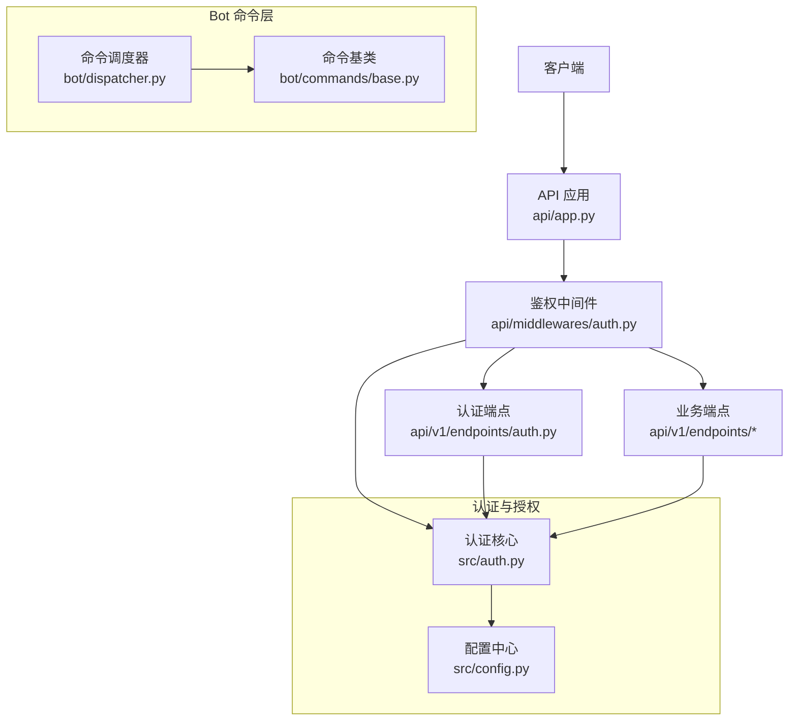
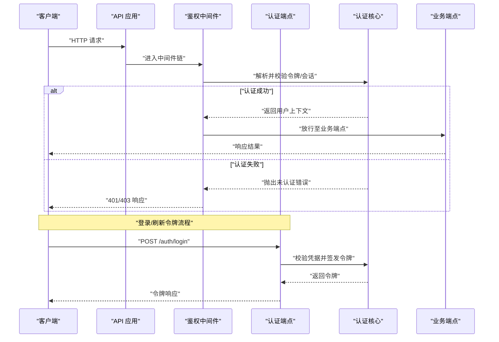
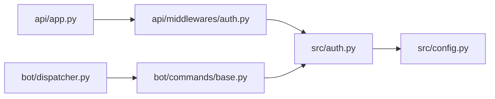

# 命令权限控制

<cite>
**本文档引用的文件**   
- [src/auth.py](file://src/auth.py)
- [api/middlewares/auth.py](file://api/middlewares/auth.py)
- [api/v1/endpoints/auth.py](file://api/v1/endpoints/auth.py)
- [api/app.py](file://api/app.py)
- [bot/commands/base.py](file://bot/commands/base.py)
- [bot/dispatcher.py](file://bot/dispatcher.py)
- [src/config.py](file://src/config.py)
- [tests/test_auth.py](file://tests/test_auth.py)
- [tests/test_auth_api.py](file://tests/test_auth_api.py)
</cite>

## 目录
1. [简介](#简介)
2. [项目结构](#项目结构)
3. [核心组件](#核心组件)
4. [架构总览](#架构总览)
5. [详细组件分析](#详细组件分析)
6. [依赖关系分析](#依赖关系分析)
7. [性能考虑](#性能考虑)
8. [故障排查指南](#故障排查指南)
9. [结论](#结论)
10. [附录](#附录)

## 简介
本文件面向 Daily Stock Analysis 项目的“命令权限控制”能力，聚焦于用户角色管理、权限验证机制与访问控制策略。文档围绕命令级权限控制（如每日股票分析相关命令的访问限制）、操作审计与用户行为监控、认证与授权流程（身份验证、令牌管理与会话控制），以及权限配置与管理方式（配置文件设置、动态分配与继承）展开说明，并提供实现示例（自定义权限检查器、权限装饰器与中间件开发）与安全最佳实践。

## 项目结构
Daily Stock Analysis 在后端 API 层通过中间件完成统一的鉴权拦截，在 Bot 命令层通过命令基类与调度器实现命令级权限控制；认证与授权的核心逻辑集中在 src/auth.py，API 路由与中间件注册位于 api/app.py 与 api/middlewares/auth.py，Bot 侧的命令基类与分发逻辑位于 bot/commands/base.py 与 bot/dispatcher.py。

图表来源 
- [api/app.py](file://api/app.py)
- [api/middlewares/auth.py](file://api/middlewares/auth.py)
- [api/v1/endpoints/auth.py](file://api/v1/endpoints/auth.py)
- [src/auth.py](file://src/auth.py)
- [src/config.py](file://src/config.py)
- [bot/commands/base.py](file://bot/commands/base.py)
- [bot/dispatcher.py](file://bot/dispatcher.py)

章节来源
- [api/app.py](file://api/app.py)
- [api/middlewares/auth.py](file://api/middlewares/auth.py)
- [api/v1/endpoints/auth.py](file://api/v1/endpoints/auth.py)
- [src/auth.py](file://src/auth.py)
- [src/config.py](file://src/config.py)
- [bot/commands/base.py](file://bot/commands/base.py)
- [bot/dispatcher.py](file://bot/dispatcher.py)

## 核心组件
- 认证与授权核心（src/auth.py）：提供用户身份校验、令牌签发与校验、角色与权限判定等基础能力。
- API 鉴权中间件（api/middlewares/auth.py）：统一拦截请求，解析凭证，注入上下文，执行权限检查。
- 认证端点（api/v1/endpoints/auth.py）：处理登录、令牌刷新、登出等认证生命周期接口。
- 命令基类与调度器（bot/commands/base.py, bot/dispatcher.py）：定义命令级权限控制入口，支持按命令维度进行访问限制与审计。
- 配置中心（src/config.py）：集中管理权限策略、默认角色、白名单与开关项。

章节来源
- [src/auth.py](file://src/auth.py)
- [api/middlewares/auth.py](file://api/middlewares/auth.py)
- [api/v1/endpoints/auth.py](file://api/v1/endpoints/auth.py)
- [bot/commands/base.py](file://bot/commands/base.py)
- [bot/dispatcher.py](file://bot/dispatcher.py)
- [src/config.py](file://src/config.py)

## 架构总览
整体采用“中间件前置鉴权 + 命令级细粒度控制”的分层架构。API 层通过中间件对每个请求进行认证与授权校验，确保只有合法用户才能进入业务逻辑；Bot 层通过命令基类与调度器，将权限控制下沉到命令级别，实现对“每日股票分析”等敏感命令的精细化管控。

图表来源 
- [api/app.py](file://api/app.py)
- [api/middlewares/auth.py](file://api/middlewares/auth.py)
- [api/v1/endpoints/auth.py](file://api/v1/endpoints/auth.py)
- [src/auth.py](file://src/auth.py)

## 详细组件分析

### 认证与授权核心（src/auth.py）
- 职责：负责用户身份验证、令牌生成与校验、角色与权限判定、会话状态维护。
- 关键点：
  - 令牌管理：支持签发、刷新与失效控制，建议结合过期时间与黑名单机制。
  - 权限模型：基于角色的访问控制（RBAC），可扩展为基于属性的访问控制（ABAC）。
  - 审计日志：记录关键认证事件与异常，便于追踪与合规审计。

章节来源
- [src/auth.py](file://src/auth.py)

### API 鉴权中间件（api/middlewares/auth.py）
- 职责：统一拦截请求，解析凭证（如 Authorization Header），注入用户上下文，执行权限检查。
- 关键点：
  - 白名单路径：允许匿名访问的路径（如健康检查、公开文档）。
  - 权限策略：根据路由或资源类型匹配权限规则，拒绝无权限访问。
  - 错误处理：标准化返回 401/403，并记录审计信息。

章节来源
- [api/middlewares/auth.py](file://api/middlewares/auth.py)

### 认证端点（api/v1/endpoints/auth.py）
- 职责：提供登录、令牌刷新、登出等认证生命周期接口。
- 关键点：
  - 登录：校验用户名/密码或其他凭据，成功后签发令牌。
  - 刷新：基于刷新令牌获取新访问令牌，降低频繁登录成本。
  - 登出：使当前令牌失效，清理会话状态。

章节来源
- [api/v1/endpoints/auth.py](file://api/v1/endpoints/auth.py)

### 命令基类与调度器（bot/commands/base.py, bot/dispatcher.py）
- 职责：定义命令执行框架，支持命令级权限控制、参数校验与审计。
- 关键点：
  - 命令权限：每个命令可声明所需角色或权限标识，由调度器在执行前校验。
  - 审计记录：记录命令调用者、时间、参数摘要与结果，便于行为监控。
  - 扩展性：支持插件式权限检查器，便于接入外部权限系统。

章节来源
- [bot/commands/base.py](file://bot/commands/base.py)
- [bot/dispatcher.py](file://bot/dispatcher.py)

### 配置中心（src/config.py）
- 职责：集中管理权限策略、默认角色、白名单、开关项等配置。
- 关键点：
  - 动态配置：支持运行时更新权限策略，无需重启服务。
  - 继承机制：支持角色继承与权限合并，简化复杂权限模型。
  - 环境隔离：区分开发、测试、生产环境的权限策略。

章节来源
- [src/config.py](file://src/config.py)

## 依赖关系分析
- API 层依赖鉴权中间件与认证核心，确保所有请求经过统一鉴权。
- Bot 层依赖命令基类与调度器，实现命令级权限控制。
- 配置中心被认证核心与权限策略模块共同依赖，提供一致的权限策略源。

图表来源 
- [api/app.py](file://api/app.py)
- [api/middlewares/auth.py](file://api/middlewares/auth.py)
- [src/auth.py](file://src/auth.py)
- [src/config.py](file://src/config.py)
- [bot/dispatcher.py](file://bot/dispatcher.py)
- [bot/commands/base.py](file://bot/commands/base.py)

章节来源
- [api/app.py](file://api/app.py)
- [api/middlewares/auth.py](file://api/middlewares/auth.py)
- [src/auth.py](file://src/auth.py)
- [src/config.py](file://src/config.py)
- [bot/dispatcher.py](file://bot/dispatcher.py)
- [bot/commands/base.py](file://bot/commands/base.py)

## 性能考虑
- 令牌校验缓存：对高频校验场景引入本地缓存，减少重复计算。
- 异步鉴权：在高并发下使用异步 I/O 提升吞吐。
- 最小化权限检查范围：仅在必要路径与命令上执行权限校验，避免全局开销。
- 审计日志异步写入：避免阻塞主流程，提高响应速度。

[本节为通用指导，不直接分析具体文件]

## 故障排查指南
- 常见认证失败：检查令牌格式、过期时间与签名有效性。
- 权限拒绝：确认用户角色与命令所需权限是否匹配，检查白名单配置。
- 审计缺失：确认审计日志开关与输出目标配置正确。
- 参考测试用例定位问题：
  - 单元测试覆盖认证流程与边界条件。
  - API 集成测试验证端到端鉴权链路。

章节来源
- [tests/test_auth.py](file://tests/test_auth.py)
- [tests/test_auth_api.py](file://tests/test_auth_api.py)

## 结论
Daily Stock Analysis 的权限控制系统通过中间件前置鉴权与命令级细粒度控制相结合，实现了从 API 到 Bot 的全链路访问控制。配合配置中心的动态策略与继承机制，系统具备良好的扩展性与可维护性。遵循安全最佳实践可有效降低越权、令牌泄露与审计缺失等风险。

[本节为总结性内容，不直接分析具体文件]

## 附录

### 命令级权限控制实现示例
- 自定义权限检查器：实现统一的权限判定接口，支持 RBAC/ABAC 策略。
- 权限装饰器：在命令或接口方法上声明所需权限，自动执行校验。
- 中间件开发：封装通用鉴权逻辑，支持白名单、速率限制与审计。

[本节为概念性说明，不直接分析具体文件]

### 安全最佳实践
- 令牌安全：使用短生命周期访问令牌与长期刷新令牌，服务端维护黑名单。
- 最小权限原则：仅授予完成任务所需的最小权限。
- 审计与监控：记录关键操作与异常，建立告警与回溯机制。
- 输入校验：对所有用户输入进行严格校验与过滤，防止注入攻击。
- 配置管理：敏感配置加密存储，区分环境隔离。

[本节为通用指导，不直接分析具体文件]