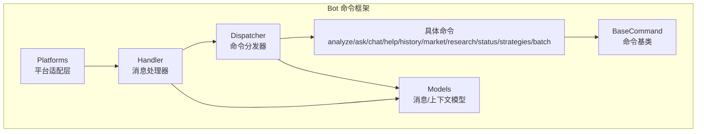
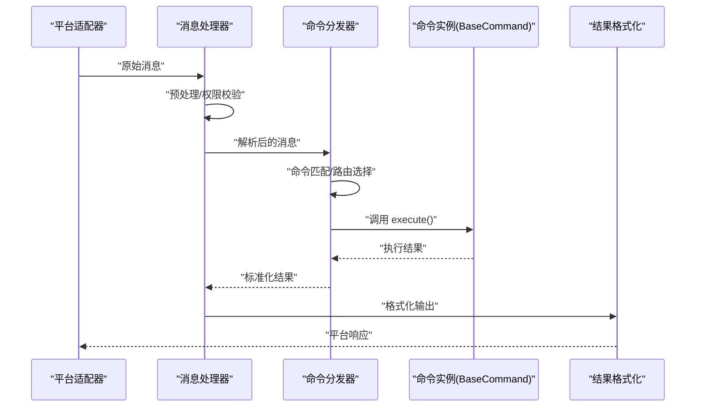
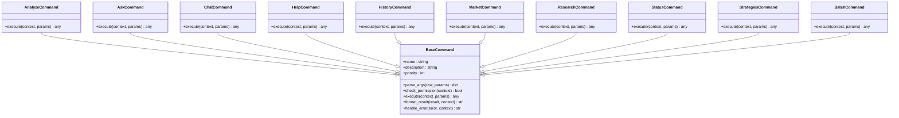
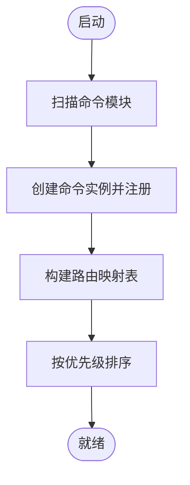
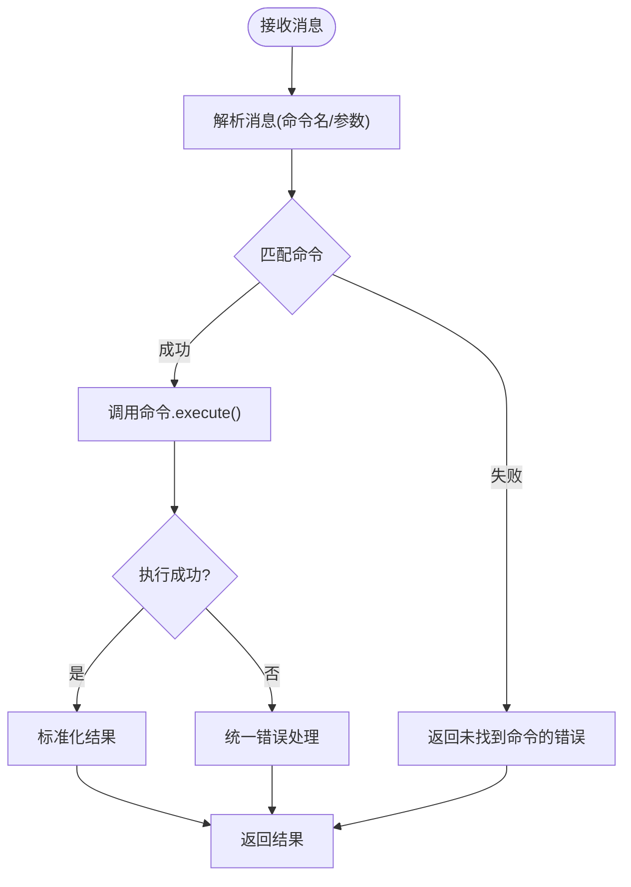
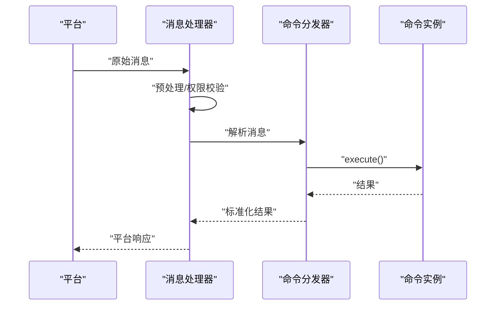

# 命令框架基础

<cite>
**本文档引用的文件**   
- [base.py](file://bot/commands/base.py)
- [dispatcher.py](file://bot/dispatcher.py)
- [handler.py](file://bot/handler.py)
- [models.py](file://bot/models.py)
- [__init__.py](file://bot/commands/__init__.py)
- [analyze.py](file://bot/commands/analyze.py)
- [ask.py](file://bot/commands/ask.py)
- [chat.py](file://bot/commands/chat.py)
- [help.py](file://bot/commands/help.py)
- [history.py](file://bot/commands/history.py)
- [market.py](file://bot/commands/market.py)
- [research.py](file://bot/commands/research.py)
- [status.py](file://bot/commands/status.py)
- [strategies.py](file://bot/commands/strategies.py)
- [batch.py](file://bot/commands/batch.py)
</cite>

## 目录
1. [简介](#简介)
2. [项目结构](#项目结构)
3. [核心组件](#核心组件)
4. [架构总览](#架构总览)
5. [详细组件分析](#详细组件分析)
6. [依赖关系分析](#依赖关系分析)
7. [性能考虑](#性能考虑)
8. [故障排查指南](#故障排查指南)
9. [结论](#结论)
10. [附录](#附录)

## 简介
本文件面向 Daily Stock Analysis 项目的“命令框架基础”，聚焦于 bot 子系统中的命令体系：BaseCommand 基类、命令注册与发现、命令分发器、消息处理器以及扩展点（中间件、插件、自定义处理器）。文档以可操作的方式解释命令生命周期管理、参数解析机制、错误处理策略，并给出命令注册系统、路由配置与优先级管理的实现要点。同时提供关键流程的时序图与流程图，帮助读者快速理解并正确扩展命令框架。

## 项目结构
命令框架位于 bot 目录下，核心由以下模块组成：
- 命令基类与具体命令：bot/commands/*
- 命令分发与调度：bot/dispatcher.py
- 消息处理与上下文：bot/handler.py, bot/models.py
- 平台适配层：bot/platforms/*（用于接入不同消息平台）



图表来源
- [base.py](file://bot/commands/base.py)
- [dispatcher.py](file://bot/dispatcher.py)
- [handler.py](file://bot/handler.py)
- [models.py](file://bot/models.py)
- [analyze.py](file://bot/commands/analyze.py)
- [ask.py](file://bot/commands/ask.py)
- [chat.py](file://bot/commands/chat.py)
- [help.py](file://bot/commands/help.py)
- [history.py](file://bot/commands/history.py)
- [market.py](file://bot/commands/market.py)
- [research.py](file://bot/commands/research.py)
- [status.py](file://bot/commands/status.py)
- [strategies.py](file://bot/commands/strategies.py)
- [batch.py](file://bot/commands/batch.py)

章节来源
- [base.py](file://bot/commands/base.py)
- [dispatcher.py](file://bot/dispatcher.py)
- [handler.py](file://bot/handler.py)
- [models.py](file://bot/models.py)
- [__init__.py](file://bot/commands/__init__.py)

## 核心组件
- BaseCommand：定义命令的生命周期方法、参数解析接口、权限校验钩子、结果格式化与错误处理约定。
- 命令注册系统：通过 __init__.py 集中注册命令实例，支持命令发现、路由映射与优先级排序。
- Dispatcher：负责消息解析、命令匹配、执行调度与异常捕获。
- Handler：负责消息预处理、权限验证、调用分发器、结果格式化与回写。
- Models：统一的消息与上下文数据结构，确保跨平台一致性。

章节来源
- [base.py](file://bot/commands/base.py)
- [__init__.py](file://bot/commands/__init__.py)
- [dispatcher.py](file://bot/dispatcher.py)
- [handler.py](file://bot/handler.py)
- [models.py](file://bot/models.py)

## 架构总览
命令框架的整体数据流如下：平台消息进入 Handler，进行预处理与权限校验后交由 Dispatcher；Dispatcher 解析消息、匹配命令并调度对应 Command 实例执行；Command 完成业务逻辑后返回结果，Handler 将结果格式化为平台响应。



图表来源
- [handler.py](file://bot/handler.py)
- [dispatcher.py](file://bot/dispatcher.py)
- [base.py](file://bot/commands/base.py)

## 详细组件分析

### BaseCommand 基类设计模式与接口
BaseCommand 定义了命令的统一抽象，包括：
- 生命周期方法：初始化、参数解析、权限校验、执行、结果格式化、错误处理。
- 参数解析机制：基于声明式参数定义，支持类型转换、默认值与校验。
- 错误处理策略：统一异常捕获与错误码映射，便于前端或平台展示。
- 扩展点：允许子类覆盖特定阶段以实现个性化行为。



图表来源
- [base.py](file://bot/commands/base.py)
- [analyze.py](file://bot/commands/analyze.py)
- [ask.py](file://bot/commands/ask.py)
- [chat.py](file://bot/commands/chat.py)
- [help.py](file://bot/commands/help.py)
- [history.py](file://bot/commands/history.py)
- [market.py](file://bot/commands/market.py)
- [research.py](file://bot/commands/research.py)
- [status.py](file://bot/commands/status.py)
- [strategies.py](file://bot/commands/strategies.py)
- [batch.py](file://bot/commands/batch.py)

章节来源
- [base.py](file://bot/commands/base.py)
- [analyze.py](file://bot/commands/analyze.py)
- [ask.py](file://bot/commands/ask.py)
- [chat.py](file://bot/commands/chat.py)
- [help.py](file://bot/commands/help.py)
- [history.py](file://bot/commands/history.py)
- [market.py](file://bot/commands/market.py)
- [research.py](file://bot/commands/research.py)
- [status.py](file://bot/commands/status.py)
- [strategies.py](file://bot/commands/strategies.py)
- [batch.py](file://bot/commands/batch.py)

### 命令注册系统与路由配置
- 注册机制：在 bot/commands/__init__.py 中集中创建命令实例并维护注册表，支持按名称查找与优先级排序。
- 发现机制：启动时扫描已注册的命令，构建路由映射表。
- 优先级管理：根据命令 priority 字段决定匹配顺序，避免同名冲突。



图表来源
- [__init__.py](file://bot/commands/__init__.py)

章节来源
- [__init__.py](file://bot/commands/__init__.py)

### 命令分发器实现逻辑
- 消息解析：从原始消息中提取命令名与参数。
- 命令匹配：依据路由映射表与优先级选择最合适的命令。
- 执行调度：调用命令的 execute 方法，捕获异常并转换为标准错误响应。
- 结果回传：将执行结果标准化后返回给 Handler。



图表来源
- [dispatcher.py](file://bot/dispatcher.py)

章节来源
- [dispatcher.py](file://bot/dispatcher.py)

### 命令处理器工作流程
- 消息预处理：清洗输入、提取上下文信息（用户、会话、平台等）。
- 权限验证：检查用户角色或访问控制策略。
- 调用分发器：将解析后的消息交给 Dispatcher。
- 结果格式化：根据平台要求对结果进行渲染与发送。



图表来源
- [handler.py](file://bot/handler.py)
- [dispatcher.py](file://bot/dispatcher.py)
- [base.py](file://bot/commands/base.py)

章节来源
- [handler.py](file://bot/handler.py)
- [dispatcher.py](file://bot/dispatcher.py)
- [base.py](file://bot/commands/base.py)

### 扩展点说明
- 中间件机制：可在 Handler 或 Dispatcher 前后插入中间件，用于日志、审计、限流、缓存等横切关注点。
- 插件系统：通过动态加载命令模块，实现热插拔的命令扩展。
- 自定义处理器：继承 BaseCommand 并重写生命周期方法，实现特定业务逻辑。

章节来源
- [base.py](file://bot/commands/base.py)
- [dispatcher.py](file://bot/dispatcher.py)
- [handler.py](file://bot/handler.py)

## 依赖关系分析
命令框架内部依赖清晰：
- Handler 依赖 Models 与 Dispatcher。
- Dispatcher 依赖命令注册表与 BaseCommand 抽象。
- 具体命令继承 BaseCommand，实现各自业务。

```mermaid
graph LR
Handler["Handler"] --> Models["Models"]
Handler --> Dispatcher["Dispatcher"]
Dispatcher --> Registry["命令注册表"]
Dispatcher --> BaseCommand["BaseCommand"]
BaseCommand <|-- AnalyzeCommand
BaseCommand <|-- AskCommand
BaseCommand <|-- ChatCommand
BaseCommand <|-- HelpCommand
BaseCommand <|-- HistoryCommand
BaseCommand <|-- MarketCommand
BaseCommand <|-- ResearchCommand
BaseCommand <|-- StatusCommand
BaseCommand <|-- StrategiesCommand
BaseCommand <|-- BatchCommand
```

图表来源
- [handler.py](file://bot/handler.py)
- [dispatcher.py](file://bot/dispatcher.py)
- [base.py](file://bot/commands/base.py)
- [__init__.py](file://bot/commands/__init__.py)

章节来源
- [handler.py](file://bot/handler.py)
- [dispatcher.py](file://bot/dispatcher.py)
- [base.py](file://bot/commands/base.py)
- [__init__.py](file://bot/commands/__init__.py)

## 性能考虑
- 命令匹配采用 O(1) 路由表查找，避免线性扫描。
- 参数解析与校验应在 parse_args 中尽早失败，减少无效执行。
- 长耗时任务应异步化或队列化，避免阻塞主线程。
- 结果格式化尽量复用模板与缓存，降低重复计算。

## 故障排查指南
- 常见错误：
  - 命令未注册：检查 __init__.py 是否包含新命令实例。
  - 参数解析失败：确认 parse_args 的类型与默认值设置。
  - 权限校验失败：检查权限策略与用户上下文。
  - 执行异常：查看 handle_error 的错误映射与日志。
- 调试建议：
  - 启用详细日志，记录消息解析与命令匹配过程。
  - 使用单元测试模拟平台消息，验证命令执行路径。
  - 逐步覆盖 BaseCommand 的生命周期方法，定位问题阶段。

章节来源
- [base.py](file://bot/commands/base.py)
- [dispatcher.py](file://bot/dispatcher.py)
- [handler.py](file://bot/handler.py)

## 结论
Daily Stock Analysis 的命令框架以 BaseCommand 为核心抽象，结合集中注册、路由匹配与统一错误处理，提供了可扩展、易维护的命令体系。通过 Handler 与 Dispatcher 的职责分离，实现了清晰的命令生命周期管理与灵活的扩展点。遵循本文档的设计与实践，可以快速添加新命令并集成到现有平台生态中。

## 附录
- 使用示例（概念性步骤）：
  - 继承 BaseCommand，实现 parse_args、execute、format_result。
  - 在 __init__.py 中注册命令实例，设置 name、description、priority。
  - 在 Handler 中调用 Dispatcher，确保预处理与权限校验通过。
  - 在 Dispatcher 中验证路由映射与优先级排序是否正确。
  - 使用单元测试验证命令端到端流程。