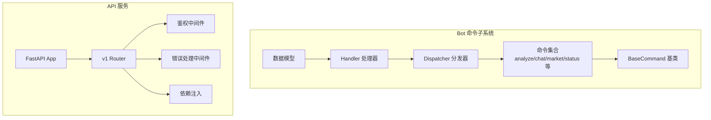
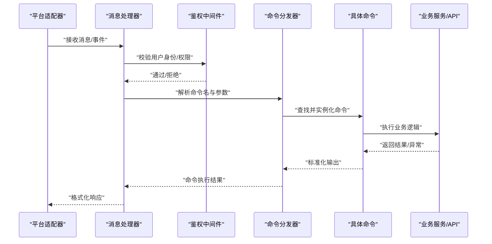
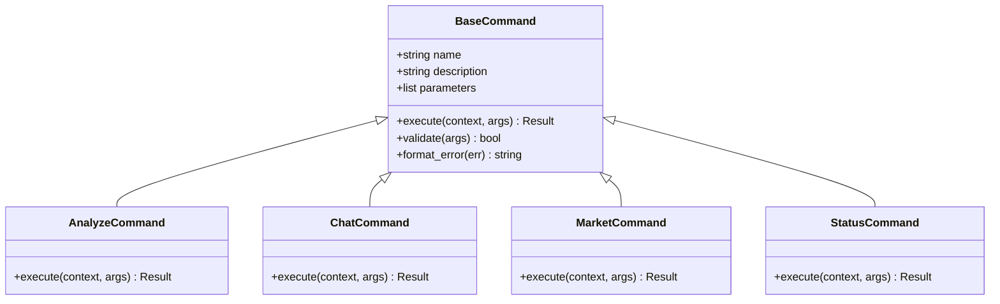
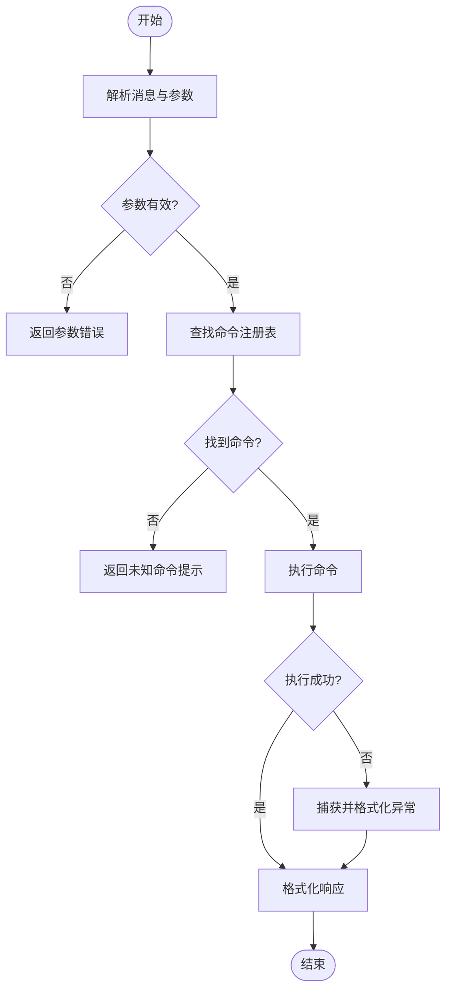
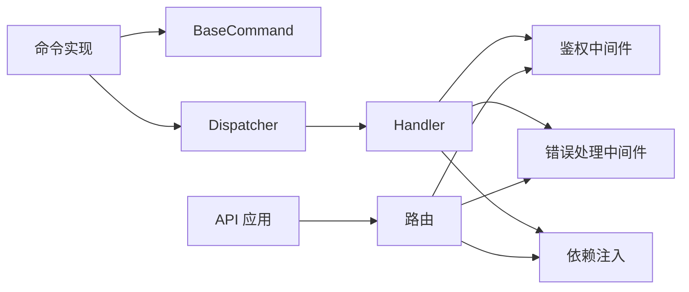

# 命令系统

<cite>
**本文引用的文件**   
- [base.py](file://bot/commands/base.py)
- [analyze.py](file://bot/commands/analyze.py)
- [chat.py](file://bot/commands/chat.py)
- [market.py](file://bot/commands/market.py)
- [status.py](file://bot/commands/status.py)
- [help.py](file://bot/commands/help.py)
- [ask.py](file://bot/commands/ask.py)
- [batch.py](file://bot/commands/batch.py)
- [history.py](file://bot/commands/history.py)
- [research.py](file://bot/commands/research.py)
- [strategies.py](file://bot/commands/strategies.py)
- [dispatcher.py](file://bot/dispatcher.py)
- [handler.py](file://bot/handler.py)
- [models.py](file://bot/models.py)
- [auth.py](file://api/middlewares/auth.py)
- [error_handler.py](file://api/middlewares/error_handler.py)
- [router.py](file://api/v1/router.py)
- [app.py](file://api/app.py)
- [deps.py](file://api/deps.py)
- [main.py](file://main.py)
- [server.py](file://server.py)
</cite>

## 目录
1. [简介](#简介)
2. [项目结构](#项目结构)
3. [核心组件](#核心组件)
4. [架构总览](#架构总览)
5. [详细组件分析](#详细组件分析)
6. [依赖关系分析](#依赖关系分析)
7. [性能考虑](#性能考虑)
8. [故障排查指南](#故障排查指南)
9. [结论](#结论)
10. [附录](#附录)

## 简介
本文件面向 Daily Stock Analysis 项目的“命令系统”，聚焦于机器人侧的命令框架与内置命令。文档涵盖：
- 命令框架设计原理：BaseCommand 基类接口、命令注册机制、分发流程
- 内置命令功能与用法：分析、聊天、市场查询、状态检查等
- 参数解析与处理：位置参数、可选参数、校验规则
- 权限控制：用户角色管理、命令访问控制、操作审计
- 自定义命令开发指南：继承、参数定义、执行逻辑、错误处理
- 测试与调试最佳实践

## 项目结构
命令系统主要位于 bot 模块，围绕 commands（命令实现）、platforms（平台适配）、dispatcher（分发器）和 handler（处理器）组织。API 层提供鉴权中间件与路由，供 Web/桌面端调用。

图表来源
- [dispatcher.py:1-200](file://bot/dispatcher.py#L1-L200)
- [handler.py:1-200](file://bot/handler.py#L1-L200)
- [base.py:1-200](file://bot/commands/base.py#L1-L200)
- [router.py:1-200](file://api/v1/router.py#L1-L200)
- [auth.py:1-200](file://api/middlewares/auth.py#L1-L200)
- [error_handler.py:1-200](file://api/middlewares/error_handler.py#L1-L200)
- [deps.py:1-200](file://api/deps.py#L1-L200)

章节来源
- [dispatcher.py:1-200](file://bot/dispatcher.py#L1-L200)
- [handler.py:1-200](file://bot/handler.py#L1-L200)
- [base.py:1-200](file://bot/commands/base.py#L1-L200)
- [router.py:1-200](file://api/v1/router.py#L1-L200)
- [auth.py:1-200](file://api/middlewares/auth.py#L1-L200)
- [error_handler.py:1-200](file://api/middlewares/error_handler.py#L1-L200)
- [deps.py:1-200](file://api/deps.py#L1-L200)

## 核心组件
- BaseCommand 基类：定义命令的统一接口（名称、描述、参数定义、执行入口），并提供参数解析、校验与错误处理的通用能力。
- 命令注册机制：通过集中式注册表将命令名映射到具体命令类实例，支持动态发现与加载。
- Dispatcher：根据消息类型与命令名选择对应命令，并调用其执行方法。
- Handler：平台无关的消息处理入口，负责上下文构建、权限校验、调用分发器并返回结果。
- 内置命令：analyze、chat、market、status、help、ask、batch、history、research、strategies 等。

章节来源
- [base.py:1-200](file://bot/commands/base.py#L1-L200)
- [dispatcher.py:1-200](file://bot/dispatcher.py#L1-L200)
- [handler.py:1-200](file://bot/handler.py#L1-L200)

## 架构总览
命令系统的整体交互流程如下：平台消息进入 Handler，进行鉴权与上下文准备后交由 Dispatcher 分发给具体命令；命令执行完成后由 Handler 统一封装响应。

图表来源
- [handler.py:1-200](file://bot/handler.py#L1-L200)
- [dispatcher.py:1-200](file://bot/dispatcher.py#L1-L200)
- [auth.py:1-200](file://api/middlewares/auth.py#L1-L200)

## 详细组件分析

### BaseCommand 基类与命令注册
- 接口要点
  - 命令元信息：名称、别名、描述、权限要求
  - 参数定义：位置参数、可选参数、默认值、校验规则
  - 执行入口：统一的 execute 方法，接收上下文与已解析参数
  - 错误处理：标准化异常捕获与提示
- 注册机制
  - 全局注册表维护命令名到类的映射
  - 支持装饰器或显式注册函数完成加载
  - 启动时扫描并初始化命令实例

图表来源
- [base.py:1-200](file://bot/commands/base.py#L1-L200)
- [analyze.py:1-200](file://bot/commands/analyze.py#L1-L200)
- [chat.py:1-200](file://bot/commands/chat.py#L1-L200)
- [market.py:1-200](file://bot/commands/market.py#L1-L200)
- [status.py:1-200](file://bot/commands/status.py#L1-L200)

章节来源
- [base.py:1-200](file://bot/commands/base.py#L1-L200)

### 命令分发与处理流程
- 分发器职责
  - 解析消息中的命令名与参数
  - 查找注册的命令类并实例化
  - 调用命令的 execute 方法并收集结果
- 处理器职责
  - 构建上下文（用户、会话、渠道）
  - 调用鉴权中间件
  - 调用分发器并统一封装响应

图表来源
- [dispatcher.py:1-200](file://bot/dispatcher.py#L1-L200)
- [handler.py:1-200](file://bot/handler.py#L1-L200)

章节来源
- [dispatcher.py:1-200](file://bot/dispatcher.py#L1-L200)
- [handler.py:1-200](file://bot/handler.py#L1-L200)

### 内置命令详解

#### 分析命令（analyze）
- 功能：对指定股票或指数进行多维度分析（技术面、基本面、新闻、策略信号等）
- 参数：标的代码/名称、时间窗口、指标开关、报告格式
- 使用示例：在聊天中发送“分析 000001.SZ”或“分析 上证指数 近一周”
- 错误处理：无效标的、数据缺失、网络超时等

章节来源
- [analyze.py:1-200](file://bot/commands/analyze.py#L1-L200)

#### 聊天命令（chat）
- 功能：与智能体对话，获取投资建议、问答与解释
- 参数：问题文本、上下文模式（历史/当前）、风格偏好
- 使用示例：“问 最近新能源板块走势如何？”
- 错误处理：模型不可用、输入过长、敏感内容过滤

章节来源
- [chat.py:1-200](file://bot/commands/chat.py#L1-L200)

#### 市场查询（market）
- 功能：查询大盘指数、板块涨跌、资金流向、热点主题
- 参数：指数代码、日期范围、排序字段
- 使用示例：“市场 沪深300 近一月 涨幅”
- 错误处理：数据源不可用、参数越界

章节来源
- [market.py:1-200](file://bot/commands/market.py#L1-L200)

#### 状态检查（status）
- 功能：查看系统健康、任务队列、数据源状态、缓存命中率
- 参数：无或按模块筛选
- 使用示例：“状态”或“状态 数据源”
- 错误处理：监控服务不可用

章节来源
- [status.py:1-200](file://bot/commands/status.py#L1-L200)

#### 帮助命令（help）
- 功能：列出可用命令、显示命令说明与示例
- 参数：命令名（可选）
- 使用示例：“帮助”或“帮助 分析”
- 错误处理：无

章节来源
- [help.py:1-200](file://bot/commands/help.py#L1-L200)

#### 提问命令（ask）
- 功能：快速问答，侧重事实性信息与数据检索
- 参数：问题、数据来源限定
- 使用示例：“问 贵州茅台最新财报摘要”
- 错误处理：搜索失败、数据过期

章节来源
- [ask.py:1-200](file://bot/commands/ask.py#L1-L200)

#### 批量命令（batch）
- 功能：批量执行分析或查询任务，支持异步队列
- 参数：任务列表、并发度、回调通知
- 使用示例：“批量 000001.SZ,600519.SH 分析 近三月”
- 错误处理：队列满、任务失败重试

章节来源
- [batch.py:1-200](file://bot/commands/batch.py#L1-L200)

#### 历史命令（history）
- 功能：查看历史分析记录、回测结果、决策信号
- 参数：时间范围、类型筛选、分页
- 使用示例：“历史 分析 近一周 第1页”
- 错误处理：存储不可用、权限不足

章节来源
- [history.py:1-200](file://bot/commands/history.py#L1-L200)

#### 研究命令（research）
- 功能：深度研究报告生成，整合多源数据与策略观点
- 参数：标的、研究维度、模板、语言
- 使用示例：“研究 宁德时代 基本面+技术面 中文”
- 错误处理：模板缺失、LLM 限流

章节来源
- [research.py:1-200](file://bot/commands/research.py#L1-L200)

#### 策略命令（strategies）
- 功能：列举与执行策略配置，查看策略表现与信号
- 参数：策略名、回测区间、指标阈值
- 使用示例：“策略 均线金叉 近半年”
- 错误处理：策略未加载、参数不合法

章节来源
- [strategies.py:1-200](file://bot/commands/strategies.py#L1-L200)

### 参数解析与验证
- 位置参数：必填，顺序固定，用于标识核心实体（如股票代码）
- 可选参数：带默认值，支持短选项与长选项
- 校验规则：类型转换、范围检查、枚举约束、正则匹配
- 错误反馈：明确提示缺失参数、非法值与修正建议

章节来源
- [base.py:1-200](file://bot/commands/base.py#L1-L200)

### 权限控制与审计
- 用户角色：访客、普通用户、管理员、分析师等
- 命令访问控制：基于角色的白名单/黑名单，部分命令需特定角色
- 操作审计：记录命令调用、参数摘要、耗时、结果状态
- 鉴权中间件：统一拦截请求，校验 Token/Session，注入用户上下文

章节来源
- [auth.py:1-200](file://api/middlewares/auth.py#L1-L200)
- [handler.py:1-200](file://bot/handler.py#L1-L200)

### 自定义命令开发指南
- 步骤
  - 继承 BaseCommand，定义 name、description、parameters
  - 实现 validate 方法进行参数校验
  - 实现 execute 方法执行业务逻辑，返回标准化结果
  - 在注册表中登记命令名与类映射
- 最佳实践
  - 保持幂等与可重试
  - 合理拆分依赖服务，避免阻塞
  - 统一错误码与消息格式
  - 添加单元测试与集成测试

章节来源
- [base.py:1-200](file://bot/commands/base.py#L1-L200)

## 依赖关系分析
命令系统与 API 服务之间的依赖关系如下：

图表来源
- [base.py:1-200](file://bot/commands/base.py#L1-L200)
- [dispatcher.py:1-200](file://bot/dispatcher.py#L1-L200)
- [handler.py:1-200](file://bot/handler.py#L1-L200)
- [auth.py:1-200](file://api/middlewares/auth.py#L1-L200)
- [error_handler.py:1-200](file://api/middlewares/error_handler.py#L1-L200)
- [deps.py:1-200](file://api/deps.py#L1-L200)
- [router.py:1-200](file://api/v1/router.py#L1-L200)

章节来源
- [dispatcher.py:1-200](file://bot/dispatcher.py#L1-L200)
- [handler.py:1-200](file://bot/handler.py#L1-L200)
- [auth.py:1-200](file://api/middlewares/auth.py#L1-L200)
- [error_handler.py:1-200](file://api/middlewares/error_handler.py#L1-L200)
- [deps.py:1-200](file://api/deps.py#L1-L200)
- [router.py:1-200](file://api/v1/router.py#L1-L200)

## 性能考虑
- 命令执行应尽量避免阻塞，采用异步与队列机制
- 数据源调用需设置超时与重试策略
- 缓存热点数据（如指数快照、热门标的）减少重复请求
- 批量命令支持并发控制与背压
- 日志采样与结构化日志降低 IO 压力

[本节为通用指导，无需引用具体文件]

## 故障排查指南
- 常见问题
  - 命令未注册：检查注册表与导入路径
  - 参数解析失败：核对参数定义与校验规则
  - 权限拒绝：确认用户角色与命令访问控制
  - 数据源异常：检查网络、密钥与限流
- 定位手段
  - 启用调试日志，关注错误堆栈
  - 使用状态命令查看各组件健康
  - 回放历史命令记录定位问题

章节来源
- [error_handler.py:1-200](file://api/middlewares/error_handler.py#L1-L200)
- [status.py:1-200](file://bot/commands/status.py#L1-L200)

## 结论
命令系统以 BaseCommand 为核心抽象，结合注册表与分发器实现了可扩展、可维护的命令框架。内置命令覆盖分析、聊天、市场、状态等高频场景，配合鉴权与审计保障安全与合规。遵循本文档的开发与实践指南，可高效扩展自定义命令并保证质量与性能。

[本节为总结，无需引用具体文件]

## 附录
- 常用命令速查
  - 分析：analyze
  - 聊天：chat
  - 市场：market
  - 状态：status
  - 帮助：help
  - 提问：ask
  - 批量：batch
  - 历史：history
  - 研究：research
  - 策略：strategies

[本节为概览，无需引用具体文件]