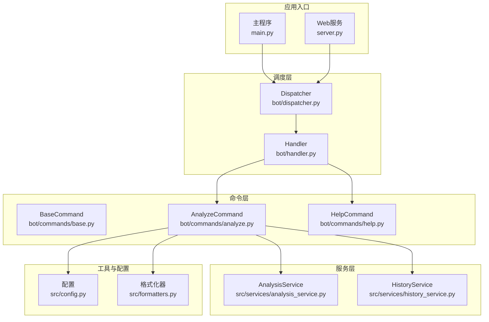
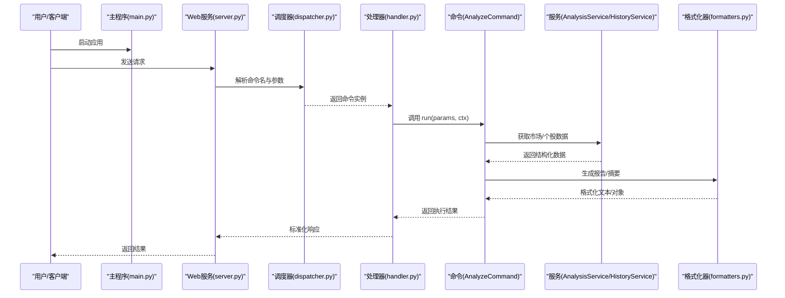
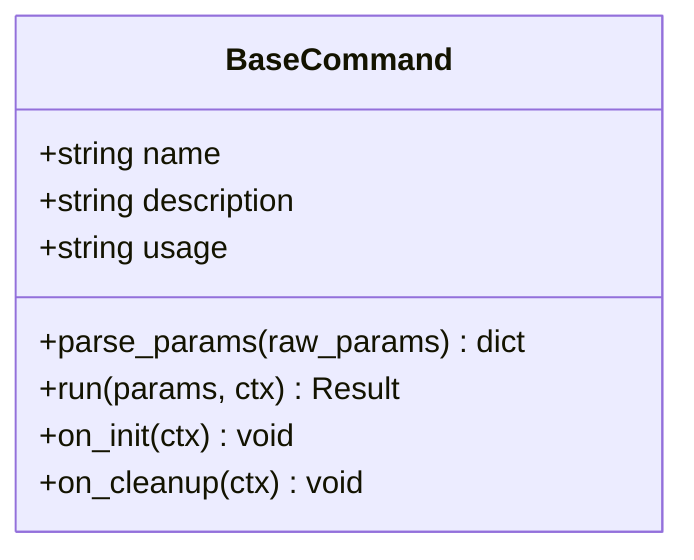
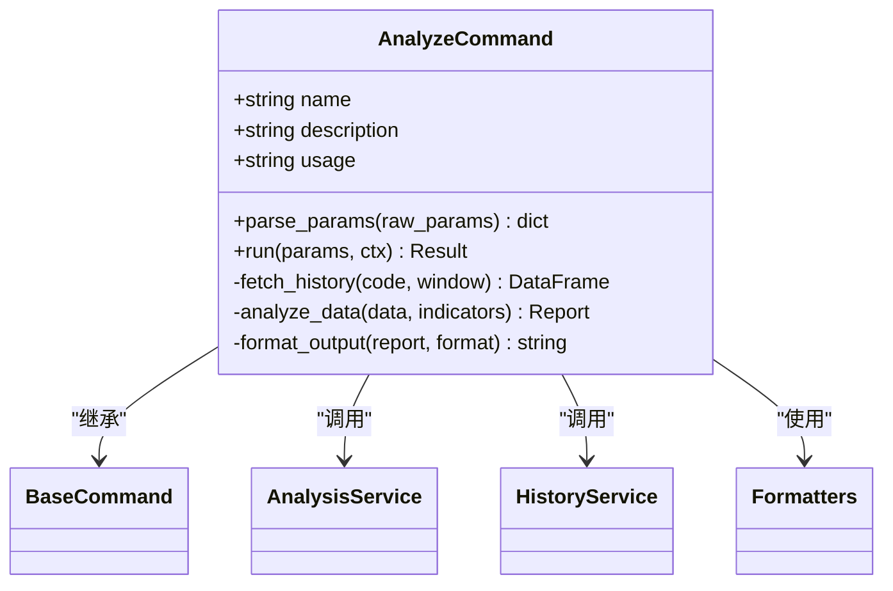
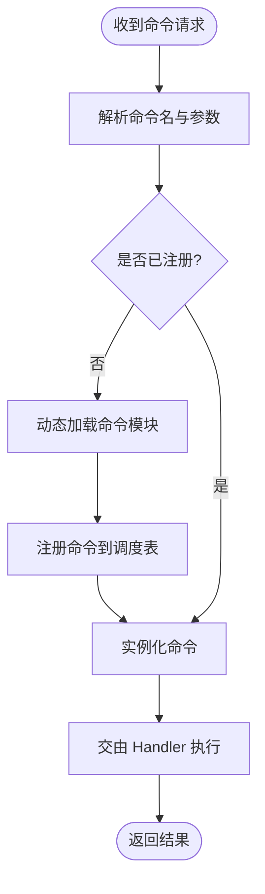
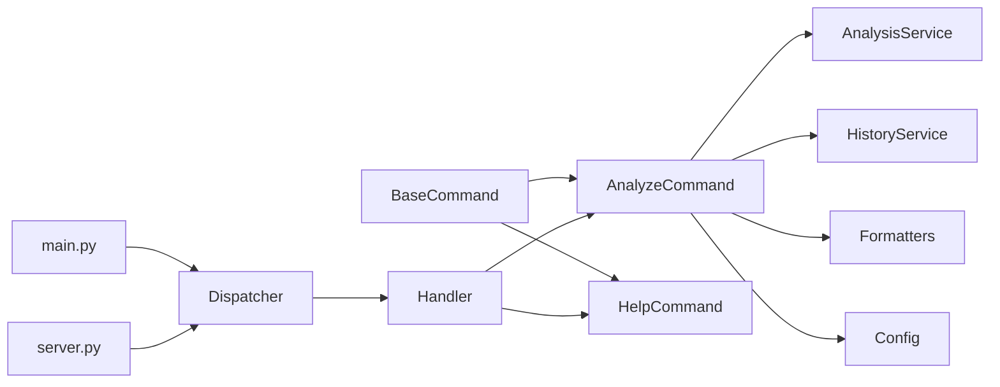

# 自定义命令开发

<cite>
**本文引用的文件**   
- [main.py](file://main.py)
- [server.py](file://server.py)
- [bot/commands/base.py](file://bot/commands/base.py)
- [bot/commands/analyze.py](file://bot/commands/analyze.py)
- [bot/commands/help.py](file://bot/commands/help.py)
- [bot/dispatcher.py](file://bot/dispatcher.py)
- [bot/handler.py](file://bot/handler.py)
- [src/config.py](file://src/config.py)
- [src/formatters.py](file://src/formatters.py)
- [src/services/analysis_service.py](file://src/services/analysis_service.py)
- [src/services/history_service.py](file://src/services/history_service.py)
- [tests/test_ask_command.py](file://tests/test_ask_command.py)
</cite>

## 目录
1. [简介](#简介)
2. [项目结构](#项目结构)
3. [核心组件](#核心组件)
4. [架构总览](#架构总览)
5. [详细组件分析](#详细组件分析)
6. [依赖关系分析](#依赖关系分析)
7. [性能考虑](#性能考虑)
8. [故障排查指南](#故障排查指南)
9. [结论](#结论)
10. [附录](#附录)

## 简介
本指南面向希望在 Daily Stock Analysis 项目中扩展“每日股票分析”能力的开发者，系统讲解如何基于 BaseCommand 基类创建自定义命令。内容涵盖：
- 继承与类结构定义、方法重写与属性配置
- 参数定义（位置参数、可选参数、类型校验、默认值）
- 执行逻辑实现（业务编排、数据获取与处理、结果格式化）
- 命令注册与发现机制（自动注册、手动注册、动态加载）
- 从简单到复杂的完整示例
- 测试、调试与部署最佳实践

## 项目结构
Daily Stock Analysis 的命令子系统位于 bot/commands 目录，通过 dispatcher 和 handler 进行分发与执行；服务层在 src/services 中提供数据与分析能力；配置与格式化分别在 src/config.py 与 src/formatters.py。

图表来源
- [main.py:1-200](file://main.py#L1-L200)
- [server.py:1-200](file://server.py#L1-L200)
- [bot/commands/base.py:1-200](file://bot/commands/base.py#L1-L200)
- [bot/commands/analyze.py:1-200](file://bot/commands/analyze.py#L1-L200)
- [bot/commands/help.py:1-200](file://bot/commands/help.py#L1-L200)
- [bot/dispatcher.py:1-200](file://bot/dispatcher.py#L1-L200)
- [bot/handler.py:1-200](file://bot/handler.py#L1-L200)
- [src/config.py:1-200](file://src/config.py#L1-L200)
- [src/formatters.py:1-200](file://src/formatters.py#L1-L200)
- [src/services/analysis_service.py:1-200](file://src/services/analysis_service.py#L1-L200)
- [src/services/history_service.py:1-200](file://src/services/history_service.py#L1-L200)

章节来源
- [main.py:1-200](file://main.py#L1-L200)
- [server.py:1-200](file://server.py#L1-L200)
- [bot/commands/base.py:1-200](file://bot/commands/base.py#L1-L200)
- [bot/dispatcher.py:1-200](file://bot/dispatcher.py#L1-L200)
- [bot/handler.py:1-200](file://bot/handler.py#L1-L200)

## 核心组件
- BaseCommand：所有命令的抽象基类，定义命令元信息（名称、描述、用法）、参数解析接口、执行入口 run() 以及生命周期钩子。
- AnalyzeCommand：每日股票分析命令的实现，封装了参数、数据获取、分析与结果格式化流程。
- HelpCommand：帮助命令，展示可用命令列表与使用说明。
- Dispatcher：命令路由与发现中心，负责将输入映射到具体命令实例。
- Handler：统一处理入口，协调上下文、权限、日志与错误处理。
- AnalysisService / HistoryService：数据分析与历史数据服务，供命令调用。
- Config / Formatters：全局配置与输出格式化工具。

章节来源
- [bot/commands/base.py:1-200](file://bot/commands/base.py#L1-L200)
- [bot/commands/analyze.py:1-200](file://bot/commands/analyze.py#L1-L200)
- [bot/commands/help.py:1-200](file://bot/commands/help.py#L1-L200)
- [bot/dispatcher.py:1-200](file://bot/dispatcher.py#L1-L200)
- [bot/handler.py:1-200](file://bot/handler.py#L1-L200)
- [src/services/analysis_service.py:1-200](file://src/services/analysis_service.py#L1-L200)
- [src/services/history_service.py:1-200](file://src/services/history_service.py#L1-L200)
- [src/config.py:1-200](file://src/config.py#L1-L200)
- [src/formatters.py:1-200](file://src/formatters.py#L1-L200)

## 架构总览
命令系统的整体交互如下：用户或外部系统触发命令，Dispatcher 根据命令名查找并实例化对应 Command，Handler 包装执行上下文，Command 调用 Service 获取数据并进行分析，最后通过 Formatter 输出结果。

图表来源
- [main.py:1-200](file://main.py#L1-L200)
- [server.py:1-200](file://server.py#L1-L200)
- [bot/dispatcher.py:1-200](file://bot/dispatcher.py#L1-L200)
- [bot/handler.py:1-200](file://bot/handler.py#L1-L200)
- [bot/commands/analyze.py:1-200](file://bot/commands/analyze.py#L1-L200)
- [src/services/analysis_service.py:1-200](file://src/services/analysis_service.py#L1-L200)
- [src/services/history_service.py:1-200](file://src/services/history_service.py#L1-L200)
- [src/formatters.py:1-200](file://src/formatters.py#L1-L200)

## 详细组件分析

### BaseCommand 基类与命令契约
- 职责：定义命令元数据（名称、描述、用法）、参数解析接口、执行入口 run()、生命周期钩子（如初始化、清理）。
- 关键点：
  - 参数解析应支持位置参数与可选参数，并提供类型校验与默认值。
  - run() 是命令的业务入口，接收已解析的参数与上下文。
  - 建议实现统一的错误处理与日志记录。

图表来源
- [bot/commands/base.py:1-200](file://bot/commands/base.py#L1-L200)

章节来源
- [bot/commands/base.py:1-200](file://bot/commands/base.py#L1-L200)

### AnalyzeCommand 每日分析命令
- 职责：实现每日股票分析的具体逻辑，包括参数定义、数据获取、分析计算与结果格式化。
- 关键点：
  - 参数：股票代码、时间窗口、指标选择等，需包含类型校验与默认值。
  - 数据流：调用 HistoryService 获取历史数据，调用 AnalysisService 进行分析。
  - 输出：使用 Formatters 生成 Markdown/JSON/文本等格式。

图表来源
- [bot/commands/analyze.py:1-200](file://bot/commands/analyze.py#L1-L200)
- [src/services/analysis_service.py:1-200](file://src/services/analysis_service.py#L1-L200)
- [src/services/history_service.py:1-200](file://src/services/history_service.py#L1-L200)
- [src/formatters.py:1-200](file://src/formatters.py#L1-L200)

章节来源
- [bot/commands/analyze.py:1-200](file://bot/commands/analyze.py#L1-L200)

### HelpCommand 帮助命令
- 职责：列出可用命令及其简要说明，便于用户快速上手。
- 关键点：
  - 读取命令注册表，生成帮助文本。
  - 支持按模块或关键字过滤。

章节来源
- [bot/commands/help.py:1-200](file://bot/commands/help.py#L1-L200)

### Dispatcher 命令调度与发现
- 职责：维护命令注册表，根据命令名查找并实例化命令，支持自动注册与动态加载。
- 关键点：
  - 自动注册：扫描命令模块，按约定命名注册。
  - 手动注册：显式调用注册 API。
  - 动态加载：按需导入命令模块，避免启动时开销。

图表来源
- [bot/dispatcher.py:1-200](file://bot/dispatcher.py#L1-L200)

章节来源
- [bot/dispatcher.py:1-200](file://bot/dispatcher.py#L1-L200)

### Handler 统一执行入口
- 职责：包装命令执行，注入上下文（用户、权限、日志、追踪），统一异常处理与响应格式。
- 关键点：
  - 前置校验（参数合法性、权限检查）。
  - 后置处理（结果标准化、审计日志）。

章节来源
- [bot/handler.py:1-200](file://bot/handler.py#L1-L200)

### 服务层：AnalysisService 与 HistoryService
- AnalysisService：聚合多源数据，执行技术指标与策略分析，返回结构化报告。
- HistoryService：拉取历史行情、财务与新闻数据，提供缓存与重试机制。

章节来源
- [src/services/analysis_service.py:1-200](file://src/services/analysis_service.py#L1-L200)
- [src/services/history_service.py:1-200](file://src/services/history_service.py#L1-L200)

### 配置与格式化：Config 与 Formatters
- Config：集中管理环境变量、API 密钥、超时与并发限制。
- Formatters：将分析结果转换为 Markdown、JSON、纯文本等格式，支持模板与语言切换。

章节来源
- [src/config.py:1-200](file://src/config.py#L1-L200)
- [src/formatters.py:1-200](file://src/formatters.py#L1-L200)

## 依赖关系分析
命令层依赖服务层与工具层，调度层与处理器贯穿整个执行链路。

图表来源
- [bot/commands/base.py:1-200](file://bot/commands/base.py#L1-L200)
- [bot/commands/analyze.py:1-200](file://bot/commands/analyze.py#L1-L200)
- [bot/commands/help.py:1-200](file://bot/commands/help.py#L1-L200)
- [bot/dispatcher.py:1-200](file://bot/dispatcher.py#L1-L200)
- [bot/handler.py:1-200](file://bot/handler.py#L1-L200)
- [src/services/analysis_service.py:1-200](file://src/services/analysis_service.py#L1-L200)
- [src/services/history_service.py:1-200](file://src/services/history_service.py#L1-L200)
- [src/config.py:1-200](file://src/config.py#L1-L200)
- [src/formatters.py:1-200](file://src/formatters.py#L1-L200)
- [main.py:1-200](file://main.py#L1-L200)
- [server.py:1-200](file://server.py#L1-L200)

章节来源
- [bot/dispatcher.py:1-200](file://bot/dispatcher.py#L1-L200)
- [bot/handler.py:1-200](file://bot/handler.py#L1-L200)

## 性能考虑
- 数据获取优化：HistoryService 应启用缓存、分页与并发拉取，减少重复请求与网络延迟。
- 分析计算优化：AnalysisService 对指标计算采用向量化与惰性求值，避免全量重算。
- 命令执行优化：Dispatcher 懒加载命令模块，Handler 批量处理请求，降低启动与冷启动开销。
- 资源控制：通过 Config 设置超时、重试次数与线程池大小，防止雪崩。

[本节为通用指导，不直接分析具体文件]

## 故障排查指南
- 常见问题：
  - 命令未找到：检查 Dispatcher 注册表与模块路径是否正确。
  - 参数校验失败：确认 parse_params 的类型与默认值设置。
  - 数据拉取失败：查看 HistoryService 的网络与认证配置。
  - 分析结果为空：检查 AnalysisService 的数据源与指标配置。
- 调试技巧：
  - 启用详细日志与追踪 ID，定位请求链路。
  - 使用单元测试模拟数据源与服务响应。
  - 逐步断点验证参数解析与数据处理流程。

章节来源
- [tests/test_ask_command.py:1-200](file://tests/test_ask_command.py#L1-L200)

## 结论
通过 BaseCommand 抽象与标准化的命令契约，Daily Stock Analysis 提供了可扩展、可测试、易维护的命令体系。开发者只需关注业务逻辑与数据编排，即可快速构建高质量的自定义命令。结合 Dispatcher 的动态加载与 Handler 的统一处理，系统具备良好的扩展性与稳定性。

[本节为总结性内容，不直接分析具体文件]

## 附录

### 自定义命令开发步骤清单
- 定义命令类：继承 BaseCommand，设置 name/description/usage。
- 实现参数解析：parse_params 支持位置与可选参数，完成类型校验与默认值。
- 编写执行逻辑：run 方法中调用 Service 获取数据，进行计算与格式化。
- 注册命令：通过 Dispatcher 自动或手动注册，确保动态加载可用。
- 编写测试：覆盖参数边界、数据异常与输出格式。
- 部署上线：配置环境变量、监控与日志，灰度发布与回滚预案。

[本节为概念性指导，不直接分析具体文件]