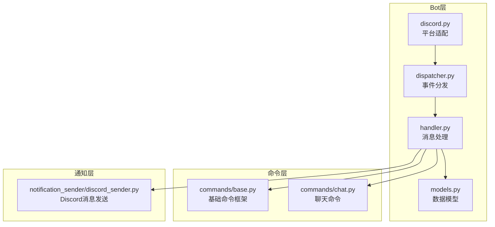
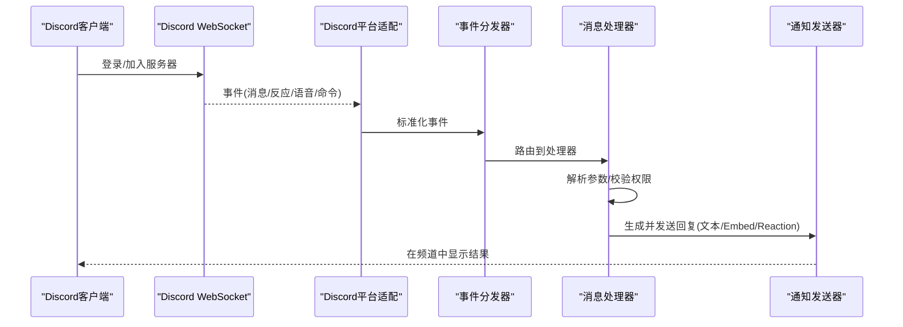
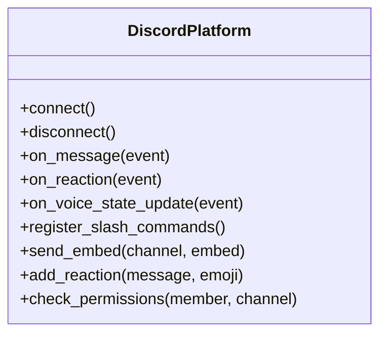
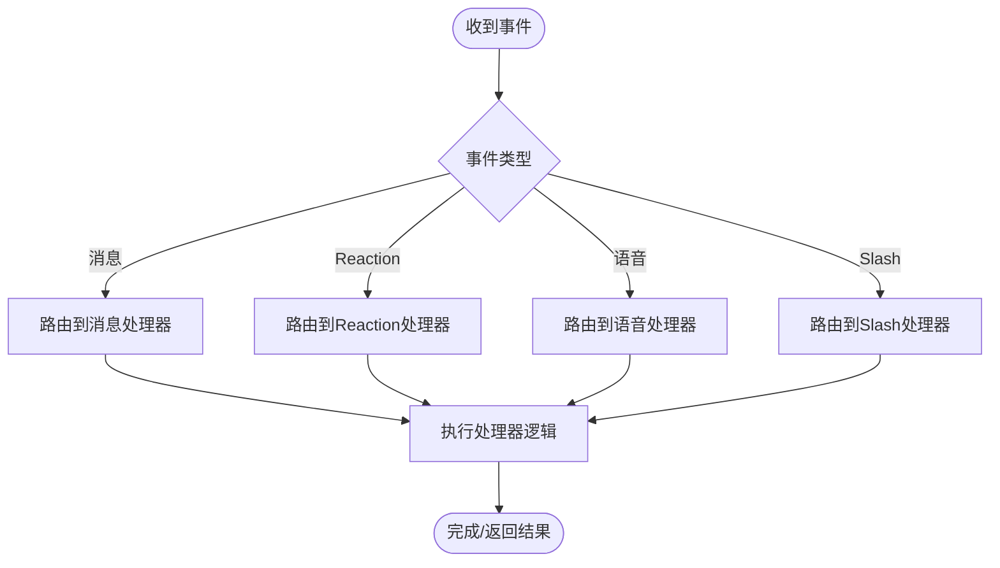
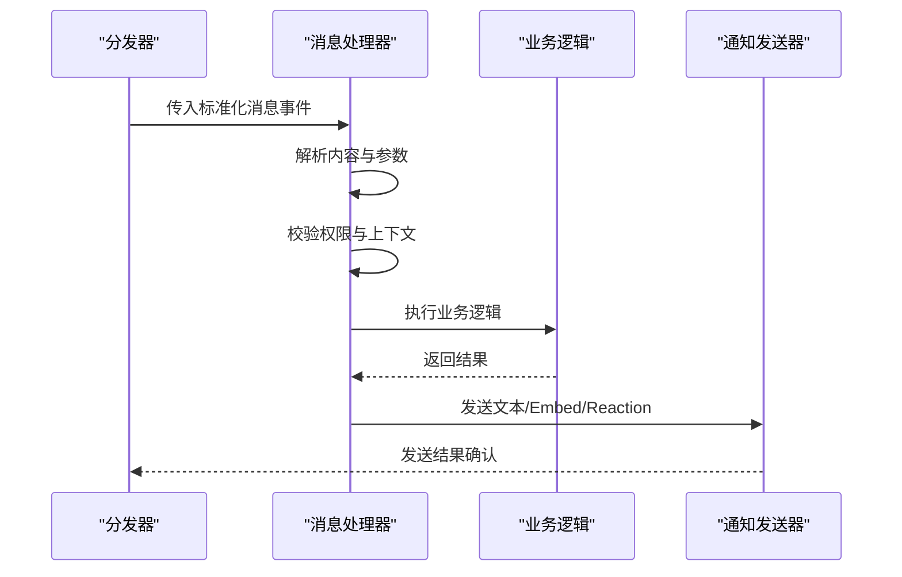
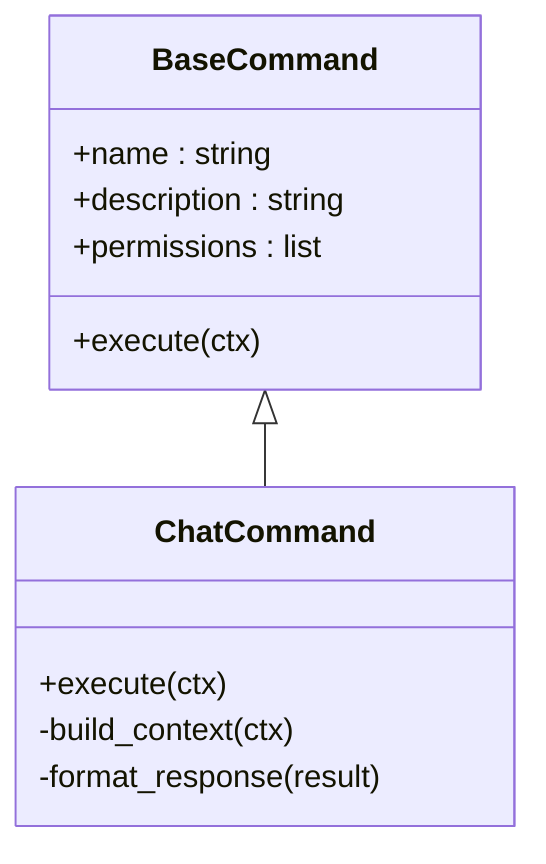
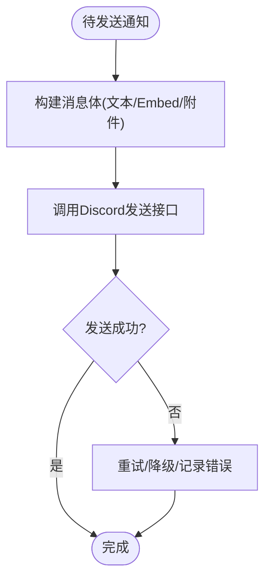
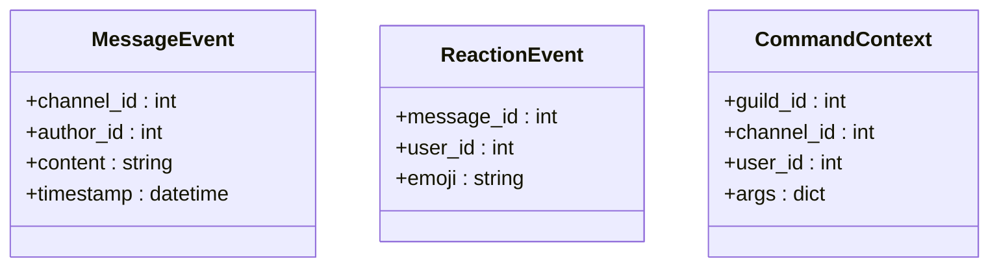
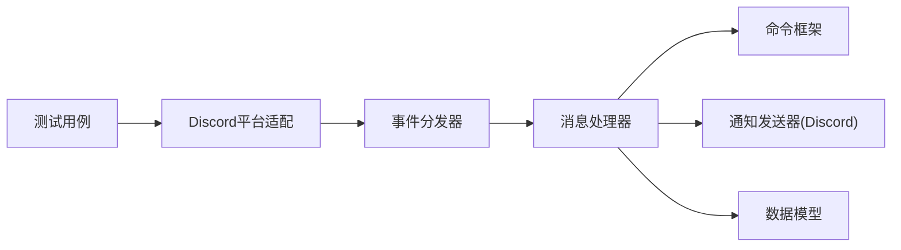

# Discord平台集成

<cite>
**本文引用的文件**   
- [bot/platforms/discord.py](file://bot/platforms/discord.py)
- [bot/dispatcher.py](file://bot/dispatcher.py)
- [bot/handler.py](file://bot/handler.py)
- [bot/models.py](file://bot/models.py)
- [bot/commands/base.py](file://bot/commands/base.py)
- [bot/commands/chat.py](file://bot/commands/chat.py)
- [src/notification_sender/discord_sender.py](file://src/notification_sender/discord_sender.py)
- [docs/bot/discord-bot-config.md](file://docs/bot/discord-bot-config.md)
- [tests/test_discord_platform.py](file://tests/test_discord_platform.py)
</cite>

## 目录
1. [简介](#简介)
2. [项目结构](#项目结构)
3. [核心组件](#核心组件)
4. [架构总览](#架构总览)
5. [详细组件分析](#详细组件分析)
6. [依赖关系分析](#依赖关系分析)
7. [性能考虑](#性能考虑)
8. [故障排查指南](#故障排查指南)
9. [结论](#结论)
10. [附录](#附录)

## 简介
本文件面向需要在Discord平台上集成与运行Bot的开发者，提供从应用注册、Token获取、权限配置到API集成的完整说明。内容涵盖WebSocket连接、事件监听、消息处理、Embed消息、Reaction响应、语音频道支持与Slash命令等Discord特有能力；同时给出速率限制、消息长度限制、内存管理等限制与最佳实践，以及调试技巧、日志配置、性能优化与错误处理策略。

## 项目结构
本项目将Discord Bot作为多平台之一进行统一接入，核心位于bot模块，具体Discord实现位于platforms子模块，并通过dispatcher与handler完成事件分发与业务处理。通知侧通过notification_sender中的Discord发送器对外输出结果。

图表来源
- [bot/platforms/discord.py](file://bot/platforms/discord.py)
- [bot/dispatcher.py](file://bot/dispatcher.py)
- [bot/handler.py](file://bot/handler.py)
- [bot/models.py](file://bot/models.py)
- [bot/commands/base.py](file://bot/commands/base.py)
- [bot/commands/chat.py](file://bot/commands/chat.py)
- [src/notification_sender/discord_sender.py](file://src/notification_sender/discord_sender.py)

章节来源
- [bot/platforms/discord.py](file://bot/platforms/discord.py)
- [bot/dispatcher.py](file://bot/dispatcher.py)
- [bot/handler.py](file://bot/handler.py)
- [bot/models.py](file://bot/models.py)
- [bot/commands/base.py](file://bot/commands/base.py)
- [bot/commands/chat.py](file://bot/commands/chat.py)
- [src/notification_sender/discord_sender.py](file://src/notification_sender/discord_sender.py)

## 核心组件
- Discord平台适配：封装Discord API交互（WebSocket、事件、权限、Embed、Reaction、语音、Slash命令），屏蔽底层差异。
- 事件分发器：统一接收平台事件并路由到处理器，支持异步并发与限流保护。
- 消息处理器：解析用户输入、调用业务逻辑、构造回复（文本/Embed/Reaction）。
- 命令框架：定义Slash命令基类与常用命令（如聊天、状态、帮助等）。
- 通知发送器：以Discord为目标渠道的消息推送，支持富文本与附件。

章节来源
- [bot/platforms/discord.py](file://bot/platforms/discord.py)
- [bot/dispatcher.py](file://bot/dispatcher.py)
- [bot/handler.py](file://bot/handler.py)
- [bot/commands/base.py](file://bot/commands/base.py)
- [bot/commands/chat.py](file://bot/commands/chat.py)
- [src/notification_sender/discord_sender.py](file://src/notification_sender/discord_sender.py)

## 架构总览
下图展示了从Discord客户端到Bot内部处理再到外部服务的关键流程，包括WebSocket连接、事件监听、消息处理与回复发送。

图表来源
- [bot/platforms/discord.py](file://bot/platforms/discord.py)
- [bot/dispatcher.py](file://bot/dispatcher.py)
- [bot/handler.py](file://bot/handler.py)
- [src/notification_sender/discord_sender.py](file://src/notification_sender/discord_sender.py)

## 详细组件分析

### Discord平台适配（WebSocket、事件、权限、Embed、Reaction、语音、Slash）
- 连接与会话：维护Bot Token与服务端连接，处理重连与心跳。
- 事件监听：订阅消息创建、Reaction添加/移除、语音状态变化、Slash命令触发等。
- 权限校验：基于角色与通道权限判断是否允许执行操作。
- 消息格式：支持纯文本、Markdown片段、Embed富信息卡片。
- Reaction响应：对消息添加表情回应，用于快速反馈或投票。
- 语音频道：进入/离开语音频道、播放音频流（若启用）。
- Slash命令：注册与处理交互式命令，包含参数校验与自动提示。

图表来源
- [bot/platforms/discord.py](file://bot/platforms/discord.py)

章节来源
- [bot/platforms/discord.py](file://bot/platforms/discord.py)

### 事件分发器（Dispatcher）
- 职责：接收平台标准化事件，按类型路由至对应处理器，支持并发与队列控制。
- 特性：可插拔处理器注册、错误捕获与重试、限流与背压。

图表来源
- [bot/dispatcher.py](file://bot/dispatcher.py)

章节来源
- [bot/dispatcher.py](file://bot/dispatcher.py)

### 消息处理器（Handler）
- 职责：解析用户输入、上下文构建、权限检查、调用业务逻辑、构造回复。
- 支持：文本/Embed/Reaction组合回复，错误友好提示。

图表来源
- [bot/handler.py](file://bot/handler.py)
- [src/notification_sender/discord_sender.py](file://src/notification_sender/discord_sender.py)

章节来源
- [bot/handler.py](file://bot/handler.py)
- [src/notification_sender/discord_sender.py](file://src/notification_sender/discord_sender.py)

### 命令框架与聊天命令
- 基础命令：定义命令元数据、参数解析、权限与限流。
- 聊天命令：实现常见对话式指令，支持上下文记忆与快捷操作。

图表来源
- [bot/commands/base.py](file://bot/commands/base.py)
- [bot/commands/chat.py](file://bot/commands/chat.py)

章节来源
- [bot/commands/base.py](file://bot/commands/base.py)
- [bot/commands/chat.py](file://bot/commands/chat.py)

### 通知发送器（Discord）
- 职责：将系统通知以Discord消息形式发送，支持Embed、附件与Reaction。
- 特性：批量发送、失败重试、速率限制感知。

图表来源
- [src/notification_sender/discord_sender.py](file://src/notification_sender/discord_sender.py)

章节来源
- [src/notification_sender/discord_sender.py](file://src/notification_sender/discord_sender.py)

### 数据模型（Models）
- 用途：统一事件、消息、权限、命令参数的数据结构，便于跨模块传递与校验。

图表来源
- [bot/models.py](file://bot/models.py)

章节来源
- [bot/models.py](file://bot/models.py)

## 依赖关系分析
- 平台适配依赖事件分发器与处理器，处理器依赖命令框架与通知发送器。
- 通知发送器直接对接Discord API，需遵循速率限制与权限要求。
- 测试用例覆盖平台适配关键路径，确保稳定性。

图表来源
- [bot/platforms/discord.py](file://bot/platforms/discord.py)
- [bot/dispatcher.py](file://bot/dispatcher.py)
- [bot/handler.py](file://bot/handler.py)
- [bot/commands/base.py](file://bot/commands/base.py)
- [src/notification_sender/discord_sender.py](file://src/notification_sender/discord_sender.py)
- [tests/test_discord_platform.py](file://tests/test_discord_platform.py)

章节来源
- [tests/test_discord_platform.py](file://tests/test_discord_platform.py)

## 性能考虑
- 速率限制：遵循Discord API速率限制，采用令牌桶或滑动窗口限流，避免429错误。
- 并发与队列：使用异步任务与队列管理高并发事件，防止阻塞主循环。
- 内存管理：及时释放大对象，限制消息缓存大小，避免内存泄漏。
- 网络优化：连接池与超时设置，合理重试与退避策略。
- 日志与监控：结构化日志与指标采集，定位瓶颈与异常。

[本节为通用指导，不直接分析具体文件]

## 故障排查指南
- 连接问题：检查Token有效性、网络连通性与代理设置。
- 权限不足：确认Bot在服务器已授予必要权限（发送消息、嵌入链接、管理反应、读取消息历史等）。
- 速率限制：观察429响应，调整发送频率与重试间隔。
- 消息过长：拆分长消息或使用附件/Embed分页展示。
- 事件丢失：检查分发器队列容量与处理器耗时，必要时扩容或优化。
- 日志定位：开启DEBUG级别日志，关注WebSocket事件与HTTP请求响应码。

章节来源
- [docs/bot/discord-bot-config.md](file://docs/bot/discord-bot-config.md)
- [tests/test_discord_platform.py](file://tests/test_discord_platform.py)

## 结论
通过统一的平台适配、事件分发与消息处理机制，本项目实现了Discord平台的深度集成，支持丰富的交互能力与通知场景。遵循速率限制、权限管理与性能优化策略，可保障在高负载下的稳定运行。建议结合文档与测试用例完善部署与运维流程。

[本节为总结性内容，不直接分析具体文件]

## 附录

### 应用注册与Bot Token获取
- 在Discord开发者控制台创建应用，启用Bot功能并生成Token。
- 将Token安全存储于环境变量或配置文件，避免泄露。

章节来源
- [docs/bot/discord-bot-config.md](file://docs/bot/discord-bot-config.md)

### 服务器权限配置
- 邀请Bot到服务器后，授予以下权限：
  - 发送消息、嵌入链接、上传文件
  - 读取消息历史、添加反应
  - 管理Webhook（如需）
  - 语音相关（如启用语音功能）

章节来源
- [docs/bot/discord-bot-config.md](file://docs/bot/discord-bot-config.md)

### Embed消息与Reaction响应
- Embed用于展示结构化信息（标题、描述、字段、图片等）。
- Reaction用于快速反馈（点赞、确认、选择等）。

章节来源
- [bot/platforms/discord.py](file://bot/platforms/discord.py)
- [src/notification_sender/discord_sender.py](file://src/notification_sender/discord_sender.py)

### 语音频道支持
- 若启用语音功能，需授予语音权限并在代码中处理进入/离开与音频流。

章节来源
- [bot/platforms/discord.py](file://bot/platforms/discord.py)

### Slash命令
- 注册命令名称、描述与参数，处理用户交互与权限校验。

章节来源
- [bot/commands/base.py](file://bot/commands/base.py)
- [bot/commands/chat.py](file://bot/commands/chat.py)

### 速率限制与消息长度限制
- 速率限制：遵循Discord API限制，实施限流与重试。
- 消息长度：单条消息不超过限制，超长内容拆分为多条或使用附件。

章节来源
- [docs/bot/discord-bot-config.md](file://docs/bot/discord-bot-config.md)

### 调试技巧与日志记录
- 启用DEBUG日志，记录WebSocket事件与HTTP请求。
- 使用结构化日志与追踪ID，便于问题定位。

章节来源
- [tests/test_discord_platform.py](file://tests/test_discord_platform.py)

### 性能优化建议
- 异步化与并发控制，避免阻塞。
- 缓存热点数据，减少重复计算。
- 合理设置超时与重试策略。

[本节为通用指导，不直接分析具体文件]

### 错误处理策略
- 捕获网络异常与API错误，分类处理并重试。
- 对用户友好的错误提示，避免暴露敏感信息。

章节来源
- [bot/handler.py](file://bot/handler.py)
- [src/notification_sender/discord_sender.py](file://src/notification_sender/discord_sender.py)