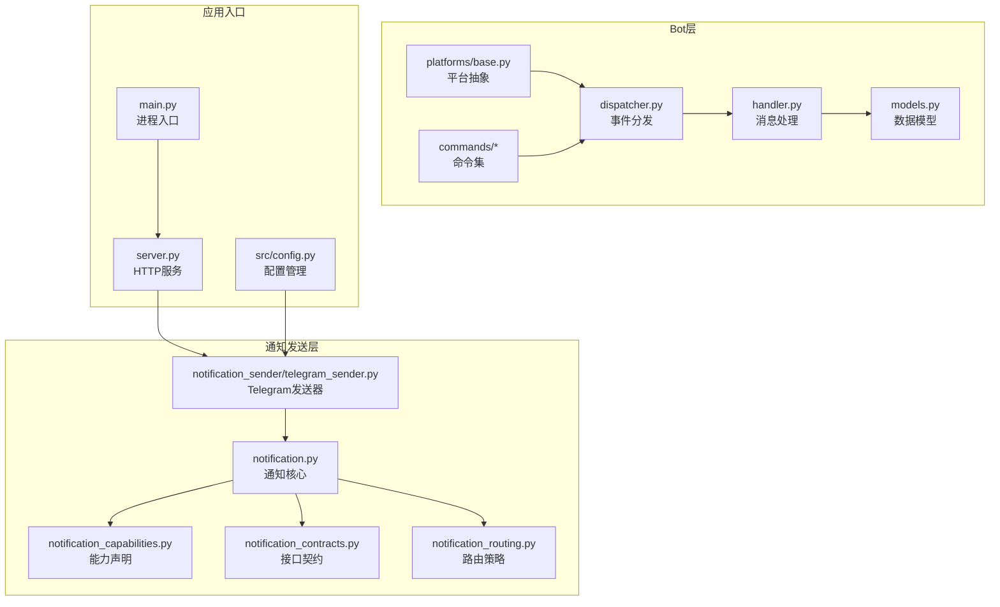
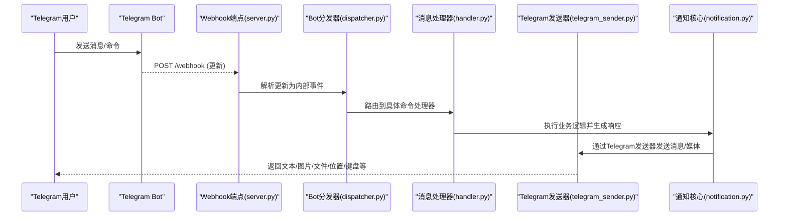
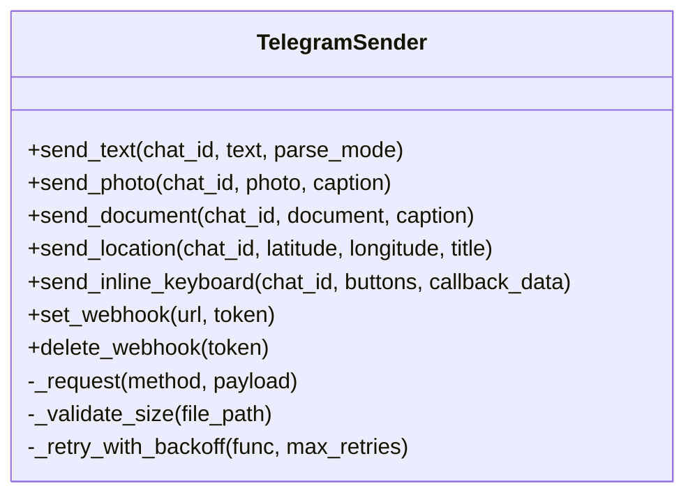
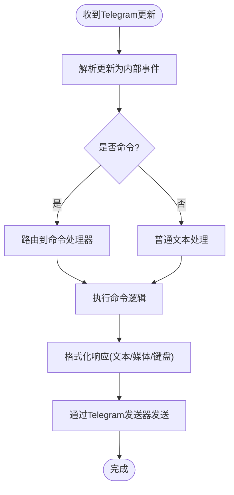
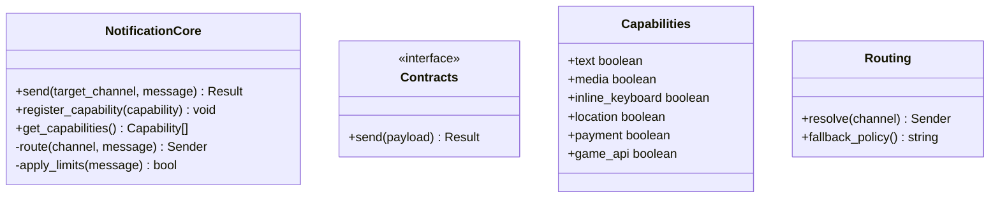
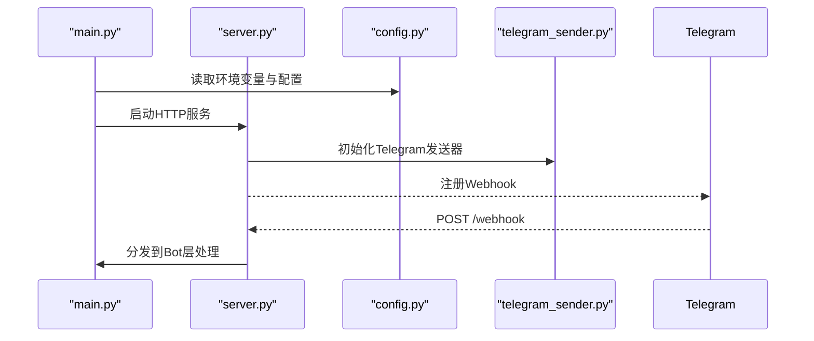
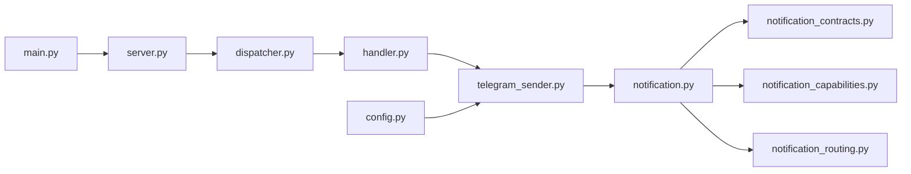

# Telegram平台集成

<cite>
**本文引用的文件**   
- [telegram_sender.py](file://src/notification_sender/telegram_sender.py)
- [bot/dispatcher.py](file://bot/dispatcher.py)
- [bot/handler.py](file://bot/handler.py)
- [bot/models.py](file://bot/models.py)
- [bot/platforms/base.py](file://bot/platforms/base.py)
- [bot/commands/base.py](file://bot/commands/base.py)
- [bot/commands/help.py](file://bot/commands/help.py)
- [bot/commands/analyze.py](file://bot/commands/analyze.py)
- [bot/commands/market.py](file://bot/commands/market.py)
- [bot/commands/status.py](file://bot/commands/status.py)
- [bot/commands/chat.py](file://bot/commands/chat.py)
- [bot/commands/history.py](file://bot/commands/history.py)
- [bot/commands/research.py](file://bot/commands/research.py)
- [bot/commands/batch.py](file://bot/commands/batch.py)
- [bot/commands/strategies.py](file://bot/commands/strategies.py)
- [src/config.py](file://src/config.py)
- [src/notification.py](file://src/notification.py)
- [src/notification_capabilities.py](file://src/notification_capabilities.py)
- [src/notification_contracts.py](file://src/notification_contracts.py)
- [src/notification_routing.py](file://src/notification_routing.py)
- [server.py](file://server.py)
- [main.py](file://main.py)
</cite>

## 目录
1. [简介](#简介)
2. [项目结构](#项目结构)
3. [核心组件](#核心组件)
4. [架构总览](#架构总览)
5. [详细组件分析](#详细组件分析)
6. [依赖关系分析](#依赖关系分析)
7. [性能考虑](#性能考虑)
8. [故障排除指南](#故障排除指南)
9. [结论](#结论)
10. [附录](#附录)

## 简介
本文件面向希望在当前代码库中集成Telegram平台的开发者与运维人员，系统性说明Bot Token获取、Webhook配置、权限设置、消息处理机制（命令解析、Inline键盘、Markdown/LTEHTML渲染）、Telegram特有功能（文件上传、位置共享、支付集成、游戏API）的接入方式与最佳实践。同时提供环境变量配置示例、限制与优化建议、监控指标以及常见错误排查方法。

## 项目结构
本项目采用“平台抽象 + 通知发送器”的分层设计：
- bot 层负责平台适配与命令分发（包含通用基类、平台实现、命令处理器）。
- src/notification_sender 层提供各渠道的通知发送实现（含Telegram）。
- src/notification_* 模块定义能力、契约与路由策略。
- server/main 作为应用入口，启动服务并装配依赖。

图表来源
- [bot/dispatcher.py](file://bot/dispatcher.py)
- [bot/handler.py](file://bot/handler.py)
- [bot/models.py](file://bot/models.py)
- [bot/platforms/base.py](file://bot/platforms/base.py)
- [src/notification_sender/telegram_sender.py](file://src/notification_sender/telegram_sender.py)
- [src/notification.py](file://src/notification.py)
- [src/notification_capabilities.py](file://src/notification_capabilities.py)
- [src/notification_contracts.py](file://src/notification_contracts.py)
- [src/notification_routing.py](file://src/notification_routing.py)
- [server.py](file://server.py)
- [main.py](file://main.py)
- [src/config.py](file://src/config.py)

章节来源
- [bot/dispatcher.py](file://bot/dispatcher.py)
- [bot/handler.py](file://bot/handler.py)
- [bot/models.py](file://bot/models.py)
- [bot/platforms/base.py](file://bot/platforms/base.py)
- [src/notification_sender/telegram_sender.py](file://src/notification_sender/telegram_sender.py)
- [src/notification.py](file://src/notification.py)
- [src/notification_capabilities.py](file://src/notification_capabilities.py)
- [src/notification_contracts.py](file://src/notification_contracts.py)
- [src/notification_routing.py](file://src/notification_routing.py)
- [server.py](file://server.py)
- [main.py](file://main.py)
- [src/config.py](file://src/config.py)

## 核心组件
- Telegram发送器：封装Telegram Bot API调用，支持文本、图片、文件、位置、内联键盘等能力。
- 平台抽象与命令分发：统一不同平台的消息格式，将Telegram消息转换为内部命令对象，交由命令处理器执行。
- 通知核心与契约：定义通知能力、数据结构与路由策略，确保多通道一致性与可扩展性。
- 配置与环境变量：集中管理Telegram相关配置项（Token、Webhook URL、超时、重试等）。

章节来源
- [src/notification_sender/telegram_sender.py](file://src/notification_sender/telegram_sender.py)
- [bot/platforms/base.py](file://bot/platforms/base.py)
- [bot/dispatcher.py](file://bot/dispatcher.py)
- [src/notification.py](file://src/notification.py)
- [src/notification_contracts.py](file://src/notification_contracts.py)
- [src/config.py](file://src/config.py)

## 架构总览
下图展示从Telegram用户到业务逻辑再到响应返回的整体流程，包括Webhook回调、命令解析、能力路由与结果回传。

图表来源
- [server.py](file://server.py)
- [bot/dispatcher.py](file://bot/dispatcher.py)
- [bot/handler.py](file://bot/handler.py)
- [src/notification_sender/telegram_sender.py](file://src/notification_sender/telegram_sender.py)
- [src/notification.py](file://src/notification.py)

## 详细组件分析

### Telegram发送器（telegram_sender.py）
- 职责：封装Telegram Bot API调用，提供发送文本、图片、文件、位置、内联键盘、Markdown/LTEHTML渲染等方法。
- 关键能力：
  - 文本与富文本：支持Markdown或HTML格式，自动转义与长度限制。
  - 媒体与文件：支持本地路径或URL上传，大小限制校验与分片策略。
  - 位置与地图：发送地理位置坐标，支持标题与活动信息。
  - Inline键盘：构建按钮布局，支持回调数据传递。
  - 错误处理：网络异常、速率限制、权限不足等统一捕获与重试。
- 配置项：Token、Base URL、超时、重试次数、代理设置等。

图表来源
- [src/notification_sender/telegram_sender.py](file://src/notification_sender/telegram_sender.py)

章节来源
- [src/notification_sender/telegram_sender.py](file://src/notification_sender/telegram_sender.py)

### 平台抽象与命令分发（bot/platforms/base.py、bot/dispatcher.py、bot/handler.py）
- 平台抽象：定义统一的消息结构与能力接口，屏蔽不同平台差异。
- 分发器：接收Telegram更新，解析为用户ID、聊天ID、消息类型与内容，映射为内部命令对象。
- 处理器：根据命令名称选择对应命令处理器，执行后返回结果，再由发送器回传给Telegram。

图表来源
- [bot/platforms/base.py](file://bot/platforms/base.py)
- [bot/dispatcher.py](file://bot/dispatcher.py)
- [bot/handler.py](file://bot/handler.py)

章节来源
- [bot/platforms/base.py](file://bot/platforms/base.py)
- [bot/dispatcher.py](file://bot/dispatcher.py)
- [bot/handler.py](file://bot/handler.py)

### 命令集（commands/*）
- help：帮助命令，列出可用命令与用法。
- analyze：股票分析命令，触发分析流程并返回报告。
- market：市场概览命令，展示指数与热点。
- status：状态查询命令，显示系统健康与队列状态。
- chat：聊天交互命令，支持上下文对话。
- history：历史查询命令，拉取历史数据与报告。
- research：研究命令，聚合多源信息。
- batch：批量处理命令，支持任务队列。
- strategies：策略命令，查看与管理策略。

```mermaid
classDiagram
class HelpCommand {
+execute(user_id, chat_id, args) Response
}
class AnalyzeCommand {
+execute(user_id, chat_id, args) Response
}
class MarketCommand {
+execute(user_id, chat_id, args) Response
}
class StatusCommand {
+execute(user_id, chat_id, args) Response
}
class ChatCommand {
+execute(user_id, chat_id, args) Response
}
class HistoryCommand {
+execute(user_id, chat_id, args) Response
}
class ResearchCommand {
+execute(user_id, chat_id, args) Response
}
class BatchCommand {
+execute(user_id, chat_id, args) Response
}
class StrategiesCommand {
+execute(user_id, chat_id, args) Response
}
```

图表来源
- [bot/commands/help.py](file://bot/commands/help.py)
- [bot/commands/analyze.py](file://bot/commands/analyze.py)
- [bot/commands/market.py](file://bot/commands/market.py)
- [bot/commands/status.py](file://bot/commands/status.py)
- [bot/commands/chat.py](file://bot/commands/chat.py)
- [bot/commands/history.py](file://bot/commands/history.py)
- [bot/commands/research.py](file://bot/commands/research.py)
- [bot/commands/batch.py](file://bot/commands/batch.py)
- [bot/commands/strategies.py](file://bot/commands/strategies.py)

章节来源
- [bot/commands/help.py](file://bot/commands/help.py)
- [bot/commands/analyze.py](file://bot/commands/analyze.py)
- [bot/commands/market.py](file://bot/commands/market.py)
- [bot/commands/status.py](file://bot/commands/status.py)
- [bot/commands/chat.py](file://bot/commands/chat.py)
- [bot/commands/history.py](file://bot/commands/history.py)
- [bot/commands/research.py](file://bot/commands/research.py)
- [bot/commands/batch.py](file://bot/commands/batch.py)
- [bot/commands/strategies.py](file://bot/commands/strategies.py)

### 通知核心与契约（notification.py、notification_contracts.py、notification_capabilities.py、notification_routing.py）
- 契约：定义统一的发送接口与数据结构，确保跨平台一致性。
- 能力：声明支持的媒体类型、富文本、键盘、位置等能力。
- 路由：根据目标渠道与消息类型选择合适发送器。
- 核心：协调请求生命周期、重试、限流与日志。

图表来源
- [src/notification.py](file://src/notification.py)
- [src/notification_contracts.py](file://src/notification_contracts.py)
- [src/notification_capabilities.py](file://src/notification_capabilities.py)
- [src/notification_routing.py](file://src/notification_routing.py)

章节来源
- [src/notification.py](file://src/notification.py)
- [src/notification_contracts.py](file://src/notification_contracts.py)
- [src/notification_capabilities.py](file://src/notification_capabilities.py)
- [src/notification_routing.py](file://src/notification_routing.py)

### 应用入口与服务装配（server.py、main.py、config.py）
- server：提供HTTP端点（如/webhook），接收Telegram回调并转发至分发器。
- main：进程入口，加载配置、初始化发送器与路由。
- config：集中管理环境变量与配置项（Telegram Token、Webhook URL、超时、重试、代理等）。

图表来源
- [server.py](file://server.py)
- [main.py](file://main.py)
- [src/config.py](file://src/config.py)
- [src/notification_sender/telegram_sender.py](file://src/notification_sender/telegram_sender.py)

章节来源
- [server.py](file://server.py)
- [main.py](file://main.py)
- [src/config.py](file://src/config.py)

## 依赖关系分析
- 松耦合：平台抽象与发送器解耦，便于扩展新渠道。
- 明确契约：通知核心通过接口约束各发送器行为。
- 可插拔命令：命令处理器独立，易于新增与测试。
- 外部依赖：Telegram Bot API、HTTP客户端、文件系统（媒体上传）、缓存/队列（可选）。

图表来源
- [bot/dispatcher.py](file://bot/dispatcher.py)
- [bot/handler.py](file://bot/handler.py)
- [src/notification_sender/telegram_sender.py](file://src/notification_sender/telegram_sender.py)
- [src/notification.py](file://src/notification.py)
- [src/notification_contracts.py](file://src/notification_contracts.py)
- [src/notification_capabilities.py](file://src/notification_capabilities.py)
- [src/notification_routing.py](file://src/notification_routing.py)
- [server.py](file://server.py)
- [main.py](file://main.py)
- [src/config.py](file://src/config.py)

章节来源
- [bot/dispatcher.py](file://bot/dispatcher.py)
- [bot/handler.py](file://bot/handler.py)
- [src/notification_sender/telegram_sender.py](file://src/notification_sender/telegram_sender.py)
- [src/notification.py](file://src/notification.py)
- [src/notification_contracts.py](file://src/notification_contracts.py)
- [src/notification_capabilities.py](file://src/notification_capabilities.py)
- [src/notification_routing.py](file://src/notification_routing.py)
- [server.py](file://server.py)
- [main.py](file://main.py)
- [src/config.py](file://src/config.py)

## 性能考虑
- 消息频率限制：遵循Telegram速率限制，使用指数退避与队列缓冲，避免频繁请求导致封禁。
- 文件大小限制：严格校验媒体大小，优先压缩与分片上传，减少内存占用。
- 并发与异步：在高吞吐场景下使用异步IO与连接池，提升I/O效率。
- 内存优化：避免大对象常驻内存，及时释放临时资源，使用流式处理大文件。
- 监控指标：记录发送成功率、延迟、失败原因分布、队列长度与CPU/内存使用率。

[本节为通用指导，不直接分析具体文件]

## 故障排除指南
- Webhook未生效：检查公网可达性与证书，确认Webhook URL与Token正确；必要时删除并重新设置。
- 权限不足：确保Bot已加入群组且拥有必要权限（如发送媒体、位置、内联键盘）。
- 速率限制：出现429错误时，降低请求频率，启用重试与退避策略。
- 媒体上传失败：检查文件大小与格式，验证磁盘空间与网络连通性。
- Markdown/HTML渲染异常：检查语法与转义，避免超长文本被截断。
- 支付与游戏API：确认Bot已开启相应功能并在Telegram BotFather中配置。

章节来源
- [src/notification_sender/telegram_sender.py](file://src/notification_sender/telegram_sender.py)
- [bot/dispatcher.py](file://bot/dispatcher.py)
- [bot/handler.py](file://bot/handler.py)

## 结论
通过平台抽象与通知核心的分层设计，本项目能够以最小改动成本接入Telegram平台，并提供丰富的消息能力与良好的扩展性。遵循本文的配置与最佳实践，可实现稳定高效的Telegram Bot集成。

[本节为总结，不直接分析具体文件]

## 附录

### 环境变量与配置示例
- TELEGRAM_BOT_TOKEN：Bot Token，用于身份认证。
- TELEGRAM_WEBHOOK_URL：Webhook回调地址，需公网可达。
- TELEGRAM_BASE_URL：自定义Telegram API基础URL（可选）。
- TELEGRAM_TIMEOUT：HTTP请求超时时间（秒）。
- TELEGRAM_RETRY_MAX：最大重试次数。
- TELEGRAM_PROXY：代理设置（可选）。
- TELEGRAM_PARSE_MODE：默认解析模式（Markdown或HTML）。

章节来源
- [src/config.py](file://src/config.py)
- [src/notification_sender/telegram_sender.py](file://src/notification_sender/telegram_sender.py)

### 常见错误代码与解决方案
- 401 Unauthorized：Token无效或过期，重新获取并配置。
- 403 Forbidden：权限不足，检查Bot权限与群组设置。
- 404 Not Found：Webhook路径错误或服务器未监听。
- 429 Too Many Requests：触发频率限制，降低请求频率并启用退避。
- 413 Payload Too Large：媒体过大，压缩或分片上传。

章节来源
- [src/notification_sender/telegram_sender.py](file://src/notification_sender/telegram_sender.py)

### 最佳实践清单
- 使用Webhook而非长轮询，提高实时性与资源利用率。
- 对富文本进行安全转义，防止注入与渲染异常。
- 对媒体进行预校验与压缩，减少带宽与内存压力。
- 建立统一日志与监控，追踪发送链路与健康状态。
- 定期轮换Token与敏感配置，保障安全性。

[本节为通用指导，不直接分析具体文件]