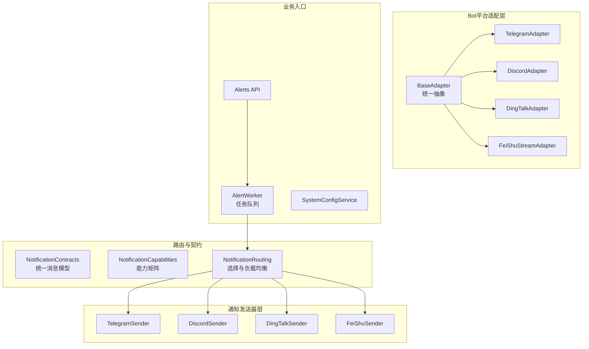
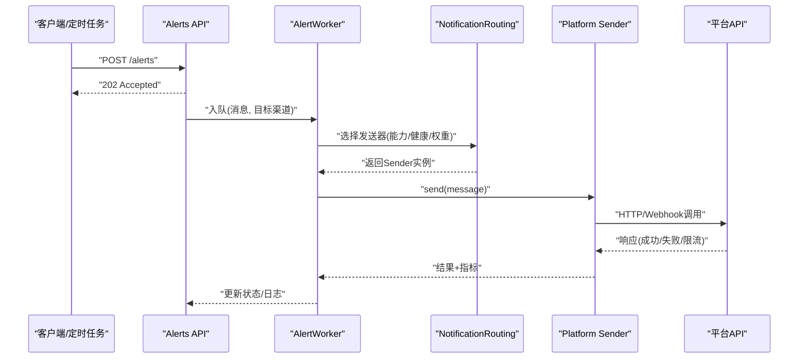
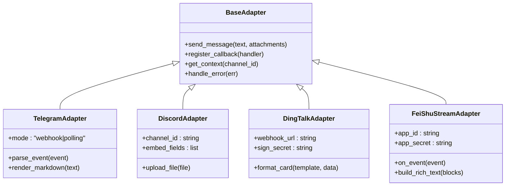
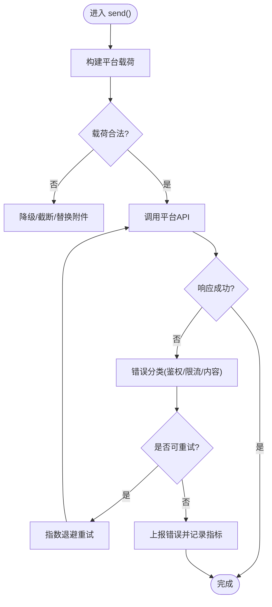
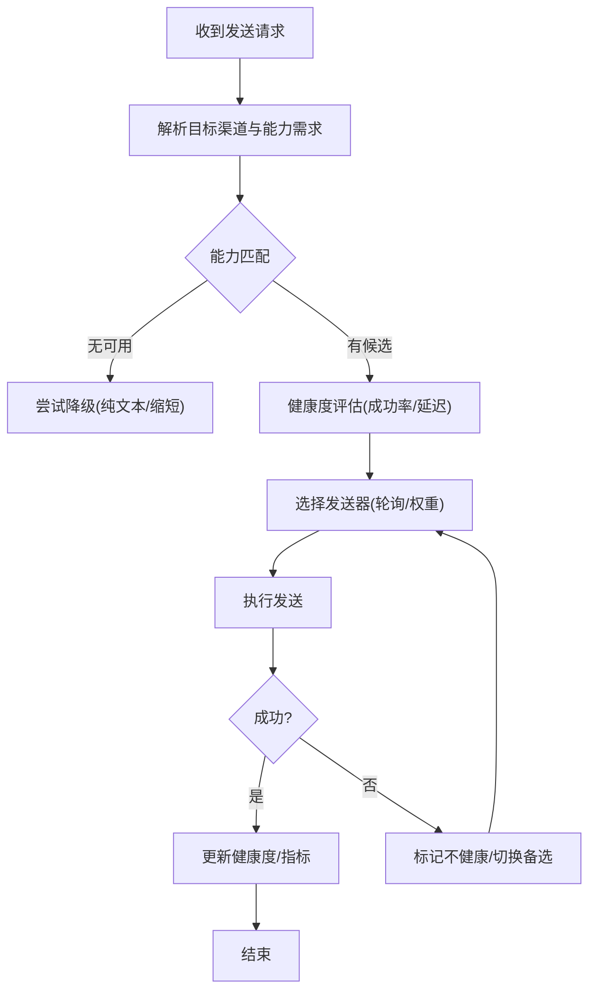
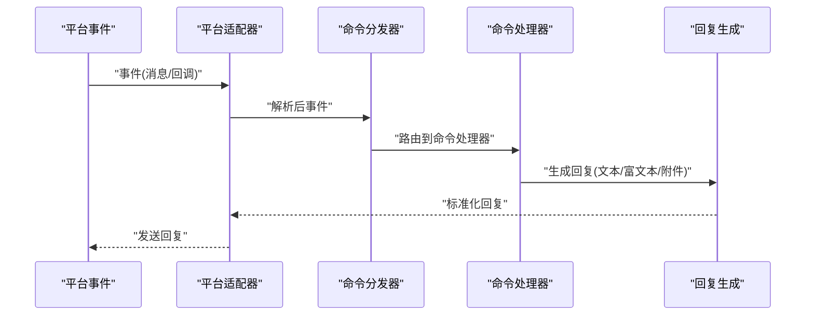
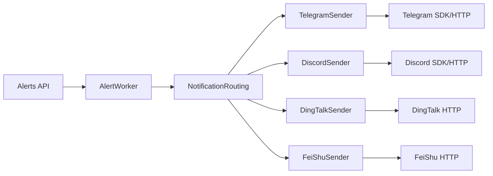

# 多平台支持

<cite>
**本文引用的文件**   
- [bot/platforms/base.py](file://bot/platforms/base.py)
- [bot/platforms/telegram.py](file://bot/platforms/telegram.py)
- [bot/platforms/discord.py](file://bot/platforms/discord.py)
- [bot/platforms/dingtalk.py](file://bot/platforms/dingtalk.py)
- [bot/platforms/dingtalk_stream.py](file://bot/platforms/dingtalk_stream.py)
- [bot/platforms/feishu_stream.py](file://bot/platforms/feishu_stream.py)
- [src/notification_sender/telegram_sender.py](file://src/notification_sender/telegram_sender.py)
- [src/notification_sender/discord_sender.py](file://src/notification_sender/discord_sender.py)
- [src/notification_sender/dingtalk_sender.py](file://src/notification_sender/dingtalk_sender.py)
- [src/notification_sender/feishu_sender.py](file://src/notification_sender/feishu_sender.py)
- [src/notification_contracts.py](file://src/notification_contracts.py)
- [src/notification_capabilities.py](file://src/notification_capabilities.py)
- [src/notification_routing.py](file://src/notification_routing.py)
- [src/notification.py](file://src/notification.py)
- [src/services/alert_worker.py](file://src/services/alert_worker.py)
- [src/services/system_config_service.py](file://src/services/system_config_service.py)
- [api/v1/endpoints/alerts.py](file://api/v1/endpoints/alerts.py)
- [api/v1/schemas/alerts.py](file://api/v1/schemas/alerts.py)
- [bot/dispatcher.py](file://bot/dispatcher.py)
- [bot/handler.py](file://bot/handler.py)
- [bot/models.py](file://bot/models.py)
</cite>

## 目录
1. [简介](#简介)
2. [项目结构](#项目结构)
3. [核心组件](#核心组件)
4. [架构总览](#架构总览)
5. [详细组件分析](#详细组件分析)
6. [依赖关系分析](#依赖关系分析)
7. [性能考虑](#性能考虑)
8. [故障排除指南](#故障排除指南)
9. [结论](#结论)
10. [附录：平台配置示例与最佳实践](#附录：平台配置示例与最佳实践)

## 简介
本文件面向Daily Stock Analysis的多平台通知与机器人集成，覆盖Telegram、Discord、钉钉、飞书四大平台。文档从系统架构、组件职责、数据流、错误处理、能力差异、配置步骤到排错与优化建议进行系统化说明，帮助读者快速完成平台接入并稳定运行。

## 项目结构
多平台支持由“Bot平台适配层”和“通知发送器层”共同构成：
- Bot平台适配层（bot/platforms）：负责消息收发、事件解析、会话上下文与命令路由，提供统一的平台抽象接口。
- 通知发送器层（src/notification_sender）：面向告警与报告推送，封装各平台的HTTP/Webhook API调用、富文本与附件上传、重试与限流。
- 路由与契约（src/notification_*.py）：定义统一的消息模型、能力声明与路由策略，屏蔽平台差异。
- 业务入口（API与服务）：通过API端点触发告警与通知，服务层协调调度与持久化。

图表来源
- [bot/platforms/base.py](file://bot/platforms/base.py)
- [bot/platforms/telegram.py](file://bot/platforms/telegram.py)
- [bot/platforms/discord.py](file://bot/platforms/discord.py)
- [bot/platforms/dingtalk.py](file://bot/platforms/dingtalk.py)
- [bot/platforms/dingtalk_stream.py](file://bot/platforms/dingtalk_stream.py)
- [bot/platforms/feishu_stream.py](file://bot/platforms/feishu_stream.py)
- [src/notification_sender/telegram_sender.py](file://src/notification_sender/telegram_sender.py)
- [src/notification_sender/discord_sender.py](file://src/notification_sender/discord_sender.py)
- [src/notification_sender/dingtalk_sender.py](file://src/notification_sender/dingtalk_sender.py)
- [src/notification_sender/feishu_sender.py](file://src/notification_sender/feishu_sender.py)
- [src/notification_contracts.py](file://src/notification_contracts.py)
- [src/notification_capabilities.py](file://src/notification_capabilities.py)
- [src/notification_routing.py](file://src/notification_routing.py)
- [api/v1/endpoints/alerts.py](file://api/v1/endpoints/alerts.py)
- [src/services/alert_worker.py](file://src/services/alert_worker.py)
- [src/services/system_config_service.py](file://src/services/system_config_service.py)

章节来源
- [bot/platforms/base.py](file://bot/platforms/base.py)
- [src/notification_contracts.py](file://src/notification_contracts.py)
- [src/notification_capabilities.py](file://src/notification_capabilities.py)
- [src/notification_routing.py](file://src/notification_routing.py)
- [api/v1/endpoints/alerts.py](file://api/v1/endpoints/alerts.py)
- [src/services/alert_worker.py](file://src/services/alert_worker.py)

## 核心组件
- 平台适配器基类（BaseAdapter）：定义统一的消息发送、接收、回调注册、会话状态等接口，所有平台实现需遵循该契约。
- 平台具体实现：
  - TelegramAdapter：基于官方SDK或Webhook，支持长消息分片、Markdown/HTML渲染、图片/文件上传。
  - DiscordAdapter：基于REST/WS，支持Embed富文本、附件上传、频道权限控制。
  - DingTalkAdapter/DingTalkStreamAdapter：基于Webhook与Stream模式，支持Markdown、ActionCard、消息卡片、文件上传。
  - FeiShuStreamAdapter：基于飞书Stream事件订阅，支持富文本块、消息卡片、图片与文件。
- 通知发送器：
  - TelegramSender/DiscordSender/DingTalkSender/FeiShuSender：封装各平台HTTP API，统一输入为内部消息模型，输出平台特定格式；包含重试、限流、错误分类与上报。
- 路由与能力：
  - NotificationContracts：统一消息体（标题、正文、附件、富文本片段、目标渠道等）。
  - NotificationCapabilities：描述各平台对富文本、附件、长度限制等的支持矩阵。
  - NotificationRouting：根据目标渠道、优先级、负载与健康度选择发送器实例，支持轮询与权重。

章节来源
- [bot/platforms/base.py](file://bot/platforms/base.py)
- [src/notification_sender/telegram_sender.py](file://src/notification_sender/telegram_sender.py)
- [src/notification_sender/discord_sender.py](file://src/notification_sender/discord_sender.py)
- [src/notification_sender/dingtalk_sender.py](file://src/notification_sender/dingtalk_sender.py)
- [src/notification_sender/feishu_sender.py](file://src/notification_sender/feishu_sender.py)
- [src/notification_contracts.py](file://src/notification_contracts.py)
- [src/notification_capabilities.py](file://src/notification_capabilities.py)
- [src/notification_routing.py](file://src/notification_routing.py)

## 架构总览
整体流程分为两条主线：
- 告警/报告推送链路：API触发 → 任务入队 → 路由选择 → 发送器调用平台API → 结果回写与监控。
- Bot交互链路：平台事件 → 适配器解析 → 命令分发 → 业务处理 → 回复消息。

图表来源
- [api/v1/endpoints/alerts.py](file://api/v1/endpoints/alerts.py)
- [src/services/alert_worker.py](file://src/services/alert_worker.py)
- [src/notification_routing.py](file://src/notification_routing.py)
- [src/notification_sender/telegram_sender.py](file://src/notification_sender/telegram_sender.py)
- [src/notification_sender/discord_sender.py](file://src/notification_sender/discord_sender.py)
- [src/notification_sender/dingtalk_sender.py](file://src/notification_sender/dingtalk_sender.py)
- [src/notification_sender/feishu_sender.py](file://src/notification_sender/feishu_sender.py)

## 详细组件分析

### 平台适配器抽象与实现
- 抽象接口：统一消息发送、事件监听、回调注册、会话上下文管理、错误映射。
- 实现要点：
  - Telegram：支持MarkdownV2/HTML，超长消息自动分段；图片/文件通过upload方法；Webhook或Polling两种模式。
  - Discord：使用Embed构建富文本，支持附件上传；频道权限校验；速率限制退避。
  - 钉钉：Webhook签名校验；Markdown/ActionCard模板；Stream模式用于事件回调。
  - 飞书：Stream事件订阅；富文本块拼装；卡片消息与媒体上传。

图表来源
- [bot/platforms/base.py](file://bot/platforms/base.py)
- [bot/platforms/telegram.py](file://bot/platforms/telegram.py)
- [bot/platforms/discord.py](file://bot/platforms/discord.py)
- [bot/platforms/dingtalk.py](file://bot/platforms/dingtalk.py)
- [bot/platforms/dingtalk_stream.py](file://bot/platforms/dingtalk_stream.py)
- [bot/platforms/feishu_stream.py](file://bot/platforms/feishu_stream.py)

章节来源
- [bot/platforms/base.py](file://bot/platforms/base.py)
- [bot/platforms/telegram.py](file://bot/platforms/telegram.py)
- [bot/platforms/discord.py](file://bot/platforms/discord.py)
- [bot/platforms/dingtalk.py](file://bot/platforms/dingtalk.py)
- [bot/platforms/dingtalk_stream.py](file://bot/platforms/dingtalk_stream.py)
- [bot/platforms/feishu_stream.py](file://bot/platforms/feishu_stream.py)

### 通知发送器与消息转换
- 统一输入：内部消息模型（标题、正文、富文本片段、附件列表、目标渠道、优先级）。
- 平台转换：将内部模型转换为平台特定格式（Markdown/HTML/Embed/卡片），处理附件上传与大小限制。
- 错误处理：网络异常、鉴权失败、限流、内容违规等分类，配合重试与降级策略。
- 可观测性：记录请求耗时、成功率、错误码分布，便于监控与告警。

图表来源
- [src/notification_sender/telegram_sender.py](file://src/notification_sender/telegram_sender.py)
- [src/notification_sender/discord_sender.py](file://src/notification_sender/discord_sender.py)
- [src/notification_sender/dingtalk_sender.py](file://src/notification_sender/dingtalk_sender.py)
- [src/notification_sender/feishu_sender.py](file://src/notification_sender/feishu_sender.py)
- [src/notification_contracts.py](file://src/notification_contracts.py)

章节来源
- [src/notification_sender/telegram_sender.py](file://src/notification_sender/telegram_sender.py)
- [src/notification_sender/discord_sender.py](file://src/notification_sender/discord_sender.py)
- [src/notification_sender/dingtalk_sender.py](file://src/notification_sender/dingtalk_sender.py)
- [src/notification_sender/feishu_sender.py](file://src/notification_sender/feishu_sender.py)
- [src/notification_contracts.py](file://src/notification_contracts.py)

### 路由与负载均衡
- 能力匹配：根据目标渠道与所需能力（富文本、附件、长度）筛选可用发送器。
- 健康检查：基于最近成功率、延迟、错误率动态调整权重。
- 负载均衡：轮询、加权随机、就近优先（按地域/域名）等策略。
- 降级策略：当主通道不可用时自动切换到备用通道或降级为纯文本。

图表来源
- [src/notification_routing.py](file://src/notification_routing.py)
- [src/notification_capabilities.py](file://src/notification_capabilities.py)

章节来源
- [src/notification_routing.py](file://src/notification_routing.py)
- [src/notification_capabilities.py](file://src/notification_capabilities.py)

### Bot命令与事件分发
- 事件解析：平台事件统一解析为内部事件对象（用户、渠道、消息、时间戳）。
- 命令路由：根据命令前缀与参数路由到对应处理器（分析、历史、市场、策略等）。
- 上下文管理：维护会话上下文（用户偏好、最近查询、权限）。
- 错误处理：命令参数校验、权限不足、平台限制等错误统一返回友好提示。

图表来源
- [bot/dispatcher.py](file://bot/dispatcher.py)
- [bot/handler.py](file://bot/handler.py)
- [bot/models.py](file://bot/models.py)

章节来源
- [bot/dispatcher.py](file://bot/dispatcher.py)
- [bot/handler.py](file://bot/handler.py)
- [bot/models.py](file://bot/models.py)

## 依赖关系分析
- 平台适配器依赖各自SDK或HTTP库，封装鉴权、签名、速率限制。
- 通知发送器依赖HTTP客户端与重试库，统一错误分类与指标上报。
- 路由模块依赖配置服务获取渠道白名单、权重与健康阈值。
- API层依赖任务队列与服务编排，确保高并发下的稳定性。

图表来源
- [api/v1/endpoints/alerts.py](file://api/v1/endpoints/alerts.py)
- [src/services/alert_worker.py](file://src/services/alert_worker.py)
- [src/notification_routing.py](file://src/notification_routing.py)
- [src/notification_sender/telegram_sender.py](file://src/notification_sender/telegram_sender.py)
- [src/notification_sender/discord_sender.py](file://src/notification_sender/discord_sender.py)
- [src/notification_sender/dingtalk_sender.py](file://src/notification_sender/dingtalk_sender.py)
- [src/notification_sender/feishu_sender.py](file://src/notification_sender/feishu_sender.py)

章节来源
- [api/v1/endpoints/alerts.py](file://api/v1/endpoints/alerts.py)
- [src/services/alert_worker.py](file://src/services/alert_worker.py)
- [src/notification_routing.py](file://src/notification_routing.py)

## 性能考虑
- 连接池与复用：HTTP客户端启用连接池，减少握手开销。
- 异步与并发：I/O密集型操作采用异步，避免阻塞主线程。
- 批量与合并：对短消息进行批处理，降低API调用次数。
- 缓存与预热：热点配置与元数据缓存，减少重复计算。
- 限流与退避：遵循平台速率限制，指数退避与熔断保护。
- 资源裁剪：大附件压缩、图片尺寸限制、富文本精简。

[本节为通用指导，无需引用具体文件]

## 故障排除指南
- 鉴权失败：检查API密钥、Webhook签名、权限范围；确认渠道已启用且未过期。
- 限流错误：降低发送频率，启用退避重试；必要时拆分消息或降级为纯文本。
- 内容违规：检查富文本语法、敏感词过滤、长度限制；必要时截断或替换。
- 附件上传失败：确认文件大小与类型；检查存储空间与权限；改用URL链接。
- 路由异常：查看健康度与权重配置；临时禁用不稳定渠道；启用备用通道。
- 日志定位：开启调试日志，关注错误分类与堆栈；结合指标面板定位瓶颈。

章节来源
- [src/notification_sender/telegram_sender.py](file://src/notification_sender/telegram_sender.py)
- [src/notification_sender/discord_sender.py](file://src/notification_sender/discord_sender.py)
- [src/notification_sender/dingtalk_sender.py](file://src/notification_sender/dingtalk_sender.py)
- [src/notification_sender/feishu_sender.py](file://src/notification_sender/feishu_sender.py)
- [src/notification_routing.py](file://src/notification_routing.py)

## 结论
Daily Stock Analysis通过“平台适配器 + 通知发送器 + 路由与契约”的分层设计，实现了Telegram、Discord、钉钉、飞书的统一接入与稳定推送。借助能力矩阵、健康检查与负载均衡，系统在复杂环境下具备高可用与可扩展性。按照本文的配置与排错指南，可快速完成平台集成并优化性能。

[本节为总结，无需引用具体文件]

## 附录：平台配置示例与最佳实践

### Telegram
- 获取Bot令牌：在BotFather中创建Bot并复制Token。
- Webhook设置：部署后端并设置Webhook URL，确保公网可达与HTTPS。
- 权限配置：Bot需加入目标群组/频道，并允许接收消息。
- 富文本与附件：支持MarkdownV2/HTML；图片/文件上传注意大小限制。
- 最佳实践：启用连接池与重试；长消息分段；敏感信息脱敏。

章节来源
- [src/notification_sender/telegram_sender.py](file://src/notification_sender/telegram_sender.py)
- [bot/platforms/telegram.py](file://bot/platforms/telegram.py)

### Discord
- 创建应用与Bot：在开发者门户创建应用并添加Bot角色。
- 邀请Bot：生成邀请链接并将Bot加入目标频道。
- 权限配置：启用必要的服务器/频道权限（发送消息、嵌入、附件）。
- 富文本与附件：使用Embed构建结构化内容；附件大小受平台限制。
- 最佳实践：合理设置Rate Limit；避免频繁重发；使用Channel ID精准投递。

章节来源
- [src/notification_sender/discord_sender.py](file://src/notification_sender/discord_sender.py)
- [bot/platforms/discord.py](file://bot/platforms/discord.py)

### 钉钉
- 自定义机器人：在群设置中添加自定义机器人，获取Webhook地址与签名密钥。
- Webhook安全：启用加签或IP白名单，确保请求合法性。
- 消息格式：支持Markdown、ActionCard、消息卡片；注意字段长度与富文本语法。
- Stream模式：用于事件回调，需配置AppID/AppSecret与事件订阅。
- 最佳实践：控制消息频率；附件转外链；错误重试与降级。

章节来源
- [src/notification_sender/dingtalk_sender.py](file://src/notification_sender/dingtalk_sender.py)
- [bot/platforms/dingtalk.py](file://bot/platforms/dingtalk.py)
- [bot/platforms/dingtalk_stream.py](file://bot/platforms/dingtalk_stream.py)

### 飞书
- 创建企业自建应用：在飞书开放平台创建应用，获取AppID/AppSecret。
- 权限配置：开通消息发送、文件上传、事件订阅等权限。
- 富文本与卡片：使用富文本块与消息卡片展示结构化内容。
- Stream事件：订阅事件以接收用户交互与回调。
- 最佳实践：控制卡片复杂度；附件压缩与外链替代；错误分类与重试。

章节来源
- [src/notification_sender/feishu_sender.py](file://src/notification_sender/feishu_sender.py)
- [bot/platforms/feishu_stream.py](file://bot/platforms/feishu_stream.py)

### 平台选择策略与负载均衡
- 选择策略：根据目标受众、功能需求（富文本/附件）、合规要求选择平台。
- 负载均衡：基于健康度与权重动态分配；失败自动切换；容量上限保护。
- 降级策略：富文本降级为纯文本；附件降级为链接；高频场景限流。

章节来源
- [src/notification_routing.py](file://src/notification_routing.py)
- [src/notification_capabilities.py](file://src/notification_capabilities.py)

### 配置管理与验证
- 集中配置：通过系统配置服务统一管理渠道密钥、URL、权限与开关。
- 配置校验：启动时校验必填项与连通性，失败则告警并禁用渠道。
- 热更新：支持运行时更新部分配置，不影响正在进行的任务。

章节来源
- [src/services/system_config_service.py](file://src/services/system_config_service.py)
- [api/v1/schemas/alerts.py](file://api/v1/schemas/alerts.py)