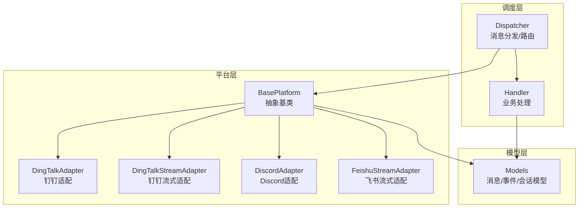
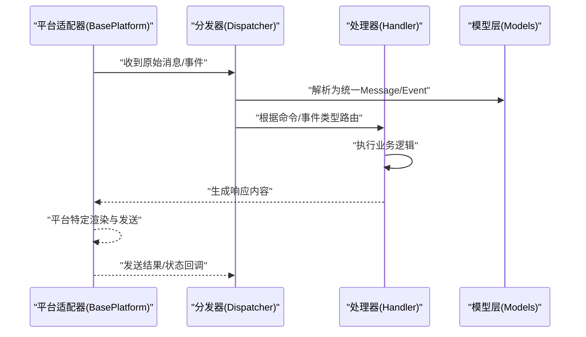
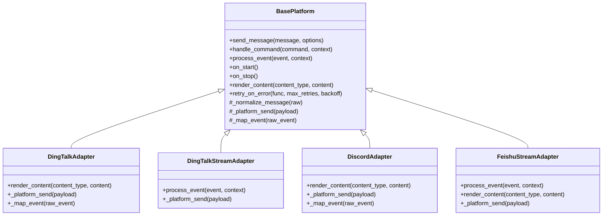
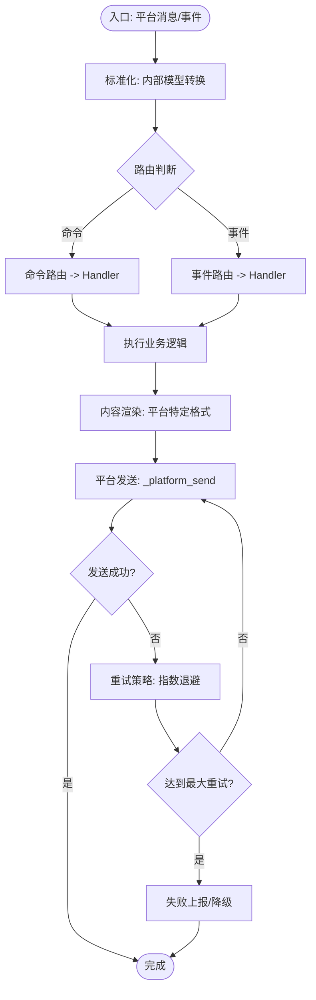
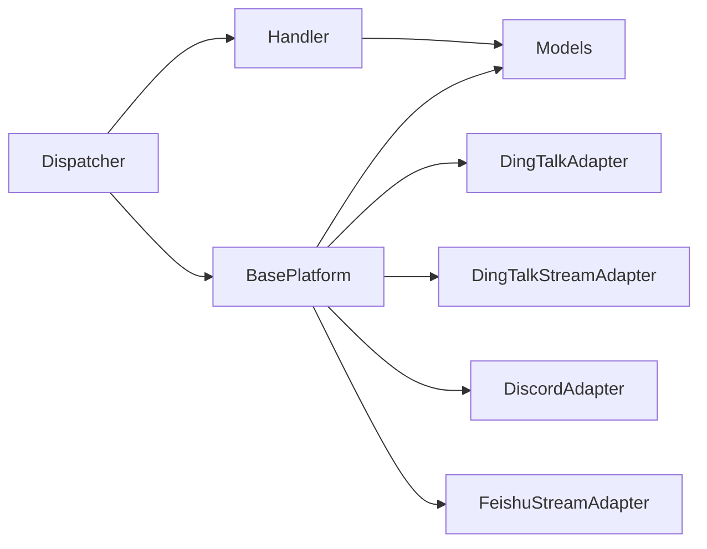

# 平台适配器基础架构

<cite>
**本文档引用的文件**   
- [bot/platforms/base.py](file://bot/platforms/base.py)
- [bot/platforms/dingtalk.py](file://bot/platforms/dingtalk.py)
- [bot/platforms/dingtalk_stream.py](file://bot/platforms/dingtalk_stream.py)
- [bot/platforms/discord.py](file://bot/platforms/discord.py)
- [bot/platforms/feishu_stream.py](file://bot/platforms/feishu_stream.py)
- [bot/dispatcher.py](file://bot/dispatcher.py)
- [bot/handler.py](file://bot/handler.py)
- [bot/models.py](file://bot/models.py)
</cite>

## 目录
1. [简介](#简介)
2. [项目结构](#项目结构)
3. [核心组件](#核心组件)
4. [架构总览](#架构总览)
5. [详细组件分析](#详细组件分析)
6. [依赖关系分析](#依赖关系分析)
7. [性能考虑](#性能考虑)
8. [故障排查指南](#故障排查指南)
9. [结论](#结论)
10. [附录：自定义平台适配器开发指南](#附录自定义平台适配器开发指南)

## 简介
本文件面向“平台适配器基础架构”，聚焦于 bot 模块中的统一平台抽象与多平台适配实现。文档将系统阐述 BasePlatform 抽象类的设计模式、核心接口定义（如 send_message、handle_command、process_event）、消息处理流程、事件监听机制、生命周期管理、消息格式转换机制（含富文本渲染差异）、错误处理与重试机制，以及平台配置管理与动态加载机制。同时提供自定义平台适配器的开发指南，帮助开发者快速扩展新的聊天或通知平台。

## 项目结构
bot 模块围绕“平台抽象 + 具体平台实现 + 分发器 + 处理器”组织代码，形成清晰的分层与职责边界：
- 平台抽象与实现：bot/platforms 下包含 BasePlatform 抽象类与各平台的具体实现（钉钉、飞书、Discord 等）。
- 分发与处理：bot/dispatcher.py 负责消息路由与命令分发；bot/handler.py 负责业务逻辑处理。
- 数据模型：bot/models.py 定义跨平台统一的消息、事件、会话等数据结构。

图表来源
- [bot/platforms/base.py](file://bot/platforms/base.py)
- [bot/platforms/dingtalk.py](file://bot/platforms/dingtalk.py)
- [bot/platforms/dingtalk_stream.py](file://bot/platforms/dingtalk_stream.py)
- [bot/platforms/discord.py](file://bot/platforms/discord.py)
- [bot/platforms/feishu_stream.py](file://bot/platforms/feishu_stream.py)
- [bot/dispatcher.py](file://bot/dispatcher.py)
- [bot/handler.py](file://bot/handler.py)
- [bot/models.py](file://bot/models.py)

章节来源
- [bot/platforms/base.py](file://bot/platforms/base.py)
- [bot/dispatcher.py](file://bot/dispatcher.py)
- [bot/handler.py](file://bot/handler.py)
- [bot/models.py](file://bot/models.py)

## 核心组件
- BasePlatform 抽象类
  - 定义平台适配的统一契约：发送消息、处理命令、处理事件、生命周期钩子、错误处理与重试策略、富文本渲染能力等。
  - 提供可复用的通用逻辑（如日志记录、超时控制、重试封装、消息标准化），子类只需关注平台特定细节。
- 具体平台适配器
  - DingTalkAdapter/DingTalkStreamAdapter：对接钉钉 API/流式接口，支持文本、卡片、富文本等消息类型。
  - DiscordAdapter：对接 Discord Bot 接口，支持嵌入、按钮、选择框等富交互元素。
  - FeishuStreamAdapter：对接飞书流式接口，支持 Markdown、富文本卡片等。
- Dispatcher（分发器）
  - 接收原始消息，解析平台元数据，转换为内部模型，按命令/事件路由到 Handler。
- Handler（处理器）
  - 执行具体的业务逻辑（如分析、查询、回写结果），并调用平台适配器的发送能力返回响应。
- Models（模型）
  - 统一的 Message、Event、Session、Command 等数据结构，屏蔽平台差异。

章节来源
- [bot/platforms/base.py](file://bot/platforms/base.py)
- [bot/platforms/dingtalk.py](file://bot/platforms/dingtalk.py)
- [bot/platforms/dingtalk_stream.py](file://bot/platforms/dingtalk_stream.py)
- [bot/platforms/discord.py](file://bot/platforms/discord.py)
- [bot/platforms/feishu_stream.py](file://bot/platforms/feishu_stream.py)
- [bot/dispatcher.py](file://bot/dispatcher.py)
- [bot/handler.py](file://bot/handler.py)
- [bot/models.py](file://bot/models.py)

## 架构总览
下图展示从平台消息进入，到内部模型转换、命令分发、业务处理、再到平台回复的完整流程。

图表来源
- [bot/dispatcher.py](file://bot/dispatcher.py)
- [bot/handler.py](file://bot/handler.py)
- [bot/models.py](file://bot/models.py)
- [bot/platforms/base.py](file://bot/platforms/base.py)

## 详细组件分析

### BasePlatform 抽象类设计
- 设计模式
  - 模板方法模式：在基类中定义消息处理主流程（接收、校验、转换、调用、重试、上报），子类重写关键步骤（如平台发送、富文本渲染）。
  - 策略模式：不同平台的富文本渲染、命令解析、事件映射作为策略注入或子类实现。
  - 观察者模式：事件监听通过回调注册，便于扩展新事件类型。
- 核心接口
  - send_message(message, options): 发送消息，支持文本、富文本、卡片、图片等。
  - handle_command(command, context): 解析并执行命令，返回结构化结果。
  - process_event(event, context): 处理平台事件（如回调、Webhook、流式片段）。
  - on_start()/on_stop(): 生命周期钩子，用于初始化连接、资源清理。
  - render_content(content_type, content): 富文本渲染策略，不同平台差异化处理。
  - retry_on_error(func, max_retries, backoff): 统一重试封装。
- 错误处理与重试
  - 捕获网络异常、鉴权失败、限流等错误，按策略进行指数退避重试。
  - 失败时记录上下文（消息ID、平台、时间戳、错误码），便于追踪与告警。
- 消息格式转换
  - 内部统一模型（如 Message、ContentBlock）与平台特定格式之间的双向转换。
  - 富文本差异：Markdown、HTML、卡片 JSON 等映射规则由 render_content 策略决定。

图表来源
- [bot/platforms/base.py](file://bot/platforms/base.py)
- [bot/platforms/dingtalk.py](file://bot/platforms/dingtalk.py)
- [bot/platforms/dingtalk_stream.py](file://bot/platforms/dingtalk_stream.py)
- [bot/platforms/discord.py](file://bot/platforms/discord.py)
- [bot/platforms/feishu_stream.py](file://bot/platforms/feishu_stream.py)

章节来源
- [bot/platforms/base.py](file://bot/platforms/base.py)
- [bot/platforms/dingtalk.py](file://bot/platforms/dingtalk.py)
- [bot/platforms/dingtalk_stream.py](file://bot/platforms/dingtalk_stream.py)
- [bot/platforms/discord.py](file://bot/platforms/discord.py)
- [bot/platforms/feishu_stream.py](file://bot/platforms/feishu_stream.py)

### 消息处理流程与事件监听
- 消息进入
  - 平台适配器接收原始消息/事件，调用 _normalize_message/_map_event 转为内部模型。
- 分发与路由
  - Dispatcher 根据命令前缀、事件类型、频道/群组上下文，路由到对应 Handler。
- 业务处理
  - Handler 执行业务逻辑（如调用分析服务、查询数据），生成响应内容。
- 平台渲染与发送
  - BasePlatform.render_content 将统一内容块转换为平台特定格式（文本、卡片、Markdown、富文本）。
  - _platform_send 调用平台 SDK/API 发送消息，并处理响应与错误。
- 事件监听
  - 通过回调注册机制监听平台事件（如 Webhook、流式片段），统一转换为内部 Event 模型后进入分发流程。

图表来源
- [bot/dispatcher.py](file://bot/dispatcher.py)
- [bot/handler.py](file://bot/handler.py)
- [bot/platforms/base.py](file://bot/platforms/base.py)

章节来源
- [bot/dispatcher.py](file://bot/dispatcher.py)
- [bot/handler.py](file://bot/handler.py)
- [bot/platforms/base.py](file://bot/platforms/base.py)

### 平台适配器的统一接口规范
- send_message
  - 输入：统一消息对象（含文本、附件、富文本块等）。
  - 行为：根据 content_type 调用 render_content 生成平台 payload，再调用 _platform_send。
  - 输出：发送结果（成功/失败、消息ID、平台回执）。
- handle_command
  - 输入：命令字符串与上下文（用户、频道、权限等）。
  - 行为：解析命令参数、校验权限、路由到具体命令处理器。
  - 输出：结构化结果（文本、卡片、操作按钮等）。
- process_event
  - 输入：平台事件（Webhook、流式片段、回调）。
  - 行为：事件去重、签名校验、转换为内部 Event。
  - 输出：触发相应 Handler 或回调。
- render_content
  - 输入：内容类型与内容块。
  - 行为：平台特定的富文本/卡片/Markdown 渲染。
  - 输出：平台原生 payload。
- 生命周期
  - on_start：建立连接、加载配置、预热资源。
  - on_stop：关闭连接、释放资源、持久化状态。

章节来源
- [bot/platforms/base.py](file://bot/platforms/base.py)
- [bot/platforms/dingtalk.py](file://bot/platforms/dingtalk.py)
- [bot/platforms/dingtalk_stream.py](file://bot/platforms/dingtalk_stream.py)
- [bot/platforms/discord.py](file://bot/platforms/discord.py)
- [bot/platforms/feishu_stream.py](file://bot/platforms/feishu_stream.py)

### 消息格式转换机制
- 内部模型
  - Message：包含 sender、receiver、content_blocks、metadata。
  - ContentBlock：文本、图片、链接、卡片、表格等类型。
- 平台映射
  - 钉钉：Markdown/卡片 JSON，支持按钮、跳转、富文本。
  - 飞书：Markdown/富文本卡片，支持交互式组件。
  - Discord：Embed、ActionRow、Button、SelectMenu。
- 渲染差异
  - 长度限制、字符集、富文本标签、图片上传方式、卡片布局等差异由 render_content 策略处理。
- 转换流程
  - 统一模型 -> 平台特定 payload -> 发送 -> 回执解析 -> 统一结果。

章节来源
- [bot/models.py](file://bot/models.py)
- [bot/platforms/base.py](file://bot/platforms/base.py)
- [bot/platforms/dingtalk.py](file://bot/platforms/dingtalk.py)
- [bot/platforms/discord.py](file://bot/platforms/discord.py)
- [bot/platforms/feishu_stream.py](file://bot/platforms/feishu_stream.py)

### 错误处理与重试机制
- 错误分类
  - 网络错误（超时、连接失败）、鉴权错误（Token 过期）、限流（Rate Limit）、业务错误（参数非法）。
- 重试策略
  - 指数退避、抖动、最大重试次数、熔断降级。
- 上下文记录
  - 记录消息ID、平台、时间戳、错误码、堆栈，便于追踪与告警。
- 降级方案
  - 失败时尝试备用通道（如邮件/短信）、缓存最近结果、返回友好提示。

章节来源
- [bot/platforms/base.py](file://bot/platforms/base.py)

## 依赖关系分析
- 组件耦合
  - BasePlatform 被各平台适配器继承，低耦合高内聚。
  - Dispatcher 依赖 Models 与 Handler，对平台无感知。
  - Handler 依赖业务服务与 Models，不直接访问平台 SDK。
- 外部依赖
  - 各平台 SDK/API（钉钉、飞书、Discord）。
  - 配置中心/环境变量（用于动态加载平台配置）。
- 潜在循环依赖
  - 通过 Models 解耦，避免平台与业务之间直接引用。

图表来源
- [bot/platforms/base.py](file://bot/platforms/base.py)
- [bot/platforms/dingtalk.py](file://bot/platforms/dingtalk.py)
- [bot/platforms/dingtalk_stream.py](file://bot/platforms/dingtalk_stream.py)
- [bot/platforms/discord.py](file://bot/platforms/discord.py)
- [bot/platforms/feishu_stream.py](file://bot/platforms/feishu_stream.py)
- [bot/dispatcher.py](file://bot/dispatcher.py)
- [bot/handler.py](file://bot/handler.py)
- [bot/models.py](file://bot/models.py)

章节来源
- [bot/platforms/base.py](file://bot/platforms/base.py)
- [bot/dispatcher.py](file://bot/dispatcher.py)
- [bot/handler.py](file://bot/handler.py)
- [bot/models.py](file://bot/models.py)

## 性能考虑
- 异步与非阻塞
  - 平台发送与事件处理采用异步 IO，避免阻塞主线程。
- 批处理与合并
  - 高频消息合并发送，减少 API 调用次数。
- 缓存与预取
  - 热点数据（如用户信息、频道配置）缓存，降低重复请求。
- 限流与背压
  - 针对平台限流策略进行自适应调整，避免雪崩。
- 资源管理
  - 连接池、HTTP 客户端复用，减少握手开销。

[本节为通用指导，无需列出具体文件来源]

## 故障排查指南
- 常见问题
  - 鉴权失败：检查 Token、密钥、权限范围。
  - 限流错误：调整重试间隔、降低频率、启用队列。
  - 富文本渲染异常：确认内容长度、标签合法性、平台特性。
  - 事件丢失：检查签名校验、去重逻辑、回调地址。
- 诊断步骤
  - 查看日志（错误码、堆栈、上下文）。
  - 回放消息（原始 payload 与转换后 payload）。
  - 模拟测试（本地 Mock 平台接口）。
- 恢复策略
  - 自动重试、降级通道、人工介入。

章节来源
- [bot/platforms/base.py](file://bot/platforms/base.py)

## 结论
BasePlatform 抽象类提供了稳定、可扩展的平台适配器基础架构，通过统一接口、模板方法、策略模式与重试机制，屏蔽了多平台差异，提升了系统的可维护性与可移植性。Dispatcher 与 Handler 的职责分离使消息处理流程清晰可控，Models 的统一数据模型确保跨平台一致性。遵循本文档的规范与指南，开发者可以快速扩展新的平台适配器，并保持整体架构的稳定与高性能。

[本节为总结，无需列出具体文件来源]

## 附录：自定义平台适配器开发指南
- 步骤概览
  - 继承 BasePlatform，实现必要方法。
  - 实现 send_message、handle_command、process_event、render_content、_platform_send。
  - 实现生命周期钩子 on_start/on_stop。
  - 注册平台配置与动态加载。
- 必要方法重写
  - send_message：调用 render_content 生成平台 payload，再调用 _platform_send。
  - handle_command：解析命令、校验权限、路由到业务处理器。
  - process_event：事件签名校验、去重、转换为内部 Event。
  - render_content：平台特定富文本/卡片/Markdown 渲染。
  - _platform_send：调用平台 SDK/API 发送消息，处理响应与错误。
  - on_start/on_stop：初始化连接、加载配置、释放资源。
- 示例要点
  - 参考钉钉、飞书、Discord 的实现，理解平台差异与最佳实践。
  - 使用 BasePlatform.retry_on_error 封装重试逻辑。
  - 使用 Models 统一消息与事件结构，避免平台耦合。
- 配置管理与动态加载
  - 通过配置文件或环境变量加载平台密钥、端点、超时、重试策略。
  - 在运行时动态注册新平台适配器，支持热插拔。
  - 使用 Dispatcher 的注册表机制，按平台名称或类型实例化适配器。

章节来源
- [bot/platforms/base.py](file://bot/platforms/base.py)
- [bot/platforms/dingtalk.py](file://bot/platforms/dingtalk.py)
- [bot/platforms/dingtalk_stream.py](file://bot/platforms/dingtalk_stream.py)
- [bot/platforms/discord.py](file://bot/platforms/discord.py)
- [bot/platforms/feishu_stream.py](file://bot/platforms/feishu_stream.py)
- [bot/dispatcher.py](file://bot/dispatcher.py)
- [bot/models.py](file://bot/models.py)