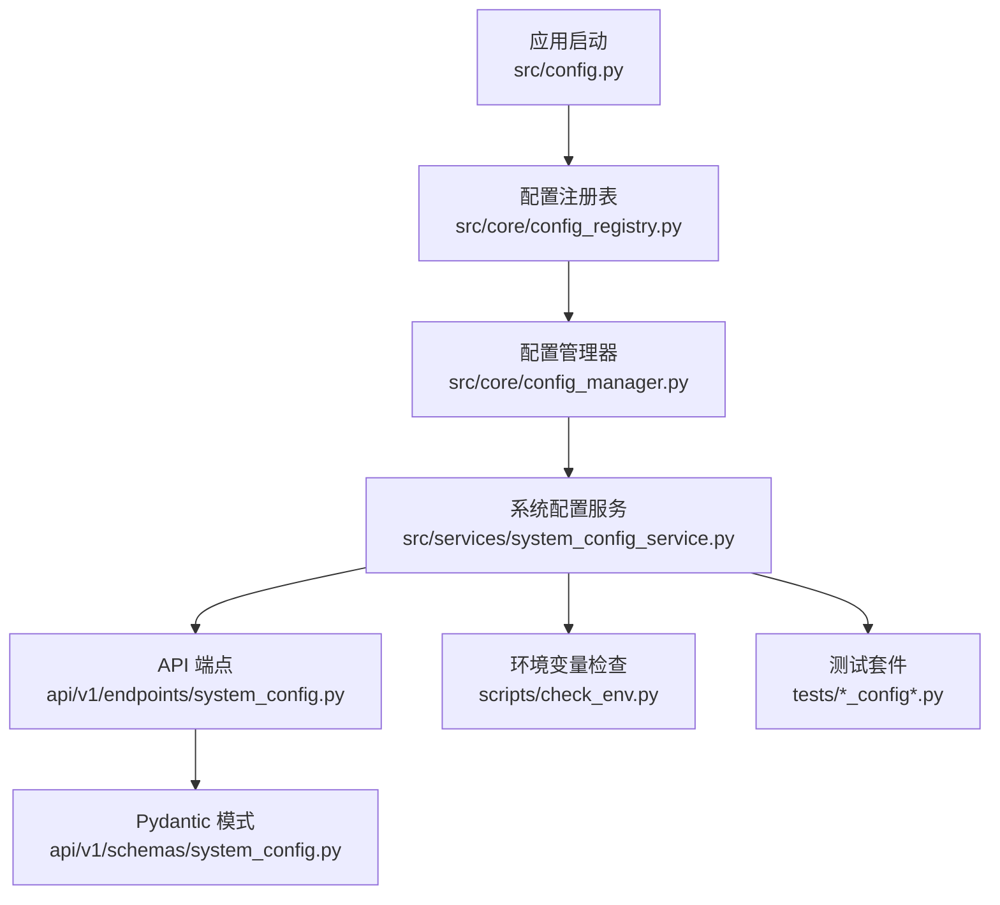
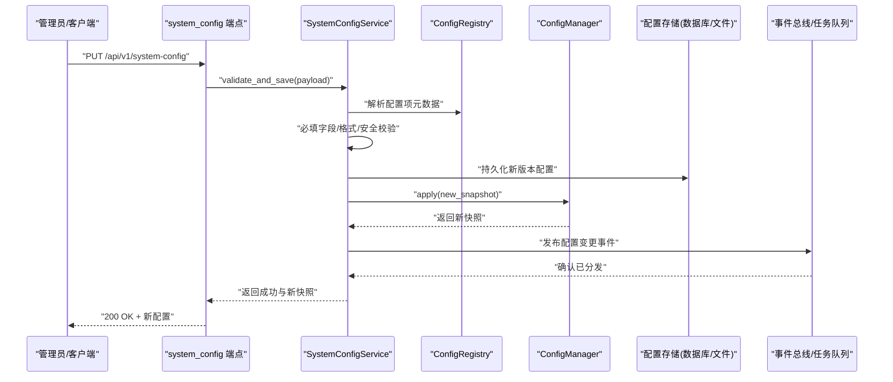
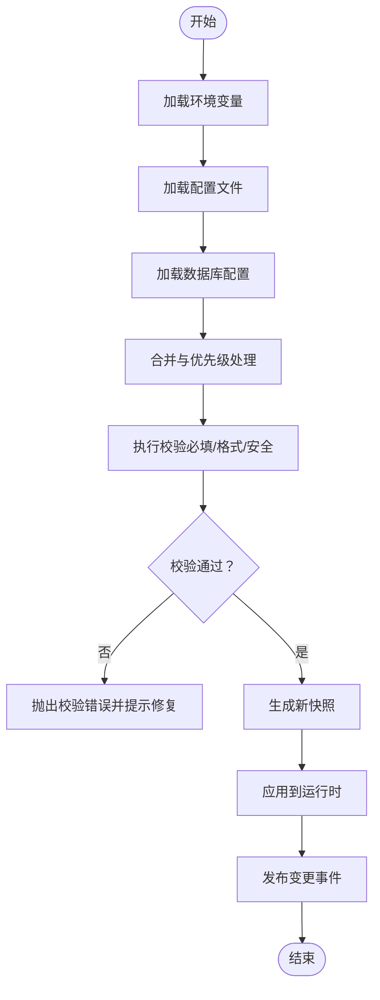
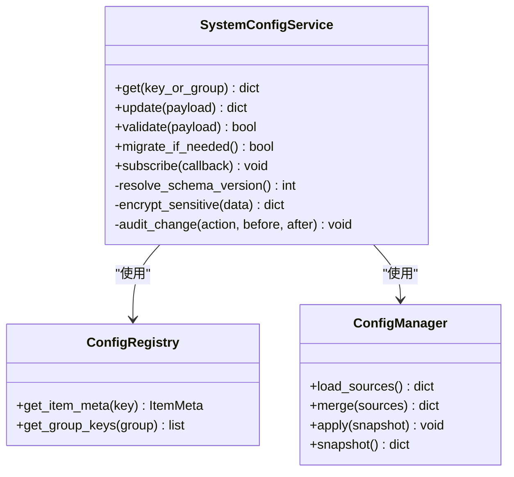
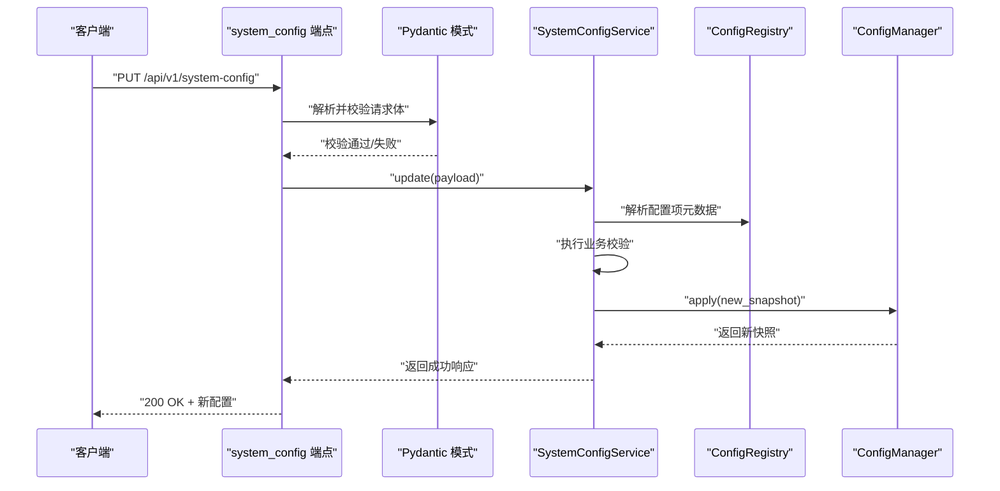
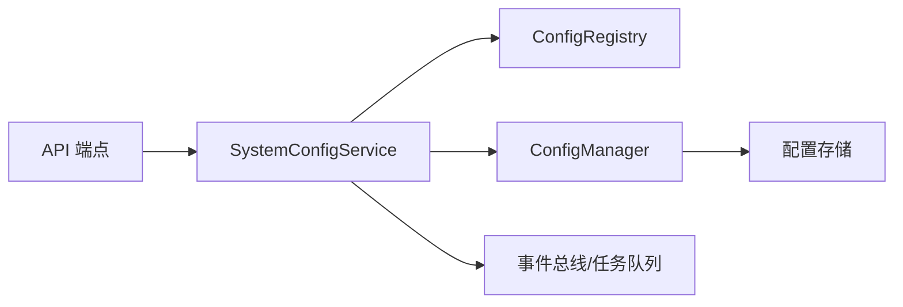

# 平台配置管理

<cite>
**本文引用的文件**   
- [src/core/config_manager.py](file://src/core/config_manager.py)
- [src/core/config_registry.py](file://src/core/config_registry.py)
- [src/services/system_config_service.py](file://src/services/system_config_service.py)
- [api/v1/endpoints/system_config.py](file://api/v1/endpoints/system_config.py)
- [api/v1/schemas/system_config.py](file://api/v1/schemas/system_config.py)
- [src/config.py](file://src/config.py)
- [scripts/check_env.py](file://scripts/check_env.py)
- [tests/test_config_manager.py](file://tests/test_config_manager.py)
- [tests/test_system_config_service.py](file://tests/test_system_config_service.py)
- [tests/test_config_validate_structured.py](file://tests/test_config_validate_structured.py)
- [tests/test_task_queue_config_sync.py](file://tests/test_task_queue_config_sync.py)
</cite>

## 目录
1. [简介](#简介)
2. [项目结构](#项目结构)
3. [核心组件](#核心组件)
4. [架构总览](#架构总览)
5. [详细组件分析](#详细组件分析)
6. [依赖关系分析](#依赖关系分析)
7. [性能考量](#性能考量)
8. [故障排除指南](#故障排除指南)
9. [结论](#结论)
10. [附录](#附录)

## 简介
本文件面向“平台配置管理”子系统，系统性说明多平台配置的存储结构与数据模型、配置文件格式与环境变量约定、数据库持久化与版本迁移、配置校验机制（必填字段、格式与安全）、动态加载与热更新（变更监听与实时生效）、各平台完整配置示例（API密钥、连接参数、高级选项），以及安全管理（敏感信息加密、访问控制、审计日志）和诊断排障方法。文档以代码级实现为依据，辅以可视化图示，帮助开发者与运维人员快速理解并正确使用该能力。

## 项目结构
配置管理相关代码主要分布在以下位置：
- 核心配置管理器与注册表：src/core/config_manager.py、src/core/config_registry.py
- 系统配置服务（业务编排、校验、持久化、事件广播）：src/services/system_config_service.py
- API 层（端点与请求/响应模式）：api/v1/endpoints/system_config.py、api/v1/schemas/system_config.py
- 应用启动期全局配置入口：src/config.py
- 环境变量检查脚本：scripts/check_env.py
- 测试用例覆盖配置管理、校验、同步等关键路径：tests/*_config*.py

**图表来源** 
- [src/config.py](file://src/config.py)
- [src/core/config_registry.py](file://src/core/config_registry.py)
- [src/core/config_manager.py](file://src/core/config_manager.py)
- [src/services/system_config_service.py](file://src/services/system_config_service.py)
- [api/v1/endpoints/system_config.py](file://api/v1/endpoints/system_config.py)
- [api/v1/schemas/system_config.py](file://api/v1/schemas/system_config.py)
- [scripts/check_env.py](file://scripts/check_env.py)
- [tests/test_config_manager.py](file://tests/test_config_manager.py)

**章节来源**
- [src/config.py](file://src/config.py)
- [src/core/config_registry.py](file://src/core/config_registry.py)
- [src/core/config_manager.py](file://src/core/config_manager.py)
- [src/services/system_config_service.py](file://src/services/system_config_service.py)
- [api/v1/endpoints/system_config.py](file://api/v1/endpoints/system_config.py)
- [api/v1/schemas/system_config.py](file://api/v1/schemas/system_config.py)
- [scripts/check_env.py](file://scripts/check_env.py)

## 核心组件
- 配置注册表（ConfigRegistry）：集中声明所有可配置项的元数据（名称、类型、默认值、是否敏感、是否必填、校验规则、分组等），为后续加载、校验、序列化提供统一契约。
- 配置管理器（ConfigManager）：负责从多种来源（环境变量、配置文件、数据库、内存缓存）读取与合并配置，维护运行时配置快照，支持增量更新与一致性保障。
- 系统配置服务（SystemConfigService）：对外暴露配置读写、校验、持久化、版本迁移、变更监听与事件广播能力；协调配置在进程内各模块间的同步。
- API 层（system_config 端点与 schemas）：定义 REST 接口与数据结构，承载配置的查询、更新、验证与批量操作。
- 启动期配置（config.py）：在应用初始化阶段完成基础配置加载与校验，确保服务可用。
- 环境变量检查（check_env.py）：用于本地或 CI 环境下的配置完整性检查与问题定位。

**章节来源**
- [src/core/config_registry.py](file://src/core/config_registry.py)
- [src/core/config_manager.py](file://src/core/config_manager.py)
- [src/services/system_config_service.py](file://src/services/system_config_service.py)
- [api/v1/endpoints/system_config.py](file://api/v1/endpoints/system_config.py)
- [api/v1/schemas/system_config.py](file://api/v1/schemas/system_config.py)
- [src/config.py](file://src/config.py)
- [scripts/check_env.py](file://scripts/check_env.py)

## 架构总览
下图展示配置从外部来源到运行时的整体流程，包括加载、校验、持久化、热更新与订阅通知。

**图表来源** 
- [api/v1/endpoints/system_config.py](file://api/v1/endpoints/system_config.py)
- [src/services/system_config_service.py](file://src/services/system_config_service.py)
- [src/core/config_registry.py](file://src/core/config_registry.py)
- [src/core/config_manager.py](file://src/core/config_manager.py)

## 详细组件分析

### 配置注册表（ConfigRegistry）
- 职责
  - 集中声明配置项元数据：键名、数据类型、默认值、是否必填、是否敏感、取值范围、正则/自定义校验器、分组与描述。
  - 提供按分组/键名的检索能力，供校验器与服务层使用。
- 设计要点
  - 强类型约束：通过 Pydantic 或等价结构保证输入输出一致。
  - 可扩展性：新增配置项仅需在注册表中声明，无需改动核心逻辑。
  - 安全标记：对敏感字段进行标注，便于后续加密与脱敏处理。
- 复杂度
  - 注册与查找时间复杂度近似 O(1) 或 O(log n)，取决于内部实现（字典/有序映射）。
- 优化建议
  - 对热点配置项建立索引（如按分组、按用途）。
  - 对复杂校验规则进行预编译与缓存。

**章节来源**
- [src/core/config_registry.py](file://src/core/config_registry.py)

### 配置管理器（ConfigManager）
- 职责
  - 多源加载：环境变量、配置文件、数据库、内存缓存。
  - 合并策略：优先级顺序明确（例如：环境变量 > 数据库 > 配置文件 > 默认值）。
  - 运行时快照：维护当前生效的配置视图，支持原子替换。
  - 增量更新：仅应用差异部分，减少重启成本。
- 数据流
  - 加载 → 校验 → 合并 → 快照 → 广播。
- 错误处理
  - 对缺失必填项、类型不匹配、非法值进行明确报错，并提供修复建议。
- 并发与一致性
  - 读多写少场景下采用只读快照+写时复制，避免锁竞争。
  - 更新过程具备幂等性与回滚能力。

**图表来源** 
- [src/core/config_manager.py](file://src/core/config_manager.py)

**章节来源**
- [src/core/config_manager.py](file://src/core/config_manager.py)

### 系统配置服务（SystemConfigService）
- 职责
  - 对外提供配置的查询、更新、校验、持久化、版本迁移与变更监听。
  - 协调 ConfigRegistry 与 ConfigManager，确保配置生命周期的一致性。
  - 与任务队列/事件总线集成，实现热更新与跨模块同步。
- 关键流程
  - 更新配置：接收请求 → 调用注册表解析 → 执行校验 → 持久化 → 应用快照 → 广播事件。
  - 查询配置：按键名/分组返回当前生效快照。
  - 版本迁移：检测 schema 版本变化，执行迁移脚本，保证向后兼容。
- 安全与审计
  - 敏感字段加密存储与传输脱敏。
  - 记录配置变更审计日志（谁、何时、改了什么、结果如何）。

**图表来源** 
- [src/services/system_config_service.py](file://src/services/system_config_service.py)
- [src/core/config_registry.py](file://src/core/config_registry.py)
- [src/core/config_manager.py](file://src/core/config_manager.py)

**章节来源**
- [src/services/system_config_service.py](file://src/services/system_config_service.py)

### API 端点与模式（system_config）
- 端点职责
  - GET/POST/PUT/DELETE 等操作配置项或分组。
  - 批量更新与校验，返回结构化响应。
- 模式（schemas）
  - 使用 Pydantic 定义请求/响应结构，内置必填、类型、范围、正则等校验。
  - 对敏感字段进行掩码输出，防止泄露。
- 典型调用序列

**图表来源** 
- [api/v1/endpoints/system_config.py](file://api/v1/endpoints/system_config.py)
- [api/v1/schemas/system_config.py](file://api/v1/schemas/system_config.py)
- [src/services/system_config_service.py](file://src/services/system_config_service.py)
- [src/core/config_registry.py](file://src/core/config_registry.py)
- [src/core/config_manager.py](file://src/core/config_manager.py)

**章节来源**
- [api/v1/endpoints/system_config.py](file://api/v1/endpoints/system_config.py)
- [api/v1/schemas/system_config.py](file://api/v1/schemas/system_config.py)

### 启动期配置（config.py）
- 作用
  - 在应用启动时加载基础配置，确保服务可用。
  - 触发必要的环境变量检查与最小化校验。
- 注意事项
  - 避免在启动阶段执行耗时操作。
  - 对关键配置设置合理默认值与降级策略。

**章节来源**
- [src/config.py](file://src/config.py)

### 环境变量检查（check_env.py）
- 作用
  - 检查必需环境变量是否存在且格式正确。
  - 输出诊断信息，辅助本地开发与 CI 排查。
- 使用建议
  - 在容器镜像构建或部署前运行，提前发现配置问题。

**章节来源**
- [scripts/check_env.py](file://scripts/check_env.py)

## 依赖关系分析
- 组件耦合
  - SystemConfigService 依赖 ConfigRegistry 与 ConfigManager，形成“服务层—基础设施层”的分层解耦。
  - API 层仅依赖服务层与模式层，屏蔽底层实现细节。
- 外部依赖
  - 数据库/文件存储：用于配置持久化与版本迁移。
  - 事件总线/任务队列：用于配置变更广播与热更新。
- 潜在循环依赖
  - 通过分层与接口隔离避免循环引用。
- 扩展点
  - 新增配置项只需在注册表中声明，并在必要时补充校验与迁移逻辑。

**图表来源** 
- [api/v1/endpoints/system_config.py](file://api/v1/endpoints/system_config.py)
- [src/services/system_config_service.py](file://src/services/system_config_service.py)
- [src/core/config_registry.py](file://src/core/config_registry.py)
- [src/core/config_manager.py](file://src/core/config_manager.py)

**章节来源**
- [api/v1/endpoints/system_config.py](file://api/v1/endpoints/system_config.py)
- [src/services/system_config_service.py](file://src/services/system_config_service.py)
- [src/core/config_registry.py](file://src/core/config_registry.py)
- [src/core/config_manager.py](file://src/core/config_manager.py)

## 性能考量
- 加载与合并
  - 对大体积配置启用懒加载与按需合并，减少内存占用。
  - 对热点配置项建立内存缓存，降低 I/O 压力。
- 校验与序列化
  - 预编译校验规则，避免重复解析。
  - 对敏感字段进行选择性序列化，减少网络传输开销。
- 并发与一致性
  - 读路径无锁快照，写路径采用原子替换与幂等更新。
  - 变更事件异步分发，避免阻塞主流程。
- 监控与度量
  - 统计配置加载耗时、校验失败率、变更频率等指标，便于容量规划与问题定位。

[本节为通用指导，不直接分析具体文件]

## 故障排除指南
- 常见问题
  - 环境变量缺失或格式错误：使用 check_env.py 进行自检，根据提示补齐。
  - 必填字段未填写或类型不匹配：查看 API 返回的错误详情，对照注册表中的必填与类型定义修正。
  - 敏感信息未加密或脱敏异常：检查加密开关与密钥配置，确认传输与存储策略。
  - 热更新未生效：确认事件总线连通性、订阅者是否正确注册、快照是否成功应用。
- 诊断步骤
  - 拉取当前快照，对比期望配置，定位差异。
  - 查看审计日志，追踪最近一次变更的来源与结果。
  - 复现问题并开启调试日志，关注校验与合并阶段的中间状态。
- 工具与测试
  - 使用单元测试与集成测试用例快速验证配置加载、校验与同步逻辑。
  - 借助 scripts/check_env.py 在本地或 CI 环境中提前发现问题。

**章节来源**
- [scripts/check_env.py](file://scripts/check_env.py)
- [tests/test_config_manager.py](file://tests/test_config_manager.py)
- [tests/test_system_config_service.py](file://tests/test_system_config_service.py)
- [tests/test_config_validate_structured.py](file://tests/test_config_validate_structured.py)
- [tests/test_task_queue_config_sync.py](file://tests/test_task_queue_config_sync.py)

## 结论
平台配置管理通过“注册表—管理器—服务—API”的分层架构，实现了多源配置的统一管理、严格校验、安全存储与动态热更新。配合完善的测试与诊断工具，能够显著提升系统的可维护性与稳定性。建议在新增平台或功能时，优先完善注册表与校验规则，确保配置的一致性与安全性。

[本节为总结性内容，不直接分析具体文件]

## 附录
- 配置项分类建议
  - 基础运行：日志级别、超时、重试次数等。
  - 数据源：API 密钥、连接参数、代理设置等。
  - 通知渠道：Webhook、邮件、IM 平台接入参数。
  - 高级选项：并发度、缓存策略、特性开关等。
- 安全最佳实践
  - 敏感字段一律加密存储与传输脱敏。
  - 最小权限原则控制配置访问。
  - 全量审计日志记录配置变更。
- 版本兼容性
  - 通过 schema 版本与迁移脚本保证向后兼容。
  - 废弃字段保留过渡期，逐步清理。

[本节为概念性内容，不直接分析具体文件]