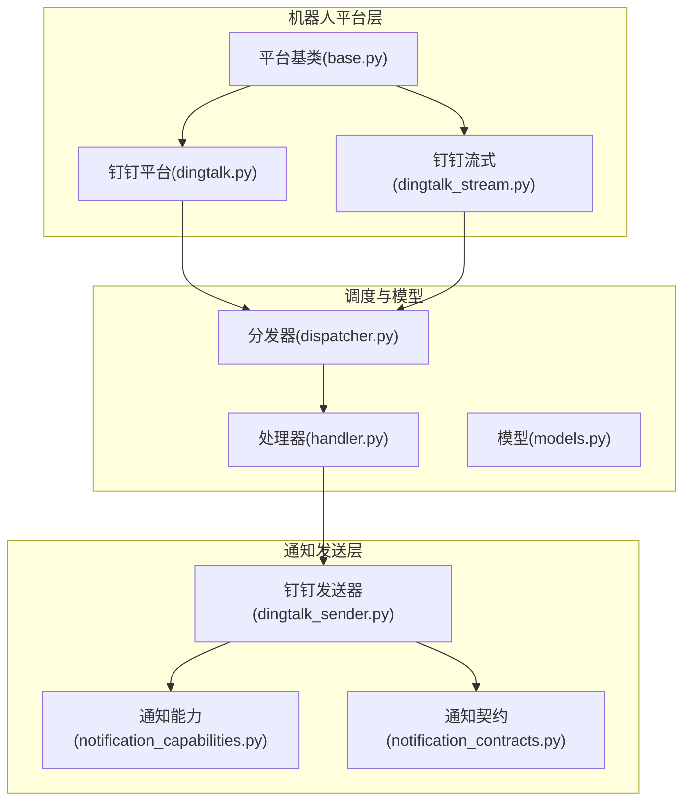
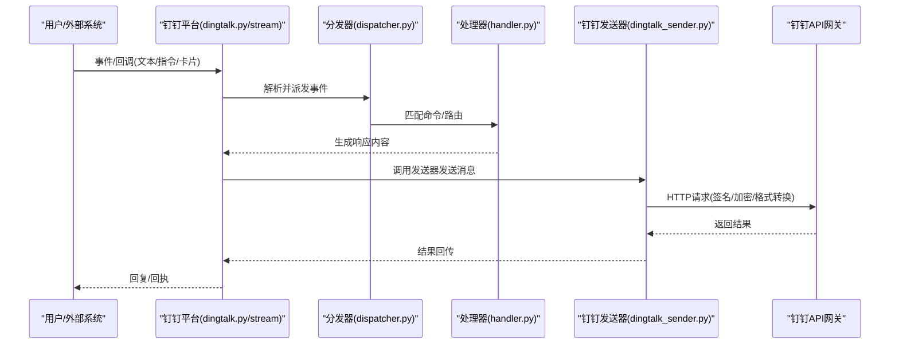
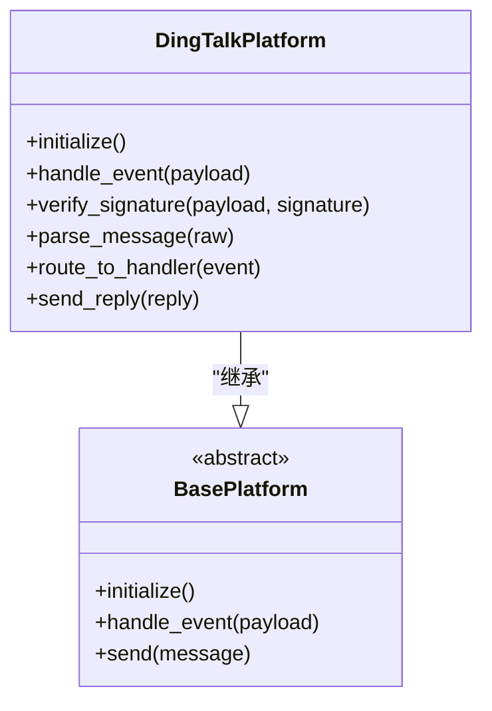
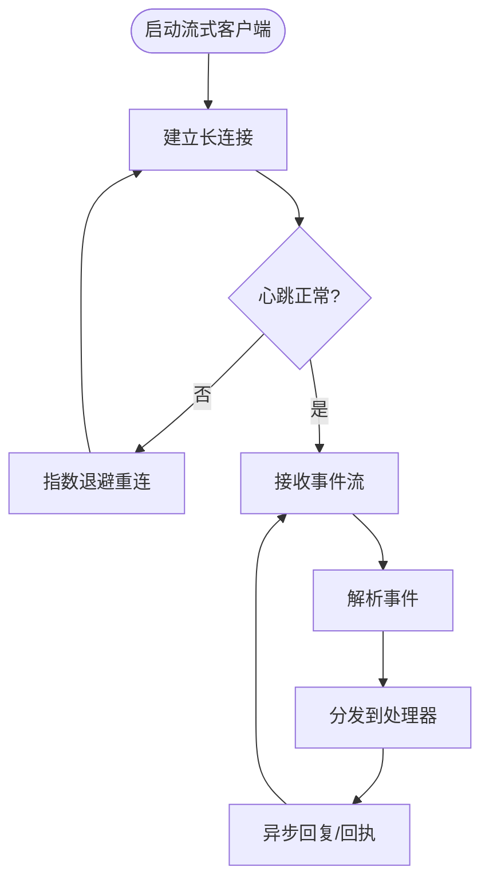
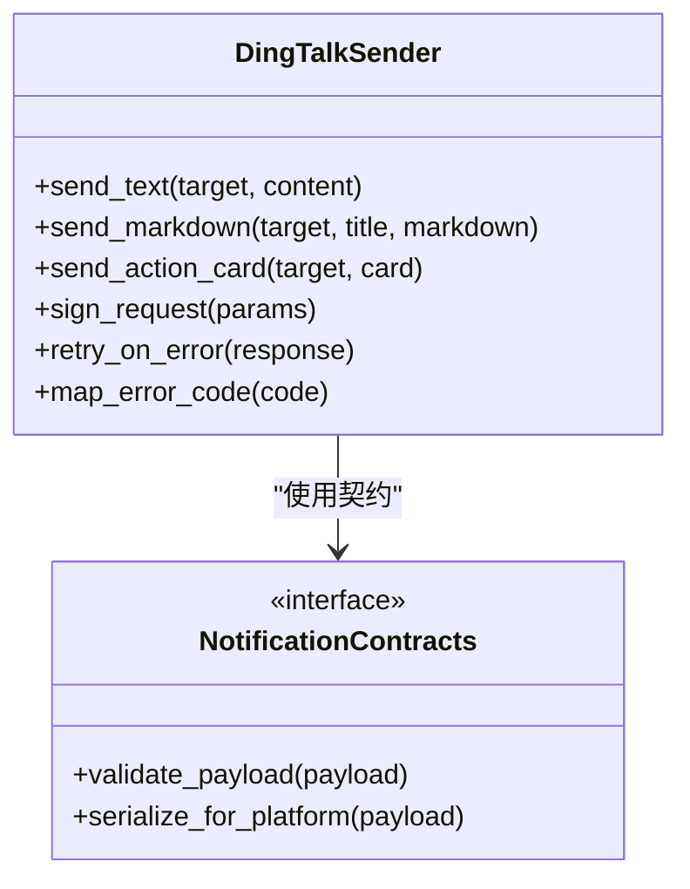
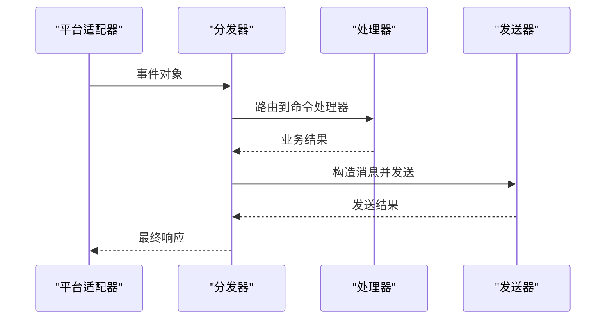
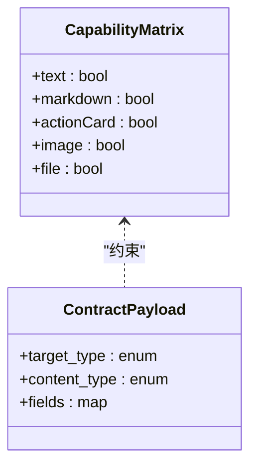
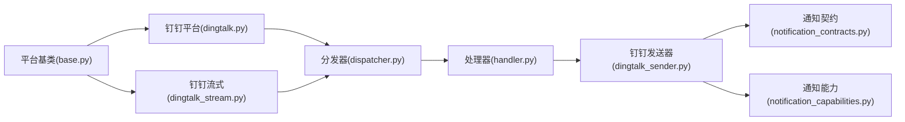

# 钉钉平台集成

<cite>
**本文引用的文件**   
- [dingtalk.py](file://bot/platforms/dingtalk.py)
- [dingtalk_stream.py](file://bot/platforms/dingtalk_stream.py)
- [dingtalk_sender.py](file://src/notification_sender/dingtalk_sender.py)
- [dingding-bot-config.md](file://docs/bot/dingding-bot-config.md)
- [dispatcher.py](file://bot/dispatcher.py)
- [handler.py](file://bot/handler.py)
- [models.py](file://bot/models.py)
- [base.py](file://bot/platforms/base.py)
- [notification.py](file://src/notification.py)
- [notification_capabilities.py](file://src/notification_capabilities.py)
- [notification_contracts.py](file://src/notification_contracts.py)
- [test_dingtalk_sender.py](file://tests/test_dingtalk_sender.py)
</cite>

## 目录
1. [简介](#简介)
2. [项目结构](#项目结构)
3. [核心组件](#核心组件)
4. [架构总览](#架构总览)
5. [详细组件分析](#详细组件分析)
6. [依赖关系分析](#依赖关系分析)
7. [性能与限制](#性能与限制)
8. [故障排除指南](#故障排除指南)
9. [结论](#结论)
10. [附录：配置示例与最佳实践](#附录配置示例与最佳实践)

## 简介
本文件面向需要在企业内部系统中集成“钉钉”平台的开发者与运维人员，提供从机器人创建、应用注册、Webhook/回调配置到消息发送、认证与安全、错误处理与限流等全链路说明。文档同时给出与企业微信的对比与迁移建议，并包含企业部署注意事项与常见问题排查方法。

## 项目结构
本项目在 bot 层实现了多平台机器人能力（含钉钉），在 notification_sender 层提供了统一的推送通道实现（含钉钉）。关键路径如下：
- 机器人平台适配：bot/platforms/dingtalk.py、bot/platforms/dingtalk_stream.py
- 统一推送通道：src/notification_sender/dingtalk_sender.py
- 平台基类与调度：bot/platforms/base.py、bot/dispatcher.py、bot/handler.py、bot/models.py
- 通知能力与契约：src/notification.py、src/notification_capabilities.py、src/notification_contracts.py
- 钉钉配置文档：docs/bot/dingding-bot-config.md
- 单元测试：tests/test_dingtalk_sender.py

图表来源
- [dingtalk.py](file://bot/platforms/dingtalk.py)
- [dingtalk_stream.py](file://bot/platforms/dingtalk_stream.py)
- [base.py](file://bot/platforms/base.py)
- [dispatcher.py](file://bot/dispatcher.py)
- [handler.py](file://bot/handler.py)
- [models.py](file://bot/models.py)
- [dingtalk_sender.py](file://src/notification_sender/dingtalk_sender.py)
- [notification_capabilities.py](file://src/notification_capabilities.py)
- [notification_contracts.py](file://src/notification_contracts.py)

章节来源
- [dingtalk.py](file://bot/platforms/dingtalk.py)
- [dingtalk_stream.py](file://bot/platforms/dingtalk_stream.py)
- [dingtalk_sender.py](file://src/notification_sender/dingtalk_sender.py)
- [dispatcher.py](file://bot/dispatcher.py)
- [handler.py](file://bot/handler.py)
- [models.py](file://bot/models.py)
- [base.py](file://bot/platforms/base.py)
- [notification.py](file://src/notification.py)
- [notification_capabilities.py](file://src/notification_capabilities.py)
- [notification_contracts.py](file://src/notification_contracts.py)
- [dingding-bot-config.md](file://docs/bot/dingding-bot-config.md)

## 核心组件
- 钉钉平台适配器：封装钉钉事件接收、消息解析与命令路由，支持普通模式与流式模式两种接入方式。
- 钉钉发送器：封装HTTP请求、签名校验、消息体构造与重试策略，用于工作通知、群机器人消息等场景。
- 平台基类：定义平台抽象接口（初始化、鉴权、消息收发、生命周期钩子），供各平台复用。
- 调度与处理器：将平台事件分发给具体命令处理器，统一错误处理与日志记录。
- 通知能力与契约：定义通知能力矩阵与数据结构契约，确保不同通道一致的行为与扩展性。

章节来源
- [dingtalk.py](file://bot/platforms/dingtalk.py)
- [dingtalk_stream.py](file://bot/platforms/dingtalk_stream.py)
- [dingtalk_sender.py](file://src/notification_sender/dingtalk_sender.py)
- [base.py](file://bot/platforms/base.py)
- [dispatcher.py](file://bot/dispatcher.py)
- [handler.py](file://bot/handler.py)
- [models.py](file://bot/models.py)
- [notification_capabilities.py](file://src/notification_capabilities.py)
- [notification_contracts.py](file://src/notification_contracts.py)

## 架构总览
下图展示了从用户输入到钉钉消息返回的整体流程，包括平台适配、命令分发、业务处理与消息发送。

图表来源
- [dingtalk.py](file://bot/platforms/dingtalk.py)
- [dingtalk_stream.py](file://bot/platforms/dingtalk_stream.py)
- [dispatcher.py](file://bot/dispatcher.py)
- [handler.py](file://bot/handler.py)
- [dingtalk_sender.py](file://src/notification_sender/dingtalk_sender.py)

## 详细组件分析

### 钉钉平台适配器（普通模式）
- 职责：接收钉钉回调事件，解析消息体，进行安全校验，路由到命令处理器，返回标准响应。
- 关键点：
  - 事件类型识别与过滤
  - 签名验证与时间戳校验
  - 消息去重与幂等处理
  - 与分发器的解耦设计

图表来源
- [dingtalk.py](file://bot/platforms/dingtalk.py)
- [base.py](file://bot/platforms/base.py)

章节来源
- [dingtalk.py](file://bot/platforms/dingtalk.py)
- [base.py](file://bot/platforms/base.py)

### 钉钉平台适配器（流式模式）
- 职责：基于长连接或流式接口实时接收事件，降低延迟，提升吞吐。
- 关键点：
  - 连接建立与心跳保活
  - 流式事件解析与顺序保证
  - 断线重连与退避策略
  - 与分发器的无缝对接

图表来源
- [dingtalk_stream.py](file://bot/platforms/dingtalk_stream.py)
- [dispatcher.py](file://bot/dispatcher.py)

章节来源
- [dingtalk_stream.py](file://bot/platforms/dingtalk_stream.py)
- [dispatcher.py](file://bot/dispatcher.py)

### 钉钉发送器（HTTP封装与消息格式）
- 职责：封装对钉钉开放平台的HTTP调用，完成签名、加密、消息体构造、重试与错误处理。
- 关键点：
  - 签名算法与参数排序
  - 消息体格式转换（Markdown/JSON/卡片）
  - 频率控制与退避重试
  - 错误码映射与告警

图表来源
- [dingtalk_sender.py](file://src/notification_sender/dingtalk_sender.py)
- [notification_contracts.py](file://src/notification_contracts.py)

章节来源
- [dingtalk_sender.py](file://src/notification_sender/dingtalk_sender.py)
- [notification_contracts.py](file://src/notification_contracts.py)

### 调度与处理器
- 职责：将平台事件按命令路由到对应处理器，统一异常捕获、日志记录与状态上报。
- 关键点：
  - 命令前缀与权限控制
  - 上下文注入（用户、群组、会话）
  - 异步执行与超时控制

图表来源
- [dispatcher.py](file://bot/dispatcher.py)
- [handler.py](file://bot/handler.py)
- [dingtalk_sender.py](file://src/notification_sender/dingtalk_sender.py)

章节来源
- [dispatcher.py](file://bot/dispatcher.py)
- [handler.py](file://bot/handler.py)

### 通知能力与契约
- 职责：定义各通道的能力矩阵与数据契约，确保跨通道一致性。
- 关键点：
  - 能力枚举（文本、Markdown、卡片、图片、文件等）
  - 目标类型（个人、群组、部门、角色）
  - 字段约束与默认值

图表来源
- [notification_capabilities.py](file://src/notification_capabilities.py)
- [notification_contracts.py](file://src/notification_contracts.py)

章节来源
- [notification_capabilities.py](file://src/notification_capabilities.py)
- [notification_contracts.py](file://src/notification_contracts.py)

## 依赖关系分析
- 平台层依赖基类，实现统一接口；发送器依赖通知契约，保证数据一致性。
- 调度器与处理器解耦平台细节，便于扩展新平台与新命令。
- 测试覆盖发送器核心逻辑，保障签名、重试与错误映射正确性。

图表来源
- [base.py](file://bot/platforms/base.py)
- [dingtalk.py](file://bot/platforms/dingtalk.py)
- [dingtalk_stream.py](file://bot/platforms/dingtalk_stream.py)
- [dispatcher.py](file://bot/dispatcher.py)
- [handler.py](file://bot/handler.py)
- [dingtalk_sender.py](file://src/notification_sender/dingtalk_sender.py)
- [notification_contracts.py](file://src/notification_contracts.py)
- [notification_capabilities.py](file://src/notification_capabilities.py)

章节来源
- [base.py](file://bot/platforms/base.py)
- [dingtalk.py](file://bot/platforms/dingtalk.py)
- [dingtalk_stream.py](file://bot/platforms/dingtalk_stream.py)
- [dispatcher.py](file://bot/dispatcher.py)
- [handler.py](file://bot/handler.py)
- [dingtalk_sender.py](file://src/notification_sender/dingtalk_sender.py)
- [notification_contracts.py](file://src/notification_contracts.py)
- [notification_capabilities.py](file://src/notification_capabilities.py)

## 性能与限制
- 频率限制：遵循钉钉开放平台速率限制，采用令牌桶/滑动窗口控制，避免触发限流。
- 重试策略：指数退避+抖动，区分可重试与不可重试错误，避免雪崩。
- 并发模型：流式模式优先，减少轮询开销；批量消息合并发送。
- 内存与连接：长连接池管理，心跳检测与自动重连；消息队列缓冲背压。
- 内容审核：敏感词过滤与长度限制，避免被平台拒绝。

[本节为通用指导，不直接分析具体文件]

## 故障排除指南
- 常见错误码映射：将平台错误码转换为内部错误类型，便于定位与告警。
- 签名失败：检查密钥、时间戳、参数排序与编码；启用调试日志输出请求摘要。
- 连接中断：观察心跳与重连日志，确认网络连通性与防火墙策略。
- 限流触发：监控QPS与错误率，调整批次大小与间隔；必要时降级非关键消息。
- 单元测试参考：通过测试用例验证签名、重试与错误映射逻辑。

章节来源
- [dingtalk_sender.py](file://src/notification_sender/dingtalk_sender.py)
- [test_dingtalk_sender.py](file://tests/test_dingtalk_sender.py)

## 结论
本项目通过平台适配层与发送器层的清晰分层，实现了钉钉机器人的稳定接入与高效消息推送。结合统一调度与契约化数据模型，具备良好的可扩展性与可维护性。配合完善的错误处理、限流与重试机制，可满足企业级生产环境需求。

[本节为总结，不直接分析具体文件]

## 附录：配置示例与最佳实践

### 钉钉机器人创建与配置
- 在企业内部应用管理中创建应用，启用机器人能力，获取AppKey与AppSecret。
- 配置回调地址（HTTPS），开启签名验证与消息加密。
- 设置IP白名单，限制回调来源，增强安全性。
- 在群聊中添加自定义机器人，获取Webhook地址（如需）。

章节来源
- [dingding-bot-config.md](file://docs/bot/dingding-bot-config.md)

### 安全设置与签名验证
- 使用AppKey/AppSecret生成签名，按规范拼接参数并计算摘要。
- 校验回调请求的时间戳与签名，防止重放攻击。
- 启用消息加密传输，保护敏感内容。

章节来源
- [dingtalk.py](file://bot/platforms/dingtalk.py)
- [dingtalk_sender.py](file://src/notification_sender/dingtalk_sender.py)

### 消息格式与内容规范
- 文本消息：简洁明了，避免过长。
- Markdown消息：支持基础语法，注意渲染兼容性。
- 卡片消息：结构化展示，适合操作引导与报表摘要。
- 图片与文件：控制大小与数量，避免超限。

章节来源
- [dingtalk_sender.py](file://src/notification_sender/dingtalk_sender.py)
- [notification_contracts.py](file://src/notification_contracts.py)

### 工作通知、审批与日程
- 工作通知：通过发送器向个人或群组推送提醒与报告。
- 审批流程：结合钉钉审批API，触发或查询审批状态（需额外集成）。
- 日程管理：创建或更新日程，同步会议信息（需额外集成）。

[本节为概念性说明，未直接分析具体文件]

### 企业微信对比与迁移指南
- 能力对比：两者均支持文本、Markdown、卡片与文件；差异在于签名算法、消息结构与回调协议。
- 迁移步骤：
  - 替换平台适配器实现（企业微信适配器）
  - 调整消息格式转换与签名逻辑
  - 更新回调地址与密钥配置
  - 运行回归测试，验证功能一致性

[本节为概念性说明，未直接分析具体文件]

### 企业部署建议
- 容器化部署：使用Docker编排服务，配置环境变量与密钥管理。
- 高可用：多实例部署，负载均衡与健康检查。
- 监控告警：采集QPS、错误率、延迟与资源使用指标。
- 日志审计：集中收集与归档，便于问题追踪与合规审计。

[本节为通用指导，不直接分析具体文件]