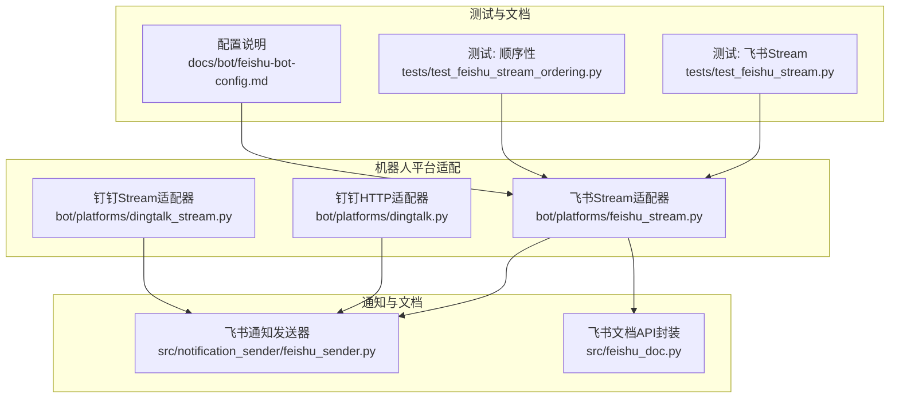
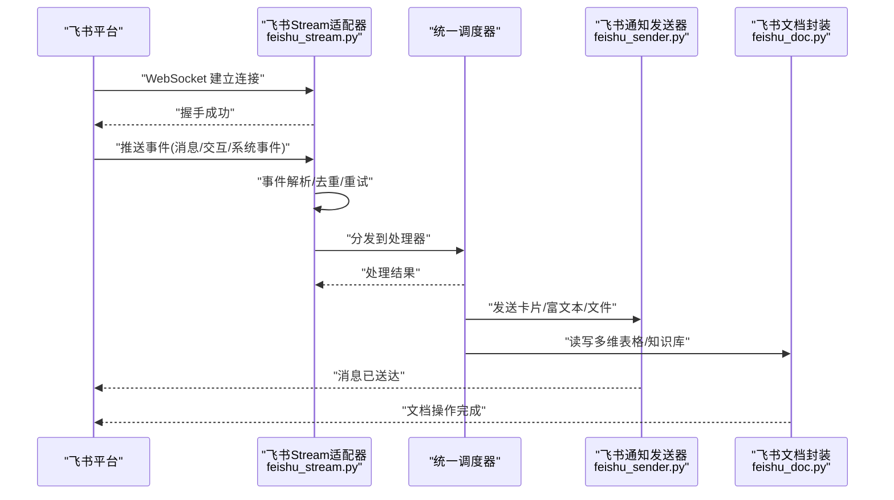
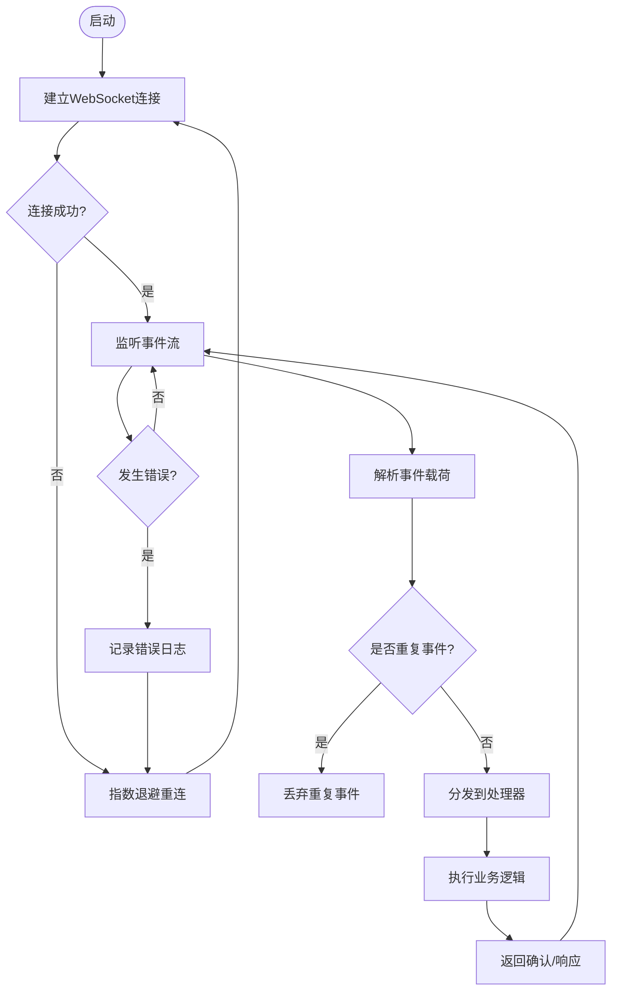
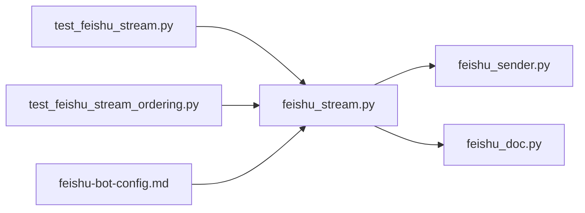

# 飞书平台集成

<cite>
**本文引用的文件**   
- [feishu_stream.py](file://bot/platforms/feishu_stream.py)
- [dingtalk.py](file://bot/platforms/dingtalk.py)
- [dingtalk_stream.py](file://bot/platforms/dingtalk_stream.py)
- [feishu_sender.py](file://src/notification_sender/feishu_sender.py)
- [feishu_doc.py](file://src/feishu_doc.py)
- [test_feishu_stream.py](file://tests/test_feishu_stream.py)
- [test_feishu_stream_ordering.py](file://tests/test_feishu_stream_ordering.py)
- [feishu-bot-config.md](file://docs/bot/feishu-bot-config.md)
</cite>

## 目录
1. [简介](#简介)
2. [项目结构](#项目结构)
3. [核心组件](#核心组件)
4. [架构总览](#架构总览)
5. [详细组件分析](#详细组件分析)
6. [依赖关系分析](#依赖关系分析)
7. [性能与可靠性](#性能与可靠性)
8. [故障排查指南](#故障排查指南)
9. [结论](#结论)
10. [附录：配置示例与迁移指南](#附录配置示例与迁移指南)

## 简介
本文件面向需要在项目中集成飞书平台的开发者，提供从应用创建、权限与事件订阅配置，到基于 Stream 模式的 WebSocket 长连接接入、事件推送与消息处理的全流程说明。同时涵盖卡片消息、交互式组件、多维表格与知识库等飞书特有能力的集成要点，并给出生产部署与监控建议。文档还包含与钉钉的对比分析与迁移指南，帮助已有钉钉集成的团队平滑过渡至飞书。

## 项目结构
本项目在 bot 层实现了多平台适配，其中飞书 Stream 模式位于 bot/platforms/feishu_stream.py；通知发送能力由 src/notification_sender/feishu_sender.py 提供；文档操作（如多维表格/知识库）由 src/feishu_doc.py 封装；测试覆盖集中在 tests/test_feishu_stream.py 与 tests/test_feishu_stream_ordering.py；官方配置指引见 docs/bot/feishu-bot-config.md。

图表来源
- [feishu_stream.py](file://bot/platforms/feishu_stream.py)
- [dingtalk.py](file://bot/platforms/dingtalk.py)
- [dingtalk_stream.py](file://bot/platforms/dingtalk_stream.py)
- [feishu_sender.py](file://src/notification_sender/feishu_sender.py)
- [feishu_doc.py](file://src/feishu_doc.py)
- [test_feishu_stream.py](file://tests/test_feishu_stream.py)
- [test_feishu_stream_ordering.py](file://tests/test_feishu_stream_ordering.py)
- [feishu-bot-config.md](file://docs/bot/feishu-bot-config.md)

章节来源
- [feishu_stream.py](file://bot/platforms/feishu_stream.py)
- [feishu_sender.py](file://src/notification_sender/feishu_sender.py)
- [feishu_doc.py](file://src/feishu_doc.py)
- [test_feishu_stream.py](file://tests/test_feishu_stream.py)
- [test_feishu_stream_ordering.py](file://tests/test_feishu_stream_ordering.py)
- [feishu-bot-config.md](file://docs/bot/feishu-bot-config.md)

## 核心组件
- 飞书 Stream 适配器：负责建立 WebSocket 长连接、接收事件流、解析事件、去重与重试、转发到统一调度器。
- 飞书通知发送器：封装消息卡片、富文本、图片、文件等发送能力，支持按渠道路由与失败重试。
- 飞书文档封装：对多维表格、知识库等 API 进行统一调用封装，便于上层业务直接复用。
- 测试套件：覆盖基本功能与事件顺序性，保障 Stream 连接的稳定性与事件处理的确定性。

章节来源
- [feishu_stream.py](file://bot/platforms/feishu_stream.py)
- [feishu_sender.py](file://src/notification_sender/feishu_sender.py)
- [feishu_doc.py](file://src/feishu_doc.py)
- [test_feishu_stream.py](file://tests/test_feishu_stream.py)
- [test_feishu_stream_ordering.py](file://tests/test_feishu_stream_ordering.py)

## 架构总览
下图展示了从飞书平台到应用内部的事件处理链路，以及通知与文档能力的调用路径。

图表来源
- [feishu_stream.py](file://bot/platforms/feishu_stream.py)
- [feishu_sender.py](file://src/notification_sender/feishu_sender.py)
- [feishu_doc.py](file://src/feishu_doc.py)

## 详细组件分析

### 飞书 Stream 适配器（WebSocket 长连接与事件处理）
- 连接管理：自动建立与维持 WebSocket 连接，支持断线重连与指数退避策略。
- 事件处理：解析事件载荷，执行幂等校验与去重，保证同一事件仅被处理一次。
- 错误处理：捕获网络异常与解析错误，记录日志并触发重试或告警。
- 扩展点：通过统一调度器将事件路由到具体业务处理器，便于新增事件类型。

图表来源
- [feishu_stream.py](file://bot/platforms/feishu_stream.py)

章节来源
- [feishu_stream.py](file://bot/platforms/feishu_stream.py)
- [test_feishu_stream.py](file://tests/test_feishu_stream.py)
- [test_feishu_stream_ordering.py](file://tests/test_feishu_stream_ordering.py)

### 飞书通知发送器（卡片消息与富媒体）
- 消息类型：支持文本、富文本、卡片消息、图片、文件等。
- 模板渲染：根据业务场景渲染卡片布局与按钮动作，支持回调与跳转。
- 路由与重试：按目标渠道选择发送策略，失败时进行有限次重试与降级。
- 限流控制：遵循飞书 API 速率限制，避免触发限流导致发送失败。

章节来源
- [feishu_sender.py](file://src/notification_sender/feishu_sender.py)

### 飞书文档封装（多维表格与知识库）
- 多维表格：提供行增删改查、列定义、筛选与排序等常用操作的封装。
- 知识库：支持文档检索、节点管理与权限读取，便于构建知识问答与报告生成。
- 错误处理：对鉴权失败、资源不存在、权限不足等错误进行分类处理与提示。

章节来源
- [feishu_doc.py](file://src/feishu_doc.py)

### 与钉钉的对比与迁移
- 连接模式：钉钉支持 HTTP 回调与 Stream 两种模式；飞书推荐 Stream 模式以获得更低延迟与更高吞吐。
- 事件模型：两者事件命名与字段存在差异，需映射转换后再进入统一调度器。
- 消息格式：钉钉消息体结构与飞书卡片消息不同，需分别适配渲染与交互回调。
- 迁移步骤：替换平台适配器为飞书 Stream 适配器，调整事件映射与消息模板，更新环境变量与回调配置。

章节来源
- [dingtalk.py](file://bot/platforms/dingtalk.py)
- [dingtalk_stream.py](file://bot/platforms/dingtalk_stream.py)
- [feishu_stream.py](file://bot/platforms/feishu_stream.py)

## 依赖关系分析
- 平台适配器依赖通知发送器与文档封装，以完成事件后的消息与数据操作。
- 测试用例依赖适配器实现，验证连接稳定性、事件去重与顺序性。
- 配置文件与文档说明为运行期参数与使用指引的来源。

图表来源
- [feishu_stream.py](file://bot/platforms/feishu_stream.py)
- [feishu_sender.py](file://src/notification_sender/feishu_sender.py)
- [feishu_doc.py](file://src/feishu_doc.py)
- [test_feishu_stream.py](file://tests/test_feishu_stream.py)
- [test_feishu_stream_ordering.py](file://tests/test_feishu_stream_ordering.py)
- [feishu-bot-config.md](file://docs/bot/feishu-bot-config.md)

章节来源
- [feishu_stream.py](file://bot/platforms/feishu_stream.py)
- [feishu_sender.py](file://src/notification_sender/feishu_sender.py)
- [feishu_doc.py](file://src/feishu_doc.py)
- [test_feishu_stream.py](file://tests/test_feishu_stream.py)
- [test_feishu_stream_ordering.py](file://tests/test_feishu_stream_ordering.py)
- [feishu-bot-config.md](file://docs/bot/feishu-bot-config.md)

## 性能与可靠性
- 连接与重连：采用指数退避与最大重试次数，避免雪崩式重连。
- 事件去重：基于事件 ID 或时间戳进行幂等校验，防止重复处理。
- 超时控制：设置合理的请求与处理超时，避免阻塞线程池。
- 限流与背压：遵循平台速率限制，必要时引入队列与并发控制。
- 监控与告警：记录关键指标（连接状态、事件吞吐、错误率），结合日志与指标系统进行观测。

[本节为通用指导，不直接分析具体文件]

## 故障排查指南
- 连接失败：检查网络可达性与证书配置，确认应用凭证有效。
- 事件丢失：核对去重逻辑与重试策略，查看事件序列号与时间戳。
- 消息发送失败：检查消息模板与权限，关注限流与错误码。
- 文档操作异常：确认资源 ID 与权限范围，查看接口返回与错误分类。

章节来源
- [test_feishu_stream.py](file://tests/test_feishu_stream.py)
- [test_feishu_stream_ordering.py](file://tests/test_feishu_stream_ordering.py)

## 结论
通过 Stream 模式接入飞书，可获得稳定、低延迟的事件处理能力。配合通知发送器与文档封装，可快速构建卡片消息、交互组件、多维表格与知识库集成。在生产环境中，应重视连接管理、事件去重、超时与限流、监控告警等关键点，确保系统高可用与可观测。

[本节为总结性内容，不直接分析具体文件]

## 附录：配置示例与迁移指南

### 飞书应用创建与配置
- 在飞书开发者后台注册应用，获取 App ID 与 App Secret。
- 配置事件订阅与回调 URL（若使用 Stream 模式则无需回调 URL）。
- 授予必要权限：消息收发、卡片交互、多维表格读写、知识库访问等。

章节来源
- [feishu-bot-config.md](file://docs/bot/feishu-bot-config.md)

### Stream 模式集成要点
- 使用 Stream 客户端建立 WebSocket 连接，保持心跳与自动重连。
- 解析事件载荷，执行去重与幂等处理，再分发到业务处理器。
- 对发送与文档操作进行超时与重试控制，避免长时间阻塞。

章节来源
- [feishu_stream.py](file://bot/platforms/feishu_stream.py)

### 通知与文档能力
- 使用通知发送器发送卡片消息与富媒体，注意模板渲染与回调绑定。
- 使用文档封装操作多维表格与知识库，遵循权限与资源约束。

章节来源
- [feishu_sender.py](file://src/notification_sender/feishu_sender.py)
- [feishu_doc.py](file://src/feishu_doc.py)

### 与钉钉迁移步骤
- 替换平台适配器为飞书 Stream 适配器。
- 调整事件映射与消息模板，确保字段与行为一致。
- 更新环境变量与权限配置，验证端到端流程。

章节来源
- [dingtalk.py](file://bot/platforms/dingtalk.py)
- [dingtalk_stream.py](file://bot/platforms/dingtalk_stream.py)
- [feishu_stream.py](file://bot/platforms/feishu_stream.py)

### 生产环境部署与监控
- 容器化部署，设置健康检查与优雅退出。
- 启用结构化日志与指标采集，配置告警规则。
- 定期演练故障恢复，验证重连与重试策略有效性。

[本节为通用指导，不直接分析具体文件]