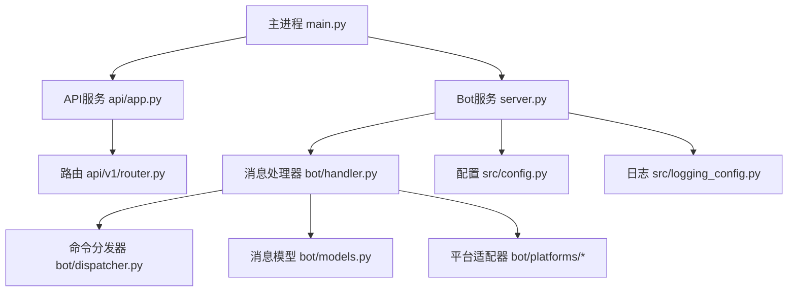
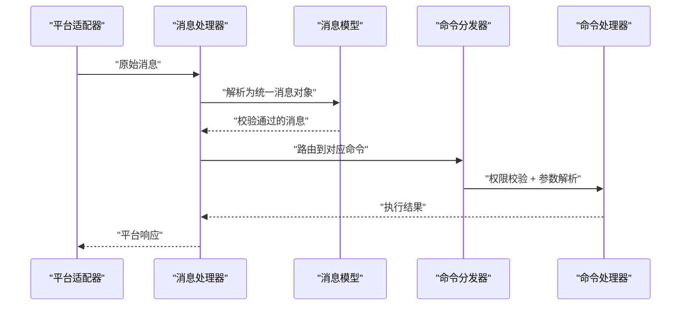
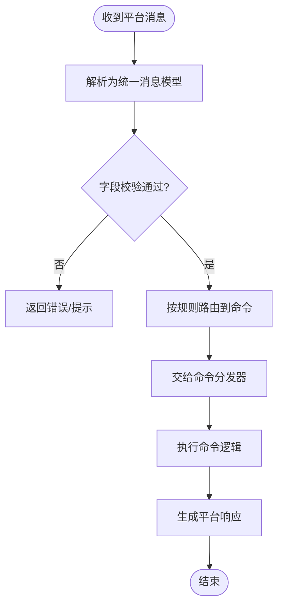
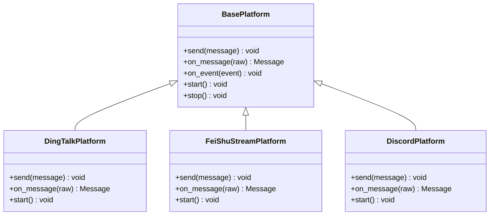
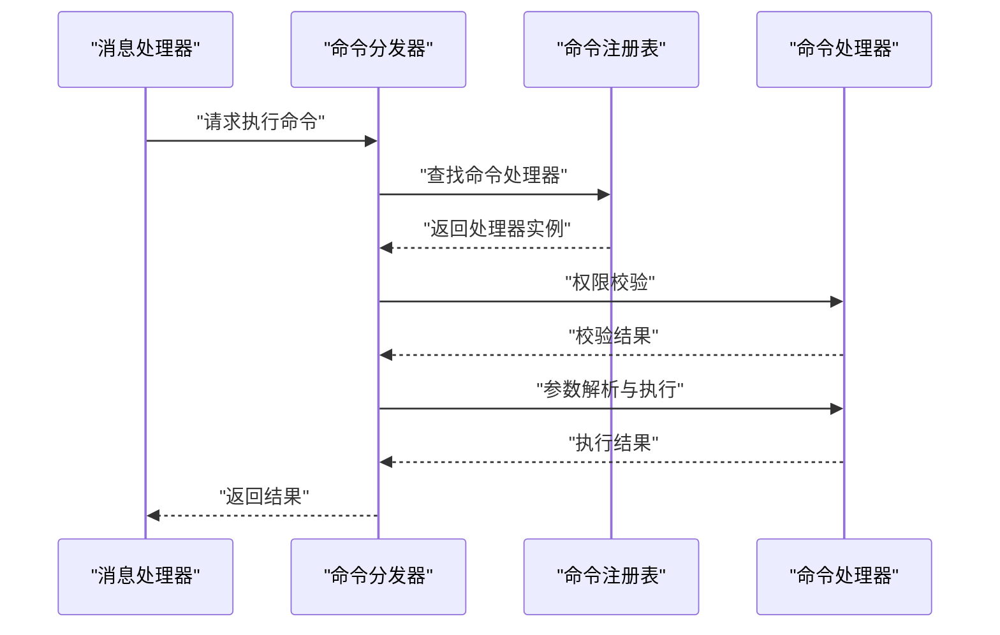
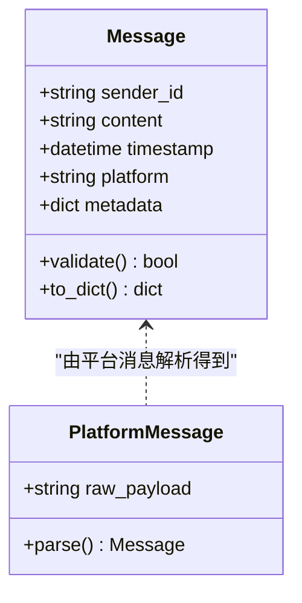
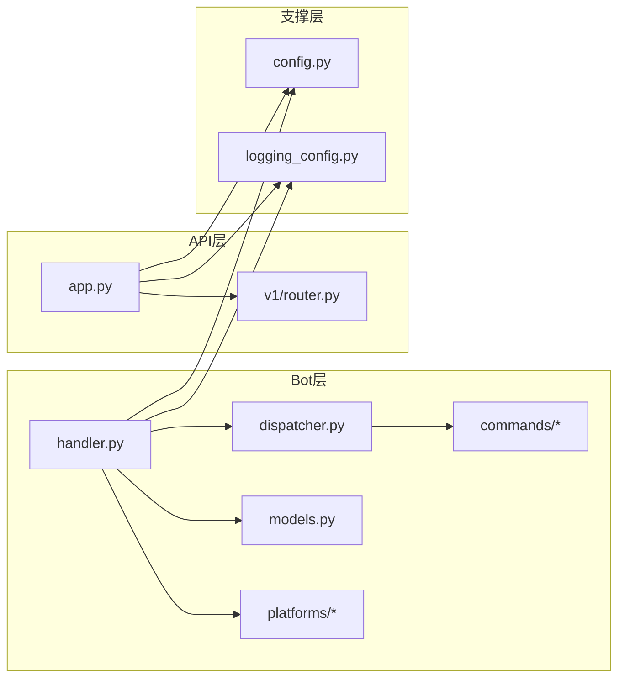

# 机器人架构设计

<cite>
**本文引用的文件**   
- [main.py](file://main.py)
- [server.py](file://server.py)
- [bot/dispatcher.py](file://bot/dispatcher.py)
- [bot/handler.py](file://bot/handler.py)
- [bot/models.py](file://bot/models.py)
- [bot/platforms/base.py](file://bot/platforms/base.py)
- [bot/platforms/dingtalk.py](file://bot/platforms/dingtalk.py)
- [bot/platforms/dingtalk_stream.py](file://bot/platforms/dingtalk_stream.py)
- [bot/platforms/discord.py](file://bot/platforms/discord.py)
- [bot/platforms/feishu_stream.py](file://bot/platforms/feishu_stream.py)
- [bot/commands/base.py](file://bot/commands/base.py)
- [bot/commands/chat.py](file://bot/commands/chat.py)
- [bot/commands/help.py](file://bot/commands/help.py)
- [bot/commands/market.py](file://bot/commands/market.py)
- [api/app.py](file://api/app.py)
- [api/v1/router.py](file://api/v1/router.py)
- [src/config.py](file://src/config.py)
- [src/logging_config.py](file://src/logging_config.py)
</cite>

## 目录
1. [引言](#引言)
2. [项目结构](#项目结构)
3. [核心组件](#核心组件)
4. [架构总览](#架构总览)
5. [详细组件分析](#详细组件分析)
6. [依赖关系分析](#依赖关系分析)
7. [性能考量](#性能考量)
8. [故障排查指南](#故障排查指南)
9. [结论](#结论)
10. [附录：扩展新平台开发指南与最佳实践](#附录扩展新平台开发指南与最佳实践)

## 引言
本文件面向Daily Stock Analysis机器人系统的架构设计与实现，重点阐述统一消息处理框架、平台适配器抽象、命令分发器机制以及消息模型设计。文档旨在帮助开发者快速理解系统各模块的职责边界、数据流向与交互方式，并提供扩展新平台的实践建议。

## 项目结构
系统采用分层与模块化组织：
- 入口与Web服务：主进程启动、API服务与Bot服务初始化
- Bot层：消息接收、解析、验证、路由与命令执行
- 平台适配层：对接不同IM平台（钉钉、飞书、Discord等）
- API层：对外REST接口，供前端或第三方调用
- 配置与日志：全局配置加载与日志体系

**图示来源** 
- [main.py](file://main.py)
- [server.py](file://server.py)
- [api/app.py](file://api/app.py)
- [api/v1/router.py](file://api/v1/router.py)
- [bot/handler.py](file://bot/handler.py)
- [bot/dispatcher.py](file://bot/dispatcher.py)
- [bot/models.py](file://bot/models.py)
- [src/config.py](file://src/config.py)
- [src/logging_config.py](file://src/logging_config.py)

**章节来源**
- [main.py](file://main.py)
- [server.py](file://server.py)
- [api/app.py](file://api/app.py)
- [api/v1/router.py](file://api/v1/router.py)
- [bot/handler.py](file://bot/handler.py)
- [bot/dispatcher.py](file://bot/dispatcher.py)
- [bot/models.py](file://bot/models.py)
- [src/config.py](file://src/config.py)
- [src/logging_config.py](file://src/logging_config.py)

## 核心组件
- 统一消息处理框架：负责从各平台接入消息，进行标准化解析、校验与路由到命令处理器
- 平台适配器抽象：通过BasePlatform定义统一接口，具体平台实现各自的消息收发与事件回调
- 命令分发器：维护命令注册表，支持权限校验、参数解析与异步执行
- 消息模型：定义消息结构、字段约束与类型转换，确保跨平台一致性

**章节来源**
- [bot/handler.py](file://bot/handler.py)
- [bot/dispatcher.py](file://bot/dispatcher.py)
- [bot/models.py](file://bot/models.py)
- [bot/platforms/base.py](file://bot/platforms/base.py)

## 架构总览
下图展示从平台消息到命令执行的端到端流程，以及API侧的并行能力。

**图示来源** 
- [bot/platforms/base.py](file://bot/platforms/base.py)
- [bot/handler.py](file://bot/handler.py)
- [bot/models.py](file://bot/models.py)
- [bot/dispatcher.py](file://bot/dispatcher.py)

## 详细组件分析

### 统一消息处理框架
- 职责：接收平台原始消息，转换为内部消息模型；执行字段校验；根据上下文与触发条件路由到命令
- 关键点：
  - 消息标准化：屏蔽平台差异，统一字段命名与类型
  - 校验策略：必填字段、格式校验、长度限制、枚举值检查
  - 路由策略：基于命令前缀、关键词或意图识别进行分发

**图示来源** 
- [bot/handler.py](file://bot/handler.py)
- [bot/models.py](file://bot/models.py)
- [bot/dispatcher.py](file://bot/dispatcher.py)

**章节来源**
- [bot/handler.py](file://bot/handler.py)
- [bot/models.py](file://bot/models.py)

### 平台适配器抽象设计模式
- BasePlatform基类：定义统一的发送、接收、事件回调接口
- 具体平台实现：钉钉、飞书、Discord等分别实现各自的协议细节
- 优势：新增平台只需实现接口，无需改动上层逻辑

**图示来源** 
- [bot/platforms/base.py](file://bot/platforms/base.py)
- [bot/platforms/dingtalk.py](file://bot/platforms/dingtalk.py)
- [bot/platforms/feishu_stream.py](file://bot/platforms/feishu_stream.py)
- [bot/platforms/discord.py](file://bot/platforms/discord.py)

**章节来源**
- [bot/platforms/base.py](file://bot/platforms/base.py)
- [bot/platforms/dingtalk.py](file://bot/platforms/dingtalk.py)
- [bot/platforms/feishu_stream.py](file://bot/platforms/feishu_stream.py)
- [bot/platforms/discord.py](file://bot/platforms/discord.py)

### 命令分发器工作原理
- 命令注册：在启动时扫描并注册所有命令处理器
- 权限验证：根据用户角色或白名单决定是否允许执行
- 执行流程：参数解析 -> 权限检查 -> 异步执行 -> 结果回传

**图示来源** 
- [bot/dispatcher.py](file://bot/dispatcher.py)
- [bot/commands/base.py](file://bot/commands/base.py)
- [bot/commands/chat.py](file://bot/commands/chat.py)
- [bot/commands/help.py](file://bot/commands/help.py)
- [bot/commands/market.py](file://bot/commands/market.py)

**章节来源**
- [bot/dispatcher.py](file://bot/dispatcher.py)
- [bot/commands/base.py](file://bot/commands/base.py)
- [bot/commands/chat.py](file://bot/commands/chat.py)
- [bot/commands/help.py](file://bot/commands/help.py)
- [bot/commands/market.py](file://bot/commands/market.py)

### 消息模型设计
- 结构定义：统一消息体包含发送者、内容、时间戳、平台标识等
- 字段验证：使用Pydantic或类似库进行强类型校验
- 数据转换：将平台特定字段映射为标准字段，便于后续处理

**图示来源** 
- [bot/models.py](file://bot/models.py)

**章节来源**
- [bot/models.py](file://bot/models.py)

## 依赖关系分析
- 低耦合：平台适配器与业务逻辑解耦，通过统一接口通信
- 高内聚：每个命令处理器职责单一，易于测试与维护
- 外部依赖：配置管理、日志记录、HTTP客户端等

**图示来源** 
- [bot/handler.py](file://bot/handler.py)
- [bot/dispatcher.py](file://bot/dispatcher.py)
- [bot/models.py](file://bot/models.py)
- [bot/platforms/base.py](file://bot/platforms/base.py)
- [bot/commands/base.py](file://bot/commands/base.py)
- [api/app.py](file://api/app.py)
- [api/v1/router.py](file://api/v1/router.py)
- [src/config.py](file://src/config.py)
- [src/logging_config.py](file://src/logging_config.py)

**章节来源**
- [bot/handler.py](file://bot/handler.py)
- [bot/dispatcher.py](file://bot/dispatcher.py)
- [bot/models.py](file://bot/models.py)
- [api/app.py](file://api/app.py)
- [src/config.py](file://src/config.py)
- [src/logging_config.py](file://src/logging_config.py)

## 性能考量
- 异步处理：消息接收与命令执行采用异步模型，提升并发能力
- 连接池：HTTP客户端与数据库连接复用，减少开销
- 缓存策略：热点数据缓存，降低重复计算与网络请求
- 限流与降级：对高频命令进行限流，异常时优雅降级

[本节为通用指导，不直接分析具体文件]

## 故障排查指南
- 日志定位：启用详细日志，查看消息解析与路由过程
- 健康检查：通过API健康端点确认服务状态
- 错误码规范：统一错误码与提示信息，便于前端处理
- 重试机制：对网络请求实施指数退避重试

**章节来源**
- [src/logging_config.py](file://src/logging_config.py)
- [api/app.py](file://api/app.py)

## 结论
Daily Stock Analysis机器人系统通过统一消息处理框架、平台适配器抽象、命令分发器与标准化消息模型，实现了高内聚、低耦合的可扩展架构。该设计支持多平台接入、灵活命令扩展与稳定可靠的运行体验。

[本节为总结性内容，不直接分析具体文件]

## 附录：扩展新平台开发指南与最佳实践
- 步骤概览：
  1. 继承BasePlatform，实现send、on_message、start等方法
  2. 在平台适配器中注册消息监听器，将原始消息转换为统一模型
  3. 配置平台连接参数（如Token、URL等）
  4. 在主进程中启动平台服务
- 最佳实践：
  - 保持接口简洁，避免泄露平台细节
  - 实现完善的错误处理与重试逻辑
  - 编写单元测试覆盖关键路径
  - 使用配置中心管理敏感信息

[本节为概念性指导，不直接分析具体文件]