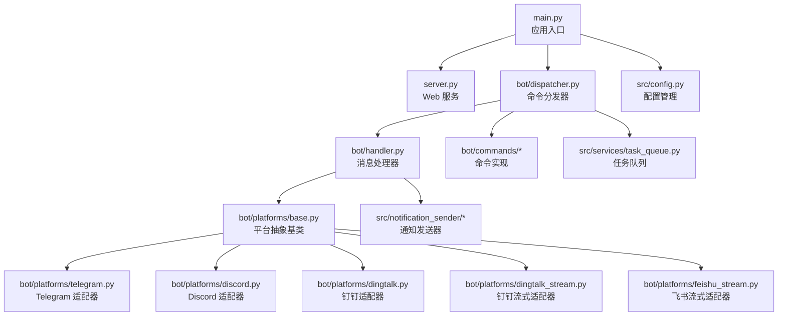
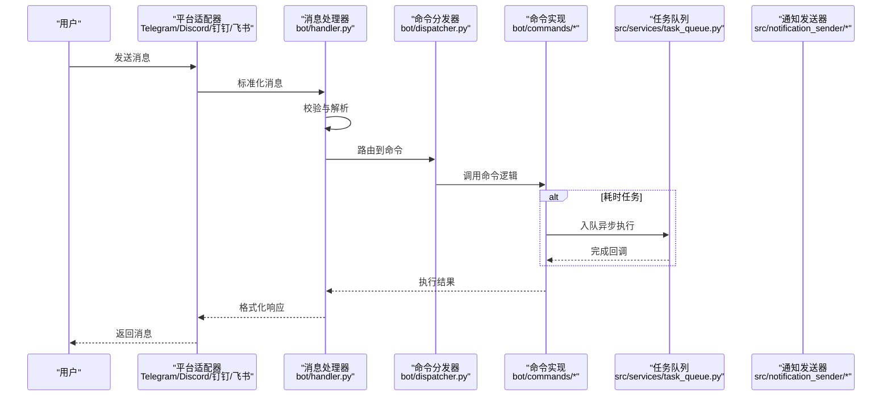
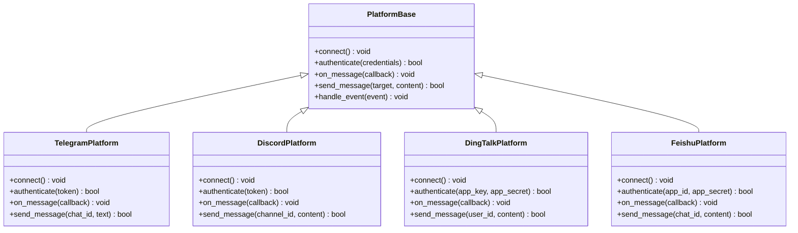
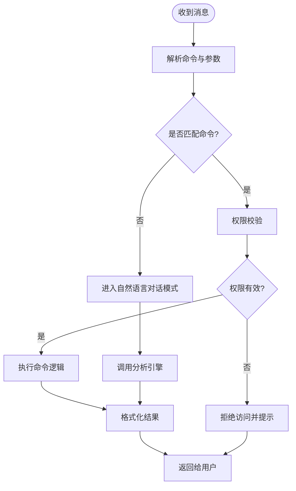
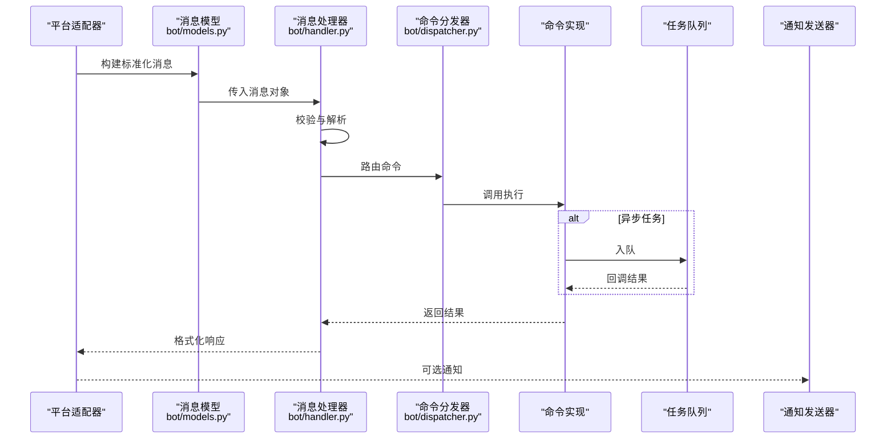
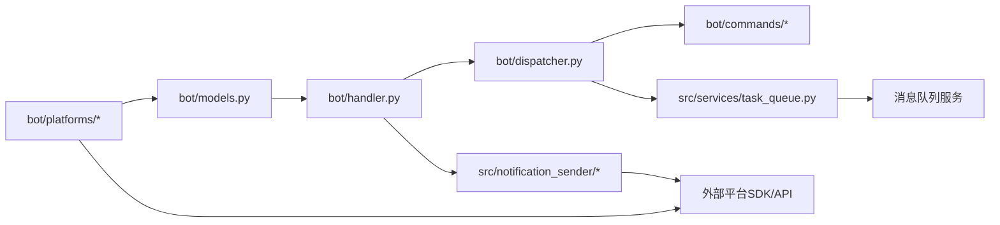

# 机器人系统

<cite>
**本文引用的文件**   
- [main.py](file://main.py)
- [server.py](file://server.py)
- [bot/dispatcher.py](file://bot/dispatcher.py)
- [bot/handler.py](file://bot/handler.py)
- [bot/models.py](file://bot/models.py)
- [bot/platforms/base.py](file://bot/platforms/base.py)
- [bot/platforms/telegram.py](file://bot/platforms/telegram.py)
- [bot/platforms/discord.py](file://bot/platforms/discord.py)
- [bot/platforms/dingtalk.py](file://bot/platforms/dingtalk.py)
- [bot/platforms/dingtalk_stream.py](file://bot/platforms/dingtalk_stream.py)
- [bot/platforms/feishu_stream.py](file://bot/platforms/feishu_stream.py)
- [bot/commands/base.py](file://bot/commands/base.py)
- [bot/commands/help.py](file://bot/commands/help.py)
- [bot/commands/chat.py](file://bot/commands/chat.py)
- [bot/commands/market.py](file://bot/commands/market.py)
- [bot/commands/status.py](file://bot/commands/status.py)
- [bot/commands/research.py](file://bot/commands/research.py)
- [bot/commands/history.py](file://bot/commands/history.py)
- [bot/commands/analyze.py](file://bot/commands/analyze.py)
- [bot/commands/batch.py](file://bot/commands/batch.py)
- [bot/commands/strategies.py](file://bot/commands/strategies.py)
- [src/config.py](file://src/config.py)
- [src/notification.py](file://src/notification.py)
- [src/notification_sender/__init__.py](file://src/notification_sender/__init__.py)
- [src/notification_sender/telegram.py](file://src/notification_sender/telegram.py)
- [src/notification_sender/discord.py](file://src/notification_sender/discord.py)
- [src/notification_sender/dingtalk.py](file://src/notification_sender/dingtalk.py)
- [src/notification_sender/feishu.py](file://src/notification_sender/feishu.py)
- [src/services/task_queue.py](file://src/services/task_queue.py)
- [docker/Dockerfile](file://docker/Dockerfile)
- [docker/docker-compose.yml](file://docker/docker-compose.yml)
- [docker/entrypoint.sh](file://docker/entrypoint.sh)
- [docs/bot/dingding-bot-config.md](file://docs/bot/dingding-bot-config.md)
- [docs/bot/discord-bot-config.md](file://docs/bot/discord-bot-config.md)
- [docs/bot/feishu-bot-config.md](file://docs/bot/feishu-bot-config.md)
</cite>

## 目录
1. [简介](#简介)
2. [项目结构](#项目结构)
3. [核心组件](#核心组件)
4. [架构总览](#架构总览)
5. [详细组件分析](#详细组件分析)
6. [依赖关系分析](#依赖关系分析)
7. [性能考虑](#性能考虑)
8. [故障排除指南](#故障排除指南)
9. [结论](#结论)
10. [附录](#附录)

## 简介
本文件为 Daily Stock Analysis 机器人系统的技术文档，聚焦多平台机器人架构与统一消息处理框架。内容涵盖：
- 统一的消息处理框架、平台适配器的抽象设计与命令分发机制
- 支持的聊天平台（Telegram、Discord、钉钉、飞书）集成方式与配置方法
- 命令系统的设计（内置命令功能、自定义命令开发指南、权限控制）
- 消息处理流程（接收、解析、路由、执行与返回）
- 配置与部署步骤（API 密钥管理、服务器配置、负载均衡）
- 故障排除与性能优化建议（消息队列、并发策略）

## 项目结构
机器人相关代码主要位于 bot 目录，命令在 bot/commands，平台适配器在 bot/platforms，调度与处理器在 bot/dispatcher.py 与 bot/handler.py。应用入口与 Web 服务分别在 main.py 与 server.py。通知发送器集中在 src/notification_sender。任务队列与配置在 src/services/task_queue.py 与 src/config.py。Docker 部署相关文件在 docker 目录。平台配置说明在 docs/bot 下。

**图表来源** 
- [main.py](file://main.py)
- [server.py](file://server.py)
- [bot/dispatcher.py](file://bot/dispatcher.py)
- [bot/handler.py](file://bot/handler.py)
- [bot/platforms/base.py](file://bot/platforms/base.py)
- [bot/platforms/telegram.py](file://bot/platforms/telegram.py)
- [bot/platforms/discord.py](file://bot/platforms/discord.py)
- [bot/platforms/dingtalk.py](file://bot/platforms/dingtalk.py)
- [bot/platforms/dingtalk_stream.py](file://bot/platforms/dingtalk_stream.py)
- [bot/platforms/feishu_stream.py](file://bot/platforms/feishu_stream.py)
- [src/notification_sender/__init__.py](file://src/notification_sender/__init__.py)
- [src/services/task_queue.py](file://src/services/task_queue.py)
- [src/config.py](file://src/config.py)

**章节来源**
- [main.py](file://main.py)
- [server.py](file://server.py)
- [bot/dispatcher.py](file://bot/dispatcher.py)
- [bot/handler.py](file://bot/handler.py)
- [bot/platforms/base.py](file://bot/platforms/base.py)

## 核心组件
- 统一消息处理框架
  - 通过 bot/handler.py 定义消息生命周期：接收、校验、解析、路由到命令或自然语言对话、执行与结果回写。
  - 支持异步处理与错误捕获，确保高可用。
- 平台适配器抽象
  - bot/platforms/base.py 定义统一的平台接口（连接、鉴权、消息收发、事件回调）。
  - 各平台实现（Telegram、Discord、钉钉、飞书）遵循同一契约，便于扩展新平台。
- 命令分发机制
  - bot/dispatcher.py 负责命令注册、匹配与分发；支持权限检查、参数解析与上下文注入。
  - 命令模块位于 bot/commands/*，每个命令实现单一职责，便于维护与测试。

**章节来源**
- [bot/handler.py](file://bot/handler.py)
- [bot/platforms/base.py](file://bot/platforms/base.py)
- [bot/dispatcher.py](file://bot/dispatcher.py)

## 架构总览
整体架构采用“平台适配器 + 统一处理器 + 命令分发”的分层设计。平台适配器屏蔽不同平台的差异，将消息标准化后交由统一处理器处理；命令分发器根据消息类型与指令前缀路由到具体命令；执行结果通过通知发送器或平台原生 API 返回。

**图表来源** 
- [bot/handler.py](file://bot/handler.py)
- [bot/dispatcher.py](file://bot/dispatcher.py)
- [bot/platforms/base.py](file://bot/platforms/base.py)
- [src/services/task_queue.py](file://src/services/task_queue.py)
- [src/notification_sender/__init__.py](file://src/notification_sender/__init__.py)

## 详细组件分析

### 平台适配器抽象与实现
- 抽象基类
  - 定义统一接口：初始化连接、鉴权、订阅事件、发送消息、处理回调等。
  - 提供通用能力：重试、超时、限流、日志记录。
- 平台实现
  - Telegram：基于官方 SDK，支持长轮询或 Webhook。
  - Discord：基于 discord.py，支持事件驱动与网关回调。
  - 钉钉：支持 HTTP 回调与流式模式（dingtalk_stream），提高稳定性。
  - 飞书：基于流式接口（feishu_stream），支持事件订阅与消息推送。

**图表来源** 
- [bot/platforms/base.py](file://bot/platforms/base.py)
- [bot/platforms/telegram.py](file://bot/platforms/telegram.py)
- [bot/platforms/discord.py](file://bot/platforms/discord.py)
- [bot/platforms/dingtalk.py](file://bot/platforms/dingtalk.py)
- [bot/platforms/dingtalk_stream.py](file://bot/platforms/dingtalk_stream.py)
- [bot/platforms/feishu_stream.py](file://bot/platforms/feishu_stream.py)

**章节来源**
- [bot/platforms/base.py](file://bot/platforms/base.py)
- [bot/platforms/telegram.py](file://bot/platforms/telegram.py)
- [bot/platforms/discord.py](file://bot/platforms/discord.py)
- [bot/platforms/dingtalk.py](file://bot/platforms/dingtalk.py)
- [bot/platforms/dingtalk_stream.py](file://bot/platforms/dingtalk_stream.py)
- [bot/platforms/feishu_stream.py](file://bot/platforms/feishu_stream.py)

### 命令系统与分发机制
- 命令基类与注册
  - bot/commands/base.py 定义命令基类，包含名称、描述、权限、参数解析与执行钩子。
  - dispatcher.py 维护命令注册表，按前缀匹配与参数解析进行分发。
- 内置命令
  - help：列出可用命令与使用说明。
  - chat：自然语言对话，调用分析引擎生成回复。
  - market：市场概览、指数查询、板块热点。
  - status：机器人状态、健康检查、资源使用。
  - research：深度研究，聚合数据与报告。
  - history：历史分析、回看与导出。
  - analyze：个股分析、技术指标、基本面摘要。
  - batch：批量任务，如批量分析、定时报告。
  - strategies：策略管理与回测。
- 权限控制
  - 支持角色与白名单，限制敏感命令（如策略修改、批量任务）。
  - 可在 dispatcher 中注入上下文（用户 ID、群组、角色）进行动态授权。

**图表来源** 
- [bot/dispatcher.py](file://bot/dispatcher.py)
- [bot/commands/base.py](file://bot/commands/base.py)
- [bot/commands/help.py](file://bot/commands/help.py)
- [bot/commands/chat.py](file://bot/commands/chat.py)
- [bot/commands/market.py](file://bot/commands/market.py)
- [bot/commands/status.py](file://bot/commands/status.py)
- [bot/commands/research.py](file://bot/commands/research.py)
- [bot/commands/history.py](file://bot/commands/history.py)
- [bot/commands/analyze.py](file://bot/commands/analyze.py)
- [bot/commands/batch.py](file://bot/commands/batch.py)
- [bot/commands/strategies.py](file://bot/commands/strategies.py)

**章节来源**
- [bot/dispatcher.py](file://bot/dispatcher.py)
- [bot/commands/base.py](file://bot/commands/base.py)
- [bot/commands/help.py](file://bot/commands/help.py)
- [bot/commands/chat.py](file://bot/commands/chat.py)
- [bot/commands/market.py](file://bot/commands/market.py)
- [bot/commands/status.py](file://bot/commands/status.py)
- [bot/commands/research.py](file://bot/commands/research.py)
- [bot/commands/history.py](file://bot/commands/history.py)
- [bot/commands/analyze.py](file://bot/commands/analyze.py)
- [bot/commands/batch.py](file://bot/commands/batch.py)
- [bot/commands/strategies.py](file://bot/commands/strategies.py)

### 消息处理流程
- 接收与标准化
  - 平台适配器将原始消息转换为统一模型（bot/models.py），包含发送者、目标、内容、时间戳、元数据。
- 解析与路由
  - handler.py 校验消息格式，提取命令前缀与参数，dispatcher.py 匹配命令并注入上下文。
- 执行与返回
  - 命令执行可能同步或异步（通过任务队列），结果经格式化后通过平台适配器返回。

**图表来源** 
- [bot/models.py](file://bot/models.py)
- [bot/handler.py](file://bot/handler.py)
- [bot/dispatcher.py](file://bot/dispatcher.py)
- [src/services/task_queue.py](file://src/services/task_queue.py)
- [src/notification_sender/__init__.py](file://src/notification_sender/__init__.py)

**章节来源**
- [bot/models.py](file://bot/models.py)
- [bot/handler.py](file://bot/handler.py)
- [bot/dispatcher.py](file://bot/dispatcher.py)

### 通知发送器与多渠道输出
- 统一接口
  - src/notification_sender/__init__.py 定义发送器抽象，支持多种渠道（Telegram、Discord、钉钉、飞书、邮件等）。
- 渠道实现
  - 各渠道实现独立模块，封装认证、消息模板与错误处理。
- 使用场景
  - 命令执行结果、定时报告、告警信息可通过统一接口发送到多个平台。

**章节来源**
- [src/notification_sender/__init__.py](file://src/notification_sender/__init__.py)
- [src/notification_sender/telegram.py](file://src/notification_sender/telegram.py)
- [src/notification_sender/discord.py](file://src/notification_sender/discord.py)
- [src/notification_sender/dingtalk.py](file://src/notification_sender/dingtalk.py)
- [src/notification_sender/feishu.py](file://src/notification_sender/feishu.py)
- [src/notification.py](file://src/notification.py)

## 依赖关系分析
- 内部依赖
  - 平台适配器依赖统一消息模型与处理器。
  - 命令分发器依赖命令注册表与权限上下文。
  - 通知发送器依赖配置与渠道认证信息。
- 外部依赖
  - Telegram、Discord、钉钉、飞书的官方 SDK 或 API。
  - 任务队列（如 Redis、RabbitMQ）用于异步处理。
  - 配置中心与环境变量管理。

**图表来源** 
- [bot/models.py](file://bot/models.py)
- [bot/handler.py](file://bot/handler.py)
- [bot/dispatcher.py](file://bot/dispatcher.py)
- [bot/platforms/base.py](file://bot/platforms/base.py)
- [src/notification_sender/__init__.py](file://src/notification_sender/__init__.py)
- [src/services/task_queue.py](file://src/services/task_queue.py)

**章节来源**
- [bot/models.py](file://bot/models.py)
- [bot/handler.py](file://bot/handler.py)
- [bot/dispatcher.py](file://bot/dispatcher.py)
- [src/notification_sender/__init__.py](file://src/notification_sender/__init__.py)
- [src/services/task_queue.py](file://src/services/task_queue.py)

## 性能考虑
- 异步与并发
  - 使用异步 IO 处理平台事件与命令执行，避免阻塞。
  - 对耗时任务（如数据分析、报告生成）使用任务队列异步处理。
- 缓存与限流
  - 对频繁查询的数据（如股票列表、指数数据）进行缓存。
  - 对平台 API 调用实施限流与重试策略。
- 负载均衡
  - 多实例部署时，使用反向代理（如 Nginx）进行负载均衡。
  - 会话与状态外置（Redis）以支持水平扩展。

[本节为通用指导，不直接分析具体文件]

## 故障排除指南
- 常见问题
  - 平台连接失败：检查 API 密钥与网络连通性。
  - 命令无响应：查看日志与任务队列状态，确认命令注册与权限。
  - 消息丢失：检查平台回调配置与消息去重逻辑。
- 调试技巧
  - 启用详细日志，记录消息流转与错误堆栈。
  - 使用本地模拟平台事件进行测试。
- 恢复策略
  - 自动重试与降级（如切换备用数据源）。
  - 健康检查与自动重启。

**章节来源**
- [src/config.py](file://src/config.py)
- [src/notification.py](file://src/notification.py)

## 结论
Daily Stock Analysis 机器人系统通过统一的消息处理框架与平台适配器抽象，实现了跨平台的多机器人架构。命令系统模块化且可扩展，支持权限控制与异步执行。结合任务队列与通知发送器，系统具备高可用性与良好的扩展性。部署方面提供 Docker 支持与多平台配置文档，便于快速上线与运维。

[本节为总结，不直接分析具体文件]

## 附录

### 平台配置与部署
- Telegram
  - 配置 Bot Token 与 Webhook/长轮询模式。
  - 参考：[docs/bot/discord-bot-config.md](file://docs/bot/discord-bot-config.md)
- Discord
  - 配置 Bot Token 与 Gateway 权限。
  - 参考：[docs/bot/discord-bot-config.md](file://docs/bot/discord-bot-config.md)
- 钉钉
  - 配置 App Key/Secret 与回调地址。
  - 参考：[docs/bot/dingding-bot-config.md](file://docs/bot/dingding-bot-config.md)
- 飞书
  - 配置 App ID/Secret 与事件订阅。
  - 参考：[docs/bot/feishu-bot-config.md](file://docs/bot/feishu-bot-config.md)
- Docker 部署
  - 使用提供的 Dockerfile 与 docker-compose.yml 进行容器化部署。
  - 环境变量管理 API 密钥与服务配置。
  - 参考：[docker/Dockerfile](file://docker/Dockerfile)、[docker/docker-compose.yml](file://docker/docker-compose.yml)、[docker/entrypoint.sh](file://docker/entrypoint.sh)

**章节来源**
- [docs/bot/dingding-bot-config.md](file://docs/bot/dingding-bot-config.md)
- [docs/bot/discord-bot-config.md](file://docs/bot/discord-bot-config.md)
- [docs/bot/feishu-bot-config.md](file://docs/bot/feishu-bot-config.md)
- [docker/Dockerfile](file://docker/Dockerfile)
- [docker/docker-compose.yml](file://docker/docker-compose.yml)
- [docker/entrypoint.sh](file://docker/entrypoint.sh)