# 消息处理流程

<cite>
**本文引用的文件**   
- [main.py](file://main.py)
- [server.py](file://server.py)
- [src/services/task_queue.py](file://src/services/task_queue.py)
- [src/services/runtime_scheduler.py](file://src/services/runtime_scheduler.py)
- [src/scheduler.py](file://src/scheduler.py)
- [src/stock_analyzer.py](file://src/stock_analyzer.py)
- [src/market_analyzer.py](file://src/market_analyzer.py)
- [src/core/pipeline.py](file://src/core/pipeline.py)
- [src/core/market_review.py](file://src/core/market_review.py)
- [src/core/market_review_runtime.py](file://src/core/market_review_runtime.py)
- [src/core/market_review_lock.py](file://src/core/market_review_lock.py)
- [src/notification.py](file://src/notification.py)
- [src/logging_config.py](file://src/logging_config.py)
- [api/v1/router.py](file://api/v1/router.py)
- [api/v1/endpoints/analysis.py](file://api/v1/endpoints/analysis.py)
- [api/v1/endpoints/alerts.py](file://api/v1/endpoints/alerts.py)
- [api/v1/endpoints/system_config.py](file://api/v1/endpoints/system_config.py)
- [src/services/run_flow.py](file://src/services/run_flow.py)
- [src/services/analysis_service.py](file://src/services/analysis_service.py)
- [src/services/analyzer_service.py](file://src/services/analyzer_service.py)
- [src/services/history_service.py](file://src/services/history_service.py)
- [src/data_provider/base.py](file://src/data_provider/base.py)
- [src/data_provider/yfinance_fetcher.py](file://src/data_provider/yfinance_fetcher.py)
- [src/repositories/analysis_repo.py](file://src/repositories/analysis_repo.py)
- [src/repositories/alert_repo.py](file://src/repositories/alert_repo.py)
- [src/utils/analysis_metadata.py](file://src/utils/analysis_metadata.py)
- [tests/test_task_service.py](file://tests/test_task_service.py)
- [tests/test_daily_analysis_workflow_notification_env.py](file://tests/test_daily_analysis_workflow_notification_env.py)
- [tests/test_pipeline_single_notify_thread_safety.py](file://tests/test_pipeline_single_notify_thread_safety.py)
</cite>

## 目录
1. [简介](#简介)
2. [项目结构](#项目结构)
3. [核心组件](#核心组件)
4. [架构总览](#架构总览)
5. [详细组件分析](#详细组件分析)
6. [依赖关系分析](#依赖关系分析)
7. [性能考量](#性能考量)
8. [故障排查指南](#故障排查指南)
9. [结论](#结论)
10. [附录](#附录)

## 简介
本文件面向“Daily Stock Analysis”项目的消息处理流程，系统性说明从消息接收到执行落地的完整生命周期：消息接收、格式校验、内容解析、路由决策、任务调度与执行；并覆盖消息队列的异步处理、并发控制、错误重试、缓存去重、监控日志与容量规划等关键主题。文档以代码级为依据，辅以流程图与时序图，帮助读者快速理解系统行为与扩展点。

## 项目结构
本项目采用分层与按功能域组织相结合的结构：
- API 层：HTTP 路由与端点定义，负责请求接入、鉴权、参数校验与响应封装
- 服务层：业务编排（运行流、分析服务、历史数据服务等）
- 调度与队列：定时任务、任务队列、运行时调度器
- 数据提供者：多源行情与基本面数据获取
- 存储层：分析结果、告警等持久化
- 通知与日志：统一通知通道与结构化日志配置
- 测试：覆盖关键路径与异常场景

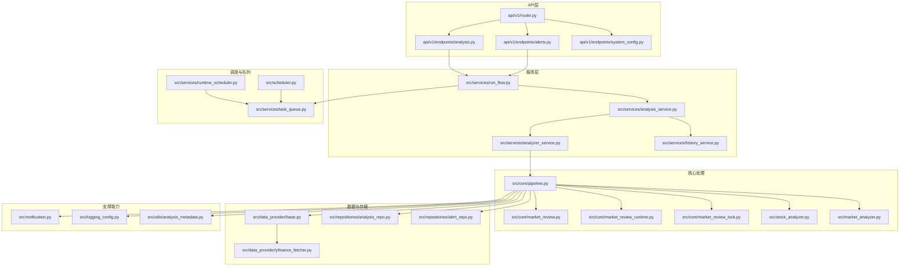

图表来源
- [api/v1/router.py](file://api/v1/router.py)
- [api/v1/endpoints/analysis.py](file://api/v1/endpoints/analysis.py)
- [api/v1/endpoints/alerts.py](file://api/v1/endpoints/alerts.py)
- [api/v1/endpoints/system_config.py](file://api/v1/endpoints/system_config.py)
- [src/services/run_flow.py](file://src/services/run_flow.py)
- [src/services/task_queue.py](file://src/services/task_queue.py)
- [src/services/runtime_scheduler.py](file://src/services/runtime_scheduler.py)
- [src/scheduler.py](file://src/scheduler.py)
- [src/core/pipeline.py](file://src/core/pipeline.py)
- [src/core/market_review.py](file://src/core/market_review.py)
- [src/core/market_review_runtime.py](file://src/core/market_review_runtime.py)
- [src/core/market_review_lock.py](file://src/core/market_review_lock.py)
- [src/stock_analyzer.py](file://src/stock_analyzer.py)
- [src/market_analyzer.py](file://src/market_analyzer.py)
- [src/data_provider/base.py](file://src/data_provider/base.py)
- [src/data_provider/yfinance_fetcher.py](file://src/data_provider/yfinance_fetcher.py)
- [src/repositories/analysis_repo.py](file://src/repositories/analysis_repo.py)
- [src/repositories/alert_repo.py](file://src/repositories/alert_repo.py)
- [src/notification.py](file://src/notification.py)
- [src/logging_config.py](file://src/logging_config.py)
- [src/utils/analysis_metadata.py](file://src/utils/analysis_metadata.py)

章节来源
- [main.py](file://main.py)
- [server.py](file://server.py)
- [api/v1/router.py](file://api/v1/router.py)

## 核心组件
- 任务队列：提供异步任务入队、出队、重试、幂等与并发控制能力
- 运行时调度器：基于时间或事件触发任务，协调周期性分析
- 管道编排：将数据拉取、指标计算、LLM 推理、报告生成串联为可插拔阶段
- 市场复盘与锁：保证同一时段内仅有一份复盘在运行，避免重复资源消耗
- 数据提供者：统一抽象多种数据源，支持失败回退与限流
- 存储仓库：分析结果与告警的持久化与查询
- 通知：统一多渠道发送与降噪策略
- 日志与元数据：结构化日志、追踪ID、性能指标埋点

章节来源
- [src/services/task_queue.py](file://src/services/task_queue.py)
- [src/services/runtime_scheduler.py](file://src/services/runtime_scheduler.py)
- [src/core/pipeline.py](file://src/core/pipeline.py)
- [src/core/market_review.py](file://src/core/market_review.py)
- [src/core/market_review_lock.py](file://src/core/market_review_lock.py)
- [src/data_provider/base.py](file://src/data_provider/base.py)
- [src/repositories/analysis_repo.py](file://src/repositories/analysis_repo.py)
- [src/repositories/alert_repo.py](file://src/repositories/alert_repo.py)
- [src/notification.py](file://src/notification.py)
- [src/logging_config.py](file://src/logging_config.py)
- [src/utils/analysis_metadata.py](file://src/utils/analysis_metadata.py)

## 架构总览
Daily Stock Analysis 的消息处理遵循“接入—校验—解析—路由—调度—执行—持久化—通知”的标准流水线。HTTP 请求进入 API 路由后，由端点进行参数校验与上下文构建，随后通过运行流服务编排任务，将工作项投递到任务队列。调度器按策略触发周期性任务，管道逐步消费任务，调用数据提供者与存储，最终输出报告并通过通知渠道分发。

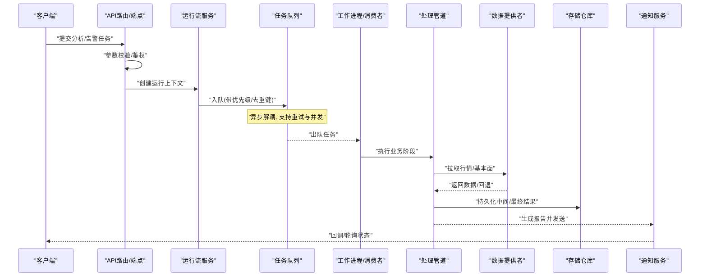

图表来源
- [api/v1/router.py](file://api/v1/router.py)
- [api/v1/endpoints/analysis.py](file://api/v1/endpoints/analysis.py)
- [api/v1/endpoints/alerts.py](file://api/v1/endpoints/alerts.py)
- [src/services/run_flow.py](file://src/services/run_flow.py)
- [src/services/task_queue.py](file://src/services/task_queue.py)
- [src/core/pipeline.py](file://src/core/pipeline.py)
- [src/data_provider/base.py](file://src/data_provider/base.py)
- [src/repositories/analysis_repo.py](file://src/repositories/analysis_repo.py)
- [src/notification.py](file://src/notification.py)

## 详细组件分析

### 消息接收与校验
- HTTP 入口：路由注册与端点定义，集中处理请求解析、鉴权与错误映射
- 参数校验：使用 Pydantic 模型进行强类型校验，确保字段完整性与取值范围
- 上下文构建：根据请求体构造运行上下文（标的集合、时间窗口、策略选择等）

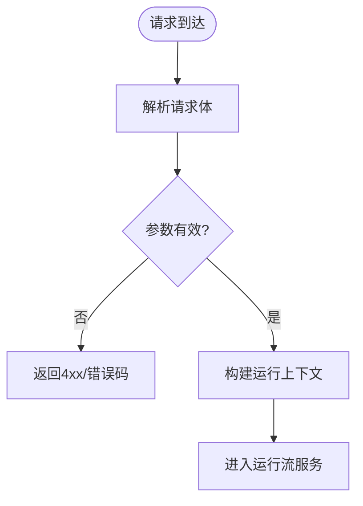

图表来源
- [api/v1/router.py](file://api/v1/router.py)
- [api/v1/endpoints/analysis.py](file://api/v1/endpoints/analysis.py)
- [api/v1/endpoints/alerts.py](file://api/v1/endpoints/alerts.py)

章节来源
- [api/v1/router.py](file://api/v1/router.py)
- [api/v1/endpoints/analysis.py](file://api/v1/endpoints/analysis.py)
- [api/v1/endpoints/alerts.py](file://api/v1/endpoints/alerts.py)

### 内容解析与路由决策
- 运行流服务：根据上下文决定执行哪些子流程（如单股分析、组合分析、市场复盘）
- 路由策略：依据标的类型（A/HK/US）、时间粒度、策略标签进行分支
- 任务拆分：将大任务拆分为可并行的小任务（如多只股票并行拉取与计算）

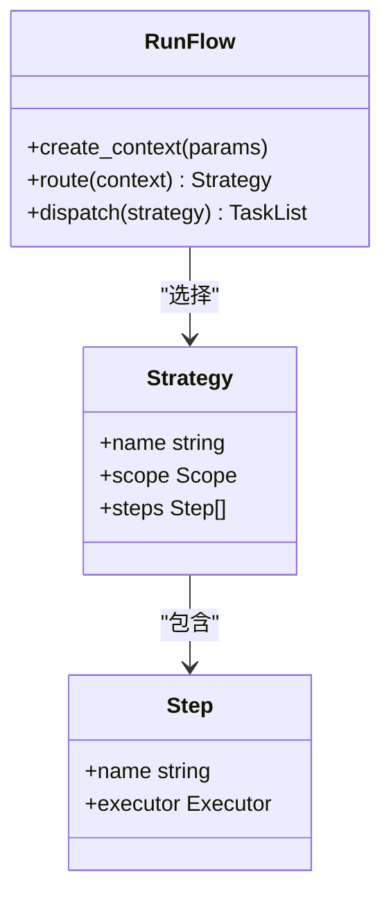

图表来源
- [src/services/run_flow.py](file://src/services/run_flow.py)

章节来源
- [src/services/run_flow.py](file://src/services/run_flow.py)

### 任务队列与并发控制
- 入队：支持优先级、去重键、TTL、延迟执行
- 出队与消费：多消费者并行，限制并发度，避免下游过载
- 重试与死信：指数退避、最大重试次数、失败归档
- 幂等性：基于唯一键去重，防止重复执行

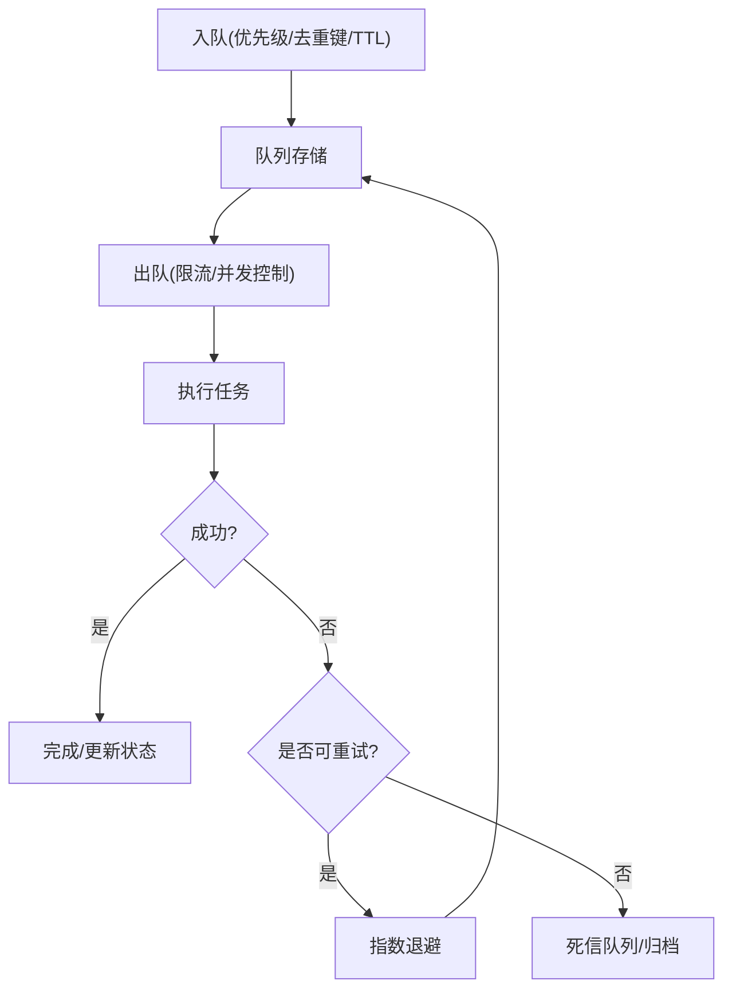

图表来源
- [src/services/task_queue.py](file://src/services/task_queue.py)

章节来源
- [src/services/task_queue.py](file://src/services/task_queue.py)
- [tests/test_task_service.py](file://tests/test_task_service.py)

### 调度与周期任务
- 运行时调度器：基于 Cron/事件驱动，触发每日分析、复盘与告警扫描
- 调度器：轻量任务调度，配合队列实现削峰填谷
- 互斥锁：市场复盘在同一时段仅一份执行，避免重复占用资源

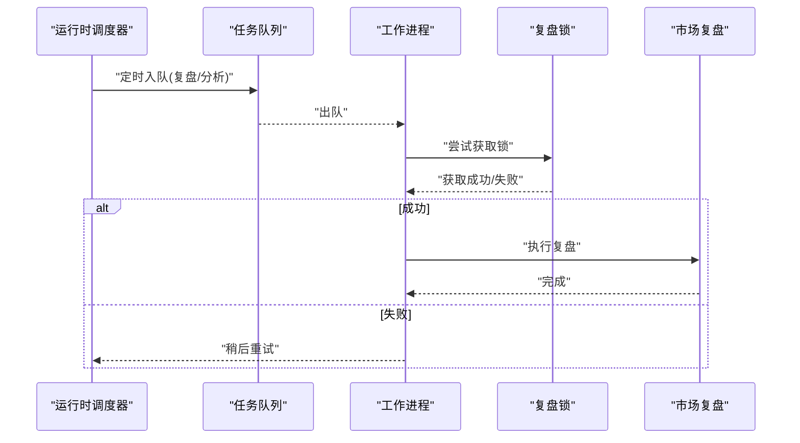

图表来源
- [src/services/runtime_scheduler.py](file://src/services/runtime_scheduler.py)
- [src/scheduler.py](file://src/scheduler.py)
- [src/core/market_review_lock.py](file://src/core/market_review_lock.py)
- [src/core/market_review.py](file://src/core/market_review.py)

章节来源
- [src/services/runtime_scheduler.py](file://src/services/runtime_scheduler.py)
- [src/scheduler.py](file://src/scheduler.py)
- [src/core/market_review_lock.py](file://src/core/market_review_lock.py)
- [src/core/market_review.py](file://src/core/market_review.py)

### 处理管道与执行
- 管道阶段：数据拉取→指标计算→LLM 推理→报告渲染→通知发送
- 容错设计：各阶段可独立失败回退，保障整体可用性
- 并行优化：对无依赖的阶段并行执行，缩短端到端时延

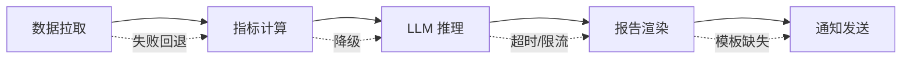

图表来源
- [src/core/pipeline.py](file://src/core/pipeline.py)
- [src/stock_analyzer.py](file://src/stock_analyzer.py)
- [src/market_analyzer.py](file://src/market_analyzer.py)

章节来源
- [src/core/pipeline.py](file://src/core/pipeline.py)
- [src/stock_analyzer.py](file://src/stock_analyzer.py)
- [src/market_analyzer.py](file://src/market_analyzer.py)

### 数据提供者与缓存
- 统一抽象：基类定义接口，具体 Fetcher 实现不同数据源
- 缓存策略：内存/本地缓存命中优先，未命中再拉取
- 限流与回退：按源限速，失败切换备用源

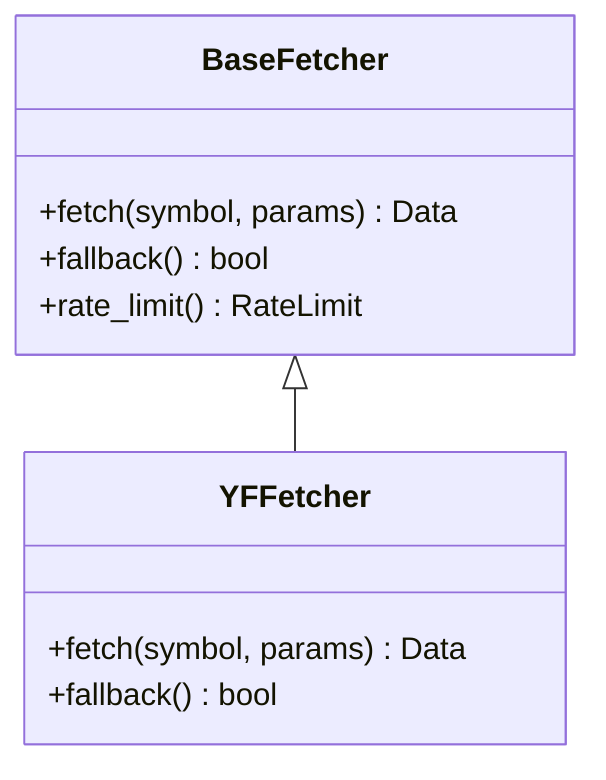

图表来源
- [src/data_provider/base.py](file://src/data_provider/base.py)
- [src/data_provider/yfinance_fetcher.py](file://src/data_provider/yfinance_fetcher.py)

章节来源
- [src/data_provider/base.py](file://src/data_provider/base.py)
- [src/data_provider/yfinance_fetcher.py](file://src/data_provider/yfinance_fetcher.py)

### 存储与去重
- 分析结果：按时间、标的、策略维度持久化，便于回溯与对比
- 告警记录：告警事件入库，支持聚合与统计
- 去重机制：基于业务键（如标的+时间窗+策略）去重，避免重复处理

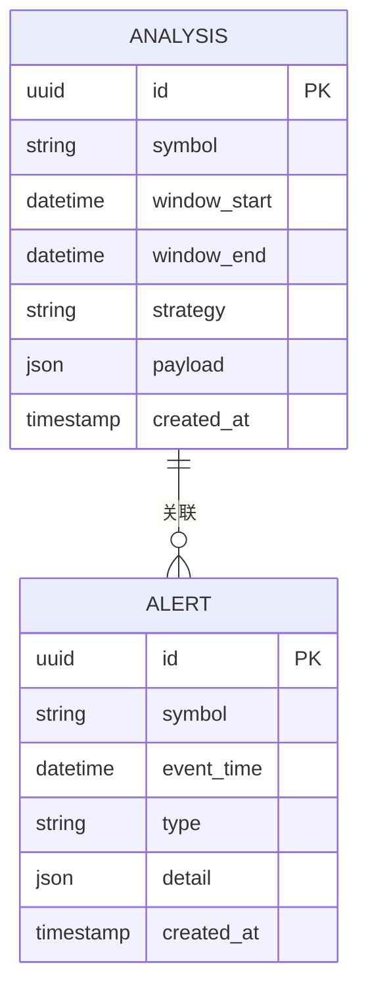

图表来源
- [src/repositories/analysis_repo.py](file://src/repositories/analysis_repo.py)
- [src/repositories/alert_repo.py](file://src/repositories/alert_repo.py)

章节来源
- [src/repositories/analysis_repo.py](file://src/repositories/analysis_repo.py)
- [src/repositories/alert_repo.py](file://src/repositories/alert_repo.py)

### 通知与监控日志
- 通知：统一抽象多渠道发送，支持模板与降噪
- 日志：结构化日志、追踪ID、性能指标埋点
- 监控：关键指标（吞吐、延迟、错误率、队列长度）采集与上报

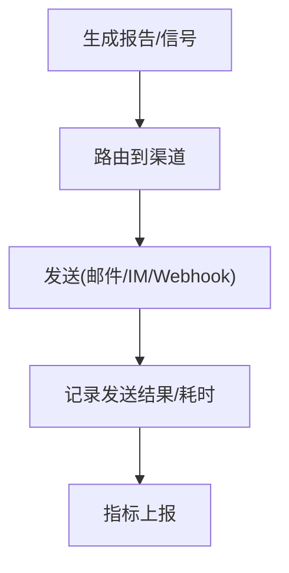

图表来源
- [src/notification.py](file://src/notification.py)
- [src/logging_config.py](file://src/logging_config.py)

章节来源
- [src/notification.py](file://src/notification.py)
- [src/logging_config.py](file://src/logging_config.py)

## 依赖关系分析
- API 层依赖运行流与服务层，服务层依赖管道、数据提供者与存储
- 调度器与队列松耦合，通过任务契约交互
- 通知与日志作为横切能力被广泛引用

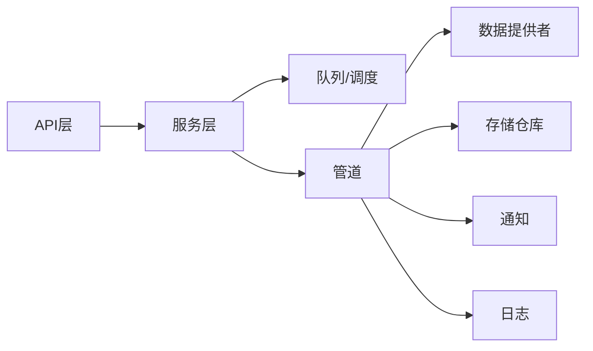

图表来源
- [api/v1/router.py](file://api/v1/router.py)
- [src/services/run_flow.py](file://src/services/run_flow.py)
- [src/services/task_queue.py](file://src/services/task_queue.py)
- [src/core/pipeline.py](file://src/core/pipeline.py)
- [src/data_provider/base.py](file://src/data_provider/base.py)
- [src/repositories/analysis_repo.py](file://src/repositories/analysis_repo.py)
- [src/notification.py](file://src/notification.py)
- [src/logging_config.py](file://src/logging_config.py)

章节来源
- [api/v1/router.py](file://api/v1/router.py)
- [src/services/run_flow.py](file://src/services/run_flow.py)
- [src/services/task_queue.py](file://src/services/task_queue.py)
- [src/core/pipeline.py](file://src/core/pipeline.py)

## 性能考量
- 并发控制：合理设置队列消费者数量与阶段并行度，避免下游限流与资源争用
- 缓存命中：提升数据提供者缓存命中率，减少外部调用
- 批处理：合并小任务，降低队列与存储压力
- 超时与熔断：为外部调用设置超时与熔断，保护主链路
- 背压与削峰：高峰期通过队列缓冲，平滑峰值流量
- 容量规划：基于历史吞吐与延迟分布，预估 CPU/内存/IO 需求，预留冗余

[本节为通用指导，不直接分析具体文件]

## 故障排查指南
- 常见错误分类
  - 网络异常：连接超时、DNS 解析失败、TLS 握手失败
  - API 限流：429/速率限制头，需退避与降级
  - 业务逻辑错误：参数非法、标的不存在、时间窗无效
- 定位手段
  - 查看结构化日志与追踪ID，定位调用链
  - 检查队列长度、消费者健康、死信队列
  - 核对数据提供者健康与缓存命中率
- 恢复策略
  - 自动重试（指数退避）、手动补偿任务
  - 切换备用数据源或降级策略
  - 暂停调度器，修复后再恢复

章节来源
- [src/logging_config.py](file://src/logging_config.py)
- [src/services/task_queue.py](file://src/services/task_queue.py)
- [src/data_provider/base.py](file://src/data_provider/base.py)
- [tests/test_pipeline_single_notify_thread_safety.py](file://tests/test_pipeline_single_notify_thread_safety.py)

## 结论
Daily Stock Analysis 的消息处理流程以“队列+管道”为核心，结合运行时调度与互斥锁，实现了高可用、可扩展与可观测的分析流水线。通过严格的参数校验、幂等与去重、完善的错误重试与回退策略，以及统一的日志与通知体系，系统在复杂外部依赖环境下仍能保持稳定与高效。建议在生产环境中持续监控关键指标，并结合负载特征动态调整并发与容量。

[本节为总结性内容，不直接分析具体文件]

## 附录
- 环境变量与配置：系统配置端点用于动态调整行为（如通知开关、数据源优先级）
- 测试用例：覆盖通知环境、线程安全、任务服务等行为验证

章节来源
- [api/v1/endpoints/system_config.py](file://api/v1/endpoints/system_config.py)
- [tests/test_daily_analysis_workflow_notification_env.py](file://tests/test_daily_analysis_workflow_notification_env.py)
- [tests/test_task_service.py](file://tests/test_task_service.py)