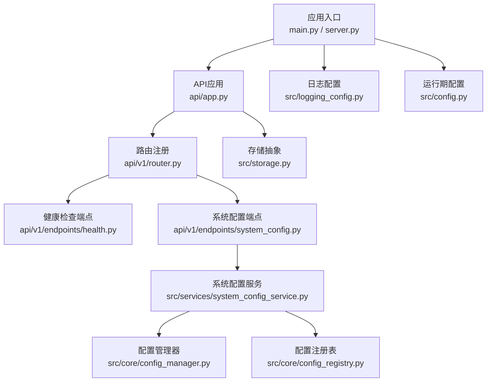
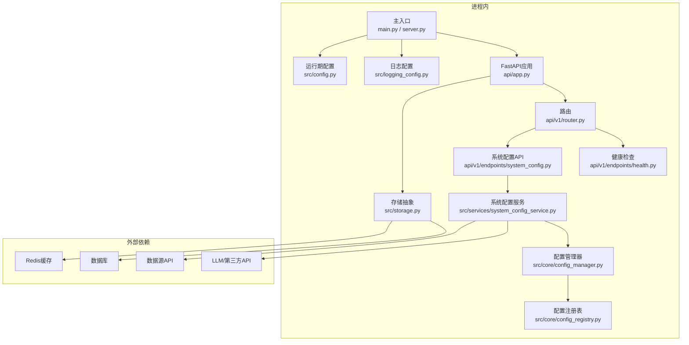
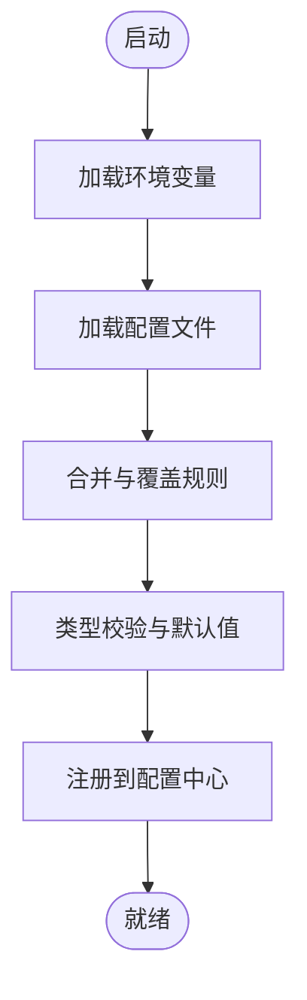
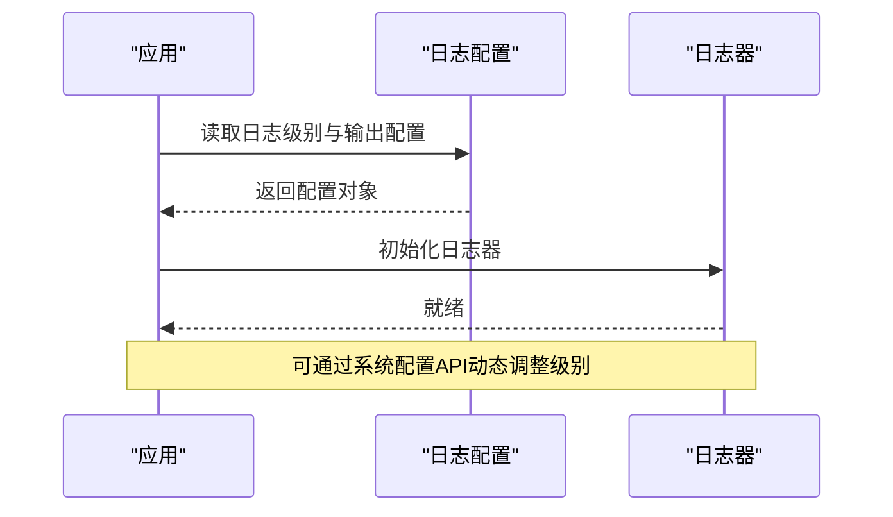
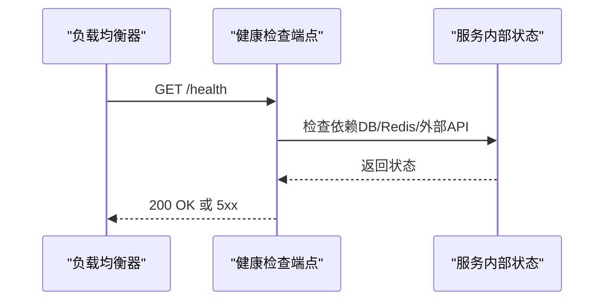
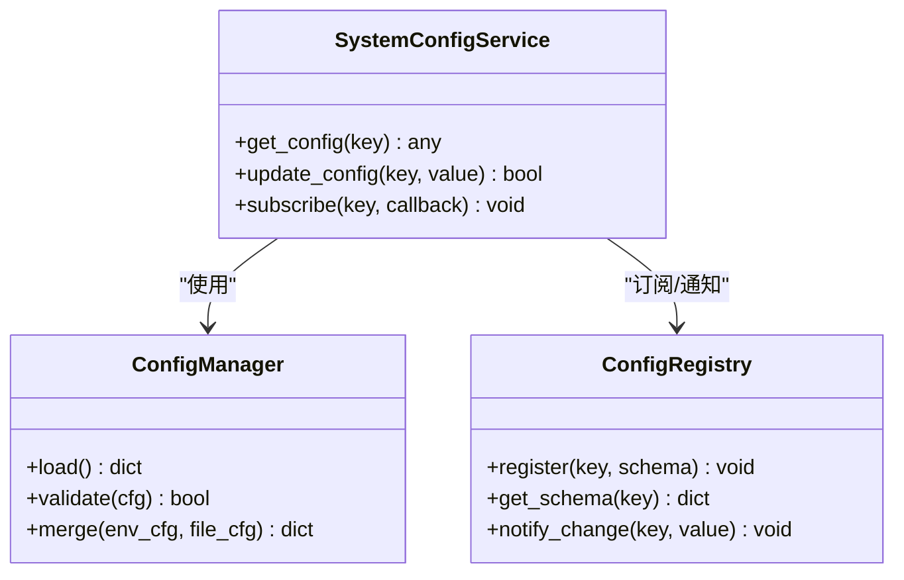
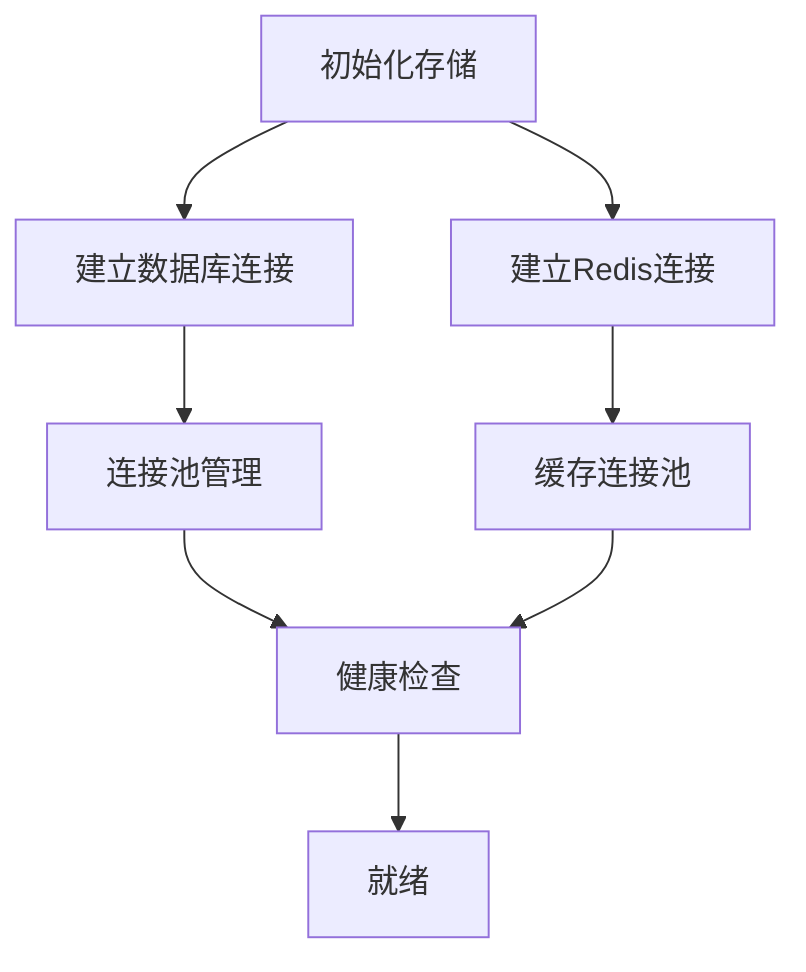
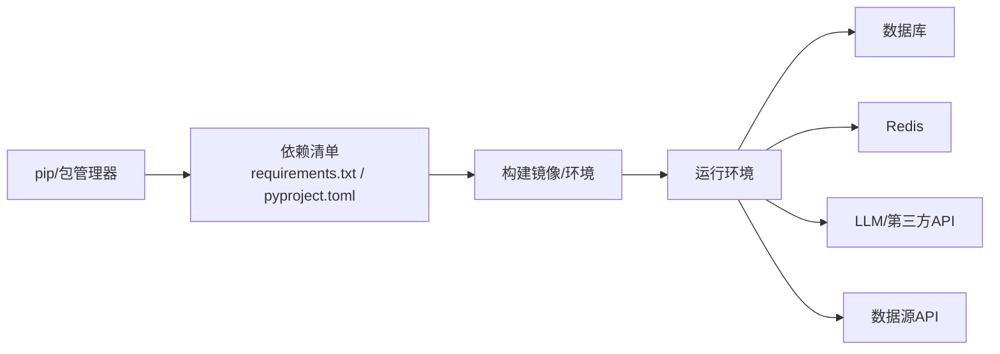
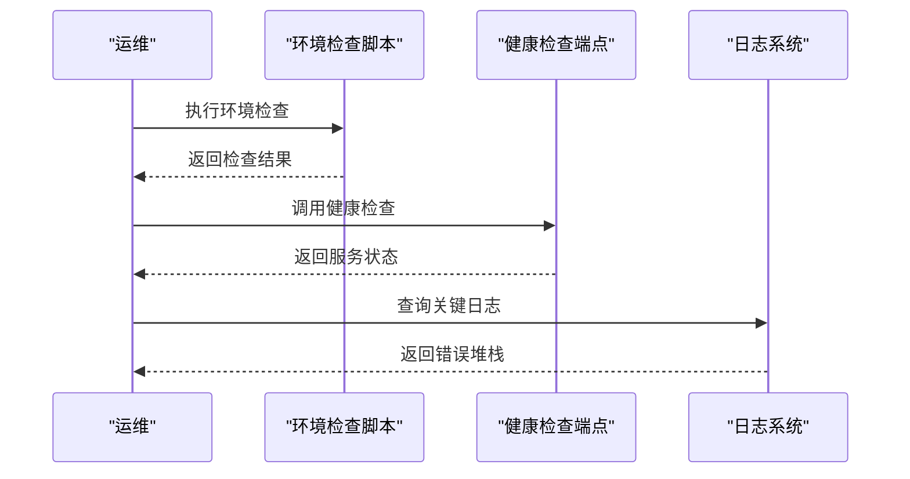

# 配置与部署

<cite>
**本文引用的文件**   
- [main.py](file://main.py)
- [server.py](file://server.py)
- [pyproject.toml](file://pyproject.toml)
- [requirements.txt](file://requirements.txt)
- [src/config.py](file://src/config.py)
- [src/logging_config.py](file://src/logging_config.py)
- [docker/Dockerfile](file://docker/Dockerfile)
- [docker/docker-compose.yml](file://docker/docker-compose.yml)
- [docker/entrypoint.sh](file://docker/entrypoint.sh)
- [api/app.py](file://api/app.py)
- [api/v1/router.py](file://api/v1/router.py)
- [api/v1/endpoints/health.py](file://api/v1/endpoints/health.py)
- [api/v1/endpoints/system_config.py](file://api/v1/endpoints/system_config.py)
- [src/services/system_config_service.py](file://src/services/system_config_service.py)
- [src/core/config_manager.py](file://src/core/config_manager.py)
- [src/core/config_registry.py](file://src/core/config_registry.py)
- [src/storage.py](file://src/storage.py)
- [scripts/check_env.py](file://scripts/check_env.py)
- [docs/DEPLOY.md](file://docs/DEPLOY.md)
- [docs/DEPLOY_EN.md](file://docs/DEPLOY_EN.md)
</cite>

## 目录
1. [简介](#简介)
2. [项目结构](#项目结构)
3. [核心组件](#核心组件)
4. [架构总览](#架构总览)
5. [详细组件分析](#详细组件分析)
6. [依赖分析](#依赖分析)
7. [性能考虑](#性能考虑)
8. [故障排查指南](#故障排查指南)
9. [结论](#结论)
10. [附录](#附录)

## 简介
本文件面向Daily Stock Analysis的运维与部署人员，系统化说明环境配置、部署模式、配置文件管理、健康检查与监控、负载均衡与高可用、以及部署后验证与故障排查。内容覆盖数据库连接、Redis缓存、第三方API密钥、日志级别、环境变量与配置文件格式、动态配置更新机制，以及单机、容器化与集群部署的关键差异与最佳实践。

## 项目结构
本项目采用前后端分离与模块化后端设计：
- 后端入口与Web服务由Python脚本提供，包含API路由、中间件、健康检查与系统配置接口。
- 配置与运行时参数通过集中式配置模块与环境变量加载。
- 数据访问层抽象了存储（数据库/缓存）与外部数据源。
- Docker相关资源用于容器化部署与编排。

**图表来源** 
- [main.py:1-200](file://main.py#L1-L200)
- [server.py:1-200](file://server.py#L1-L200)
- [api/app.py:1-200](file://api/app.py#L1-L200)
- [api/v1/router.py:1-200](file://api/v1/router.py#L1-L200)
- [api/v1/endpoints/health.py:1-200](file://api/v1/endpoints/health.py#L1-L200)
- [api/v1/endpoints/system_config.py:1-200](file://api/v1/endpoints/system_config.py#L1-L200)
- [src/services/system_config_service.py:1-200](file://src/services/system_config_service.py#L1-L200)
- [src/core/config_manager.py:1-200](file://src/core/config_manager.py#L1-L200)
- [src/core/config_registry.py:1-200](file://src/core/config_registry.py#L1-L200)
- [src/storage.py:1-200](file://src/storage.py#L1-L200)
- [src/logging_config.py:1-200](file://src/logging_config.py#L1-L200)
- [src/config.py:1-200](file://src/config.py#L1-L200)

**章节来源**
- [main.py:1-200](file://main.py#L1-L200)
- [server.py:1-200](file://server.py#L1-L200)
- [api/app.py:1-200](file://api/app.py#L1-L200)
- [api/v1/router.py:1-200](file://api/v1/router.py#L1-L200)
- [src/config.py:1-200](file://src/config.py#L1-L200)
- [src/logging_config.py:1-200](file://src/logging_config.py#L1-L200)
- [src/storage.py:1-200](file://src/storage.py#L1-L200)

## 核心组件
- 配置加载与校验：集中式配置模块负责从环境变量与配置文件加载参数，并进行类型校验与默认值处理。
- 日志配置：统一初始化日志级别、输出目标与格式化策略。
- API与健康检查：提供REST接口与健康检查端点，便于负载均衡器与编排平台探测服务状态。
- 系统配置服务：暴露可动态更新的系统配置能力，支持热更新关键运行时参数。
- 存储抽象：封装数据库与缓存访问，屏蔽底层实现差异。

**章节来源**
- [src/config.py:1-200](file://src/config.py#L1-L200)
- [src/logging_config.py:1-200](file://src/logging_config.py#L1-L200)
- [api/v1/endpoints/health.py:1-200](file://api/v1/endpoints/health.py#L1-L200)
- [api/v1/endpoints/system_config.py:1-200](file://api/v1/endpoints/system_config.py#L1-L200)
- [src/services/system_config_service.py:1-200](file://src/services/system_config_service.py#L1-L200)
- [src/core/config_manager.py:1-200](file://src/core/config_manager.py#L1-L200)
- [src/core/config_registry.py:1-200](file://src/core/config_registry.py#L1-L200)
- [src/storage.py:1-200](file://src/storage.py#L1-L200)

## 架构总览
下图展示了从进程入口到API、配置与存储的整体交互关系，以及容器化部署时的关键组件。

**图表来源** 
- [main.py:1-200](file://main.py#L1-L200)
- [server.py:1-200](file://server.py#L1-L200)
- [api/app.py:1-200](file://api/app.py#L1-L200)
- [api/v1/router.py:1-200](file://api/v1/router.py#L1-L200)
- [api/v1/endpoints/health.py:1-200](file://api/v1/endpoints/health.py#L1-L200)
- [api/v1/endpoints/system_config.py:1-200](file://api/v1/endpoints/system_config.py#L1-L200)
- [src/services/system_config_service.py:1-200](file://src/services/system_config_service.py#L1-L200)
- [src/core/config_manager.py:1-200](file://src/core/config_manager.py#L1-L200)
- [src/core/config_registry.py:1-200](file://src/core/config_registry.py#L1-L200)
- [src/storage.py:1-200](file://src/storage.py#L1-L200)
- [src/logging_config.py:1-200](file://src/logging_config.py#L1-L200)
- [src/config.py:1-200](file://src/config.py#L1-L200)

## 详细组件分析

### 配置加载与校验（环境变量与配置文件）
- 环境变量优先：所有关键配置项均支持通过环境变量注入，包括数据库连接串、Redis地址、第三方API密钥、日志级别等。
- 配置文件格式：支持YAML/JSON等常见格式，结合环境变量进行合并与覆盖。
- 动态配置更新：通过系统配置API与服务层实现运行时更新，避免重启影响业务。

**图表来源** 
- [src/config.py:1-200](file://src/config.py#L1-L200)
- [src/core/config_manager.py:1-200](file://src/core/config_manager.py#L1-L200)
- [src/core/config_registry.py:1-200](file://src/core/config_registry.py#L1-L200)

**章节来源**
- [src/config.py:1-200](file://src/config.py#L1-L200)
- [src/core/config_manager.py:1-200](file://src/core/config_manager.py#L1-L200)
- [src/core/config_registry.py:1-200](file://src/core/config_registry.py#L1-L200)

### 日志配置与级别设置
- 统一日志初始化：在应用启动时按配置设置日志级别、输出目标（控制台/文件）、格式化模板。
- 动态调整：支持通过系统配置或环境变量实时调整日志级别，便于生产问题定位。

**图表来源** 
- [src/logging_config.py:1-200](file://src/logging_config.py#L1-L200)
- [api/v1/endpoints/system_config.py:1-200](file://api/v1/endpoints/system_config.py#L1-L200)

**章节来源**
- [src/logging_config.py:1-200](file://src/logging_config.py#L1-L200)
- [api/v1/endpoints/system_config.py:1-200](file://api/v1/endpoints/system_config.py#L1-L200)

### 健康检查与监控
- 健康检查端点：提供HTTP健康检查接口，供负载均衡器与编排平台探测服务可用性。
- 监控指标：建议暴露基础指标（如请求数、错误率、延迟），并集成外部监控系统。

**图表来源** 
- [api/v1/endpoints/health.py:1-200](file://api/v1/endpoints/health.py#L1-L200)
- [src/storage.py:1-200](file://src/storage.py#L1-L200)

**章节来源**
- [api/v1/endpoints/health.py:1-200](file://api/v1/endpoints/health.py#L1-L200)
- [src/storage.py:1-200](file://src/storage.py#L1-L200)

### 系统配置与动态更新
- 配置接口：提供REST接口查询与更新系统配置。
- 服务层：负责校验、持久化与广播更新事件。
- 配置注册表：维护配置项元数据与变更监听。

**图表来源** 
- [src/services/system_config_service.py:1-200](file://src/services/system_config_service.py#L1-L200)
- [src/core/config_manager.py:1-200](file://src/core/config_manager.py#L1-L200)
- [src/core/config_registry.py:1-200](file://src/core/config_registry.py#L1-L200)

**章节来源**
- [src/services/system_config_service.py:1-200](file://src/services/system_config_service.py#L1-L200)
- [src/core/config_manager.py:1-200](file://src/core/config_manager.py#L1-L200)
- [src/core/config_registry.py:1-200](file://src/core/config_registry.py#L1-L200)

### 存储抽象（数据库与Redis）
- 数据库连接：支持多数据库驱动，连接池与重试策略可配置。
- Redis缓存：支持连接池、过期策略与序列化方式。
- 健康检查：存储层健康检查需纳入整体健康检查流程。

**图表来源** 
- [src/storage.py:1-200](file://src/storage.py#L1-L200)
- [api/v1/endpoints/health.py:1-200](file://api/v1/endpoints/health.py#L1-L200)

**章节来源**
- [src/storage.py:1-200](file://src/storage.py#L1-L200)
- [api/v1/endpoints/health.py:1-200](file://api/v1/endpoints/health.py#L1-L200)

## 依赖分析
- 构建依赖：通过包管理工具声明依赖版本，确保构建可重复性。
- 运行依赖：最小化运行时依赖，按需启用功能模块。
- 外部依赖：数据库、Redis、LLM与数据源API的连接信息通过环境变量注入。

**图表来源** 
- [requirements.txt:1-200](file://requirements.txt#L1-L200)
- [pyproject.toml:1-200](file://pyproject.toml#L1-L200)

**章节来源**
- [requirements.txt:1-200](file://requirements.txt#L1-L200)
- [pyproject.toml:1-200](file://pyproject.toml#L1-L200)

## 性能考虑
- 连接池：为数据库与Redis配置合理的连接池大小，避免连接耗尽。
- 超时与重试：对外部API调用设置合理超时与重试策略，提升鲁棒性。
- 缓存策略：合理使用Redis缓存热点数据，降低下游压力。
- 日志级别：生产环境建议使用INFO或WARNING级别，减少I/O开销。
- 并发模型：根据负载选择合适的WSGI服务器与线程/进程数。

[本节为通用指导，不直接分析具体文件]

## 故障排查指南
- 环境检查：使用诊断脚本验证环境变量与依赖是否满足要求。
- 健康检查：通过健康检查端点确认服务与依赖状态。
- 日志定位：调整日志级别并查看关键路径日志，定位异常。
- 配置回滚：通过系统配置接口回滚错误的动态配置。

**图表来源** 
- [scripts/check_env.py:1-200](file://scripts/check_env.py#L1-L200)
- [api/v1/endpoints/health.py:1-200](file://api/v1/endpoints/health.py#L1-L200)

**章节来源**
- [scripts/check_env.py:1-200](file://scripts/check_env.py#L1-L200)
- [api/v1/endpoints/health.py:1-200](file://api/v1/endpoints/health.py#L1-L200)

## 结论
通过集中式配置、健康检查与动态配置更新机制，Daily Stock Analysis具备良好的可配置性与可运维性。遵循本文的环境配置、部署模式与故障排查指南，可实现稳定可靠的单机、容器化与集群部署。

[本节为总结，不直接分析具体文件]

## 附录

### 环境配置选项
- 数据库连接：连接串、用户名、密码、池大小、超时等。
- Redis配置：地址、端口、密码、库号、连接池与序列化方式。
- 第三方API密钥：LLM提供商、数据源API密钥与限流策略。
- 日志级别：DEBUG/INFO/WARNING/ERROR，支持动态调整。

**章节来源**
- [src/config.py:1-200](file://src/config.py#L1-L200)
- [src/logging_config.py:1-200](file://src/logging_config.py#L1-L200)

### 部署模式差异
- 单机部署：本地开发或小型环境，直接运行主入口脚本。
- 容器化部署：使用Docker镜像与编排文件，简化依赖与环境一致性。
- 集群部署：多实例+负载均衡+会话共享（Redis），配合健康检查与自动扩缩容。

**章节来源**
- [docker/Dockerfile:1-200](file://docker/Dockerfile#L1-L200)
- [docker/docker-compose.yml:1-200](file://docker/docker-compose.yml#L1-L200)
- [docker/entrypoint.sh:1-200](file://docker/entrypoint.sh#L1-L200)

### 配置文件管理
- 环境变量：优先注入敏感信息与运行时差异配置。
- 配置文件格式：YAML/JSON，支持分层与覆盖。
- 动态配置更新：通过系统配置API热更新，避免重启。

**章节来源**
- [src/core/config_manager.py:1-200](file://src/core/config_manager.py#L1-L200)
- [src/core/config_registry.py:1-200](file://src/core/config_registry.py#L1-L200)
- [api/v1/endpoints/system_config.py:1-200](file://api/v1/endpoints/system_config.py#L1-L200)

### 完整部署步骤
- 依赖安装：使用包管理工具安装依赖。
- 服务启动：启动主入口或容器化服务。
- 健康检查：调用健康检查端点确认服务状态。
- 监控配置：接入日志与指标采集。

**章节来源**
- [requirements.txt:1-200](file://requirements.txt#L1-L200)
- [pyproject.toml:1-200](file://pyproject.toml#L1-L200)
- [docker/docker-compose.yml:1-200](file://docker/docker-compose.yml#L1-L200)
- [api/v1/endpoints/health.py:1-200](file://api/v1/endpoints/health.py#L1-L200)

### 负载均衡与高可用
- 多实例部署：通过编排平台复制多个实例。
- 会话共享：使用Redis作为会话存储，保证跨实例一致性。
- 健康检查：负载均衡器基于健康检查剔除不健康实例。

**章节来源**
- [docker/docker-compose.yml:1-200](file://docker/docker-compose.yml#L1-L200)
- [api/v1/endpoints/health.py:1-200](file://api/v1/endpoints/health.py#L1-L200)

### 部署后验证与故障排查
- 验证测试：执行端到端测试用例与冒烟测试。
- 故障排查：利用健康检查、日志与环境检查脚本快速定位问题。

**章节来源**
- [scripts/check_env.py:1-200](file://scripts/check_env.py#L1-L200)
- [api/v1/endpoints/health.py:1-200](file://api/v1/endpoints/health.py#L1-L200)