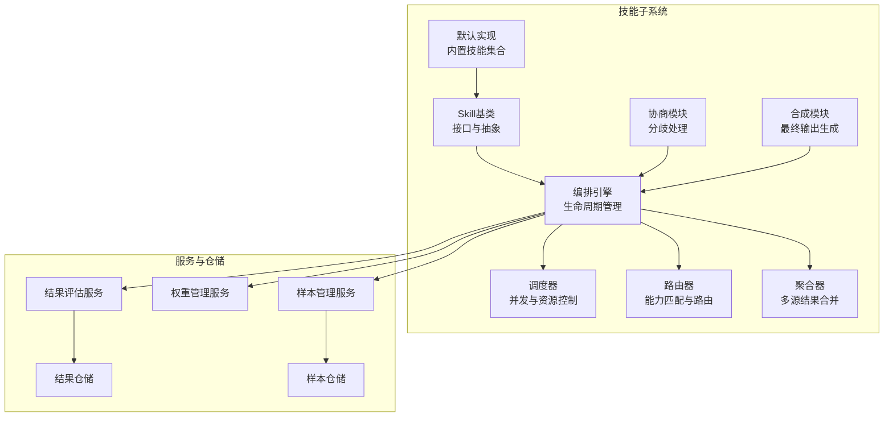
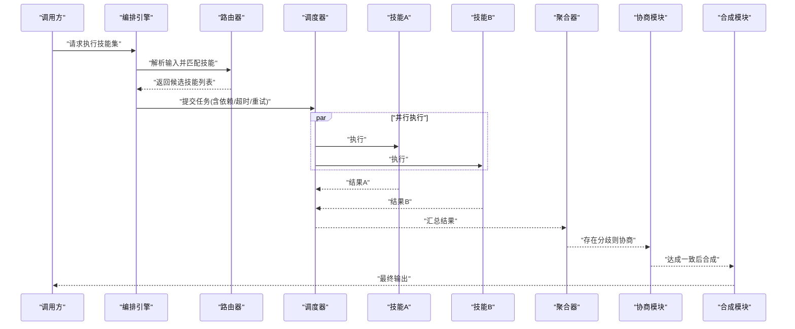
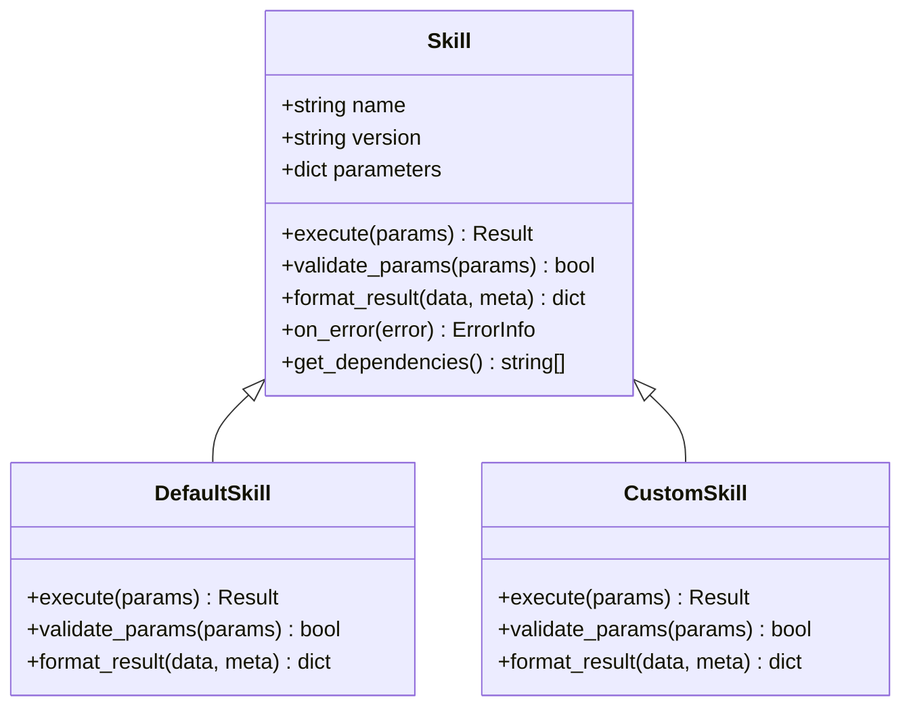
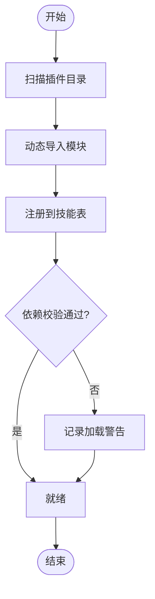
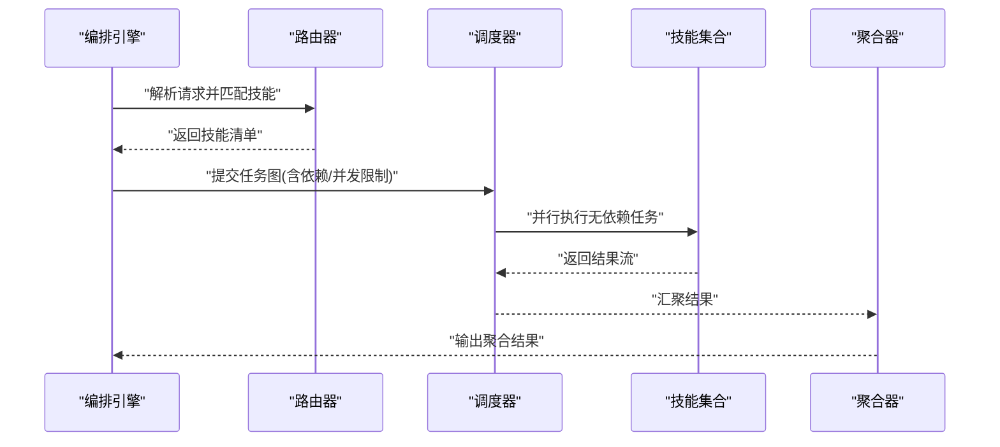
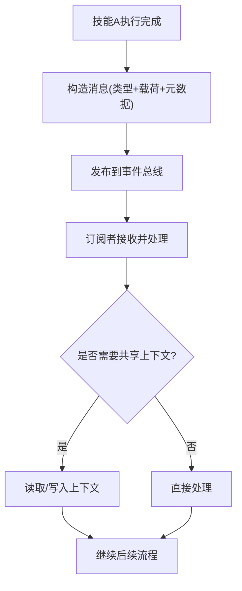
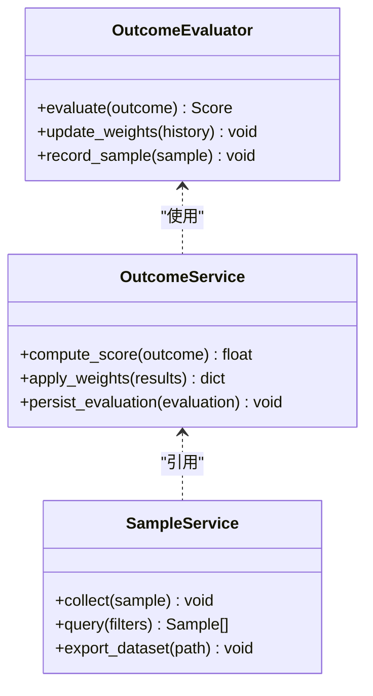
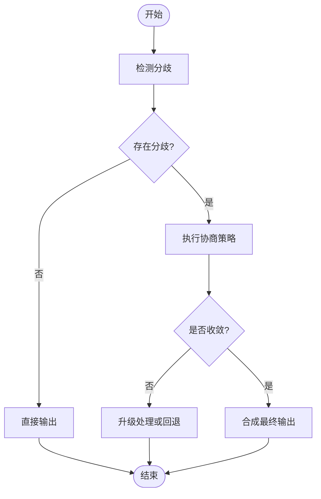
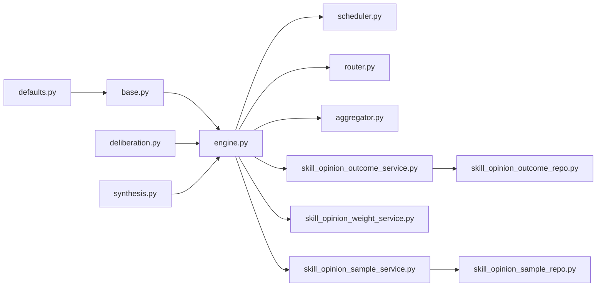

# AI技能扩展机制

<cite>
**本文档引用的文件**   
- [src/agent/skills/base.py](file://src/agent/skills/base.py)
- [src/agent/skills/engine.py](file://src/agent/skills/engine.py)
- [src/agent/skills/scheduler.py](file://src/agent/skills/scheduler.py)
- [src/agent/skills/router.py](file://src/agent/skills/router.py)
- [src/agent/skills/aggregator.py](file://src/agent/skills/aggregator.py)
- [src/agent/skills/defaults.py](file://src/agent/skills/defaults.py)
- [src/agent/skills/deliberation.py](file://src/agent/skills/deliberation.py)
- [src/agent/skills/synthesis.py](file://src/agent/skills/synthesis.py)
- [src/agent/skill_opinion_outcome_evaluator.py](file://src/core/skill_opinion_outcome_evaluator.py)
- [src/services/skill_opinion_outcome_service.py](file://src/services/skill_opinion_outcome_service.py)
- [src/services/skill_opinion_weight_service.py](file://src/services/skill_opinion_weight_service.py)
- [src/services/skill_opinion_sample_service.py](file://src/services/skill_opinion_sample_service.py)
- [src/repositories/skill_opinion_outcome_repo.py](file://src/repositories/skill_opinion_outcome_repo.py)
- [src/repositories/skill_opinion_sample_repo.py](file://src/repositories/skill_opinion_sample_repo.py)
- [tests/test_skill_load_warning.py](file://tests/test_skill_load_warning.py)
- [tests/test_skill_opinion_outcomes.py](file://tests/test_skill_opinion_outcomes.py)
- [tests/test_skill_opinion_samples.py](file://tests/test_skill_opinion_samples.py)
- [tests/test_strategy_deliberation.py](file://tests/test_strategy_deliberation.py)
</cite>

## 目录
1. [简介](#简介)
2. [项目结构](#项目结构)
3. [核心组件](#核心组件)
4. [架构总览](#架构总览)
5. [详细组件分析](#详细组件分析)
6. [依赖关系分析](#依赖关系分析)
7. [性能考量](#性能考量)
8. [故障排查指南](#故障排查指南)
9. [结论](#结论)
10. [附录：自定义技能开发示例与集成指南](#附录自定义技能开发示例与集成指南)

## 简介
本文件面向AI技能扩展机制，系统性阐述Skill基类的接口设计与抽象方法、技能注册与动态加载、编排引擎的调度与并行执行、技能间通信协议与数据传递机制，以及最佳实践与调试技巧。文档同时提供完整的自定义技能开发与集成指南，帮助开发者快速构建高质量、可维护、可扩展的技能模块。

## 项目结构
技能子系统位于 src/agent/skills 目录下，围绕“定义-注册-调度-执行-聚合”形成闭环；配套的服务层与仓储层负责技能意见结果与样本的持久化与评估；测试覆盖加载警告、结果统计与样本管理等关键路径。

图表来源
- [src/agent/skills/base.py](file://src/agent/skills/base.py)
- [src/agent/skills/engine.py](file://src/agent/skills/engine.py)
- [src/agent/skills/scheduler.py](file://src/agent/skills/scheduler.py)
- [src/agent/skills/router.py](file://src/agent/skills/router.py)
- [src/agent/skills/aggregator.py](file://src/agent/skills/aggregator.py)
- [src/agent/skills/defaults.py](file://src/agent/skills/defaults.py)
- [src/agent/skills/deliberation.py](file://src/agent/skills/deliberation.py)
- [src/agent/skills/synthesis.py](file://src/agent/skills/synthesis.py)
- [src/core/skill_opinion_outcome_evaluator.py](file://src/core/skill_opinion_outcome_evaluator.py)
- [src/services/skill_opinion_outcome_service.py](file://src/services/s skill_opinion_outcome_service.py)
- [src/services/skill_opinion_weight_service.py](file://src/services/skill_opinion_weight_service.py)
- [src/services/skill_opinion_sample_service.py](file://src/services/skill_opinion_sample_service.py)
- [src/repositories/skill_opinion_outcome_repo.py](file://src/repositories/skill_opinion_outcome_repo.py)
- [src/repositories/skill_opinion_sample_repo.py](file://src/repositories/skill_opinion_sample_repo.py)

章节来源
- [src/agent/skills/base.py](file://src/agent/skills/base.py)
- [src/agent/skills/engine.py](file://src/agent/skills/engine.py)
- [src/agent/skills/scheduler.py](file://src/agent/skills/scheduler.py)
- [src/agent/skills/router.py](file://src/agent/skills/router.py)
- [src/agent/skills/aggregator.py](file://src/agent/skills/aggregator.py)
- [src/agent/skills/defaults.py](file://src/agent/skills/defaults.py)
- [src/agent/skills/deliberation.py](file://src/agent/skills/deliberation.py)
- [src/agent/skills/synthesis.py](file://src/agent/skills/synthesis.py)
- [src/core/skill_opinion_outcome_evaluator.py](file://src/core/skill_opinion_outcome_evaluator.py)
- [src/services/skill_opinion_outcome_service.py](file://src/services/skill_opinion_outcome_service.py)
- [src/services/skill_opinion_weight_service.py](file://src/services/skill_opinion_weight_service.py)
- [src/services/skill_opinion_sample_service.py](file://src/services/skill_opinion_sample_service.py)
- [src/repositories/skill_opinion_outcome_repo.py](file://src/repositories/skill_opinion_outcome_repo.py)
- [src/repositories/skill_opinion_sample_repo.py](file://src/repositories/skill_opinion_sample_repo.py)

## 核心组件
- Skill基类：定义技能的统一接口与抽象方法，包括参数契约、执行逻辑、错误处理与结果格式化。
- 编排引擎：负责技能实例的生命周期、依赖注入、版本选择与调用编排。
- 调度器：管理并发度、超时、重试与资源隔离，确保高吞吐与稳定性。
- 路由器：基于能力标签与输入特征进行技能匹配与路由决策。
- 聚合器：对多技能并行结果进行合并、去重、加权与冲突消解。
- 默认实现：提供开箱即用的基础技能集合，便于快速集成与扩展。
- 协商与合成：在存在分歧时进行协商，并生成最终的合成输出。

章节来源
- [src/agent/skills/base.py](file://src/agent/skills/base.py)
- [src/agent/skills/engine.py](file://src/agent/skills/engine.py)
- [src/agent/skills/scheduler.py](file://src/agent/skills/scheduler.py)
- [src/agent/skills/router.py](file://src/agent/skills/router.py)
- [src/agent/skills/aggregator.py](file://src/agent/skills/aggregator.py)
- [src/agent/skills/defaults.py](file://src/agent/skills/defaults.py)
- [src/agent/skills/deliberation.py](file://src/agent/skills/deliberation.py)
- [src/agent/skills/synthesis.py](file://src/agent/skills/synthesis.py)

## 架构总览
技能扩展机制采用分层设计：接口层（Skill基类）→ 编排层（Engine）→ 执行层（Scheduler + Router + Aggregator）→ 结果层（Deliberation + Synthesis）。服务层与仓储层贯穿全链路，提供结果评估、权重管理与样本管理的持久化能力。

图表来源
- [src/agent/skills/engine.py](file://src/agent/skills/engine.py)
- [src/agent/skills/router.py](file://src/agent/skills/router.py)
- [src/agent/skills/scheduler.py](file://src/agent/skills/scheduler.py)
- [src/agent/skills/aggregator.py](file://src/agent/skills/aggregator.py)
- [src/agent/skills/deliberation.py](file://src/agent/skills/deliberation.py)
- [src/agent/skills/synthesis.py](file://src/agent/skills/synthesis.py)

## 详细组件分析

### Skill基类与接口设计
- 参数定义：通过统一的参数模型约束输入类型、必填项与默认值，支持可选字段与校验规则。
- 执行逻辑：定义标准执行入口，包含前置检查、业务处理、后置清理与异常捕获。
- 结果格式化：统一输出结构，包含状态码、消息体、元数据与追踪信息，便于下游消费。
- 错误处理：标准化错误分类（参数错误、运行时错误、外部依赖错误），并提供降级策略。
- 版本控制：支持语义化版本声明与兼容性检查，确保升级过程中的平滑过渡。

图表来源
- [src/agent/skills/base.py](file://src/agent/skills/base.py)
- [src/agent/skills/defaults.py](file://src/agent/skills/defaults.py)

章节来源
- [src/agent/skills/base.py](file://src/agent/skills/base.py)
- [src/agent/skills/defaults.py](file://src/agent/skills/defaults.py)

### 技能注册与动态加载
- 注册机制：通过装饰器或显式注册表将技能类映射到名称与版本，支持热更新与按需加载。
- 依赖管理：声明技能间的依赖关系，由编排引擎在启动时解析并校验，避免循环依赖。
- 版本控制：基于语义化版本进行兼容判断，优先选择满足约束的最新可用版本。
- 动态加载：支持从插件目录扫描并导入技能模块，减少硬编码配置。

图表来源
- [src/agent/skills/engine.py](file://src/agent/skills/engine.py)
- [tests/test_skill_load_warning.py](file://tests/test_skill_load_warning.py)

章节来源
- [src/agent/skills/engine.py](file://src/agent/skills/engine.py)
- [tests/test_skill_load_warning.py](file://tests/test_skill_load_warning.py)

### 编排引擎工作原理
- 技能调度：根据输入特征与能力标签选择合适技能，支持优先级与权重。
- 并行执行：利用调度器并发执行无依赖技能，提升吞吐与响应速度。
- 结果聚合：对并行结果进行合并、去重、加权与冲突消解，必要时触发协商。
- 生命周期：管理技能实例的创建、初始化、运行与销毁，确保资源释放。

图表来源
- [src/agent/skills/engine.py](file://src/agent/skills/engine.py)
- [src/agent/skills/scheduler.py](file://src/agent/skills/scheduler.py)
- [src/agent/skills/router.py](file://src/agent/skills/router.py)
- [src/agent/skills/aggregator.py](file://src/agent/skills/aggregator.py)

章节来源
- [src/agent/skills/engine.py](file://src/agent/skills/engine.py)
- [src/agent/skills/scheduler.py](file://src/agent/skills/scheduler.py)
- [src/agent/skills/router.py](file://src/agent/skills/router.py)
- [src/agent/skills/aggregator.py](file://src/agent/skills/aggregator.py)

### 技能间通信协议与数据传递
- 统一消息格式：所有技能间通信遵循统一的消息结构，包含类型、载荷、时间戳与追踪ID。
- 事件驱动：通过事件总线发布/订阅模式实现松耦合通信，支持异步回调与重试。
- 数据共享：提供上下文对象用于跨技能共享只读数据，避免重复计算。
- 错误传播：错误以结构化形式向上冒泡，便于定位与恢复。

[本图为概念性流程图，不直接映射具体源码文件]

### 结果评估、权重与样本管理
- 结果评估：对技能输出进行质量评估，包括准确性、一致性与置信度。
- 权重管理：基于历史表现动态调整技能权重，优化最终决策。
- 样本管理：采集典型样本用于训练与回归测试，保障长期稳定性。

图表来源
- [src/core/skill_opinion_outcome_evaluator.py](file://src/core/skill_opinion_outcome_evaluator.py)
- [src/services/skill_opinion_outcome_service.py](file://src/services/skill_opinion_outcome_service.py)
- [src/services/skill_opinion_weight_service.py](file://src/services/skill_opinion_weight_service.py)
- [src/services/skill_opinion_sample_service.py](file://src/services/skill_opinion_sample_service.py)
- [src/repositories/skill_opinion_outcome_repo.py](file://src/repositories/skill_opinion_outcome_repo.py)
- [src/repositories/skill_opinion_sample_repo.py](file://src/repositories/skill_opinion_sample_repo.py)

章节来源
- [src/core/skill_opinion_outcome_evaluator.py](file://src/core/skill_opinion_outcome_evaluator.py)
- [src/services/skill_opinion_outcome_service.py](file://src/services/skill_opinion_outcome_service.py)
- [src/services/skill_opinion_weight_service.py](file://src/services/skill_opinion_weight_service.py)
- [src/services/skill_opinion_sample_service.py](file://src/services/skill_opinion_sample_service.py)
- [src/repositories/skill_opinion_outcome_repo.py](file://src/repositories/skill_opinion_outcome_repo.py)
- [src/repositories/skill_opinion_sample_repo.py](file://src/repositories/skill_opinion_sample_repo.py)

### 协商与合成
- 分歧检测：比较多个技能输出的差异，识别不一致点。
- 协商策略：采用投票、加权平均或专家规则进行收敛。
- 合成输出：生成最终报告或决策，附带置信度与依据说明。

图表来源
- [src/agent/skills/deliberation.py](file://src/agent/skills/deliberation.py)
- [src/agent/skills/synthesis.py](file://src/agent/skills/synthesis.py)

章节来源
- [src/agent/skills/deliberation.py](file://src/agent/skills/deliberation.py)
- [src/agent/skills/synthesis.py](file://src/agent/skills/synthesis.py)

## 依赖关系分析
技能子系统内部模块高度内聚，对外通过清晰接口暴露能力。服务层与仓储层为横切关注点，贯穿整个执行链路。

图表来源
- [src/agent/skills/base.py](file://src/agent/skills/base.py)
- [src/agent/skills/engine.py](file://src/agent/skills/engine.py)
- [src/agent/skills/scheduler.py](file://src/agent/skills/scheduler.py)
- [src/agent/skills/router.py](file://src/agent/skills/router.py)
- [src/agent/skills/aggregator.py](file://src/agent/skills/aggregator.py)
- [src/agent/skills/defaults.py](file://src/agent/skills/defaults.py)
- [src/agent/skills/deliberation.py](file://src/agent/skills/deliberation.py)
- [src/agent/skills/synthesis.py](file://src/agent/skills/synthesis.py)
- [src/services/skill_opinion_outcome_service.py](file://src/services/skill_opinion_outcome_service.py)
- [src/services/skill_opinion_weight_service.py](file://src/services/skill_opinion_weight_service.py)
- [src/services/skill_opinion_sample_service.py](file://src/services/skill_opinion_sample_service.py)
- [src/repositories/skill_opinion_outcome_repo.py](file://src/repositories/skill_opinion_outcome_repo.py)
- [src/repositories/skill_opinion_sample_repo.py](file://src/repositories/skill_opinion_sample_repo.py)

章节来源
- [src/agent/skills/base.py](file://src/agent/skills/base.py)
- [src/agent/skills/engine.py](file://src/agent/skills/engine.py)
- [src/agent/skills/scheduler.py](file://src/agent/skills/scheduler.py)
- [src/agent/skills/router.py](file://src/agent/skills/router.py)
- [src/agent/skills/aggregator.py](file://src/agent/agent/skills/aggregator.py)
- [src/agent/skills/defaults.py](file://src/agent/skills/defaults.py)
- [src/agent/skills/deliberation.py](file://src/agent/skills/deliberation.py)
- [src/agent/skills/synthesis.py](file://src/agent/skills/synthesis.py)
- [src/services/skill_opinion_outcome_service.py](file://src/services/skill_opinion_outcome_service.py)
- [src/services/skill_opinion_weight_service.py](file://src/services/skill_opinion_weight_service.py)
- [src/services/skill_opinion_sample_service.py](file://src/services/skill_opinion_sample_service.py)
- [src/repositories/skill_opinion_outcome_repo.py](file://src/repositories/skill_opinion_outcome_repo.py)
- [src/repositories/skill_opinion_sample_repo.py](file://src/repositories/skill_opinion_sample_repo.py)

## 性能考量
- 并发控制：合理设置线程池大小与队列长度，避免过度竞争导致抖动。
- 超时与重试：为外部依赖设置合理超时与指数退避重试，提高鲁棒性。
- 缓存与预取：对热点数据进行缓存与预取，降低延迟。
- 内存管理：及时释放中间结果，避免内存泄漏。
- 监控与度量：收集关键指标（QPS、延迟、错误率）以便调优。

[本节为通用指导，不直接分析具体文件]

## 故障排查指南
- 加载失败：检查插件目录权限与模块导入路径，查看加载警告日志。
- 依赖冲突：确认版本约束与依赖图，消除循环依赖。
- 执行超时：调整超时阈值与重试策略，检查外部服务健康状态。
- 结果不一致：启用协商与合成，查看分歧原因与置信度变化。
- 性能瓶颈：分析调度器与聚合器负载，优化并发与数据结构。

章节来源
- [tests/test_skill_load_warning.py](file://tests/test_skill_load_warning.py)
- [tests/test_skill_opinion_outcomes.py](file://tests/test_skill_opinion_outcomes.py)
- [tests/test_skill_opinion_samples.py](file://tests/test_skill_opinion_samples.py)
- [tests/test_strategy_deliberation.py](file://tests/test_strategy_deliberation.py)

## 结论
本机制通过清晰的Skill接口、健壮的编排引擎与完善的评估体系，实现了高内聚、低耦合、可扩展的技能生态。开发者可基于此快速构建领域技能，并通过服务层与仓储层获得稳定的持久化与评估能力。建议在生产环境中结合监控与测试持续优化，确保系统稳定与高效。

[本节为总结性内容，不直接分析具体文件]

## 附录：自定义技能开发示例与集成指南
- 步骤一：继承Skill基类，实现参数校验、执行逻辑与结果格式化。
- 步骤二：声明依赖与版本信息，确保与现有技能兼容。
- 步骤三：注册技能到引擎，支持动态加载与热更新。
- 步骤四：编写单元测试，覆盖正常路径与异常分支。
- 步骤五：集成到编排引擎，验证并行执行与结果聚合。
- 步骤六：接入结果评估与样本管理，持续优化权重与质量。

章节来源
- [src/agent/skills/base.py](file://src/agent/skills/base.py)
- [src/agent/skills/engine.py](file://src/agent/skills/engine.py)
- [src/agent/skills/defaults.py](file://src/agent/skills/defaults.py)
- [tests/test_skill_opinion_outcomes.py](file://tests/test_skill_opinion_outcomes.py)
- [tests/test_skill_opinion_samples.py](file://tests/test_skill_opinion_samples.py)
- [tests/test_strategy_deliberation.py](file://tests/test_strategy_deliberation.py)