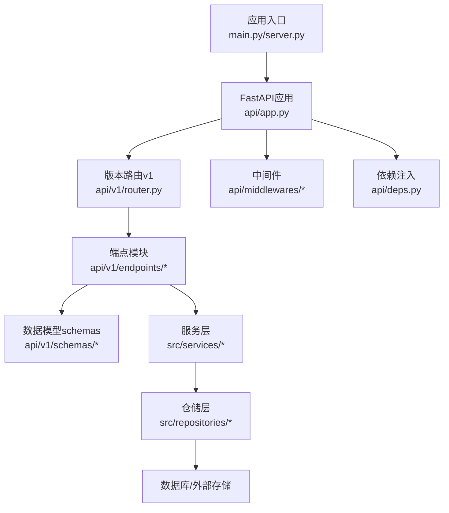
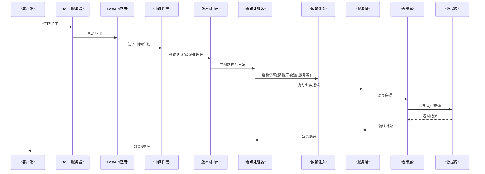
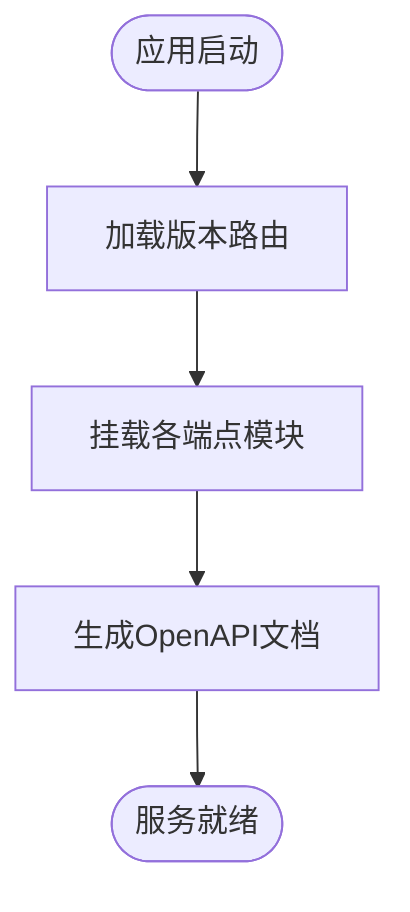
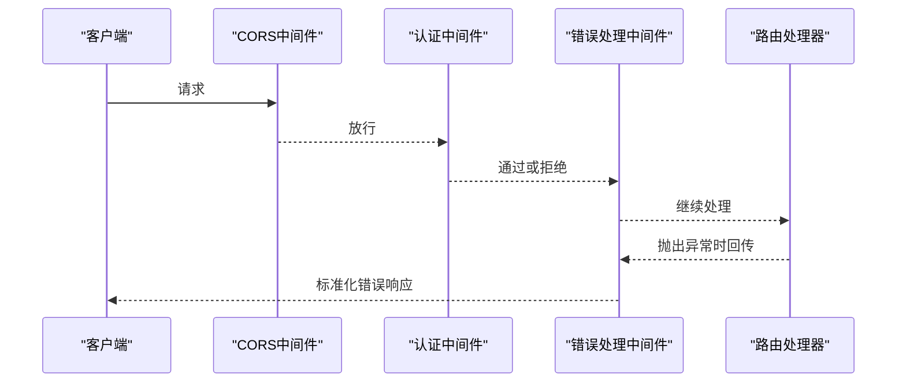
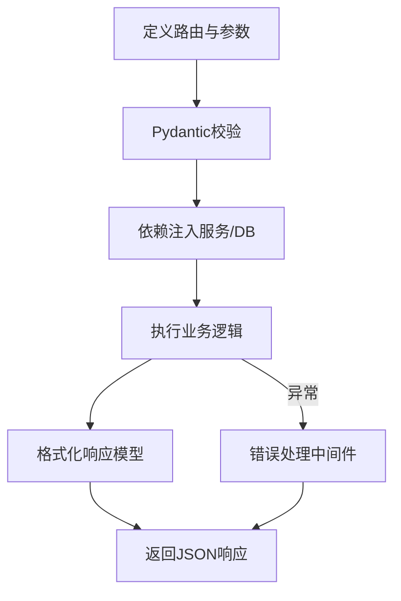
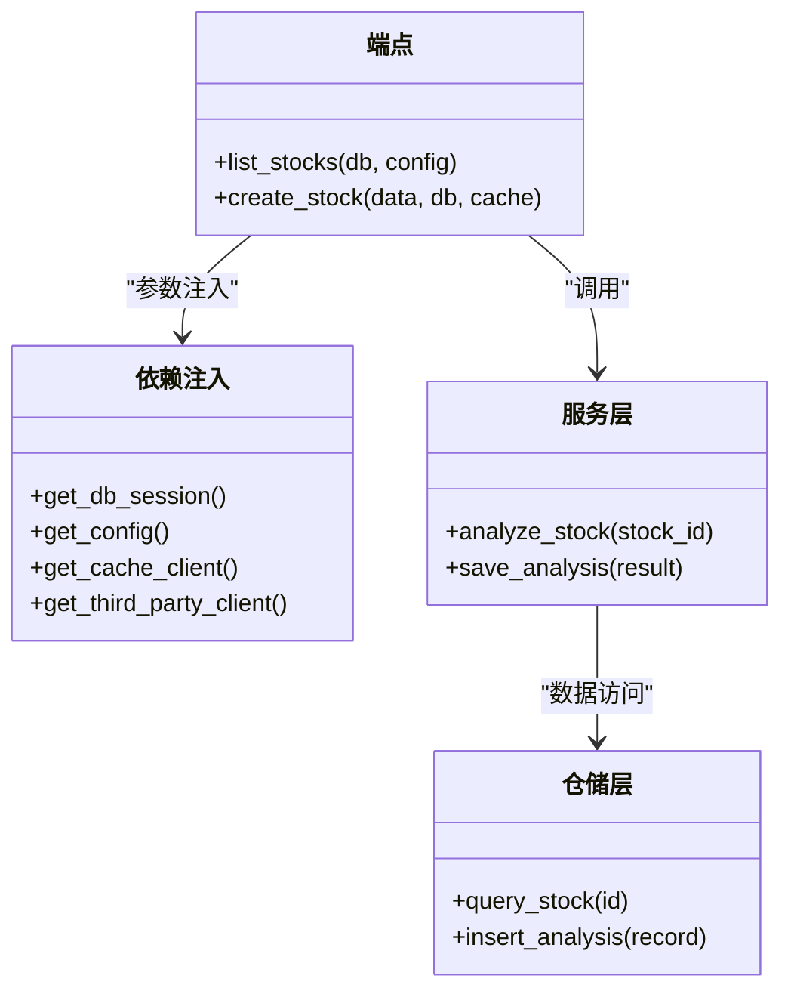
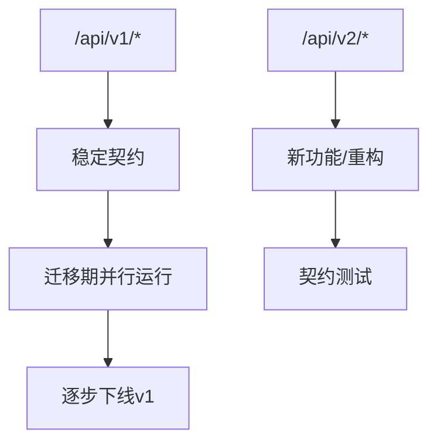
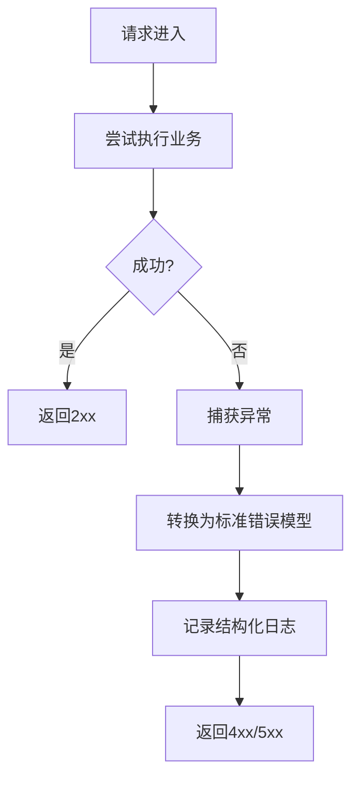
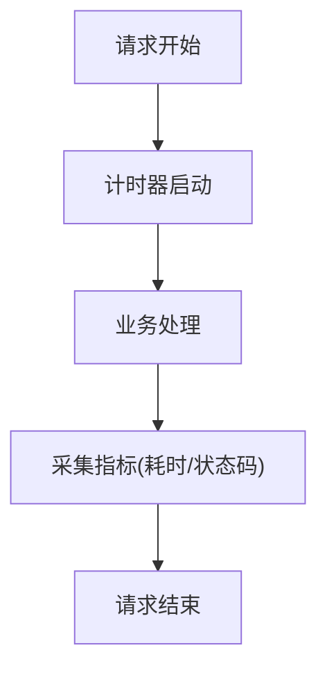
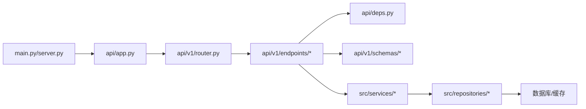

# API接口扩展

<cite>
**本文引用的文件**   
- [main.py](file://main.py)
- [server.py](file://server.py)
- [api/app.py](file://api/app.py)
- [api/v1/router.py](file://api/v1/router.py)
- [api/deps.py](file://api/deps.py)
- [api/middlewares/auth.py](file://api/middlewares/auth.py)
- [api/middlewares/error_handler.py](file://api/middlewares/error_handler.py)
- [api/v1/endpoints/stocks.py](file://api/v1/endpoints/stocks.py)
- [api/v1/schemas/common.py](file://api/v1/schemas/common.py)
- [tests/test_api_health.py](file://tests/test_api_health.py)
</cite>

## 目录
1. [简介](#简介)
2. [项目结构](#项目结构)
3. [核心组件](#核心组件)
4. [架构总览](#架构总览)
5. [详细组件分析](#详细组件分析)
6. [依赖关系分析](#依赖关系分析)
7. [性能考虑](#性能考虑)
8. [故障排查指南](#故障排查指南)
9. [结论](#结论)
10. [附录](#附录)

## 简介
本文件面向需要在现有FastAPI服务上扩展API接口的开发者，系统性阐述以下主题：
- FastAPI路由注册机制与动态路由发现
- 中间件链式调用流程
- 新增API端点的标准流程（路径定义、请求验证、响应格式化）
- 依赖注入系统的使用（服务层集成、数据库连接管理）
- API版本控制与向后兼容性策略
- 扩展开发规范（错误处理、日志记录、性能监控）
- 完整的扩展示例与测试方法

目标是在不破坏既有契约的前提下，提供可复用、可测试、可观测的扩展能力。

## 项目结构
本项目采用“应用入口 + 版本化路由 + 端点模块 + 数据模型 + 中间件 + 依赖注入”的分层组织方式：
- 应用入口负责启动WSGI/ASGI服务器并挂载FastAPI应用
- 版本化路由将不同版本的API隔离在独立模块中
- 端点模块按业务域拆分，便于维护与扩展
- 数据模型使用Pydantic进行请求/响应校验与序列化
- 中间件统一处理认证、错误等横切关注点
- 依赖注入集中管理服务实例、数据库会话、配置等

图表来源
- [main.py:1-200](file://main.py#L1-L200)
- [server.py:1-200](file://server.py#L1-L200)
- [api/app.py:1-200](file://api/app.py#L1-L200)
- [api/v1/router.py:1-200](file://api/v1/router.py#L1-L200)
- [api/deps.py:1-200](file://api/deps.py#L1-L200)
- [api/middlewares/auth.py:1-200](file://api/middlewares/auth.py#L1-L200)
- [api/middlewares/error_handler.py:1-200](file://api/middlewares/error_handler.py#L1-L200)

章节来源
- [main.py:1-200](file://main.py#L1-L200)
- [server.py:1-200](file://server.py#L1-L200)
- [api/app.py:1-200](file://api/app.py#L1-L200)
- [api/v1/router.py:1-200](file://api/v1/router.py#L1-L200)

## 核心组件
- 应用装配器：创建FastAPI实例、注册全局中间件、挂载版本路由、配置CORS/文档等
- 版本路由：以/api/v1为前缀聚合端点，支持未来多版本并存
- 端点模块：每个业务域一个模块，声明HTTP方法与路径，使用依赖注入获取服务
- 数据模型：Pydantic模型用于入参校验与出参序列化，保证契约稳定
- 中间件：认证、限流、错误转换、请求追踪等横切逻辑
- 依赖注入：集中提供数据库会话、配置、第三方客户端、缓存等共享资源

章节来源
- [api/app.py:1-200](file://api/app.py#L1-L200)
- [api/v1/router.py:1-200](file://api/v1/router.py#L1-L200)
- [api/deps.py:1-200](file://api/deps.py#L1-L200)
- [api/middlewares/auth.py:1-200](file://api/middlewares/auth.py#L1-L200)
- [api/middlewares/error_handler.py:1-200](file://api/middlewares/error_handler.py#L1-L200)

## 架构总览
下图展示了从请求进入至返回响应的完整链路，包括中间件链、路由分发、依赖注入与服务层调用。

图表来源
- [api/app.py:1-200](file://api/app.py#L1-L200)
- [api/v1/router.py:1-200](file://api/v1/router.py#L1-L200)
- [api/deps.py:1-200](file://api/deps.py#L1-L200)
- [api/middlewares/auth.py:1-200](file://api/middlewares/auth.py#L1-L200)
- [api/middlewares/error_handler.py:1-200](file://api/middlewares/error_handler.py#L1-L200)

## 详细组件分析

### 路由注册与动态发现
- 版本路由集中挂载所有v1端点，便于后续新增v2/v3并保持向后兼容
- 端点模块通过装饰器声明路径与HTTP方法，框架自动构建OpenAPI文档
- 建议按功能域拆分端点文件，避免单文件过大

图表来源
- [api/v1/router.py:1-200](file://api/v1/router.py#L1-L200)
- [api/app.py:1-200](file://api/app.py#L1-L200)

章节来源
- [api/v1/router.py:1-200](file://api/v1/router.py#L1-L200)
- [api/app.py:1-200](file://api/app.py#L1-L200)

### 中间件链式调用
- 中间件按注册顺序依次执行，典型顺序：CORS -> 认证 -> 错误处理 -> 业务路由
- 认证中间件负责鉴权与用户上下文注入
- 错误处理中间件统一捕获异常并转换为标准JSON错误响应

图表来源
- [api/middlewares/auth.py:1-200](file://api/middlewares/auth.py#L1-L200)
- [api/middlewares/error_handler.py:1-200](file://api/middlewares/error_handler.py#L1-L200)

章节来源
- [api/middlewares/auth.py:1-200](file://api/middlewares/auth.py#L1-L200)
- [api/middlewares/error_handler.py:1-200](file://api/middlewares/error_handler.py#L1-L200)

### 新增API端点的标准流程
- 定义路径与HTTP方法：在对应端点模块中声明路由
- 请求验证：使用Pydantic模型对请求体、查询参数、路径参数进行校验
- 响应格式化：定义响应模型，确保字段类型与命名一致
- 依赖注入：通过依赖注入获取服务实例、数据库会话等
- 错误处理：抛出领域异常，由错误处理中间件统一转换

图表来源
- [api/v1/endpoints/stocks.py:1-200](file://api/v1/endpoints/stocks.py#L1-L200)
- [api/v1/schemas/common.py:1-200](file://api/v1/schemas/common.py#L1-L200)
- [api/deps.py:1-200](file://api/deps.py#L1-L200)

章节来源
- [api/v1/endpoints/stocks.py:1-200](file://api/v1/endpoints/stocks.py#L1-L200)
- [api/v1/schemas/common.py:1-200](file://api/v1/schemas/common.py#L1-L200)
- [api/deps.py:1-200](file://api/deps.py#L1-L200)

### 依赖注入系统
- 依赖项集中定义，如数据库会话、配置、缓存、第三方客户端
- 端点通过函数参数声明依赖，框架自动解析并提供实例
- 支持生命周期管理（如会话开启/关闭）、单元测试替换（Mock）

图表来源
- [api/deps.py:1-200](file://api/deps.py#L1-L200)
- [api/v1/endpoints/stocks.py:1-200](file://api/v1/endpoints/stocks.py#L1-L200)

章节来源
- [api/deps.py:1-200](file://api/deps.py#L1-L200)
- [api/v1/endpoints/stocks.py:1-200](file://api/v1/endpoints/stocks.py#L1-L200)

### API版本控制与向后兼容
- 使用/api/v1前缀隔离版本，新增v2时保持v1稳定
- 变更字段时优先采用新增字段+默认值策略，避免破坏旧客户端
- 废弃字段保留一段时间并输出弃用警告
- 文档与测试覆盖关键契约，确保升级安全

图表来源
- [api/v1/router.py:1-200](file://api/v1/router.py#L1-L200)

章节来源
- [api/v1/router.py:1-200](file://api/v1/router.py#L1-L200)

### 错误处理与日志记录
- 统一错误模型：包含错误码、消息、详情等字段
- 中间件捕获未处理异常，转换为标准响应
- 结构化日志记录请求ID、耗时、状态码、关键参数（脱敏）

图表来源
- [api/middlewares/error_handler.py:1-200](file://api/middlewares/error_handler.py#L1-L200)

章节来源
- [api/middlewares/error_handler.py:1-200](file://api/middlewares/error_handler.py#L1-L200)

### 性能监控与指标
- 在中间件中统计请求耗时、吞吐量、错误率
- 对慢查询与热点接口添加额外日志与指标上报
- 使用异步IO与连接池优化数据库与外部API调用

[本节为通用指导，不直接分析具体文件]

## 依赖关系分析
- 应用入口依赖FastAPI应用装配器
- 版本路由依赖各端点模块
- 端点模块依赖依赖注入、服务层、数据模型
- 服务层依赖仓储层与外部服务
- 仓储层依赖数据库与缓存

图表来源
- [main.py:1-200](file://main.py#L1-L200)
- [server.py:1-200](file://server.py#L1-L200)
- [api/app.py:1-200](file://api/app.py#L1-L200)
- [api/v1/router.py:1-200](file://api/v1/router.py#L1-L200)
- [api/deps.py:1-200](file://api/deps.py#L1-L200)

章节来源
- [main.py:1-200](file://main.py#L1-L200)
- [server.py:1-200](file://server.py#L1-L200)
- [api/app.py:1-200](file://api/app.py#L1-L200)
- [api/v1/router.py:1-200](file://api/v1/router.py#L1-L200)
- [api/deps.py:1-200](file://api/deps.py#L1-L200)

## 性能考虑
- 使用异步端点处理I/O密集型操作（数据库、外部API）
- 合理设置连接池大小与超时时间
- 对大列表分页返回，避免一次性传输过多数据
- 启用Gzip压缩静态资源与大响应体
- 缓存热点数据，减少重复计算与查询

[本节为通用指导，不直接分析具体文件]

## 故障排查指南
- 检查中间件顺序与异常捕获是否生效
- 确认依赖注入是否正确提供数据库会话与配置
- 查看结构化日志中的请求ID与错误堆栈
- 使用健康检查端点验证服务状态
- 通过OpenAPI文档核对请求/响应契约

章节来源
- [tests/test_api_health.py:1-200](file://tests/test_api_health.py#L1-L200)

## 结论
通过版本化路由、中间件链、依赖注入与Pydantic模型，本项目提供了清晰可扩展的API架构。遵循本文档的扩展规范，可在保证向后兼容的前提下快速迭代新能力，并通过完善的错误处理、日志与测试保障质量。

[本节为总结性内容，不直接分析具体文件]

## 附录

### 新增API端点清单模板
- 端点名称与路径
- HTTP方法与描述
- 请求参数与校验规则
- 响应结构与示例
- 依赖注入项
- 错误码与异常场景
- 测试用例清单

[本节为模板说明，不直接分析具体文件]

### 测试方法
- 单元测试：模拟依赖注入，验证端点逻辑
- 集成测试：启动测试服务器，调用真实中间件与数据库
- 契约测试：基于OpenAPI文档断言请求/响应结构
- 性能测试：压测关键接口，观察延迟与吞吐

章节来源
- [tests/test_api_health.py:1-200](file://tests/test_api_health.py#L1-L200)