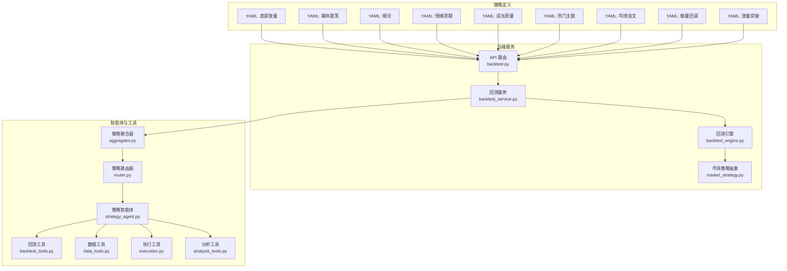
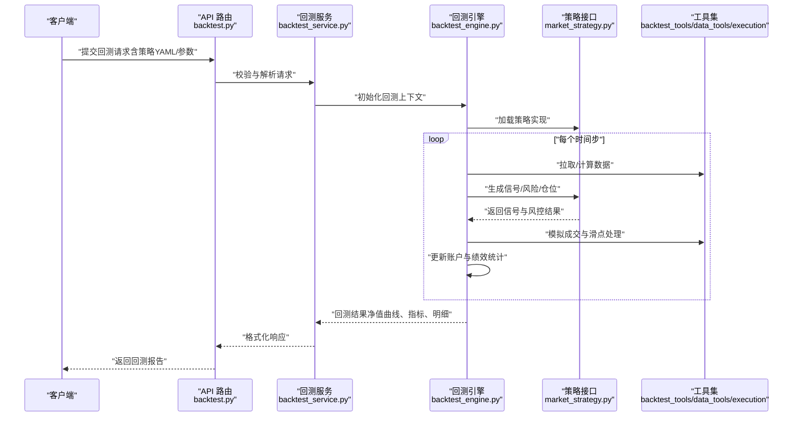
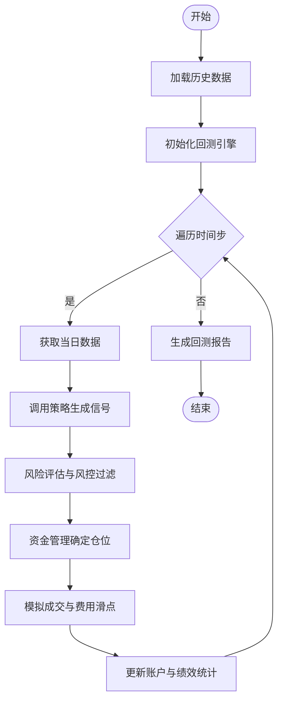
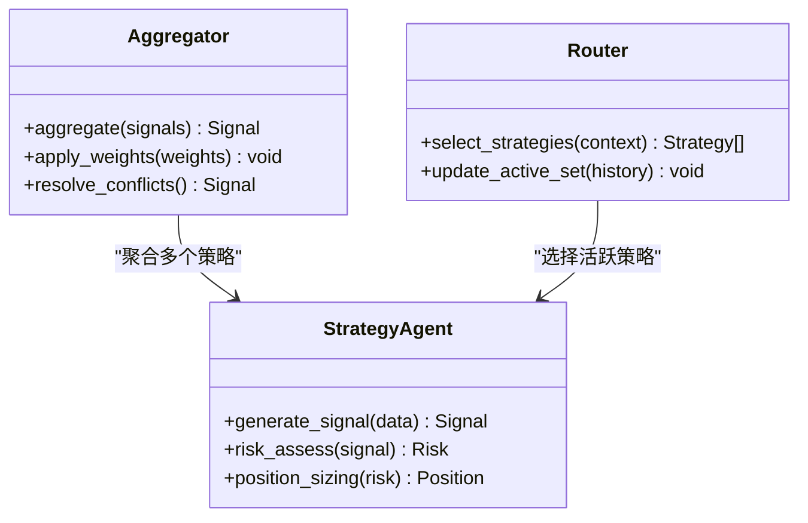
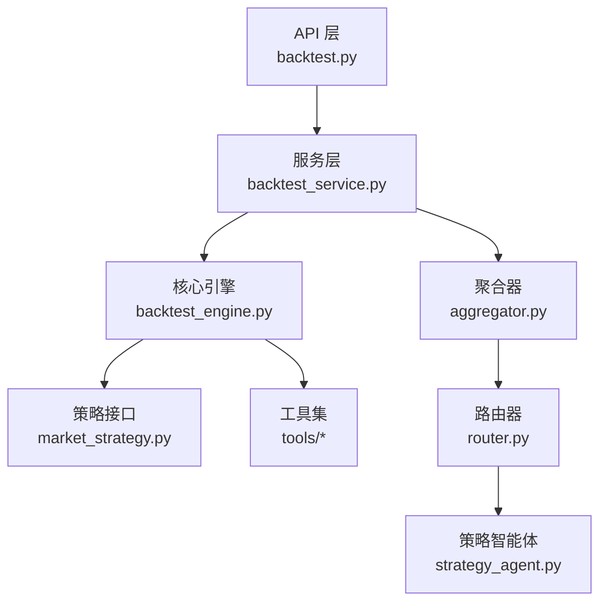

# 交易策略扩展

<cite>
**本文引用的文件**   
- [strategies/README.md](file://strategies/README.md)
- [strategies/bottom_volume.yaml](file://strategies/bottom_volume.yaml)
- [strategies/box_oscillation.yaml](file://strategies/box_oscillation.yaml)
- [strategies/chan_theory.yaml](file://strategies/chan_theory.yaml)
- [strategies/emotion_cycle.yaml](file://strategies/emotion_cycle.yaml)
- [strategies/growth_quality.yaml](file://strategies/growth_quality.yaml)
- [strategies/hot_theme.yaml](file://strategies/hot_theme.yaml)
- [strategies/ma_golden_cross.yaml](file://strategies/ma_golden_cross.yaml)
- [strategies/shrink_pullback.yaml](file://strategies/shrink_pullback.yaml)
- [strategies/volume_breakout.yaml](file://strategies/volume_breakout.yaml)
- [src/core/backtest_engine.py](file://src/core/backtest_engine.py)
- [src/core/market_strategy.py](file://src/core/market_strategy.py)
- [src/services/backtest_service.py](file://src/services/backtest_service.py)
- [api/v1/endpoints/backtest.py](file://api/v1/endpoints/backtest.py)
- [api/v1/schemas/backtest.py](file://api/v1/schemas/backtest.py)
- [src/agent/strategies/aggregator.py](file://src/agent/strategies/aggregator.py)
- [src/agent/strategies/router.py](file://src/agent/strategies/router.py)
- [src/agent/strategies/strategy_agent.py](file://src/agent/strategies/strategy_agent.py)
- [src/agent/tools/backtest_tools.py](file://src/agent/tools/backtest_tools.py)
- [src/agent/tools/data_tools.py](file://src/agent/tools/data_tools.py)
- [src/agent/tools/execution.py](file://src/agent/tools/execution.py)
- [src/agent/tools/analysis_tools.py](file://src/agent/tools/analysis_tools.py)
- [src/agent/tools/registry.py](file://src/agent/tools/registry.py)
- [src/agent/tools/market_tools.py](file://src/agent/tools/market_tools.py)
- [src/agent/tools/search_tools.py](file://src/agent/tools/search_tools.py)
- [src/agent/orchestrator.py](file://src/agent/orchestrator.py)
- [src/agent/executor.py](file://src/agent/executor.py)
- [src/agent/factory.py](file://src/agent/factory.py)
- [src/agent/protocols.py](file://src/agent/protocols.py)
- [src/agent/risk_override.py](file://src/agent/risk_override.py)
- [src/agent/stock_scope.py](file://src/agent/stock_scope.py)
- [src/agent/chat_executor.py](file://src/agent/chat_executor.py)
- [src/agent/conversation.py](file://src/agent/conversation.py)
- [src/agent/memory.py](file://src/agent/memory.py)
- [src/agent/events.py](file://src/agent/events.py)
- [src/agent/stream_events.py](file://src/agent/stream_events.py)
- [src/agent/provider_trace.py](file://src/agent/provider_trace.py)
- [src/agent/runtime_facts.py](file://src/agent/runtime_facts.py)
- [src/agent/llm_adapter.py](file://src/agent/llm_adapter.py)
- [src/agent/litellm_route_resolution.py](file://src/agent/litellm_route resolution.py)
- [src/agent/codex_agent_backend.py](file://src/agent/codex_agent_backend.py)
- [src/agent/codex_app_server_transport.py](file://src/agent/codex_app_server_transport.py)
- [src/agent/codex_tool_process.py](file://src/agent/codex_tool_process.py)
- [src/agent/agent_backend.py](file://src/agent/agent_backend.py)
- [src/agent/runner.py](file://src/agent/runner.py)
- [src/agent/tool_surface.py](file://src/agent/tool_surface.py)
- [src/agent/disagreement.py](file://src/agent/disagreement.py)
- [src/agent/final_explanation.py](file://src/agent/final_explanation.py)
- [src/agent/research.py](file://src/agent/research.py)
- [src/agent/dashboard_payload.py](file://src/agent/dashboard_payload.py)
- [src/agent/chat_context.py](file://src/agent/chat_context.py)
- [src/agent/agents/base_agent.py](file://src/agent/agents/base_agent.py)
- [src/agent/agents/decision_agent.py](file://src/agent/agents/decision_agent.py)
- [src/agent/agents/intel_agent.py](file://src/agent/agents/intel_agent.py)
- [src/agent/agents/portfolio_agent.py](file://src/agent/agents/portfolio_agent.py)
- [src/agent/agents/risk_agent.py](file://src/agent/agents/risk_agent.py)
- [src/agent/agents/technical_agent.py](file://src/agent/agents/technical_agent.py)
- [src/agent/skills/base.py](file://src/agent/skills/base.py)
- [src/agent/skills/aggregator.py](file://src/agent/skills/aggregator.py)
- [src/agent/skills/defaults.py](file://src/agent/skills/defaults.py)
- [src/agent/skills/deliberation.py](file://src/agent/skills/deliberation.py)
- [src/agent/skills/engine.py](file://src/agent/skills/engine.py)
- [src/agent/skills/router.py](file://src/agent/skills/router.py)
- [src/agent/skills/scheduler.py](file://src/agent/skills/scheduler.py)
- [src/agent/skills/skill_agent.py](file://src/agent/skills/skill_agent.py)
- [src/agent/skills/synthesis.py](file://src/agent/skills/synthesis.py)
- [src/agent/tools/__init__.py](file://src/agent/tools/__init__.py)
- [src/agent/skills/__init__.py](file://src/agent/skills/__init__.py)
- [src/agent/strategies/__init__.py](file://src/agent/strategies/__init__.py)
- [src/agent/tools/backtest_tools.py](file://src/agent/tools/backtest_tools.py)
- [src/agent/tools/data_tools.py](file://src/agent/tools/data_tools.py)
- [src/agent/tools/execution.py](file://src/agent/tools/execution.py)
- [src/agent/tools/analysis_tools.py](file://src/agent/tools/analysis_tools.py)
- [src/agent/tools/registry.py](file://src/agent/tools/registry.py)
- [src/agent/tools/market_tools.py](file://src/agent/tools/market_tools.py)
- [src/agent/tools/search_tools.py](file://src/agent/tools/search_tools.py)
- [src/agent/orchestrator.py](file://src/agent/orchestrator.py)
- [src/agent/executor.py](file://src/agent/executor.py)
- [src/agent/factory.py](file://src/agent/factory.py)
- [src/agent/protocols.py](file://src/agent/protocols.py)
- [src/agent/risk_override.py](file://src/agent/risk_override.py)
- [src/agent/stock_scope.py](file://src/agent/stock_scope.py)
- [src/agent/chat_executor.py](file://src/agent/chat_executor.py)
- [src/agent/conversation.py](file://src/agent/conversation.py)
- [src/agent/memory.py](file://src/agent/memory.py)
- [src/agent/events.py](file://src/agent/events.py)
- [src/agent/stream_events.py](file://src/agent/stream_events.py)
- [src/agent/provider_trace.py](file://src/agent/provider_trace.py)
- [src/agent/runtime_facts.py](file://src/agent/runtime_facts.py)
- [src/agent/llm_adapter.py](file://src/agent/llm_adapter.py)
- [src/agent/litellm_route_resolution.py](file://src/agent/litessm_route_resolution.py)
- [src/agent/codex_agent_backend.py](file://src/agent/codex_agent_backend.py)
- [src/agent/codex_app_server_transport.py](file://src/agent/codex_app_server_transport.py)
- [src/agent/codex_tool_process.py](file://src/agent/codex_tool_process.py)
- [src/agent/agent_backend.py](file://src/agent/agent_backend.py)
- [src/agent/runner.py](file://src/agent/runner.py)
- [src/agent/tool_surface.py](file://src/agent/tool_surface.py)
- [src/agent/disagreement.py](file://src/agent/disagreement.py)
- [src/agent/final_explanation.py](file://src/agent/final_explanation.py)
- [src/agent/research.py](file://src/agent/research.py)
- [src/agent/dashboard_payload.py](file://src/agent/dashboard_payload.py)
- [src/agent/chat_context.py](file://src/agent/chat_context.py)
- [src/agent/agents/base_agent.py](file://src/agent/agents/base_agent.py)
- [src/agent/agents/decision_agent.py](file://src/agent/agents/decision_agent.py)
- [src/agent/agents/intel_agent.py](file://src/agent/agents/intel_agent.py)
- [src/agent/agents/portfolio_agent.py](file://src/agent/agents/portfolio_agent.py)
- [src/agent/agents/risk_agent.py](file://src/agent/agents/risk_agent.py)
- [src/agent/agents/technical_agent.py](file://src/agent/agents/technical_agent.py)
- [src/agent/skills/base.py](file://src/agent/s定义s/base.py)
- [src/agent/skills/aggregator.py](file://src/agent/skills/aggregator.py)
- [src/agent/skills/defaults.py](file://src/agent/skills/defaults.py)
- [src/agent/skills/deliberation.py](file://src/agent/skills/deliberation.py)
- [src/agent/skills/engine.py](file://src/agent/skills/engine.py)
- [src/agent/skills/router.py](file://src/agent/skills/router.py)
- [src/agent/skills/scheduler.py](file://src/agent/skills/scheduler.py)
- [src/agent/skills/skill_agent.py](file://src/agent/skills/skill_agent.py)
- [src/agent/skills/synthesis.py](file://src/agent/skills/synthesis.py)
- [src/agent/tools/__init__.py](file://src/agent/tools/__init__.py)
- [src/agent/skills/__init__.py](file://src/agent/skills/__init__.py)
- [src/agent/strategies/__init__.py](file://src/agent/strategies/__init__.py)
</cite>

## 目录
1. [简介](#简介)
2. [项目结构](#项目结构)
3. [核心组件](#核心组件)
4. [架构总览](#架构总览)
5. [详细组件分析](#详细组件分析)
6. [依赖关系分析](#依赖关系分析)
7. [性能考量](#性能考量)
8. [故障排查指南](#故障排查指南)
9. [结论](#结论)
10. [附录](#附录)

## 简介
本文件面向“交易策略扩展机制”的开发者与使用者，系统性阐述基于 YAML 的策略配置格式、策略接口实现要求（信号生成、风险评估、资金管理）、与回测引擎的集成方式（数据输入、执行模拟、绩效评估），以及策略组合与权重分配机制。同时提供完整的开发指南（环境搭建、测试方法、部署步骤）和多种策略示例（技术指标、基本面、机器学习）。

## 项目结构
仓库采用前后端分离与多模块组织：
- 策略定义以 YAML 文件集中存放于 strategies 目录，便于声明式管理与版本控制。
- 后端服务通过 API 层暴露回测与策略能力，核心逻辑位于 src/core 与 src/services。
- 智能体与工具链位于 src/agent，负责策略编排、数据获取、分析与执行模拟。
- 前端位于 apps/dsa-web，用于可视化与交互。

**图表来源** 
- [api/v1/endpoints/backtest.py](file://api/v1/endpoints/backtest.py)
- [src/services/backtest_service.py](file://src/services/backtest_service.py)
- [src/core/backtest_engine.py](file://src/core/backtest_engine.py)
- [src/core/market_strategy.py](file://src/core/market_strategy.py)
- [src/agent/strategies/aggregator.py](file://src/agent/strategies/aggregator.py)
- [src/agent/strategies/router.py](file://src/agent/strategies/router.py)
- [src/agent/strategies/strategy_agent.py](file://src/agent/strategies/strategy_agent.py)
- [src/agent/tools/backtest_tools.py](file://src/agent/tools/backtest_tools.py)
- [src/agent/tools/data_tools.py](file://src/agent/tools/data_tools.py)
- [src/agent/tools/execution.py](file://src/agent/tools/execution.py)
- [src/agent/tools/analysis_tools.py](file://src/agent/tools/analysis_tools.py)

**章节来源**
- [strategies/README.md](file://strategies/README.md)

## 核心组件
- 策略配置（YAML）：声明式描述策略参数、条件规则、输出字段与权重。
- 策略接口：统一信号生成、风险评估、资金管理的契约，供不同策略实现。
- 回测引擎：读取历史数据，按时间步推进，调用策略接口生成信号并模拟成交，统计绩效指标。
- 策略组合与路由：聚合多个策略信号，按权重或投票机制合成最终决策。
- 工具链：数据获取、技术分析、执行模拟等能力封装为可复用工具。

**章节来源**
- [src/core/market_strategy.py](file://src/core/market_strategy.py)
- [src/core/backtest_engine.py](file://src/core/backtest_engine.py)
- [src/services/backtest_service.py](file://src/services/backtest_service.py)
- [src/agent/strategies/aggregator.py](file://src/agent/strategies/aggregator.py)
- [src/agent/strategies/router.py](file://src/agent/strategies/router.py)
- [src/agent/strategies/strategy_agent.py](file://src/agent/strategies/strategy_agent.py)

## 架构总览
下图展示从 API 到回测引擎、策略接口与工具链的整体流程。

**图表来源** 
- [api/v1/endpoints/backtest.py](file://api/v1/endpoints/backtest.py)
- [src/services/backtest_service.py](file://src/services/backtest_service.py)
- [src/core/backtest_engine.py](file://src/core/backtest_engine.py)
- [src/core/market_strategy.py](file://src/core/market_strategy.py)
- [src/agent/tools/backtest_tools.py](file://src/agent/tools/backtest_tools.py)
- [src/agent/tools/data_tools.py](file://src/agent/tools/data_tools.py)
- [src/agent/tools/execution.py](file://src/agent/tools/execution.py)

## 详细组件分析

### YAML 策略配置格式
YAML 策略文件用于声明式定义策略，通常包含以下键：
- 元信息：名称、版本、作者、描述
- 参数定义：数值阈值、窗口长度、类别枚举等
- 条件规则：技术指标条件、基本面筛选、事件触发等
- 输出格式：信号类型（买入/卖出/持有）、强度、置信度、目标仓位
- 风险管理：止损止盈、最大回撤限制、仓位上限
- 权重与组合：在组合中的权重、投票权重、优先级

建议遵循最小必要原则，保持可读性与可维护性；对复杂规则使用子结构分组。

**章节来源**
- [strategies/bottom_volume.yaml](file://strategies/bottom_volume.yaml)
- [strategies/box_oscillation.yaml](file://strategies/box_oscillation.yaml)
- [strategies/chan_theory.yaml](file://strategies/chan_theory.yaml)
- [strategies/emotion_cycle.yaml](file://strategies/emotion_cycle.yaml)
- [strategies/growth_quality.yaml](file://strategies/growth_quality.yaml)
- [strategies/hot_theme.yaml](file://strategies/hot_theme.yaml)
- [strategies/ma_golden_cross.yaml](file://strategies/ma_golden_cross.yaml)
- [strategies/shrink_pullback.yaml](file://strategies/shrink_pullback.yaml)
- [strategies/volume_breakout.yaml](file://strategies/volume_breakout.yaml)

### 策略接口实现要求
策略需实现统一的接口契约，确保回测引擎可无缝调用：
- 信号生成：根据输入数据与参数，输出标准化信号（方向、强度、置信度）
- 风险评估：计算波动率、VaR、最大回撤、相关性等风险指标
- 资金管理：确定目标仓位、分批建仓/减仓、动态调仓规则
- 状态管理：跨时间步的状态持久化（如趋势跟踪的持仓状态）
- 可解释性：输出关键因子与归因，便于复盘与审计

建议在实现中避免副作用，保证幂等性与确定性，便于并行回测与单元测试。

**章节来源**
- [src/core/market_strategy.py](file://src/core/market_strategy.py)

### 与回测引擎的集成
- 数据输入：支持日频/分钟频历史数据，内置数据清洗与对齐，缺失值填充与异常值处理。
- 执行模拟：考虑手续费、滑点、涨跌停、流动性约束，支持限价/市价单。
- 绩效评估：收益率、夏普比率、最大回撤、胜率、盈亏比、换手率、行业暴露等。
- 进度与日志：逐条记录交易日志与中间状态，便于调试与回溯。

**图表来源** 
- [src/core/backtest_engine.py](file://src/core/backtest_engine.py)
- [src/services/backtest_service.py](file://src/services/backtest_service.py)

**章节来源**
- [src/core/backtest_engine.py](file://src/core/backtest_engine.py)
- [src/services/backtest_service.py](file://src/services/backtest_service.py)

### 策略组合与权重分配
- 聚合器：汇总多个策略信号，支持加权平均、投票、主从切换等模式。
- 路由器：根据市场环境或策略表现动态选择活跃策略集合。
- 权重分配：静态权重、滚动优化、基于风险贡献或夏普比率再平衡。
- 冲突解决：当策略间信号冲突时，依据优先级、风险预算或专家规则裁决。

**图表来源** 
- [src/agent/strategies/aggregator.py](file://src/agent/strategies/aggregator.py)
- [src/agent/strategies/router.py](file://src/agent/strategies/router.py)
- [src/agent/strategies/strategy_agent.py](file://src/agent/strategies/strategy_agent.py)

**章节来源**
- [src/agent/strategies/aggregator.py](file://src/agent/strategies/aggregator.py)
- [src/agent/strategies/router.py](file://src/agent/strategies/router.py)
- [src/agent/strategies/strategy_agent.py](file://src/agent/strategies/strategy_agent.py)

### 工具链与数据流
- 数据工具：统一数据源接入、缓存、去重、对齐与增量更新。
- 分析工具：技术指标计算、基本面因子提取、舆情与事件特征。
- 执行工具：订单构造、成交模拟、滑点模型、流动性约束。
- 搜索工具：研报、新闻、公告检索与摘要。

**图表来源** 
- [src/agent/tools/data_tools.py](file://src/agent/tools/data_tools.py)
- [src/agent/tools/analysis_tools.py](file://src/agent/tools/analysis_tools.py)
- [src/agent/tools/execution.py](file://src/agent/tools/execution.py)
- [src/agent/tools/backtest_tools.py](file://src/agent/tools/backtest_tools.py)

**章节来源**
- [src/agent/tools/data_tools.py](file://src/agent/tools/data_tools.py)
- [src/agent/tools/analysis_tools.py](file://src/agent/tools/analysis_tools.py)
- [src/agent/tools/execution.py](file://src/agent/tools/execution.py)
- [src/agent/tools/backtest_tools.py](file://src/agent/tools/backtest_tools.py)

### 策略示例
- 技术指标策略：均线金叉、放量突破、缩量回调等，强调价格与量能的时序模式。
- 基本面策略：成长质量、估值与盈利改善，结合财务指标与预期变化。
- 机器学习策略：特征工程、模型训练与在线预测，注重过拟合控制与稳健性。

示例 YAML 文件展示了参数、条件与输出的结构化表达，便于快速迭代与对比。

**章节来源**
- [strategies/ma_golden_cross.yaml](file://strategies/ma_golden_cross.yaml)
- [strategies/volume_breakout.yaml](file://strategies/volume_breakout.yaml)
- [strategies/shrink_pullback.yaml](file://strategies/shrink_pullback.yaml)
- [strategies/growth_quality.yaml](file://strategies/growth_quality.yaml)
- [strategies/hot_theme.yaml](file://strategies/hot_theme.yaml)

## 依赖关系分析
- 低耦合：策略接口与回测引擎解耦，策略实现可独立开发与测试。
- 工具复用：数据与分析工具被多策略共享，减少重复代码。
- 外部依赖：数据源、LLM 适配器、通知渠道等通过注册表与工厂模式管理。

**图表来源** 
- [src/core/backtest_engine.py](file://src/core/backtest_engine.py)
- [src/core/market_strategy.py](file://src/core/market_strategy.py)
- [api/v1/endpoints/backtest.py](file://api/v1/endpoints/backtest.py)
- [src/services/backtest_service.py](file://src/services/backtest_service.py)
- [src/agent/strategies/aggregator.py](file://src/agent/strategies/aggregator.py)
- [src/agent/strategies/router.py](file://src/agent/strategies/router.py)
- [src/agent/strategies/strategy_agent.py](file://src/agent/strategies/strategy_agent.py)

**章节来源**
- [src/core/backtest_engine.py](file://src/core/backtest_engine.py)
- [src/core/market_strategy.py](file://src/core/market_strategy.py)
- [api/v1/endpoints/backtest.py](file://api/v1/endpoints/backtest.py)
- [src/services/backtest_service.py](file://src/services/backtest_service.py)

## 性能考量
- 数据预处理：批量加载与内存映射，减少 I/O 瓶颈。
- 向量化计算：优先使用向量化指标计算，降低循环开销。
- 并行回测：多标的/多参数网格并行，注意资源隔离与结果合并。
- 缓存策略：指标与中间结果缓存，避免重复计算。
- 监控与限流：外部数据源限流与重试，防止超时与抖动。

[本节为通用指导，不直接分析具体文件]

## 故障排查指南
- 数据问题：检查数据源可用性、时间戳对齐、缺失值与异常值处理。
- 策略实现：确认信号生成逻辑边界条件、状态更新顺序与幂等性。
- 执行模拟：核对手续费、滑点、涨跌停与流动性约束设置。
- 绩效异常：检查初始资金、复权方式、分红除权处理与基准选择。
- 日志定位：启用详细日志，定位失败路径与中间状态。

**章节来源**
- [src/core/backtest_engine.py](file://src/core/backtest_engine.py)
- [src/services/backtest_service.py](file://src/services/backtest_service.py)

## 结论
本扩展机制以 YAML 声明式策略为核心，配合统一策略接口与回测引擎，实现了灵活、可组合、可验证的交易策略体系。通过工具链与智能体编排，开发者可快速构建技术指标、基本面与机器学习策略，并在同一框架下进行回测、组合与部署。建议遵循接口契约与最佳实践，持续完善数据质量与风控能力。

[本节为总结性内容，不直接分析具体文件]

## 附录

### 开发环境搭建
- 安装依赖：Python 环境与所需库（数据源、分析库、测试框架）。
- 配置数据源：设置 API Key、代理与缓存目录。
- 启动服务：运行后端与 WebUI，验证健康检查与基本功能。

[本节为通用指导，不直接分析具体文件]

### 测试方法
- 单元测试：覆盖策略接口、工具函数与边界条件。
- 集成测试：端到端回测流程，验证数据、执行与绩效一致性。
- 回归测试：变更后对比历史结果，确保稳定性。

[本节为通用指导，不直接分析具体文件]

### 部署步骤
- 容器化：Docker 镜像构建与编排。
- 环境变量：敏感信息与运行时配置注入。
- 监控告警：日志采集、指标上报与异常通知。

[本节为通用指导，不直接分析具体文件]