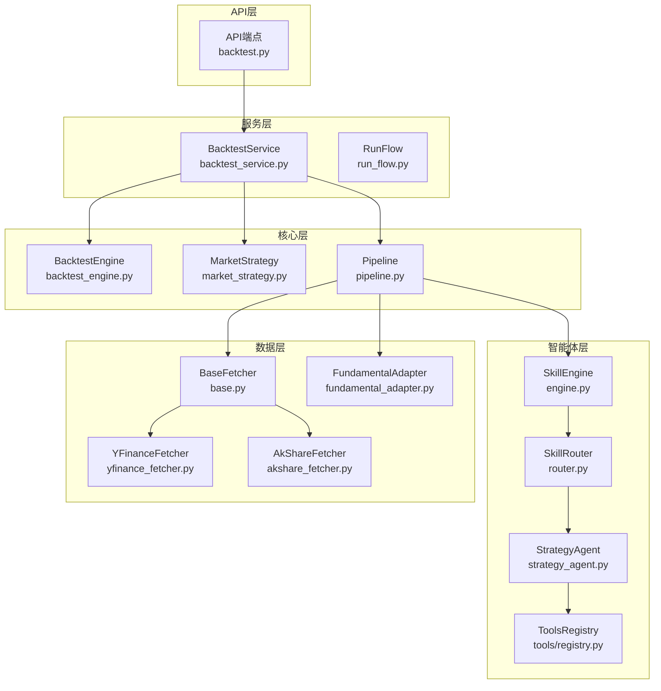
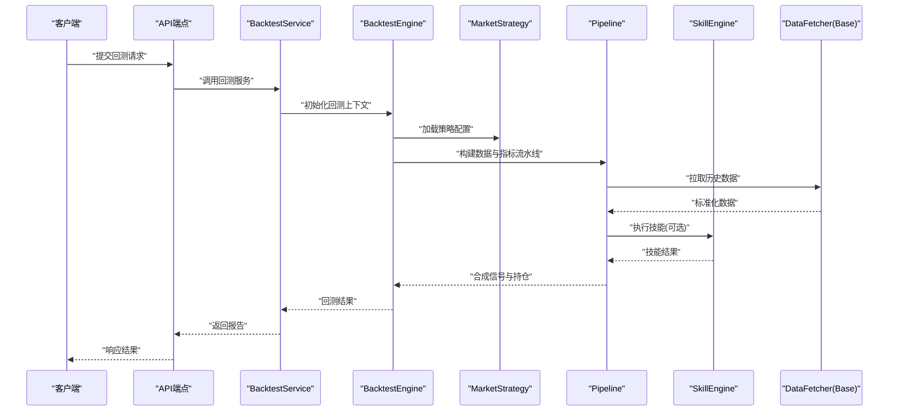
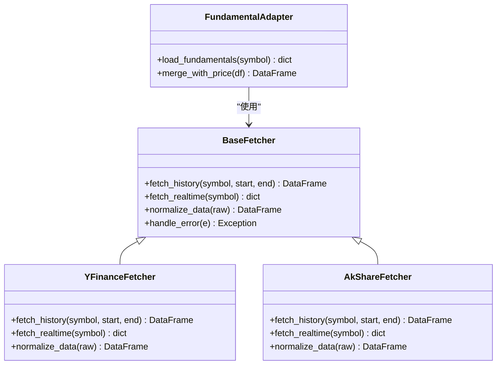
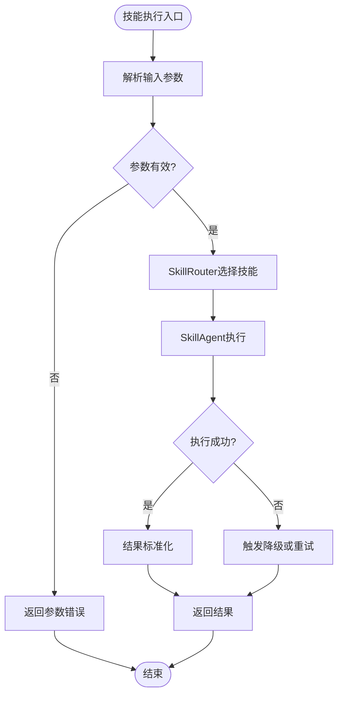
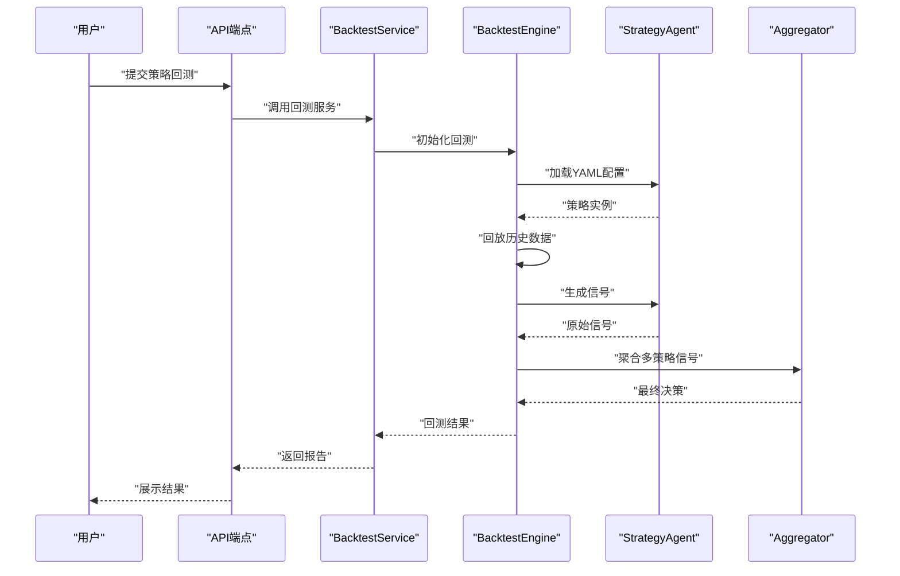
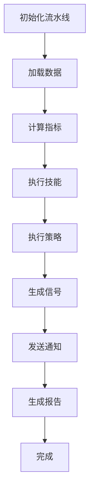
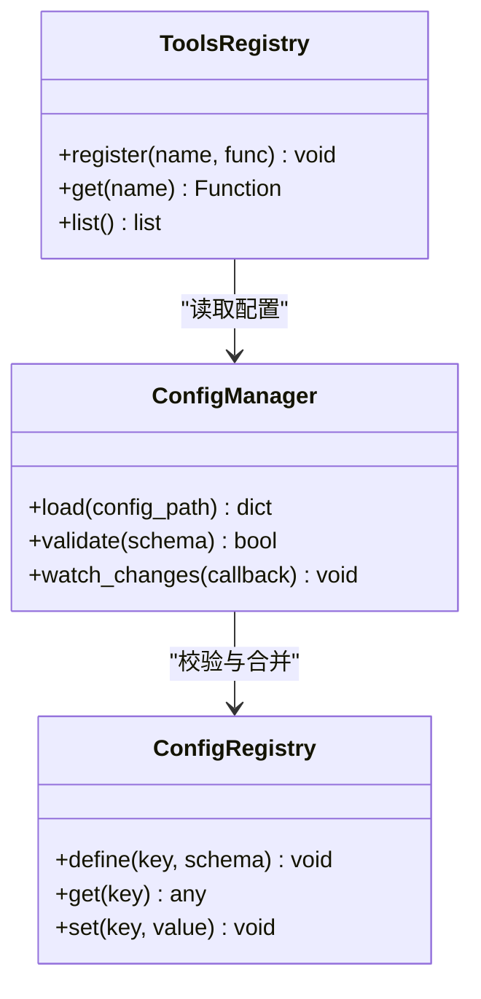
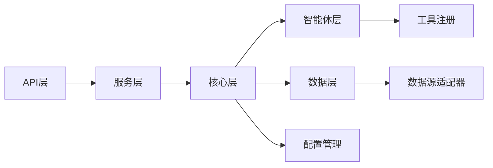

# 扩展机制设计

<cite>
**本文引用的文件**   
- [base.py](file://data_provider/base.py)
- [akshare_fetcher.py](file://data_provider/akshare_fetcher.py)
- [yfinance_fetcher.py](file://data_provider/yfinance_fetcher.py)
- [fundamental_adapter.py](file://data_provider/fundamental_adapter.py)
- [engine.py](file://src/agent/skills/engine.py)
- [router.py](file://src/agent/skills/router.py)
- [skill_agent.py](file://src/agent/skills/skill_agent.py)
- [defaults.py](file://src/agent/skills/defaults.py)
- [strategy_agent.py](file://src/agent/strategies/strategy_agent.py)
- [aggregator.py](file://src/agent/strategies/aggregator.py)
- [backtest_engine.py](file://src/core/backtest_engine.py)
- [market_strategy.py](file://src/core/market_strategy.py)
- [backtest_service.py](file://src/services/backtest_service.py)
- [backtest.py](file://api/v1/endpoints/backtest.py)
- [run_flow.py](file://src/services/run_flow.py)
- [pipeline.py](file://src/core/pipeline.py)
- [config_manager.py](file://src/core/config_manager.py)
- [config_registry.py](file://src/core/config_registry.py)
- [orchestrator.py](file://src/agent/orchestrator.py)
- [executor.py](file://src/agent/executor.py)
- [tools/registry.py](file://src/agent/tools/registry.py)
- [tools/backtest_tools.py](file://src/agent/tools/backtest_tools.py)
- [tools/data_tools.py](file://src/agent/tools/data_tools.py)
- [main.py](file://main.py)
- [server.py](file://server.py)
- [pyproject.toml](file://pyproject.toml)
- [requirements.txt](file://requirements.txt)
</cite>

## 目录
1. [简介](#简介)
2. [项目结构](#项目结构)
3. [核心组件](#核心组件)
4. [架构总览](#架构总览)
5. [详细组件分析](#详细组件分析)
6. [依赖关系分析](#依赖关系分析)
7. [性能考量](#性能考量)
8. [故障排查指南](#故障排查指南)
9. [结论](#结论)
10. [附录](#附录)

## 简介
本文件面向Daily Stock Analysis系统的扩展机制设计，重点阐述插件化架构、数据源适配器、AI代理技能与交易策略的扩展方式，并提供完整的开发、测试与部署指南。文档以“从概念到代码”的方式组织，帮助读者快速理解并实现可扩展的数据获取、技能编排与策略回测能力。

## 项目结构
系统采用分层与模块化结合的组织方式：
- 数据层：data_provider提供多数据源适配（BaseFetcher基类与具体Fetcher实现）
- 智能体层：src/agent包含技能引擎、路由、工具注册、策略执行等
- 核心层：src/core包含回测引擎、市场策略、流水线编排等
- 服务层：src/services提供业务编排与API对接
- API层：api/v1提供REST接口，暴露回测、分析、历史等能力
- 配置与启动：core/config_manager、config_registry管理配置；main.py/server.py为入口

图表来源
- [backtest.py](file://api/v1/endpoints/backtest.py)
- [backtest_service.py](file://src/services/backtest_service.py)
- [backtest_engine.py](file://src/core/backtest_engine.py)
- [market_strategy.py](file://src/core/market_strategy.py)
- [pipeline.py](file://src/core/pipeline.py)
- [engine.py](file://src/agent/skills/engine.py)
- [router.py](file://src/agent/skills/router.py)
- [strategy_agent.py](file://src/agent/strategies/strategy_agent.py)
- [tools/registry.py](file://src/agent/tools/registry.py)
- [base.py](file://data_provider/base.py)
- [yfinance_fetcher.py](file://data_provider/yfinance_fetcher.py)
- [akshare_fetcher.py](file://data_provider/akshare_fetcher.py)
- [fundamental_adapter.py](file://data_provider/fundamental_adapter.py)

章节来源
- [main.py](file://main.py)
- [server.py](file://server.py)
- [pyproject.toml](file://pyproject.toml)
- [requirements.txt](file://requirements.txt)

## 核心组件
- 数据源适配器（BaseFetcher及实现）：统一数据获取接口，屏蔽不同数据源差异，支持标准化输出格式
- AI代理技能（SkillEngine/Router/SkillAgent）：技能发现、注册、参数解析、调度执行与结果聚合
- 交易策略（StrategyAgent/Aggregator）：基于YAML配置的策略定义、策略执行与多策略聚合
- 回测引擎（BacktestEngine/MarketStrategy）：历史数据回放、信号生成、绩效统计与报告
- 流水线（Pipeline）：将数据获取、指标计算、策略执行、通知等步骤串联，支持错误隔离与重试
- 配置管理（ConfigManager/ConfigRegistry）：集中式配置加载、校验与热更新

章节来源
- [base.py](file://data_provider/base.py)
- [engine.py](file://src/agent/skills/engine.py)
- [router.py](file://src/agent/skills/router.py)
- [strategy_agent.py](file://src/agent/strategies/strategy_agent.py)
- [backtest_engine.py](file://src/core/backtest_engine.py)
- [market_strategy.py](file://src/core/market_strategy.py)
- [pipeline.py](file://src/core/pipeline.py)
- [config_manager.py](file://src/core/config_manager.py)
- [config_registry.py](file://src/core/config_registry.py)

## 架构总览
系统通过“插件化+流水线”的方式实现扩展性：
- 插件发现：通过约定目录与注册表扫描，自动发现数据源、技能、策略与工具
- 生命周期管理：初始化、预热、运行、清理阶段由框架统一管理
- 依赖注入：通过配置中心与服务容器注入所需依赖（如LLM后端、数据库连接、缓存）

图表来源
- [backtest.py](file://api/v1/endpoints/backtest.py)
- [backtest_service.py](file://src/services/backtest_service.py)
- [backtest_engine.py](file://src/core/backtest_engine.py)
- [market_strategy.py](file://src/core/market_strategy.py)
- [pipeline.py](file://src/core/pipeline.py)
- [engine.py](file://src/agent/skills/engine.py)
- [base.py](file://data_provider/base.py)

## 详细组件分析

### 数据源适配器扩展（BaseFetcher）
- 设计要点
  - BaseFetcher定义统一接口：数据拉取、字段映射、错误处理、重试与限流
  - 具体Fetcher继承BaseFetcher，实现特定数据源的协议与数据格式转换
  - FundamentalAdapter用于基本面数据的适配与标准化
- 扩展方式
  - 新增Fetcher：继承BaseFetcher，实现必要方法，注册到数据源管理器
  - 数据格式：遵循统一的DataFrame或结构化对象规范，确保下游一致消费
  - 错误处理：捕获网络异常、鉴权失败、数据缺失等场景，提供降级与告警

图表来源
- [base.py](file://data_provider/base.py)
- [yfinance_fetcher.py](file://data_provider/yfinance_fetcher.py)
- [akshare_fetcher.py](file://data_provider/akshare_fetcher.py)
- [fundamental_adapter.py](file://data_provider/fundamental_adapter.py)

章节来源
- [base.py](file://data_provider/base.py)
- [yfinance_fetcher.py](file://data_provider/yfinance_fetcher.py)
- [akshare_fetcher.py](file://data_provider/akshare_fetcher.py)
- [fundamental_adapter.py](file://data_provider/fundamental_adapter.py)

### AI代理技能扩展（SkillEngine/Router/SkillAgent）
- 设计要点
  - SkillEngine负责技能发现、注册、参数校验与执行编排
  - SkillRouter根据输入上下文选择合适技能，支持条件路由与优先级
  - SkillAgent封装单个技能的执行逻辑，包括输入解析、外部调用、结果归一化
- 扩展方式
  - 新技能：实现SkillAgent接口，定义参数Schema，注册到SkillEngine
  - 参数配置：通过YAML或JSON声明参数类型、默认值与约束
  - 执行流程：SkillEngine按依赖顺序调度，支持并行与串行模式

图表来源
- [engine.py](file://src/agent/skills/engine.py)
- [router.py](file://src/agent/skills/router.py)
- [skill_agent.py](file://src/agent/skills/skill_agent.py)
- [defaults.py](file://src/agent/skills/defaults.py)

章节来源
- [engine.py](file://src/agent/skills/engine.py)
- [router.py](file://src/agent/skills/router.py)
- [skill_agent.py](file://src/agent/skills/skill_agent.py)
- [defaults.py](file://src/agent/skills/defaults.py)

### 交易策略扩展（StrategyAgent/Aggregator）
- 设计要点
  - 策略以YAML配置描述：入场/出场规则、参数、风控阈值、信号权重
  - StrategyAgent加载配置，实例化策略逻辑，执行信号生成
  - Aggregator聚合多策略信号，进行冲突消解与最终决策
- 扩展方式
  - 新增策略：编写策略逻辑模块，提供YAML配置文件，注册到策略管理器
  - 回测集成：通过BacktestEngine加载策略，回放历史数据，生成绩效报告

图表来源
- [strategy_agent.py](file://src/agent/strategies/strategy_agent.py)
- [aggregator.py](file://src/agent/strategies/aggregator.py)
- [backtest_engine.py](file://src/core/backtest_engine.py)
- [backtest_service.py](file://src/services/backtest_service.py)
- [backtest.py](file://api/v1/endpoints/backtest.py)

章节来源
- [strategy_agent.py](file://src/agent/strategies/strategy_agent.py)
- [aggregator.py](file://src/agent/strategies/aggregator.py)
- [backtest_engine.py](file://src/core/backtest_engine.py)
- [backtest_service.py](file://src/services/backtest_service.py)
- [backtest.py](file://api/v1/endpoints/backtest.py)

### 流水线与编排（Pipeline/Orchestrator/Executor）
- 设计要点
  - Pipeline将数据获取、指标计算、策略执行、通知等步骤串接，支持错误隔离与重试
  - Orchestrator协调各子系统，管理任务生命周期与资源分配
  - Executor负责任务的实际执行，支持异步与并发控制
- 扩展方式
  - 新增步骤：实现Step接口，注册到Pipeline，定义输入输出契约
  - 编排规则：通过配置定义执行顺序、依赖关系与容错策略

图表来源
- [pipeline.py](file://src/core/pipeline.py)
- [orchestrator.py](file://src/agent/orchestrator.py)
- [executor.py](file://src/agent/executor.py)
- [run_flow.py](file://src/services/run_flow.py)

章节来源
- [pipeline.py](file://src/core/pipeline.py)
- [orchestrator.py](file://src/agent/orchestrator.py)
- [executor.py](file://src/agent/executor.py)
- [run_flow.py](file://src/services/run_flow.py)

### 工具注册与依赖注入（ToolsRegistry/ConfigManager/ConfigRegistry）
- 设计要点
  - ToolsRegistry集中管理工具函数与API，支持动态加载与版本兼容
  - ConfigManager与ConfigRegistry提供配置加载、校验、合并与热更新
  - 依赖注入通过服务容器实现，避免硬编码耦合
- 扩展方式
  - 新工具：实现工具接口，注册到ToolsRegistry，声明参数与返回值
  - 新配置项：在ConfigRegistry中定义Schema，支持环境变量覆盖

图表来源
- [tools/registry.py](file://src/agent/tools/registry.py)
- [config_manager.py](file://src/core/config_manager.py)
- [config_registry.py](file://src/core/config_registry.py)

章节来源
- [tools/registry.py](file://src/agent/tools/registry.py)
- [config_manager.py](file://src/core/config_manager.py)
- [config_registry.py](file://src/core/config_registry.py)

## 依赖关系分析
- 组件耦合
  - BacktestService依赖BacktestEngine与MarketStrategy，低耦合高内聚
  - Pipeline依赖DataFetcher与SkillEngine，通过接口抽象降低耦合
  - ToolsRegistry与ConfigManager为横切关注点，被多处复用
- 外部依赖
  - 数据源：YFinance、AkShare等第三方库
  - LLM后端：LiteLLM、本地CLI后端等
  - 存储：SQLite/PostgreSQL等（通过repositories层抽象）

图表来源
- [backtest_service.py](file://src/services/backtest_service.py)
- [backtest_engine.py](file://src/core/backtest_engine.py)
- [pipeline.py](file://src/core/pipeline.py)
- [tools/registry.py](file://src/agent/tools/registry.py)
- [config_manager.py](file://src/core/config_manager.py)
- [base.py](file://data_provider/base.py)

章节来源
- [backtest_service.py](file://src/services/backtest_service.py)
- [backtest_engine.py](file://src/core/backtest_engine.py)
- [pipeline.py](file://src/core/pipeline.py)
- [tools/registry.py](file://src/agent/tools/registry.py)
- [config_manager.py](file://src/core/config_manager.py)
- [base.py](file://data_provider/base.py)

## 性能考量
- 数据拉取优化：批量请求、缓存热点数据、超时与重试策略
- 并发控制：限制并发度，避免资源耗尽；使用异步IO提升吞吐
- 内存管理：流式处理大数据集，避免一次性加载全部历史
- 缓存策略：指标与信号结果缓存，减少重复计算
- 监控与度量：关键路径埋点，收集延迟、错误率与资源使用

[本节为通用指导，不直接分析具体文件]

## 故障排查指南
- 常见问题
  - 数据源连接失败：检查网络、鉴权、限流与重试配置
  - 参数校验失败：核对YAML Schema与默认值
  - 技能执行异常：查看日志与降级路径
  - 回测结果异常：验证数据质量与策略逻辑
- 调试建议
  - 启用详细日志，定位错误堆栈
  - 使用单元测试与集成测试验证扩展
  - 逐步禁用流水线步骤，隔离问题

章节来源
- [backtest_engine.py](file://src/core/backtest_engine.py)
- [engine.py](file://src/agent/skills/engine.py)
- [pipeline.py](file://src/core/pipeline.py)

## 结论
Daily Stock Analysis系统通过插件化架构实现了高度的可扩展性与可维护性。数据源适配器、AI技能与交易策略均提供清晰的扩展点，配合流水线与配置管理，形成完整的企业级扩展生态。开发者可基于本文档快速实现自定义数据源、技能与策略，并通过回测引擎验证效果。

[本节为总结，不直接分析具体文件]

## 附录

### 扩展开发指南
- 环境搭建
  - 安装依赖：参考requirements.txt与pyproject.toml
  - 配置环境变量：数据源密钥、LLM后端、存储连接
  - 启动服务：main.py或server.py
- 测试方法
  - 单元测试：针对BaseFetcher、SkillAgent、StrategyAgent编写用例
  - 集成测试：端到端验证数据拉取、技能执行与回测流程
  - 性能测试：压测数据拉取与回测引擎
- 部署步骤
  - Docker镜像构建：docker/Dockerfile
  - 容器编排：docker-compose.yml
  - 生产配置：环境变量与配置文件分离

章节来源
- [requirements.txt](file://requirements.txt)
- [pyproject.toml](file://pyproject.toml)
- [main.py](file://main.py)
- [server.py](file://server.py)

### 扩展示例与最佳实践
- 数据源适配器示例
  - 继承BaseFetcher，实现fetch_history与normalize_data
  - 处理异常与重试，记录访问日志
  - 使用FundamentalAdapter增强基本面数据
- 技能扩展示例
  - 实现SkillAgent，定义参数Schema与执行逻辑
  - 注册到SkillEngine，支持条件路由
  - 使用Defaults提供默认参数
- 策略扩展示例
  - 编写策略逻辑，提供YAML配置
  - 通过StrategyAgent加载与执行
  - 使用Aggregator聚合多策略信号
- 最佳实践
  - 保持接口稳定，向后兼容
  - 充分测试边界条件与异常路径
  - 文档化配置与参数含义

章节来源
- [base.py](file://data_provider/base.py)
- [fundamental_adapter.py](file://data_provider/fundamental_adapter.py)
- [engine.py](file://src/agent/skills/engine.py)
- [skill_agent.py](file://src/agent/skills/skill_agent.py)
- [defaults.py](file://src/agent/skills/defaults.py)
- [strategy_agent.py](file://src/agent/strategies/strategy_agent.py)
- [aggregator.py](file://src/agent/strategies/aggregator.py)