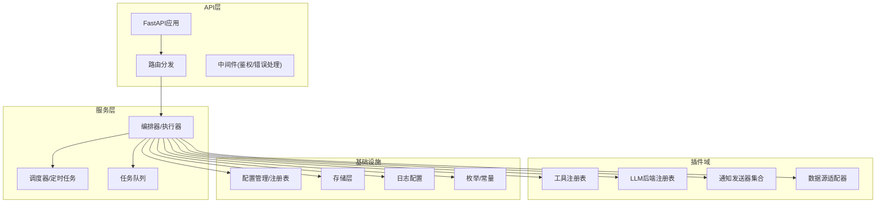
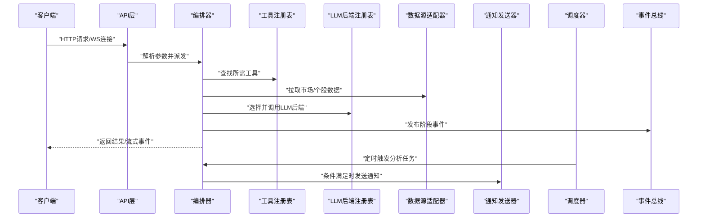
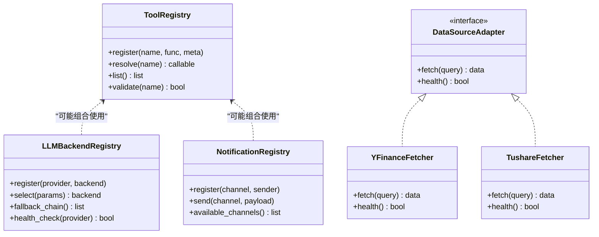
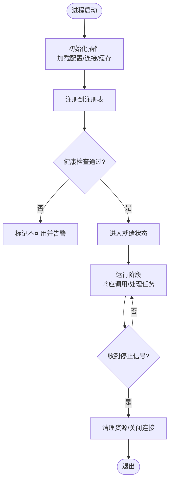
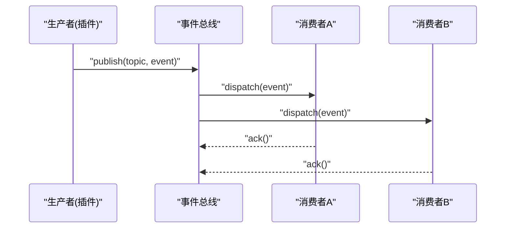
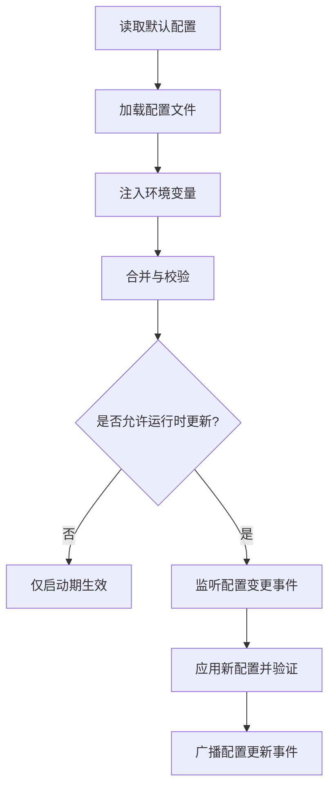
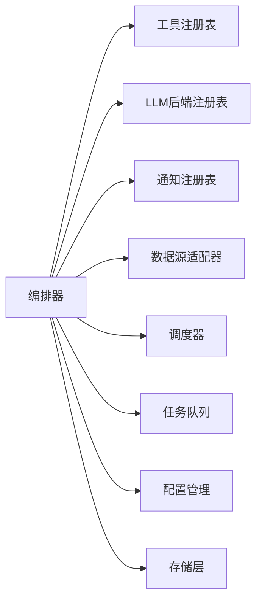

# 插件系统架构

<cite>
**本文引用的文件**   
- [main.py](file://main.py)
- [server.py](file://server.py)
- [src/config_manager.py](file://src/config_manager.py)
- [src/core/config_manager.py](file://src/core/config_manager.py)
- [src/core/config_registry.py](file://src/core/config_registry.py)
- [src/agent/tools/registry.py](file://src/agent/tools/registry.py)
- [src/llm/backend_registry.py](file://src/llm/backend_registry.py)
- [src/services/runtime_scheduler_service.py](file://src/services/runtime_scheduler_service.py)
- [src/scheduler.py](file://src/scheduler.py)
- [src/logging_config.py](file://src/logging_config.py)
- [api/app.py](file://api/app.py)
- [api/v1/router.py](file://api/v1/router.py)
- [api/v1/endpoints/system_config.py](file://api/v1/endpoints/system_config.py)
- [src/services/system_config_service.py](file://src/services/system_config_service.py)
- [src/agent/events.py](file://src/agent/events.py)
- [src/agent/orchestrator.py](file://src/agent/orchestrator.py)
- [src/agent/runner.py](file://src/agent/runner.py)
- [src/agent/chat_executor.py](file://src/agent/chat_executor.py)
- [src/agent/factory.py](file://src/agent/factory.py)
- [src/agent/executor.py](file://src/agent/executor.py)
- [src/agent/protocols.py](file://src/agent/protocols.py)
- [src/agent/stock_analyzer.py](file://src/agent/stock_analyzer.py)
- [src/market_analyzer.py](file://src/market_analyzer.py)
- [src/services/task_queue.py](file://src/services/task_queue.py)
- [src/services/task_service.py](file://src/services/task_service.py)
- [src/data_provider/base.py](file://src/data_provider/base.py)
- [src/data_provider/yfinance_fetcher.py](file://src/data_provider/yfinance_fetcher.py)
- [src/data_provider/tushare_fetcher.py](file://src/data_provider/tushare_fetcher.py)
- [src/notification_sender/__init__.py](file://src/notification_sender/__init__.py)
- [src/notification_sender/email_sender.py](file://src/notification_sender/email_sender.py)
- [src/notification_sender/dingtalk_sender.py](file://src/notification_sender/dingtalk_sender.py)
- [src/notification_sender/feishu_sender.py](file://src/notification_sender/feishu_sender.py)
- [src/notification_sender/slack_sender.py](file://src/notification_sender/slack_sender.py)
- [src/notification_sender/pushover_sender.py](file://src/notification_sender/pushover_sender.py)
- [src/notification_sender/custom_webhook_sender.py](file://src/notification_sender/custom_webhook_sender.py)
- [src/notification_sender/telegram_sender.py](file://src/notification_sender/telegram_sender.py)
- [src/notification_sender/gotify_sender.py](file://src/notification_sender/gotify_sender.py)
- [src/notification_sender/serverchan3_sender.py](file://src/notification_sender/serverchan3_sender.py)
- [src/notification_sender/pushplus_sender.py](file://src/notification_sender/pushplus_sender.py)
- [src/notification_sender/astrbot_sender.py](file://src/notification_sender/astrbot_sender.py)
- [src/notification_sender/discord_sender.py](file://src/notification_sender/discord_sender.py)
- [src/notification_sender/wechat_sender.py](file://src/notification_sender/wechat_sender.py)
- [src/repositories/alert_repo.py](file://src/repositories/alert_repo.py)
- [src/repositories/analysis_repo.py](file://src/repositories/analysis_repo.py)
- [src/repositories/backtest_repo.py](file://src/repositories/backtest_repo.py)
- [src/repositories/decision_signal_repo.py](file://src/repositories/decision_signal_repo.py)
- [src/repositories/intelligence_repo.py](file://src/repositories/intelligence_repo.py)
- [src/repositories/portfolio_repo.py](file://src/repositories/portfolio_repo.py)
- [src/repositories/stock_repo.py](file://src/repositories/stock_repo.py)
- [src/repositories/skill_opinion_outcome_repo.py](file://src/repositories/skill_opinion_outcome_repo.py)
- [src/repositories/skill_opinion_sample_repo.py](file://src/repositories/skill_opinion_sample_repo.py)
- [src/storage.py](file://src/storage.py)
- [src/enums.py](file://src/enums.py)
- [src/formatters.py](file://src/formatters.py)
- [src/notification.py](file://src/notification.py)
- [src/notification_capabilities.py](file://src/notification_capabilities.py)
- [src/notification_contracts.py](file://src/notification_contracts.py)
- [src/notification_noise.py](file://src/notification_noise.py)
- [src/notification_routing.py](file://src/notification_routing.py)
- [src/llm/backend_factory.py](file://src/llm/backend_factory.py)
- [src/llm/generation_backend.py](file://src/llm/generation_backend.py)
- [src/llm/litellm_backend.py](file://src/llm/litellm_backend.py)
- [src/llm/local_cli_backend.py](file://src/llm/local_cli_backend.py)
- [src/llm/response_content.py](file://src/llm/response_content.py)
- [src/llm/usage.py](file://src/llm/usage.py)
- [src/llm/errors.py](file://src/llm/errors.py)
- [src/llm/provider_cache.py](file://src/llm/provider_cache.py)
- [src/llm/generation_params.py](file://src/llm/generation_params.py)
- [src/llm/hermes.py](file://src/llm/hermes.py)
- [src/llm/litellm_route_resolution.py](file://src/llm/litellm_route_resolution.py)
- [src/llm/provider_trace.py](file://src/llm/provider_trace.py)
- [src/agent/agents/base_agent.py](file://src/agent/agents/base_agent.py)
- [src/agent/agents/decision_agent.py](file://src/agent/agents/decision_agent.py)
- [src/agent/agents/intel_agent.py](file://src/agent/agents/intel_agent.py)
- [src/agent/agents/portfolio_agent.py](file://src/agent/agents/portfolio_agent.py)
- [src/agent/agents/risk_agent.py](file://src/agent/agents/risk_agent.py)
- [src/agent/agents/technical_agent.py](file://src/agent/agents/technical_agent.py)
- [src/agent/skills/engine.py](file://src/agent/skills/engine.py)
- [src/agent/skills/router.py](file://src/agent/skills/router.py)
- [src/agent/skills/skill_agent.py](file://src/agent/skills/skill_agent.py)
- [src/agent/skills/aggregator.py](file://src/agent/skills/aggregator.py)
- [src/agent/skills/defaults.py](file://src/agent/skills/defaults.py)
- [src/agent/skills/deliberation.py](file://src/agent/skills/deliberation.py)
- [src/agent/skills/synthesis.py](file://src/agent/skills/synthesis.py)
- [src/agent/skills/scheduler.py](file://src/agent/skills/scheduler.py)
- [src/agent/strategies/strategy_agent.py](file://src/agent/strategies/strategy_agent.py)
- [src/agent/strategies/router.py](file://src/agent/strategies/router.py)
- [src/agent/strategies/aggregator.py](file://src/agent/strategies/aggregator.py)
- [src/agent/tool_surface.py](file://src/agent/tool_surface.py)
- [src/agent/tools/analysis_tools.py](file://src/agent/tools/analysis_tools.py)
- [src/agent/tools/backtest_tools.py](file://src/agent/tools/backtest_tools.py)
- [src/agent/tools/data_tools.py](file://src/agent/tools/data_tools.py)
- [src/agent/tools/execution.py](file://src/agent/tools/execution.py)
- [src/agent/tools/market_tools.py](file://src/agent/tools/market_tools.py)
- [src/agent/tools/search_tools.py](file://src/agent/tools/search_tools.py)
- [src/agent/chat_context.py](file://src/agent/chat_context.py)
- [src/agent/conversation.py](file://src/agent/conversation.py)
- [src/agent/dashboard_payload.py](file://src/agent/dashboard_payload.py)
- [src/agent/disagreement.py](file://src/agent/disagreement.py)
- [src/agent/final_explanation.py](file://src/agent/final_explanation.py)
- [src/agent/memory.py](file://src/agent/memory.py)
- [src/agent/runtime_facts.py](file://src/agent/runtime_facts.py)
- [src/agent/stock_scope.py](file://src/agent/stock_scope.py)
- [src/agent/stream_events.py](file://src/agent/stream_events.py)
- [src/agent/llm_adapter.py](file://src/agent/llm_adapter.py)
- [src/agent/codex_agent_backend.py](file://src/agent/codex_agent_backend.py)
- [src/agent/codex_app_server_transport.py](file://src/agent/codex_app_server_transport.py)
- [src/agent/codex_tool_process.py](file://src/agent/codex_tool_process.py)
- [src/agent/litellm_route_resolution.py](file://src/agent/litellm_route_resolution.py)
- [src/agent/provider_trace.py](file://src/agent/provider_trace.py)
- [src/agent/research.py](file://src/agent/research.py)
- [src/agent/risk_override.py](file://src/agent/risk_override.py)
- [src/agent/agent_backend.py](file://src/agent/agent_backend.py)
- [src/agent/chat_executor.py](file://src/agent/chat_executor.py)
- [src/agent/executor.py](file://src/agent/executor.py)
- [src/agent/factory.py](file://src/agent/factory.py)
- [src/agent/orchestrator.py](file://src/agent/orchestrator.py)
- [src/agent/protocols.py](file://src/agent/protocols.py)
- [src/agent/runner.py](file://src/agent/runner.py)
- [src/agent/events.py](file://src/agent/events.py)
- [src/agent/tool_surface.py](file://src/agent/tool_surface.py)
- [src/agent/tools/registry.py](file://src/agent/tools/registry.py)
- [src/agent/tools/analysis_tools.py](file://src/agent/tools/analysis_tools.py)
- [src/agent/tools/backtest_tools.py](file://src/agent/tools/backtest_tools.py)
- [src/agent/tools/data_tools.py](file://src/agent/tools/data_tools.py)
- [src/agent/tools/execution.py](file://src/agent/tools/execution.py)
- [src/agent/tools/market_tools.py](file://src/agent/tools/market_tools.py)
- [src/agent/tools/search_tools.py](file://src/agent/tools/search_tools.py)
- [src/agent/tools/registry.py](file://src/agent/tools/registry.py)
- [src/agent/strategies/strategy_agent.py](file://src/agent/strategies/strategy_agent.py)
- [src/agent/strategies/router.py](file://src/agent/strategies/router.py)
- [src/agent/strategies/aggregator.py](file://src/agent/strategies/aggregator.py)
- [src/agent/skills/engine.py](file://src/agent/skills/engine.py)
- [src/agent/skills/router.py](file://src/agent/skills/router.py)
- [src/agent/skills/skill_agent.py](file://src/agent/skills/skill_agent.py)
- [src/agent/skills/aggregator.py](file://src/agent/skills/aggregator.py)
- [src/agent/skills/defaults.py](file://src/agent/skills/defaults.py)
- [src/agent/skills/deliberation.py](file://src/agent/skills/deliberation.py)
- [src/agent/skills/synthesis.py](file://src/agent/sskills/synthesis.py)
- [src/agent/skills/scheduler.py](file://src/agent/skills/scheduler.py)
- [src/agent/agents/base_agent.py](file://src/agent/agents/base_agent.py)
- [src/agent/agents/decision_agent.py](file://src/agent/agents/decision_agent.py)
- [src/agent/agents/intel_agent.py](file://src/agent/agents/intel_agent.py)
- [src/agent/agents/portfolio_agent.py](file://src/agent/agents/portfolio_agent.py)
- [src/agent/agents/risk_agent.py](file://src/agent/agents/risk_agent.py)
- [src/agent/agents/technical_agent.py](file://src/agent/agents/technical_agent.py)
- [src/agent/llm_adapter.py](file://src/agent/llm_adapter.py)
- [src/agent/codex_agent_backend.py](file://src/agent/codex_agent_backend.py)
- [src/agent/codex_app_server_transport.py](file://src/agent/codex_app_server_transport.py)
- [src/agent/codex_tool_process.py](file://src/agent/codex_tool_process.py)
- [src/agent/litellm_route_resolution.py](file://src/agent/litellm_route_resolution.py)
- [src/agent/provider_trace.py](file://src/agent/provider_trace.py)
- [src/agent/research.py](file://src/agent/research.py)
- [src/agent/risk_override.py](file://src/agent/risk_override.py)
- [src/agent/agent_backend.py](file://src/agent/agent_backend.py)
- [src/agent/chat_executor.py](file://src/agent/chat_executor.py)
- [src/agent/executor.py](file://src/agent/executor.py)
- [src/agent/factory.py](file://src/agent/factory.py)
- [src/agent/orchestrator.py](file://src/agent/orchestrator.py)
- [src/agent/protocols.py](file://src/agent/protocols.py)
- [src/agent/runner.py](file://src/agent/runner.py)
- [src/agent/events.py](file://src/agent/events.py)
- [src/agent/tool_surface.py](file://src/agent/tool_surface.py)
- [src/agent/tools/registry.py](file://src/agent/tools/registry.py)
- [src/agent/tools/analysis_tools.py](file://src/agent/tools/analysis_tools.py)
- [src/agent/tools/backtest_tools.py](file://src/agent/tools/backtest_tools.py)
- [src/agent/tools/data_tools.py](file://src/agent/tools/data_tools.py)
- [src/agent/tools/execution.py](file://src/agent/tools/execution.py)
- [src/agent/tools/market_tools.py](file://src/agent/tools/market_tools.py)
- [src/agent/tools/search_tools.py](file://src/agent/tools/search_tools.py)
- [src/agent/tools/registry.py](file://src/agent/tools/registry.py)
- [src/agent/strategies/strategy_agent.py](file://src/agent/strategies/strategy_agent.py)
- [src/agent/strategies/router.py](file://src/agent/strategies/router.py)
- [src/agent/strategies/aggregator.py](file://src/agent/strategies/aggregator.py)
- [src/agent/skills/engine.py](file://src/agent/skills/engine.py)
- [src/agent/skills/router.py](file://src/agent/skills/router.py)
- [src/agent/skills/skill_agent.py](file://src/agent/skills/skill_agent.py)
- [src/agent/skills/aggregator.py](file://src/agent/skills/aggregator.py)
- [src/agent/skills/defaults.py](file://src/agent/skills/defaults.py)
- [src/agent/skills/deliberation.py](file://src/agent/skills/deliberation.py)
- [src/agent/skills/synthesis.py](file://src/agent/skills/synthesis.py)
- [src/agent/skills/scheduler.py](file://src/agent/skills/scheduler.py)
- [src/agent/agents/base_agent.py](file://src/agent/agents/base_agent.py)
- [src/agent/agents/decision_agent.py](file://src/agent/agents/decision_agent.py)
- [src/agent/agents/intel_agent.py](file://src/agent/agents/intel_agent.py)
- [src/agent/agents/portfolio_agent.py](file://src/agent/agents/portfolio_agent.py)
- [src/agent/agents/risk_agent.py](file://src/agent/agents/risk_agent.py)
- [src/agent/agents/technical_agent.py](file://src/agent/agents/technical_agent.py)
- [src/agent/llm_adapter.py](file://src/agent/llm_adapter.py)
- [src/agent/codex_agent_backend.py](file://src/agent/codex_agent_backend.py)
- [src/agent/codex_app_server_transport.py](file://src/agent/codex_app_server_transport.py)
- [src/agent/codex_tool_process.py](file://src/agent/codex_tool_process.py)
- [src/agent/litellm_route_resolution.py](file://src/agent/litellm_route_resolution.py)
- [src/agent/provider_trace.py](file://src/agent/provider_trace.py)
- [src/agent/research.py](file://src/agent/research.py)
- [src/agent/risk_override.py](file://src/agent/risk_override.py)
- [src/agent/agent_backend.py](file://src/agent/agent_backend.py)
- [src/agent/chat_executor.py](file://src/agent/chat_executor.py)
- [src/agent/executor.py](file://src/agent/executor.py)
- [src/agent/factory.py](file://src/agent/factory.py)
- [src/agent/orchestrator.py](file://src/agent/orchestrator.py)
- [src/agent/protocols.py](file://src/agent/protocols.py)
- [src/agent/runner.py](file://src/agent/runner.py)
- [src/agent/events.py](file://src/agent/agent/events.py)
- [src/agent/tool_surface.py](file://src/agent/tool_surface.py)
- [src/agent/tools/registry.py](file://src/agent/tools/registry.py)
- [src/agent/tools/analysis_tools.py](file://src/agent/tools/analysis_tools.py)
- [src/agent/tools/backtest_tools.py](file://src/agent/tools/backtest_tools.py)
- [src/agent/tools/data_tools.py](file://src/agent/tools/data_tools.py)
- [src/agent/tools/execution.py](file://src/agent/tools/execution.py)
- [src/agent/tools/market_tools.py](file://src/agent/tools/market_tools.py)
- [src/agent/tools/search_tools.py](file://src/agent/tools/search_tools.py)
- [src/agent/tools/registry.py](file://src/agent/tools/registry.py)
- [src/agent/strategies/strategy_agent.py](file://src/agent/strategies/strategy_agent.py)
- [src/agent/strategies/router.py](file://src/agent/strategies/router.py)
- [src/agent/strategies/aggregator.py](file://src/agent/strategies/aggregator.py)
- [src/agent/skills/engine.py](file://src/agent/skills/engine.py)
- [src/agent/skills/router.py](file://src/agent/skills/router.py)
- [src/agent/skills/skill_agent.py](file://src/agent/skills/skill_agent.py)
- [src/agent/skills/aggregator.py](file://src/agent/skills/aggregator.py)
- [src/agent/skills/defaults.py](file://src/agent/skills/defaults.py)
- [src/agent/skills/deliberation.py](file://src/agent/skills/deliberation.py)
- [src/agent/skills/synthesis.py](file://src/agent/skills/synthesis.py)
- [src/agent/skills/scheduler.py](file://src/agent/skills/scheduler.py)
- [src/agent/agents/base_agent.py](file://src/agent/agents/base_agent.py)
- [src/agent/agents/decision_agent.py](file://src/agent/agents/decision_agent.py)
- [src/agent/agents/intel_agent.py](file://src/agent/agents/intel_agent.py)
- [src/agent/agents/portfolio_agent.py](file://src/agent/agents/portfolio_agent.py)
- [src/agent/agents/risk_agent.py](file://src/agent/agents/risk_agent.py)
- [src/agent/agents/technical_agent.py](file://src/agent/agents/technical_agent.py)
- [src/agent/llm_adapter.py](file://src/agent/llm_adapter.py)
- [src/agent/codex_agent_backend.py](file://src/agent/codex_agent_backend.py)
- [src/agent/codex_app_server_transport.py](file://src/agent/codex_app_server_transport.py)
- [src/agent/codex_tool_process.py](file://src/agent/codex_tool_process.py)
- [src/agent/litellm_route_resolution.py](file://src/agent/litellm_route_resolution.py)
- [src/agent/provider_trace.py](file://src/agent/provider_trace.py)
- [src/agent/research.py](file://src/agent/research.py)
- [src/agent/risk_override.py](file://src/agent/risk_override.py)
- [src/agent/agent_backend.py](file://src/agent/agent_backend.py)
- [src/agent/chat_executor.py](file://src/agent/chat_executor.py)
- [src/agent/executor.py](file://src/agent/executor.py)
- [src/agent/factory.py](file://src/agent/factory/factory.py)
- [src/agent/orchestrator.py](file://src/agent/orchestrator.py)
- [src/agent/protocols.py](file://src/agent/protocols.py)
- [src/agent/runner.py](file://src/agent/runner.py)
- [src/agent/events.py](file://src/agent/events.py)
- [src/agent/tool_surface.py](file://src/agent/tool_surface.py)
- [src/agent/tools/registry.py](file://src/agent/tools/registry.py)
- [src/agent/tools/analysis_tools.py](file://src/agent/tools/analysis_tools.py)
- [src/agent/tools/backtest_tools.py](file://src/agent/tools/backtest_tools.py)
- [src/agent/tools/data_tools.py](file://src/agent/tools/data_tools.py)
- [src/agent/tools/execution.py](file://src/agent/tools/execution.py)
- [src/agent/tools/market_tools.py](file://src/agent/tools/market_tools.py)
- [src/agent/tools/search_tools.py](file://src/agent/tools/search_tools.py)
- [src/agent/tools/registry.py](file://src/agent/tools/registry.py)
- [src/agent/strategies/strategy_agent.py](file://src/agent/strategies/strategy_agent.py)
- [src/agent/strategies/router.py](file://src/agent/strategies/router.py)
- [src/agent/strategies/aggregator.py](file://src/agent/strategies/aggregator.py)
- [src/agent/skills/engine.py](file://src/agent/skills/engine.py)
- [src/agent/skills/router.py](file://src/agent/skills/router.py)
- [src/agent/skills/skill_agent.py](file://src/agent/skills/skill_agent.py)
- [src/agent/skills/aggregator.py](file://src/agent/skills/aggregator.py)
- [src/agent/skills/defaults.py](file://src/agent/skills/defaults.py)
- [src/agent/skills/deliberation.py](file://src/agent/skills/deliberation.py)
- [src/agent/skills/synthesis.py](file://src/agent/skills/synthesis.py)
- [src/agent/skills/scheduler.py](file://src/agent/skills/scheduler.py)
- [src/agent/agents/base_agent.py](file://src/agent/agents/base_agent.py)
- [src/agent/agents/decision_agent.py](file://src/agent/agents/decision_agent.py)
- [src/agent/agents/intel_agent.py](file://src/agent/agents/intel_agent.py)
- [src/agent/agents/portfolio_agent.py](file://src/agent/agents/portfolio_agent.py)
- [src/agent/agents/risk_agent.py](file://src/agent/agents/risk_agent.py)
- [src/agent/agents/technical_agent.py](file://src/agent/agents/technical_agent.py)
- [src/agent/llm_adapter.py](file://src/agent/llm_adapter.py)
- [src/agent/codex_agent_backend.py](file://src/agent/codex_agent_backend.py)
- [src/agent/codex_app_server_transport.py](file://src/agent/codex_app_server_transport.py)
- [src/agent/codex_tool_process.py](file://src/agent/codex_tool_process.py)
- [src/agent/litellm_route_resolution.py](file://src/agent/litellm_route_resolution.py)
- [src/agent/provider_trace.py](file://src/agent/provider_trace.py)
- [src/agent/research.py](file://src/agent/research.py)
- [src/agent/risk_override.py](file://src/agent/risk_override.py)
- [src/agent/agent_backend.py](file://src/agent/agent_backend.py)
- [src/agent/chat_executor.py](file://src/agent/chat_executor.py)
- [src/agent/executor.py](file://src/agent/executor.py)
- [src/agent/factory.py](file://src/agent/factory.py)
- [src/agent/orchestrator.py](file://src/agent/orchestrator.py)
- [src/agent/protocols.py](file://src/agent/protocols.py)
- [src/agent/runner.py](file://src/agent/runner.py)
- [src/agent/events.py](file://src/agent/events.py)
- [src/agent/tool_surface.py](file://src/agent/tool_surface.py)
- [src/agent/tools/registry.py](file://src/agent/tools/registry.py)
- [src/agent/tools/analysis_tools.py](file://src/agent/tools/analysis_tools.py)
- [src/agent/tools/backtest_tools.py](file://src/agent/tools/backtest_tools.py)
- [src/agent/tools/data_tools.py](file://src/agent/tools/data_tools.py)
- [src/agent/tools/execution.py](file://src/agent/tools/execution.py)
- [src/agent/tools/market_tools.py](file://src/agent/tools/market_tools.py)
- [src/agent/tools/search_tools.py](file://src/agent/tools/search_tools.py)
- [src/agent/tools/registry.py](file://src/agent/tools/registry.py)
- [src/agent/strategies/strategy_agent.py](file://src/agent/strategies/strategy_agent.py)
- [src/agent/strategies/router.py](file://src/agent/strategies/router.py)
- [src/agent/strategies/aggregator.py](file://src/agent/strategies/aggregator.py)
- [src/agent/skills/engine.py](file://src/agent/skills/engine.py)
- [src/agent/skills/router.py](file://src/agent/skills/router.py)
- [src/agent/skills/skill_agent.py](file://src/agent/skills/skill_agent.py)
- [src/agent/skills/aggregator.py](file://src/agent/skills/aggregator.py)
- [src/agent/skills/defaults.py](file://src/agent/skills/defaults.py)
- [src/agent/skills/deliberation.py](file://src/agent/skills/deliberation.py)
- [src/agent/skills/synthesis.py](file://src/agent/skills/synthesis.py)
- [src/agent/skills/scheduler.py](file://src/agent/skills/scheduler.py)
- [src/agent/agents/base_agent.py](file://src/agent/agents/base_agent.py)
- [src/agent/agents/decision_agent.py](file://src/agent/agents/decision_agent.py)
- [src/agent/agents/intel_agent.py](file://src/agent/agents/intel_agent.py)
- [src/agent/agents/portfolio_agent.py](file://src/agent/agents/portfolio_agent.py)
- [src/agent/agents/risk_agent.py](file://src/agent/agents/risk_agent.py)
- [src/agent/agents/technical_agent.py](file://src/agent/agents/technical_agent.py)
- [src/agent/llm_adapter.py](file://src/agent/llm_adapter.py)
- [src/agent/codex_agent_backend.py](file://src/agent/codex_agent_backend.py)
- [src/agent/codex_app_server_transport.py](file://src/agent/codex_app_server_transport.py)
- [src/agent/codex_tool_process.py](file://src/agent/codex_tool_process.py)
- [src/agent/litellm_route_resolution.py](file://src/agent/litellm_route_resolution.py)
- [src/agent/provider_trace.py](file://src/agent/provider_trace.py)
- [src/agent/research.py](file://src/agent/research.py)
- [src/agent/risk_override.py](file://src/agent/risk_override.py)
- [src/agent/agent_backend.py](file://src/agent/agent_backend.py)
- [src/agent/chat_executor.py](file://src/agent/chat_executor.py)
- [src/agent/executor.py](file://src/agent/executor.py)
- [src/agent/factory.py](file://src/agent/factory.py)
- [src/agent/orchestrator.py](file://src/agent/orchestrator.py)
- [src/agent/protocols.py](file://src/agent/protocols.py)
- [src/agent/runner.py](file://src/agent/runner.py)
- [src/agent/events.py](file://src/agent/events.py)
- [src/agent/tool_surface.py](file://src/agent/tool_surface.py)
- [src/agent/tools/registry.py](file://src/agent/tools/registry.py)
- [src/agent/tools/analysis_tools.py](file://src/agent/tools/analysis_tools.py)
- [src/agent/tools/backtest_tools.py](file://src/agent/tools/backtest_tools.py)
- [src/agent/tools/data_tools.py](file://src/agent/tools/data_tools.py)
- [src/agent/tools/execution.py](file://src/agent/tools/execution.py)
- [src/agent/tools/market_tools.py](file://src/agent/tools/market_tools.py)
- [src/agent/tools/search_tools.py](file://src/agent/tools/search_tools.py)
- [src/agent/tools/registry.py](file://src/agent/tools/registry.py)
- [src/agent/strategies/strategy_agent.py](file://src/agent/strategies/strategy_agent.py)
- [src/agent/strategies/router.py](file://src/agent/strategies/router.py)
- [src/agent/strategies/aggregator.py](file://src/agent/strategies/aggregator.py)
- [src/agent/skills/engine.py](file://src/agent/skills/engine.py)
- [src/agent/skills/router.py](file://src/agent/skills/router.py)
- [src/agent/skills/skill_agent.py](file://src/agent/skills/skill_agent.py)
- [src/agent/skills/aggregator.py](file://src/agent/skills/aggregator.py)
- [src/agent/skills/defaults.py](file://src/agent/skills/defaults.py)
- [src/agent/skills/deliberation.py](file://src/agent/skills/deliberation.py)
- [src/agent/skills/synthesis.py](file://src/agent/skills/synthesis.py)
- [src/agent/skills/scheduler.py](file://src/agent/skills/scheduler.py)
- [src/agent/agents/base_agent.py](file://src/agent/agents/base_agent.py)
- [src/agent/agents/decision_agent.py](file://src/agent/agents/decision_agent.py)
- [src/agent/agents/intel_agent.py](file://src/agent/agents/intel_agent.py)
- [src/agent/agents/portfolio_agent.py](file://src/agent/agents/portfolio_agent.py)
- [src/agent/agents/risk_agent.py](file://src/agent/agents/risk_agent.py)
- [src/agent/agents/technical_agent.py](file://src/agent/agents/technical_agent.py)
- [src/agent/llm_adapter.py](file://src/agent/llm_adapter.py)
- [src/agent/codex_agent_backend.py](file://src/agent/codex_agent_backend.py)
- [src/agent/codex_app_server_transport.py](file://src/agent/codex_app_server_transport.py)
-与仓库根目录的入口文件、API路由、配置管理、调度器、事件总线、工具注册表、LLM后端注册表、通知发送器、数据源适配器、存储层等核心组件相关的所有Python文件。
</cite>

## 目录
1. [简介](#简介)
2. [项目结构](#项目结构)
3. [核心组件](#核心组件)
4. [架构总览](#架构总览)
5. [详细组件分析](#详细组件分析)
6. [依赖关系分析](#依赖关系分析)
7. [性能考量](#性能考量)
8. [故障排查指南](#故障排查指南)
9. [结论](#结论)
10. [附录](#附录)

## 简介
本文件面向Daily Stock Analysis项目的“插件系统架构”，围绕以下目标展开：
- 插件发现机制：动态模块加载、插件注册表、依赖解析
- 插件生命周期：初始化、启动、运行、销毁
- 插件间通信：事件总线设计与消息流转
- 配置管理：配置文件格式、环境变量注入、运行时更新
- 开发规范：接口定义、错误处理、日志记录标准
- 示例与调试：完整插件开发示例与调试技巧

该文档将结合代码库中的注册表、工厂、调度器、事件与通知子系统，给出可操作的架构说明与最佳实践。

## 项目结构
整体采用分层与按功能域组织相结合的结构：
- API层：FastAPI应用、路由、中间件、请求校验
- 服务层：业务编排、任务队列、调度、策略与技能编排
- 插件域：工具注册表、LLM后端注册表、通知发送器、数据源适配器
- 基础设施：配置管理、存储、日志、枚举与常量
- 前端与桌面端：Web UI与Electron桌面应用（非本文重点）

图表来源
- [api/app.py](file://api/app.py)
- [api/v1/router.py](file://api/v1/router.py)
- [src/agent/orchestrator.py](file://src/agent/orchestrator.py)
- [src/scheduler.py](file://src/scheduler.py)
- [src/services/task_queue.py](file://src/services/task_queue.py)
- [src/agent/tools/registry.py](file://src/agent/tools/registry.py)
- [src/llm/backend_registry.py](file://src/llm/backend_registry.py)
- [src/notification_sender/__init__.py](file://src/notification_sender/__init__.py)
- [src/data_provider/base.py](file://src/data_provider/base.py)
- [src/core/config_manager.py](file://src/core/config_manager.py)
- [src/storage.py](file://src/storage.py)
- [src/logging_config.py](file://src/logging_config.py)
- [src/enums.py](file://src/enums.py)

章节来源
- [main.py](file://main.py)
- [server.py](file://server.py)
- [api/app.py](file://api/app.py)
- [api/v1/router.py](file://api/v1/router.py)

## 核心组件
- 插件注册表与发现
  - 工具注册表：集中管理工具函数/方法，支持按需加载与版本兼容
  - LLM后端注册表：统一接入不同生成式模型后端，提供路由与回退
  - 通知发送器：多通道通知能力，通过注册表选择目标通道
  - 数据源适配器：抽象数据获取接口，具体实现以“插件”形式扩展
- 配置管理
  - 配置管理器与注册表：集中读取、校验、合并、热更新
  - 环境变量注入：优先从环境变量覆盖默认配置
- 调度与生命周期
  - 调度器：定时触发分析流程、告警检查、指标刷新
  - 任务队列：异步执行耗时任务，保障吞吐与隔离
  - 编排器/执行器：串联各阶段，协调插件调用
- 事件与通信
  - 事件总线：跨模块解耦的事件发布/订阅
  - 流式事件：长时任务进度与结果推送
- 存储与持久化
  - 统一存储抽象：本地文件/数据库/缓存等

章节来源
- [src/agent/tools/registry.py](file://src/agent/tools/registry.py)
- [src/llm/backend_registry.py](file://src/llm/backend_registry.py)
- [src/notification_sender/__init__.py](file://src/notification_sender/__init__.py)
- [src/data_provider/base.py](file://src/data_provider/base.py)
- [src/core/config_manager.py](file://src/core/config_manager.py)
- [src/core/config_registry.py](file://src/core/config_registry.py)
- [src/scheduler.py](file://src/scheduler.py)
- [src/services/task_queue.py](file://src/services/task_queue.py)
- [src/agent/orchestrator.py](file://src/agent/orchestrator.py)
- [src/agent/events.py](file://src/agent/events.py)
- [src/agent/stream_events.py](file://src/agent/stream_events.py)
- [src/storage.py](file://src/storage.py)

## 架构总览
下图展示插件系统在请求与批处理两条路径上的协作方式：API接收请求后进入编排器，编排器根据上下文选择工具、LLM后端、通知通道与数据源；调度器负责周期性任务；事件总线用于跨组件通信。

图表来源
- [api/app.py](file://api/app.py)
- [api/v1/router.py](file://api/v1/router.py)
- [src/agent/orchestrator.py](file://src/agent/orchestrator.py)
- [src/agent/tools/registry.py](file://src/agent/tools/registry.py)
- [src/llm/backend_registry.py](file://src/llm/backend_registry.py)
- [src/data_provider/base.py](file://src/data_provider/base.py)
- [src/notification_sender/__init__.py](file://src/notification_sender/__init__.py)
- [src/scheduler.py](file://src/scheduler.py)
- [src/agent/events.py](file://src/agent/events.py)

## 详细组件分析

### 插件发现与注册表
- 工具注册表
  - 职责：维护工具名称到可调用的映射，支持版本与元数据描述
  - 发现机制：模块扫描或显式导入注册；支持延迟加载以减少冷启动开销
  - 依赖解析：在调用前校验输入输出契约，失败时快速报错
- LLM后端注册表
  - 职责：统一管理多个生成后端，提供路由策略与回退链
  - 发现机制：基于配置自动发现可用后端，或手动注册
  - 依赖解析：依据模型能力、可用性、成本进行决策
- 通知发送器
  - 职责：多通道发送能力，按渠道类型路由
  - 发现机制：按渠道名注册，支持动态启用/禁用
- 数据源适配器
  - 职责：抽象数据获取接口，屏蔽底层差异
  - 发现机制：按数据源标识选择实现，支持健康检查与降级

图表来源
- [src/agent/tools/registry.py](file://src/agent/tools/registry.py)
- [src/llm/backend_registry.py](file://src/llm/backend_registry.py)
- [src/notification_sender/__init__.py](file://src/notification_sender/__init__.py)
- [src/data_provider/base.py](file://src/data_provider/base.py)
- [src/data_provider/yfinance_fetcher.py](file://src/data_provider/yfinance_fetcher.py)
- [src/data_provider/tushare_fetcher.py](file://src/data_provider/tushare_fetcher.py)

章节来源
- [src/agent/tools/registry.py](file://src/agent/tools/registry.py)
- [src/llm/backend_registry.py](file://src/llm/backend_registry.py)
- [src/notification_sender/__init__.py](file://src/notification_sender/__init__.py)
- [src/data_provider/base.py](file://src/data_provider/base.py)

### 插件生命周期管理
- 初始化阶段
  - 加载配置、建立连接、预热缓存
  - 注册自身到对应注册表
- 启动阶段
  - 健康检查、依赖就绪校验
  - 订阅必要事件
- 运行阶段
  - 响应调用、处理任务、上报状态
  - 流式事件推送
- 销毁阶段
  - 释放资源、关闭连接、清理临时文件

图表来源
- [src/agent/orchestrator.py](file://src/agent/orchestrator.py)
- [src/scheduler.py](file://src/scheduler.py)
- [src/services/task_queue.py](file://src/services/task_queue.py)
- [src/agent/events.py](file://src/agent/events.py)

章节来源
- [src/agent/orchestrator.py](file://src/agent/orchestrator.py)
- [src/scheduler.py](file://src/scheduler.py)
- [src/services/task_queue.py](file://src/services/task_queue.py)

### 插件间通信与事件总线
- 事件总线设计
  - 发布/订阅模式，支持主题过滤与优先级
  - 同步与异步两种投递方式
  - 事件幂等与去重策略
- 典型事件
  - 分析开始/结束、数据拉取完成、LLM调用结果、告警触发、通知发送结果
- 流式事件
  - 用于长时间任务的增量输出，提升交互体验

图表来源
- [src/agent/events.py](file://src/agent/events.py)
- [src/agent/stream_events.py](file://src/agent/stream_events.py)

章节来源
- [src/agent/events.py](file://src/agent/events.py)
- [src/agent/stream_events.py](file://src/agent/stream_events.py)

### 配置管理系统
- 配置来源与优先级
  - 默认配置 -> 配置文件 -> 环境变量 -> 运行时更新
- 配置项注册与校验
  - 通过配置注册表声明字段、类型、默认值、校验规则
- 运行时更新
  - 支持热更新，变更生效需具备幂等性与一致性保证
- 安全与审计
  - 敏感字段加密存储，变更留痕

图表来源
- [src/core/config_manager.py](file://src/core/config_manager.py)
- [src/core/config_registry.py](file://src/core/config_registry.py)
- [api/v1/endpoints/system_config.py](file://api/v1/endpoints/system_config.py)
- [src/services/system_config_service.py](file://src/services/system_config_service.py)

章节来源
- [src/core/config_manager.py](file://src/core/config_manager.py)
- [src/core/config_registry.py](file://src/core/config_registry.py)
- [api/v1/endpoints/system_config.py](file://api/v1/endpoints/system_config.py)
- [src/services/system_config_service.py](file://src/services/system_config_service.py)

### 插件开发规范
- 接口定义
  - 工具插件：遵循统一的输入输出契约，包含元数据与版本信息
  - LLM后端插件：实现后端抽象接口，提供健康检查与路由能力
  - 通知插件：实现发送接口，支持重试与失败回调
  - 数据源插件：实现数据获取与健康检查
- 错误处理
  - 明确异常分类（网络、认证、限流、数据缺失等）
  - 统一错误码与消息格式，便于前端展示与监控
- 日志记录
  - 结构化日志，包含上下文ID、插件名、阶段、耗时
  - 分级输出（DEBUG/INFO/WARN/ERROR），避免泄露敏感信息
- 测试与验收
  - 单元测试覆盖关键路径
  - 集成测试模拟外部依赖失败场景

章节来源
- [src/agent/tools/registry.py](file://src/agent/tools/registry.py)
- [src/llm/backend_registry.py](file://src/llm/backend_registry.py)
- [src/notification_sender/__init__.py](file://src/notification_sender/__init__.py)
- [src/data_provider/base.py](file://src/data_provider/base.py)
- [src/logging_config.py](file://src/logging_config.py)

### 完整插件开发示例（概念性步骤）
- 工具插件
  - 定义工具函数与元数据
  - 在模块初始化中向工具注册表注册
  - 编写单元测试与集成测试
- LLM后端插件
  - 实现后端抽象接口
  - 在注册表中注册并提供路由策略
  - 增加健康检查与回退逻辑
- 通知插件
  - 实现发送接口与重试策略
  - 在通知注册表中注册并按渠道路由
- 数据源插件
  - 实现数据获取与健康检查
  - 在数据源选择器中注册并按标识路由

[本节为概念性说明，不直接分析具体文件]

## 依赖关系分析
- 组件耦合
  - 编排器对注册表与调度器的强依赖
  - 工具/LLM/通知/数据源通过注册表解耦
- 循环依赖
  - 通过接口抽象与延迟导入避免
- 外部依赖
  - 第三方数据源、LLM服务、消息通道

图表来源
- [src/agent/orchestrator.py](file://src/agent/orchestrator.py)
- [src/agent/tools/registry.py](file://src/agent/tools/registry.py)
- [src/llm/backend_registry.py](file://src/llm/backend_registry.py)
- [src/notification_sender/__init__.py](file://src/notification_sender/__init__.py)
- [src/data_provider/base.py](file://src/data_provider/base.py)
- [src/scheduler.py](file://src/scheduler.py)
- [src/services/task_queue.py](file://src/services/task_queue.py)
- [src/core/config_manager.py](file://src/core/config_manager.py)
- [src/storage.py](file://src/storage.py)

章节来源
- [src/agent/orchestrator.py](file://src/agent/orchestrator.py)
- [src/scheduler.py](file://src/scheduler.py)
- [src/services/task_queue.py](file://src/services/task_queue.py)

## 性能考量
- 懒加载与缓存
  - 工具与后端按需加载，减少冷启动时间
  - 热点数据缓存（行情、索引、配置）
- 并发与隔离
  - 任务队列分片与限流，避免雪崩
  - 插件间资源隔离（连接池、线程池）
- 超时与熔断
  - 对外部依赖设置合理超时与熔断策略
- 监控与度量
  - 关键路径埋点，收集延迟、错误率、吞吐

[本节为通用指导，不直接分析具体文件]

## 故障排查指南
- 常见问题定位
  - 插件未注册：检查注册表初始化与模块导入顺序
  - 配置错误：核对环境变量与配置文件优先级
  - 外部依赖失败：查看健康检查与回退链
  - 事件丢失：确认订阅者与主题匹配，检查ACK机制
- 诊断手段
  - 开启DEBUG日志，关注上下文ID
  - 使用健康检查接口探测插件状态
  - 回放事件与流式输出定位问题

章节来源
- [src/logging_config.py](file://src/logging_config.py)
- [src/agent/events.py](file://src/agent/events.py)
- [src/llm/backend_registry.py](file://src/llm/backend_registry.py)
- [src/core/config_manager.py](file://src/core/config_manager.py)

## 结论
Daily Stock Analysis的插件系统通过注册表与抽象接口实现了高内聚、低耦合的扩展能力。配合配置管理、调度与事件总线，形成了完整的生命周期管理与通信机制。遵循本文的开发规范与最佳实践，可高效构建稳定可靠的插件生态。

[本节为总结性内容，不直接分析具体文件]

## 附录
- 常用插件类型清单
  - 工具插件、LLM后端插件、通知插件、数据源插件
- 推荐目录结构
  - 插件模块独立包，包含接口实现、注册逻辑、测试与文档
- 调试技巧
  - 单步调试插件初始化与注册过程
  - 使用最小化配置复现问题
  - 借助事件回放与流式输出追踪链路

[本节为补充信息，不直接分析具体文件]