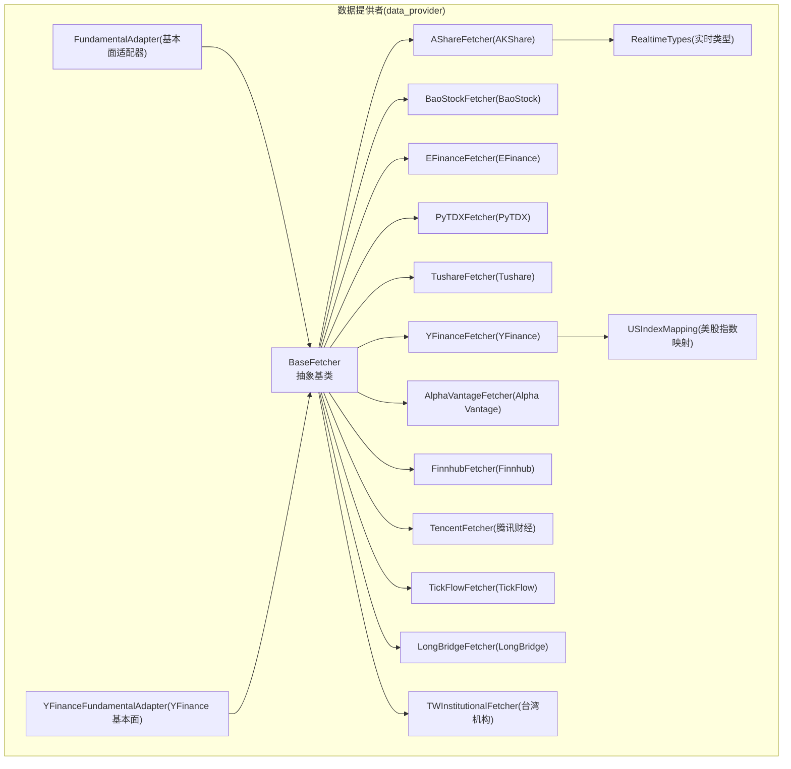
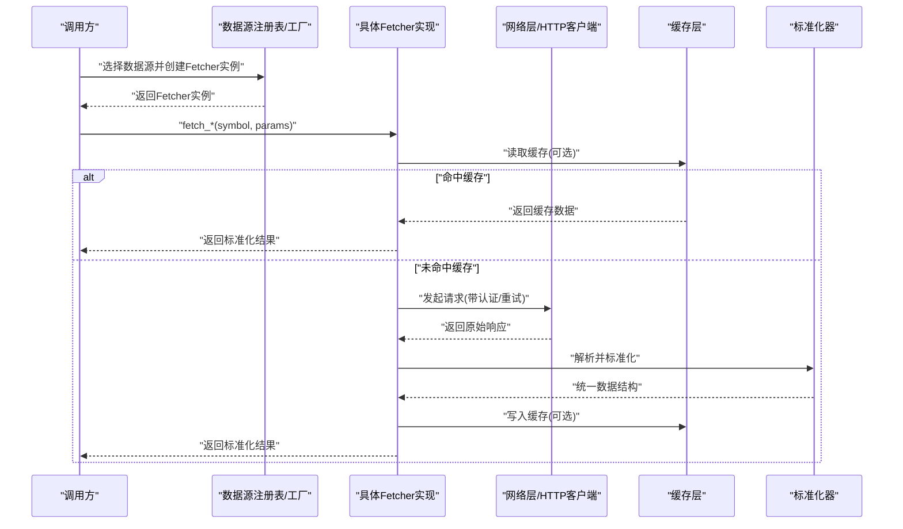
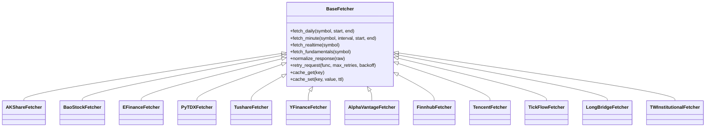
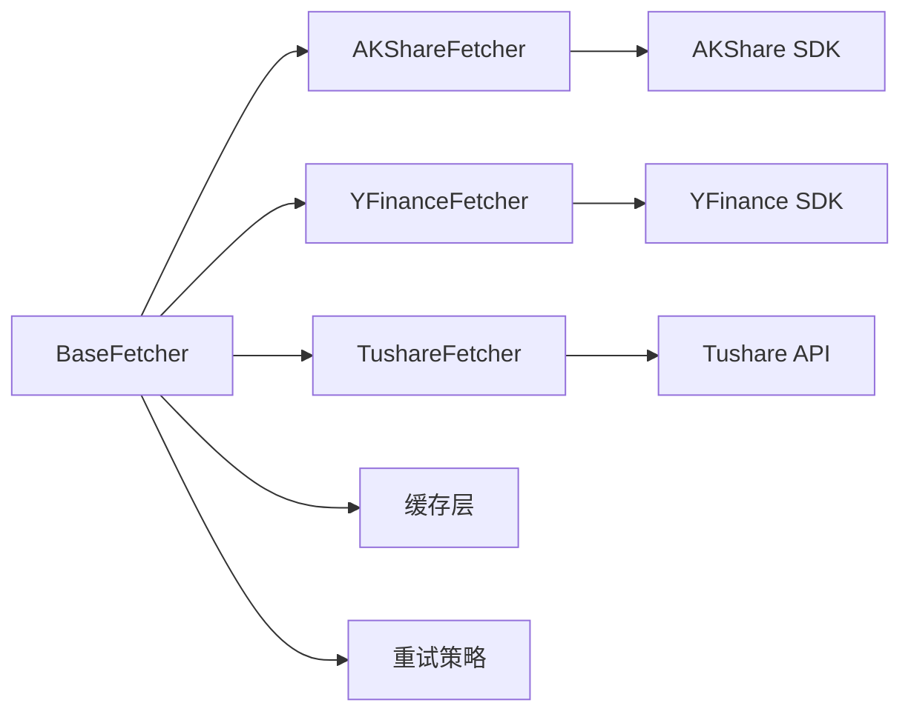

# 数据源适配器扩展

<cite>
**本文引用的文件**   
- [data_provider/base.py](file://data_provider/base.py)
- [data_provider/akshare_fetcher.py](file://data_provider/akshare_fetcher.py)
- [data_provider/alphavantage_fetcher.py](file://data_provider/alphavantage_fetcher.py)
- [data_provider/baostock_fetcher.py](file://data_provider/baostock_fetcher.py)
- [data_provider/efinance_fetcher.py](file://data_provider/efinance_fetcher.py)
- [data_provider/finnhub_fetcher.py](file://data_provider/finnhub_fetcher.py)
- [data_provider/fundamental_adapter.py](file://data_provider/fundamental_adapter.py)
- [data_provider/longbridge_fetcher.py](file://data_provider/longbridge_fetcher.py)
- [data_provider/pytdx_fetcher.py](file://data_provider/pytdx_fetcher.py)
- [data_provider/realtime_types.py](file://data_provider/realtime_types.py)
- [data_provider/tencent_fetcher.py](file://data_provider/tencent_fetcher.py)
- [data_provider/tickflow_fetcher.py](file://data_provider/tickflow_fetcher.py)
- [data_provider/tushare_fetcher.py](file://data_provider/tushare_fetcher.py)
- [data_provider/tw_institutional_fetcher.py](file://data_provider/tw_institutional_fetcher.py)
- [data_provider/us_index_mapping.py](file://data_provider/us_index_mapping.py)
- [data_provider/yfinance_fetcher.py](file://data_provider/yfinance_fetcher.py)
- [data_provider/yfinance_fundamental_adapter.py](file://data_provider/yfinance_fundamental_adapter.py)
</cite>

## 目录
1. [简介](#简介)
2. [项目结构](#项目结构)
3. [核心组件](#核心组件)
4. [架构总览](#架构总览)
5. [详细组件分析](#详细组件分析)
6. [依赖关系分析](#依赖关系分析)
7. [性能考量](#性能考量)
8. [故障排查指南](#故障排查指南)
9. [结论](#结论)
10. [附录：开发指南与示例](#附录开发指南与示例)

## 简介
本文件围绕数据源适配器扩展机制展开，聚焦 BaseFetcher 基类的设计模式与抽象接口，系统阐述数据获取、错误处理与数据标准化流程；说明如何继承 BaseFetcher 实现新的数据源适配器（含 API 认证、请求封装、响应解析）；解释数据格式转换机制以统一不同数据源的输出结构；描述缓存策略与重试机制的实现思路；并提供完整的开发指南、测试方法与性能优化建议，以及多个实际的数据源集成示例。

## 项目结构
数据源适配层位于 data_provider 目录，采用“基类 + 多实现”的插件式架构：
- base.py：定义 BaseFetcher 抽象基类与通用能力（认证、重试、缓存、异常、标准化）。
- *_fetcher.py：各数据源的具体实现（如 A 股、港股、美股、指数、基本面等）。
- realtime_types.py：实时行情相关类型定义。
- fundamental_adapter.py / yfinance_fundamental_adapter.py：面向基本面的适配器。
- us_index_mapping.py：美股指数映射工具。

图表来源
- [data_provider/base.py](file://data_provider/base.py)
- [data_provider/akshare_fetcher.py](file://data_provider/akshare_fetcher.py)
- [data_provider/baostock_fetcher.py](file://data_provider/baostock_fetcher.py)
- [data_provider/efinance_fetcher.py](file://data_provider/efinance_fetcher.py)
- [data_provider/pytdx_fetcher.py](file://data_provider/pytdx_fetcher.py)
- [data_provider/tushare_fetcher.py](file://data_provider/tushare_fetcher.py)
- [data_provider/yfinance_fetcher.py](file://data_provider/yfinance_fetcher.py)
- [data_provider/alphavantage_fetcher.py](file://data_provider/alphavantage_fetcher.py)
- [data_provider/finnhub_fetcher.py](file://data_provider/finnhub_fetcher.py)
- [data_provider/tencent_fetcher.py](file://data_provider/tencent_fetcher.py)
- [data_provider/tickflow_fetcher.py](file://data_provider/tickflow_fetcher.py)
- [data_provider/longbridge_fetcher.py](file://data_provider/longbridge_fetcher.py)
- [data_provider/tw_institutional_fetcher.py](file://data_provider/tw_institutional_fetcher.py)
- [data_provider/fundamental_adapter.py](file://data_provider/fundamental_adapter.py)
- [data_provider/yfinance_fundamental_adapter.py](file://data_provider/yfinance_fundamental_adapter.py)
- [data_provider/realtime_types.py](file://data_provider/realtime_types.py)
- [data_provider/us_index_mapping.py](file://data_provider/us_index_mapping.py)

章节来源
- [data_provider/base.py](file://data_provider/base.py)
- [data_provider/akshare_fetcher.py](file://data_provider/akshare_fetcher.py)
- [data_provider/yfinance_fetcher.py](file://data_provider/yfinance_fetcher.py)

## 核心组件
- BaseFetcher 抽象基类
  - 职责：统一数据获取入口、认证管理、网络请求封装、重试与退避、缓存控制、异常分类与传播、数据标准化到内部模型。
  - 关键抽象方法：按数据类型（日线、分钟线、实时报价、基本面、指数等）提供 fetch_* 抽象接口，子类必须实现具体数据源差异。
  - 通用能力：
    - 认证：支持 Token/API Key/Header/签名等注入方式。
    - 重试：可配置最大重试次数、退避策略（指数退避）、重试触发条件（网络超时、限流、HTTP 5xx）。
    - 缓存：键生成规则（标的、时间窗口、字段集）、过期策略、存储后端（内存/文件/Redis）。
    - 标准化：将不同数据源的原始响应转换为统一的内部数据结构（字段名、单位、时区、缺失值处理）。
    - 错误处理：区分网络错误、业务错误、数据校验错误，并抛出一致的异常类型以便上层统一处理。

- 具体 Fetcher 实现
  - 每个 *_fetcher.py 对应一个数据源，实现 BaseFetcher 的抽象方法，完成：
    - 特定 API 认证（如 Tushare 的 token、Alpha Vantage 的 key、LongBridge 的 OAuth）。
    - 请求构造（URL、参数、分页、并发限制）。
    - 响应解析（JSON/CSV/二进制），并进行字段映射与类型转换。
    - 错误码映射与重试判定。
    - 可选本地或远程缓存读写。

- 辅助模块
  - realtime_types.py：统一实时行情的数据结构定义（如报价、盘口、逐笔等）。
  - fundamental_adapter.py / yfinance_fundamental_adapter.py：将不同基本面数据源统一为一致的基本面指标结构。
  - us_index_mapping.py：美股指数代码映射与别名处理。

章节来源
- [data_provider/base.py](file://data_provider/base.py)
- [data_provider/realtime_types.py](file://data_provider/realtime_types.py)
- [data_provider/fundamental_adapter.py](file://data_provider/fundamental_adapter.py)
- [data_provider/yfinance_fundamental_adapter.py](file://data_provider/yfinance_fundamental_adapter.py)
- [data_provider/us_index_mapping.py](file://data_provider/us_index_mapping.py)

## 架构总览
数据源适配器采用“抽象基类 + 多实现”的策略模式，配合工厂/注册表（由上层服务负责）进行动态选择。整体调用链如下：

图表来源
- [data_provider/base.py](file://data_provider/base.py)
- [data_provider/akshare_fetcher.py](file://data_provider/akshare_fetcher.py)
- [data_provider/yfinance_fetcher.py](file://data_provider/yfinance_fetcher.py)

## 详细组件分析

### BaseFetcher 抽象基类设计
- 设计模式
  - 模板方法：定义 fetch_* 的标准流程（认证→缓存→请求→解析→标准化→缓存落盘），子类仅实现差异化步骤。
  - 策略模式：通过配置切换不同的重试策略、缓存策略、认证策略。
- 抽象接口
  - 历史日线/分钟线、实时报价、基本面、指数等 fetch_* 抽象方法。
  - 标准化接口：将原始响应转为统一模型。
- 错误处理
  - 统一异常类型（网络异常、业务异常、数据异常），便于上层捕获与降级。
- 缓存与重试
  - 缓存键：基于 symbol、时间范围、字段集合、数据源版本等组合。
  - 重试：指数退避、抖动、最大重试次数、可重试状态码/异常类型。

章节来源
- [data_provider/base.py](file://data_provider/base.py)

### 数据获取与标准化流程
- 数据获取
  - 认证：根据数据源要求注入 Token/Key/Header/签名。
  - 请求：封装 HTTP 调用，处理分页、限速、并发。
  - 响应：解析 JSON/CSV/二进制，提取有效数据。
- 标准化
  - 字段映射：不同数据源的字段名、单位、时区统一。
  - 缺失值：填充默认值或标记缺失。
  - 类型转换：日期、数值、布尔等类型规范化。
  - 一致性校验：必填字段检查、范围校验、重复去重。

章节来源
- [data_provider/base.py](file://data_provider/base.py)
- [data_provider/realtime_types.py](file://data_provider/realtime_types.py)

### 错误处理与重试机制
- 错误分类
  - 网络错误：超时、连接失败、DNS 解析失败。
  - 业务错误：API 限流、鉴权失败、参数非法。
  - 数据错误：字段缺失、类型不匹配、数据不完整。
- 重试策略
  - 指数退避 + 随机抖动，避免雪崩。
  - 针对限流与 5xx 自动重试，4xx 通常不重试。
  - 可配置最大重试次数与单次超时。
- 降级与熔断
  - 当某数据源持续失败时，切换到备用数据源或返回空数据并告警。

章节来源
- [data_provider/base.py](file://data_provider/base.py)

### 缓存策略
- 缓存键生成
  - 包含 symbol、时间窗口、字段集、数据源版本、查询参数等。
- 缓存粒度
  - 可按日/分钟/实时级别设置不同过期时间。
- 存储后端
  - 内存缓存用于热点数据，文件/Redis 用于持久化共享。
- 失效与更新
  - 定时刷新、按需刷新、版本号变更强制失效。

章节来源
- [data_provider/base.py](file://data_provider/base.py)

### 具体数据源适配器示例

#### AKShare 适配器
- 特点：A 股历史行情、财务数据、宏观数据等。
- 认证：多数免费接口无需认证，部分需配置代理或限速。
- 请求封装：处理分页与速率限制，避免频繁请求。
- 响应解析：JSON/CSV 混合，字段映射至统一结构。
- 标准化：统一日期、价格、成交量、复权处理。

章节来源
- [data_provider/akshare_fetcher.py](file://data_provider/akshare_fetcher.py)

#### BaoStock 适配器
- 特点：A 股历史数据、指数、板块等。
- 认证：无认证，但需注意访问频率。
- 请求封装：批量拉取与分片请求。
- 标准化：统一字段命名与单位。

章节来源
- [data_provider/baostock_fetcher.py](file://data_provider/baostock_fetcher.py)

#### EFinance 适配器
- 特点：A 股实时行情、资金流向等。
- 认证：无需认证。
- 请求封装：高频实时数据拉取，注意并发与限流。
- 标准化：实时报价、盘口、成交明细统一。

章节来源
- [data_provider/efinance_fetcher.py](file://data_provider/efinance_fetcher.py)

#### PyTDX 适配器
- 特点：通达信协议直连，低延迟 A 股实时行情。
- 认证：服务端 IP 白名单或账号密码。
- 请求封装：TCP 长连接、心跳保活、断线重连。
- 标准化：实时报价、分时、K 线统一。

章节来源
- [data_provider/pytdx_fetcher.py](file://data_provider/pytdx_fetcher.py)

#### Tushare 适配器
- 特点：A 股全面数据（历史、财务、公告、龙虎榜等）。
- 认证：Token 认证，配额限制严格。
- 请求封装：分页、限速、重试。
- 标准化：财务指标、公告文本、交易数据统一。

章节来源
- [data_provider/tushare_fetcher.py](file://data_provider/tushare_fetcher.py)

#### YFinance 适配器
- 特点：美股、港股、ETF、指数等。
- 认证：多数免费接口无需认证。
- 请求封装：异步并发、重试、代理。
- 标准化：统一 K 线、财报、指数映射。

章节来源
- [data_provider/yfinance_fetcher.py](file://data_provider/yfinance_fetcher.py)
- [data_provider/us_index_mapping.py](file://data_provider/us_index_mapping.py)

#### Alpha Vantage 适配器
- 特点：全球市场数据，API Key 认证。
- 认证：Header 注入 API Key。
- 请求封装：分页、限速、重试。
- 标准化：统一字段与时区。

章节来源
- [data_provider/alphavantage_fetcher.py](file://data_provider/alphavantage_fetcher.py)

#### Finnhub 适配器
- 特点：美股实时与历史数据，WebSocket 实时推送。
- 认证：API Key。
- 请求封装：REST + WebSocket，断线重连。
- 标准化：实时报价、新闻、公司资料。

章节来源
- [data_provider/finnhub_fetcher.py](file://data_provider/finnhub_fetcher.py)

#### 腾讯财经 适配器
- 特点：A 股实时行情、新闻。
- 认证：无需认证。
- 请求封装：HTTP 轮询或 SSE。
- 标准化：实时报价、新闻标题与内容。

章节来源
- [data_provider/tencent_fetcher.py](file://data_provider/tencent_fetcher.py)

#### TickFlow 适配器
- 特点：逐笔成交、Level2 数据。
- 认证：可能需订阅权限。
- 请求封装：高吞吐、低延迟。
- 标准化：逐笔、盘口、委托队列。

章节来源
- [data_provider/tickflow_fetcher.py](file://data_provider/tickflow_fetcher.py)

#### LongBridge 适配器
- 特点：多市场交易与行情（港美股为主）。
- 认证：OAuth 或 SDK 密钥。
- 请求封装：SDK 调用、事件回调。
- 标准化：行情、订单、持仓统一。

章节来源
- [data_provider/longbridge_fetcher.py](file://data_provider/longbridge_fetcher.py)

#### 台湾机构 适配器
- 特点：台湾上市公司机构持股变动。
- 认证：公开数据或付费接口。
- 请求封装：分页抓取、PDF/HTML 解析。
- 标准化：持股变动记录、公司标识。

章节来源
- [data_provider/tw_institutional_fetcher.py](file://data_provider/tw_institutional_fetcher.py)

### 面向对象关系图（类图）

图表来源
- [data_provider/base.py](file://data_provider/base.py)
- [data_provider/akshare_fetcher.py](file://data_provider/akshare_fetcher.py)
- [data_provider/baostock_fetcher.py](file://data_provider/baostock_fetcher.py)
- [data_provider/efinance_fetcher.py](file://data_provider/efinance_fetcher.py)
- [data_provider/pytdx_fetcher.py](file://data_provider/pytdx_fetcher.py)
- [data_provider/tushare_fetcher.py](file://data_provider/tushare_fetcher.py)
- [data_provider/yfinance_fetcher.py](file://data_provider/yfinance_fetcher.py)
- [data_provider/alphavantage_fetcher.py](file://data_provider/alphavantage_fetcher.py)
- [data_provider/finnhub_fetcher.py](file://data_provider/finnhub_fetcher.py)
- [data_provider/tencent_fetcher.py](file://data_provider/tencent_fetcher.py)
- [data_provider/tickflow_fetcher.py](file://data_provider/tickflow_fetcher.py)
- [data_provider/longbridge_fetcher.py](file://data_provider/longbridge_fetcher.py)
- [data_provider/tw_institutional_fetcher.py](file://data_provider/tw_institutional_fetcher.py)

## 依赖关系分析
- 内聚性
  - BaseFetcher 集中了通用逻辑，具体 Fetcher 仅关注数据源差异，内聚性高。
- 耦合度
  - 各 Fetcher 对 BaseFetcher 强依赖，彼此之间松耦合，易于替换与扩展。
- 外部依赖
  - 各数据源 SDK/HTTP 客户端、缓存后端（内存/文件/Redis）、日志与监控。
- 循环依赖
  - 未发现循环依赖，层级清晰。

图表来源
- [data_provider/base.py](file://data_provider/base.py)
- [data_provider/akshare_fetcher.py](file://data_provider/akshare_fetcher.py)
- [data_provider/yfinance_fetcher.py](file://data_provider/yfinance_fetcher.py)
- [data_provider/tushare_fetcher.py](file://data_provider/tushare_fetcher.py)

章节来源
- [data_provider/base.py](file://data_provider/base.py)

## 性能考量
- 并发与限流
  - 合理设置并发数，避免触发数据源限流；使用令牌桶或滑动窗口控制。
- 缓存命中率
  - 热点数据优先缓存，减少重复请求；按粒度设置 TTL。
- 网络优化
  - 连接复用、压缩、代理池；超时与重试策略调优。
- 数据标准化
  - 批量转换与向量化操作，减少 Python 循环开销。
- 资源监控
  - 记录 QPS、延迟、错误率、缓存命中率，建立告警阈值。

[本节为通用指导，不直接分析具体文件]

## 故障排查指南
- 常见问题
  - 认证失败：检查 Token/Key 是否正确、是否过期。
  - 限流/配额不足：降低请求频率或申请更高配额。
  - 数据缺失：确认时间窗口、标的代码、字段映射是否正确。
  - 缓存污染：清理缓存或增加版本号。
- 定位步骤
  - 查看日志：请求 URL、参数、响应码、异常堆栈。
  - 单元测试：覆盖边界条件与异常路径。
  - 降级策略：切换到备用数据源或返回空数据并告警。

章节来源
- [data_provider/base.py](file://data_provider/base.py)

## 结论
BaseFetcher 抽象基类为数据源适配器提供了统一的能力框架，结合策略模式与模板方法，使新增数据源变得简单且可控。通过标准化的数据输出、健壮的错误处理与灵活的缓存/重试策略，系统能够稳定地聚合多源数据。遵循本文的开发指南与最佳实践，可以快速扩展新的数据源并保持整体系统的可维护性与高性能。

## 附录：开发指南与示例

### 如何继承 BaseFetcher 实现新数据源适配器
- 步骤概览
  - 新建 *_fetcher.py，继承 BaseFetcher。
  - 实现抽象方法：fetch_daily、fetch_minute、fetch_realtime、fetch_fundamentals 等。
  - 实现认证：在初始化或请求前注入 Token/Key/Header。
  - 实现请求封装：构造 URL、参数、分页、并发限制。
  - 实现响应解析：解析 JSON/CSV/二进制，提取有效数据。
  - 实现标准化：字段映射、类型转换、缺失值处理。
  - 实现错误处理：映射数据源错误码为统一异常。
  - 可选：接入缓存与重试策略。

- 认证示例要点
  - Header 注入：Authorization/Bearer。
  - Query 参数：api_key/token。
  - 签名：HMAC/SHA256 签名计算。

- 请求封装示例要点
  - 分页：page_size、next_cursor。
  - 限速：sleep、令牌桶。
  - 重试：指数退避、抖动。

- 响应解析示例要点
  - JSON：关键字段存在性检查。
  - CSV：列名映射、类型转换。
  - 二进制：解码与结构化。

- 标准化示例要点
  - 字段名统一：open/high/low/close/volume。
  - 单位统一：价格小数位、成交量单位。
  - 时区统一：UTC/本地时区转换。
  - 缺失值：NaN/None 标记与填充。

章节来源
- [data_provider/base.py](file://data_provider/base.py)

### 测试方法
- 单元测试
  - 模拟网络响应（Mock），验证解析与标准化逻辑。
  - 覆盖异常路径（超时、限流、数据缺失）。
- 集成测试
  - 使用沙箱环境调用真实 API，验证端到端流程。
- 性能测试
  - 压测 QPS、延迟、缓存命中率。
- 回归测试
  - 数据源字段变更时的兼容性检查。

章节来源
- [data_provider/base.py](file://data_provider/base.py)

### 性能优化建议
- 缓存预热：启动时预加载热点数据。
- 批量请求：合并多次请求为一次批量。
- 异步 IO：提高并发处理能力。
- 连接池：复用 TCP/HTTP 连接。
- 监控告警：延迟、错误率、缓存命中率阈值告警。

[本节为通用指导，不直接分析具体文件]

### 实际数据源集成示例
- A 股日线：AKShare/BaoStock/EFinance/PyTDX/Tushare
- 美股与指数：YFinance/Alpha Vantage/Finnhub
- 实时行情：EFinance/PyTDX/Tencent/TickFlow
- 基本面：Tushare/YFinance Fundamental Adapter
- 特殊市场：LongBridge（港美股）、TW Institutional（台湾机构）

章节来源
- [data_provider/akshare_fetcher.py](file://data_provider/akshare_fetcher.py)
- [data_provider/baostock_fetcher.py](file://data_provider/baostock_fetcher.py)
- [data_provider/efinance_fetcher.py](file://data_provider/efinance_fetcher.py)
- [data_provider/pytdx_fetcher.py](file://data_provider/pytdx_fetcher.py)
- [data_provider/tushare_fetcher.py](file://data_provider/tushare_fetcher.py)
- [data_provider/yfinance_fetcher.py](file://data_provider/yfinance_fetcher.py)
- [data_provider/alphavantage_fetcher.py](file://data_provider/alphavantage_fetcher.py)
- [data_provider/finnhub_fetcher.py](file://data_provider/finnhub_fetcher.py)
- [data_provider/tencent_fetcher.py](file://data_provider/tencent_fetcher.py)
- [data_provider/tickflow_fetcher.py](file://data_provider/tickflow_fetcher.py)
- [data_provider/longbridge_fetcher.py](file://data_provider/longbridge_fetcher.py)
- [data_provider/tw_institutional_fetcher.py](file://data_provider/tw_institutional_fetcher.py)
- [data_provider/fundamental_adapter.py](file://data_provider/fundamental_adapter.py)
- [data_provider/yfinance_fundamental_adapter.py](file://data_provider/yfinance_fundamental_adapter.py)