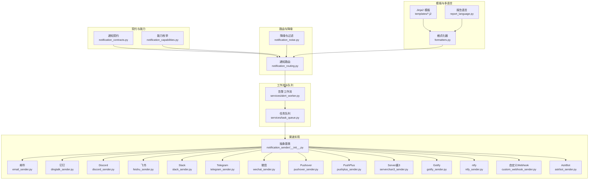
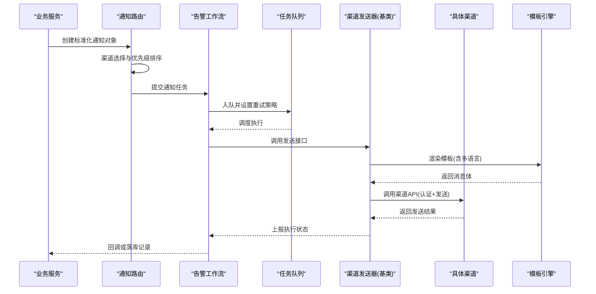
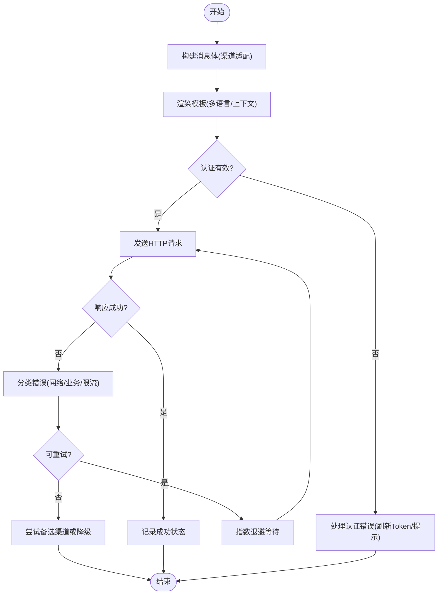
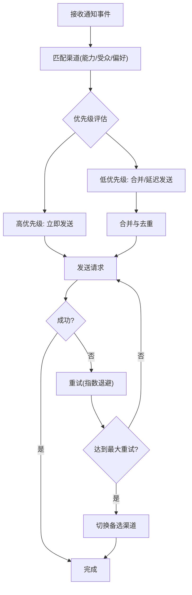
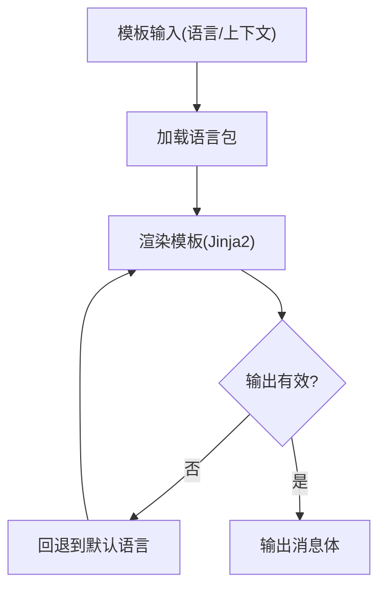
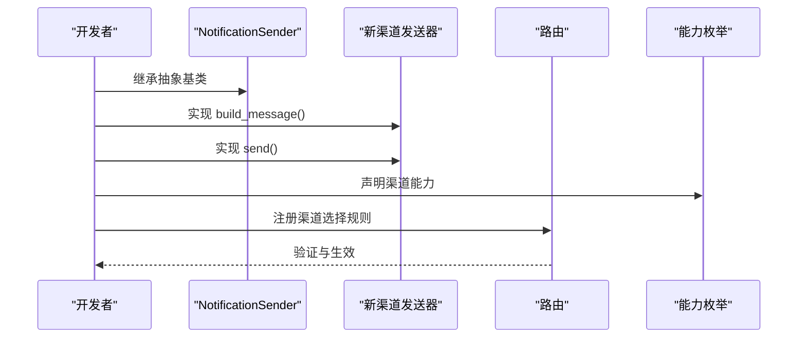
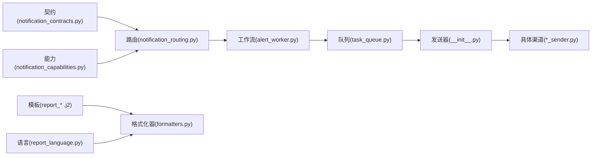

# 通知渠道扩展

<cite>
**本文档引用的文件**   
- [src/notification.py](file://src/notification.py)
- [src/notification_capabilities.py](file://src/notification_capabilities.py)
- [src/notification_contracts.py](file://src/notification_contracts.py)
- [src/notification_noise.py](file://src/notification_noise.py)
- [src/notification_routing.py](file://src/notification_routing.py)
- [src/services/alert_worker.py](file://src/services/alert_worker.py)
- [src/services/task_queue.py](file://src/services/task_queue.py)
- [src/report_language.py](file://src/report_language.py)
- [src/formatters.py](file://src/formatters.py)
- [src/notification_sender/__init__.py](file://src/notification_sender/__init__.py)
- [src/notification_sender/email_sender.py](file://src/notification_sender/email_sender.py)
- [src/notification_sender/dingtalk_sender.py](file://src/notification_sender/dingtalk_sender.py)
- [src/notification_sender/discord_sender.py](file://src/notification_sender/discord_sender.py)
- [src/notification_sender/feishu_sender.py](file://src/notification_sender/feishu_sender.py)
- [src/notification_sender/slack_sender.py](file://src/notification_sender/slack_sender.py)
- [src/notification_sender/telegram_sender.py](file://src/notification_sender/telegram_sender.py)
- [src/notification_sender/wechat_sender.py](file://src/notification_sender/wechat_sender.py)
- [src/notification_sender/pushover_sender.py](file://src/notification_sender/pushover_sender.py)
- [src/notification_sender/pushplus_sender.py](file://src/notification_sender/pushplus_sender.py)
- [src/notification_sender/serverchan3_sender.py](file://src/notification_sender/serverchan3_sender.py)
- [src/notification_sender/gotify_sender.py](file://src/notification_sender/gotify_sender.py)
- [src/notification_sender/ntfy_sender.py](file://src/notification_sender/ntfy_sender.py)
- [src/notification_sender/custom_webhook_sender.py](file://src/notification_sender/custom_webhook_sender.py)
- [src/notification_sender/astrbot_sender.py](file://src/notification_sender/astrbot_sender.py)
- [tests/test_notification.py](file://tests/test_notification.py)
- [tests/test_notification_routing.py](file://tests/test_notification_routing.py)
- [tests/test_notification_sender.py](file://tests/test_notification_sender.py)
- [templates/report_markdown.j2](file://templates/report_markdown.j2)
- [templates/report_brief.j2](file://templates/report_brief.j2)
- [templates/report_wechat.j2](file://templates/report_wechat.j2)
</cite>

## 目录
1. [简介](#简介)
2. [项目结构](#项目结构)
3. [核心组件](#核心组件)
4. [架构总览](#架构总览)
5. [详细组件分析](#详细组件分析)
6. [依赖关系分析](#依赖关系分析)
7. [性能考虑](#性能考虑)
8. [故障排查指南](#故障排查指南)
9. [结论](#结论)
10. [附录](#附录)

## 简介
本文件面向“通知渠道扩展”主题，系统性阐述通知系统的抽象基类、消息发送与模板渲染机制、错误处理策略、路由与重试、多语言模板支持，以及新增渠道的完整开发流程。文档同时提供常见渠道（邮件、短信、即时通讯）的实现要点与测试、监控集成建议，帮助开发者快速扩展新的通知渠道并保持系统稳定与可观测性。

## 项目结构
通知子系统由“契约与能力定义”“路由与降噪”“工作流与队列”“具体渠道实现”“模板与多语言”等模块组成：
- 契约与能力：定义统一的通知数据结构、能力枚举与校验约束
- 路由与降噪：根据规则选择渠道、管理优先级与去重降噪
- 工作流与队列：异步任务调度、失败重试与结果回写
- 渠道实现：各渠道的具体发送器，遵循统一接口
- 模板与多语言：Jinja2 模板与报告语言切换

**图表来源** 
- [src/notification_contracts.py](file://src/notification_contracts.py)
- [src/notification_capabilities.py](file://src/notification_capabilities.py)
- [src/notification_routing.py](file://src/notification_routing.py)
- [src/notification_noise.py](file://src/notification_noise.py)
- [src/services/alert_worker.py](file://src/services/alert_worker.py)
- [src/services/task_queue.py](file://src/services/task_queue.py)
- [src/notification_sender/__init__.py](file://src/notification_sender/__init__.py)
- [src/notification_sender/email_sender.py](file://src/notification_sender/email_sender.py)
- [src/notification_sender/dingtalk_sender.py](file://src/notification_sender/dingtalk_sender.py)
- [src/notification_sender/discord_sender.py](file://src/notification_sender/discord_sender.py)
- [src/notification_sender/feishu_sender.py](file://src/notification_sender/feishu_sender.py)
- [src/notification_sender/slack_sender.py](file://src/notification_sender/slack_sender.py)
- [src/notification_sender/telegram_sender.py](file://src/notification_sender/telegram_sender.py)
- [src/notification_sender/wechat_sender.py](file://src/notification_sender/wechat_sender.py)
- [src/notification_sender/pushover_sender.py](file://src/notification_sender/pushover_sender.py)
- [src/notification_sender/pushplus_sender.py](file://src/notification_sender/pushplus_sender.py)
- [src/notification_sender/serverchan3_sender.py](file://src/notification_sender/serverchan3_sender.py)
- [src/notification_sender/gotify_sender.py](file://src/notification_sender/gotify_sender.py)
- [src/notification_sender/ntfy_sender.py](file://src/notification_sender/ntfy_sender.py)
- [src/notification_sender/custom_webhook_sender.py](file://src/notification_sender/custom_webhook_sender.py)
- [src/notification_sender/astrbot_sender.py](file://src/notification_sender/astrbot_sender.py)
- [src/report_language.py](file://src/report_language.py)
- [src/formatters.py](file://src/formatters.py)
- [templates/report_markdown.j2](file://templates/report_markdown.j2)
- [templates/report_brief.j2](file://templates/report_brief.j2)
- [templates/report_wechat.j2](file://templates/report_wechat.j2)

**章节来源**
- [src/notification_contracts.py](file://src/notification_contracts.py)
- [src/notification_capabilities.py](file://src/notification_capabilities.py)
- [src/notification_routing.py](file://src/notification_routing.py)
- [src/notification_noise.py](file://src/notification_noise.py)
- [src/services/alert_worker.py](file://src/services/alert_worker.py)
- [src/services/task_queue.py](file://src/services/task_queue.py)
- [src/report_language.py](file://src/report_language.py)
- [src/formatters.py](file://src/formatters.py)
- [src/notification_sender/__init__.py](file://src/notification_sender/__init__.py)

## 核心组件
- 通知契约与能力
  - 统一的数据模型与字段约束，确保不同渠道对同一通知语义一致
  - 能力枚举用于声明渠道是否支持富文本、图片、附件、Markdown、链接预览等
- 路由与降噪
  - 基于规则与优先级的渠道选择，支持按事件类型、严重级别、目标受众进行分流
  - 去重、合并与限流，避免风暴式通知
- 工作流与队列
  - 将通知任务入队，异步执行，支持失败重试与退避策略
  - 记录执行状态与结果，便于追踪与审计
- 模板与多语言
  - 使用 Jinja2 模板渲染不同渠道的消息体
  - 通过报告语言配置切换文案与格式，保证国际化一致性

**章节来源**
- [src/notification_contracts.py](file://src/notification_contracts.py)
- [src/notification_capabilities.py](file://src/notification_capabilities.py)
- [src/notification_routing.py](file://src/notification_routing.py)
- [src/notification_noise.py](file://src/notification_noise.py)
- [src/services/alert_worker.py](file://src/services/alert_worker.py)
- [src/services/task_queue.py](file://src/services/task_queue.py)
- [src/report_language.py](file://src/report_language.py)
- [src/formatters.py](file://src/formatters.py)

## 架构总览
通知系统采用“契约驱动 + 路由分发 + 异步执行 + 模板渲染”的分层架构。上层服务生成标准化通知对象，经路由与降噪后分发给具体渠道；渠道实现遵循统一基类接口，负责认证、格式化与发送；模板与多语言在渲染阶段注入上下文，输出最终消息体。

**图表来源** 
- [src/notification_routing.py](file://src/notification_routing.py)
- [src/services/alert_worker.py](file://src/services/alert_worker.py)
- [src/services/task_queue.py](file://src/services/task_queue.py)
- [src/notification_sender/__init__.py](file://src/notification_sender/__init__.py)
- [src/formatters.py](file://src/formatters.py)
- [src/report_language.py](file://src/report_language.py)

## 详细组件分析

### 抽象基类 NotificationSender
- 设计目标
  - 统一所有渠道的发送接口，屏蔽差异化的认证、请求构造与响应解析
  - 提供模板渲染入口、错误封装与日志埋点
- 关键职责
  - 初始化与配置加载（如 API Key、Token、URL、超时等）
  - 构建请求参数与签名（若需要）
  - 调用渠道 API 并处理 HTTP 错误码
  - 统一异常类型与重试判定
  - 模板渲染钩子（允许子类覆盖）
- 扩展点
  - 子类只需实现“构建消息体”和“发送请求”两个核心方法
  - 可通过能力枚举声明支持的特性（富文本、图片、附件等）

```mermaid
classDiagram
class NotificationSender {
+initialize(config)
+build_message(context, template_vars)
+send(message, targets)
+handle_error(exception)
+supports(capability) bool
+retryable(error_code) bool
}
class EmailSender {
+build_message(context, template_vars)
+send(message, targets)
}
class DingTalkSender {
+build_message(context, template_vars)
+send(message, targets)
}
class DiscordSender {
+build_message(context, template_vars)
+send(message, targets)
}
class FeishuSender {
+build_message(context, template_vars)
+send(message, targets)
}
class SlackSender {
+build_message(context, template_vars)
+send(message, targets)
}
class TelegramSender {
+build_message(context, template_vars)
+send(message, targets)
}
class WechatSender {
+build_message(context, template_vars)
+send(message, targets)
}
class PushoverSender {
+build_message(context, template_vars)
+send(message, targets)
}
class PushplusSender {
+build_message(context, template_vars)
+send(message, targets)
}
class Serverchan3Sender {
+build_message(context, template_vars)
+send(message, targets)
}
class GotifySender {
+build_message(context, template_vars)
+send(message, targets)
}
class NtfySender {
+build_message(context, template_vars)
+send(message, targets)
}
class CustomWebhookSender {
+build_message(context, template_vars)
+send(message, targets)
}
class AstrbotSender {
+build_message(context, template_vars)
+send(message, targets)
}
NotificationSender <|-- EmailSender
NotificationSender <|-- DingTalkSender
NotificationSender <|-- DiscordSender
NotificationSender <|-- FeishuSender
NotificationSender <|-- SlackSender
NotificationSender <|-- TelegramSender
NotificationSender <|-- WechatSender
NotificationSender <|-- PushoverSender
NotificationSender <|-- PushplusSender
NotificationSender <|-- Serverchan3Sender
NotificationSender <|-- GotifySender
NotificationSender <|-- NtfySender
NotificationSender <|-- CustomWebhookSender
NotificationSender <|-- AstrbotSender
```

**图表来源** 
- [src/notification_sender/__init__.py](file://src/notification_sender/__init__.py)
- [src/notification_sender/email_sender.py](file://src/notification_sender/email_sender.py)
- [src/notification_sender/dingtalk_sender.py](file://src/notification_sender/dingtalk_sender.py)
- [src/notification_sender/discord_sender.py](file://src/notification_sender/discord_sender.py)
- [src/notification_sender/feishu_sender.py](file://src/notification_sender/feishu_sender.py)
- [src/notification_sender/slack_sender.py](file://src/notification_sender/slack_sender.py)
- [src/notification_sender/telegram_sender.py](file://src/notification_sender/telegram_sender.py)
- [src/notification_sender/wechat_sender.py](file://src/notification_sender/wechat_sender.py)
- [src/notification_sender/pushover_sender.py](file://src/notification_sender/pushover_sender.py)
- [src/notification_sender/pushplus_sender.py](file://src/notification_sender/pushplus_sender.py)
- [src/notification_sender/serverchan3_sender.py](file://src/notification_sender/serverchan3_sender.py)
- [src/notification_sender/gotify_sender.py](file://src/notification_sender/gotify_sender.py)
- [src/notification_sender/ntfy_sender.py](file://src/notification_sender/ntfy_sender.py)
- [src/notification_sender/custom_webhook_sender.py](file://src/notification_sender/custom_webhook_sender.py)
- [src/notification_sender/astrbot_sender.py](file://src/notification_sender/astrbot_sender.py)

**章节来源**
- [src/notification_sender/__init__.py](file://src/notification_sender/__init__.py)
- [src/notification_sender/email_sender.py](file://src/notification_sender/email_sender.py)
- [src/notification_sender/dingtalk_sender.py](file://src/notification_sender/dingtalk_sender.py)
- [src/notification_sender/discord_sender.py](file://src/notification_sender/discord_sender.py)
- [src/notification_sender/feishu_sender.py](file://src/notification_sender/feishu_sender.py)
- [src/notification_sender/slack_sender.py](file://src/notification_sender/slack_sender.py)
- [src/notification_sender/telegram_sender.py](file://src/notification_sender/telegram_sender.py)
- [src/notification_sender/wechat_sender.py](file://src/notification_sender/wechat_sender.py)
- [src/notification_sender/pushover_sender.py](file://src/notification_sender/pushover_sender.py)
- [src/notification_sender/pushplus_sender.py](file://src/notification_sender/pushplus_sender.py)
- [src/notification_sender/serverchan3_sender.py](file://src/notification_sender/serverchan3_sender.py)
- [src/notification_sender/gotify_sender.py](file://src/notification_sender/gotify_sender.py)
- [src/notification_sender/ntfy_sender.py](file://src/notification_sender/ntfy_sender.py)
- [src/notification_sender/custom_webhook_sender.py](file://src/notification_sender/custom_webhook_sender.py)
- [src/notification_sender/astrbot_sender.py](file://src/notification_sender/astrbot_sender.py)

### 消息发送、模板渲染与错误处理
- 消息发送流程
  - 路由选择目标渠道后，工作流将任务入队并触发发送器
  - 发送器根据渠道特性构建请求体，必要时附加签名或鉴权头
  - 发送完成后记录成功/失败状态，并写入审计日志
- 模板渲染
  - 使用 Jinja2 模板引擎，结合报告语言与上下文变量渲染消息体
  - 支持 Markdown、富文本、图片与附件等不同渠道的差异化渲染
- 错误处理
  - 统一异常封装，区分网络错误、认证失败、业务拒绝等
  - 重试策略：指数退避、最大重试次数、死信队列归档
  - 降级策略：当某渠道不可用时自动切换到备选渠道

**图表来源** 
- [src/formatters.py](file://src/formatters.py)
- [src/report_language.py](file://src/report_language.py)
- [src/notification_sender/__init__.py](file://src/notification_sender/__init__.py)
- [src/services/alert_worker.py](file://src/services/alert_worker.py)

**章节来源**
- [src/formatters.py](file://src/formatters.py)
- [src/report_language.py](file://src/report_language.py)
- [src/notification_sender/__init__.py](file://src/notification_sender/__init__.py)
- [src/services/alert_worker.py](file://src/services/alert_worker.py)

### 通知路由机制：渠道选择、优先级管理与失败重试
- 渠道选择
  - 基于事件类型、严重级别、目标受众与渠道能力进行匹配
  - 支持白名单/黑名单与用户偏好配置
- 优先级管理
  - 高优先级通道优先占用资源，低优先级通道批量合并
  - 支持按时间窗口合并与去重，降低噪音
- 失败重试
  - 可配置的重试次数与退避策略
  - 失败时自动切换备选渠道，保障送达率

**图表来源** 
- [src/notification_routing.py](file://src/notification_routing.py)
- [src/notification_noise.py](file://src/notification_noise.py)
- [src/services/alert_worker.py](file://src/services/alert_worker.py)

**章节来源**
- [src/notification_routing.py](file://src/notification_routing.py)
- [src/notification_noise.py](file://src/notification_noise.py)
- [src/services/alert_worker.py](file://src/services/alert_worker.py)

### 通知模板系统与多语言支持
- 模板系统
  - 使用 Jinja2 模板，支持 Markdown、HTML、富文本等格式
  - 模板变量包含标题、正文、图片、附件、链接等
- 多语言支持
  - 通过报告语言配置切换文案与格式
  - 模板中可使用语言包键值替换，保证国际化一致性

**图表来源** 
- [src/report_language.py](file://src/report_language.py)
- [src/formatters.py](file://src/formatters.py)
- [templates/report_markdown.j2](file://templates/report_markdown.j2)
- [templates/report_brief.j2](file://templates/report_brief.j2)
- [templates/report_wechat.j2](file://templates/report_wechat.j2)

**章节来源**
- [src/report_language.py](file://src/report_language.py)
- [src/formatters.py](file://src/formatters.py)
- [templates/report_markdown.j2](file://templates/report_markdown.j2)
- [templates/report_brief.j2](file://templates/report_brief.j2)
- [templates/report_wechat.j2](file://templates/report_wechat.j2)

### 如何扩展新的通知渠道
- 步骤概览
  - 新建渠道发送器类，继承抽象基类
  - 实现“构建消息体”和“发送请求”两个核心方法
  - 声明渠道能力（富文本、图片、附件等）
  - 配置认证信息（API Key、Token、URL、超时等）
  - 注册渠道到路由与能力枚举
- 最佳实践
  - 统一异常封装与重试判定
  - 增加单元测试与集成测试
  - 接入监控指标（成功率、延迟、错误分类）

**图表来源** 
- [src/notification_sender/__init__.py](file://src/notification_sender/__init__.py)
- [src/notification_capabilities.py](file://src/notification_capabilities.py)
- [src/notification_routing.py](file://src/notification_routing.py)

**章节来源**
- [src/notification_sender/__init__.py](file://src/notification_sender/__init__.py)
- [src/notification_capabilities.py](file://src/notification_capabilities.py)
- [src/notification_routing.py](file://src/notification_routing.py)

### 常见通知渠道实现示例
- 邮件（Email）
  - 特点：支持 HTML/纯文本、附件、抄送/密送
  - 认证：SMTP 服务器与账号密码或 OAuth
  - 模板：Markdown/HTML 模板，支持图片与附件
- 短信（SMS）
  - 特点：短文本、到达率高、成本敏感
  - 认证：API Key 或 Token
  - 模板：纯文本为主，注意字符集与长度限制
- 即时通讯（DingTalk/Feishu/Slack/Telegram/WeChat/Discord/Pushover/PushPlus/Server酱3/Gotify/ntfy/AstrBot）
  - 特点：富文本、卡片、图片、按钮、链接预览
  - 认证：Token、Secret、Webhook URL
  - 模板：Markdown/JSON Payload，支持多媒体

**章节来源**
- [src/notification_sender/email_sender.py](file://src/notification_sender/email_sender.py)
- [src/notification_sender/dingtalk_sender.py](file://src/notification_sender/dingtalk_sender.py)
- [src/notification_sender/feishu_sender.py](file://src/notification_sender/feishu_sender.py)
- [src/notification_sender/slack_sender.py](file://src/notification_sender/slack_sender.py)
- [src/notification_sender/telegram_sender.py](file://src/notification_sender/telegram_sender.py)
- [src/notification_sender/wechat_sender.py](file://src/notification_sender/wechat_sender.py)
- [src/notification_sender/discord_sender.py](file://src/notification_sender/discord_sender.py)
- [src/notification_sender/pushover_sender.py](file://src/notification_sender/pushover_sender.py)
- [src/notification_sender/pushplus_sender.py](file://src/notification_sender/pushplus_sender.py)
- [src/notification_sender/serverchan3_sender.py](file://src/notification_sender/serverchan3_sender.py)
- [src/notification_sender/gotify_sender.py](file://src/notification_sender/gotify_sender.py)
- [src/notification_sender/ntfy_sender.py](file://src/notification_sender/ntfy_sender.py)
- [src/notification_sender/astrbot_sender.py](file://src/notification_sender/astrbot_sender.py)

## 依赖关系分析
- 内部依赖
  - 路由依赖契约与能力定义，确保渠道选择正确
  - 工作流依赖队列与发送器，实现异步与重试
  - 模板与多语言依赖格式化器与语言包
- 外部依赖
  - 各渠道的 HTTP API、SDK 或第三方服务
  - 存储与日志系统用于审计与监控

**图表来源** 
- [src/notification_contracts.py](file://src/notification_contracts.py)
- [src/notification_capabilities.py](file://src/notification_capabilities.py)
- [src/notification_routing.py](file://src/notification_routing.py)
- [src/services/alert_worker.py](file://src/services/alert_worker.py)
- [src/services/task_queue.py](file://src/services/task_queue.py)
- [src/notification_sender/__init__.py](file://src/notification_sender/__init__.py)
- [src/formatters.py](file://src/formatters.py)
- [src/report_language.py](file://src/report_language.py)
- [templates/report_markdown.j2](file://templates/report_markdown.j2)
- [templates/report_brief.j2](file://templates/report_brief.j2)
- [templates/report_wechat.j2](file://templates/report_wechat.j2)

**章节来源**
- [src/notification_contracts.py](file://src/notification_contracts.py)
- [src/notification_capabilities.py](file://src/notification_capabilities.py)
- [src/notification_routing.py](file://src/notification_routing.py)
- [src/services/alert_worker.py](file://src/services/alert_worker.py)
- [src/services/task_queue.py](file://src/services/task_queue.py)
- [src/notification_sender/__init__.py](file://src/notification_sender/__init__.py)
- [src/formatters.py](file://src/formatters.py)
- [src/report_language.py](file://src/report_language.py)
- [templates/report_markdown.j2](file://templates/report_markdown.j2)
- [templates/report_brief.j2](file://templates/report_brief.j2)
- [templates/report_wechat.j2](file://templates/report_wechat.j2)

## 性能考虑
- 并发与队列
  - 使用任务队列解耦生产与消费，提升吞吐
  - 合理设置并发度与队列长度，避免内存溢出
- 模板渲染
  - 预编译常用模板，减少运行时开销
  - 控制模板变量大小，避免大对象序列化
- 网络与重试
  - 设置合理的超时与重试上限，避免雪崩
  - 使用连接池与复用连接，降低握手开销
- 降噪与合并
  - 对低优先级通知进行合并与去重，减少带宽与成本

[本节为通用指导，不直接分析具体文件]

## 故障排查指南
- 常见问题
  - 认证失败：检查 Token/Key 有效期与权限范围
  - 模板渲染错误：确认模板语法与变量完整性
  - 渠道限流：调整发送频率与重试策略
  - 网络超时：检查代理、防火墙与 DNS
- 诊断工具
  - 查看工作流日志与队列状态
  - 启用调试模式，捕获请求与响应
  - 使用测试用例模拟渠道行为

**章节来源**
- [src/services/alert_worker.py](file://src/services/alert_worker.py)
- [src/services/task_queue.py](file://src/services/task_queue.py)
- [src/formatters.py](file://src/formatters.py)
- [src/report_language.py](file://src/report_language.py)

## 结论
通知渠道扩展机制以统一的抽象基类为核心，配合契约、能力、路由、降噪与工作流，形成可扩展、可观测、高可用的通知体系。通过模板与多语言支持，满足不同渠道与地区的个性化需求。开发者只需关注渠道特定的消息构建与发送逻辑，即可快速集成新的通知渠道。

[本节为总结，不直接分析具体文件]

## 附录
- 测试方法
  - 单元测试：模拟渠道 API 响应，验证消息构建与错误处理
  - 集成测试：对接真实渠道沙箱环境，端到端验证
  - 回归测试：覆盖模板变更与语言包更新
- 监控集成
  - 指标：成功率、延迟、错误分类、重试次数
  - 日志：请求/响应、异常堆栈、渠道状态
  - 告警：阈值触发与自动恢复

**章节来源**
- [tests/test_notification.py](file://tests/test_notification.py)
- [tests/test_notification_routing.py](file://tests/test_notification_routing.py)
- [tests/test_notification_sender.py](file://tests/test_notification_sender.py)