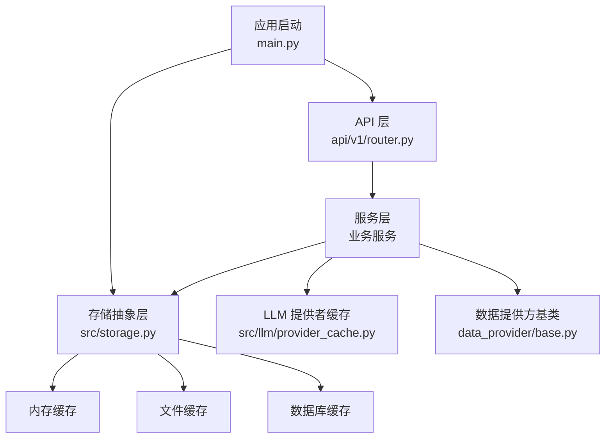
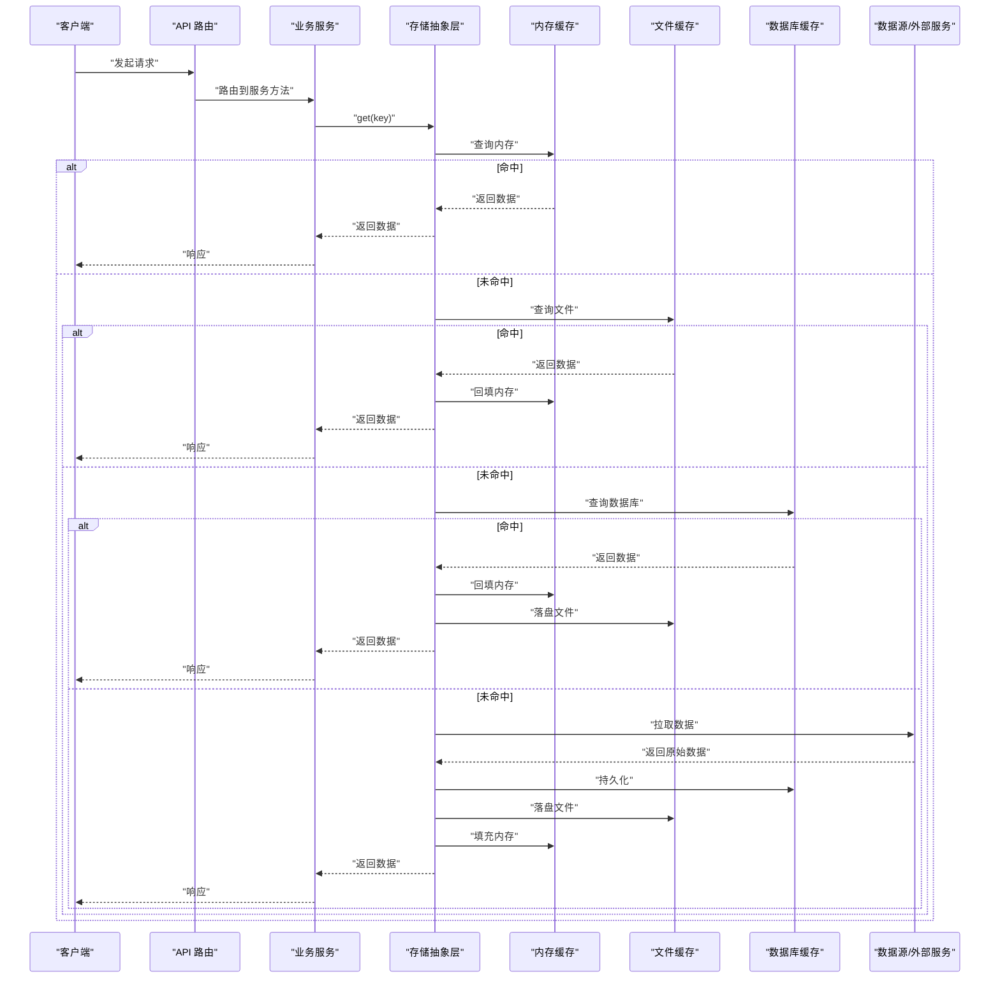
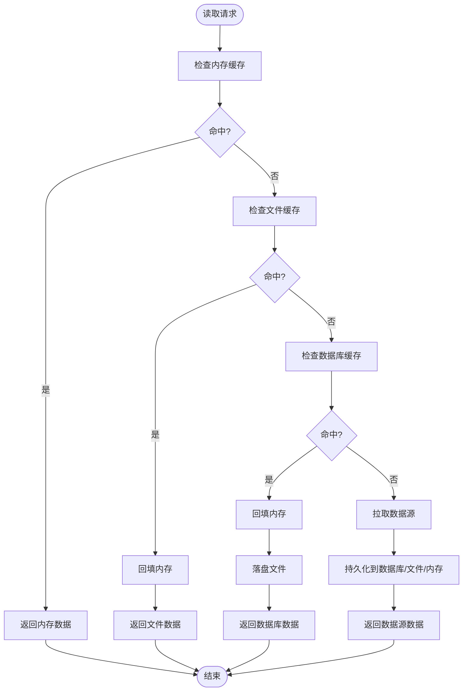
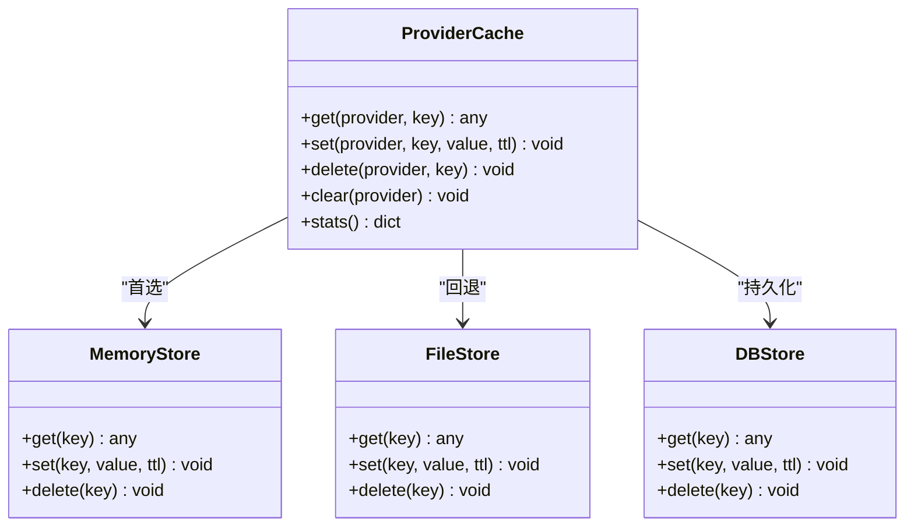
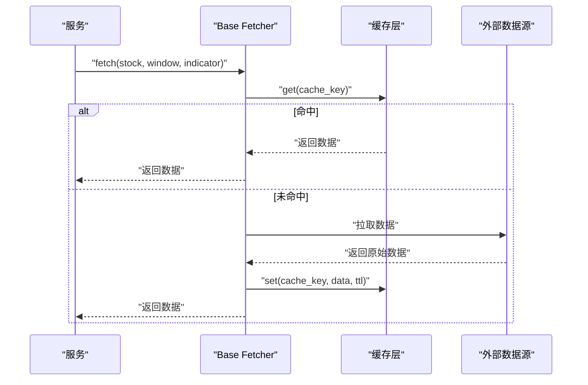
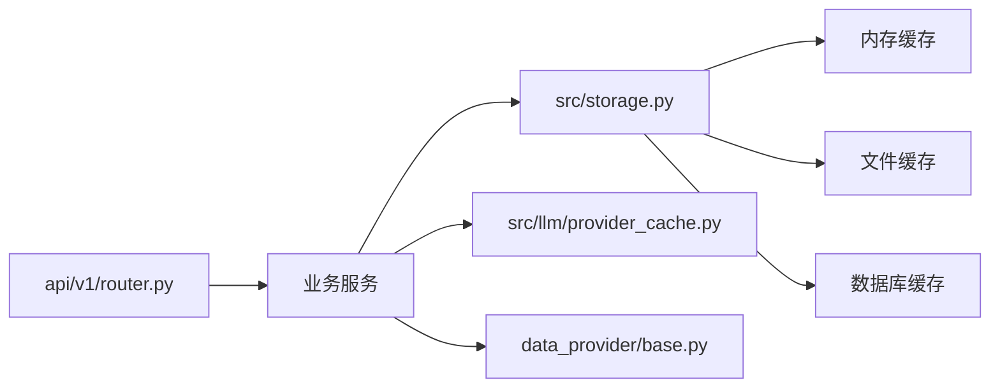

# 多级缓存策略

<cite>
**本文引用的文件**   
- [src/storage.py](file://src/storage.py)
- [src/config.py](file://src/config.py)
- [src/llm/provider_cache.py](file://src/llm/provider_cache.py)
- [data_provider/base.py](file://data_provider/base.py)
- [api/v1/router.py](file://api/v1/router.py)
- [main.py](file://main.py)
</cite>

## 目录
1. [简介](#简介)
2. [项目结构](#项目结构)
3. [核心组件](#核心组件)
4. [架构总览](#架构总览)
5. [详细组件分析](#详细组件分析)
6. [依赖关系分析](#依赖关系分析)
7. [性能考量](#性能考量)
8. [故障排查指南](#故障排查指南)
9. [结论](#结论)
10. [附录](#附录)

## 简介
本文件面向“多级缓存策略”的设计与实现，围绕内存缓存、文件缓存与数据库缓存的协同机制展开。文档从系统架构、数据流、失效策略、监控优化、配置说明与自定义后端实现等维度进行系统化阐述，帮助读者在复杂业务场景下构建高可用、高性能且可观测的缓存体系。

## 项目结构
本项目采用分层组织：API 层暴露接口，服务层编排业务逻辑，存储层抽象缓存与持久化能力，LLM 模块提供独立的提供者缓存，数据提供方（Fetcher）负责外部数据获取。缓存相关的关键位置包括：
- 存储抽象与多后端适配：src/storage.py
- 全局配置与开关：src/config.py
- LLM 提供者缓存：src/llm/provider_cache.py
- 数据提供方基类（可扩展缓存）：data_provider/base.py
- API 路由入口（便于接入缓存中间件或装饰器）：api/v1/router.py
- 应用启动入口（初始化顺序与生命周期）：main.py

图表来源 
- [api/v1/router.py](file://api/v1/router.py)
- [src/storage.py](file://src/storage.py)
- [src/llm/provider_cache.py](file://src/llm/provider_cache.py)
- [data_provider/base.py](file://data_provider/base.py)
- [main.py](file://main.py)

章节来源
- [api/v1/router.py](file://api/v1/router.py)
- [src/storage.py](file://src/storage.py)
- [src/llm/provider_cache.py](file://src/llm/provider_cache.py)
- [data_provider/base.py](file://data_provider/base.py)
- [main.py](file://main.py)

## 核心组件
- 存储抽象层（Storage）
  - 职责：统一封装读/写/删除/存在性检查等操作，屏蔽底层差异（内存、文件、数据库）。
  - 关键能力：键空间隔离、序列化/反序列化、TTL 管理、错误重试与降级。
- LLM 提供者缓存（Provider Cache）
  - 职责：缓存模型调用结果或元数据，降低重复请求成本。
  - 关键能力：按提供者维度隔离、命中率统计、过期策略与并发安全。
- 数据提供方基类（Base Fetcher）
  - 职责：定义数据拉取流程，支持在读取路径上挂载缓存层。
  - 关键能力：缓存键生成、冷热数据分层、失败回退到直连。
- 配置中心（Config）
  - 职责：集中管理缓存开关、容量限制、TTL、一致性级别、监控开关等。
  - 关键能力：环境变量覆盖、运行时热更新、校验与默认值。

章节来源
- [src/storage.py](file://src/storage.py)
- [src/llm/provider_cache.py](file://src/llm/provider_cache.py)
- [data_provider/base.py](file://data_provider/base.py)
- [src/config.py](file://src/config.py)

## 架构总览
下图展示了典型的多级缓存读取与写入流程，以及各层级之间的协作关系。

图表来源 
- [src/storage.py](file://src/storage.py)
- [src/llm/provider_cache.py](file://src/llm/provider_cache.py)
- [data_provider/base.py](file://data_provider/base.py)

## 详细组件分析

### 存储抽象层（Storage）
- 设计要点
  - 统一接口：read/write/delete/exists/get_ttl/set_ttl 等。
  - 多级回退：内存 → 文件 → 数据库 → 数据源。
  - 序列化：支持 JSON/MessagePack 等格式，兼容不同后端。
  - 并发安全：读写锁、分段锁或无锁结构（视后端而定）。
  - 错误处理：超时、IO 异常、序列化异常的捕获与降级。
- 性能特征
  - 内存：O(1) 访问，极低延迟。
  - 文件：中等延迟，适合冷数据与批量恢复。
  - 数据库：较高延迟，强一致性与持久化保障。
- 失效策略
  - TTL：基于时间戳或相对过期时间。
  - 主动失效：按 key 或前缀批量删除。
  - 被动清理：LRU/LFU 淘汰、定期扫描过期键。
- 监控指标
  - 命中率、平均延迟、P95/P99 延迟、内存占用、磁盘 IO、数据库连接池状态。

图表来源 
- [src/storage.py](file://src/storage.py)

章节来源
- [src/storage.py](file://src/storage.py)

### LLM 提供者缓存（Provider Cache）
- 设计要点
  - 按提供者维度隔离键空间，避免跨提供者污染。
  - 缓存内容可为：模型输出摘要、提示模板渲染结果、调用参数指纹。
  - 支持热点键优先、权重衰减与动态 TTL。
- 失效策略
  - 模型版本变更触发全量或增量失效。
  - 提示词模板更新触发对应键失效。
  - 频率控制：高频短 TTL，低频长 TTL。
- 监控指标
  - 命中率、缓存大小、过期率、提供者维度分布。

图表来源 
- [src/llm/provider_cache.py](file://src/llm/provider_cache.py)

章节来源
- [src/llm/provider_cache.py](file://src/llm/provider_cache.py)

### 数据提供方基类（Base Fetcher）
- 设计要点
  - 定义统一的 fetch 接口与缓存钩子。
  - 支持缓存键生成规则（如股票代码+时间窗口+指标类型）。
  - 失败回退：缓存不可用时直接拉取数据源。
- 失效策略
  - 数据新鲜度：按时间窗口或事件驱动失效。
  - 冲突解决：写扩散或读扩散策略选择。
- 监控指标
  - 缓存命中率、外部调用次数、失败率、延迟分布。

图表来源 
- [data_provider/base.py](file://data_provider/base.py)

章节来源
- [data_provider/base.py](file://data_provider/base.py)

### 配置中心（Config）
- 设计要点
  - 集中管理缓存开关、容量上限、TTL 默认值、一致性级别、监控开关。
  - 支持环境变量覆盖与运行时热更新。
  - 提供校验与默认值，确保配置健壮性。
- 关键项示例
  - 缓存启用标志、各级别 TTL、最大条目数、淘汰策略、序列化格式、监控上报间隔。

章节来源
- [src/config.py](file://src/config.py)

## 依赖关系分析
- 组件耦合
  - API 路由依赖服务层；服务层依赖存储抽象与 LLM 缓存；存储抽象依赖具体后端（内存/文件/数据库）。
- 外部依赖
  - 文件系统、数据库连接池、网络请求库（用于数据源拉取）。
- 潜在循环依赖
  - 通过接口解耦避免循环引用，例如存储抽象与具体后端分离。

图表来源 
- [api/v1/router.py](file://api/v1/router.py)
- [src/storage.py](file://src/storage.py)
- [src/llm/provider_cache.py](file://src/llm/provider_cache.py)
- [data_provider/base.py](file://data_provider/base.py)

章节来源
- [api/v1/router.py](file://api/v1/router.py)
- [src/storage.py](file://src/storage.py)
- [src/llm/provider_cache.py](file://src/llm/provider_cache.py)
- [data_provider/base.py](file://data_provider/base.py)

## 性能考量
- 缓存命中率优化
  - 热点键识别与预热、分片与局部淘汰、合理 TTL 设置。
- 内存使用优化
  - 对象池复用、压缩序列化、软引用与弱引用策略。
- 分布式缓存同步
  - 发布订阅或消息队列广播失效事件，保证多实例一致性。
- 监控与告警
  - 采集命中率、延迟分位、内存/磁盘占用、错误率，设置阈值告警。

[本节为通用指导，不直接分析具体文件]

## 故障排查指南
- 常见问题
  - 缓存穿透：空值缓存、布隆过滤器前置校验。
  - 缓存雪崩：随机化 TTL、限流与熔断。
  - 缓存不一致：读写策略选择（先写后删/先删后写）、版本号或时间戳比较。
- 诊断步骤
  - 检查配置是否生效、监控指标是否异常、日志中是否有超时或序列化错误。
  - 验证键空间隔离与 TTL 设置是否符合预期。
- 恢复策略
  - 快速回滚配置、清空问题键、重启缓存服务、重建索引或快照。

章节来源
- [src/storage.py](file://src/storage.py)
- [src/config.py](file://src/config.py)

## 结论
多级缓存通过内存、文件与数据库的协同，兼顾了低延迟、高吞吐与强持久化的需求。合理的失效策略、完善的监控与优化手段是保障系统稳定性的关键。建议在业务初期明确一致性要求与访问模式，逐步引入更复杂的缓存策略与分布式同步机制。

[本节为总结性内容，不直接分析具体文件]

## 附录
- 自定义缓存后端实现指南
  - 接口规范：实现 read/write/delete/exists/get_ttl/set_ttl 等方法。
  - 序列化：确保与现有序列化格式兼容。
  - 错误处理：捕获并上报异常，支持降级与重试。
  - 测试：覆盖正常路径、边界条件与异常场景。
- 配置最佳实践
  - 分级 TTL：热点短 TTL，冷数据长 TTL。
  - 容量上限：防止内存溢出，结合淘汰策略。
  - 监控开关：生产环境开启详细指标与采样日志。

[本节为补充信息，不直接分析具体文件]