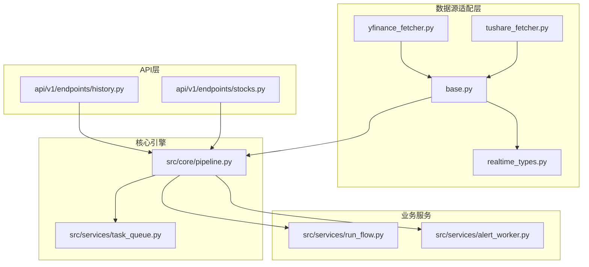
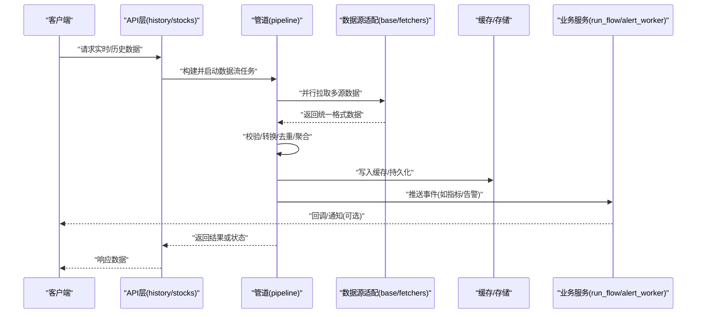
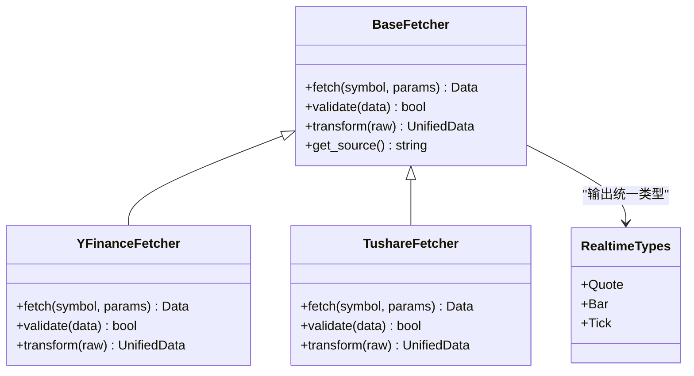
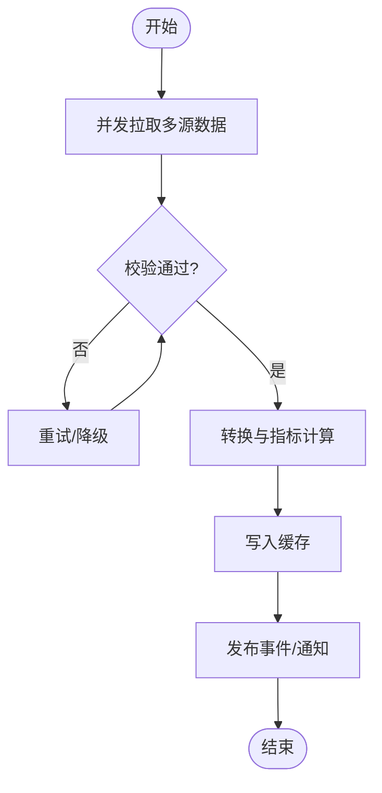
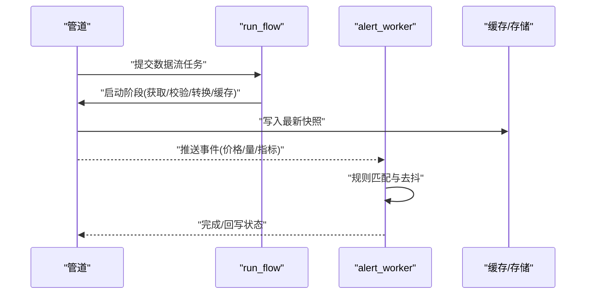
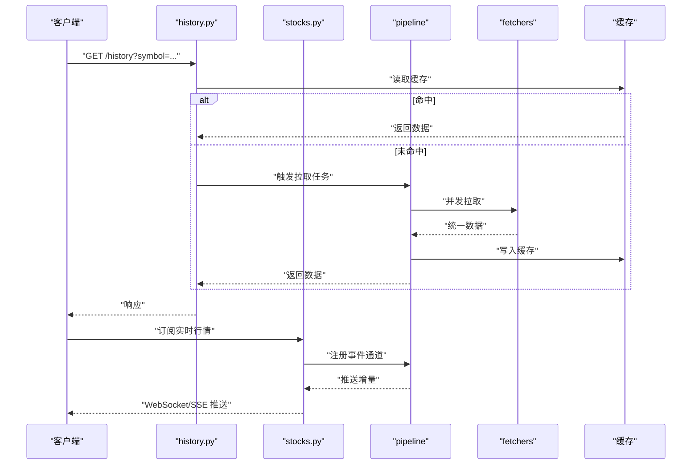
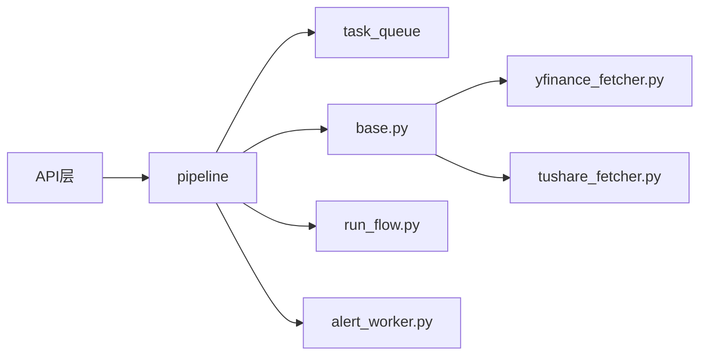

# 实时数据流处理

<cite>
**本文引用的文件**   
- [data_provider/base.py](file://data_provider/base.py)
- [data_provider/yfinance_fetcher.py](file://data_provider/yfinance_fetcher.py)
- [data_provider/tushare_fetcher.py](file://data_provider/tushare_fetcher.py)
- [data_provider/realtime_types.py](file://data_provider/realtime_types.py)
- [src/core/pipeline.py](file://src/core/pipeline.py)
- [src/services/task_queue.py](file://src/services/task_queue.py)
- [api/v1/endpoints/history.py](file://api/v1/endpoints/history.py)
- [api/v1/endpoints/stocks.py](file://api/v1/endpoints/stocks.py)
- [src/services/run_flow.py](file://src/services/run_flow.py)
- [src/services/alert_worker.py](file://src/services/alert_worker.py)
- [tests/test_pipeline_realtime_indicators.py](file://tests/test_pipeline_realtime_indicators.py)
- [tests/test_tushare_fetcher_http_client.py](file://tests/test_tushare_fetcher_http_client.py)
</cite>

## 目录
1. [简介](#简介)
2. [项目结构](#项目结构)
3. [核心组件](#核心组件)
4. [架构总览](#架构总览)
5. [详细组件分析](#详细组件分析)
6. [依赖关系分析](#依赖关系分析)
7. [性能考虑](#性能考虑)
8. [故障排查指南](#故障排查指南)
9. [结论](#结论)
10. [附录](#附录)

## 简介
本文件面向“实时数据流处理”主题，围绕多源股票数据的获取、校验、转换与缓存，系统化的管道架构设计（异步处理、错误处理与重试机制），以及统一适配层的设计进行说明。文档同时覆盖监控指标、性能优化策略与故障恢复机制，并提供集成新数据源与处理实时事件的具体示例路径，帮助读者快速理解并扩展系统能力。

## 项目结构
本项目采用分层与按功能域组织相结合的结构：
- data_provider：数据源适配层，封装不同数据源的获取逻辑与格式统一
- src/core：核心引擎与管道编排（pipeline）
- src/services：业务服务（任务队列、运行流程、告警等）
- api：对外接口（历史行情、实时行情、系统配置等）
- tests：覆盖关键路径的测试用例，用于验证实时指标、网络容错等

图表来源
- [data_provider/base.py](file://data_provider/base.py)
- [data_provider/yfinance_fetcher.py](file://data_provider/yfinance_fetcher.py)
- [data_provider/tushare_fetcher.py](file://data_provider/tushare_fetcher.py)
- [data_provider/realtime_types.py](file://data_provider/realtime_types.py)
- [src/core/pipeline.py](file://src/core/pipeline.py)
- [src/services/task_queue.py](file://src/services/task_queue.py)
- [src/services/run_flow.py](file://src/services/run_flow.py)
- [src/services/alert_worker.py](file://src/services/alert_worker.py)
- [api/v1/endpoints/history.py](file://api/v1/endpoints/history.py)
- [api/v1/endpoints/stocks.py](file://api/v1/endpoints/stocks.py)

章节来源
- [data_provider/base.py](file://data_provider/base.py)
- [src/core/pipeline.py](file://src/core/pipeline.py)
- [src/services/task_queue.py](file://src/services/task_queue.py)
- [api/v1/endpoints/history.py](file://api/v1/endpoints/history.py)
- [api/v1/endpoints/stocks.py](file://api/v1/endpoints/stocks.py)

## 核心组件
- 统一数据源抽象与适配器
  - 通过基类定义统一的拉取与转换接口，各具体 fetcher 实现差异化网络请求与解析，最终输出统一类型
  - 实时数据类型在 realtime_types 中统一定义，确保下游一致消费
- 管道编排与异步处理
  - pipeline 负责将“获取-校验-转换-缓存-分发”串联为可配置的阶段，支持并发与背压控制
  - task_queue 提供任务调度与重试、限流、熔断等能力
- 业务服务
  - run_flow 编排端到端的数据流任务（如拉取、计算指标、触发告警）
  - alert_worker 消费实时事件，执行告警规则与通知
- API 层
  - history 暴露历史数据查询接口
  - stocks 暴露实时行情与订阅相关接口

章节来源
- [data_provider/base.py](file://data_provider/base.py)
- [data_provider/realtime_types.py](file://data_provider/realtime_types.py)
- [src/core/pipeline.py](file://src/core/pipeline.py)
- [src/services/task_queue.py](file://src/services/task_queue.py)
- [src/services/run_flow.py](file://src/services/run_flow.py)
- [src/services/alert_worker.py](file://src/services/alert_worker.py)
- [api/v1/endpoints/history.py](file://api/v1/endpoints/history.py)
- [api/v1/endpoints/stocks.py](file://api/v1/endpoints/stocks.py)

## 架构总览
整体采用“多源适配 + 管道编排 + 服务化”的分层架构：
- 数据源适配层屏蔽差异，向上提供统一接口与统一数据结构
- 管道层以阶段化方式组织数据处理流程，内置异步、错误处理与重试
- 服务层承载业务编排与事件驱动（如告警）
- API 层作为入口，将外部请求映射到内部管道与服务

图表来源
- [api/v1/endpoints/history.py](file://api/v1/endpoints/history.py)
- [api/v1/endpoints/stocks.py](file://api/v1/endpoints/stocks.py)
- [src/core/pipeline.py](file://src/core/pipeline.py)
- [data_provider/base.py](file://data_provider/base.py)
- [src/services/run_flow.py](file://src/services/run_flow.py)
- [src/services/alert_worker.py](file://src/services/alert_worker.py)

## 详细组件分析

### 统一数据源适配层
- 设计要点
  - 基类定义统一方法：拉取、校验、转换、元数据标注（时间戳、代码、市场）
  - 各 fetcher 实现差异化网络访问与解析，最终转换为统一类型
  - 实时类型集中管理，保证上下游一致性
- 数据格式差异与统一
  - YFinance/Tushare 等不同源字段命名、单位、时区可能不一致，适配层负责归一化
  - 缺失值与异常值在转换阶段补齐或标记，避免污染下游

图表来源
- [data_provider/base.py](file://data_provider/base.py)
- [data_provider/yfinance_fetcher.py](file://data_provider/yfinance_fetcher.py)
- [data_provider/tushare_fetcher.py](file://data_provider/tushare_fetcher.py)
- [data_provider/realtime_types.py](file://data_provider/realtime_types.py)

章节来源
- [data_provider/base.py](file://data_provider/base.py)
- [data_provider/yfinance_fetcher.py](file://data_provider/yfinance_fetcher.py)
- [data_provider/tushare_fetcher.py](file://data_provider/tushare_fetcher.py)
- [data_provider/realtime_types.py](file://data_provider/realtime_types.py)

### 管道架构与异步处理
- 阶段划分
  - 获取阶段：并发调用多个 fetcher，合并结果
  - 校验阶段：字段完整性、范围检查、重复检测
  - 转换阶段：单位换算、时区对齐、指标计算
  - 缓存阶段：写入内存/磁盘缓存，设置过期策略
  - 分发阶段：推送至下游服务（如指标计算、告警）
- 异步与并发
  - 使用异步 I/O 与线程/进程池提升吞吐
  - 背压与限流保护后端与上游
- 错误处理与重试
  - 分类错误（网络、解析、业务）分别处理
  - 指数退避重试、熔断降级、失败隔离

图表来源
- [src/core/pipeline.py](file://src/core/pipeline.py)
- [src/services/task_queue.py](file://src/services/task_queue.py)

章节来源
- [src/core/pipeline.py](file://src/core/pipeline.py)
- [src/services/task_queue.py](file://src/services/task_queue.py)

### 业务服务：运行流程与告警
- run_flow：编排端到端任务，协调管道、缓存与下游服务
- alert_worker：监听实时事件，匹配规则，触发通知或动作

图表来源
- [src/services/run_flow.py](file://src/services/run_flow.py)
- [src/services/alert_worker.py](file://src/services/alert_worker.py)
- [src/core/pipeline.py](file://src/core/pipeline.py)

章节来源
- [src/services/run_flow.py](file://src/services/run_flow.py)
- [src/services/alert_worker.py](file://src/services/alert_worker.py)

### API 层：历史与实时接口
- history：提供历史数据查询，通常走缓存优先、回源拉取的策略
- stocks：提供实时行情与订阅能力，对接管道的事件通道

图表来源
- [api/v1/endpoints/history.py](file://api/v1/endpoints/history.py)
- [api/v1/endpoints/stocks.py](file://api/v1/endpoints/stocks.py)
- [src/core/pipeline.py](file://src/core/pipeline.py)
- [data_provider/base.py](file://data_provider/base.py)

章节来源
- [api/v1/endpoints/history.py](file://api/v1/endpoints/history.py)
- [api/v1/endpoints/stocks.py](file://api/v1/endpoints/stocks.py)

## 依赖关系分析
- 耦合与内聚
  - 适配层与管道松耦合，通过统一类型与接口交互
  - 管道对任务队列强依赖，用于调度与重试
  - API 层仅依赖管道与服务，不直接访问数据源
- 外部依赖
  - 各 fetcher 依赖第三方库（如 yfinance、tushare）
  - 缓存与消息通道依赖中间件（Redis/Kafka 等，视部署而定）

图表来源
- [api/v1/endpoints/history.py](file://api/v1/endpoints/history.py)
- [api/v1/endpoints/stocks.py](file://api/v1/endpoints/stocks.py)
- [src/core/pipeline.py](file://src/core/pipeline.py)
- [src/services/task_queue.py](file://src/services/task_queue.py)
- [data_provider/base.py](file://data_provider/base.py)
- [data_provider/yfinance_fetcher.py](file://data_provider/yfinance_fetcher.py)
- [data_provider/tushare_fetcher.py](file://data_provider/tushare_fetcher.py)
- [src/services/run_flow.py](file://src/services/run_flow.py)
- [src/services/alert_worker.py](file://src/services/alert_worker.py)

章节来源
- [src/core/pipeline.py](file://src/core/pipeline.py)
- [src/services/task_queue.py](file://src/services/task_queue.py)
- [data_provider/base.py](file://data_provider/base.py)

## 性能考虑
- 并发与批处理
  - 多源拉取并发化，限制最大并发度避免过载
  - 批量写入缓存，减少 IO 次数
- 缓存策略
  - 热点数据短 TTL，冷数据长 TTL；读写分离
  - 预取与懒加载结合，降低首延迟
- 背压与限流
  - 根据下游处理能力动态调整拉取频率
  - 令牌桶/漏桶控制突发流量
- 指标与观测
  - 采集拉取耗时、成功率、缓存命中率、队列长度、重试次数
  - 基于指标自动扩缩容与告警

[本节为通用指导，不直接分析具体文件]

## 故障排查指南
- 常见问题定位
  - 网络超时/限频：检查重试策略与退避参数，查看错误分类日志
  - 数据不一致：核对字段映射与单位换算，对比原始响应
  - 缓存失效：检查 TTL 与键空间清理策略
- 调试建议
  - 开启详细日志与追踪 ID，关联一次请求的全链路
  - 使用最小数据集复现问题，逐步缩小范围
- 恢复机制
  - 失败隔离与熔断，避免雪崩
  - 断点续传与幂等写入，保障数据一致性

章节来源
- [tests/test_pipeline_realtime_indicators.py](file://tests/test_pipeline_realtime_indicators.py)
- [tests/test_tushare_fetcher_http_client.py](file://tests/test_tushare_fetcher_http_client.py)

## 结论
本系统通过统一适配层屏蔽多源差异，以管道为核心编排数据流，配合任务队列实现异步、重试与容错。API 层提供历史与实时接口，服务层支撑运行流程与告警。通过合理的缓存、限流与指标监控，系统在稳定性与性能之间取得平衡，并为扩展新数据源与处理实时事件提供了清晰路径。

## 附录
- 集成新数据源步骤（示例路径）
  - 新增 fetcher 继承基类，实现拉取、校验与转换
  - 在管道中注册新的数据源路由
  - 编写单元测试覆盖异常与边界场景
  - 参考以下文件了解实现范式与最佳实践：
    - [data_provider/base.py](file://data_provider/base.py)
    - [data_provider/yfinance_fetcher.py](file://data_provider/yfinance_fetcher.py)
    - [data_provider/tushare_fetcher.py](file://data_provider/tushare_fetcher.py)
    - [data_provider/realtime_types.py](file://data_provider/realtime_types.py)
    - [src/core/pipeline.py](file://src/core/pipeline.py)
    - [src/services/task_queue.py](file://src/services/task_queue.py)
    - [tests/test_pipeline_realtime_indicators.py](file://tests/test_pipeline_realtime_indicators.py)
    - [tests/test_tushare_fetcher_http_client.py](file://tests/test_tushare_fetcher_http_client.py)