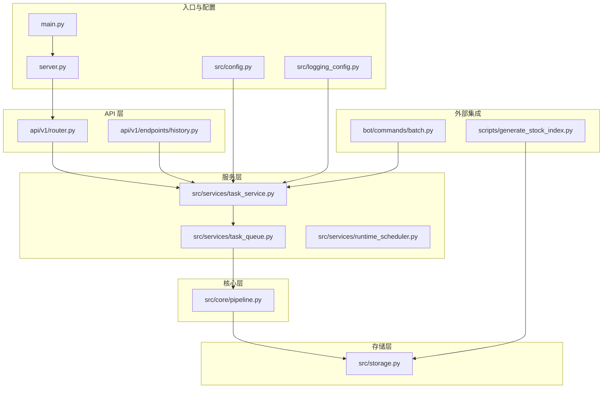
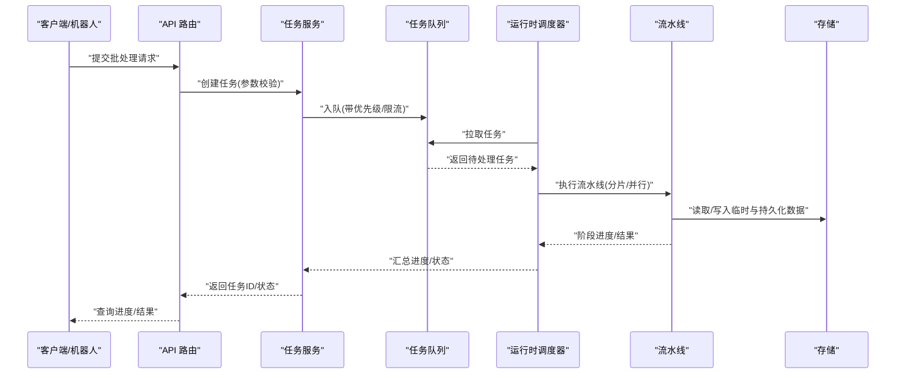
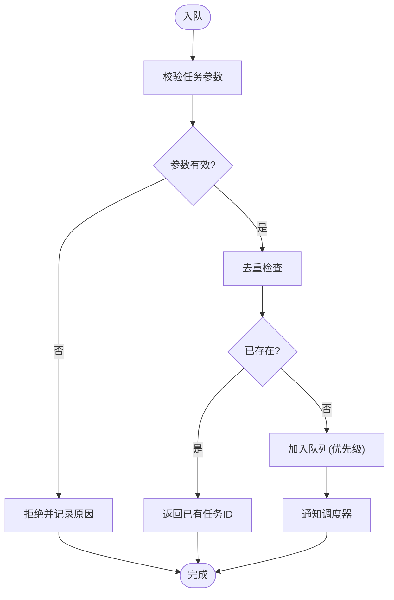
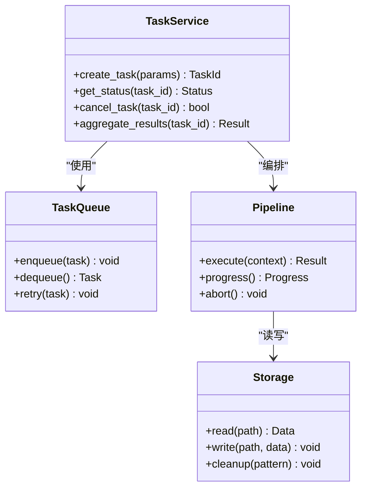
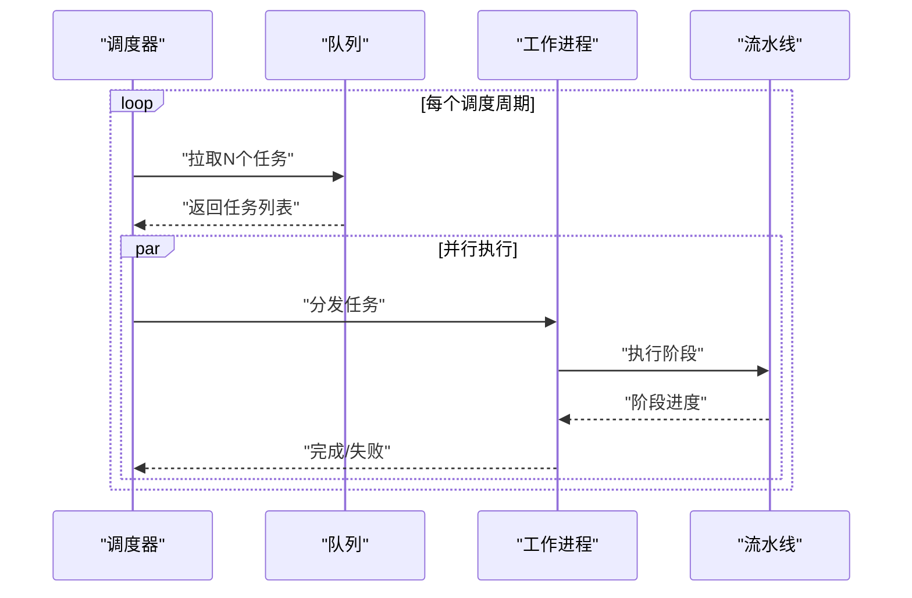
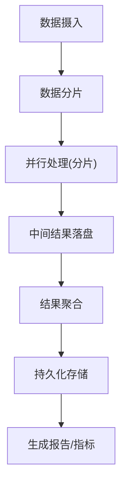
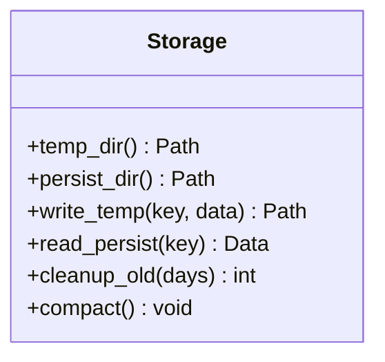
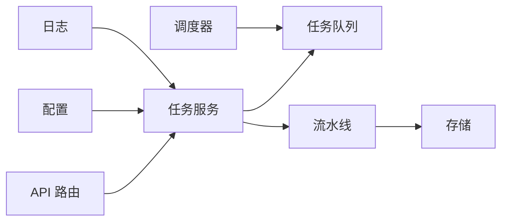

# 批量数据处理管道

<cite>
**本文引用的文件**   
- [main.py](file://main.py)
- [server.py](file://server.py)
- [src/core/pipeline.py](file://src/core/pipeline.py)
- [src/services/task_queue.py](file://src/services/task_queue.py)
- [src/services/task_service.py](file://src/services/task_service.py)
- [src/services/runtime_scheduler.py](file://src/services/runtime_scheduler.py)
- [src/storage.py](file://src/storage.py)
- [src/config.py](file://src/config.py)
- [src/logging_config.py](file://src/logging_config.py)
- [api/v1/router.py](file://api/v1/router.py)
- [api/v1/endpoints/history.py](file://api/v1/endpoints/history.py)
- [bot/commands/batch.py](file://bot/commands/batch.py)
- [scripts/generate_stock_index.py](file://scripts/generate_stock_index.py)
- [tests/test_task_service.py](file://tests/test_task_service.py)
- [tests/test_runtime_scheduler.py](file://tests/test_runtime_scheduler.py)
</cite>

## 目录
1. [简介](#简介)
2. [项目结构](#项目结构)
3. [核心组件](#核心组件)
4. [架构总览](#架构总览)
5. [详细组件分析](#详细组件分析)
6. [依赖关系分析](#依赖关系分析)
7. [性能考虑](#性能考虑)
8. [故障排查指南](#故障排查指南)
9. [结论](#结论)
10. [附录](#附录)

## 简介
本文件面向“批量数据处理管道”，聚焦于系统如何处理大规模历史数据与批量分析任务。内容涵盖：
- 数据分片、并行处理与结果聚合机制
- 批处理管道的架构设计，包括任务调度、进度跟踪与错误恢复
- 数据存储策略（临时存储、持久化存储与清理）
- 性能优化技术（内存管理、I/O 优化与并发控制）
- 批处理任务的配置方法与监控手段
- 常见问题排查指南

该文档旨在帮助开发者与运维人员快速理解并高效使用系统的批处理能力。

## 项目结构
仓库采用多模块组织方式，批处理相关能力主要分布在以下位置：
- API 层：提供触发批处理的接口与状态查询
- 服务层：任务队列、任务编排、运行时调度
- 核心层：流水线（Pipeline）定义与执行
- 存储层：统一的数据存取与清理策略
- 工具脚本：索引生成与批量导入辅助
- 测试：覆盖关键路径的稳定性验证

图表来源
- [api/v1/router.py](file://api/v1/router.py)
- [api/v1/endpoints/history.py](file://api/v1/endpoints/history.py)
- [src/services/task_queue.py](file://src/services/task_queue.py)
- [src/services/task_service.py](file://src/services/task_service.py)
- [src/services/runtime_scheduler.py](file://src/services/runtime_scheduler.py)
- [src/core/pipeline.py](file://src/core/pipeline.py)
- [src/storage.py](file://src/storage.py)
- [main.py](file://main.py)
- [server.py](file://server.py)
- [src/config.py](file://src/config.py)
- [src/logging_config.py](file://src/logging_config.py)
- [bot/commands/batch.py](file://bot/commands/batch.py)
- [scripts/generate_stock_index.py](file://scripts/generate_stock_index.py)

章节来源
- [main.py](file://main.py)
- [server.py](file://server.py)
- [src/config.py](file://src/config.py)
- [src/logging_config.py](file://src/logging_config.py)

## 核心组件
- 任务队列（TaskQueue）：负责任务入队、出队、重试与去重，支持优先级与限流。
- 任务服务（TaskService）：对外暴露创建、查询、取消批处理任务的能力，协调队列与流水线。
- 运行时调度器（RuntimeScheduler）：基于时间或事件触发批处理任务，支持周期性与一次性任务。
- 流水线（Pipeline）：定义数据读取、分片、转换、分析与聚合的执行图，支持并行与容错。
- 存储（Storage）：统一的读写封装，包含临时目录、持久化目录与清理策略。
- 配置（Config）：集中管理批处理参数（并发度、分片大小、超时、重试次数等）。
- 日志（Logging）：结构化日志与指标输出，便于追踪与监控。

章节来源
- [src/services/task_queue.py](file://src/services/task_queue.py)
- [src/services/task_service.py](file://src/services/task_service.py)
- [src/services/runtime_scheduler.py](file://src/services/runtime_scheduler.py)
- [src/core/pipeline.py](file://src/core/pipeline.py)
- [src/storage.py](file://src/storage.py)
- [src/config.py](file://src/config.py)
- [src/logging_config.py](file://src/logging_config.py)

## 架构总览
批处理管道以“任务驱动”的方式运行：API 或外部命令触发任务创建，调度器按策略派发至队列，消费者从队列取出任务并执行流水线；流水线内部对数据进行分片、并行处理与结果聚合，最终落盘并更新任务状态。

图表来源
- [api/v1/router.py](file://api/v1/router.py)
- [api/v1/endpoints/history.py](file://api/v1/endpoints/history.py)
- [src/services/task_service.py](file://src/services/task_service.py)
- [src/services/task_queue.py](file://src/services/task_queue.py)
- [src/services/runtime_scheduler.py](file://src/services/runtime_scheduler.py)
- [src/core/pipeline.py](file://src/core/pipeline.py)
- [src/storage.py](file://src/storage.py)

## 详细组件分析

### 任务队列（TaskQueue）
职责与特性：
- 支持优先级队列与令牌桶限流，避免突发流量压垮下游
- 任务状态机：待处理、进行中、成功、失败、重试中
- 重试策略：指数退避、最大重试次数、死信队列
- 去重键：防止重复提交相同任务

图表来源
- [src/services/task_queue.py](file://src/services/task_queue.py)

章节来源
- [src/services/task_queue.py](file://src/services/task_queue.py)

### 任务服务（TaskService）
职责与特性：
- 创建任务：接收 API 请求，构造任务上下文（范围、策略、资源限制）
- 查询任务：获取进度、阶段耗时、错误信息
- 取消任务：支持中断正在执行的流水线阶段
- 聚合结果：合并分片结果，生成最终报告/数据集

图表来源
- [src/services/task_service.py](file://src/services/task_service.py)
- [src/services/task_queue.py](file://src/services/task_queue.py)
- [src/core/pipeline.py](file://src/core/pipeline.py)
- [src/storage.py](file://src/storage.py)

章节来源
- [src/services/task_service.py](file://src/services/task_service.py)

### 运行时调度器（RuntimeScheduler）
职责与特性：
- 周期性扫描队列，按并发上限拉取任务
- 支持 Cron 表达式与简单间隔两种模式
- 健康检查：监控消费者存活与背压情况
- 优雅关闭：等待任务完成或安全中止

图表来源
- [src/services/runtime_scheduler.py](file://src/services/runtime_scheduler.py)
- [src/services/task_queue.py](file://src/services/task_queue.py)
- [src/core/pipeline.py](file://src/core/pipeline.py)

章节来源
- [src/services/runtime_scheduler.py](file://src/services/runtime_scheduler.py)

### 流水线（Pipeline）
职责与特性：
- 数据分片：按时间窗口、标的集合或文件大小切分
- 并行处理：每片独立计算，支持线程/进程池
- 中间结果：落盘到临时目录，失败可断点续跑
- 结果聚合：按规则合并分片结果，生成最终输出

图表来源
- [src/core/pipeline.py](file://src/core/pipeline.py)
- [src/storage.py](file://src/storage.py)

章节来源
- [src/core/pipeline.py](file://src/core/pipeline.py)

### 存储（Storage）
职责与特性：
- 临时存储：用于中间结果与缓存，支持自动清理
- 持久化存储：用于最终结果与归档，支持版本与压缩
- 清理策略：基于时间、大小或保留策略定期清理
- 一致性：写入原子性、校验和与回滚

图表来源
- [src/storage.py](file://src/storage.py)

章节来源
- [src/storage.py](file://src/storage.py)

### 配置（Config）
关键批处理参数：
- 并发度：队列消费者数量、流水线并行度
- 分片大小：每条任务的数据切片粒度
- 超时与重试：单阶段超时、全局超时、重试次数
- 存储策略：临时目录生命周期、保留天数、压缩开关

章节来源
- [src/config.py](file://src/config.py)

### 日志（Logging）
- 结构化日志：任务ID、阶段、耗时、错误堆栈
- 指标输出：队列长度、吞吐、延迟分布
- 审计追踪：操作人、触发源、变更摘要

章节来源
- [src/logging_config.py](file://src/logging_config.py)

## 依赖关系分析
批处理管道各组件之间的依赖如下：
- API 路由依赖任务服务
- 任务服务依赖任务队列与流水线
- 流水线依赖存储
- 调度器依赖任务队列
- 配置与日志被广泛引用

图表来源
- [api/v1/router.py](file://api/v1/router.py)
- [src/services/task_service.py](file://src/services/task_service.py)
- [src/services/task_queue.py](file://src/services/task_queue.py)
- [src/core/pipeline.py](file://src/core/pipeline.py)
- [src/storage.py](file://src/storage.py)
- [src/config.py](file://src/config.py)
- [src/logging_config.py](file://src/logging_config.py)

章节来源
- [api/v1/router.py](file://api/v1/router.py)
- [src/services/task_service.py](file://src/services/task_service.py)
- [src/services/task_queue.py](file://src/services/task_queue.py)
- [src/core/pipeline.py](file://src/core/pipeline.py)
- [src/storage.py](file://src/storage.py)
- [src/config.py](file://src/config.py)
- [src/logging_config.py](file://src/logging_config.py)

## 性能考虑
- 内存管理
  - 分片大小与并发度联动，避免 OOM
  - 中间结果采用流式写入与分页读取
  - 大对象及时释放，减少峰值内存
- I/O 优化
  - 顺序写优先，随机读通过索引加速
  - 压缩与分块存储，降低磁盘占用与网络传输
  - 预取与缓存热点数据
- 并发控制
  - 令牌桶限流，保护上游数据源与下游存储
  - 背压机制：当队列积压时自动降速
  - 隔离不同租户/策略的任务，避免相互影响
- 批处理优化
  - 增量更新：仅处理新增/变更数据
  - 幂等设计：重复提交不产生副作用
  - 断点续跑：失败后从最近检查点恢复

[本节为通用指导，不直接分析具体文件]

## 故障排查指南
常见问题与定位方法：
- 任务堆积
  - 检查队列长度与消费者健康
  - 查看是否触发限流或背压
  - 确认下游依赖（数据库/外部 API）可用性
- 任务失败
  - 查看阶段日志与错误堆栈
  - 检查重试次数与死信队列
  - 验证输入数据完整性与格式
- 存储问题
  - 检查临时目录空间与权限
  - 确认清理策略未误删活跃数据
  - 校验持久化文件的完整性
- 性能退化
  - 观察 CPU/内存/IO 指标
  - 调整分片大小与并发度
  - 启用更细粒度的日志与指标

章节来源
- [tests/test_task_service.py](file://tests/test_task_service.py)
- [tests/test_runtime_scheduler.py](file://tests/test_runtime_scheduler.py)

## 结论
本批处理管道通过“任务驱动+流水线执行”的架构，实现了大规模历史数据的分片、并行处理与结果聚合。配合任务队列、调度器与存储策略，系统在可靠性、可扩展性与性能方面具备良好基础。建议在生产环境中结合监控与告警，持续优化并发与分片策略，确保稳定高效的批处理能力。

[本节为总结性内容，不直接分析具体文件]

## 附录

### 触发与调用方式
- API 触发：通过 HTTP 接口提交批处理任务，支持查询进度与结果
- 机器人命令：通过聊天机器人发送批量分析指令
- 脚本工具：使用脚本生成索引或批量导入数据

章节来源
- [api/v1/endpoints/history.py](file://api/v1/endpoints/history.py)
- [bot/commands/batch.py](file://bot/commands/batch.py)
- [scripts/generate_stock_index.py](file://scripts/generate_stock_index.py)