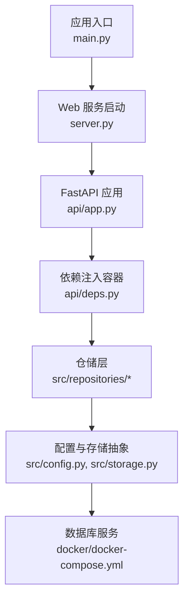
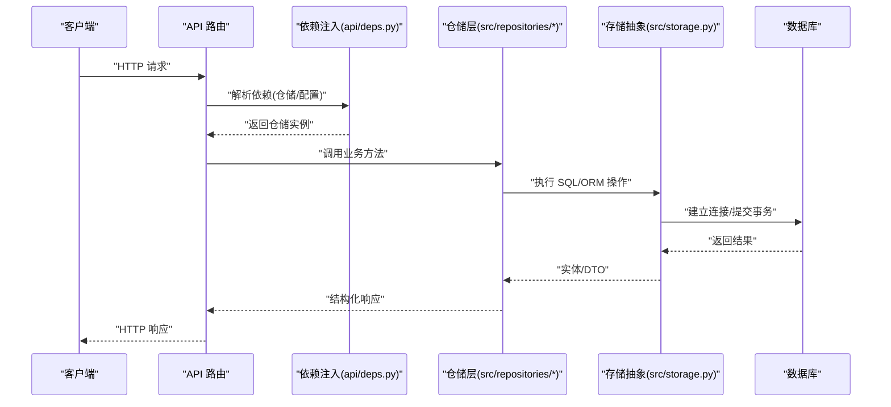
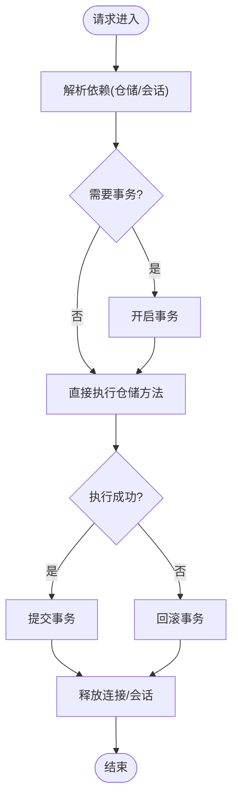
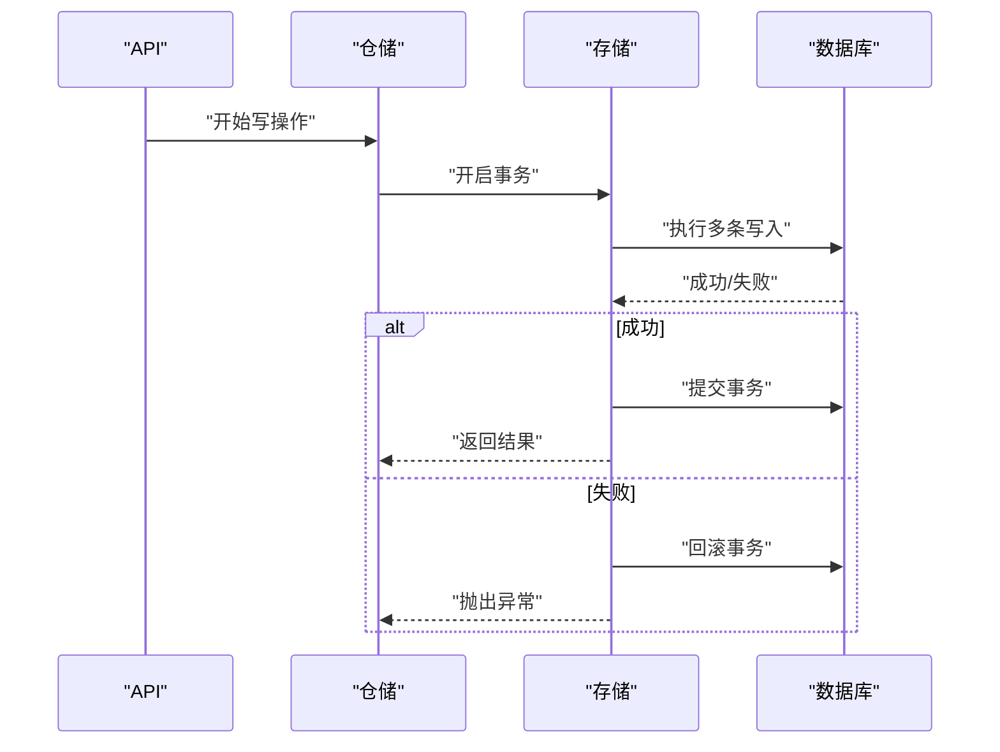
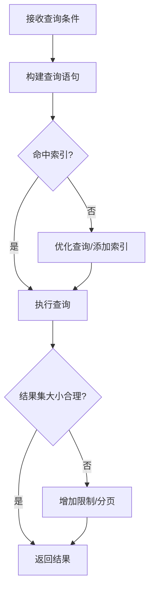
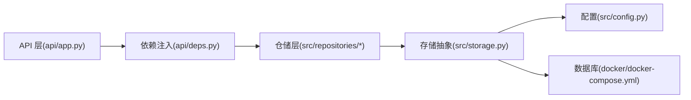

# 数据库数据流

<cite>
**本文引用的文件**   
- [main.py](file://main.py)
- [server.py](file://server.py)
- [api/app.py](file://api/app.py)
- [api/deps.py](file://api/deps.py)
- [src/config.py](file://src/config.py)
- [src/storage.py](file://src/storage.py)
- [src/repositories/__init__.py](file://src/repositories/__init__.py)
- [src/repositories/stock_repo.py](file://src/repositories/stock_repo.py)
- [src/repositories/alert_repo.py](file://src/repositories/alert_repo.py)
- [src/repositories/analysis_repo.py](file://src/repositories/analysis_repo.py)
- [src/repositories/backtest_repo.py](file://src/repositories/backtest_repo.py)
- [src/repositories/intelligence_repo.py](file://src/repositories/intelligence_repo.py)
- [src/repositories/portfolio_repo.py](file://src/repositories/portfolio_repo.py)
- [src/repositories/decision_signal_repo.py](file://src/repositories/decision_signal_repo.py)
- [src/repositories/decision_signal_outcome_repo.py](file://src/repositories/decision_signal_outcome_repo.py)
- [src/repositories/skill_opinion_sample_repo.py](file://src/repositories/skill_opinion_sample_repo.py)
- [src/repositories/skill_opinion_outcome_repo.py](file://src/repositories/skill_opinion_outcome_repo.py)
- [docker/docker-compose.yml](file://docker/docker-compose.yml)
</cite>

## 目录
1. [简介](#简介)
2. [项目结构](#项目结构)
3. [核心组件](#核心组件)
4. [架构总览](#架构总览)
5. [详细组件分析](#详细组件分析)
6. [依赖关系分析](#依赖关系分析)
7. [性能考虑](#性能考虑)
8. [故障排查指南](#故障排查指南)
9. [结论](#结论)
10. [附录](#附录)

## 简介
本文件聚焦于系统与数据库之间的数据交互流程，围绕 ORM 映射、事务管理、查询优化与一致性保障展开。文档同时覆盖数据访问层（Repository 模式）、连接池管理、查询构建器、索引设计、读写分离、迁移管理、备份恢复以及监控告警等实践建议，帮助读者全面理解并优化该项目的数据库数据流。

## 项目结构
系统采用分层架构：API 层通过依赖注入获取仓储实例，仓储层封装对数据库的 CRUD 操作，底层由配置与存储模块统一维护连接与生命周期。关键入口包括应用启动、服务装配与数据库初始化。

**图示来源** 
- [main.py](file://main.py)
- [server.py](file://server.py)
- [api/app.py](file://api/app.py)
- [api/deps.py](file://api/deps.py)
- [src/config.py](file://src/config.py)
- [src/storage.py](file://src/storage.py)
- [docker/docker-compose.yml](file://docker/docker-compose.yml)

**章节来源**
- [main.py](file://main.py)
- [server.py](file://server.py)
- [api/app.py](file://api/app.py)
- [api/deps.py](file://api/deps.py)
- [src/config.py](file://src/config.py)
- [src/storage.py](file://src/storage.py)
- [docker/docker-compose.yml](file://docker/docker-compose.yml)

## 核心组件
- 应用与服务启动：负责创建 Web 框架实例、挂载路由、注册中间件与生命周期钩子。
- 依赖注入：集中提供仓储实例、配置对象与数据库会话，确保请求级隔离与资源释放。
- 仓储层：按领域划分（股票、分析、回测、情报、组合、决策信号、技能意见等），对外暴露统一的增删改查接口。
- 配置与存储：统一管理数据库连接参数、连接池策略、ORM 引擎与模型定义。
- 外部数据库：通过容器编排提供服务化部署与可观测性支撑。

**章节来源**
- [api/app.py](file://api/app.py)
- [api/deps.py](file://api/deps.py)
- [src/repositories/__init__.py](file://src/repositories/__init__.py)
- [src/config.py](file://src/config.py)
- [src/storage.py](file://src/storage.py)

## 架构总览
下图展示从 HTTP 请求到数据库写入/读取的完整链路，强调依赖注入与仓储封装的作用。

**图示来源** 
- [api/app.py](file://api/app.py)
- [api/deps.py](file://api/deps.py)
- [src/repositories/__init__.py](file://src/repositories/__init__.py)
- [src/storage.py](file://src/storage.py)

## 详细组件分析

### 仓储层（Repository）设计与实现
仓储层按领域拆分，每个仓储类封装特定实体的数据访问逻辑，向上暴露清晰的接口，向下屏蔽 SQL/ORM 细节。典型职责包括：
- 单条/批量插入、更新、删除
- 条件查询、分页、排序
- 复杂聚合与关联查询
- 事务边界控制（在仓储或调用方决定）

```mermaid
classDiagram
class StockRepo {
+get_by_code(code)
+list_with_filters(filters)
+batch_upsert(records)
}
class AlertRepo {
+create(alert)
+query_active()
+update_status(id, status)
}
class AnalysisRepo {
+save_analysis(data)
+get_by_id(id)
+list_by_stock(stock_code)
}
class BacktestRepo {
+save_run(run)
+get_runs(filter)
+delete_old(days)
}
class IntelligenceRepo {
+upsert_intel(intel)
+search(query)
}
class PortfolioRepo {
+save_snapshot(snapshot)
+get_latest(code)
}
class DecisionSignalRepo {
+create(signal)
+list_by_strategy(strategy)
}
class DecisionSignalOutcomeRepo {
+record_outcome(signal_id, outcome)
+stats_by_signal()
}
class SkillOpinionSampleRepo {
+add_sample(sample)
+list_samples(limit)
}
class SkillOpinionOutcomeRepo {
+record_outcome(sample_id, outcome)
+aggregate_stats()
}
```

**图示来源** 
- [src/repositories/stock_repo.py](file://src/repositories/stock_repo.py)
- [src/repositories/alert_repo.py](file://src/repositories/alert_repo.py)
- [src/repositories/analysis_repo.py](file://src/repositories/analysis_repo.py)
- [src/repositories/backtest_repo.py](file://src/repositories/backtest_repo.py)
- [src/repositories/intelligence_repo.py](file://src/repositories/intelligence_repo.py)
- [src/repositories/portfolio_repo.py](file://src/repositories/portfolio_repo.py)
- [src/repositories/decision_signal_repo.py](file://src/repositories/decision_signal_repo.py)
- [src/repositories/decision_signal_outcome_repo.py](file://src/repositories/decision_signal_outcome_repo.py)
- [src/repositories/skill_opinion_sample_repo.py](file://src/repositories/skill_opinion_sample_repo.py)
- [src/repositories/skill_opinion_outcome_repo.py](file://src/repositories/skill_opinion_outcome_repo.py)

**章节来源**
- [src/repositories/__init__.py](file://src/repositories/__init__.py)
- [src/repositories/stock_repo.py](file://src/repositories/stock_repo.py)
- [src/repositories/alert_repo.py](file://src/repositories/alert_repo.py)
- [src/repositories/analysis_repo.py](file://src/repositories/analysis_repo.py)
- [src/repositories/backtest_repo.py](file://src/repositories/backtest_repo.py)
- [src/repositories/intelligence_repo.py](file://src/repositories/intelligence_repo.py)
- [src/repositories/portfolio_repo.py](file://src/repositories/portfolio_repo.py)
- [src/repositories/decision_signal_repo.py](file://src/repositories/decision_signal_repo.py)
- [src/repositories/decision_signal_outcome_repo.py](file://src/repositories/decision_signal_outcome_repo.py)
- [src/repositories/skill_opinion_sample_repo.py](file://src/repositories/skill_opinion_sample_repo.py)
- [src/repositories/skill_opinion_outcome_repo.py](file://src/repositories/skill_opinion_outcome_repo.py)

### 依赖注入与连接生命周期
- 依赖注入容器负责在请求上下文中提供仓储实例与数据库会话，确保每次请求拥有独立的连接与会话。
- 生命周期管理包括连接获取、事务开启/提交/回滚、异常时回滚与连接释放。

**图示来源** 
- [api/deps.py](file://api/deps.py)
- [src/storage.py](file://src/storage.py)

**章节来源**
- [api/deps.py](file://api/deps.py)
- [src/storage.py](file://src/storage.py)

### ORM 映射与模型定义
- 模型与表结构一一对应，字段类型、约束与索引在模型中声明。
- 关联关系（一对一、一对多、多对多）通过外键与关系属性表达。
- 常用查询通过 ORM 构建器完成，避免手写 SQL 带来的不一致风险。

```mermaid
erDiagram
STOCK {
string code PK
string name
timestamp created_at
timestamp updated_at
}
ALERT {
uuid id PK
string stock_code FK
text content
enum status
timestamp created_at
}
ANALYSIS {
uuid id PK
string stock_code FK
json payload
timestamp created_at
}
BACKTEST_RUN {
uuid id PK
string strategy
json params
timestamp started_at
timestamp finished_at
}
INTELLIGENCE {
uuid id PK
string source
json data
timestamp created_at
}
PORTFOLIO_SNAPSHOT {
uuid id PK
string portfolio_id FK
json holdings
timestamp recorded_at
}
DECISION_SIGNAL {
uuid id PK
string stock_code FK
string strategy FK
json signal_data
timestamp created_at
}
DECISION_SIGNAL_OUTCOME {
uuid id PK
string signal_id FK
json outcome
timestamp recorded_at
}
SKILL_OPINION_SAMPLE {
uuid id PK
string stock_code FK
json sample
timestamp created_at
}
SKILL_OPINION_OUTCOME {
uuid id PK
string sample_id FK
json outcome
timestamp recorded_at
}
```

**图示来源** 
- [src/storage.py](file://src/storage.py)

**章节来源**
- [src/storage.py](file://src/storage.py)

### 事务管理与一致性
- 写操作默认包裹在事务中，保证原子性与一致性。
- 读操作可选择只读事务以提升并发性能。
- 异常自动回滚，避免部分写入导致的数据不一致。

**图示来源** 
- [api/deps.py](file://api/deps.py)
- [src/storage.py](file://src/storage.py)

**章节来源**
- [api/deps.py](file://api/deps.py)
- [src/storage.py](file://src/storage.py)

### 查询构建与优化
- 使用 ORM 查询构建器生成高效 SQL，避免 N+1 问题。
- 针对高频查询字段建立合适索引，减少全表扫描。
- 分页与过滤结合，限制返回数据集大小。
- 复杂查询拆分为多次简单查询，必要时引入缓存。

**图示来源** 
- [src/repositories/stock_repo.py](file://src/repositories/stock_repo.py)
- [src/repositories/alert_repo.py](file://src/repositories/alert_repo.py)
- [src/repositories/analysis_repo.py](file://src/repositories/analysis_repo.py)

**章节来源**
- [src/repositories/stock_repo.py](file://src/repositories/stock_repo.py)
- [src/repositories/alert_repo.py](file://src/repositories/alert_repo.py)
- [src/repositories/analysis_repo.py](file://src/repositories/analysis_repo.py)

## 依赖关系分析
仓储层依赖存储抽象，存储抽象依赖配置与数据库驱动；API 层通过依赖注入获取仓储实例，形成清晰的分层解耦。

**图示来源** 
- [api/app.py](file://api/app.py)
- [api/deps.py](file://api/deps.py)
- [src/repositories/__init__.py](file://src/repositories/__init__.py)
- [src/storage.py](file://src/storage.py)
- [src/config.py](file://src/config.py)
- [docker/docker-compose.yml](file://docker/docker-compose.yml)

**章节来源**
- [api/app.py](file://api/app.py)
- [api/deps.py](file://api/deps.py)
- [src/repositories/__init__.py](file://src/repositories/__init__.py)
- [src/storage.py](file://src/storage.py)
- [src/config.py](file://src/config.py)
- [docker/docker-compose.yml](file://docker/docker-compose.yml)

## 性能考虑
- 连接池管理：合理设置最大连接数、空闲超时与回收策略，避免连接泄漏与耗尽。
- 索引设计：为高频过滤、排序与关联字段建立复合索引，定期评估慢查询日志。
- 查询优化：避免 SELECT *，使用投影字段；分页查询限制返回行数；批量写入减少往返次数。
- 读写分离：读多写少场景下，将读请求路由至只读副本，提升吞吐。
- 缓存策略：热点数据使用内存缓存（如 Redis），降低数据库压力。
- 批处理与异步：非实时任务采用队列异步处理，削峰填谷。

[本节为通用指导，不直接分析具体文件]

## 故障排查指南
- 连接异常：检查数据库服务状态、网络连通性与凭据配置；查看连接池是否耗尽。
- 事务失败：定位回滚点，检查约束冲突与死锁；必要时缩短事务范围。
- 慢查询：启用慢查询日志，分析执行计划，补充缺失索引或改写 SQL。
- 数据不一致：核对事务边界与重试策略；引入幂等键与补偿机制。
- 监控告警：基于数据库指标（连接数、QPS、延迟、错误率）设置阈值告警。

**章节来源**
- [src/storage.py](file://src/storage.py)
- [api/deps.py](file://api/deps.py)

## 结论
本项目通过仓储层与依赖注入实现了清晰的数据访问边界，结合 ORM 与事务管理保障了数据一致性与可维护性。在生产环境中，应持续优化索引与查询、完善连接池与监控告警，并根据业务特征引入读写分离与缓存策略，以获得更高的可用性与性能。

[本节为总结性内容，不直接分析具体文件]

## 附录
- 迁移管理：建议使用版本化迁移脚本，配合 CI/CD 自动化执行，确保环境一致性。
- 备份恢复：制定全量与增量备份策略，定期演练恢复流程，验证 RTO/RPO。
- 监控告警：采集数据库关键指标，结合日志与链路追踪，快速定位问题根因。

[本节为通用指导，不直接分析具体文件]